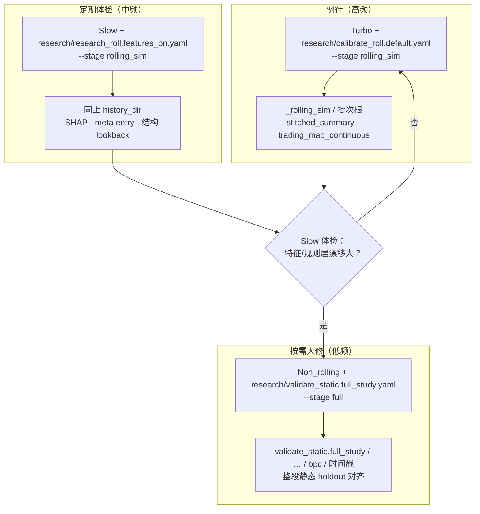
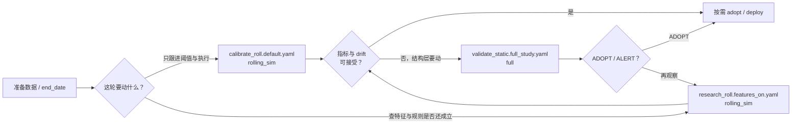
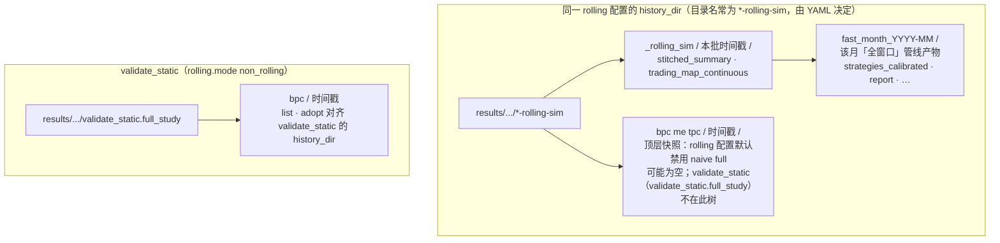
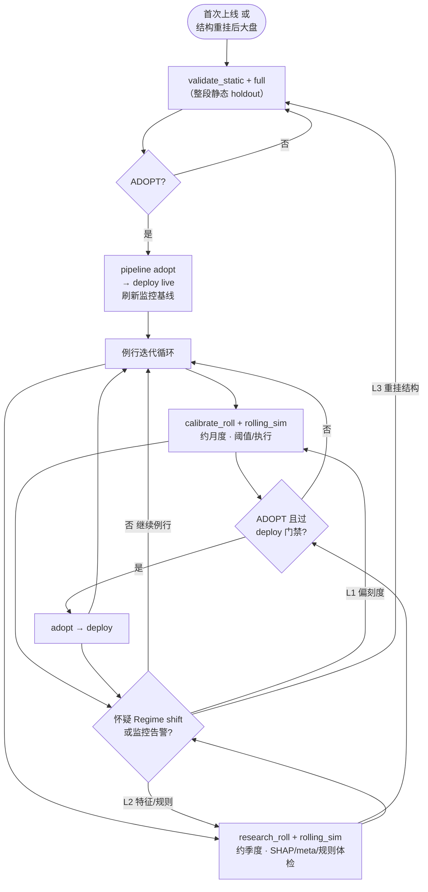

# ML Trading Bot（中文）

**English**: [README.md](README.md)  
**文档索引**: [docs/README.md](docs/README.md)

## 框架目的

核心地位的是启发式规则（domain heuristics）：
比如“订单流真空不要做突破”、“BPC pullback 太浅是假形态”，这些本质上是你的交易哲学
框架里所有的树模型、lift 曲线、Failure Analysis，都是在帮你验证这些启发式在历史数据上的有效性，而不是要推翻它们

大概率启发式规则本身（比如订单流/结构/VP 场景）是对的，框架的职责是在历史上反证“在哪些子场景成功率明显掉下去”，然后把这些场景排除掉或降权。

## 底层哲学
[系统哲学基础](docs/archive/architecture/系统哲学基础.md)
[顶级量化团队.md](docs/archive/architecture/顶级量化团队.md)
[一道一宿速正道](docs/archive/architecture/一道一宿速正道.md)

[A/B/C 三层收益结构 · 战略框架](docs/strategy/ABC三层收益结构_战略框架_CN.md)

**Alpha不是收集的，是雕刻的。**

本仓库包含因子研究、模型训练、回测与数据管道的生产就绪组件。**本 README 保持尽量短**：只提供"命令 + 推荐流程 + 入口文档链接"。研究解释型内容已迁移到独立文档。

---

## 快速开始

1) 创建虚拟环境（conda、venv 等）并激活  
2) 以可编辑模式安装：

```bash
pip install -e .[dev]
```

3) （可选但推荐）安装 Git pre-commit 钩子：

```bash
make install-hooks
```

4) 查看命令：

```bash
mlbot --help
mlbot analyze --help
mlbot train --help
mlbot diagnose --help
mlbot optimize --help
mlbot data --help
```

---

## 数据管道（下载 → 转换 → 训练）

```bash
mlbot data download \
  --symbols BTCUSDT,ETHUSDT \
  --start-year 2021 \
  --start-month 1

mlbot data convert

# 或一次性跑完
mlbot data pipeline \
  --symbols BTCUSDT,ETHUSDT
```

### Universe 驱动（多币种批量：下载 + 转 parquet）

`pipeline-universe` 会按 universe 配置解析 symbol 列表，并 **下载后立刻转成 Parquet**：

```bash
mlbot data pipeline-universe --no-docker \
  --universe-config config/download/crypto_4h_token_universe_groups.yaml \
  --universe-groups highcap \
  --start-year 2026 \
  --start-month 1
```

### 扩展数据：市值（Market Cap）与资金费率（Funding Rate）

#### 1) 市值快照（CoinGecko）

```bash
export COINGECKO_API_KEY='...'

mlbot data update-market-cap \
  --config config/market_cap/market_cap.yaml \
  --max-age-days 7 \
  --no-docker
```

结果默认落盘：
- `data/market_cap/<SYMBOL>.parquet`
- `data/market_cap/market_cap_manifest.json`

#### 2) Binance 资金费率（按月 ZIP → Parquet）

```bash
# 方式 A：Universe 驱动（推荐）
mlbot data download-funding-rate --no-docker \
  --universe-config config/download/crypto_4h_token_universe_groups.yaml \
  --universe-groups highcap \
  --start-year 2026 --start-month 1

# 方式 B：手工传 symbol 列表
mlbot data download-funding-rate --no-docker \
  --symbols BTCUSDT,ETHUSDT \
  --start-year 2026 --start-month 1 \
  --progress-every 10
```

结果默认落盘：
- ZIP：`data/funding_rate/zip/`
- Parquet：`data/funding_rate/parquet/`

#### 3) Binance 未平仓合约（OI）

```bash
mlbot data download-open-interest \
  --universe-config config/download/crypto_4h_token_universe_groups.yaml \
  --universe-groups highcap \
  --start-year 2026 --start-month 1 --progress-every 1
```

---

## 推荐工作流（当前主线：`mlbot pipeline run`）

> **当前主线不再以 `mlbot train final` 为入口**。研究/回测/阈值调优/Event Backtest 全部走统一管线 `mlbot pipeline run`（底层会调训练/评估的各子步）。
>
> **最全命令手册**（含所有 stage / flag / 跨月续跑 / 稳定性实验）：
> - `docs/z实验_005_统一研究/A快速启动命令.md`（最新，长文档）
> - `docs/z实验_005_统一研究/实施文档_01_2024牛市_5x趋势骑乘.md`（5x 趋势骑乘实验 + turbo 调阈值工作流）

### 活跃策略 & 对应管线 YAML

**当前 `config/strategies/` 顶层活跃目录**（不含 `bad-candidates/`）：

- **经典单腿链**（prefilter / gate / direction、`TradeIntent` 路径）：`bpc`、`tpc`、`me`。
- **多腿独立策略**（自有 inventory；研究 adopt / deploy / 实盘见下文 **§6.1**）：`chop_grid`、`dual_add_trend`。

**`bad-candidates/`**：历史实验与废弃候选（含 `fbf`、`fer`、`msr`、`lv`、`lottery`、以及 **`srb` / `crf` 等当前主树副本**）；日常主线以顶层五目录为准。

| 策略目录         | 语义                                                                 | 默认 `meta.yaml` timeframe |
| ---------------- | -------------------------------------------------------------------- | -------------------------- |
| `bpc`            | Breakout → Pullback → Continuation（趋势延续）                       | `120T`                     |
| `tpc`            | Trend → Pullback → Continuation（趋势回踩）                          | `120T`                     |
| `me`             | Momentum Expansion（动量扩张）                                       | `120T`                     |
| `chop_grid`      | 语义 chop + 盒过滤下的小网格段（**多腿**；`research/calibrate_roll.default.yaml` + archetypes）       | `120T`                     |
| `dual_add_trend` | 趋势置信 + chop/盒过滤下双腿加仓（**多腿**；`research/calibrate_roll.default.yaml` + archetypes） | `120T`                     |

**常用 pipeline YAML**：研究入口按策略包放在 **`config/strategies/<slug>/research/`**（`calibrate_roll.default.yaml` → `research_roll.features_on.yaml` → `pipeline.yaml` 探测顺序；可通过顶层 `extends:` 指向共享片段）。**`mlbot pipeline`** 省略 `--config` 且带 `--strategy <slug>` 时按上述顺序解析；既无 `--strategy` 也无 `--config` 时默认 **`config/pipelines/pcm_orchestrate_2h.yaml`**（PCM 多策略编排）。仓库级统一模板（显式引用或工具默认）为 **`config/pipelines/research_pipeline.yaml`**。

> **与 `live/highcap/config/strategies/` 的分工**：实盘镜像里是同名的 **`meta.yaml` / `features.yaml` / `archetypes/` / 根引擎 yaml**（由 `scripts/deploy_config_to_live.py` 同步）；**不会**把 `research/*.yaml` 管线入口拷到 `live/…`——那些文件留在 **`config/strategies/<slug>/research/`** 供研究与脚本引用。

#### 全局 / 多策略

| YAML                                       | 用途                                     | `rolling.mode`   |
| ------------------------------------------ | ---------------------------------------- | ---------------- |
| `config/pipelines/pcm_orchestrate_2h.yaml` | PCM 多策略编排（2H）：联合回测 / slot 等 | `slow_realistic` |

#### `bpc` — `config/strategies/bpc/`（镜像：`live/highcap/config/strategies/bpc/`）

| YAML                                        | 用途                                           | `rolling.mode`         |
| ------------------------------------------- | ---------------------------------------------- | ---------------------- |
| `config/strategies/bpc/research/calibrate_roll.default.yaml` | calibrate_roll：阈值链 + execution 优化（默认探测首项） | `turbo_fixed_features` |
| `config/strategies/bpc/research/research_roll.features_on.yaml`  | research_roll：季度结构 + 月度快变量                  | `slow_realistic`       |

#### `tpc` — `config/strategies/tpc/`（镜像：`live/highcap/config/strategies/tpc/`）

| YAML                                        | 用途   | `rolling.mode`         |
| ------------------------------------------- | ------ | ---------------------- |
| `config/strategies/tpc/research/calibrate_roll.default.yaml` | calibrate_roll  | `turbo_fixed_features` |
| `config/strategies/tpc/research/research_roll.features_on.yaml`  | research_roll | `slow_realistic`       |

#### `me` — `config/strategies/me/`（镜像：`live/highcap/config/strategies/me/`）

| YAML                                       | 用途   | `rolling.mode`         |
| ------------------------------------------ | ------ | ---------------------- |
| `config/strategies/me/research/calibrate_roll.default.yaml` | calibrate_roll  | `turbo_fixed_features` |
| `config/strategies/me/research/research_roll.features_on.yaml`  | research_roll | `slow_realistic`       |

#### `chop_grid` — `config/strategies/chop_grid/`（镜像：`live/highcap/config/strategies/chop_grid/`）

| YAML                                              | 用途                      | `rolling.mode`         |
| ------------------------------------------------- | ------------------------- | ---------------------- |
| `config/strategies/chop_grid/research/calibrate_roll.default.yaml` | 多腿网格 rolling（calibrate_roll） | `turbo_fixed_features` |
| `config/strategies/chop_grid/research/research_roll.features_on.yaml`  | 多腿 research_roll                | `slow_realistic`       |

#### `dual_add_trend` — `config/strategies/dual_add_trend/`（镜像：`live/highcap/config/strategies/dual_add_trend/`）

| YAML                                                   | 用途                          | `rolling.mode`         |
| ------------------------------------------------------ | ----------------------------- | ---------------------- |
| `config/strategies/dual_add_trend/research/calibrate_roll.default.yaml` | 多腿双腿策略 rolling（calibrate_roll） | `turbo_fixed_features` |
| `config/strategies/dual_add_trend/research/research_roll.features_on.yaml`  | 多腿 research_roll                    | `slow_realistic`       |

#### `bad-candidates/`（策略树 + 专用管线；非顶层主线）

| YAML                                                                            | 用途                               | `rolling.mode`         |
| ------------------------------------------------------------------------------- | ---------------------------------- | ---------------------- |
| `config/strategies/bad-candidates/crf/research/calibrate_roll.default.yaml`                      | CRF / calibrate_roll（`box_structure_f`）   | `turbo_fixed_features` |
| `config/strategies/srb/research/turbo_2024bull_thresholds.yaml`  | SRB / turbo                        | `turbo_fixed_features` |
| `config/strategies/srb/research/turbo_2024bull_quickstrike.yaml` | SRB quickstrike / turbo            | `turbo_fixed_features` |
| `config/strategies/srb/research/research_roll.features_on.yaml`                       | SRB 慢模式                         | `slow_realistic`       |
| `config/strategies/bad-candidates/*/research/*.yaml`                            | 其它历史实验（FBF / FER / MSR 等） | （见各文件）           |

> `turbo_fixed_features`：特征集固定，只做阈值链 / execution 优化 / 月度滚动 → **快**。  
> `slow_realistic`：每季度重做结构快照（prefilter/gate 元算法），月度 rolling_calibration 调阈值 → **稳**。

### 0) 质量闸门（推荐）

```bash
# 关键特征门禁（本机 pytest，需已 pip install -e ".[dev]" 或装齐 tests 依赖）
make test-key-features-all
# 特征依赖 / 注册表合同检查（不启 Docker）
mlbot diagnose feature-contract --no-docker
# 可选：归一化合同 + 报告（轻量）
make norm-contract
```

**说明**：`make test-key-features-all` 会在仓库内跑 **VPIN / WPT / Volume Profile Volatility** 等与未来泄漏、多资产相关的 pytest；若某条因环境缺库失败，可先只跑 `feature-contract` / `norm-contract`。  
`make start-docker` 只做 **Docker 守护进程**；`docker ps` 里若出现 **`api-server-api` 等 Restarting**，一般是你本机 **别的 compose/项目** 的容器，**不是** 本仓库 `Makefile` 里用于 `DOCKER_IMAGE`（`docker/build-gpu.sh`）的训练镜像——应在对应项目里 `docker logs` 排查。本书与数据/诊断相关的流水多数可用 **`--no-docker`**，不依赖该容器。

### 1) 数据下载 + Feature Store 构建

```bash
# 一次性拉齐 highcap universe 所有 symbol 的 2H OHLCV（含 1min 原始）
mlbot data pipeline-universe --no-docker \
  --universe-config config/download/crypto_4h_token_universe_groups.yaml \
  --universe-groups highcap \
  --start-year 2023 --start-month 1

# 资金费率 + OI（可选但推荐）
mlbot data download-funding-rate --no-docker \
  --universe-config config/download/crypto_4h_token_universe_groups.yaml \
  --universe-groups highcap \
  --start-year 2023 --start-month 1

mlbot data download-open-interest \
  --universe-config config/download/crypto_4h_token_universe_groups.yaml \
  --universe-groups highcap \
  --start-year 2023 --start-month 1

# Feature Store（按策略构建；新增/修改特征后必须重跑对应策略）
mlbot feature-store build --no-docker \
  --config config/strategies/bpc \
  --universe-config config/download/crypto_4h_token_universe_groups.yaml \
  --universe-groups highcap \
  --timeframe 120T \
  --start-date 2023-01-01 --end-date 2026-03-01 \
  --warmup-months 6
```

> 同一 feature layer（hash 相同）会跨策略复用；新增/改特征代码或 `config/feature_dependencies.yaml` 后需要对相关策略重跑 `feature-store build`。

### 2) 研究管线（calibrate_roll 快路径：只调阈值，不搜特征）

```bash
# BPC calibrate_roll（推荐先跑单月验证，再开全 rolling；也可省略 --config 与 --strategy bpc 配对使用）
mlbot pipeline run --all \
  --config config/strategies/bpc/research/calibrate_roll.default.yaml \
  --stage fast_month --month 2024-09 --skip-shap 2>&1 | tee log.bpc.txt

# 全量 rolling_sim（从 holdout_start 到 end_date 自动逐月）
mlbot pipeline run --all \
  --config config/strategies/bpc/research/calibrate_roll.default.yaml \
  --stage rolling_sim --skip-shap 2>&1 | tee log.bpc.txt

# ME / TPC 同理：换成对应 research/calibrate_roll.default.yaml
mlbot pipeline run --all \
  --config config/strategies/me/research/calibrate_roll.default.yaml \
  --stage rolling_sim --skip-shap

# CRF（bad-candidates）
mlbot pipeline run --all \
  --config config/strategies/bad-candidates/crf/research/calibrate_roll.default.yaml \
  --stage rolling_sim --skip-shap
```

**常用 stage**（分层调试）：

```
prefilter → gate → entry_filter → slow_snapshot → execution_opt → event_backtest
fast_month   # 仅复盘某个月（默认：前 3 个月调阈值，回测当月）
rolling_sim  # 按月滚动：结构快照 / 阈值调优 / 当月回测 / 月间仓位续跑
pcm_joint    # PCM 联合仲裁
pcm_slot_grid  # Slot 网格（替代手动改 constitution.yaml）
```

### 3) 研究管线（slow 慢模式：季度结构 + 月度阈值 — 上线前完整验证）

```bash
mlbot pipeline run --all \
  --config config/strategies/bpc/research/research_roll.features_on.yaml \
  --stage rolling_sim 2>&1 | tee log.bpc.slow.txt

# 单月复盘（调试用）
mlbot pipeline run --all \
  --config config/strategies/bpc/research/research_roll.features_on.yaml \
  --stage fast_month --month 2024-09
```

### 4) 事件回测（Event Backtest）

> 用真实 1min bar 逐笔触发信号，与实盘时序严格对齐；支持 execution 参数 grid search。

```bash
# A. 走 pipeline（最省事，会自动跑 execution 优化并写回 archetypes/execution.yaml）
mlbot pipeline run --all \
  --config config/strategies/bpc/research/calibrate_roll.default.yaml \
  --stage event_backtest --skip-shap

# B. 直接跑单次 event_backtest（最快）
python scripts/event_backtest.py \
  --strategy bpc,me,tpc,srb,crf \
  --start-date 2024-01-01 --end-date 2026-03-01 \
  --strategies-root config/strategies \
  --data-path data/parquet_data \
  --fast

# C. 对已有实验重放（不重训，带交易地图）
mlbot pipeline event-backtest \
  --strategy bpc --hash 20260313_234448 \
  --sym-r 1.0:0.5:4.0 --promote    # 同步网格优化 execution，并写回实验目录
```

### 5) 慢管线产物对比（`slow_candidate_report.py`）

> 当 **`research_roll.features_on`** 管线跑完后，用这组命令把「每月 Prefilter/Gate/EF 选了什么 / 和 **`calibrate_roll.default`** 基线的差异 / 月度 R delta」一张表产出来，**无需重跑**。

```bash
RUN=results/bpc/research_roll.features_on/_rolling_sim/20260423_223716
BASE=results/bpc/<calibrate_roll-history-dir>/_rolling_sim/<baseline_ts>
OUT=results/bpc/slow_candidate_reports/${RUN##*/}
mkdir -p "$OUT"

PYTHONPATH=. python3 scripts/slow_candidate_report.py review \
  --slow-run-dir "$RUN" --baseline-run-dir "$BASE" \
  --strategy bpc --output "$OUT/review.md"

# 其他子命令：manifest / drift / digest / consensus
```

### 6) Adopt & Deploy（研究 → 实盘）

```bash
# 列出历史实验：扫描 config/strategies/*；默认每个包按 calibrate_roll → research_roll → pipeline 探测顺序取首个入口
mlbot pipeline list --all
# 列齐包内每一份 research 管线入口（便于对比 calibrate_roll 与 research_roll 两套 results）
mlbot pipeline list --all --list-all-profiles
# 同上，并包含 bad-candidates/<pkg>/ 子包
mlbot pipeline list --all --include-bad-candidates

# 指定 YAML：脚本会先打印「配置文件路径 + rolling.mode + history_dir」，再列实验
mlbot pipeline list --all --config config/pipelines/pcm_orchestrate_2h.yaml
mlbot pipeline list --strategy bpc

# 采纳指定实验（把该实验的 config 写回 config/strategies/<name>/）
mlbot pipeline adopt 20260313_234448 --strategy bpc

# 删除实验（须与 list 使用同一套 history_dir；推荐显式 --config）
# mlbot pipeline delete --strategy bpc --status error --config config/strategies/bpc/research/research_roll.features_on.yaml --dry-run
# mlbot pipeline delete --strategy bpc --timestamp 20260501_012111 --config config/strategies/bpc/research/calibrate_roll.default.yaml

# 研究仓 → 实盘 highcap
mlbot pipeline deploy --diff --strategy bpc
mlbot pipeline deploy --deploy --strategy bpc --git-commit
```

#### Turbo / Slow / Non_rolling：分工与流程图

以下为 **BPC 研究管线**（`config/strategies/bpc/research/*.yaml`）的推荐阅读顺序；ME / TPC 等策略包结构相同。CLI 约定：**`calibrate_roll.default.yaml` / `research_roll.features_on.yaml` 日常用 `--stage rolling_sim`**；**`validate_static.full_study.yaml` 用默认 `--stage full`**（整段静态 holdout）。`mlbot pipeline run` 与 `python scripts/auto_research_pipeline.py` 等价时需带齐同一套参数。

**图 1 — 总览：三条管线如何接到一起**



**图 2 — 操作顺序：从新一期研究到是否 adopt**



**图 3 — 目录心智（避免看错结果）**



#### 首次上线、例行迭代与 Regime shift（图 4）

**算力体感**：一次 **`research_roll.features_on` + `rolling_sim`** 通常要跑 **多个月 × 每层阶段（含 SHAP / meta 等）**，Wall time 上往往比**单轮** **`validate_static.full_study` + `full`**（`rolling.mode: non_rolling`）更「重」；后者则是 **整段静态 holdout 上的一口气大跑**，更适合 **首版基线 / 结构重挂后的整段对齐**。两者**谁更吃机器**与月份数、数据量有关；**分工**仍以前文 **图 1–2**（research_roll 体检特征与规则、validate_static 整段重对齐）为准，不矛盾。

**图 4 — 首次上线、例行迭代、Regime shift**



- **首次**：冷启动或 regime 后「新版」首次落盘，多半走 **`validate_static.full_study` → adopt → deploy**（与 **图 2** 中「结构层要动」一致）。
- **例行**：**calibrate_roll** 跟刻度，**research_roll** 做体检；过关再 **deploy**。
- **Regime shift**：先 **L1 加密/加强 calibrate_roll**，仍不对再 **L2 research_roll**，仍要改结构再 **L3 validate_static** 回到左侧大环。

#### 实验目录 vs `rolling_sim` 批次根（怎么用）

同一份 **`calibrate_roll.default` / `research_roll.features_on`** YAML 的 `output.history_dir` 下，产物分三层心智，**不要混读**：

| 层级                           | 路径模式                                                                                               | 用途                                                                                                                                                                                                                                                                                                                                                                                                                                                                |
| ------------------------------ | ------------------------------------------------------------------------------------------------------ | ------------------------------------------------------------------------------------------------------------------------------------------------------------------------------------------------------------------------------------------------------------------------------------------------------------------------------------------------------------------------------------------------------------------------------------------------------------------- |
| **rolling_sim 批次根**         | `{history_dir}/_rolling_sim/<本批YYYYMMDD_HHMMSS>/`                                                    | **`--stage rolling_sim` 一次 invocation 的批次根**：`monthly_ledger.jsonl`、`stitched_summary.json`、`trading_map_continuous.html`、跨月拼接索引等。                                                                                                                                                                                                                                                                                                                |
| **批次内的「月度全窗口」子树** | `{history_dir}/_rolling_sim/<本批>/<fast_month_YYYY-MM>/`（及 slow 模式下可能的 `slow_snapshot_*` 等） | 每个月 rolling 推进时，在该目录下跑完**当月标定窗内整套阶段**（等价于嵌在滚动里的一棵「月粒度 full 产物」：`strategies_calibrated/`、各层 plateau、事件回测、实验配置副本等），**不是** CLI 顶层 `--stage full`。                                                                                                                                                                                                                                                   |
| **顶层策略快照目录**           | `{history_dir}/<策略键>/<YYYYMMDD_HHMMSS>/`                                                            | **单机全段 `full` 的典型落点**（`report.json` 等）。当前 **`calibrate_roll.default.yaml` / `research_roll.features_on.yaml` 已禁止默认 `full`**，该路径常为空或仅出现在例外（如 `--locked-prefilter-override` 子进程、历史遗留）。**整段静态 holdout** 用 **`validate_static.full_study.yaml`**，目录在 **`validate_static.full_study`**。**多腿策略**在 `rolling_sim` 收尾时可能把最后一月的 `strategies_calibrated` **拷贝**到 `{history_dir}/<策略>/<本批时间戳>/strategies/<策略>/` 供 `pipeline adopt`，见下文 §6.1。 |

**命令行为**：当你执行带 `--config` 的 `mlbot pipeline list …`（或对某策略包扫描到的等价入口），脚本在打印完上述「快照」表格后，若磁盘上存在 `_rolling_sim`，会在末尾多一行类似：

`ℹ️ rolling_sim 批次根 …: results/…/_rolling_sim/ （约 N 个时间戳子目录）`

含义：**`_rolling_sim/` 下每一子目录是一次滚动批次的根**；其内部的 **`fast_month_*`**（或等价前缀）才是按月拆开的子实验树，与顶层的 `{history_dir}/<策略键>/<ts>/` **不是同一棵树**。

**日常怎么用**：

1. **看滚动结果 / 连续交易图**：进 `{history_dir}/_rolling_sim/<本批>/`，读 `stitched_summary.json`、打开 `trading_map_continuous.html`；需排查单月细节时进对应 **`fast_month_<YYYY-MM>/`**。  
2. **认 adopt / 删快照（顶层 `list` 表）**：对 **`validate_static`（validate_static.full_study）** 仍看 `{validate_static.full_study}/<策略>/<ts>/`；对 **BPC 类 calibrate_roll / research_roll** 若顶层无新快照， adopt 流程以你们当前脚本约定为准（多腿见 §6.1）。  
3. **查 rolling 跑完了哪几次批次**：对 `list` 末尾 ℹ️ 路径 `ls` 各批次根即可。

```bash
# 将路径换成你 list 末尾 ℹ️ 里那一行（或 research_roll.features_on.yaml 里 history_dir + /_rolling_sim）
ROLL_ROOT=results/bpc/research_roll.features_on/_rolling_sim
ls -la "$ROLL_ROOT"
# 只看批次名与时间排序
ls -1 "$ROLL_ROOT" | tail

# 进入某一批次再看月度/阶段子目录（具体结构随流水线版本可能变化）
LEDGER_TS=20260423_223716
find "$ROLL_ROOT/$LEDGER_TS" -maxdepth 3 -type d | head -40
```

与 slow 产物对比脚本衔接：§5「慢管线产物对比」里的 `--slow-run-dir` 指向的正是 **`_rolling_sim` 下某一批次目录**（例如 `…/_rolling_sim/20260423_223716`），不是 `{history_dir}/bpc/<ts>/`。

**与 `mlbot server` 的关系**：`rolling-dashboard` 在根路径上**已经**按 `results/` 提供静态文件，和 `mlbot server --dir results` 是同一类服务，并多了 `/dashboard` 汇总页。**同一端口不要同时开两个**；日常直接开 `rolling-dashboard` 即可，不必再开 `server`。

**浏览器汇总看板（已实现）**：本地扫描全部 `results/**/_rolling_sim/<批次>/`，表格展示 `stitched_summary.json` 中的月数 / stitched R / trades，并链到 `trading_map_continuous.html`、`trading_map_stitched.html` 等；**其它 URL 与单独开 `mlbot server --dir results` 完全一致**（例如 `/me/calibrate_roll.default/_rolling_sim/<批次>/trading_map_continuous.html`）。

```bash
# 默认 http://127.0.0.1:8008/dashboard ，静态根为仓库下 results/
mlbot rolling-dashboard --port 8008
# 或
PYTHONPATH=. python scripts/rolling_dashboard_server.py --port 8008 --root results

# 只看某一策略顶层目录（路径第一段），例如 me、bpc
# 浏览器打开 http://127.0.0.1:8008/dashboard?strategy=me
# 路径子串筛选（大小写不敏感）
# http://127.0.0.1:8008/dashboard?q=calibrate_roll.default

# 机器可读索引
curl -s http://127.0.0.1:8008/api/rolling-ledgers.json | head
```

端口占用时可加 `--force`（依赖 psutil，与 `mlbot server --force` 同类）。

**CLI-only 的补充**：若将来加入 `mlbot pipeline list-rolling-ledgers`，则只对 `_rolling_sim/` 打纯文本索引；当前浏览器看板已覆盖「列举 + 关键链接」需求。

### 6.1) 多腿策略（`chop_grid` / `dual_add_trend`）：配置、研究 adopt、同步实盘、多腿进程

与 BPC 同一套心智：**研究配置**在 `config/strategies/<策略名>/research/calibrate_roll.default.yaml`、`research_roll.features_on.yaml`、`validate_static.*.yaml`；**`archetypes/*.yaml`** 为可推广 / 可 adopt 的薄层；**实盘镜像**在 `live/highcap/config/strategies/<策略名>/`（用下方 deploy 同步）。

**1）离线诊断（不跑 pipeline）**

```bash
# chop_grid：语义 chop + 盒过滤 + 网格段回测（读 research/calibrate_roll.default.yaml + archetypes）
python scripts/diagnose_chop_grid.py \
  --start 2024-01-01 --end 2024-12-31 \
  --symbols BTCUSDT,ETHUSDT --timeframe 2h

# dual_add_trend：趋势段 + 双腿加仓仿真（读 research/calibrate_roll.default.yaml + archetypes；trend 列来自注册特征同一公式）
python scripts/diagnose_dual_add_trend.py \
  --start 2024-01-01 --end 2024-12-31 \
  --symbols BTCUSDT,ETHUSDT --timeframe 2h
# 可选：覆盖 trend 用的多周期回看（默认与 feature_dependencies 中 trend_confidence_f 的 horizons 一致时可不写）
# python scripts/diagnose_dual_add_trend.py ... --trend-return-horizons 3,5,10
```

**2）研究管线 + rolling 产物（便于 adopt）**

多腿 calibrate_roll 示例配置：`config/strategies/chop_grid/research/calibrate_roll.default.yaml`（其中 `output.history_dir` 决定结果根目录）。跑完 **`rolling_sim`** 后，流水线会把**最后一月**的 `strategies_calibrated/<策略>/` 拷到：

`{history_dir}/<策略名>/<本次 run 时间戳>/strategies/<策略名>/`

这样 **`mlbot pipeline adopt`** 能按与 BPC 相同的目录约定找到 `strategies/<策略>/archetypes`（多腿 adopt **不**走 BPC 的 locked prefilter/gate 校验，以复制为主）。

**重要：`list` / `adopt` / `diff` 的实验根目录 = 当前 `--config` 里的 `output.history_dir`。**  
若 rolling 用的是 `config/strategies/chop_grid/research/calibrate_roll.default.yaml`（`history_dir` 在 `results/chop_grid/...`），则 **`mlbot pipeline adopt` 必须带同一 `--config`**；若省略 `--config` 且带了 `--strategy chop_grid`，CLI 会解析到该策略 `research/calibrate_roll.default.yaml`；若既未指定 `--strategy` 也未指定 `--config`，默认读 `config/pipelines/pcm_orchestrate_2h.yaml`（勿混用其它根的 `history_dir`，否则会报「实验不存在」）。

```bash
CHOP_CFG=config/strategies/chop_grid/research/calibrate_roll.default.yaml
DUAL_CFG=config/strategies/dual_add_trend/research/calibrate_roll.default.yaml

mlbot pipeline run --strategy chop_grid --config "$CHOP_CFG" \
  --stage rolling_sim --skip-shap

mlbot pipeline run --strategy dual_add_trend --config "$DUAL_CFG" \
  --stage rolling_sim --skip-shap

# 列出 / 采纳须与上面同一 --config
mlbot pipeline list --strategy chop_grid --config "$CHOP_CFG"
mlbot pipeline adopt <时间戳> --strategy chop_grid --config "$CHOP_CFG"

mlbot pipeline list --strategy dual_add_trend --config "$DUAL_CFG"
mlbot pipeline adopt <时间戳> --strategy dual_add_trend --config "$DUAL_CFG"
```

**3）研究仓 → 实盘 highcap（多腿会 diff/deploy 全部 archetypes + 根 engine yaml）**

```bash
mlbot pipeline deploy --diff --strategy chop_grid
mlbot pipeline deploy --deploy --strategy chop_grid --git-commit

mlbot pipeline deploy --diff --strategy dual_add_trend
mlbot pipeline deploy --deploy --strategy dual_add_trend --git-commit
```

**4）多腿实盘 / 影子进程（与 `scripts/run_live.py` 分离）**

```bash
# 默认 shadow + parquet 回放；bar 源还可选 websocket / feature-store
python scripts/run_multi_leg_live.py --mode shadow --bar-source parquet --once

# 指定策略与策略 yaml（默认已指向 config/strategies/...）
python scripts/run_multi_leg_live.py \
  --strategies chop_grid \
  --chop-grid-config config/strategies/chop_grid/research/calibrate_roll.default.yaml \
  --once
```

密钥与账户隔离见脚本首屏 docstring（推荐 `MULTI_LEG_BINANCE_FUTURES_*`）；更完整的 live 事件流说明见 `docs/architecture/live_stream/README.md`。

**5）推荐：`mlbot multileg` 一站式命令（新增）**

> 说明：多腿研究/回放/门禁/监控现在有独立命令组，但阶段语义尽量和 BPC 单腿对齐。
> 多腿没有 BPC 的 `prefilter → gate → direction → entry_filter → event_backtest` 单仓信号链，
> 对应位置由 `regime/profile calibration → grid_backtest/dual_add_backtest → multi_leg_gate` 替代。

阶段映射：

- BPC **`calibrate_roll.default`**：固定生产特征/archetypes，只做月度阈值重标定；多腿同 profile：固定 `features.yaml`、`archetypes/prefilter.yaml`、`archetypes/execution.yaml`，做 regime/profile/执行参数校准。
- BPC **`research_roll.features_on`**：季度慢快照，允许结构/特征搜索，再接月度滚动；多腿：**`research_roll.features_on`** — 季度检查 regime/engine/profile 是否需要刷新，再接月度 profile 校准，但不走 BPC 的 prefilter/gate adoption 链。
- BPC **`validate_static.*`**：整段静态 holdout 单次验收，用 `comparison/deploy_gate` 看是否可上线；多腿：整段静态 holdout（`rolling.mode: non_rolling`）跑 `grid_backtest`/`dual_add_backtest`，上线结论交给 `mlbot multileg gate`。
- BPC `event_backtest`：单仓入场事件回测；多腿 `grid_backtest`/`dual_add_backtest`：持仓库存、加仓、强平、gross/net exposure 的专用回测。
- BPC `deploy_gate` / `report.html`：单腿上线候选报告；多腿 `multi_leg_gate_report.html`：多腿上线门禁，额外看 forced/risk stop/segment 稳定性。
- BPC 漂移体检：**calibrate_roll / research_roll** 结果 + retrain triggers；多腿漂移体检：`mlbot multileg monitor`，分 regime/feature/profile/risk 四类判断是调阈值、看特征，还是下线。

目录映射：

- BPC 管线入口：`calibrate_roll.default.yaml`、`research_roll.features_on.yaml`、`validate_static.*.yaml`（`config/strategies/bpc/research/`）
- 多腿管线入口：`config/strategies/chop_grid/research/` 与 `config/strategies/dual_add_trend/research/` 下同名三类 profile
- BPC 策略结构：`features.yaml`、`archetypes/*`、`labels_*`、prefilter/gate/entry 配置
- 多腿策略结构：`features.yaml`、上述 `research/*.yaml`、`archetypes/prefilter.yaml`、`archetypes/execution.yaml`、`archetypes/regime_thresholds.yaml`
- 多腿研究入口与 BPC 对齐：`threshold_calibration` 控流程，`strategies.<name>.kpi_gates` 控 KPI，候选阈值/执行组合由策略类型分发到对应代码实现。
- `scripts/pipeline/config.py` 与 `src/config/multileg_config.py` 现共享 `src/config/strategy_layout.py` 的 YAML/`extends` 解析；`mlbot multileg validate-config` 复用 `src/config/strategy_validation.py` 的策略包校验。

```bash
# 1) 校验多腿编排 + 宪法对齐
mlbot multileg validate-config \
  --config config/pipelines/multileg_orchestrate_2h.yaml

# 2) 单策略研究：--profile 与 research 文件名一致（dotted stem，无 turbo/slow 缩写）
mlbot multileg research \
  --strategy chop_grid \
  --profile calibrate_roll.default \
  --stage auto \
  --dry-run

mlbot multileg research \
  --strategy chop_grid \
  --profile validate_static.full_study \
  --stage auto

# 2a) calibrate_roll 日常：固定特征/结构，滚动校准 profile/execution
mlbot multileg research \
  --strategy chop_grid \
  --profile calibrate_roll.default \
  --stage auto
mlbot multileg replay \
  --config config/pipelines/multileg_orchestrate_2h.yaml \
  --strategy chop_grid \
  --months 2025-01:2025-12
mlbot multileg gate \
  --config config/pipelines/multileg_orchestrate_2h.yaml \
  --run-dir results/multi_leg/rolling-sim/_rolling_sim/<run_id>
mlbot multileg monitor \
  --config config/pipelines/multileg_orchestrate_2h.yaml \
  --run-id <run_id> \
  --lookback-months 6

# 2b) research_roll 体检：慢结构/特征体检 + 滚动校准
mlbot multileg research \
  --strategy chop_grid \
  --profile research_roll.features_on \
  --stage auto
mlbot multileg replay \
  --config config/strategies/chop_grid/research/research_roll.features_on.yaml \
  --strategy chop_grid \
  --months 2025-01:2025-12
mlbot multileg gate \
  --config config/strategies/chop_grid/research/research_roll.features_on.yaml \
  --run-dir results/chop_grid/research_roll.features_on/_rolling_sim/<run_id>
mlbot multileg monitor \
  --config config/strategies/chop_grid/research/research_roll.features_on.yaml \
  --run-id <run_id> \
  --lookback-months 6

# 2c) validate_static 上线验收：整段静态 holdout，跑专用 engine backtest
mlbot multileg research \
  --strategy chop_grid \
  --profile validate_static.full_study \
  --stage auto
mlbot multileg gate \
  --config config/strategies/chop_grid/research/validate_static.full_study.yaml \
  --run-dir results/chop_grid/non-rolling-full-cycle
# validate_static 单次静态验收可不做漂移 monitor；漂移监控靠 calibrate_roll / research_roll 的 rolling run。

# 3) 全量 rolling 回放（无前视，类似把过去按月当成真实上线）
mlbot multileg replay \
  --config config/pipelines/multileg_orchestrate_2h.yaml \
  --all \
  --months 2024-01:2025-12

# 4) 上线门禁（基于某次 rolling run）
mlbot multileg gate \
  --config config/pipelines/multileg_orchestrate_2h.yaml \
  --run-dir results/multi_leg/rolling-sim/_rolling_sim/<run_id>

# 5) 健康监控（regime/feature/threshold/risk）
mlbot multileg monitor \
  --config config/pipelines/multileg_orchestrate_2h.yaml \
  --run-id <run_id> \
  --lookback-months 6

# 6) 影子 / 测试网运行
mlbot multileg shadow --bar-source feature-store --once
mlbot multileg live --mode testnet --bar-source feature-store
```

**6）开发回归测试命令（新增代码对应）**

```bash
# CLI 命令转发 + stage 暴露 + multileg 子命令
python -m pytest tests/unit/test_pipeline_new_commands.py -q

# 多腿命令组参数转发（validate/replay/gate/monitor/shadow/live）
python -m pytest tests/unit/test_multileg_cli_commands.py -q

# 多腿 calibration profiles 配置化加载（research/calibrate_roll.default.yaml -> pipeline）
python -m pytest tests/unit/test_multileg_profile_loading.py -q

# validate_static YAML 的配置继承与阶段对齐（rolling.mode non_rolling）
python -m pytest tests/unit/test_pipeline_config_extends.py -q

# 多腿 effective config 合并（research profile + archetypes 分层）
python -m pytest tests/unit/test_multileg_config_loader.py -q
```

**7）多腿上线日常操作手册（新增）**

- 文档：`docs/workflow/MULTILEG_DAILY_RUNBOOK_CN.md`
- 内容覆盖：日常巡检、周度重评估、上线门禁、影子/测试网切换、回滚与故障处置。

### 8) （可选）最终验收 & 最终训练模型

> 这两条命令对应 **nnmultihead / 传统 tree 最终模型的单次一致性验收**，**不是日常 rolling_sim 的替代**；日常研究用 §2-§5 的 rolling 工作流即可。

```bash
# 6 个月 Holdout 验收（只验收，不调参）
mlbot diagnose holdout-eval \
  --config config/strategies/bpc \
  --symbol BTCUSDT --timeframe 120T \
  --train-start-date 2024-01-01 \
  --holdout-start-date 2025-10-01 \
  --holdout-end-date 2026-03-31 \
  --output-root results/holdout_eval --deterministic --no-docker

# 全窗训练最终模型
mlbot train final \
  --config config/strategies/bpc \
  --symbol BTCUSDT --timeframe 120T \
  --start-date 2024-01-01 --end-date 2026-03-31 \
  --output-root models --deterministic --no-docker
```

### 9) 近期实验 & 分支路径（可选；不含 Nautilus — 已弃用）

#### 9.1 盒子特征（`box_structure_f`）+ CRF 立项

> 基础设施：`src/features/time_series/box_structure_features.py`（因果、滚动，26 列 `box_*`）  
> 诊断脚本（oracle vs causal 对照）：`scripts/diag_consolidation_structure.py --mode {oracle,causal}`  
> 方法与结论文档：
> - `docs/z实验_005_统一研究/box_features_causal_vs_oracle_20260424.md`
> - `docs/z实验_005_统一研究/CRF_CBC_structure_diagnosis_20260424.md`

CRF 策略跑法（box-based 双向均值回归）：

```bash
mlbot feature-store build --no-docker \
  --config config/strategies/bad-candidates/crf \
  --universe-config config/download/crypto_4h_token_universe_groups.yaml \
  --universe-groups highcap \
  --timeframe 120T \
  --start-date 2023-01-01 --end-date 2026-03-01 --warmup-months 6

mlbot pipeline run --all \
  --config config/strategies/bad-candidates/crf/research/calibrate_roll.default.yaml \
  --stage rolling_sim --skip-shap 2>&1 | tee log.crf.txt
```

SRB / BPC / ME 已把 `box_*` 作为 prefilter 草稿（`locked: false`），跑现有 **`calibrate_roll.default`** 管线即可生效。

#### 9.2 Pool-B + 语义组特征搜索（分支，非主线）

> **为什么树模型没有「原样上线」，主线改成「分层规则 + SRB / nnmultihead」？**  
> 不是否认树的研究价值，而是 **生产约束** 与 **架构选型** 不同：  
> 1) **可审计与可回滚**：整段 Boosting 推理在实盘上难逐项说明「为何此刻算通过」；`prefilter → gate → direction → execution` 一类 **YAML 分层** 可以按层 adopt、diff、关断和复盘，和 rolling / adopt 流程一致。  
> 2) **体制漂移与过拟合风险**：高维特征 + Pool-B / 语义组搜索很容易在回测窗内极靓、窗外脆弱；上线更需要 **显式边界**（locked 规则、held-out、多标的），规则层比单模型分数更容易收紧和统一。  
> 3) **树的角色后移**：树与 FGS 更适合做 **离线探矿**（哪些语义组、哪些列值得进特征集）；可泛化部分再抽象成规则模板（见 [`docs/architecture/strategies/树策略导出的可泛化规则.md`](docs/architecture/strategies/树策略导出的可泛化规则.md)），而不是把某颗 `model` 当红盒直接挂链上。  
> 因此 **`tree_strategies/`** 与 **`poolb-semantic-search`** 保留为 **分支与考古入口**；默认训练与部署仍走 `config/strategies/bpc` 等当代配置。

> **树直上相比「导出规则」可以图什么？**  
> - **表达力 / 近似无损**：集成树在单次推理里可堆叠大量 **轴对齐切分** 与 **特征交互**；`RuleFit` 等导出的 if/else 是 **可解释近似**，通常会丢掉原模型的曲面细节，规则条数膨胀也未必追得上。  
> - **迭代成本**：探索期换特征、重训、调校准阈值，往往 **改模型 artifact + 监控** 比维护一大坨手写 YAML **更快**（规则适合把已验证的语义 **冻结成契约**）。  
> - **数据驱动的细缝**：在难以事先命名的 regime 边界上，树能啃 **小区域模式**；纯导出规则要么覆盖不到，要么组合爆炸。  
> 实务上常见折中是 **外层分层门控（YAML）+ 内层树打分**，兼顾审计与表达力；纯「分数阈值裸奔」仍不推荐。

> **若将来仍要「整颗树」直接上线，需要额外盯什么？**  
> 是的：**拟合、正则化、回测** 都是核心，但还不够，建议按条打勾：  
> - **拟合 / 多重检验**：特征组搜索、Pool-B、多 seed 会放大「挑到最好窗」的概率；要有 **严格 holdout**、**rolling / walk-forward**、**多标的** 与 **冻结特征集后再训** 的独立复跑，不能只信单次全样本 Sharpe。  
> - **正则化与容量**：`num_leaves` / `min_data_in_leaf` / 采样、早停、单调约束（若有先验）等要 **和搜索空间一起** 标定；FGS 扩出来的列越多，越要用 **更保守的树复杂度** 或 **两段式**（先锁列再调树）。  
> - **回测诚实性**：成本与滑点、成交可行性、标签 **因果对齐**（避免未来函数）、样本外时间顺序；必要时与 **paper / shadow** 对照。  
> - **上线周边**：推理延迟与确定性、模型与特征版本 **与 feature-store 同步**、熔断与仓位上限、可观测性（至少能记录 top 贡献特征与分数分布漂移）。  
> 与主线分层规则相比，树直挂时 **「为何开仓」** 仍弱，上述项里 **回测与体制外验证** 的权重应更高；能规则化的门控仍建议保留一层 YAML，而不是纯分数阈值裸奔。

> **来源**：这套命令是为 **树模型 + prefilter 语义组** 时期沉淀的端到端工具（`analyze factor-eval` 生成 Pool-B → `diagnose feature-group-search` 做 A/B/C 分阶段搜索并写回 `features_suggested_*_poolb_semantic_*.yaml`）。实现集中在 `scripts/run_poolb_semantic_search.py`；A/B/C 预算与目录约定仍以当时写的说明为准：  
> [`docs/archive/guides/tree/FEATURE_GROUP_SEARCH_PRESETS_CN.md`](docs/archive/guides/tree/FEATURE_GROUP_SEARCH_PRESETS_CN.md)（同目录还有 `FEATURE_GROUP_SEARCH_TUNING_GUIDE_CN.md` 等）。

**策略怎么选**：`mlbot diagnose poolb-semantic-search` 的默认 `--strategies` 是 **`bpc,me,fer,lv`**（`src/cli/main.py`）。`scripts/run_poolb_semantic_search.py` 直接执行时默认仍是四个 **树策略短名**（`DEFAULT_STRATEGIES`）。

**Pool-B 工作流的配置路径**（仅 `poolb-semantic-search` / `run_poolb_semantic_search.py`；**`mlbot pipeline run` 等管线仍默认** `config/strategies/<策略名>/`，不变）：  
- 若存在 **`config/strategies/tree_strategies/<策略名>/`**（老树模型打包），则 factor-eval、feature-group-search 的 `--base-strategy-config` 与写回的 `features_suggested_*_poolb_semantic_*.yaml` **均使用该目录**。  
- 否则回退到 **`config/strategies/<策略名>/`**（如 `bpc`、`me`）。  

树策略目录已放回仓库：`config/strategies/tree_strategies/{compression_breakout,sr_breakout,sr_reversal_rr_reg_long,trend_following,...}`。若本地误删，可 `git checkout 3251e50^ -- config/strategies/tree_strategies` 从删除前父提交取回。

```bash
# 树策略（配置在 tree_strategies/ 下，无需再建符号链接）
mlbot diagnose poolb-semantic-search \
  --strategies compression_breakout \
  --symbol BTCUSDT --timeframe 240T \
  --start-date 2023-01-01 --end-date 2025-12-31 \
  --search-algo pipeline --expand-semantic-singletons \
  --regen-poolb --rerun-search
```

```bash
# 单跑 BPC（2H，与本文其它 BPC 示例一致）
mlbot diagnose poolb-semantic-search \
  --strategies bpc \
  --symbol BTCUSDT --timeframe 120T \
  --start-date 2024-01-01 --end-date 2025-04-30 \
  --search-algo pipeline --expand-semantic-singletons \
  --regen-poolb --rerun-search
```

> **当前团队口径（优先级）**  
> - **数据与门**：`prefilter` / `gate` 之后有效样本偏少时，**末端 NN、整棵决策树暂不直接上链**。  
> - **树的用途**：以 **SHAP 等离线筛特征** 为主；**Pool-B + 语义组特征搜索** 保持 **非主线**，用来判断 **特征是否值得进池**，不默认当产线模型。  
> - **实验分支**：个别「单策略直树」实验曾到 **Sharpe≈2** 量级，但 **并行分支过多** 会拖累复现与运维。  
> - **近期主线**：**先把分层规则路径跑通**（adopt / rolling / 上线闸门）；高 Sharpe 分支 **另册登记**，再决定是否 **只吸收特征或阈值进 `archetypes/`**，不与主线同等摊平。

#### 9.3 Locked 阈值调参（分支工具）

> 保持 locked 语义特征不变，只扫阈值；多窗口滚动评分。

```bash
python scripts/tune_locked_prefilter_thresholds.py \
  --strategy bpc \
  --end-dates 2025-10-01,2025-11-01,2025-12-01,2026-01-01,2026-02-01,2026-03-01 \
  --min-trades-target 60 --trade-penalty 0.002
```

> 当 `prefilter.yaml` 有 `locked: true` 规则时，`mlbot pipeline run` 会自动触发；缓存在 `results/locked_tuning/cache/`，加 `--disable-auto-locked-tuning` 可关闭。

#### 9.4 TaskSpec 驱动的 Tier0/Tier1 对比（nnmultihead，分支）

你问的“Tier0/Tier1 会如何影响训练？是不是跑两次看报告？”——**是的**，但需要做到两点才能可复盘：  
1) 每个 Tier 生成一个**具体可执行的 config 目录**（不直接靠“标签”）  
2) 用各自 config 训练出 model，再用统一流程评估（A-layer + system/e2e）  

##### 1) 先从 TaskSpec 生成派生 config（让 tiers 变成真实 features.yaml）

```bash
mlbot nnmultihead materialize-config-from-task-spec --no-docker \
  --task-spec config/tasks/task_spec.yaml \
  --base-config config/nnmultihead/path_primitives_4h_80h_min \
  --out-config results/derived_cfg/tier01
```

> `task_spec.yaml` 里通过 `feature_plan.tiers_enabled` + `tier_feature_files` 显式定义 Tier0/Tier1 的 feature nodes 列表。  

##### 2) 训练（TaskSpec-only：命令会自动 materialize 派生 config）

```bash
mlbot nnmultihead train --no-docker \
  --task-spec config/tasks/task_spec.yaml \
  --symbols BTCUSDT,ETHUSDT,BNBUSDT,SOLUSDT,XRPUSDT,ADAUSDT
```

##### 3) 跑主链路评估（predict → router → build-logs → e2e）（TaskSpec-only）

```bash
mlbot nnmultihead pipeline-3action-e2e --no-docker \
  --task-spec config/tasks/task_spec.yaml \
  --symbols BTCUSDT,ETHUSDT,BNBUSDT,SOLUSDT,XRPUSDT,ADAUSDT \
  --timeframe 240T \
  --start-date 2025-05-01 --end-date 2025-12-31 \
  --model <PATH_TO_MODEL_PT_FROM_TRAIN> \
  --returns-source rr_execution \
  --out results/nnmh_e2e/tier01
```

> **详细工作流文档**: 完整的命令序列、Gate 过滤说明、ET/FR 交易缺失原因分析等，见 [`docs/workflow/PIPELINE_WORKFLOW.md`](docs/workflow/PIPELINE_WORKFLOW.md)

##### 完整 NN Pipeline 工作流（固定流程）

**推荐使用一键脚本**（见 `scripts/run_full_pipeline.py`）：

```bash
python scripts/run_full_pipeline.py \
  --task-spec config/tasks/task_spec_highcap6_2024_202510.yaml \
  --symbols BTCUSDT,ETHUSDT \
  --timeframe 240T \
  --start-date 2024-01-01 \
  --end-date 2024-12-31 \
  --model results/nnmultihead/.../model.pt \
  --feature-store-layer nnmh_highcap6_240T_2024_with_reflexivity \
  --run-id pipeline_2024_reflexivity_validation
```

**手动执行步骤**（每一步都有日志输出，支持断点续传）：

1. **FeatureStore构建**（如果需要新特征）
2. **模型预测** → `preds/`
3. **Regime分类** → `physics_regime.parquet`
4. **构建Execution日志** → `logs_execution.parquet`
5. **应用Gate过滤** → `logs_execution_gated.parquet`
6. **添加反身性特征**（可选）→ `exec_logs/features/`
7. **构建Stage Logs** → `exec_logs/{preds,router,gate,execution,returns,features}/`
8. **聚合Canonical Log** → `execution_log.jsonl`
9. **生成E2E KPI报告** → `e2e_kpi_report.md`

详细命令和说明见 [`docs/workflow/PIPELINE_WORKFLOW.md`](docs/workflow/PIPELINE_WORKFLOW.md)

##### 3.1) Router 阈值：用"平坦高原"协议做稳健调参

> 目的：避免“找尖峰”导致的炼丹，优先选多窗口/bootstrapped 都稳的阈值组合。  
> 详细解释见：`docs/architecture/guides/THRESHOLD_PLATEAU_TUNING_PROTOCOL_CN.md`
>
> 说明：`mlbot nnmultihead pipeline-3action-e2e` 会在输出目录下自动写出
> `router_thresholds_baseline.json`（使用你传入的阈值覆盖 + 未传入则用 Router 默认值），
> 供 plateau 命令直接复用。
>
> 默认 tuned-threshold 流程已包含：**heuristic bounds**（防离谱阈值）与 **trend_rate 约束**（防 TREND 趋零）。

```bash
mlbot diagnose threshold-plateau --no-docker \
  --preds results/nnmh_e2e/tier01/preds \
  --logs  results/nnmh_e2e/tier01/logs_3action.parquet \
  --model <PATH_TO_MODEL_PT_FROM_TRAIN> \
  --baseline-json results/nnmh_e2e/tier01/router_thresholds_baseline.json \
  --out results/plateau/router3action_tier01_oos_v1 \
  --trend-rate-min 0.005 --trend-rate-penalty 2.0 \
  --heuristic-bounds --heuristic-qmin 0.05 --heuristic-qmax 0.95
```

**用法（推荐两步法）**

- **Step A：先跑一次 pipeline 产出 `preds/` + `logs_3action.parquet` + baseline thresholds**

```bash
mlbot nnmultihead pipeline-3action-e2e --no-docker \
  --task-spec config/tasks/task_spec.yaml \
  --symbols BTCUSDT,ETHUSDT,BNBUSDT,SOLUSDT,XRPUSDT,ADAUSDT \
  --timeframe 240T \
  --start-date 2024-01-01 --end-date 2024-06-30 \
  --feature-store-root feature_store \
  --feature-store-layer nnmh_tree_union_all_240T_v2 \
  --model <PATH_TO_MODEL_PT_FROM_TRAIN> \
  --returns-source rr_execution \
  --out results/nnmh_e2e/tier01
```

- **Step B：做 plateau tuning，得到 `router_thresholds_best.json`，再把它喂回 pipeline 重跑**
  - 输出位置：`results/plateau/router3action_tier01_oos_v1/router_thresholds_best.json`
  - 重要：**阈值调参只能用 train/oos（可调参）窗口**；`holdout`（只验收）不要用来调参。

```bash
# 1) tune -> best thresholds
mlbot diagnose threshold-plateau --no-docker \
  --preds results/nnmh_e2e/tier01/preds \
  --logs  results/nnmh_e2e/tier01/logs_3action.parquet \
  --model <PATH_TO_MODEL_PT_FROM_TRAIN> \
  --baseline-json results/nnmh_e2e/tier01/router_thresholds_baseline.json \
  --out results/plateau/router3action_tier01_oos_v1 \
  --trend-rate-min 0.005 --trend-rate-penalty 2.0 \
  --heuristic-bounds --heuristic-qmin 0.05 --heuristic-qmax 0.95

# 2) rerun pipeline with tuned thresholds (explicitly applied)
mlbot nnmultihead pipeline-3action-e2e --no-docker \
  --task-spec config/tasks/task_spec.yaml \
  --symbols BTCUSDT,ETHUSDT,BNBUSDT,SOLUSDT,XRPUSDT,ADAUSDT \
  --timeframe 240T \
  --start-date 2024-01-01 --end-date 2024-06-30 \
  --feature-store-root feature_store \
  --feature-store-layer nnmh_tree_union_all_240T_v2 \
  --model <PATH_TO_MODEL_PT_FROM_TRAIN> \
  --router-thresholds-json results/plateau/router3action_tier01_oos_v1/router_thresholds_best.json \
  --returns-source rr_execution \
  --out results/nnmh_e2e/tier01_tuned
```

##### 3.2) 灭绝回放（Extinction Replay）：产出 survival labels

> 目的：把 “在极端路径里会不会死” 变成可回放、可产物、可训练的标签（`labels.parquet`）。
> 对应长文：`docs/archive/architecture/archetype灭绝级回测.md`、`docs/archive/leagcy/ood头的训练.md`

```bash
mlbot diagnose extinction-replay-3action --no-docker \
  --logs results/nnmh_e2e/tier01/logs_3action.parquet \
  --out  results/extinction_replay/tier01_v1
```

##### 3.3) 训练 Survival Head（MLP）：产出 survival_prob

> 输入：`logs_3action.parquet` + 上一步产出的 `labels.parquet`  
> 输出：`model.pt` + `survival_preds.parquet` + `report.html`（含 ROC/PR/Calibration 曲线）

```bash
mlbot diagnose survival-head-train --no-docker \
  --logs   results/nnmh_e2e/tier01/logs_3action.parquet \
  --labels results/extinction_replay/tier01_v1/labels.parquet \
  --out    results/survival_head/tier01_v1
```

##### 3.4) Conditional Survival Table：学习 OOD → Archetype 生存权重

> 目的：先用最稳的“表格基线”学习 `survival_rate(archetype | ood_bin)`，并导出可部署的 `weights.yaml`。  
> 备注：需要 `logs_3action.parquet` 中存在 `ood_score` 与 `active_archetype` 列（通常来自 LiveDashboard/Router 产物合并）。

```bash
mlbot diagnose ood-to-archetype-weights --no-docker \
  --logs   results/nnmh_e2e/tier01/logs_3action.parquet \
  --labels results/extinction_replay/tier01_v1/labels.parquet \
  --out    results/ood_to_archetype/tier01_v1
```

---

## Research Notes（近期结论）

- **Tier2 / Orderflow-only 对多头模型无增强**（HighCap6 / 2024H1）
  - Orderflow baseline：`results/runs/tier02_highcap6_2024H1_orderflow_20260115_041919/`
  - Orderflow tuned（plateau 后）：`results/runs/tier02_highcap6_2024H1_orderflow_tuned_20260115_044953/`
  - 对比报告：`results/compare/nnmh_runs/20260115_045141/report.md`
  - 结论：A-layer 提升不明显，系统层 Sharpe/收益无改善，trade_rate 下降；可暂时放弃该方向。

- **Tier2 / Spectrum+Math 对多头模型无增强**（HighCap6 / 2024H1）
  - Spectrum+Math baseline：`results/runs/tier02_highcap6_2024H1_spectrum_math_20260115_042103/`
  - Spectrum+Math warm3+extfill：`results/runs/tier02_highcap6_2024H1_spectrum_math_warm3_extfill_20260115_050924/`
  - Spectrum+Math nocache：`results/runs/tier02_highcap6_2024H1_spectrum_math_nocache_20260115_075757/`
  - 对比报告（同组内部）：`results/compare/nnmh_runs/20260115_095830/report.md`
  - 对比报告（与 Tier01 baseline）：`results/compare/nnmh_runs/20260115_100550/report.md`
  - 结论：系统层 Sharpe/收益无明显改善且 trade_rate 更低；无 plateau 报告产出，优先级降低。


对比方式：
- 跑两份 TaskSpec（Tier0-only vs Tier0+Tier1），生成两份 derived config / model / 报告
- 对比：A-layer（head eval）+ system（e2e counterfactual + KPI gate + snapshot）

---

## 文档入口（建议先读）

> **📚 统一文档索引**: [docs/README.md](docs/README.md) - 推荐从这里开始浏览所有文档

### ⭐ 日常研究必备（最新）

- **`docs/z实验_005_统一研究/A快速启动命令.md`** — 最完整的命令手册：数据下载 / Feature Store / pipeline run 所有 stage / 事件回测 / 滚动多窗口 / locked 阈值调优工具
- **`docs/z实验_005_统一研究/实施文档_01_2024牛市_5x趋势骑乘.md`** — 2024 牛市 5x 趋势骑乘实验：turbo 快模式（只调阈值）/ slow 模式 / event_backtest / FS 问题修复 / adopt-deploy 流程
- **`docs/z实验_005_统一研究/box_features_causal_vs_oracle_20260424.md`** — 盒子结构特征（`box_*`）的因果 vs oracle 对照
- **`docs/z实验_005_统一研究/CRF_CBC_structure_diagnosis_20260424.md`** — CRF/CBC 策略结构诊断

### 核心工作流文档

- **上线 MVP 闭环（树模型，已归档）**：[docs/archive/guides/tree/DEPLOYMENT_MVP_WORKFLOW_CN.md](docs/archive/guides/tree/DEPLOYMENT_MVP_WORKFLOW_CN.md)（当前主线见 [docs/ARCHITECTURE.md](docs/ARCHITECTURE.md)）
  - Pool‑B + 语义组搜索 → 6 个月 holdout 验收 → 训练最终上线模型
  - rolling 与事件回测的职责边界（OOS vs 实盘一致性）

- **多资产合约实盘落地路线图（从 1w→10w 的可执行路线，低维护）**：`docs/archive/guides/LIVE_TRADING_ROADMAP_MULTI_ASSET_CN.md`
- **ETH 拖累处理与 Universe 演进**：仓库内暂无独立文档（若需可从 Git 历史检索 `ETH_DRAG_AND_UNIVERSE_EVOLUTION_CN`）
- **特征搜索 Playbook（详细算法/命令/概念）**：`docs/architecture/strategies/FEATURE_SEARCH_PLAYBOOK_CN.md`
- **语义特征单列展开说明**：`docs/architecture/strategies/SEMANTIC_GROUPS_SINGLETON_EXPANSION.md`
- **归一化契约与检查**：`docs/architecture/NORMALIZATION_CONTRACT_AND_CHECKS.md`
- **“保留但不喂给模型”的列排除机制（exclude_columns）**：`docs/architecture/guides/FEATURE_PIPELINE_EXCLUDE_COLUMNS_CN.md`
- **Feature-group-search / pipeline 调参指南**：`docs/archive/guides/tree/FEATURE_GROUP_SEARCH_TUNING_GUIDE_CN.md`
  - nnmultihead 推荐顺序：search → train(primitives) → OOS predict → build-logs → Router 阈值调参 → BC/RL
- **特征测试设计与覆盖（4类测试 + 覆盖快照保存）**：`docs/tests/FEATURE_TEST_DESIGN_AND_COVERAGE_CN.md`
- **实盘特征契约与证据字段（缺失策略/has_orderflow/has_sr_quality）**：`docs/archive/LIVE_FEATURE_CONTRACT_AND_EVIDENCE_CN.md`
- **Archetype 上线前 Checklist（v0）**：`docs/architecture/ARCHETYPE_PRELIVE_CHECKLIST_CN.md`

- **项目 TODO / Roadmap**：`docs/architecture/ARCH_UPGRADE_TASKSPEC_CONSTITUTION_V1_CN.md`
  - TODO 已内聚到架构升级文档中（按 P0/P1/P2 分层）

### 架构文档

- **文档索引**：[docs/README.md](docs/README.md) - 统一文档导航入口
- **系统架构图（已更新到当前 CLI/工作流）**：[docs/ARCHITECTURE.md](docs/ARCHITECTURE.md)

- **特征列表与归一化状态**：`docs/architecture/FEATURE_CATALOG.md`
  - 全部 208 个特征节点的归一化状态
  - 归一化方法说明（ATR 归一化、百分比归一化、相似度转换等）
  - 按类别分组的特征列表
  - 树模型 vs NN 模型的使用建议

- **特征归一化策略**：`docs/architecture/FEATURE_NORMALIZATION_POLICY.md`
  - Phase 1/2/3 归一化实现进度
  - 跨资产可比性验证
  - 因果性归一化方法（避免未来泄露）

- **工业化 Experiment Loop（Layer A/B/C、TaskSpec、Filter→Wrapper、稳定性口径）**：`docs/architecture/EXPERIMENT_LOOP_ARCHITECTURE.md`
- **NN 多头 Path Primitives + Router→Execution（NO/MEAN/TREND）**：`docs/时序模型/架构：NN多头路径原语（Path Primitives）+Router解耦升级.md`
- **研究 Playbook（标签/执行一致性、timeframe、仓位管理）**：`docs/archive/guides/tree/RESEARCH_PLAYBOOK_CN.md`
- **Policy 执行假设（intrabar vs close）**：`docs/architecture/strategies/POLICY_EXECUTION_ASSUMPTIONS_CN.md`
- **NN 多头 → 3-action → RL/BC e2e（长文档）**：`docs/archive/NNMULTIHEAD_3ACTION_E2E_CN.md`
- [多头NN和订单流的使用分类和评估](/workspaces/ml_trading_bot/docs/architecture/多头NN和订单流.md)
- [训练落地文档](docs/architecture/guides/FEATURE_COMPLEXITY_LAYERS_CN.md)
- [谁对sharp负责](docs/archive/architecture/谁对sharp负责.md)
- [删除的策略(该不做什么)](docs/architecture/删除的策略该不做什么.md)
- [alpha可以更多吗](docs/archive/architecture/alpha可以更多吗.md)
- [VolMean难在哪里](docs/architecture/VolMean难在哪里.md)
- [时间框架高级甜点区](docs/archive/architecture/时间框架高级甜点区.md)
- [职责坍缩](docs/archive/architecture/职责坍缩.md)
- [GATE_FEATURE_MAPPING_VS_TREE_PHASE1](docs/architecture/GATE_FEATURE_MAPPING_VS_TREE_PHASE1.md)
- [PLATEAU_OPTIMIZATION_METHODOLOGY](docs/architecture/guides/PLATEAU_OPTIMIZATION_METHODOLOGY.md)
- [NNMULTIHEAD_COMMANDS_CN](docs/archive/NNMULTIHEAD_COMMANDS_CN.md)
- [meta_router_core_pipeline](docs/architecture/meta_router_core_pipeline.md)
- [数学特征如何使用](docs/architecture/数学特征如何使用.md)
---

## 获取帮助

```bash
mlbot --help
```

---

## 实盘（Live：WebSocket + MetaRouterCore）

> 实盘入口与事件流/回放/对账等细节：见 `docs/architecture/live_stream/README.md`。

启动实盘交易系统（WebSocket → OrderFlowListener → MetaRouterCore → OrderManager）：

```bash
MLBOT_LIVE_SYMBOLS=BTCUSDT \
MLBOT_LIVE_USE_FUTURES=true \
MLBOT_ORDER_MANAGEMENT_DB_PATH=data/order_management.db \
python scripts/run_live.py
```

### 连接订单 SQLite（trend vs 多腿）

趋势 / PCM（`Storage`）与多腿（`MultiLegStorage`）使用 **两个独立的库文件**，不要混用同一个路径读写：

| 用途 | 环境变量或参数 | 默认路径（仓库根 cwd） |
| --- | --- | --- |
| trend / PCM | `MLBOT_ORDER_MANAGEMENT_DB_PATH`（与 `live/highcap/config/constitution/constitution.yaml` 里 `persist_to` 应对齐） | `data/order_management.db` |
| 多腿 | `run_multi_leg_live.py` 的 `--multi-leg-db-path` | `data/multi_leg_order_management.db` |

DDL 拆分为 `src/order_management/database/schema_trend.sql`（trend）与 `schema_multi_leg.sql`（多腿）。

**命令行查看（任意机器上装好 `sqlite3` 即可）：**

```bash
# trend 库（示例路径按你本地或服务器实际为准）
sqlite3 /path/to/order_management.db "SELECT name FROM sqlite_master WHERE type='table' ORDER BY name;"

# 多腿库
sqlite3 /path/to/multi_leg_order_management.db "SELECT name FROM sqlite_master WHERE type='table' ORDER BY name;"
```

Docker 镜像内挂载常见为 `-v …/quant-engine/data:/app/data`，则在容器里是 `/app/data/order_management.db`、`/app/data/multi_leg_order_management.db`。  
生产宿主机上一份典型绝对路径：`/opt/quant-engine/data/order_management.db`、`/opt/quant-engine/data/multi_leg_order_management.db`。  
若需从历史污染库里迁出混入的表列，可使用仓库脚本：`scripts/split_order_management_db.py`（先备份，建议 `--dry-run`）。

监控栈中带 **sqlite-web 只读 Web 界面**（无登录，`deploy.yml` 部署注释）：`8871`=live_monitor 统计库、`8872`=trend `order_management`、`8873`=多腿 `multi_leg_order_management`。监听在 **服务器本机**（`127.0.0.1`）时，需经 SSH 端口转发到笔记本再打开浏览器，且 **勿对公网裸暴露**。

**Windows PowerShell（多端口一次转发，会话保持不要关窗口）：**

```powershell
ssh -i "C:\Users\hanse\.ssh\awskeypair.pem" `
  -L 8871:127.0.0.1:8871 `
  -L 8872:127.0.0.1:8872 `
  -L 8873:127.0.0.1:8873 `
  -N ubuntu@13.113.18.30
```

（将密钥路径、用户、IP 换成你自己的。Linux / macOS 同理，把多行 `` ` `` 改成行末 `\`。）

**转发成功后，本机浏览器示例：**

| 用途 | 示例 URL |
| --- | --- |
| 多腿订单表（只读查询页） | http://127.0.0.1:8873/multi_leg_orders/query/ |
| trend 订单表 | http://127.0.0.1:8872/orders/query/ |
| live_monitor | 视库内表而定，例如 `http://127.0.0.1:8871/<表名>/query/` |

更细的存储语义与各库主要表说明见 `docs/deployment/LIVE_CADENCE_AND_STORAGE_CN.md`；**字段与索引的 DDL** 以 `src/order_management/database/schema_trend.sql`、`schema_multi_leg.sql` 为准。

### 打开 Grafana

部署流水线里 Grafana 暴露在监控主机：**`http://<主机 IP>:3000`**（若只绑在服务器 `127.0.0.1`，同样要 SSH 转发）。Compose 初次默认 **`admin / admin`**，上线后请立即改密码。Prometheus 常见为 `:9091`（以你服务器 `docker compose` / `deploy/monitoring` 实际映射为准）。

**只转 Grafana（Bash）：**

```bash
ssh -i ~/.ssh/your_key.pem -L 3000:127.0.0.1:3000 -N <用户>@<主机>
```

浏览器打开 `http://127.0.0.1:3000`。需要同时开 sqlite-web 时，可把上面的 PowerShell 例子里再加上一行 ``-L 3000:127.0.0.1:3000``（或单独再开一个 `ssh -L` 会话）。
