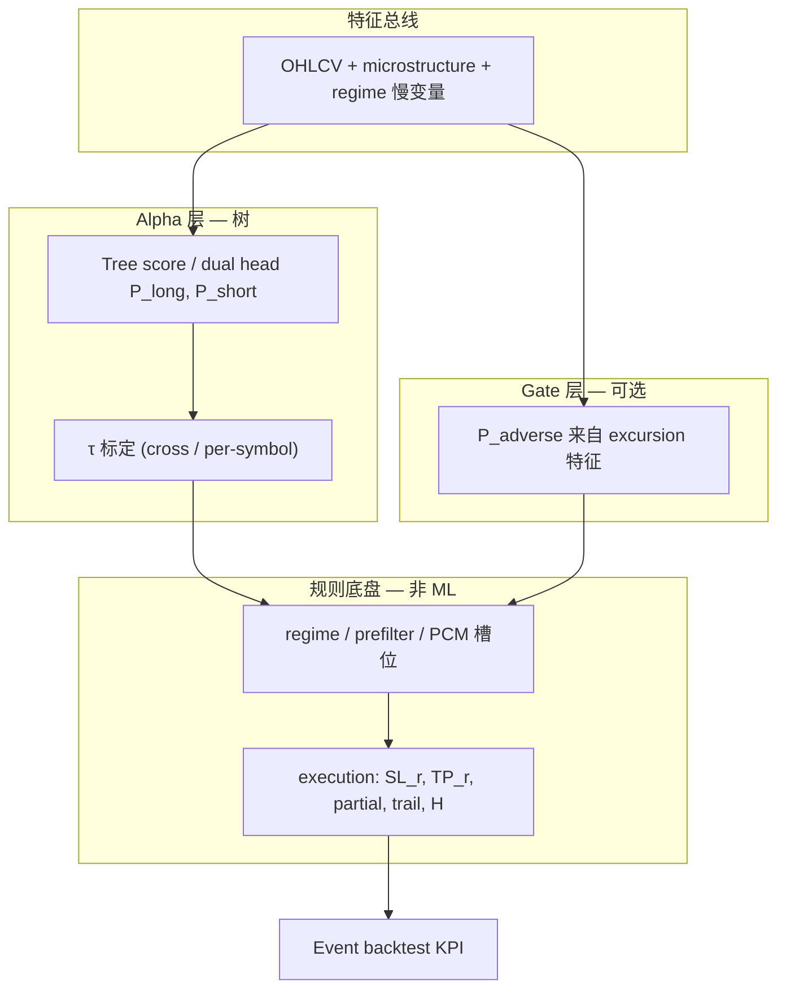

# 树模型入场打分 × 规则执行底盘 — 方法论（知识储备）

| 字段 | 值 |
|------|-----|
| 状态 | **Canonical** — fast_scalp 及后续 tree 策略 promote 前必读 |
| 实验目录 | `config/experiments/20260530_fast_scalp_alts_majors/` |
| 关联 | [`G_VARIANTS.md`](G_VARIANTS.md)、[`fast_scalp_tree_alpha_rebuild_PLAN.md`](fast_scalp_tree_alpha_rebuild_PLAN.md)、[`DECISION.md`](DECISION.md)、[`LAYER_PROMOTION_CRITERIA.md`](../LAYER_PROMOTION_CRITERIA.md) |
| 日期 | 2026-06-02 |

---

## 一、核心结论（必须记住）

### 1. 树模型不替换端到端规则系统

**错误路径：** 用一棵 signed forward-RR 回归树 + timeout-only 执行，指望它单独构成可上线策略。

**正确路径：** 树只负责 **「在这根 bar 上，该不该、朝哪边入场」** 的排序与阈值；**入场之后怎么走**（止损、止盈、超时、加仓、regime 段管理）交给 **久经考验的规则执行底盘**（TPC / trend_scalp 类 scaffolding），在 **event 路径 + segment 矩阵** 上验证。

一句话：**树 = calibrated entry ranker；规则 = proven execution chassis。**

### 2. fast_scalp 已确证的事实（alts, recent_6m_oos）

| 现象 | 含义 |
|------|------|
| Event 100% `timeout`，`initial_r: 50` | 测的是 **H=6 裸 alpha**，不是执行优化 |
| Gross 仍负 | **不是手续费问题** |
| SHORT edge / LONG 系统性亏 | **signed 回归的对称假设错了**；默认应 short-biased 或 dual head |
| Vector 盈利 ≠ Event 盈利 | Vector：分币账户 + 无 regime + bar close；Event：regime + 1min + 复合账户 |
| G3 short+regime_off majors **+0.76%** | Alpha 层 ablation 有效 |
| G5 tight SL/TP alts **+1.70%** | 执行层 grid 有效，但 **仅 recent 窗验证，不可 premature promote** |
| G8 adverse gate in-sample **+3.69%** | Gate 特征注入 + fail-closed 修复后有效，但 **同窗训练 = 无效 OOS 证据** |

### 3. 推荐分层架构（当前共识）

| 层 | 职责 | 实验代号 / 配置 |
|----|------|-----------------|
| **Alpha** | 按方向排序入场（非 signed 对称回归） | G1/G3 short-only；G7 dual head 待证 |
| **Gate** | `P(adverse)` 尾部 veto，特征与 direction score **正交** | G8 adverse gate（须 OOS 重训） |
| **Regime** | 结构性硬过滤，不默认「关 regime 更好」 | G3：short + regime_off（majors 有效） |
| **Execution** | SL/TP/超时/ trailing，从 MFE/MAE 或 grid 数据裁决 | G5 tight；exec grid 扩展 |

Promote 门禁：**[`LAYER_PROMOTION_CRITERIA.md`](../LAYER_PROMOTION_CRITERIA.md)** — event OOS + segment 矩阵三条杠，vector τ-scan **仅标定**。

---

## 二、系统分层（概念图）



**关键：** `score` 与 `execution` 是 **正交维度**。Score 回答 **when + which side**；Execution 回答 **how to manage the trade**。

---

## 三、如何把「校准过的入场打分」喂给规则执行底盘

### Step 0 — 训练目标与 Alpha 形态先对齐

| 训练目标 | 适合的执行 | 风险 |
|----------|------------|------|
| Signed forward-RR H=3 | 短 horizon timeout / 小 TP | 多空对称假设；long 端易系统性亏 |
| Dual binary head | 各方向独立 τ + agreement | 维护成本；样本少时过拟合 |
| Short-only 部署 | 任意执行 grid，但 **只开空** | 牛市段 coverage 下降 |

**fast_scalp 教训：** 先 Phase 0 ablation（G0–G3）确认 **哪边有 edge**，再谈执行优化；否则是在给坏 alpha 调 SL/TP。

### Step 1 — 正确导出 score（artifact 一致）

树分必须走 **artifact 内 `feature_config.json` 同款特征管线**，不能用 IC-pruned 子集替代：

```bash
PYTHONPATH=src:scripts:. python scripts/research/export_tree_scores_from_artifact.py \
  --artifact-dir results/train_final/.../fast_scalp \
  --config config/strategies/tree_strategies/fast_scalp \
  --symbols SOLUSDT,BNBUSDT,XRPUSDT,ADAUSDT \
  --start-date 2022-01-01 --end-date 2026-03-31 \
  --output results/.../scores/alts_full_history_v2.parquet
```

校验：score 分布须有 **负尾**（`frac(score ≤ short_entry) > 0`）；全正分布 = 导出管线错误 → event 0 trades。

实现：`scripts/research/predict_tree_from_artifact.py`（canonical predict）。

#### 3.1.1 这到底在说什么？（仔细举例）

训练结束时，`ModelArtifact.save()` 会把 **当时算特征、喂模型的完整配置** 冻在 artifact 目录里：

```
results/train_final/.../fast_scalp/
├── model.pkl
├── preprocessor.pkl
├── used_features.json          # 模型实际吃的列名列表（例如 35 列）
└── feature_config.json         # 当时 run_feature_pipeline 用的 requested_features / invert / ensure_signal
```

**正确路径**（`predict_tree_from_artifact.py`）：

```python
# 读 artifact 里冻住的 feature_config，不是 deploy yaml
pipeline_cfg = pipeline_cfg_from_artifact(artifact)
df_feat = run_feature_pipeline(..., pipeline_cfg=pipeline_cfg, ...)
X = artifact.preprocessor.transform(df_feat, feature_cols=artifact.used_features)
pred = model.predict(X)
```

**错误路径**（旧版 segment 导出曾用 `tree_holdout_tau_rr_scan._predict_segment` + deploy `--config fast_scalp_alts`）：

```python
# 读的是 slug 目录下 features.yaml（IC 剪枝后的「当前 deploy 清单」）
strategy_config = StrategyConfigLoader(config_dir).load()  # e.g. fast_scalp_alts
df_feat = run_feature_pipeline(..., pipeline_cfg=strategy_config.features, ...)
```

两条路径 **看起来** 都是「跑特征 → transform → predict」，但 **特征清单可能不一致**：

| 来源 | 典型内容 | 本实验中的例子 |
|------|----------|----------------|
| `artifact/feature_config.json` | **训练 artifact 当时** 的 `requested_features` + invert 等 | pooled 6 币 IC top-35 训练快照 |
| `config/.../fast_scalp_alts/features.yaml` | **deploy slug 当前** IC 剪枝清单 | top-20 column singletons（与 artifact 可能不同步） |

**为什么会 score 退化成常数、event 0 trades？**

1. **特征空间错位**：模型在 A 套特征上训练；推理用 B 套特征算出来的列，经 preprocessor 填进 A 的 slot → 大量列数值错误或接近常数 → 树输出 **几乎 flat**（本实验坏导出：min≈0.008, max≈0.33, mean≈+0.25）。
2. **负尾消失**：deploy τ 里 `short_entry: -0.0074`（cross 做空需 score **从上方穿过** -0.0074）。若所有 pred > -0.0074 → **`frac(score ≤ short_entry) = 0`** → G1/G3 short-only **零笔成交**。
3. **与 holdout 对照**：同一 artifact 在训练 holdout `predictions.parquet` 上 pred 范围 **-0.187 ~ +0.551**；修好后 `predict_tree_from_artifact` smoke（2022 Q1 SOL）：min=-0.176，`frac≤short_entry=5.4%` ✓。

**数字 walk-through（简化）：**

```
# 坏导出（IC 子集 / 错误 config_dir）
SOL 2022-01 bar: pred = +0.24, +0.25, +0.26 ...  （几乎不变）
short_entry = -0.0074
→ 没有任何 bar 满足 cross 做空 → event funnel: 0 trades

# 正确导出（artifact feature_config）
SOL 2022-01 bar: pred = -0.12, +0.08, -0.03, +0.31 ...
→ 部分 bar score ≤ -0.0074 且 cross → 正常产生 SHORT 信号
```

**怎么自检（export 脚本内置）：**

`validate_score_distribution()` 在 `frac_le_short_entry < 0.1%` 时 **直接报错**，避免把坏 parquet 喂进 segment 矩阵：

```python
# scripts/research/predict_tree_from_artifact.py
stats = {
    "min": ..., "max": ..., "mean": ...,
    "frac_le_short_entry": (scores <= -0.0074).mean(),
}
# frac ≈ 0 → ValueError: degenerate score distribution
```

**holdout 快捷路径（仅 holdout 窗、已有 predictions.parquet）：**

若只验证 2025-10→2026-04，可直接：

```bash
export_tree_scores_for_event_backtest.py \
  --predictions results/train_final/.../predictions.parquet
```

不必重跑特征管线；但 **全历史 segment 矩阵（2022–2026）** 必须用 `export_tree_scores_from_artifact.py` 重推。

**canonical 命令：**

```bash
PYTHONPATH=src:scripts:. python scripts/research/export_tree_scores_from_artifact.py \
  --artifact-dir results/train_final/fast_scalp/train_final_20260530_141451_ic_top35/fast_scalp \
  --config config/strategies/tree_strategies/fast_scalp \
  --symbols SOLUSDT,BNBUSDT,XRPUSDT,ADAUSDT \
  --start-date 2022-01-01 --end-date 2026-03-31 \
  --output results/rd_loop/fast_scalp_ic_plateau/alpha_rebuild/scores/alts_full_history_v2.parquet
```

注意：`--config` 只用于 strategy meta（model_type、ticks 注入等），**特征清单以 artifact 内 `feature_config.json` 为准**。

### Step 2 — τ 标定（vector 快速扫描）

在 **holdout** 上对 `score` 做 plateau / q-scan，冻结到 `direction.yaml`：

- `entry_mode: cross`（默认）
- `long_entry` / `short_entry` 或 `per_symbol_thresholds`
- 产物：`backtest.yaml` / deploy 冻结 τ

**用途：** 快速找 selective 区间、对比 pooled vs per-symbol。**不能**单独作为 promote 依据。

### Step 3 — 注入 event 路径

Event backtest 从 parquet 读 `score` + gate 特征列；ML gate **fail-closed**（缺列 = reject）：

```bash
PYTHONPATH=src:scripts python scripts/research/export_tree_scores_for_event_backtest.py \
  --predictions .../predictions.parquet \
  --output .../event_confirm/scores/alts_holdout.parquet
```

`scripts/event_backtest/backtester.py` 注入 parquet 全列 → direction threshold cross → regime/prefilter → execution simulator。

### Step 4 — Alpha + Gate 层 event 验证（固定 timeout 或轻执行）

在 **改执行之前**，用 G0–G3（+ G8 OOS gate）确认：

- 哪条 side 有 edge
- regime on/off 的真实贡献
- gate 是否在 **OOS 训练** 下仍提升 tail / Total R

此时 execution 建议保持 **timeout-only 基线**（`initial_r: 50`, `take_profit.enabled: false`），避免与 alpha 结论混淆。

### Step 5 — MFE/MAE 画像（连接 score 与 SL/TP  band）

对 **已通过 τ 的 cross 入场**，在 1min 上统计 favorable / adverse excursion：

```bash
PYTHONPATH=src:scripts:. python scripts/research/profile_tree_entry_excursion.py \
  --scores .../alts_holdout.parquet \
  --config config/strategies/tree_strategies/fast_scalp_alts \
  ...
```

按 score 分位看：

- 高分位 entry 的 **MFE@H**、**MAE@H**
- 决定 `initial_r` 是否够宽、`target_r` 是否可达、trail 是否值得

**这是「打分 ↔ 执行」对齐的数据桥梁** — 不是猜 1.5R vs 3R。

#### 3.5.1 MFE/MAE 画像 vs 执行 grid — 各管什么？

| | MFE/MAE 画像 | 执行 grid |
|---|-------------|-----------|
| **目的** | 诊断：τ 选出的 entry，价格路径长什么样 | 裁决：哪组 SL/TP/H 在 event 上最优 |
| **动什么** | **不动** execution.yaml；只统计 | **只动** execution.yaml **参数** |
| **固定什么** | score + τ + alpha/gate/regime | score + τ + alpha/gate/regime |
| **输出** | 建议 band：`suggested_sl_r`（MAE q75）、`suggested_tp_r`（MFE q50） | event KPI：Return%、maxDD、exit_reason 分布 |
| **脚本** | `profile_tree_entry_excursion.py` | `fast_scalp_exec_grid.yaml` + TPC snapshots |

**你的理解是对的：** 执行层 **规则形态（chassis）是定的**，**数值参数可调**。

- **定的（rule family / chassis）**：单腿 RR 执行语义 — `stop_loss.initial_r` 用 R 倍数、`take_profit.enabled` 开关、`holding.max_holding_bars` 超时、`trailing.enabled` 是否 trail。不会在同一 grid 里换成 trend_scalp 的 basket TP + catastrophic（那是 **另一套 chassis**）。
- **可调的（parameters within family）**：`initial_r: 1.5 vs 2.5`、`take_profit.r: 1.0 vs 1.5 vs 2.0`、`trail_r`、`max_holding_bars: 6 vs 12` 等。
- **grid 里比较的「timeout / tight / trail」**：是 **同一 chassis 下三种参数 preset**（见 `prepare_fast_scalp_alpha_snapshots.py` 的 `EXEC_TIMEOUT` / `EXEC_TIGHT` / `EXEC_TRAIL`），不是改 alpha 规则。

**典型工作流：**

```
1. MFE/MAE：τ 固定，看 SHORT entry 的 MAE q75 ≈ 1.8R、MFE q50 ≈ 1.0R
   → _hypothesis_: SL≈1.5–2.0R, TP≈1.0R 合理；trail 可能 MAE 放大

2. Execution grid：在 hypothesis band 内设 3–5 个 preset，event 回测
   G5: SL=1.5, TP=1.0 → +1.70%
   G6: SL=2.5, trail  → -16.85%
   → 选 G5，不是凭 MFE 表格直接写 prod

3. Segment 矩阵：胜出 preset × 四段 market_segment → LAYER_PROMOTION 三条杠
```

**MFE/MAE 不算最终 KPI** — 它不含手续费、regime 过滤、复合账户；**执行 grid 的 event 回测才算**。

#### 3.5.2 MFE/MAE 举例（概念）

某 SHORT entry（score 刚过 `short_entry=-0.0074`），入场后 6×120T 内 1min 路径：

```
bar+0: entry close = 100, ATR = 1.0
bar+1..720min: 最低价曾到 98.2 → MAE = (100-98.2)/1.0 = 1.8R
               最高价曾到 100.5 → 对空头 unfavorable excursion
                favorable MFE = (100-97.0)/1.0 = 3.0R（若曾跌到 97）
```

若 **score 最高十分位** 的 entry 普遍 MFE q50 ≥ 2R、MAE q75 ≤ 1.5R → tight SL=1.5 + TP=1.0 合理。  
若 **trail preset** 下 MAE q90 经常 > 3R → trail 在 alts 上失败（G6 实证）可解释。

### Step 6 — 执行 grid（固定 score + τ，只动 execution.yaml）

在 TPC 快照上 patch execution（见 `prepare_fast_scalp_alpha_snapshots.py`）：

| 代号 | SL | TP | Trail | H | alts recent_6m 结果 |
|------|----|----|-------|---|---------------------|
| timeout | 50R | off | off | 6 | -7.02% |
| **G5 tight** | **1.5R** | **1.0R** | off | 6 | **+1.70%** |
| G6 trail | 2.5R | 1.5R | on | 12 | -16.85% |

```yaml
# config/.../execution_tight_sl_tp.yaml 示例
stop_loss:
  initial_r: 1.5
  trailing:
    enabled: false
take_profit:
  enabled: true
  r: 1.0
holding:
  max_holding_bars: 6
  time_stop_bars: 6
```

跑 `fast_scalp_exec_grid.yaml` → **event OOS** → segment 四段矩阵 → 对照 [`LAYER_PROMOTION_CRITERIA.md`](../LAYER_PROMOTION_CRITERIA.md)。

### Step 7 — Promote = 写 archetype，不是 live overlay

胜出组合 **复制 snapshot → `config/strategies/tree_strategies/<slug>/archetypes/`**，打 `locked: true`；历史变体留 `config_experiments/`。

---

## 四、执行层多样性 — 如何与 entry score 对齐

### 4.1 正交性原则

| 维度 | 树 entry score 管什么 | 执行层管什么 |
|------|----------------------|--------------|
| 决策时点 | bar t 是否 cross τ | bar t+1..t+H 路径管理 |
| 优化目标 | 排序 / 方向概率 | realized R、maxDD、timeout 占比 |
| 标定数据 | holdout score 分布 | MFE/MAE + event grid |
| 验证路径 | vector τ（快） | **event 1min（准）** |

**同一套 frozen τ 可以配多种 execution** — 但每种 execution 的 **最优 τ 可能不同**。是否重标定 τ，看下面 4.3。

### 4.2 执行 profile 族谱

#### A. 紧止损 + 固定 TP（fast_scalp / G5）

- **语义：** 快出快收；适合 **短 horizon alpha**（H=3 label、score 选局部反转/延续）。
- **对齐 score：** τ 选 **MAE 可控、MFE@3–6 bar 达 1R** 的分位；`profile_tree_entry_excursion.py` 看 P(MAE < 1.5R)。
- **配置：** `initial_r: 1.5`, `take_profit.r: 1.0`, `max_holding_bars: 6`。

#### B. 紧止损 + 部分止盈（1:1.5 / 1:2 / 1:3）

- **语义：** 先锁部分利润，剩余 runner；提高 win rate，牺牲 tail。
- **对齐 score：**
  - 低 |score| 分位 → 更适合 **早 partial**（1:1 ~ 1:1.5）
  - 高 |score| 分位 → MFE 尾更长 → partial 比例降低或 TP ladder 拉到 2R/3R
- **实操：** 在 event grid 中为每个 `(partial_pct, tp_r)` 组合建 TPC snapshot；**hold score/τ 固定**，比 vector 更接近生产。
- **现状：** tree 单腿 `execution.yaml` 以 `take_profit.r` 为主；multi-leg partial 需确认 simulator 支持（trend_scalp basket 模式不同）。扩展 partial 前先在 `config_experiments/` 做 snapshot，勿直接改 prod。

#### C. 宽保护止损 + 紧止盈（trend_scalp 范式）

- **语义：** `catastrophic_stop_atr_mult: 8` + basket TP `atr_mult: 0.6`；段级 regime 管理，非单 bar scalp。
- **对齐 score：** 树 score 在此架构里是 **「段内是否允许加腿 / 初始 TREND 腿 timing」**，不是 signed RR 的 mirror。需要 **regime 段已成立** 后再用 score 排序 entry/add。
- **与 fast_scalp 树的关系：** 不同 chassis — 若要把 fast_scalp 树接到 trend_scalp，需重新定义 score 语义（例如只在 `trend_direction` 一致时 cross τ），不能照搬 timeout τ。

#### D. Trailing（G6 反例）

- **alts recent_6m：** trail 显著劣于 tight fixed TP。
- **对齐 score：** 仅当 MFE 分位显示 **大量超过 1.5R 且回撤浅** 时才值得 trail；否则 fixed TP 更匹配 label horizon。

#### E. 纯 timeout（G0 基线）

- **用途：** 测量 **裸 alpha**，隔离执行层贡献。
- **不要** 把 timeout 下的负收益当成「策略无效」的唯一证据 — 可能只是 **缺 SL/TP**。

### 4.3 何时对每种 execution **重新标定 τ**

| 情况 | 是否重标定 τ |
|------|--------------|
| 只改 `initial_r` ±0.5R，TP 不变 | 通常 **不必**；跑 grid 即可 |
| TP 从 1R → 2R，或引入 partial | **建议** 在 event 或 `entry_rr_scan` 上重扫 τ |
| 从 timeout → tight TP（成交结构大变） | **必须** 验证 frozen deploy τ；G5 用 deploy τ 仍盈利，但是 **segment 全历史未完整验证** |
| 换 alpha（short-only / dual head） | **必须** 全流程重标定 |
| 加 adverse gate | gate 阈值 OOS 训练；direction τ 可暂冻结再联合微调 |

**原则：** Primary KPI 始终在 **目标 execution profile + event 路径** 上；vector τ 只是 warm start。

### 4.4 对齐流程（一张 checklist）

```
[训练] → [正确 export score] → [vector τ 初值]
    → [Alpha ablation: side / regime / gate OOS]
    → [MFE/MAE by score decile]
    → [Execution grid: 固定 score+τ，扫 SL/TP/partial/trail]
    → [Segment matrix 四段 + recent_6m_oos]
    → [DECISION.md 表格 + LAYER_PROMOTION_CRITERIA 三条杠]
    → [Promote archetype YAML]
```

---

## 五、常见陷阱（本实验已踩）

| 陷阱 | 后果 | 修复 |
|------|------|------|
| Export 用 deploy IC 子集 / 错误 `--config` slug | 特征错位 → score 常数化 → `frac≤short_entry=0` → 0 trades | `predict_tree_from_artifact.py` + `validate_score_distribution` |
| ML gate fail-open | G8 = G3，假阴性 | loader fail-closed + parquet 注入 gate 列 |
| Gate 同窗训练 | in-sample +3.69% 幻觉 | `--train-end-date` OOS 重训 |
| Vector 盈利直接 promote | regime/执行漂移 | event segment 矩阵 |
| Signed RR 默认开多 | long 系统性亏 | short-only 或 dual head |
| G5 仅 recent 窗 | bull 段未知 | `fast_scalp_g5_segment_full.yaml` + v2 scores |

---

## 六、命令与产物索引

| 步骤 | 脚本 / 配置 |
|------|-------------|
| Phase 0 snapshots | `scripts/research/prepare_fast_scalp_alpha_snapshots.py` |
| Score export | `export_tree_scores_from_artifact.py`, `export_tree_scores_for_event_backtest.py` |
| MFE/MAE | `profile_tree_entry_excursion.py` |
| Exec grid | `fast_scalp_exec_grid.yaml`, `fast_scalp_alpha_phase4_validate.yaml` |
| Segment 矩阵 | `fast_scalp_g5_segment_full.yaml`, `fast_scalp_segment_tau_grid.yaml` |
| Gate OOS | `train_tree_adverse_gate.py --train-end-date 2025-10-01` |
| 结果根 | `results/rd_loop/fast_scalp_ic_plateau/alpha_rebuild/` |

---

## 七、与 trend_scalp「规则底盘」的关系

**trend_scalp** 的底盘 = inventory + regime 段 + basket TP + catastrophic stop + PCM 加仓间距 — **经过多年 TPC variant grid 验证**。

**fast_scalp 树** 当前最优路径不是把 trend 整套搬过来，而是：

1. 借用 **同一验证哲学**（TPC snapshot + segment matrix + 三条杠）
2. 借用 **执行参数化方式**（`execution.yaml` 的 R-multiple / ATR 语义）
3. **Alpha 层保持 tree score + short bias + adverse gate**，执行从 **MFE/MAE → tight SL/TP grid** 起步

若未来要把 score 接入 trend_scalp 段内 entry：

- score 阈值要在 **「regime 已 allow + trend_direction 已定」** 条件下标定
- execution 以 **basket TP + catastrophic** 为准，τ 扫描必须在 event 上重做
- 不能混用 fast_scalp 的 deploy τ

---

## 八、待完成项（实验状态，2026-06-02）

- [x] `alts_full_history_v2.parquet` 全历史 score 导出完成（2026-06-02：74k rows，pred -0.26~+0.60，`frac≤short_entry`=4.4%）
- [ ] Adverse gate **OOS** 重训 → G8 v3 event 复验
- [ ] G5 × 四段 segment 矩阵（valid scores）
- [ ] `DECISION.md` §11–§12 更正 in-sample / export bug 结论

**当前 promote 状态：** G5 **未** ready；G8 **未** OOS 证实；默认部署叙事 = **G3 alpha + exec grid 数据裁决**。

---

## 九、Phase 5 — 树 entry × trend_scalp 化执行（2026-06-02 起）

**动机：** G5（SL 1.5R / TP 1.0R）是 **scalp 紧止损** 范式，与 **trend_scalp**（宽灾难止损 + basket 紧 TP + regime 段退出）哲学不同。长期目标：**树 score 做 entry ranker，执行底盘向 trend_scalp 靠拢**，gate 从 entry veto 扩展到 **holding exit**。

### 9.1 当前 tree chassis 能近似什么

| trend_scalp 要素 | tree 单腿近似（G9/G10） | 尚未覆盖 |
|------------------|-------------------------|----------|
| 宽保护止损 8×ATR | `initial_r: 8.0` | 交易所 catastrophic STOP 语义 |
| 紧 TP ~0.6–1.0 ATR | `take_profit.r: 0.12`（0.12×8R ≈ 1 ATR） | basket 多腿一起平 |
| regime 过滤 | G9：**regime ON**（EMA1200 死区） | 段内 `force_exit_on_regime_loss` |
| 较长持有 | `max_holding_bars: 24` | inventory 加仓 / flip |
| gate | G11：entry adverse gate（OOS） | **holding 路径 gate exit**（Phase 6） |

### 9.2 实验变体

| 代号 | Alpha | Regime | Execution | 假设 |
|------|-------|--------|-----------|------|
| G5 | short + regime off | off | tight 1.5R/1.0R | scalp baseline（已 +1.7% recent） |
| **G9** | short | **ON** | wide 8R + TP 0.12R, H=24 | regime 过滤 + 宽止损更像 trend |
| **G10** | short | off | 同 G9 exec | 隔离 regime 对 wide/tight 的贡献 |
| **G11** | short + gate OOS | ON | 同 G9 exec | entry gate + trend-style exec |

快照：`prepare_fast_scalp_alpha_snapshots.py` → `G9`/`G10`/`G11`。  
Grid：`fast_scalp_trend_style_exec_grid.yaml` @ recent_6m_oos + v2 scores。

### 9.3 Phase 6 路线图（gate exit）

1. 持仓期间每 bar 计算 `P(adverse_t)`（MFE/MAE 特征 + 路径特征）
2. 超阈值 → 提前平仓（`structural_exit_gate`），与 TP/SL/regime 并列
3. 最终形态：树 entry score + trend 式宽 SL + 紧 TP + **gate 动态 exit** + regime 段管理

**Promote 仍走 event segment + LAYER_PROMOTION_CRITERIA**；Phase 5 为探索，不自动替换 G5 deploy。

