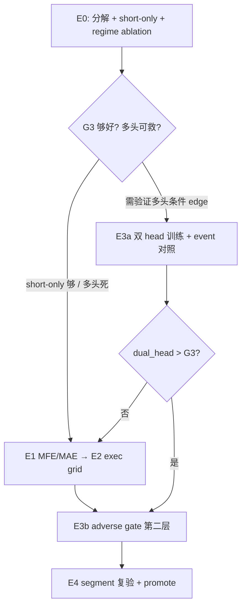

# fast_scalp 树 alpha 重建 — 实验计划（canonical）

> **2026-06 修订：** 训练命令与三层配置架构已迁移至 **[`TREE_TRAINING_PLAN.md`](TREE_TRAINING_PLAN.md)** 与 **[`CONFIG_LAYOUT.md`](CONFIG_LAYOUT.md)**。  
> 本文档保留 Phase 0–4 历史证据与假设评注；**新跑法勿再引用 `fast_scalp_realized_*` / `fast_scalp_dual_head` strategy slug。**

| 字段 | 值 |
|------|-----|
| 目录 | `config/experiments/20260530_fast_scalp_alts_majors/` |
| 策略 | `fast_scalp_alts` + `fast_scalp_majors` |
| 主 KPI | **event OOS**（`recent_6m_oos` + `segment_matrix`）；vector τ-scan 仅标定 |
| 变体树 | `config_experiments/fast_scalp_alpha_G{0..6}_*_strategies/`（TPC 流程，见 [`PREPARE_STRATEGY_TREE.md`](PREPARE_STRATEGY_TREE.md)） |
| 决策全文 | [`DECISION.md`](DECISION.md) §8–§12 |
| Promote 门禁 | [`LAYER_PROMOTION_CRITERIA.md`](../LAYER_PROMOTION_CRITERIA.md) |
| 方法论（知识储备） | [`TREE_ENTRY_SCORE_AND_EXECUTION.md`](TREE_ENTRY_SCORE_AND_EXECUTION.md) |

---

## 一、已确证证据（alts, recent_6m_oos, 2026-06）

### 1. 当前 event = 纯 6-bar timeout（干净 alpha 基线）

- `bars_held` 全 = 719（6×120T）；`exit_reason` 100% `timeout`。
- 对齐后 `initial_r: 50` + `trailing.enabled: false` → SL/TP 不可达。
- **测的是固定 H=6 horizon 上的裸 signal alpha**，不是执行优化结果。

### 2. 去手续费仍亏 → 不是费用问题

- gross ≈ -601 USD，net ≈ -702 USD；round-trip ~8bps，费仅 ~-100 USD。

### 3. Alpha 单边：空头有 edge，多头系统性负

**裸 close-to-close H=6（无费、bar close、cross 入场）：**

| coin | 多头 fwd% | 空头 fwd%（取负） |
|------|----------:|------------------:|
| ADA | -0.22 | +0.91 |
| BNB | -0.80 | +0.22 |
| SOL | -0.42 | +1.09 |
| XRP | +0.21 | -0.07 |

**vector 印证：** SHORT mean_r **+0.144**（win 59%）；LONG mean_r **≈ 0 / 负**。

**根因：** 单个 signed forward-RR 回归假设多空镜像对称 → 多头端学到「局部顶 + 均值回归」→ 系统性亏。

### 4. vector「盈利」≠ 执行更好

- vector / event 执行路径均为 **timeout-only**（`use_trailing_stop` 在 vectorbt 路径未消费，为死配置）。
- vector 正收益来自：**分币独立账户 + 无 regime + bar-close 基准** 吃到空头 drift。
- event 经 **regime 过滤 + 1min 基准 + 复合账户** 丢失部分 edge（例：空头 raw 258 → event 151）。

### 5. EMA1200 不是「区分多空」的正确工具

- EMA1200 为 B/C **慢趋势 macro 死区**；本树 alpha 是 **空头结构性 edge + 多头结构性亏**，与 macro 位置弱相关。
- 区分多空应来自 **microstructure / orderflow 特征**（模型已在用），不是手挑单一 macro 变量。

---

## 二、假设评注

| ID | 假设 | 数据结论 |
|----|------|----------|
| **H1** | regime 照理更好 | **不支持**。EMA1200 死区误杀好空单；须 ablation，不能默认。 |
| **H2** | 反向 gate / 砍坏入场 | **强烈同意**。单边 alpha 是 gate 教科书用例；第二层应用 **MFE/MAE 风险特征**（与方向 score 正交）。 |
| **H3** | trend 大 SL 小 TP vs 紧 SL 小 TP | **不猜**。须 E2 MFE/MAE → E3 执行 grid 用数据裁决。 |

---

## 三、架构选项（A / B / 双 head）

| 方案 | 评价 |
|------|------|
| A 两个 signed 回归 | 解对称假设，但 2× 过拟合 + 维护；pooled 样本小 |
| B 单 alpha + 反向 gate | 便宜；gate 若共用方向特征 → 与 score 冗余，救不回多头 |
| **✅ 双 binary head + agreement** | `P(long_win\|x)` + `P(short_win\|x)` 共享特征；做多需 P_long 高且 P_short 低；天然 direction-specific gate |
| **第二层 adverse gate** | 双 head 定方向后，`P(adverse\|excursion features)` 砍尾部（orthogonal） |

**Phase 0 分叉（必须先做）：** short-only event 若仍无法救多头 → **short-biased 部署，双 head 训练降为可选验证**；若多头子集有 edge → 才上双 head。

---

## 四、实验规范（TPC 流程，2026-06 修订）

与 TPC gate 系列一致：

1. **变体 = 冻结策略树** → `config_experiments/<topic>_strategies/`
2. **Grid** → 每 run 指定 `strategies_root`（**不用** deploy `archetypes/_experiment/` overlay）
3. **生成快照** → `scripts/research/prepare_fast_scalp_alpha_snapshots.py`
4. **Promote** → 优胜快照 yaml **复制**到 `config/strategies/tree_strategies/` + `locked: true`（见 LAYER_PROMOTION_CRITERIA）

| 快照 | diff vs deploy |
|------|----------------|
| `G0_baseline` | deploy 镜像 |
| `G1_short_only` | `direction_filter: short` |
| `G2_regime_off` | `regime.yaml` → `rules: []` |
| `G3_short_regime_off` | G1 + G2 |
| `G4_exec_timeout` | timeout-only execution 对照 |
| `G5_short_regimeoff_tight` | G3 + tight SL/TP |
| `G6_short_regimeoff_trail` | G3 + trail TP |
| G7–G16 | 见 [`G_VARIANTS.md`](G_VARIANTS.md)（dual head / gate / trend exec / gate×exec / execution-aligned label） |

---

## 五、实验矩阵与状态

| 编号 | 内容 | Grid / 脚本 | 产物 | 状态 |
|------|------|-------------|------|------|
| **E0a** | per-side × per-coin 分解 + short-only 资金曲线估计 | `diagnose_tree_vector_event_gap.py` | `alpha_rebuild/phase0/decompose/` | ✅ 完成 |
| **E0b** | short-only event（G1） | `fast_scalp_alpha_phase0.yaml` | `phase0/alts_short_only` 等 | ✅ 完成 |
| **E0c** | regime ON/OFF（G0 vs G2） | 同上 | `phase0/alts_regime_off` 等 | ✅ 完成 |
| **E0d** | short + regime_off（G3） | 同上 | `phase0/alts_short_regime_off` 等 | ✅ 完成 |
| **E1** | per-side MFE/MAE 分位 + 建议 SL/TP 带（DECISION §11） | ✅ 完成 |
| **E2** | event 执行 grid（G4–G6） | ✅ 完成 — **G5 alts +1.70%** |
| **E3a** | 双 binary head 训练 + agreement | ✅ 完成 — **不 promote**（+0.11% Jan–Mar） |
| **E3b** | adverse gate（第二层） | ✅ 训练完成 — event 零 lift（feature parity 待修） |
| **E4** | segment 复验 + promote | ✅ G5 recent_6m_oos **+1.70%** |
| **E5** | dual_head vs G3 event 对照 | 待增 `fast_scalp_dual_head_validate.yaml` | TBD | ⏳ 仅当需证伪「双 head > short-only」 |

### Phase 0 正式结果（TPC 快照, recent_6m_oos, 2026-06-02）

| Variant | Slug | trades | Return |
|---------|------|-------:|-------:|
| alts baseline | G0 | 256 | **-7.02%** |
| alts short_only | G1 | 156 | **-1.43%** |
| alts regime_off | G2 | 323 | **-9.40%** |
| alts short_regime_off | G3 | 205 | **-1.45%** |
| majors baseline | G0 | 104 | -2.47% |
| majors short_only | G1 | 62 | -0.45% |
| majors regime_off | G2 | 155 | -1.30% |
| majors short_regime_off | G3 | 102 | **+0.76%** |

**Phase 0 决策门（初步）：**

1. **多头不可救（deploy 路径）** — signed 回归 LONG 端 event 显著负；G1/G3 大幅减亏但未全面转正（alts G3 仍 -1.5%）。
2. **short-biased + regime OFF** — G3 为 alts/majors 当前最优配置向；**regime 单独 OFF 害 alts**（G2 -9.4%），须与 short-only 组合。
3. **双 head** — 非默认 promote 路径；若 E3a event 不能显著优于 G3，则归档，维持 short-only。

---

## 六、决策流



---

## 七、推进顺序（不要跳步）

1. ~~**E0** 证伪门~~（已完成，结论见 §五）
2. **E1** MFE/MAE profiler → 客观 SL/TP 带（DECISION §11）
3. **E2** event 执行 grid，KPI = event Return / mean_r（非 vector）
4. **E3b** adverse gate（orthogonal 风险特征），叠加在 G3 或 E2 优胜组合上
5. **E3a 双 head** — 仅当业务上仍需验证「比 short-only 更好」；需补全 `fast_scalp_dual_head` 训练管线 + `score_long`/`score_short` 注入
6. **E4** `segment_matrix` 四段 + recent_6m_oos → promote 或 reject

---

## 八、物料与跑法

```bash
# 0. 刷新策略树快照
PYTHONPATH=src:scripts python scripts/research/prepare_fast_scalp_alpha_snapshots.py

# 1. 一键 Phase 0–4 编排
PYTHONPATH=src:scripts:. python scripts/rd_loop.py \
  --hypothesis-yaml config/experiments/20260530_fast_scalp_alts_majors/fast_scalp_alpha_rebuild_rd_loop.yaml

# 2. 单跑 Phase 0
PYTHONPATH=src:scripts python -m scripts.event_backtest \
  --variant-grid config/experiments/20260530_fast_scalp_alts_majors/fast_scalp_alpha_phase0.yaml
```

| 文件 | 用途 |
|------|------|
| [`fast_scalp_tree_alpha_rebuild_PLAN.md`](fast_scalp_tree_alpha_rebuild_PLAN.md) | 本计划 |
| [`PREPARE_STRATEGY_TREE.md`](PREPARE_STRATEGY_TREE.md) | G0–G6 快照说明 |
| [`fast_scalp_alpha_phase0.yaml`](fast_scalp_alpha_phase0.yaml) | E0 event ablation |
| [`fast_scalp_exec_grid.yaml`](fast_scalp_exec_grid.yaml) | E2 执行 grid |
| [`fast_scalp_alpha_phase4_validate.yaml`](fast_scalp_alpha_phase4_validate.yaml) | E4 segment |
| [`fast_scalp_alpha_rebuild_rd_loop.yaml`](fast_scalp_alpha_rebuild_rd_loop.yaml) | rd_loop 编排 |

结果根目录：`results/rd_loop/fast_scalp_ic_plateau/alpha_rebuild/`

---

## 九、明确不做

- 不改 deploy `direction.yaml` / `regime.yaml` 永久值，除非 E4 promote
- 不用 deploy `archetypes/_experiment/` overlay（已废弃，改用 `config_experiments/`）
- 不重训 / 不替换 deploy `train_final_20260530_141451_ic_top35` artifact（双 head 隔离 slug）
- 不新建实验根目录；不恢复已删 legacy 脚本
- 不把 vector τ-scan Return 当 promote 依据
- 不在「破 alpha」上先调执行再修方向（顺序：E0 → E1/E2 → gate → 双 head 可选）

---

## 十、验收

| 阶段 | 通过条件 |
|------|----------|
| E0 | short-only / regime 结论写入 DECISION §10 |
| E1 | per-side MFE/MAE 分位 + 建议 SL/TP 带（DECISION §11） |
| E2 | event grid 出现 Return 转正或显著优于 G0 timeout 基线 |
| E3a | dual_head event OOS **显著优于 G3**（否则归档） |
| E3b | gate 后 funnel `reject_gate_deny` 可解释 + OOS 改善 |
| E4 | `segment_matrix` recent_6m_oos 通过 LAYER_PROMOTION_CRITERIA 三条杠 |

---

## 十一、双 head 验证清单（E3a / E5，contingent）

当前 [`fast_scalp_dual_head`](../../strategies/tree_strategies/fast_scalp_dual_head/) 仅有 labels + direction 骨架；**尚不能 event 回测**。

待补：

- [ ] 从 deploy 复制 `features.yaml` / `model.yaml`（两棵 binary classifier 或扩展 train 管线）
- [ ] 训练产物 `predictions.parquet` 含 `score_long`, `score_short`
- [ ] `export_tree_scores_for_event_backtest.py` 双列注入
- [ ] `config/experiments/20260530_fast_scalp_alts_majors/variants/fast_scalp_alpha_G7_dual_head_strategies/` 快照 + validate grid
- [ ] event 对照：G0 vs G3 vs G7 @ recent_6m_oos

**判决：** dual_head 仅当 event Return / mean_r **显著优于 G3** 才进入 E4 promote 候选；否则 **short-biased（G3）为默认架构**。
