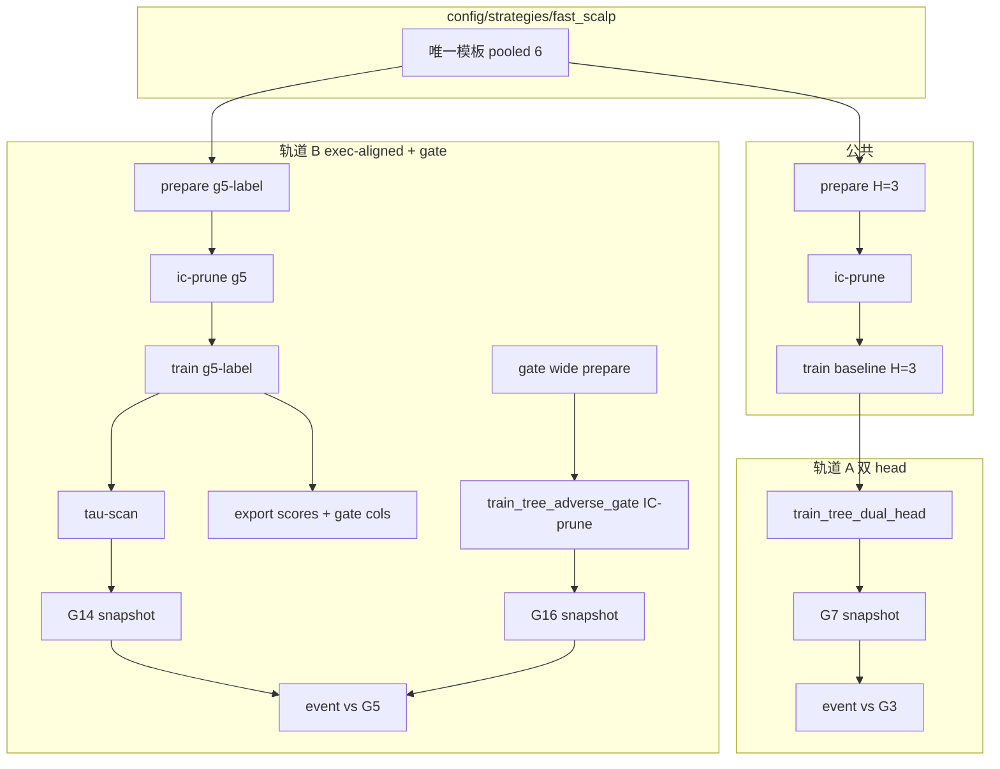

# fast_scalp 树模型 — 训练流程与命令

> 策略模板：**仅** `config/strategies/tree_strategies/fast_scalp`  
> 实验 override：`config/experiments/20260602_fast_scalp_tree_validate/overrides/`  
> 币种：**pooled 6**（见 [`cohorts.yaml`](cohorts.yaml)）

---

## 0. 环境变量

```bash
export ROOT=/home/yin/trading/ml_trading_bot
cd $ROOT
export PY="PYTHONPATH=src:scripts"
export CFG="$ROOT/config/strategies/tree_strategies/fast_scalp"
export EXP="$ROOT/config/experiments/20260602_fast_scalp_tree_validate"
export OVR="$EXP/overrides"
export SYMS=BTCUSDT,ETHUSDT,SOLUSDT,BNBUSDT,XRPUSDT,ADAUSDT
export TF=120T
export FS=features_tree_core_120T_c005db49f7
export TRAIN_START=2024-01-01
export TRAIN_END=2026-04-01
export HOLDOUT_START=2025-10-01
export HOLDOUT_END=2026-04-01
export OUT_RD=results/rd_loop/fast_scalp_tree_validate
export OUT_TRAIN=results/train_final/fast_scalp
```

---

## 1. 公共管线（两轨共用基线）

### 1.1 Prepare（H=3 signed label，pooled 6 币）

```bash
$PY python scripts/train_strategy_pipeline.py \
  --config $CFG \
  --symbol $SYMS --timeframe $TF \
  --start-date $TRAIN_START --end-date $TRAIN_END \
  --holdout-start-date $HOLDOUT_START --holdout-end-date $HOLDOUT_END \
  --feature-store-layer $FS \
  --output-root $OUT_TRAIN/prepare_baseline_h3 \
  --prepare-only
```

产物：`$OUT_TRAIN/prepare_baseline_h3/fast_scalp/features_labeled.parquet`

### 1.2 IC prune → writeback `fast_scalp/archetypes/model_features.yaml`

```bash
PYTHONPATH=.:src python scripts/research/ic_prune.py \
  --config-dir $CFG --layer entry \
  --features-parquet $OUT_TRAIN/prepare_baseline_h3/fast_scalp/features_labeled.parquet \
  --holdout-start $HOLDOUT_START --holdout-end $HOLDOUT_END \
  --target label --min-ic 0.02 --top-n-columns 20 \
  --writeback-mode columns \
  --out-dir $OUT_RD/shared/ic_prune_h3
```

> 脚本名是 `ic_prune.py`（不是 `ic_prune_holdout.py`），且需 `PYTHONPATH=.:src`
> （它 `import scripts.research._common`）。参数是 `--config-dir / --top-n-columns / --out-dir`。

### 1.3 训练 signed H=3 回归树（pooled 6 币）

```bash
$PY python scripts/train_strategy_pipeline.py \
  --config $CFG \
  --symbol $SYMS --timeframe $TF \
  --start-date $TRAIN_START --end-date $TRAIN_END \
  --holdout-start-date $HOLDOUT_START --holdout-end-date $HOLDOUT_END \
  --feature-store-layer $FS \
  --output-root $OUT_TRAIN/train_baseline_h3
```

产物：`$OUT_TRAIN/train_baseline_h3/fast_scalp/predictions.parquet`（+ ModelArtifact）

---

## 2. 轨道 A — 双 head（G7）

**假设：** `P(long_win|x)` + `P(short_win|x)` agreement 优于 signed H=3 + short-only（G3）。

### 2.1 训练双 binary head

在 **同一** predictions 上挂 H=3 win label，训两个 LGBM classifier：

```bash
$PY python scripts/research/train_tree_dual_head.py \
  --config $CFG \
  --predictions $OUT_TRAIN/train_baseline_h3/fast_scalp/predictions.parquet \
  --symbols $SYMS \
  --output-dir $OUT_RD/track_a/dual_head \
  --train-end-date $HOLDOUT_START \
  --score-start-date 2022-01-01 \
  --horizon 3 --rr-floor 0.30
```

产物：
- `$OUT_RD/track_a/dual_head/long_head.joblib` / `short_head.joblib`
- `$OUT_RD/track_a/dual_head/dual_head_event_scores.parquet`（`score_long`, `score_short`）

### 2.2 生成 G7 快照

```bash
$PY python scripts/research/prepare_fast_scalp_alpha_snapshots.py \
  --only fast_scalp_alpha_G7_dual_head_strategies
```

### 2.3 Event 四段验证（G7 vs G3）

```bash
$PY python -m scripts.event_backtest \
  --variant-grid $EXP/segment_validate_dual_head.yaml
```

**Promote 条件：** G7 在 `recent_6m_oos` 优于 G3，且 segment 矩阵不过度依赖单段。

---

## 3. 轨道 B — execution-aligned label + IC-prune gate（G14 / G16）

**假设：** entry label 与 G5 执行对齐（`r_long - r_short` under tight SL/TP）；gate 用宽特征池 IC-prune + adverse MAE lift。

### 3.1 Prepare execution-aligned label

```bash
$PY python scripts/train_strategy_pipeline.py \
  --config $CFG \
  --labels $OVR/labels_execution_aligned_g5.yaml \
  --symbol $SYMS --timeframe $TF \
  --start-date $TRAIN_START --end-date $TRAIN_END \
  --holdout-start-date $HOLDOUT_START --holdout-end-date $HOLDOUT_END \
  --feature-store-layer $FS \
  --output-root $OUT_TRAIN/prepare_exec_aligned_g5 \
  --prepare-only
```

### 3.2 IC prune（target = g5-label）

```bash
PYTHONPATH=.:src python scripts/research/ic_prune.py \
  --config-dir $CFG --layer entry \
  --features-parquet $OUT_TRAIN/prepare_exec_aligned_g5/fast_scalp/features_labeled.parquet \
  --holdout-start $HOLDOUT_START --holdout-end $HOLDOUT_END \
  --target label --min-ic 0.02 --top-n-columns 20 \
  --writeback-mode columns \
  --out-dir $OUT_RD/track_b/ic_prune_g5
```

### 3.3 训练 entry ranker（g5-label）

```bash
$PY python scripts/train_strategy_pipeline.py \
  --config $CFG \
  --labels $OVR/labels_execution_aligned_g5.yaml \
  --symbol $SYMS --timeframe $TF \
  --start-date $TRAIN_START --end-date $TRAIN_END \
  --holdout-start-date $HOLDOUT_START --holdout-end-date $HOLDOUT_END \
  --feature-store-layer $FS \
  --output-root $OUT_TRAIN/train_exec_aligned_g5
```

### 3.4 Holdout τ-scan（g5-label 专用分布）

```bash
$PY python scripts/research/tree_holdout_tau_rr_scan.py \
  --config $CFG \
  --predictions $OUT_TRAIN/train_exec_aligned_g5/fast_scalp/predictions.parquet \
  --output-dir $OUT_RD/track_b/tau_scan_g5 \
  --segment-label recent_6m_oos \
  --quantile-grid "0.05,0.08,0.10,0.12,0.15,0.20,0.25,0.30"
```

> 该脚本默认就把 predictions 过滤到 `split=holdout`（用 `--no-filter-split` 关闭）。
> 把 `recommended.pred_threshold_long/short` 写入 `prepare_fast_scalp_alpha_snapshots.py` 的 `G5LABEL_TAU`，
> **同一对阈值**也作为 gate 的 `--long-entry/--short-entry`（gate 必须复用 ranker 的入场阈值）。

### 3.5 导出 full-history score（含 gate 特征列）

```bash
$PY python scripts/research/export_tree_scores_from_artifact.py \
  --artifact-dir $OUT_TRAIN/train_exec_aligned_g5/fast_scalp \
  --config $CFG \
  --symbols $SYMS \
  --start-date 2022-01-01 --end-date $HOLDOUT_END \
  --validate-short-entry -0.3090097524537344 \
  --output $OUT_RD/track_b/scores/g5label_full_history.parquet \
  --save-predictions $OUT_RD/track_b/scores/g5label_full_history_preds.parquet
```

- `--validate-short-entry` 用 τ-scan 的 `short_entry`；出现 `.DEGENERATE` 标记 → **禁止 promote**。
- `--save-predictions` 落一份**全历史 `pred` 表**（含 train 段），gate 训练要用它，
  因为 `train_exec_aligned_g5/.../predictions.parquet` **只含 holdout 段**，无法支撑 OOS gate。

### 3.6 Gate — 宽候选特征 prepare

```bash
$PY python scripts/train_strategy_pipeline.py \
  --config $CFG \
  --features $OVR/features_gate_candidates.yaml \
  --symbol $SYMS --timeframe $TF \
  --start-date $TRAIN_START --end-date $TRAIN_END \
  --output-root $OUT_TRAIN/gate_features_wide \
  --prepare-only
```

### 3.7 Gate — IC-prune + 训练

```bash
$PY python scripts/research/train_tree_adverse_gate.py \
  --config $CFG \
  --predictions $OUT_RD/track_b/scores/g5label_full_history_preds.parquet \
  --gate-features $OUT_TRAIN/gate_features_wide/fast_scalp/features_labeled.parquet \
  --features-gate-yaml $OVR/features_gate_candidates.yaml \
  --symbols $SYMS \
  --start-date 2022-01-01 --end-date $HOLDOUT_END \
  --train-end-date $HOLDOUT_START \
  --long-entry -0.21338247736253388 --short-entry -0.3090097524537344 \
  --min-abs-ic 0.03 --min-lift 0.05 --top-k 8 \
  --output-dir $OUT_RD/track_b/gate/ic_prune_v2
```

> **关键**：gate 的 `--predictions` 必须是**全历史 `pred` 表**（3.5 的 `--save-predictions` 产物），
> 且 `--long-entry/--short-entry` 必须等于 ranker 的 τ-scan 阈值——否则 gate 在 H=3 的 0–1
> 阈值下选不出 g5-label 入场点，训练样本为 0。

检查 `$OUT_RD/track_b/gate/ic_prune_v2/train_summary.json`：
- `selected_features`（IC 选出，非写死 6 个）
- `metrics.adverse_avoided` > 0

### 3.8 生成 G14 / G16 快照 + Event 四段

```bash
$PY python scripts/research/prepare_fast_scalp_alpha_snapshots.py \
  --only fast_scalp_alpha_G14_g5label_g5exec_strategies \
           fast_scalp_alpha_G16_g5label_g5exec_gate_strategies

$PY python -m scripts.event_backtest \
  --variant-grid $EXP/segment_validate_exec_gate.yaml
```

**对照：** G5（H=3 score + G5 exec）vs G14（g5-label）vs G16（g5-label + gate）。

---

## 4. rd_loop 一键编排

```bash
# 轨道 A
$PY python scripts/rd_loop.py \
  --hypothesis-yaml $EXP/rd_loop_track_a_dual_head.yaml

# 轨道 B
$PY python scripts/rd_loop.py \
  --hypothesis-yaml $EXP/rd_loop_track_b_exec_aligned_gate.yaml
```

---

## 5. 产物目录

```
results/train_final/fast_scalp/
├── prepare_baseline_h3/
├── train_baseline_h3/          ← 轨道 A 输入
├── prepare_exec_aligned_g5/
├── train_exec_aligned_g5/      ← 轨道 B entry artifact
└── gate_features_wide/

results/rd_loop/fast_scalp_tree_validate/
├── shared/ic_prune_h3/
├── track_a/dual_head/
├── track_b/
│   ├── ic_prune_g5/
│   ├── tau_scan_g5/
│   ├── scores/g5label_full_history.parquet
│   └── gate/ic_prune_v2/
└── segment/                    ← event backtest 输出
```

---

## 6. Promote 路径

1. Event `segment_matrix` 过 [`LAYER_PROMOTION_CRITERIA.md`](../LAYER_PROMOTION_CRITERIA.md)
2. 优胜 G 快照的 `fast_scalp/archetypes/*` → 复制回 deploy `fast_scalp/archetypes/`，`locked: true`
3. Artifact 路径写入 `fast_scalp/meta.yaml`（或 deploy manifest）
4. 更新本目录 [`DECISION.md`](DECISION.md)

---

## 7. 流程图


