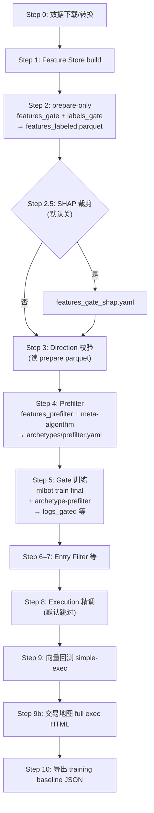

# BPC (BreakoutPullbackContinuation) 策略

## 策略概述

BreakoutPullbackContinuation archetype：趋势中回踩后延续原方向。

**核心理念**：
- Breakout: 突破压缩区/前高，放量+CVD同向
- Pullback: 回踩但不破结构，缩量+CVD吸收
- Continuation: 重新启动，再次放量+CVD恢复

## 训练配置（历史快照，可能与当前 failure-first 管线不一致）

- **数据集**: highcap6 (BTCUSDT, ETHUSDT, BNBUSDT, SOLUSDT, XRPUSDT, ADAUSDT)
- **时间窗口**: 2023-01-01 至 2024-12-31
- **标签类型**（旧记法）: forward_rr / outcome audit 等实验记录
- **模型类型**: LightGBM（具体任务见 `model.yaml` 与下方「标签文件」）
- **样本数**: 2132 (训练集)
- **特征数**: 143

## 模型性能

- **交叉验证**: 5-fold时序交叉验证
- **平均CV指标**: -0.0720
- **训练完成时间**: 2026-01-30

---

## 标签配置一览（`labels*.yaml`）

加载器约定：**每个策略目录必须存在 `labels.yaml`**（见 `StrategyConfigLoader.REQUIRED_FILES`）。未传 `--labels` 时默认读该文件；自动化产线里 **Prepare / Gate** 还会按流水线里的 `labels_gate` 指向的文件，用 **`mlbot train ... --labels <path>`** 覆盖。

| 文件                             | `target_column` / 要点                                                                      | 典型用途                                                                                       |
| -------------------------------- | ------------------------------------------------------------------------------------------- | ---------------------------------------------------------------------------------------------- |
| **`labels.yaml`**                | `success_label`，`compute_bpc_failure_label`，`invert: true`，long，target 2 ATR            | **默认入口**；完整 failure-first 的「好机会 vs 失败」语义。                                    |
| **`labels_failure_first.yaml`**  | `failure_label`，同一 generator、**不 invert**                                              | 分析「失败=1」、与 gate 的 `pred>=thr` 语义相反时注意切换。                                    |
| **`labels_rr_extreme.yaml`**     | `success_no_rr_extreme`，**`compute_bpc_failure_rr_extreme_label`**（仅踩大坑一肢）         | **Turbo / 多策略 prod 里 `labels_gate: labels_rr_extreme.yaml`**，Prepare 与 Gate 训练走这份。 |
| **`labels_no_opportunity.yaml`** | `success_has_opportunity`，`compute_bpc_failure_no_opportunity_label`，可 `direction_aware` | 单独训「入场即反」子任务；**自动管线默认不挂载**，需手动 `--labels`。                          |
| **`labels_return_tree.yaml`**    | `forward_rr` 回归，`compute_bpc_return_tree_label`，GOOD 子空间                             | Phase 2 / 回报放大实验；**自动管线默认不挂载**。                                               |
| **`labels_short.yaml`**          | `forward_rr`，outcome audit                                                                 | 审计 / 全样本路径 RR，与 gate 主任务不同。                                                     |
| **`labels_bpc.yaml`**            | `rr_label`，`compute_bpc_label`                                                             | 较老的 barrier 式 BPC 标签；遗留或对比实验。                                                   |

### 自动化研究管线里「谁一定会被用到」

以 `scripts/auto_research_pipeline.py` 为准（与 `config/prod_train_pipeline_2h_turbo_*_bpc_only.yaml` 等对齐）：

1. **Step 2 Prepare**：`--features <features_gate>` + **`--labels <config_dir>/<labels_gate>`** → 写出 `features_labeled.parquet`。
2. **Step 4 Prefilter（meta-algorithm）**：读**同一份** parquet，用 **`features_prefilter.yaml`** 列特征；**不再**切换去读 `labels_failure_first.yaml` 等。分析脚本默认 `--label-col success_no_rr_extreme`，若无该列且存在 `forward_rr`，会从 `forward_rr >= -0.8` 生成二值列（见 `scripts/analyze_archetype_feature_stratification.py`）。
3. **Step 5 Gate 训练**：`--features`（gate 或 `_shap`）+ **`--labels` 仍为 `labels_gate`** + `--archetype-prefilter`。

因此：**在「一条 prod/turbo 自动跑完」的前提下，只有流水线里配置的 `labels_gate`（BPC 当前为 `labels_rr_extreme.yaml`）与默认必有的 `labels.yaml` 有明确角色**；其余 `labels_*.yaml` **除非你在命令里手动 `--labels`，否则这条自动管线不会去读它们**。

### 手动训练示例（覆盖默认 `labels.yaml`）

在项目根目录执行（策略目录以 `--config` 指向）：

```bash
# 使用默认 labels.yaml（不显式传 --labels）
mlbot train final --no-docker --config config/strategies/bpc

# Gate / turbo 同款：只训「不踩大坑」子标签（与 labels_gate 一致）
mlbot train final --no-docker --config config/strategies/bpc \
  --labels config/strategies/bpc/labels_rr_extreme.yaml

# 完整 failure-first，但目标列为 failure_label（分析用）
mlbot train final --no-docker --config config/strategies/bpc \
  --labels config/strategies/bpc/labels_failure_first.yaml

# 入场即反子标签
mlbot train final --no-docker --config config/strategies/bpc \
  --labels config/strategies/bpc/labels_no_opportunity.yaml

# GOOD 空间 forward_rr 回归
mlbot train final --no-docker --config config/strategies/bpc \
  --labels config/strategies/bpc/labels_return_tree.yaml
```

仅生成带标签的 parquet、不训模型：

```bash
mlbot train final --no-docker --prepare-only --config config/strategies/bpc \
  --features config/strategies/bpc/features.yaml \
  --labels config/strategies/bpc/labels_rr_extreme.yaml
```

完整月滚动与 Prefilter/Gate 编排请用上层 **`config/prod_train_pipeline_*.yaml`** + `scripts/auto_research_pipeline.py`（或你们封装的入口），策略块里的 **`labels_gate` / `features_gate`** 即对应上述 Prepare 与 Gate 的覆盖路径。

### `mlbot train final --prepare-only` 是干什么的？为什么要单独一步？

**作用**：只跑 **特征流水线 + 按当前 `--features` / `--labels` 生成标签**，把 **训练窗 + 测试窗** 拼成 **全时段** 的一张表，写出 **`features_labeled.parquet`**，然后 **直接退出，不训练 LightGBM**。

**原因**（设计动机）：

1. **Prefilter / Direction / SHAP** 等脚本要在 **同一套特征与标签列** 上做分层、meta-algorithm、稳定性分析；若每次都先训完整 Gate 模型，迭代慢且难复用中间产物。  
2. **解耦**：Prepare 产出「宽表」后，下游可以多次读 parquet 调规则，而不重复算特征 store。  
3. **与正式训练一致**：Prepare 使用的 `--features` / `--labels` 与后续 Gate 训练对齐（在 `auto_research_pipeline` 里由 `features_gate`、`labels_gate` 指定），避免「分析用一套列、训练又用另一套列」。

实现要点（见 `scripts/train_strategy_pipeline.py`）：合并 train/test 行 → 保留特征列、目标列、`forward_rr` / `symbol` / `direction*` 等元数据 → 写入本次 run 的 `results/.../features_labeled.parquet`。

### 自动化研究流水线在干什么（`scripts/auto_research_pipeline.py`）

以下对应 **按月 / 按策略滚动** 时内部串起来的主要步骤（具体是否执行受 `fast_loop`、`kpi_gates`、策略块里 `has_prefilter` / `has_direction` 等开关影响；Step 8 在代码里默认跳过）。**Step 2.5（Walk-forward SHAP 裁剪）在仓库默认配置中为关闭**（`config/research_pipeline.yaml` 的 `shap_feature_selection.enabled: false`；`auto_research_pipeline` 中未显式开启也视为关）；Gate 始终用 **`features_gate.yaml`** 白名单，除非你在实验配置里显式打开并生成 `features_gate_shap.yaml`。

| 步骤 | 名称（日志里常见） | 在做什么 |
|------|-------------------|----------|
| **0** | Data Download | 增量下载、转换原始数据（若 prod 配置开启）。 |
| **1** | Feature Store | `mlbot feature-store build`：按策略与时间窗把特征 materialize 到 parquet（后续训练从这里取数）。 |
| **2** | Prepare Only | `mlbot train final --prepare-only` + `features_gate` + **`labels_gate`** → **`features_labeled.parquet`**（全时段宽表，**不训模型**）。 |
| **2.5** | SHAP 特征裁剪（**默认关闭**） | 若 `shap_feature_selection.enabled: true` 且 `rolling` 未关特征搜索等条件满足：用 `features_labeled.parquet` 做多折 SHAP 稳定性筛选，生成 **`features_gate_shap.yaml`**，Step 5 才改用该文件。**当前 prod 默认不跑**；需要实验时单独打开配置或手动跑 `scripts/shap_feature_selection.py`。 |
| **3** | Direction Validate | `direction_strict_validation.py` 读 Prepare parquet，校验/调优方向相关配置并可 `--promote`（在 Prefilter 之前，让后续在「方向已定」子集上工作）。 |
| **4** | Prefilter | `analyze_archetype_feature_stratification.py --meta-algorithm` 等：用 **`features_prefilter.yaml`** 在 Prepare 数据上挖规则 → 写入 **`archetypes/prefilter.yaml`**。 |
| **5** | Gate 训练 | `mlbot train final`（**无** `--prepare-only`）：`features_gate`（或 shap 版）+ **`labels_gate`** + **`--archetype-prefilter`** → 训练 Gate 树并产出预测等（如 **`logs_gated.parquet`**）。 |
| **6–7** | Entry Filter 等 | 在 Gate 产物上做 entry 层统计/优化（Evidence 层在注释中已说明删除，逻辑并入后续统计流程）。 |
| **8** | Execution Optimize | 默认 **跳过**，保留简单执行参数以便快速迭代。 |
| **9** | Vector Backtest | `backtest_execution_layer.py --simple-execution`：用固定 SL/TP/timeout 在 **Test 段** 快速评估信号质量。 |
| **9b** | Trading Map | 同一套 logs，用 **完整 execution.yaml** 生成 HTML 交易地图（可视化 trailing 等，**不替代** Step 9 的采纳指标）。 |
| **10** | Training Baseline | 导出训练基线 JSON，便于对比与复现。 |

#### SHAP 裁剪和「Prepare 宽表」是不是重复？为什么要多这一步？

不是把整张 parquet「再算窄一遍」，而是 **在列已经存在的前提下，改 Gate 训练时「用哪些列当输入」**。

- **Prepare 的「宽」**：按 **`features_gate.yaml`** 里列出的候选特征，在表里 **都算出来并落盘**。这个列表往往偏 **保守偏大**（容纳研究、对比、SHAP 输入），维数一高，树更容易吃噪声、过拟合，训练也慢。  
- **SHAP 这一步**：读 **同一份** `features_labeled.parquet`，用 LightGBM + SHAP（外加你们脚本里的稳定性约束）在 **不打穿 Test 语义** 的前提下，挑出对 **`labels_gate` 对应目标** 贡献稳定的一小子集，**另存为** `features_gate_shap.yaml`。  
- **为什么要多这一步**：原始 **`features_gate.yaml` 故意不删**（保留完整候选池与可复现基线）；Gate 若直接全列训练，风险是 **维数灾难 + 规则难解释**。SHAP 产出的是 **新文件**（`scripts/shap_feature_selection.py` 明确不覆盖原 `features_gate.yaml`），流水线里 **只在 Step 5 把 `--features` 指到 `_shap.yaml`**，等于 **同一批行、同一标签，只换「进模型的列子集」**。  
- **和 Prefilter 的区别**：Prefilter 用 **`features_prefilter.yaml`** 在 **archetype 规则** 上挖「环境门槛」；SHAP 管的是 **Gate 模型输入维**，两件事维度不同。

#### Prefilter 为什么不像 Gate 那样再走一遍 SHAP？它是不是用「全部特征」？

**不是全部特征。** Prefilter（`analyze_archetype_feature_stratification.py --meta-algorithm`）只会在 **`features_prefilter.yaml`** 里解析出的 **`requested_features`**（再扣掉 `forbidden_prefilter_meta_columns` 等策略黑名单）上工作——也就是 **人先圈定的一小块「结构/因果前提」候选**，不是把 `features_labeled.parquet` 里每一列都拿来训。见本目录 **`features_prefilter.yaml`** 顶部的说明与 `requested_features` 列表。

**为何通常不再对 Prefilter 做一层 SHAP 裁剪：**

1. **维数已经可控**：这层候选往往是 **少量、语义明确的先行指标**；Gate 侧历史上更容易堆出 **高维执行/尾部风险特征**，更需要 SHAP 把「进树的列」压到稳定子集。  
2. **产物不同**：Prefilter 的主产出是 **`archetypes/prefilter.yaml` 里的硬规则**（少数特征 + 阈值）；内部 LightGBM 更像 **挖规则的中间工具**。Gate 产出的是 **要上线做 deny 的模型**，对输入噪声更敏感，更值得单独做 SHAP。  
3. **职责分离（与 `features_gate.yaml` 的设计一致）**：BPC 的 `features_gate.yaml` 刻意把 **结构/趋势/位置** 留给 Prefilter，Gate 只保留 **执行与尾部风险** 等白名单模式——两套 YAML 本来就是 **两个不同候选池**；Prepare 用 `features_gate` 是为了和 **标签 + Gate 训练** 对齐，Prefilter 仍只读其中 **在 `features_prefilter` 里声明过、且表中存在** 的那些列。

若将来 **`features_prefilter` 膨胀到几十上百维** 且出现明显过拟合，可以再讨论「对 prefilter 候选池做 SHAP 或共识裁剪」；当前仓库的默认设计是 **用 YAML 人工收窄 + 黑名单** 代替第二轮 SHAP。

#### 「SHAP∩Gain」和 Gate 的「SHAP 筛选」（`shap_feature_selection.py`）是一回事吗？

**不是。** 两者都用 TreeSHAP，但 **目的、输入、判定规则都不同**：

| | **SHAP∩Gain**（Prefilter meta / 统计 Gate 规则里用的 `_compute_shap_gain_features`） | **Step 2.5 SHAP 特征筛选**（`scripts/shap_feature_selection.py` → `features_gate_shap.yaml`） |
|---|----------------------------------------------------------------------------------------|--------------------------------------------------------------------------------------------------|
| **典型场景** | 在 **已训练好的** 一棵（或一段流程里的）LightGBM 上，为 **挖硬规则 / 找少数关键列** 服务 | 在 **Prepare 宽表** 上 **多折 walk-forward**：每折训练 + 算 SHAP |
| **核心判定** | 取 **SHAP 重要性 top-10** 与 **LightGBM gain top-10** 的 **交集**；交集太小则退化为 SHAP-only 或 gain-only（见 `export_lightgbm_rules_to_readme._compute_shap_gain_features`） | 看每个特征在 **多少折里进入 top-K** → **时间稳定性**（`stability >= threshold` 才算「稳定列」） |
| **直觉** | 「**SHAP 说重要** 且 **树分裂真常用**」才进短名单，压掉单侧虚高 | 「**跨时间段折叠都靠前**」才保留，压掉 **换个月就消失** 的列 |
| **产出** | 多为 **后续规则扫描的候选特征名**（不是改 `features_gate.yaml` 全文） | **新的 YAML**：`features_gate_shap.yaml`（从 gate 配置里 **整节点裁剪** `requested_features`） |

因此：文档里写的 **「Prefilter 上用 SHAP∩Gain」** 指的是 **交集重要性 + 下游阈值/规则管线**；**Gate 前的 Step 2.5** 指的是 **另一套脚本** 做的 **跨折 SHAP 稳定性裁剪**，**没有**在同一脚本里再做一遍「SHAP∩Gain 交集」。



### 其它策略目录（例如 CRF）能否删掉 `labels.yaml`

**不能删。** 加载器要求目录下必须存在 `labels.yaml`。CRF 等在 turbo 里虽把 **`labels_gate` 指到 `labels_rr_extreme.yaml`**，但无 `--labels` 的加载、部分脚本仍默认读 **`labels.yaml`**；可让 `labels.yaml` 承担「主文档 / 默认语义」、`labels_rr_extreme.yaml` 承担「与 `labels_gate` 对齐的副本」，二者并存是刻意设计。

---

## 特征分层

### Atomic 层（原子信号）
- **breakout**: 价格突破强度、成交量确认、CVD确认、VPIN确认
- **pullback**: 回踩深度、回踩质量、缩量确认、CVD吸收
- **continuation**: 恢复强度、动量确认、放量确认、CVD动量、VPIN上升
- **neutral**: 波动率压缩、成交量压缩

### Composite 层（组合信号）
- bpc_score_breakout: 突破综合分
- bpc_score_pullback: 回踩综合分
- bpc_score_continuation: 续行综合分
- bpc_score_neutral: 中性综合分

### Contextual 层（状态信号）
- bpc_breakout_direction: 突破方向
- bpc_direction_confidence: 方向置信度
- bpc_is_after_breakout: 是否在突破后
- bpc_was_in_pullback: 是否经历过回踩

---

## 📜 树模型规则导出（固定训练 LightGBM）

当前未导出规则。

**说明**：未找到 model.pkl。请先运行固定训练（如 mlbot train fixed）并确保 ModelArtifact 保存成功。

