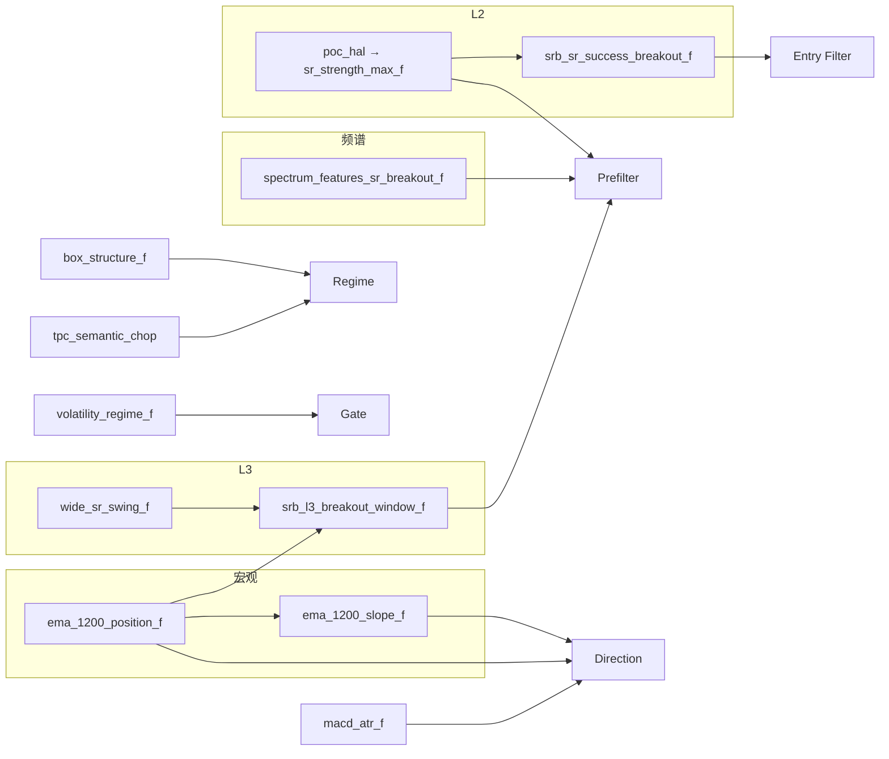

# SRB 特征全集

> **目的**：说明 SRB 策略管线会计算哪些特征、各自语义、以及是否进入当前生产规则。  
> **权威顺序**：`archetypes/*.yaml`（规则是否生效）> `features.yaml`（算子是否入库）> 本文件。  
> **配套阅读**：[SRB逻辑导读_CN.md](./SRB逻辑导读_CN.md)（决策流水线）、[meta.yaml](./meta.yaml)（L1/L2/L3 SR 分层）。  
> **最后对齐**：2026-06-17（`features.yaml` 88 算子 → 431 输出列）

---

## 1. 规模一览

| 项目 | 数量 |
|------|------|
| `features.yaml` 请求算子 | 88 |
| 展开后 parquet 列 | 431 |
| **生产 locked 规则直接引用** | **13 列**（见 §2） |
| Gate 白名单可搜（R&D） | 42 列模式 |
| Prefilter 子管线算子 | 9 个 |

绝大多数列属于 **「计算入库、供 R&D / ML / Gate 搜索」**，并不参与当前 locked 入场链。

---

## 2. 状态标签说明

| 标签 | 含义 |
|------|------|
| **规则生效** | 出现在 `archetypes/*.yaml` 的 locked 规则中，回测/实盘决策链会读 |
| **prefilter管线** | 在 `features_prefilter.yaml` 中请求；Phase-1 `mlbot research scan` 常用子集 |
| **gate白名单** | 在 `features_gate.yaml` 的 `allowed_gate_deny_features` 中；允许 Gate 优化器搜索 deny 规则，**当前磁盘 gate.yaml 未全部启用** |
| **仅计算入库** | `features.yaml` 会算进 parquet，但无 locked 规则引用 |

**未接入（不算 SRB 特征）**：`srb_cross_state_machine`、`fake_break_reverse` 等历史设计路径未 wired 到 `event_backtest`。

---

## 3. 生产规则直接使用的 13 列

以下列 **当前一定参与** SRB 决策（阈值见各 archetype YAML）。

### 3.1 Regime — `archetypes/regime.yaml`

| 列 | 算子 | 用途 | 规则 |
|----|------|------|------|
| `tpc_semantic_chop` | `tpc_soft_phase_f` | 震荡/来回扫语义分，高 chop 不适合趋势延续 | `<= 0.40` |
| `box_pos_120` | `box_structure_f` | 120×2H 箱体中轴位置 [0,1]；中部=来回扫 | `<=0.15` 或 `>=0.85` |
| `box_breakout_up` | `box_structure_f` | 向上突破箱体上沿信号 | `>= 0.5`（与 down 为 OR） |
| `box_breakout_down` | `box_structure_f` | 向下突破箱体下沿信号 | `>= 0.5` |

### 3.2 Prefilter — `archetypes/prefilter.yaml`

| 列 | 算子 | 用途 | 规则 |
|----|------|------|------|
| `sr_strength_max` | `sr_strength_max_f` | L2 SR 结构强度 SQS [0,1] | `>= 0.42` |
| `spectrum_price_high_freq_ratio` | `spectrum_features_sr_breakout_f` | 价格频谱高频能量比；突破邻域「抖动/能量」 | `>= 0.22` |
| `srb_l3_breakout_age_decay` | `srb_l3_breakout_window_f` | L3 wide-SR 突破后新鲜度衰减 [0,1] | `>= 0.35` |

> 注意：`spectrum_features_f` 也产出同名列，但 **prefilter 绑定的是 `spectrum_features_sr_breakout_f`**（价格专用、rolling_window=64）。

### 3.3 Gate — `archetypes/gate.yaml`

| 列 | 算子 | 用途 | 规则 |
|----|------|------|------|
| `vol_persistence` | `volatility_regime_f` | 波动持久性 ≈ GARCH α+β；过低=噪声切换，过高=拖泥带水 | 中段外 → deny |
| `vol_leverage_asymmetry` | `volatility_regime_f` | 波动杠杆非对称 ≈ GJR γ；极端时不做趋势延续 | 中段外 → deny |

### 3.4 Direction — `archetypes/direction.yaml`

| 列 | 算子 | 用途 | 规则 |
|----|------|------|------|
| `macd_atr` | `macd_atr_f` | ATR 归一化 MACD；取 **sign** 定多空 | 与 EMA1200 带通同向 |
| `ema_1200_position` | `ema_1200_position_f` | `(close-ema1200)/close`；价须在 EMA 单侧带内 | inner_abs=0.03 |
| `ema_1200_slope_10` | `ema_1200_slope_f` | 10 bar EMA1200 斜率；宏观趋势确认 | 与 signal 同号 |

### 3.5 Entry Filter — `archetypes/entry_filters.yaml`

| 列 | 算子 | 用途 | 规则 |
|----|------|------|------|
| `srb_sr_success_breakout_score` | `srb_sr_success_breakout_f` | 近 SR + CVD/价格同向推进（FER 失败突破的对偶） | `>= 0.12` |

---

## 4. SRB 专用算子（深度说明）

### 4.1 `spectrum_features_sr_breakout_f`

- **实现**：`extract_spectrum_features_from_series`（仅 close，window=64）
- **输出**：`spectrum_price_high_freq_ratio`、`spectrum_price_flatness`、`spectrum_price_low_freq_ratio`、`spectrum_price_entropy`
- **语义**：在 SR 突破语境下，用滚动 FFT 频谱刻画价格局部是「高频抖动」还是「低频漂移」。`high_freq_ratio` 高 → 突破邻域能量集中，符合 SRB「刚打破边界」形态。
- **生效**：仅 `spectrum_price_high_freq_ratio` 进入 locked prefilter。

### 4.2 `srb_l3_breakout_window_f`

- **实现**：`src/features/time_series/srb_features.py` → `compute_srb_l3_breakout_window_from_series`
- **依赖**：`wide_sr_swing_f`（L3 上下沿）、`ema_1200_position_f`、`atr_f`
- **输出列**：

| 列 | 含义 |
|----|------|
| `srb_l3_breakout_side` | +1 上破 / -1 下破 / 0 无活跃窗口 |
| `srb_l3_breakout_age_bars` | 突破后持有 bar 数（max 24） |
| `srb_l3_breakout_age_decay` | 线性新鲜度 `(1 - age/max_age) × hold` |
| `srb_l3_breakout_hold` | 是否仍在突破侧持有 |
| `srb_l3_breakout_ema_pos_align` | EMA1200 位置与突破侧对齐（原 2b） |
| `srb_l3_breakout_ema_slope_align` | EMA1200 斜率与突破侧对齐 |
| `srb_l3_breakout_2b_score` | 2b 对齐综合分 |

- **语义**：用普通特征列替代历史 runtime `2a/2b` 状态机；prefilter 只锁 **新鲜度** `age_decay`，不直接锁 `2b_score`（订单流确认在 entry filter）。
- **生效**：`srb_l3_breakout_age_decay` locked；其余列供 scan / 诊断。

### 4.3 `srb_sr_success_breakout_f`

- **实现**：`compute_srb_sr_success_breakout_from_series`
- **依赖**：`sr_strength_max_f`（`dist_to_nearest_sr`、`direction_to_nearest_sr`）、`cvd_change_features_f`
- **输出**：
  - `srb_sr_success_breakout_score` [0,1] — **entry filter 使用**
  - `srb_sr_success_breakout_score_pct` — 分位版
  - `srb_sr_success_breakout_direction_signed` — 带符号方向
- **语义**：价格在近 SR（≤1.2 ATR）且 aggressive flow 与 `direction_to_nearest_sr` 同向；效率增益、翻转噪声低。与 `fer_sr_failed_breakout_*` 对偶。

---

## 5. SR 三层结构（L1 / L2 / L3）

SRB 与全仓库统一的 SR 分层（见 `meta.yaml`）：

| 层 | 时间尺度 | 主要算子 / 列 | SRB 中的角色 |
|----|----------|---------------|--------------|
| **L1** | ≈1–2 日 | `srb_regime` 运行时 swing SR（非 features.yaml 列） | 结构化止损主锚 |
| **L2** | ≈2 周 | `sr_strength_max_f` → `sr_strength_max`, `dist_to_nearest_sr` | **Prefilter 结构强度**；success breakout 近 SR 判定 |
| **L3** | ≈1 月 | `wide_sr_swing_f` → `wide_sr_upper/lower_px`, `wide_sr_dist_atr` | **L3 突破窗口**输入；执行层 SL fallback（见 meta 注释；当前 `execution.yaml` 已精简） |

`box_structure_f` 提供多尺度（60/120/240/480/1200）箱体；Regime 仅用 **120** 尺度。

---

## 6. 依赖链（SRB 核心）

---

## 7. Gate 白名单 vs 当前 gate.yaml

`features_gate.yaml` 允许优化器在以下模式上搜索 **deny** 规则（示例）：

- 订单流：`cvd_change_5_normalized`、`vpin_*`、`macro_tp_vwap_1200_position`
- 波动：`vol_persistence`、`vol_leverage_asymmetry`、`vol_regime_shift*`
- 尾部：`stat_evt_*`
- Chop：`tpc_semantic_chop`、`bb_width_normalized_pct`、`range_compression_*`

**当前磁盘 `gate.yaml` 仅 locked 两条**：`vol_persistence` 与 `vol_leverage_asymmetry` 中段 deny。其余白名单列 **已入库、可搜，但未 promote 到生产 gate**。

---

## 8. 算子未进规则但值得知道的列

| 列 | 说明 |
|----|------|
| `dist_to_nearest_sr` / `direction_to_nearest_sr` | L2 距离与侧别；`srb_sr_success_breakout_f` 内部消费 |
| `wide_sr_dist_atr` | 价距 L3 带；历史实验用于 entry guard，当前 execution 未展开 |
| `tpc_score_breakout` | 与 TPC 回调区分；**未**进 SRB locked 规则 |
| `fer_sr_failed_breakout_*` | FER 假突破语义；SRB 不算失败侧，仅算对偶 success 分 |
| `roc_20` | README/meta 仍写 ROC 方向；**当前 direction 已改为 MACD×EMA1200** |

---

## 9. 全量特征目录（按语义分组）

下列表格由 `features.yaml` × `config/feature_dependencies.yaml` 自动展开。  
同一列名若出现在多个算子，以 **prefilter/规则绑定的算子** 为准。

### SRB 专用

| 算子 | 输出列 | 用途摘要 | 状态 |
|------|--------|----------|------|
| `spectrum_features_sr_breakout_f` | `spectrum_price_high_freq_ratio` | SR 突破策略专用频谱特征（精确选择：high_freq_ratio, flatness, low_freq_ratio, entropy） | 规则生效、prefilter管线 |
| `spectrum_features_sr_breakout_f` | `spectrum_price_flatness` |  | prefilter管线 |
| `spectrum_features_sr_breakout_f` | `spectrum_price_low_freq_ratio` |  | prefilter管线 |
| `spectrum_features_sr_breakout_f` | `spectrum_price_entropy` |  | prefilter管线 |
| `srb_l3_breakout_window_f` | `srb_l3_breakout_side` | SRB L3 wide-SR breakout side/window decay and EMA1200 2b alignment. | prefilter管线 |
| `srb_l3_breakout_window_f` | `srb_l3_breakout_age_bars` |  | prefilter管线 |
| `srb_l3_breakout_window_f` | `srb_l3_breakout_age_decay` |  | 规则生效、prefilter管线 |
| `srb_l3_breakout_window_f` | `srb_l3_breakout_hold` |  | prefilter管线 |
| `srb_l3_breakout_window_f` | `srb_l3_breakout_ema_pos_align` |  | prefilter管线 |
| `srb_l3_breakout_window_f` | `srb_l3_breakout_ema_slope_align` |  | prefilter管线 |
| `srb_l3_breakout_window_f` | `srb_l3_breakout_2b_score` |  | prefilter管线 |
| `srb_sr_success_breakout_f` | `srb_sr_success_breakout_score` | SRB structural breakout success near SR (dual of FER fer_sr_failed_breakout); CVD-price continuation | 规则生效 |
| `srb_sr_success_breakout_f` | `srb_sr_success_breakout_score_pct` |  | 仅计算入库 |
| `srb_sr_success_breakout_f` | `srb_sr_success_breakout_direction_signed` |  | 仅计算入库 |

### SR / 结构

| 算子 | 输出列 | 用途摘要 | 状态 |
|------|--------|----------|------|
| `sr_strength_max_f` | `sr_strength_max` | SR strength with normalized outputs. sr_strength_max [0,1], dist_to_nearest_sr in ATR multiples [-3, | 规则生效、prefilter管线 |
| `sr_strength_max_f` | `dist_to_nearest_sr` |  | prefilter管线 |
| `sr_strength_max_f` | `direction_to_nearest_sr` |  | prefilter管线 |
| `box_structure_f` | `box_hi_60` | Causal consolidation-box detector on fixed windows (60/120/240/480/1200 2H bars): rolling hi/lo, wid | 仅计算入库 |
| `box_structure_f` | `box_lo_60` |  | 仅计算入库 |
| `box_structure_f` | `box_width_pct_60` |  | 仅计算入库 |
| `box_structure_f` | `box_pos_60` |  | 仅计算入库 |
| `box_structure_f` | `box_stability_60` |  | 仅计算入库 |
| `box_structure_f` | `box_touches_hi_60` |  | 仅计算入库 |
| `box_structure_f` | `box_touches_lo_60` |  | 仅计算入库 |
| `box_structure_f` | `box_hi_120` |  | 仅计算入库 |
| `box_structure_f` | `box_lo_120` |  | 仅计算入库 |
| `box_structure_f` | `box_width_pct_120` |  | 仅计算入库 |
| `box_structure_f` | `box_pos_120` |  | 规则生效 |
| `box_structure_f` | `box_stability_120` |  | 仅计算入库 |
| `box_structure_f` | `box_touches_hi_120` |  | 仅计算入库 |
| `box_structure_f` | `box_touches_lo_120` |  | 仅计算入库 |
| `box_structure_f` | `box_hi_240` |  | 仅计算入库 |
| `box_structure_f` | `box_lo_240` |  | 仅计算入库 |
| `box_structure_f` | `box_width_pct_240` |  | 仅计算入库 |
| `box_structure_f` | `box_pos_240` |  | 仅计算入库 |
| `box_structure_f` | `box_stability_240` |  | 仅计算入库 |
| `box_structure_f` | `box_touches_hi_240` |  | 仅计算入库 |
| `box_structure_f` | `box_touches_lo_240` |  | 仅计算入库 |
| `box_structure_f` | `box_hi_480` |  | 仅计算入库 |
| `box_structure_f` | `box_lo_480` |  | 仅计算入库 |
| `box_structure_f` | `box_width_pct_480` |  | 仅计算入库 |
| `box_structure_f` | `box_pos_480` |  | 仅计算入库 |
| `box_structure_f` | `box_stability_480` |  | 仅计算入库 |
| `box_structure_f` | `box_touches_hi_480` |  | 仅计算入库 |
| `box_structure_f` | `box_touches_lo_480` |  | 仅计算入库 |
| `box_structure_f` | `box_hi_1200` |  | 仅计算入库 |
| `box_structure_f` | `box_lo_1200` |  | 仅计算入库 |
| `box_structure_f` | `box_width_pct_1200` |  | 仅计算入库 |
| `box_structure_f` | `box_pos_1200` |  | 仅计算入库 |
| `box_structure_f` | `box_stability_1200` |  | 仅计算入库 |
| `box_structure_f` | `box_touches_hi_1200` |  | 仅计算入库 |
| `box_structure_f` | `box_touches_lo_1200` |  | 仅计算入库 |
| `box_structure_f` | `box_compression_score` |  | 仅计算入库 |
| `box_structure_f` | `box_regime_label` |  | 仅计算入库 |
| `box_structure_f` | `box_breakout_up` |  | 规则生效 |
| `box_structure_f` | `box_breakout_down` |  | 规则生效 |
| `box_structure_f` | `box_prior_trend_sign` |  | 仅计算入库 |
| `wide_sr_swing_f` | `wide_sr_upper_px` | Large-scale SR (L3) proxy — rolling swing high/low over wide_window bars, shifted by anchor_shift to | prefilter管线 |
| `wide_sr_swing_f` | `wide_sr_lower_px` |  | prefilter管线 |
| `wide_sr_swing_f` | `wide_sr_dist_atr` |  | prefilter管线 |
| `wide_sr_swing_f` | `wide_sr_side` |  | prefilter管线 |
| `wide_sr_swing_f` | `wide_sr_range_width_atr` |  | prefilter管线 |

### Regime / TPC 语义

| 算子 | 输出列 | 用途摘要 | 状态 |
|------|--------|----------|------|
| `tpc_soft_phase_f` | `tpc_price_breakout_strength` | TPC soft phase scores - trend-based pullback/continuation without breakout gate. Direction from EMA1 | 仅计算入库 |
| `tpc_soft_phase_f` | `tpc_recent_breakout_strength` |  | 仅计算入库 |
| `tpc_soft_phase_f` | `tpc_vol_breakout_confirm` |  | 仅计算入库 |
| `tpc_soft_phase_f` | `tpc_cvd_breakout_confirm` |  | 仅计算入库 |
| `tpc_soft_phase_f` | `tpc_vpin_breakout_confirm` |  | 仅计算入库 |
| `tpc_soft_phase_f` | `tpc_pullback_depth` |  | 仅计算入库 |
| `tpc_soft_phase_f` | `tpc_pullback_quality` |  | 仅计算入库 |
| `tpc_soft_phase_f` | `tpc_vol_pullback_confirm` |  | 仅计算入库 |
| `tpc_soft_phase_f` | `tpc_cvd_absorption` |  | 仅计算入库 |
| `tpc_soft_phase_f` | `tpc_recovery_strength` |  | 仅计算入库 |
| `tpc_soft_phase_f` | `tpc_momentum_confirm` |  | 仅计算入库 |
| `tpc_soft_phase_f` | `tpc_vol_continuation_confirm` |  | 仅计算入库 |
| `tpc_soft_phase_f` | `tpc_cvd_momentum` |  | 仅计算入库 |
| `tpc_soft_phase_f` | `tpc_vpin_rising` |  | 仅计算入库 |
| `tpc_soft_phase_f` | `tpc_bb_compression` |  | 仅计算入库 |
| `tpc_soft_phase_f` | `tpc_vol_compression` |  | 仅计算入库 |
| `tpc_soft_phase_f` | `tpc_score_breakout` |  | 仅计算入库 |
| `tpc_soft_phase_f` | `tpc_score_pullback` |  | 仅计算入库 |
| `tpc_soft_phase_f` | `tpc_score_continuation` |  | 仅计算入库 |
| `tpc_soft_phase_f` | `tpc_score_neutral` |  | 仅计算入库 |
| `tpc_soft_phase_f` | `tpc_breakout_direction` |  | 仅计算入库 |
| `tpc_soft_phase_f` | `tpc_direction_confidence` |  | 仅计算入库 |
| `tpc_soft_phase_f` | `tpc_is_after_breakout` |  | 仅计算入库 |
| `tpc_soft_phase_f` | `tpc_was_in_pullback` |  | 仅计算入库 |
| `tpc_soft_phase_f` | `tpc_vol_ratio` |  | 仅计算入库 |
| `tpc_soft_phase_f` | `tpc_cvd_z` |  | 仅计算入库 |
| `tpc_soft_phase_f` | `tpc_semantic_chop` |  | 规则生效、gate白名单 |
| `tpc_soft_phase_f` | `tpc_semantic_extension` |  | 仅计算入库 |
| `tpc_soft_phase_f` | `tpc_semantic_chop_ts_q` |  | gate白名单 |

### 方向 / 趋势

| 算子 | 输出列 | 用途摘要 | 状态 |
|------|--------|----------|------|
| `macd_atr_f` | `macd_atr` | MACD Indicator (normalized by ATR for cross-asset comparability) | 规则生效 |
| `macd_atr_f` | `macd_signal_atr` |  | 仅计算入库 |
| `macd_atr_f` | `macd_histogram_atr` |  | 仅计算入库 |
| `ema_1200_position_f` | `ema_1200_position` | (close - ema_1200) / close; use with sign for macro direction. | 规则生效、prefilter管线 |
| `ema_1200_slope_f` | `ema_1200_slope_10` | 10-bar EMA(1200) slope, normalized by current level. Macro trend direction + strength; aligns with e | 规则生效、prefilter管线 |
| `roc_5_f` | `roc_5` | 5-bar rate of change z-score (normalized/unitless) | 仅计算入库 |
| `roc_10_f` | `roc_10` | Rate of Change (10) — percent change (unitless, normalized) | 仅计算入库 |
| `roc_20_f` | `roc_20` | Rate of Change (20) — percent change (unitless, normalized) | prefilter管线 |
| `sma_200_f` | `sma_200_position` | SMA Position (200): (close - sma) / close. Range [-0.3, 0.3]. Positive = price above MA. | 仅计算入库 |
| `macro_tp_vwap_1200_position_f` | `macro_tp_vwap_1200_position` | Rolling typical-price VWAP over 1200 bars; (close - vwap) / close. | gate白名单 |
| `trend_r2_20_f` | `trend_r2_20` | 20-bar trend R² (log price) in [0,1] (normalized/unitless) | 仅计算入库 |
| `path_efficiency_pct_f` | `path_efficiency_pct` | Percentile rank of path_efficiency (net_displacement / total_path_length, used in gate rules) | 仅计算入库 |
| `path_length_pct_f` | `path_length_pct` | Percentile rank of path_length (rolling path length in ATR units, used in gate rules) | 仅计算入库 |
| `price_dir_consistency_pct_f` | `price_dir_consistency_pct` | Percentile rank of price_dir_consistency (rolling consistency of actual price direction, used in gat | 仅计算入库 |
| `rsi_f` | `rsi` | Relative Strength Index | 仅计算入库 |

### 波动率 / Gate

| 算子 | 输出列 | 用途摘要 | 状态 |
|------|--------|----------|------|
| `volatility_regime_f` | `vol_persistence` | GARCH 参数的无模型近似，线上级。 vol_persistence ≈ α+β，Spearman≥0.80 vs GARCH。 vol_leverage_asymmetry ≈ γ，Spearma | 规则生效、prefilter管线、gate白名单 |
| `volatility_regime_f` | `vol_leverage_asymmetry` |  | 规则生效、prefilter管线、gate白名单 |
| `volatility_regime_f` | `vol_clustering_strength` |  | prefilter管线 |
| `vol_regime_features_f` | `vol_zscore` | vol_zscore / vol_percentile_approx：波动率regime特征 | 仅计算入库 |
| `vol_regime_features_f` | `vol_percentile_approx` |  | 仅计算入库 |
| `vol_trend_features_f` | `vol_slope_5` | vol_slope_* / vol_accel：基础波动率趋势与加速度，已归一 (normalized, unitless) | 仅计算入库 |
| `vol_trend_features_f` | `vol_slope_10` |  | 仅计算入库 |
| `vol_trend_features_f` | `vol_slope_20` |  | 仅计算入库 |
| `vol_trend_features_f` | `vol_accel` |  | 仅计算入库 |
| `vol_mom_features_f` | `vol_mom_3` | vol_mom_*：基础波动率的动量（pct_change，已归一, normalized) | 仅计算入库 |
| `vol_mom_features_f` | `vol_mom_5` |  | 仅计算入库 |
| `vol_mom_features_f` | `vol_mom_10` |  | 仅计算入库 |
| `atr_percentile_f` | `atr_percentile` | Rolling ATR percentile (compression detector) | 仅计算入库 |
| `bb_width_normalized_pct_f` | `bb_width_normalized_pct` | 自包含的 bb_width_normalized percentile（内部计算 BB width/ATR 再转百分位） | gate白名单 |
| `jump_risk_pct_f` | `jump_risk_pct` | Percentile rank of jump_risk (microstructure stability, used in gate rules) | 仅计算入库 |

### BPC 软阶段

| 算子 | 输出列 | 用途摘要 | 状态 |
|------|--------|----------|------|
| `bpc_pullback_depth_pct_f` | `bpc_pullback_depth_long` | BPC pullback depth as percentage of range, side-aware (long/short/adaptive) | 仅计算入库 |
| `bpc_pullback_depth_pct_f` | `bpc_pullback_depth_short` |  | 仅计算入库 |
| `bpc_pullback_depth_pct_f` | `bpc_pullback_depth_pct` |  | 仅计算入库 |
| `bpc_pullback_duration_f` | `bpc_pullback_duration` | BPC pullback duration in consecutive bars (normalized) | 仅计算入库 |
| `bpc_pullback_speed_f` | `bpc_pullback_speed` | BPC pullback speed = depth / (duration + 1), robust to division by zero | 仅计算入库 |
| `bpc_impulse_return_atr_f` | `bpc_impulse_return_atr` | BPC impulse return normalized by ATR, with direction + split long/short branches (both higher_is_bet | 仅计算入库 |
| `bpc_impulse_return_atr_f` | `bpc_impulse_direction_match` |  | 仅计算入库 |
| `bpc_impulse_return_atr_f` | `bpc_impulse_return_atr_long` |  | 仅计算入库 |
| `bpc_impulse_return_atr_f` | `bpc_impulse_return_atr_short` |  | 仅计算入库 |
| `bpc_dir_consistency_multi_f` | `bpc_dir_consistency_short` | BPC multi-scale direction consistency (short/mid/long windows) | 仅计算入库 |
| `bpc_dir_consistency_multi_f` | `bpc_dir_consistency_mid` |  | 仅计算入库 |
| `bpc_dir_consistency_multi_f` | `bpc_dir_consistency_long` |  | 仅计算入库 |
| `bpc_dir_flip_count_f` | `bpc_dir_flip_count` | BPC direction flip count in recent bars (normalized) | 仅计算入库 |
| `bpc_volume_compression_pct_f` | `bpc_volume_compression_pct` | BPC volume compression percentile (low = contracting, high = expanding) | 仅计算入库 |
| `bpc_pullback_delta_absorption_f` | `bpc_pullback_delta_absorption` | BPC pullback delta absorption using z-score + split long/short branches (long=price↓×cvd↑ accumulati | 仅计算入库 |
| `bpc_pullback_delta_absorption_f` | `bpc_pullback_delta_absorption_long` |  | 仅计算入库 |
| `bpc_pullback_delta_absorption_f` | `bpc_pullback_delta_absorption_short` |  | 仅计算入库 |

### 订单流 / VPIN

| 算子 | 输出列 | 用途摘要 | 状态 |
|------|--------|----------|------|
| `vpin_features_f` | `vpin` | Composite feature: keep backward-compatible name `vpin_features` while DAG computes vpin + trade_clu | 仅计算入库 |
| `vpin_features_f` | `vpin_signed_imbalance` |  | gate白名单 |
| `vpin_features_f` | `vpin_last` |  | gate白名单 |
| `vpin_features_f` | `vpin_max` |  | gate白名单 |
| `vpin_features_f` | `vpin_min` |  | gate白名单 |
| `vpin_features_f` | `vpin_std` |  | gate白名单 |
| `vpin_features_f` | `vpin_count` |  | gate白名单 |
| `vpin_features_f` | `vpin_skewness` |  | gate白名单 |
| `vpin_features_f` | `vpin_trend` |  | gate白名单 |
| `vpin_features_f` | `vpin_signed_imbalance_last` |  | gate白名单 |
| `vpin_features_f` | `vpin_signed_imbalance_max` |  | gate白名单 |
| `vpin_features_f` | `vpin_ma5` |  | gate白名单 |
| `vpin_features_f` | `vpin_ma10` |  | gate白名单 |
| `vpin_features_f` | `vpin_ma20` |  | gate白名单 |
| `vpin_features_f` | `vpin_max5` |  | gate白名单 |
| `vpin_features_f` | `vpin_max10` |  | gate白名单 |
| `vpin_features_f` | `vpin_max20` |  | gate白名单 |
| `vpin_features_f` | `vpin_change` |  | gate白名单 |
| `vpin_features_f` | `vpin_change_pct` |  | gate白名单 |
| `vpin_features_f` | `vpin_zscore_20` |  | gate白名单 |
| `vpin_features_f` | `vpin_zscore_50` |  | gate白名单 |
| `vpin_features_f` | `vpin_quantile_rank_20` |  | gate白名单 |
| `vpin_features_f` | `vpin_quantile_rank_50` |  | gate白名单 |
| `vpin_features_f` | `vpin_volatility_10` |  | gate白名单 |
| `vpin_features_f` | `vpin_volatility_20` |  | gate白名单 |
| `vpin_features_f` | `vpin_spike_flag_20` |  | gate白名单 |
| `vpin_features_f` | `vpin_spike_flag_50` |  | gate白名单 |
| `vpin_features_f` | `vpin_momentum` |  | gate白名单 |
| `vpin_features_f` | `vpin_signed_imbalance_zscore_20` |  | gate白名单 |
| `vpin_features_f` | `vpin_signed_imbalance_zscore_50` |  | gate白名单 |
| `vpin_features_f` | `trade_cluster_max_buy_run` |  | 仅计算入库 |
| `vpin_features_f` | `trade_cluster_max_sell_run` |  | 仅计算入库 |
| `vpin_features_f` | `trade_cluster_avg_buy_run` |  | 仅计算入库 |
| `vpin_features_f` | `trade_cluster_avg_sell_run` |  | 仅计算入库 |
| `vpin_features_f` | `trade_cluster_buy_run_count` |  | 仅计算入库 |
| `vpin_features_f` | `trade_cluster_sell_run_count` |  | 仅计算入库 |
| `vpin_features_f` | `trade_cluster_imbalance_ratio` |  | 仅计算入库 |
| `vpin_features_f` | `trade_cluster_directional_entropy` |  | 仅计算入库 |
| `vpin_features_f` | `trade_cluster_max_run_ratio` |  | 仅计算入库 |
| `vpin_features_f` | `trade_cluster_avg_run_ratio` |  | 仅计算入库 |
| `vpin_features_f` | `trade_cluster_max_buy_run_ma5` |  | 仅计算入库 |
| `vpin_features_f` | `trade_cluster_max_buy_run_ma10` |  | 仅计算入库 |
| `vpin_features_f` | `trade_cluster_max_buy_run_ma20` |  | 仅计算入库 |
| `vpin_features_f` | `trade_cluster_imbalance_ratio_ma5` |  | 仅计算入库 |
| `vpin_features_f` | `trade_cluster_imbalance_ratio_ma10` |  | 仅计算入库 |
| `vpin_features_f` | `trade_cluster_imbalance_ratio_ma20` |  | 仅计算入库 |
| `vpin_features_f` | `trade_cluster_directional_entropy_ma5` |  | 仅计算入库 |
| `vpin_features_f` | `trade_cluster_directional_entropy_ma10` |  | 仅计算入库 |
| `vpin_features_f` | `trade_cluster_directional_entropy_ma20` |  | 仅计算入库 |
| `vpin_features_f` | `trade_cluster_directional_entropy_change` |  | 仅计算入库 |
| `vpin_features_f` | `trade_cluster_directional_entropy_zscore_20` |  | 仅计算入库 |
| `vpin_features_f` | `trade_cluster_directional_entropy_zscore_50` |  | 仅计算入库 |
| `vpin_features_f` | `trade_cluster_net_runs` |  | 仅计算入库 |
| `vpin_features_f` | `trade_cluster_total_runs` |  | 仅计算入库 |
| `vpin_features_f` | `trade_cluster_net_runs_ratio` |  | 仅计算入库 |
| `vpin_features_f` | `trade_cluster_max_run` |  | 仅计算入库 |
| `vpin_features_f` | `trade_cluster_buy_sell_max_ratio` |  | 仅计算入库 |
| `vpin_features_f` | `trade_cluster_buy_sell_avg_ratio` |  | 仅计算入库 |
| `vpin_features_f` | `trade_cluster_avg_run_length` |  | 仅计算入库 |
| `vpin_features_f` | `trade_cluster_total_run_length` |  | 仅计算入库 |
| `vpin_features_f` | `trade_cluster_imbalance_zscore_20` |  | 仅计算入库 |
| `vpin_features_f` | `trade_cluster_imbalance_zscore_50` |  | 仅计算入库 |
| `vpin_features_f` | `trade_cluster_net_runs_zscore_20` |  | 仅计算入库 |
| `vpin_features_f` | `trade_cluster_net_runs_zscore_50` |  | 仅计算入库 |
| `vpin_features_f` | `trade_cluster_max_buy_run_zscore_20` |  | 仅计算入库 |
| `vpin_features_f` | `trade_cluster_max_buy_run_zscore_50` |  | 仅计算入库 |
| `vpin_features_f` | `trade_cluster_max_sell_run_zscore_20` |  | 仅计算入库 |
| `vpin_features_f` | `trade_cluster_max_sell_run_zscore_50` |  | 仅计算入库 |
| `vpin_features_f` | `trade_cluster_net_runs_ma5` |  | 仅计算入库 |
| `vpin_features_f` | `trade_cluster_net_runs_ma10` |  | 仅计算入库 |
| `vpin_features_f` | `trade_cluster_net_runs_ma20` |  | 仅计算入库 |
| `vpin_features_f` | `trade_cluster_total_runs_ma5` |  | 仅计算入库 |
| `vpin_features_f` | `trade_cluster_total_runs_ma10` |  | 仅计算入库 |
| `vpin_features_f` | `trade_cluster_total_runs_ma20` |  | 仅计算入库 |
| `volume_ratio_pct_f` | `volume_ratio_pct` | 自包含的 volume_ratio percentile（内部计算 volume/rolling_mean 再转百分位） | 仅计算入库 |
| `ofci_pct_f` | `ofci_pct` | 自包含的 OFCI percentile（内部加载tick数据计算OFCI再转百分位） | 仅计算入库 |
| `shd_pct_f` | `shd_pct` | 自包含的 SHD percentile（内部计算rolling_corr(ΔCVD, returns)再转百分位） | 仅计算入库 |
| `cvd_change_features_f` | `cvd` | CVD change features (raw + normalized) passthrough. | 仅计算入库 |
| `cvd_change_features_f` | `cvd_change_1` |  | 仅计算入库 |
| `cvd_change_features_f` | `cvd_change_5` |  | 仅计算入库 |
| `cvd_change_features_f` | `cvd_change_20` |  | 仅计算入库 |
| `cvd_change_features_f` | `cvd_normalized` |  | 仅计算入库 |
| `cvd_change_features_f` | `cvd_change_5_normalized` |  | gate白名单 |
| `cvd_divergence_v2_f` | `cvd_divergence_score` | CVD Divergence V2: 连续化背离特征，替代 Bool 版本。 包含 3 个工业级复合特征：trend_div_alignment（方向轴）、 trend_div_tension（冲突强 | 仅计算入库 |
| `cvd_divergence_v2_f` | `cvd_divergence_score_pct` |  | 仅计算入库 |
| `cvd_divergence_v2_f` | `price_position` |  | 仅计算入库 |
| `cvd_divergence_v2_f` | `trend_div_alignment` |  | 仅计算入库 |
| `cvd_divergence_v2_f` | `trend_div_tension` |  | 仅计算入库 |
| `cvd_divergence_v2_f` | `div_location_pressure` |  | 仅计算入库 |
| `price_momentum_divergence_f` | `price_velocity_pct` | Price-Momentum Divergence: 价格-动量背离特征，与 CVD Divergence V2 正交。 CVD 度量 "行为支撑"，Momentum 度量 "推进力"。 所有输出均为 | 仅计算入库 |
| `price_momentum_divergence_f` | `price_accel_pct` |  | 仅计算入库 |
| `price_momentum_divergence_f` | `price_momentum_div_score` |  | 仅计算入库 |
| `price_momentum_divergence_f` | `price_momentum_div_score_pct` |  | 仅计算入库 |
| `price_momentum_divergence_f` | `momentum_div_tension` |  | 仅计算入库 |
| `price_momentum_divergence_f` | `momentum_location_pressure` |  | 仅计算入库 |
| `volume_participation_score_f` | `volume_activity_pct` | Volume Participation Score: Execution 层市场参与度/活跃度评分 [0,1]。 回答"现在市场有没有人在认真交易？"，用于 size 缩放 / entry 时机 / | 仅计算入库 |
| `volume_participation_score_f` | `volume_velocity_pct` |  | 仅计算入库 |
| `volume_participation_score_f` | `volume_stability` |  | 仅计算入库 |
| `volume_participation_score_f` | `volume_participation_score` |  | 仅计算入库 |
| `footprint_basic_f` | `fp_poc` | Single-bar footprint (POC/HVN/LVN/VAH/VAL + delta/imbalance/skew) computed from ticks inside each kl | 仅计算入库 |
| `footprint_basic_f` | `fp_hvn` |  | 仅计算入库 |
| `footprint_basic_f` | `fp_lvn` |  | 仅计算入库 |
| `footprint_basic_f` | `fp_vah` |  | 仅计算入库 |
| `footprint_basic_f` | `fp_val` |  | 仅计算入库 |
| `footprint_basic_f` | `fp_delta_poc` |  | 仅计算入库 |
| `footprint_basic_f` | `fp_max_imbalance_price` |  | 仅计算入库 |
| `footprint_basic_f` | `fp_max_imbalance_ratio` |  | 仅计算入库 |
| `footprint_basic_f` | `fp_volume_skew` |  | 仅计算入库 |
| `footprint_basic_f` | `fp_delta_skew` |  | 仅计算入库 |
| `footprint_basic_f` | `fp_exhaustion_price` |  | 仅计算入库 |
| `footprint_basic_f` | `fp_exhaustion_zscore` |  | 仅计算入库 |
| `footprint_basic_f` | `fp_delta_divergence` |  | 仅计算入库 |
| `market_cap_normalized_orderflow_f` | `market_cap_usd` | Market-cap normalized flow proxies (for multi-symbol robustness). | prefilter管线 |
| `market_cap_normalized_orderflow_f` | `dollar_volume_over_mcap` |  | prefilter管线 |
| `market_cap_normalized_orderflow_f` | `turnover_over_mcap` |  | prefilter管线 |
| `market_cap_normalized_orderflow_f` | `net_buy_usd_over_mcap` |  | prefilter管线 |
| `market_cap_normalized_orderflow_f` | `abs_net_buy_usd_over_mcap` |  | prefilter管线 |

### Trade Cluster

| 算子 | 输出列 | 用途摘要 | 状态 |
|------|--------|----------|------|
| `trade_cluster_entropy_zscore_features_f` | `trade_cluster_directional_entropy_zscore_20` | Trade clustering entropy zscore (20/50). | 仅计算入库 |
| `trade_cluster_entropy_zscore_features_f` | `trade_cluster_directional_entropy_zscore_50` |  | 仅计算入库 |
| `trade_cluster_imbalance_zscore_features_f` | `trade_cluster_imbalance_zscore_20` | Trade clustering imbalance zscore. | 仅计算入库 |
| `trade_cluster_imbalance_zscore_features_f` | `trade_cluster_imbalance_zscore_50` |  | 仅计算入库 |
| `trade_cluster_net_runs_zscore_features_f` | `trade_cluster_net_runs_zscore_20` | Trade clustering net_runs zscore. | 仅计算入库 |
| `trade_cluster_net_runs_zscore_features_f` | `trade_cluster_net_runs_zscore_50` |  | 仅计算入库 |
| `trade_cluster_max_buy_run_zscore_features_f` | `trade_cluster_max_buy_run_zscore_20` | Trade clustering max_buy_run zscore. | 仅计算入库 |
| `trade_cluster_max_buy_run_zscore_features_f` | `trade_cluster_max_buy_run_zscore_50` |  | 仅计算入库 |
| `trade_cluster_max_sell_run_zscore_features_f` | `trade_cluster_max_sell_run_zscore_20` | Trade clustering max_sell_run zscore. | 仅计算入库 |
| `trade_cluster_max_sell_run_zscore_features_f` | `trade_cluster_max_sell_run_zscore_50` |  | 仅计算入库 |

### 场景语义

| 算子 | 输出列 | 用途摘要 | 状态 |
|------|--------|----------|------|
| `wick_scene_semantic_scores_f` | `wick_compression_score` | Wick-based scene semantics (0..1): compression/ignition/absorption/exhaustion. | 仅计算入库 |
| `wick_scene_semantic_scores_f` | `wick_ignition_score` |  | 仅计算入库 |
| `wick_scene_semantic_scores_f` | `wick_absorption_score` |  | 仅计算入库 |
| `wick_scene_semantic_scores_f` | `wick_exhaustion_score` |  | 仅计算入库 |
| `wpt_scene_semantic_scores_f` | `wpt_compression_score` | WPT scene semantics: compression/ignition/absorption/exhaustion (0..1), using WPT+compression+trend  | 仅计算入库 |
| `wpt_scene_semantic_scores_f` | `wpt_ignition_score` |  | 仅计算入库 |
| `wpt_scene_semantic_scores_f` | `wpt_absorption_score` |  | 仅计算入库 |
| `wpt_scene_semantic_scores_f` | `wpt_exhaustion_score` |  | 仅计算入库 |
| `volume_profile_scene_semantic_scores_f` | `vp_compression_score` | Volume-profile scene semantics: compression/ignition/absorption/exhaustion (0..1). | 仅计算入库 |
| `volume_profile_scene_semantic_scores_f` | `vp_ignition_score` |  | 仅计算入库 |
| `volume_profile_scene_semantic_scores_f` | `vp_absorption_score` |  | 仅计算入库 |
| `volume_profile_scene_semantic_scores_f` | `vp_exhaustion_score` |  | 仅计算入库 |
| `liquidity_void_scene_semantic_scores_f` | `liquidity_void_compression_score` | LiquidityVoid scene semantics V2: 连续化版本，用 speed_norm 作为 soft gate。 4 个场景分数: compression/ignition/abs | 仅计算入库 |
| `liquidity_void_scene_semantic_scores_f` | `liquidity_void_ignition_score` |  | 仅计算入库 |
| `liquidity_void_scene_semantic_scores_f` | `liquidity_void_absorption_score` |  | 仅计算入库 |
| `liquidity_void_scene_semantic_scores_f` | `liquidity_void_exhaustion_score` |  | 仅计算入库 |
| `funding_scene_semantic_scores_f` | `funding_compression_score` | Funding-rate scene semantics: compression/ignition/absorption/exhaustion (0..1), gated by trend+comp | 仅计算入库 |
| `funding_scene_semantic_scores_f` | `funding_ignition_score` |  | 仅计算入库 |
| `funding_scene_semantic_scores_f` | `funding_absorption_score` |  | 仅计算入库 |
| `funding_scene_semantic_scores_f` | `funding_exhaustion_scene_score` |  | 仅计算入库 |
| `oi_scene_semantic_scores_f` | `oi_compression_score` | OI scene semantics: compression/ignition/absorption/exhaustion/trend-divergence (0..1). Inventory-ba | 仅计算入库 |
| `oi_scene_semantic_scores_f` | `oi_ignition_score` |  | 仅计算入库 |
| `oi_scene_semantic_scores_f` | `oi_absorption_score` |  | 仅计算入库 |
| `oi_scene_semantic_scores_f` | `oi_exhaustion_score` |  | 仅计算入库 |
| `oi_scene_semantic_scores_f` | `oi_trend_divergence_score` |  | 仅计算入库 |
| `fp_imbalance_scene_semantic_scores_f` | `fp_imbalance_compression_score` | Footprint max-imbalance scene semantics: compression/ignition/absorption/exhaustion (0..1), with SR+ | 仅计算入库 |
| `fp_imbalance_scene_semantic_scores_f` | `fp_imbalance_ignition_score` |  | 仅计算入库 |
| `fp_imbalance_scene_semantic_scores_f` | `fp_imbalance_absorption_score` |  | 仅计算入库 |
| `fp_imbalance_scene_semantic_scores_f` | `fp_imbalance_exhaustion_scene_score` |  | 仅计算入库 |
| `vpin_scene_semantic_scores_f` | `vpin_compression_score` | VPIN scene semantics: compression/ignition/absorption/exhaustion (0..1), with SR+compression+volume+ | gate白名单 |
| `vpin_scene_semantic_scores_f` | `vpin_ignition_score` |  | gate白名单 |
| `vpin_scene_semantic_scores_f` | `vpin_absorption_score` |  | gate白名单 |
| `vpin_scene_semantic_scores_f` | `vpin_exhaustion_scene_score` |  | gate白名单 |

### Volume Profile / 流动性

| 算子 | 输出列 | 用途摘要 | 状态 |
|------|--------|----------|------|
| `volume_profile_volatility_features_f` | `vp_width_ratio` | Volume Profile 波动率特征（从 WPT 降噪后的 Volume Profile 提取；normalized/unitless） | 仅计算入库 |
| `volume_profile_volatility_features_f` | `vp_poc_deviation` |  | 仅计算入库 |
| `volume_profile_volatility_features_f` | `vp_skewness` |  | 仅计算入库 |
| `volume_profile_volatility_features_f` | `vp_entropy` |  | 仅计算入库 |
| `volume_profile_volatility_features_f` | `vp_lv_ratio` |  | 仅计算入库 |
| `volume_profile_volatility_features_f` | `vp_hv_ratio` |  | 仅计算入库 |
| `liquidity_void_f` | `liquidity_void_detected` | 流动性真空区识别（Liquidity Void / Gap Detection） | 仅计算入库 |
| `liquidity_void_f` | `liquidity_void_speed` |  | 仅计算入库 |
| `liquidity_void_f` | `liquidity_void_volume_ratio` |  | 仅计算入库 |
| `liquidity_void_f` | `liquidity_void_price_impact` |  | 仅计算入库 |
| `liquidity_void_f` | `liquidity_void_retracement` |  | 仅计算入库 |
| `liquidity_void_f` | `liquidity_void_false_breakout_risk` |  | 仅计算入库 |
| `vwap_position_f` | `price_to_vwap_pct` | 价格相对于 VWAP 的归一化位置 price_to_vwap_pct = (close - vwap) / close price_to_vwap_ratio = close / vwap  | 仅计算入库 |
| `vwap_position_f` | `price_to_vwap_ratio` |  | 仅计算入库 |

### 资金费率 / OI

| 算子 | 输出列 | 用途摘要 | 状态 |
|------|--------|----------|------|
| `funding_rate_features_f` | `funding_rate` | Funding-rate features aligned to bar timestamps (Binance futures fundingRate). | 仅计算入库 |
| `funding_rate_features_f` | `funding_rate_abs` |  | 仅计算入库 |
| `funding_rate_features_f` | `funding_rate_change_1` |  | 仅计算入库 |
| `funding_rate_features_f` | `funding_rate_zscore_50` |  | 仅计算入库 |
| `funding_rate_features_f` | `funding_rate_abs_zscore_50` |  | 仅计算入库 |
| `oi_features_f` | `oi_usd` | Open Interest features aligned to bar timestamps (Binance futures, merge_asof backward, no look-ahea | 仅计算入库 |
| `oi_features_f` | `oi_change_pct` |  | 仅计算入库 |
| `oi_features_f` | `oi_zscore` |  | 仅计算入库 |
| `oi_features_f` | `oi_delta_price_sign` |  | 仅计算入库 |
| `oi_features_f` | `oi_flow_zscore` |  | 仅计算入库 |

### 数学 / 频谱

| 算子 | 输出列 | 用途摘要 | 状态 |
|------|--------|----------|------|
| `hurst_price_f` | `hurst_price_rolling` | Hurst 指数特征（生产优化版）- 价格收益率的滚动 Hurst，严格因果、高效计算 (normalized/unitless or similarity score) | 仅计算入库 |
| `spectrum_features_f` | `spectrum_price_has_dominant_freq` | 频谱分析特征（完整版，包含所有列） 用于波动率模型等需要全部特征的场景  | 仅计算入库 |
| `spectrum_features_f` | `spectrum_price_flatness` |  | 仅计算入库 |
| `spectrum_features_f` | `spectrum_price_high_freq_ratio` |  | 规则生效 |
| `spectrum_features_f` | `spectrum_price_low_freq_ratio` |  | 仅计算入库 |
| `spectrum_features_f` | `spectrum_price_entropy` |  | 仅计算入库 |
| `spectrum_features_f` | `spectrum_price_centroid` |  | 仅计算入库 |
| `spectrum_features_f` | `spectrum_volume_flatness` |  | 仅计算入库 |
| `spectrum_features_f` | `spectrum_volume_high_freq_ratio` |  | 仅计算入库 |
| `spectrum_features_f` | `spectrum_volume_low_freq_ratio` |  | 仅计算入库 |
| `spectrum_features_f` | `spectrum_volume_entropy` |  | 仅计算入库 |
| `spectrum_features_f` | `spectrum_volume_centroid` |  | 仅计算入库 |
| `spectrum_features_f` | `spectrum_cvd_flatness` |  | 仅计算入库 |
| `spectrum_features_f` | `spectrum_cvd_high_freq_ratio` |  | 仅计算入库 |
| `spectrum_features_f` | `spectrum_cvd_low_freq_ratio` |  | 仅计算入库 |
| `spectrum_features_f` | `spectrum_cvd_entropy` |  | 仅计算入库 |
| `spectrum_features_f` | `spectrum_cvd_centroid` |  | 仅计算入库 |
| `hilbert_phase_f` | `hilbert_price_env` | Hilbert envelope analysis (改进版：只提取包络，EMA 平滑，无未来信息) | 仅计算入库 |
| `hilbert_phase_f` | `hilbert_cvd_env` |  | 仅计算入库 |
| `hilbert_phase_f` | `hilbert_cvd_price_env_ratio` |  | 仅计算入库 |
| `hilbert_phase_f` | `hilbert_price_env_slope` |  | 仅计算入库 |
| `hilbert_phase_f` | `hilbert_cvd_env_slope` |  | 仅计算入库 |
| `wpt_price_fluctuation_f` | `wpt_price_fluctuation` | WPT price fluctuation + 能量比特征（用于 Hilbert 等需要去趋势价格的特征） | 仅计算入库 |
| `wpt_price_fluctuation_f` | `wpt_price_trend` |  | 仅计算入库 |
| `wpt_price_fluctuation_f` | `wpt_price_energy_low_ratio` |  | 仅计算入库 |
| `wpt_price_fluctuation_f` | `wpt_price_energy_mid_ratio` |  | 仅计算入库 |
| `wpt_price_fluctuation_f` | `wpt_price_energy_high_ratio` |  | 仅计算入库 |
| `evt_features_f` | `evt_tail_shape` | EVT (Extreme Value Theory) 极值理论特征：尾部风险预警（聚焦左尾暴跌风险）- 用于风险管理/仓位控制，不用于波动率预测 (normalized/unitless or sim | 仅计算入库 |
| `evt_features_f` | `evt_tail_shape_left` |  | 仅计算入库 |
| `evt_features_f` | `evt_tail_shape_right` |  | 仅计算入库 |
| `evt_features_f` | `evt_scale` |  | 仅计算入库 |
| `evt_features_f` | `evt_var_99` |  | 仅计算入库 |
| `evt_features_f` | `evt_es_99` |  | 仅计算入库 |
| `evt_features_f` | `evt_scale_left` |  | 仅计算入库 |
| `evt_features_f` | `evt_var_99_left` |  | 仅计算入库 |
| `evt_features_f` | `evt_es_99_left` |  | 仅计算入库 |
| `evt_features_f` | `evt_scale_right` |  | 仅计算入库 |
| `evt_features_f` | `evt_var_99_right` |  | 仅计算入库 |
| `evt_features_f` | `evt_es_99_right` |  | 仅计算入库 |
| `wpt_price_reconstructed_f` | `wpt_price_trend` | WPT 重构价格（趋势 + 波动），用于生成多尺度 SR (normalized/unitless or similarity score) | 仅计算入库 |
| `wpt_price_reconstructed_f` | `wpt_price_fluctuation` |  | 仅计算入库 |
| `wpt_price_reconstructed_f` | `wpt_price_reconstructed` |  | 仅计算入库 |
| `wpt_volume_energy_f` | `wpt_vper_low` | WPT + Volume 能量协同分析（VPER、能量下移、真假突破判断） (normalized/unitless or similarity score) | 仅计算入库 |
| `wpt_volume_energy_f` | `wpt_vper_mid` |  | 仅计算入库 |
| `wpt_volume_energy_f` | `wpt_vper_high` |  | 仅计算入库 |
| `wpt_volume_energy_f` | `wpt_energy_cascade` |  | 仅计算入库 |
| `wpt_volume_energy_f` | `wpt_multi_scale_consistency` |  | 仅计算入库 |
| `wpt_volume_energy_f` | `wpt_breakout_confidence` |  | 仅计算入库 |
| `wpt_volume_energy_f` | `wpt_false_breakout_risk` |  | 仅计算入库 |
| `wpt_cvd_fluctuation_f` | `wpt_cvd_fluctuation` | WPT CVD fluctuation (normalized/unitless or similarity score) | 仅计算入库 |
| `hurst_cvd_f` | `hurst_cvd_rolling` | Hurst 指数特征 - CVD 单期变化的滚动 Hurst，捕捉资金流的持续性 (normalized/unitless or similarity score) | 仅计算入库 |

### 交叉特征

| 算子 | 输出列 | 用途摘要 | 状态 |
|------|--------|----------|------|
| `exhaustion_at_liquidity_void_f` | `exhaustion_at_liquidity_void` | Semantic interaction: trade_cluster_exhaustion_score × liquidity_void (optionally × false_breakout_r | 仅计算入库 |
| `dual_compression_f` | `dual_compression_score` | Dual-source compression: funding_compression × vpin_compression. BPC-aligned — both independent sour | 仅计算入库 |
| `dual_ignition_f` | `dual_ignition_score` | Dual-source ignition: funding_ignition × fp_imbalance_ignition. ME-aligned — both funding and footpr | 仅计算入库 |
| `dual_exhaustion_f` | `dual_exhaustion_score` | Dual-source exhaustion: funding_exhaustion × vpin_exhaustion. FER-aligned — both funding and VPIN sh | 仅计算入库 |
| `funding_oi_crowding_f` | `funding_oi_crowding_score` | Funding x OI crowding confirmation: sigmoid(funding_abs_z) x sigmoid(oi_z). True crowding = high fun | 仅计算入库 |
| `liquidity_void_x_wpt_risk_rank_f` | `liquidity_void_x_wpt_risk_rank` | liquidity_void_x_wpt_risk 的 rank transform 版本 (normalized rank/score) | 仅计算入库 |
| `vpin_zscore_x_trade_cluster_max_buy_run_rank_f` | `vpin_zscore_x_trade_cluster_max_buy_run_rank` | vpin_zscore_x_trade_cluster_max_buy_run 的 rank transform 版本 (normalized 0-1) | gate白名单 |
| `vpin_x_trade_cluster_entropy_rank_f` | `vpin_x_trade_cluster_entropy_rank` | vpin_x_trade_cluster_entropy 的 rank transform 版本 (normalized 0-1) | gate白名单 |

### 跨 archetype / 其它

| 算子 | 输出列 | 用途摘要 | 状态 |
|------|--------|----------|------|
| `fer_failure_signals_f` | `fer_signed_efficiency` | FER failure-exhaustion-reversal signals for identifying single-side failure and reversal opportuniti | 仅计算入库 |
| `fer_failure_signals_f` | `fer_signed_efficiency_pct` |  | 仅计算入库 |
| `fer_failure_signals_f` | `fer_efficiency_flip` |  | 仅计算入库 |
| `fer_failure_signals_f` | `fer_efficiency_flip_strength` |  | 仅计算入库 |
| `fer_failure_signals_f` | `fer_aggressor_absorption` |  | 仅计算入库 |
| `fer_failure_signals_f` | `fer_absorption_streak` |  | 仅计算入库 |
| `fer_failure_signals_f` | `fer_trapped_longs_score` |  | 仅计算入库 |
| `fer_failure_signals_f` | `fer_trapped_shorts_score` |  | 仅计算入库 |
| `fer_failure_signals_f` | `fer_impulse_failure_score` |  | 仅计算入库 |
| `fer_failure_signals_f` | `fer_impulse_failure_direction` |  | 仅计算入库 |
| `fer_failure_signals_f` | `fer_impulse_failure_direction_signed` |  | 仅计算入库 |
| `fer_failure_signals_f` | `fer_sr_failed_breakout_score` |  | 仅计算入库 |
| `fer_failure_signals_f` | `fer_sr_failed_breakout_score_pct` |  | 仅计算入库 |
| `fer_failure_signals_f` | `fer_sr_failed_breakout_direction_signed` |  | 仅计算入库 |
| `fer_failure_signals_f` | `fer_momentum_efficiency_decay` |  | 仅计算入库 |
| `fer_failure_signals_f` | `fer_volume_price_divergence` |  | 仅计算入库 |
| `fer_failure_signals_f` | `fer_range_pos_20` |  | 仅计算入库 |
| `fer_failure_signals_f` | `fer_ols_pos` |  | 仅计算入库 |
| `fer_failure_signals_f` | `fer_ols_width_norm` |  | 仅计算入库 |
| `me_soft_phase_f` | `me_atr_pct` | ME v3.0 Energy × Acceleration × Participation three-factor model with 11 core features + me_semantic | 仅计算入库 |
| `me_soft_phase_f` | `me_vol_regime` |  | 仅计算入库 |
| `me_soft_phase_f` | `me_accel_2k` |  | 仅计算入库 |
| `me_soft_phase_f` | `me_accel_5k` |  | 仅计算入库 |
| `me_soft_phase_f` | `me_accel_persistence` |  | 仅计算入库 |
| `me_soft_phase_f` | `me_multi_tf_alignment` |  | 仅计算入库 |
| `me_soft_phase_f` | `me_cvd_alignment` |  | 仅计算入库 |
| `me_soft_phase_f` | `me_cvd_strength` |  | 仅计算入库 |
| `me_soft_phase_f` | `me_volume_surge` |  | 仅计算入库 |
| `me_soft_phase_f` | `me_volume_accel` |  | 仅计算入库 |
| `me_soft_phase_f` | `me_delta_net_flow` |  | 仅计算入库 |
| `me_soft_phase_f` | `me_semantic_chop` |  | 仅计算入库 |
| `me_soft_phase_f` | `me_semantic_chop_ts_q` |  | 仅计算入库 |
| `me_failure_f` | `me_false_expansion` | ME failure signals - expansion without follow-through. | 仅计算入库 |
| `me_failure_f` | `me_vol_divergence` |  | 仅计算入库 |
| `me_failure_f` | `me_flow_exhaustion` |  | 仅计算入库 |
| `me_failure_f` | `me_failure_score` |  | 仅计算入库 |
| `me_context_f` | `me_jump_risk_suitable` | ME context features - jump risk suitability and reflexivity risk. | 仅计算入库 |
| `me_context_f` | `me_reflex_risk` |  | 仅计算入库 |
| `me_context_f` | `me_regime_suitable` |  | 仅计算入库 |
| `session_features_f` | `session_id` | Session liquidity map: session_id (Asia=0/EU=1/US=2/Late=3), hour cyclic encoding (sin/cos), EU-US o | 仅计算入库 |
| `session_features_f` | `hour_sin` |  | 仅计算入库 |
| `session_features_f` | `hour_cos` |  | 仅计算入库 |
| `session_features_f` | `is_session_overlap` |  | 仅计算入库 |
| `bars_since_extreme_f` | `bars_since_local_high` | Bars since local high/low within lookback window, normalized. Low value = near extreme (chasing risk | 仅计算入库 |
| `bars_since_extreme_f` | `bars_since_local_low` |  | 仅计算入库 |
| `terminal_risk_score_f` | `momentum_exhaustion_score` | Terminal Risk Score: Execution 层末端风险评分 [0,1]。 综合 位置 + 动量衰竭 + CVD 背离，评估追单风险。 用于 size 缩放 / entry 延迟 /  | 仅计算入库 |
| `terminal_risk_score_f` | `cvd_exhaustion_score` |  | 仅计算入库 |
| `terminal_risk_score_f` | `location_amplifier` |  | 仅计算入库 |
| `terminal_risk_score_f` | `terminal_risk_score` |  | 仅计算入库 |
| `atr_f` | `atr` | Average True Range (ATR) in *price units* (not normalized). Used as the canonical scale column `atr` | 仅计算入库 |