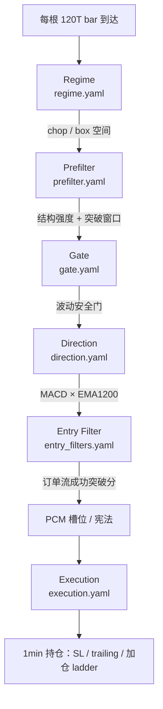

# SRB 逻辑导读（当前有效版）

> **目的**：把分散在多份文档里的 SRB 语义收成一份「能跑、能读、能改」的入口。  
> **权威顺序**：`archetypes/*.yaml` > `meta.yaml` / `features.yaml` > 本文件 > `README.md` 变更日志 > 历史实验报告。  
> **最后对齐**：2026-06-17（对照 `config/strategies/srb/archetypes/` 磁盘内容）

---

## 1. 一句话

**SRB（Structural Range Breakout）= 关键支撑/阻力被决定性打破之后，顺势骑结构延续。**

- 做：**真突破 → 趋势段**
- 不做：**假突破反手**（归 **FBF**）、**止损后再反手/再入**（已从 SRB 移除）
- 与 **TPC** 边界：TPC 是「已在趋势里等深回调」；SRB 是「边界刚被打破」
- 与 **BPC** 边界：BPC 要 Donchian 突破链 + 回踩；SRB 要 **L2/L3 SR 结构 + 突破频谱**

---

## 2. 文档地图：哪些还能看？

### ✅ 当前有效（日常必读）

| 文档 | 用途 |
|------|------|
| **`config/strategies/srb/archetypes/*.yaml`** | **唯一生产真相**：各层阈值与 locked 规则 |
| **`config/strategies/srb/meta.yaml`** | 策略语义、L1/L2/L3 SR 分层、与邻策略边界 |
| **`config/strategies/srb/features.yaml`** | 特征管线（哪些列进 parquet / 回测） |
| **`config/strategies/srb/SRB特征全集_CN.md`** | **全部 431 列**：用途、算子、是否规则生效 / Gate 白名单 |
| **`config/strategies/srb/README.md`** | 变更日志、与 BPC/TPC/ME 对照表、rolling 命令 |
| **`config/strategies/srb/EXPERIMENT_STATE_MACHINE.yaml`** | Execution 消融 preset（regime_execution / sr_structural_exit） |
| **`config/strategies/srb/experiment_baseline_a0.yaml`** | 基线 A0 指标与结果路径（对比用） |
| **`docs/experiments/z实验_005_统一研究/strategy_families_BPC_TPC_ME_FBF_SRB_RMR.md`** | 六家族产品语义对照（SRB vs FBF/TPC 边界） |
| **`docs/strategy/方法论_R_and_D流程_CN.md` §3.2** | B 系（含 SRB）各层 R&D 节奏与命令 |
| **`docs/strategy/regime_layer.md`** | Regime 层分工（SRB 与 BPC/TPC/ME 共用 chop/box 口径） |
| **`docs/strategy/ABC三层收益结构_战略框架_CN.md`** | SRB 在 **B 层 swing alpha** 的战略位置 |

### 📎 实验报告（参考价值，非操作手册）

`docs/experiments/z实验_009_SRB/` 下 2026-04 系列：

| 文件 | 仍可读的点 |
|------|-----------|
| `SRB_wide_sr_and_trailing_diagnosis_20260418.md` | L3 wide SR + trailing 行为 |
| `SRB_l3_dynamic_trailing_20260422.md` | 动态 trailing / 拿不住大涨 |
| `SRB_execution_layer_exhaustion_20260423.md` | 执行层耗尽、加仓 ladder |
| `SRB_break_level_attribution_20260422.md` | 突破位归因 |
| `SRB_ablation_results_20260418.md` | 消融结果存档 |

读这些时以 **当前 archetype YAML** 为准；报告里的参数可能已被 promote 覆盖。

### ❌ 过时 / 勿按此实现

| 文档 | 状态 |
|------|------|
| **`docs/design/srb_fake_break_reverse.md`** | **DEPRECATED** — 假破反手已迁出 SRB |
| **`docs/design/srb_cross_state_machine.md`** | **未接入** event_backtest / live；供 FBF / 历史设计参考 |
| `docs/experiments/z实验_009_SRB/SRB_reverse_fix_validation_20260417.md` | 反手路径实验，SRB 已不再消费 |
| `docs/experiments/z实验_009_SRB/SRB_cross_state_machine_20260419.md` | 同上 |
| `docs/experiments/z实验_009_SRB/SRB_staged_2b_diagnosis_20260424.md` | `srb_staged_entry_2b` 已关闭 |
| `config/strategies/bad-candidates/srb_quickstrike/` | 历史候选副本，非主线 |
| `docs/archive/**` 中带 SRB 反手 / reverse 的段落 | 归档 |

### ⚠️ 已知文档漂移（以 YAML 为准）

- `README.md` / `meta.yaml` 写方向为 **ROC20 × EMA1200**；当前 **`archetypes/direction.yaml` 锁定为 MACD sign × EMA1200 带通**。
- `README.md` 描述的部分 execution 细项（`sr_wide_entry_guard`、`l3_structural_exit` 等）在 **当前精简版 `execution.yaml`** 中未展开；结构化语义仍在特征与 `meta.yaml` 注释里，执行以磁盘 YAML 为准。

---

## 3. 决策流水线（从 bar 到下单）

主周期：**120T（2h）**；执行与持仓模拟在 **1min bar** 上推进（与实盘对齐）。



**漏斗审计**：`event_backtest` 终端与 JSON 会输出 `reject_regime`、`reject_prefilter_deny`、`reject_gate_deny`、`reject_entry_filter_deny`、`reject_no_direction` 等计数——这是调参时最重要的反馈。

---

## 4. 各层在做什么？

### 4.1 Regime（慢变量 · 数据空间）

文件：`archetypes/regime.yaml`

| 规则 | 含义 |
|------|------|
| `tpc_semantic_chop <= 0.40` | 高 chop 不做趋势延续（与 BPC/TPC/ME 同源） |
| `box_pos_120` 在边缘或 `box_breakout_*` | 不在箱体中部反复扫单；要在边缘或已突破 |

**作用**：不是「预测方向」，而是 **砍掉不适合做 SR 突破延续的体制**。

### 4.2 Prefilter（形态本体）

文件：`archetypes/prefilter.yaml`（locked）

| 特征 | 阈值 | 语义 |
|------|------|------|
| `sr_strength_max` | ≥ 0.42 | L2 结构强度足够 |
| `spectrum_price_high_freq_ratio` | ≥ 0.22 | 突破邻域频谱能量 |
| `srb_l3_breakout_age_decay` | ≥ 0.35 | L3 真突破后的 **新鲜窗口**（不追尾段） |

订单流、EMA 2b 等 **不在 prefilter**（见 README 2026-04-25 语义收紧）。

### 4.3 Gate（安全帽）

文件：`archetypes/gate.yaml`

- `vol_persistence` 中段外 → deny（低波噪声 / 过高持久拖泥带水）
- `vol_leverage_asymmetry` 中段外 → deny  
- 原 `tpc_semantic_chop` gate 已 **迁到 regime**

### 4.4 Direction（多空）

文件：`archetypes/direction.yaml`（locked）

- **MACD sign** 与 **EMA1200 相对位置带**（inner=0.03）同向
- **EMA1200 斜率** 同向确认  
- 事件回测对 `ema_1200_position` / `roc_20` 有因果前向填充（慢窗 NaN 不致 direction=0）

### 4.5 Entry Filter（时机 · 订单流）

文件：`archetypes/entry_filters.yaml`

- `srb_sr_success_breakout_score >= 0.12`：近 SR 价量同向推进  
- 多 filter 为 **OR**；当前仅一条 locked filter

### 4.6 Execution（出场 · 加仓）

文件：`archetypes/execution.yaml`（当前 adopt 版）

| 项 | 当前值 | 含义 |
|----|--------|------|
| `initial_r` | 4.5 | 初始止损宽度（×ATR） |
| `breakeven` | trigger 6R, lock 2R | 浮盈保护 |
| `trailing` | activation 6R, trail 6R, expand_with_primary_atr | 宽 trailing 骑趋势 |
| `take_profit` | disabled | 不靠固定 TP，靠 trailing / 结构出场 |
| `add_position` | float_r_ladder_only, +2R/+4R 阶梯 | 与 ME/BPC 类似的 R 阶梯加仓 |

更激进的 execution 实验 preset 见 `EXPERIMENT_STATE_MACHINE.yaml`（regime_execution / sr_structural_exit 开关）。

---

## 5. SR 三层结构（特征视角）

| 层级 | 窗口 | 特征 | SRB 用法 |
|------|------|------|----------|
| **L1** | ~1–2 日 | `srb_sr_support/resistance`（swing） | 破位判定、结构化 SL 主锚 |
| **L2** | ~2 周 | `sr_strength_max`, `dist_to_nearest_sr` | Prefilter 结构强度 |
| **L3** | ~1 月 | `wide_sr_swing_f` → `wide_sr_*`, `wide_sr_dist_atr` | 关键带、突破新鲜度（`srb_l3_breakout_age_decay`） |

特征定义见 `features.yaml` / `features_prefilter.yaml`。

---

## 6. 怎么测？（本地最短路径）

### 6.1 单次事件回测 + 网页 K 线

**macOS 先启用 BLAS 稳定环境**（避免 NumPy/OpenBLAS 段错误弹「Python 意外退出」）：

```bash
source scripts/activate_mlbot.sh   # = .venv + OPENBLAS_NUM_THREADS=1 等
bash scripts/verify_blas_stable.sh # 一次性自检（matmul + parquet + json）
```

```bash
cd /path/to/ml-trading-bot
source .venv/bin/activate
mkdir -p results/event_backtest/srb_smoke

python scripts/event_backtest.py \
  --strategy srb \
  --symbols BTCUSDT \
  --start-date 2024-01-01 --end-date 2024-06-30 \
  --data-path data/parquet_data \
  --strategies-root config/strategies \
  --fast \
  --output results/event_backtest/srb_smoke/event_backtest_srb.json \
  --trading-map results/event_backtest/srb_smoke/trading_map_srb.html \
  --trades-csv results/event_backtest/srb_smoke/event_trades_srb.csv

open results/event_backtest/srb_smoke/trading_map_srb.html
```

| 产物 | 内容 |
|------|------|
| `trading_map_srb.html` | 2H K 线 + EMA/VWAP + 买卖点 |
| `capital_report.html` | 同目录自动生成（资金曲线） |
| `event_trades_srb.csv` | 逐笔交易 |
| `event_backtest_srb.json` | 漏斗 + 指标 JSON |

### 6.2 正式 rolling 对比（对标 `experiment_baseline_a0.yaml`）

```bash
mlbot pipeline run --all --no-adopt \
  --config config/prod_train_pipeline_2h_turbo_2024bull_thresholds_only_srb_only.yaml \
  --stage rolling_sim --skip-shap
```

产物：`results/srb/.../stitched_summary.json`、`trading_map_continuous.html`。

### 6.3 Phase 1 扫描（改阈值前）

```bash
mlbot research scan feature-plateau --strategy srb --layer prefilter \
  --parquet <features_labeled.parquet> ...
```

流程约束见 `config/experiments/README.md` 与 `docs/strategy/方法论_R_and_D流程_CN.md`。

---

## 7. 与 backtrader_project 的对应关系

| | backtrader `SRBreakoutStrategy` | 本仓库 SRB |
|---|--------------------------------|------------|
| 周期 | 5m | 120T（2h） |
| 关键位 | POC / Swing / ZigZag | L2/L3 SR + 突破频谱 |
| 假突破 | 可反手 | **不做**（FBF 负责） |
| 配置 | Python `params` | YAML 分层 archetype |
| 看图 | Streamlit `:8501` | `trading_map_*.html` |

---

## 8. 调参抓手（信号太少 / 太多时）

| 现象 | 优先看 | 可调方向 |
|------|--------|----------|
| `reject_regime` 极高 | regime.yaml | chop/box 是否过严 |
| prefilter 拒多 | `sr_strength_max`, `srb_l3_breakout_age_decay` | 略放宽新鲜度窗口 |
| direction 拒多 | direction.yaml / 特征 NaN | 检查 `ema_1200_position` 填充 |
| entry 拒多 | `srb_sr_success_breakout_score` | 略降 0.12 |
| 交易太少 | 拉长日期、加 ETH 等 symbol | 单币短窗 1–2 笔正常 |

---

## 9. 相关脚本锚点

| 脚本 | 作用 |
|------|------|
| `scripts/event_backtest.py` | 主回测 + trading map |
| `scripts/srb_experiment_report.py` | rolling run 对比报告 |
| `scripts/srb_execution_grid.py` | execution 网格 |
| `src/time_series_model/live/srb_regime.py` | 加仓门控 |
| `src/time_series_model/live/generic_live_strategy.py` | 各层评估入口 |

---

## 10. 快速检查清单

- [ ] `data/parquet_data` 覆盖回测日期
- [ ] `--strategies-root config/strategies`（完整策略树，勿只拷 srb/）
- [ ] 回测 JSON 漏斗：regime / prefilter / gate / entry / direction 各占多少
- [ ] 打开 `trading_map_*.html` 核对买卖点与 L3 结构是否同侧
- [ ] 与 `experiment_baseline_a0.yaml` 比 `stitched_total_r` 前先对齐时间窗与 symbol 集
