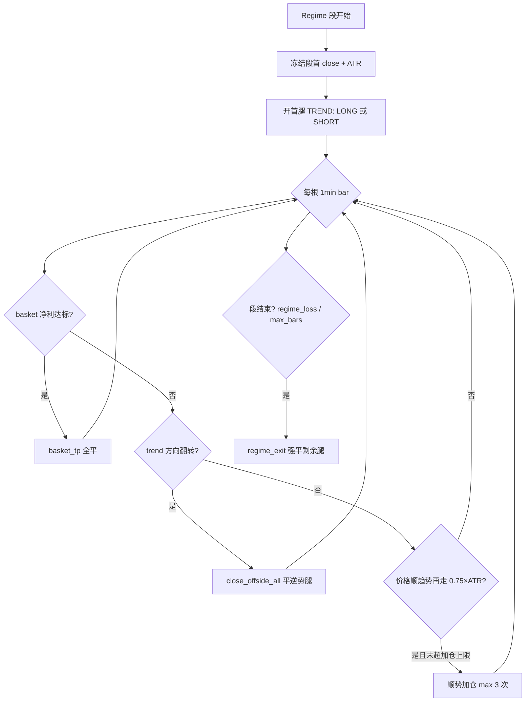

# trend_scalp 逻辑导读（零基础版）

> **策略别名**：`dual_add_trend` / C 系统趋势腿  
> **配置目录**：`config/strategies/trend_scalp/`  
> **回测引擎**：`scripts/diagnose_dual_add_trend.py`  
> **本教程回测**：BTC 2024-Q1 + hold_scaled（见文末产物路径）

---

## 1. 一句话

在 **有趋势、低震荡、非稳定箱体** 的时段，**顺着趋势方向**开 1 腿，价格继续走则 **有限次加仓**，整篮利润达标后 **一起止盈**；趋势掉头或 regime 失效则 **强制退出**。

不是网格，不是无限马丁，不是多空双开对冲（默认配置）。

---

## 2. 分几层？（从外到内）

```text
┌─────────────────────────────────────────────────────────┐
│  Layer 0  数据 / 特征                                    │
│    2h K线 → trend_confidence, semantic_chop, box, ATR   │
├─────────────────────────────────────────────────────────┤
│  Layer 1  Regime（能不能做 trend？）  archetypes/regime.yaml │
│    迟滞段发现：entry 门槛严，hold 门槛宽                    │
├─────────────────────────────────────────────────────────┤
│  Layer 2  Prefilter（可选额外规则）  archetypes/prefilter.yaml │
│    当前 prod：rules: []（空）                            │
├─────────────────────────────────────────────────────────┤
│  Layer 3  Execution（进了段怎么交易） archetypes/execution.yaml │
│    开腿 / 加仓 / basket TP / flip / 段结束强平            │
├─────────────────────────────────────────────────────────┤
│  Layer 4  组合门控（与 chop_grid 配合） constitution + 并发门 │
│    同币互斥；切换冷却；每日开段上限                         │
└─────────────────────────────────────────────────────────┘
```

| 层 | 回答的问题 | prod 关键文件 |
|----|------------|---------------|
| 特征 | 现在像趋势还是震荡？ | `features.yaml` |
| Regime | **这段 bar 是否属于 trend 段？** | `archetypes/regime.yaml` |
| Prefilter | 过了 regime 还要不要额外过滤？ | `archetypes/prefilter.yaml`（空） |
| Execution | 段内如何开/加/平？ | `archetypes/execution.yaml` |
| 组合 | 和 chop 谁占这个币？ | `config/constitution/constitution.yaml` |

---

## 3. Layer 1：什么时候算「可以开仓」？

### 3.1 三个自动特征（不用你肉眼看 K 线）

| 特征 | 含义（人话） | 开仓要求 |
|------|-------------|----------|
| **trend_confidence** | 3/5/10 根 2h bar 方向是否一致 | **≥ 0.70** |
| **bpc_semantic_chop** | 是否震荡（带宽窄 + 方向打架） | **≤ 0.25** |
| **box_prefilter** | 是否「稳定箱体」 | **必须为 false**（排除稳定 box） |

计算公式（简化）：

```text
trend_confidence = mean(|sign(ret_h)|) × |mean(sign(ret_h))|   # h = 3,5,10
semantic_chop    = BB收窄 × (1 - 方向一致度) × 2
box_prefilter    = 稳定 + 宽度合理 + 触碰够 + 内部够 chop
```

### 3.2 迟滞：入场严、持仓宽

系统不是「满足一次就开」，而是用 **entry / hold 两道门** 拼成连续 **段（segment）**：

| | trend_confidence | semantic_chop |
|--|------------------|---------------|
| **入场（entry）** | ≥ **0.70** | ≤ **0.25** |
| **持仓（hold）** | ≥ **0.40** | ≤ **0.40** |

```text
        entry 门槛严 ──► 新开 trend 段
        hold  门槛宽 ──► 段内继续持有多腿 inventory
        跌破 hold ──► 段结束（regime_exit 强平）
```

额外约束：

- 段长度：**6～120** 根 2h bar（约 12h～10 天）
- 每日每币开段数：constitution 上限（防刷段）
- 同币若 chop_grid 占槽 → trend **不能新开**（互斥）

### 3.3 与 chop_grid 的分工（为何不是全天候）

```text
chop 刻度  0 ─── 0.25 ─── 0.33 ─── 0.52 ─── 1
              │         │          │
         trend 可进   留白区    chop 可进
```

- **trend_scalp**：低 chop + 高 trend  
- **chop_grid**：高 chop  
- **中间带**：两边都不积极新开 —— 故意留白，避免打架

---

## 4. Layer 3：进了段之后发生什么？

一段 = 连续满足 hold 的 1min/2h bar 序列。段内逻辑（`simulate_dual_add_segment`）：

### 4.1 生命周期（按时间顺序）



### 4.2 首腿方向

- `initial_legs: TREND` → 只开 **当前 trend_direction** 一侧（UP→LONG，DOWN→SHORT）
- 研究回测对应 CLI：`--no-initial-hedge`（不要多空双开）

### 4.3 加仓

- 间距：**0.75 × ATR**（段首冻结，不随 bar 漂移）
- 每方向最多 **3 次**加仓（不含首腿）
- 总腿数 ≤ **4**，净方向 ≤ **2**

### 4.4 止盈（basket 模式，prod 默认）

```text
tp_distance = fee_buffer + max(0.6×ATR, 0.12%×price)
```

- 看 **当前所有未平腿的合计净利**（扣费后）
- 达标 → **全部一起平**（`basket_tp`）
- 必须 fee-aware，否则手续费会把毛利吃光

### 4.5 出场原因（回测里常见）

| exit_reason | 含义 |
|-------------|------|
| **basket_tp** | 整篮止盈（好结局，~85%） |
| **regime_exit** | 段结束，regime 条件失效 |
| **trend_flip** | 2h 趋势方向翻转，平掉逆势腿 |
| **loser_timeout** | 亏腿持有过久仍亏损（hold_scaled 后应≈0%） |
| **risk_stop** | 段内 MTM 硬止损（regime_only 下很少） |
| **net_cap** | 净敞口超限，砍掉最差腿 |

### 4.6 重要执行参数（研究推荐栈）

| 参数 | prod YAML | 研究 hold_scaled |
|------|-----------|------------------|
| max_loser_hold_bars | 24（易误读为 24min@1min） | **2880@1min**（≈48h，与 2h 语义对齐） |
| reseed_on_flip | false | false |
| risk_stop_mode | regime_only | regime_only |

---

## 5. 信号 vs 执行（两层时间）

| | 信号层 | 执行层 |
|--|--------|--------|
| 周期 | **2h** | **1min** |
| 干什么 | 算特征、发现 regime **段** | 段内模拟 touch 加仓、TP、flip |
| 为何 | 慢变量过滤假突破 | 细粒度回放成交路径 |

prod 回测默认：`--timeframe 2h --execution-timeframe 1min`。

---

## 6. 教程回测结果（BTC 2024-Q1）

**命令**（已跑完，可复现）：

```bash
.venv/bin/python scripts/diagnose_dual_add_trend.py \
  --config config/experiments/20260618_multileg_param_tune/variants/trend_hold_scaled.yaml \
  --symbols BTCUSDT \
  --start 2024-01-01 --end 2024-03-31 \
  --timeframe 2h --execution-timeframe 1min \
  --no-initial-hedge --no-reseed-on-flip \
  --scale-max-loser-hold-to-signal \
  --map-symbols BTCUSDT \
  --continuous-map-symbols BTCUSDT \
  --out-dir results/trend_scalp/tutorial_btc_q1_2024_maps
```

### 6.1 汇总（`summary.csv`）

| 指标 | 数值 | 怎么读 |
|------|------|--------|
| segments | 30 | 3 个月里识别出 30 个 trend 段 |
| trades | 214 | 段内开平合计 214 笔 leg |
| return_pct_timeline | **+9.05%** | 组合净收益（主指标） |
| trade_win_rate | **80.8%** | 单笔 leg 胜率 |
| segment_win_rate | **76.7%** | 整段盈亏为正的比例 |
| basket_tp 占比 | **85.0%** | 大部分盈利来自整篮止盈 |
| loser_timeout | **0%** | hold_scaled 生效 |
| max_drawdown_portfolio | **-1.15%** | 组合最大回撤 |

### 6.2 段级例子（`dual_add_segments.csv`）

| segment_id | direction | 段内 trades | pnl | 备注 |
|------------|-----------|------------|-----|------|
| BTCUSDT_0003_202401081000 | UP | 11 | **+0.86%** | 典型盈利段，10 次 basket_tp |
| BTCUSDT_0004_202401100800 | DOWN | 7 | **+1.41%** | 顺势空段 |
| BTCUSDT_0001_202401010200 | DOWN | 4 | -0.06% | 小亏，有 trend_flip |

### 6.3 单笔例子（`dual_add_trades.csv`）

段 `BTCUSDT_0001` 内：

1. 开 **SHORT** @ 42362 → `trend_flip` 平 @ 42694（小亏）  
2. 翻向后开 **LONG** @ 42517 → `basket_tp` 平 @ 42703（小赢）

说明：**趋势翻转会先砍掉逆势腿**，不是死扛。

---

## 7. K 线对照图：怎么看？

### 7.1 产出文件（浏览器打开）

| 文件 | 用途 |
|------|------|
| **`results/trend_scalp/tutorial_btc_q1_2024_maps/trading_map_dual_add_BTCUSDT.html`** | 单币 K 线 + 段色块 + 成交标记（**推荐先看**） |
| `trading_map_continuous.html` | 组合权益曲线 + 分币 K 线 |
| `capital_report.html` | 净值曲线 + 回撤表 |
| `dual_add_trades.csv` | 每笔 leg 明细 |
| `dual_add_segments.csv` | 每段汇总 |

```bash
open results/trend_scalp/tutorial_btc_q1_2024_maps/trading_map_dual_add_BTCUSDT.html
```

### 7.2 图上元素

| 元素 | 含义 |
|------|------|
| 绿/红 K 线 | 涨 / 跌（**2h** 周期） |
| 橙色线 | EMA(1200)（参考大趋势） |
| 品红线 | 滚动 TP-VWAP(1200)（价格尺度参考） |
| **浅绿/浅红竖条背景** | trend **段**（UP=绿，DOWN=红） |
| △ 蓝色 | LONG 入场 |
| ▽ 紫色 | SHORT 入场 |
| 实线 | 首腿 entry→exit |
| 虚线 | 加仓腿 entry→exit |
| □ | 平仓点 |

**读图步骤**：

1. 找 **浅色背景段** → 系统认为「这段可以做 trend」  
2. 看段内 **△/▽** → 首腿方向是否顺背景色（绿段应多 △）  
3. 看 **虚线** → 价格继续走有没有加仓  
4. 看线段终点 → hover 可看 `exit_reason`（basket_tp / regime_exit / trend_flip）  
5. 段与段之间 **空白** → regime 不满足，**故意不做**

> 全窗 5 币上万笔时图会糊 —— 教程故意只用 **BTC + 3 个月**。看全窗用 `capital_report.html` 或框选 zoom。

### 7.3 对照 checklist（验证逻辑是否「长得对」）

- [ ] 浅色段只出现在 chop 不高的时候（段外应是震荡/不满足）  
- [ ] 段内首腿方向与 UP/DOWN 背景一致  
- [ ] 盈利段多以 `basket_tp` 结束（见 CSV）  
- [ ] `loser_timeout` 在 hold_scaled 下应为 0  
- [ ] 与 chop_grid 同币不会重叠（联合 timeline 才看占槽）

---

## 8. 全窗参考（5 币，hold_scaled）

与教程短窗不同，全窗 2024-01～2026-05 见：

| 路径 | return_pct_timeline | trades | loser_timeout |
|------|---------------------|--------|---------------|
| `results/trend_scalp/hold_scaled_validate/` | **+145.8%** | 10,821 | 0% |
| OOS 四段 | `results/trend_scalp/oos_segment_20260618/hold_scaled/` | 各段见 segment_summary | 0% |

---

## 9. 回测 vs 生产

| 项 | 回测 | 生产 |
|----|------|------|
| Regime / 阈值 | 同 YAML | 同 YAML |
| 段内 inventory 规则 | `diagnose_dual_add_trend.py` | `dual_add_trend_live_engine.py` |
| 成交 | 模拟滑点+费 | 真实 IOC/限价+保护单 |
| loser_timeout 缩放 | 研究栈已验证 | **live 尚未完全对齐** |
| constitution | 可选 | trend 当前仍 **禁用/未 promote** |

结论：**策略语义同源，执行与组合层仍有差距**；上线前需 live 对齐 + 联合 timeline 验证。

---

## 10. 相关文档

| 文档 | 内容 |
|------|------|
| [`README.md`](README.md) | 策略说明、消融、证据快照 |
| [`../chop_grid/README.md`](../chop_grid/README.md) | chop 分工对照 |
| [`../../experiments/20260618_multileg_param_tune/TREND_LOSER_TIMEOUT_优化说明_CN.md`](../../experiments/20260618_multileg_param_tune/TREND_LOSER_TIMEOUT_优化说明_CN.md) | hold 修复 |
| [`../../docs/strategy/C系统.md`](../../docs/strategy/C系统.md) | C 系统总览 |
| [`../../scripts/run_multileg_backtest_with_maps.sh`](../../scripts/run_multileg_backtest_with_maps.sh) | 一键出 K 线图 |

---

## 11. 复现更长区间 K 线图

```bash
# 单币、短窗 —— 图最清晰（教程同款）
MAP_SYMBOLS=BTCUSDT START_DATE=2024-01-01 END_DATE=2024-03-31 \
  bash scripts/run_multileg_backtest_with_maps.sh trend

# 全窗 5 币 —— 数字全、图密
bash scripts/run_multileg_backtest_with_maps.sh trend
```

产出目录：`results/trend_scalp/diagnose_<start>_<end>/`
