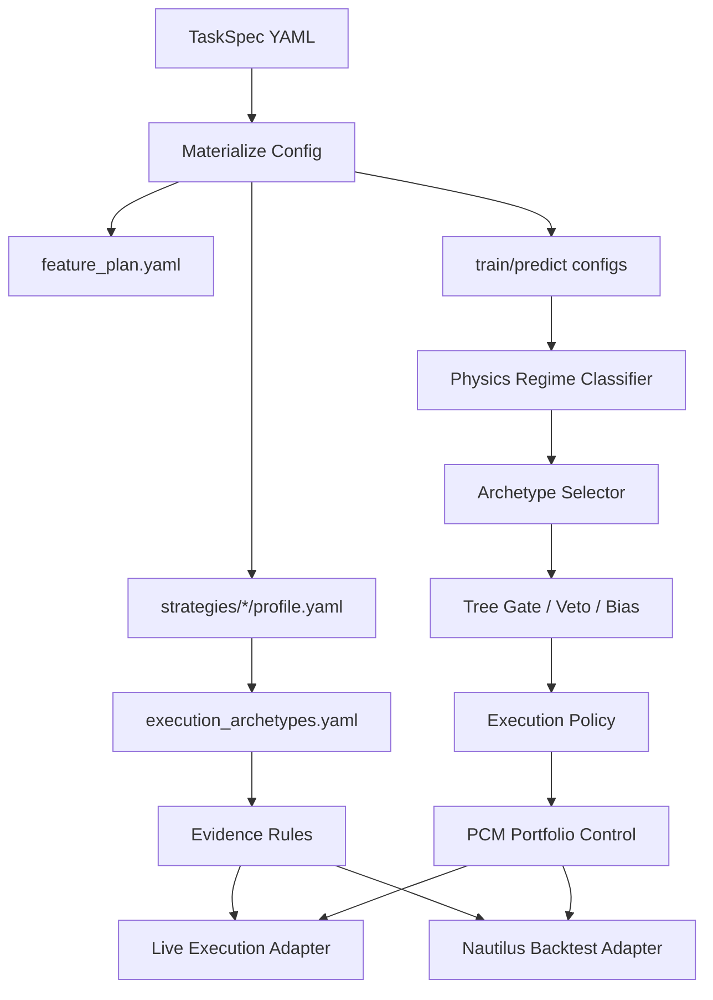
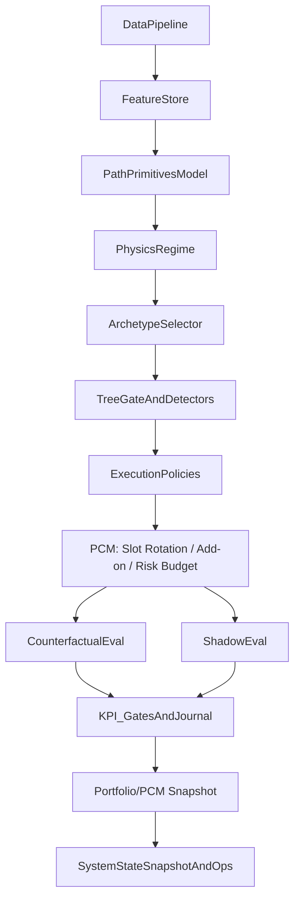

# 系统架构（统一版）

> 这份文档回答三个问题：
> 1) 系统分层与职责边界是什么？
> 2) v0/v1/v2 在哲学意义上如何划分？
> 3) 研发到上线的 pipeline 如何组织与验收？
>
> 细节（命令参数、算法说明、边界条件）仍由专题文档承载，这里只做统一对齐与索引。

## 一页速览

- **核心原则**：模型只产出证据；Sharpe 可用于 Gate/Execution 诊断，但**生产决策**只允许在 Portfolio/PCM。
- **v0/v1/v2**：v0 验证恐惧是否合理并可上实盘；v1 将恐惧写进系统；v2 运行后删掉不必要恐惧。
- **层级结构**：Data → FeatureStore → ModelHeads(A-layer) → Regime/Physics → Archetype → Gate → Execution → PCM → Ops。
- **PCM 定义**：slot rotation / add-on 是否允许 / portfolio 风险预算（不管 entry/exit 细节）。
- **统一路径**：TaskSpec 冻结配置 → Regime/Archetype plateau → Shadow/Counterfactual → KPI Gate → System Snapshot。
- **Tree→NN**：树规则用于 Gate/Bias/Risk Modifier，不是 Execution 触发器。
- **总宣言**：MLP 学路径 → 规则管因果 → PCM 管生存。

## 目录

1. [系统概述](#系统概述)
2. [v0/v1/v2 的哲学划分](#v0v1v2-的哲学划分)
3. [系统分层与职责边界](#系统分层与职责边界)
4. [端到端 Pipeline（统一路径）](#端到端-pipeline统一路径)
5. [版本模块清单（v0/v1/v2）](#版本模块清单v0v1v2)
6. [版本设计原则（v0/v1/v2）](#版本设计原则v0v1v2)
7. [Tree → NN 知识迁移](#tree--nn-知识迁移)
8. [核心目录与关键文件](#核心目录与关键文件)
9. [Pipeline TODO（2–4 周）](#pipeline-todo24-周)
10. [相关文档入口](#相关文档入口)

---

## 系统概述

ML Trading Bot 是一个配置驱动的多资产交易系统，核心目标是：

- **模型只产出证据**，自由度被 Regime/Archetype/Gate/Execution/PCM 限制与解释
- **责任可分解**：Sharpe 可用于 Gate/Execution 诊断，但**生产决策**只允许在 Portfolio/PCM
- **系统可回滚**：任何新增自由度都必须可开关、可审计、可降级

核心输出形态：

- Tree：单策略训练与规则导出（易解释、易迁移）
- NN 多头：Path Primitives → Regime/Archetype → Gate → Execution → Portfolio/PCM

---

## 配置驱动的 Gate / Execution（现状与加载方式）

当前实现以**配置驱动为主**，代码提供“加载、验证、执行”框架；规则与策略适配由配置承载。
优势是可审计、可回滚、可对齐多策略；缺点是需要设计好规范与验证工具。

### 为什么以配置为主？

- **规则稳定**：Gate/Execution 更像“策略语义”而非模型参数，变更应可审计
- **适配四策略**：TC/TE/FR/ET 映射为 Archetype 与 Evidence rules，可用配置快速迭代
- **工程可控**：代码只实现通用解释器，避免写死某一策略逻辑

### Gate 是可组合约束算子

Gate 的每条规则都是一个“约束算子”（谓词），通过 `deny_if / allow_if + allow_mode` 组合形成整体 Gate：

- **TC/TE（宽松）**：`deny_if` + `default_action: allow`（触发任一 deny 则 veto）
- **FR/ET（严格）**：`allow_if` + `default_action: deny`（必须满足任一 allow 才放行）
- **分位数阈值**：`quantile_gt/lt` 支持跨标的的相对严格度控制

### 主要配置文件

- `config/nnmultihead/strategies/<strategy_id>/profile.yaml`  
  定义策略 → Archetype 的映射（如 TC/TE/FR/ET）。
  核心策略 ID：`trend_continuation_tc` / `trend_expansion_te` / `failure_reversion_fr` / `exhaustion_turn_et`。
- `config/nnmultihead/execution_archetypes.yaml`  
  定义四大 Archetype（TC/TE/FR/ET）的 **required_conditions / evidence_rules**。
- `config/kpi_gates/*.yaml`  
  Gate/Execution/Portfolio 的 KPI 门禁阈值。
- `config/tasks/task_spec*.yaml`  
  冻结完整实验（宇宙、时间窗、特征计划、模型计划、FeatureStore）。

### 加载与执行路径（配置 → 行为）



### 关键加载点（代码）

- StrategyProfile → Archetype（使用 TC/TE/FR/ET registry）：  
  `src/time_series_model/nnmultihead/strategy_profile.py::resolve_execution_profile`
- Evidence 规则执行（执行前约束）：  
  `src/time_series_model/live/event_driven_strategy.py::_execute_entry`
- Evidence 规则解释器（v1）：  
  `src/time_series_model/core/constitution/execution_evidence.py::compute_execution_evidence`
- KPI Gate 读取（Gate/Execution/Portfolio 评估）：  
  `src/time_series_model/diagnostics/kpi_journal.py`

> 注：目前 Gate/Execution 在 **KPI 层** 已有 proxy 指标，但 **pipeline 中未完整接线**。
> 后续会把 TreeGate 与 Nautilus 回测接入统一路径。

### evidence_rules 是什么？

evidence_rules 是“**语义证据 → 允许/否决执行**”的规则集合，输入是 feature 字典，输出是布尔证据。
它不直接触发交易，只负责判断**某类执行（archetype）是否具备必要语义**。

当前支持的规则类型（v1）：
- `any_key_contains`：特征名包含某些关键字
- `key_exists`：特征列存在
- `value_gt/value_gte/value_lt/value_lte/abs_gt`：阈值判断
- `quantile_gt/quantile_gte/quantile_lt/quantile_lte/quantile_abs_gt`：分位数阈值判断
- `on_missing`: `false|true|error`（缺失时的策略）

配置位置：`config/nnmultihead/execution_archetypes.yaml`

### 如何实现才好？

- **先小后全**：只保留“稳定、可解释、跨周期有效”的证据
- **优先语义证据**：如 orderflow/volatility/structure 的“存在性”，而不是细阈值
- **缺失即否决**：关键证据建议 `on_missing: error`，保证 fail‑closed
- **与 Regime 解耦**：Regime 选状态，evidence 只做 gate/bias
- **配合 KPI**：用 Gate/Execution KPI 监控 false reject / tail loss

### Quantile-based 证据的实现建议

- **数据来源**：优先用训练/回测同窗期的 FeatureStore 统计分位数
- **计算方式**：离线生成 `evidence_quantiles.json`，运行时通过环境变量加载  
  `MLBOT_EVIDENCE_QUANTILES_JSON=/path/to/evidence_quantiles.json`
- **命令**：`mlbot diagnose evidence-quantiles` 或 `scripts/build_evidence_quantiles.py`
- **训练联动**：`mlbot nnmultihead train --emit-evidence-quantiles` 会在 run 目录输出量化文件

---

## v0/v1/v2 的哲学划分

来自 `docs/architecture/最总架构的讨论gpt对战claude.md` 的定义对齐：

- **v0：验证恐惧是否合理**  
  当前可上实盘的系统，优先“能跑、能看见、能复盘”。
- **v1：把恐惧写进系统**  
  加入免疫/记仇/分情境 IC 验证等复杂模块，用更强防护提高生存性。
- **v2：删掉不必要的恐惧**  
  实跑之后证据表明多余模块可移除，回到简化的高置信系统。

补充：**RL 进入主系统只可能发生在 v4（甚至 v5）**，v1/v2/v3 仅允许影子研究。

### 实战建议:MVP 版本

#### Phase 1: v0 主链路（先跑起来）
1. Path + Regime/Archetype
2. Gate（规则）
3. Execution（单仓 entry/exit 机械逻辑）
4. PCM（slot rotation / add-on 许可 / 风险预算）
目标: 活 6 个月不爆仓

#### Phase 2: v1 追加（如果 v0 稳定）
5. Unified Safety Head（合并 OOD/Survival/Safety）
6. Extinction replay + 基础记忆
目标: 不再重复相同的死法

---

## 系统分层与职责边界

```
Layer0  DataCoverage           数据完整性/对齐/漂移检测
Layer1  FeatureStoreAndTiers   特征依赖图/归一化契约/分层解锁
Layer2  ModelHeads             Outcome Path 多头（A-layer）
Layer3  RegimePhysics          物理可行性/风格分布（硬 veto）
Layer4  Archetype              行为模板（TC_EXEC/TE_EXEC/FR/ET）
Layer5  Gate                   规则 veto/allow/bias（execution-local）
Layer6  Execution              单仓生命周期管理（entry/exit/SL/TP）
Layer7  PCM_Portfolio          组合分配/风控（生产决策层）
Layer8  ReportsAndOps          KPI/审计/快照/回放
Layer9  RollbackAndDegrade     降级路径（回退到更低自由度）
```

### 命名规范（避免术语冲突）

**Regime**：`TC_REGIME/TE_REGIME/MEAN_REGIME/NO_TRADE`（风格分布/物理可行性）
**Archetype**：执行模板，文档内用 `*_EXEC` 或 `FR_TREND/FR_MEAN` 表示  
  - 实现命名：`TrendContinuationTC / TrendExpansionTE / FailureReversionFR / ExhaustionTurnET`

**旧术语映射**：
- `TREND` ≈ Regime 的 `TC/TE`（以及相应的 `TC_EXEC/TE_EXEC`）
- `MEAN` ≈ Regime 的 `ER`（以及 `FR_MEAN`）

关键边界：

- **A-layer**（Outcome Path）只负责“结果分布证据”，不背 Sharpe
- **Regime/Archetype** 只做可行性/行为模板，不做收益优化
- **Gate** 只做 veto/allow/bias，不直接触发 entry
- **Execution** 只负责单仓生命周期，不管理 slot 与预算
- **PCM/Portfolio** 是唯一**生产决策**层；Sharpe 可在 Gate/Execution 诊断，但不得驱动生产决策

---

## PCM / Position & Slot Management（v0 必须具备）

PCM = Portfolio / Capital / Meta Control 层，负责 “是否允许” 的决策，而不是 “怎么下单” 的细节。

### PCM 的职责边界（硬规则）
- **必须包含**：slot rotation / add-on 许可 / portfolio 风险预算
- **不包含**：entry/exit 价格、止损/止盈如何挂、微观 execution 细节

> **Execution 是单兵战术，PCM 是战役指挥。**

### v0 固定规则（不讨论）
- `max_slots = 2`（硬编码，不支持动态扩容）
- slot 是稀缺资源，不是趋势放大器

### Slot2 的开启条件（必须全部满足）
1. **Slot1 已释放风险**：BE+ 或部分止盈（剩余仓位无爆仓风险）
2. Slot1 仍处在**有效趋势路径**中（非尾声）
3. 新机会的 **ppath 价值 > Slot1 剩余边际价值**

否则：**不开 Slot2，不赌行情**

### FR / ET 的定位（v0 定版）
- **低频 / 高置信 / 固定 SL/TP**
- **禁止加仓**
- **不参与强趋势阶段**
- **不占用趋势扩容预算**

> FR / ET 是“边角收益器”，不是资金曲线发动机。

---

## ppath（唯一正式定义）

> **ppath = 已被市场支付的路径进展（ex-post）**

ppath 只包含事实，不含预测/模型信心：
- realized MFE
- 当前浮盈
- 距离 entry 的路径完成度
- 是否触发关键结构点（突破 / 回踩 / 吸收）

### ppath 的唯一用途
- slot rotation（换不换）
- 是否允许加仓
- 是否释放 risk budget

### ppath 严禁用途
- 决定 entry
- 决定方向
- 决定 regime

---

## 端到端 Pipeline（统一路径）



统一路径说明：

- TaskSpec 负责冻结 Universe/时间窗/特征/标签/模型超参
- Regime/Archetype 的阈值与规则用 “平坦高原” 协议（多窗口/bootstraps）
- KPI gates 在各层硬门禁，避免 Sharpe 乱用
- Shadow/Counterfactual 统一生成证据链
- **RL/BC 分支**：在 `logs_3action.parquet` 基础上做影子研究（BC/Offline RL），
  仅用于对抗测试与证据生成，**不进入主系统**；主系统仅在 v4+ 才可能引入。

---

## 版本模块清单（v0/v1/v2）

| 模块 | v0 | v1 | v2 |
|---|---|---|---|
| DataCoverage / Drift | 必选 | 必选 | 必选 |
| FeatureStore / Tiers | 必选 | 必选 | 必选 |
| Path Primitives 多头 | 必选 | 必选 | 必选 |
| Regime/Archetype Router | 必选 | 必选 | 必选 |
| KPI Gate / KPI Journal | 必选 | 必选 | 必选 |
| Tree Gate / Detector | 必选 | 必选 | 可选（保留核心 veto） |
| PCM / Portfolio | 必选 | 必选 | 必选 |
| Unified Safety Head（OOD/Survival/Safety 合并） | 不启用 | 必选 | 视证据保留 |
| Adaptive Revenge / Immunity | 不启用 | 必选 | 只保留有效子集 |
| BC/RL Router（offline） | 不启用 | 影子研究 | 影子研究 |
| Execution archetype 扩展 | 可选 | 必选 | 收敛为简化集合 |
| Runtime kill-switch / rollback | 必选 | 必选 | 必选 |

### 版本侧重点示意


---

## 版本设计原则（v0/v1/v2）

**v0**
- 可上线、可记录、可归因
- 最少自由度、最少模块
- 先跑实盘/仿真，先收证据
- v0 可无 Safety Head（靠 Gate + 保守 PCM/slot 控制保证生存）

**v1**
- 把恐惧写进系统（免疫、记仇、分情境验证）
- 强化 Gate/Detector/Regime 验证
- 容忍复杂度上升，但必须可审计
- RL/BC 仅作为影子研究，不进入主链路

**v2**
- 删除不必要模块
- 保留能被证据证明的防护
- 回归简化系统结构

---

## Tree → NN 知识迁移

来自 `docs/strategies/树模型策略结论TREE_STRATEGY_FINAL_FEATURES_CN.md` 与  
`docs/architecture/树模型策略知识迁移到多头模型.md` 的统一结论：

1) **树模型最有效特征组** 应当作为 NN 的候选 optional blocks，而不是直接硬塞。  
2) **树模型规则不是执行触发器**，而是 Gate/Bias/Risk Modifier：  
   - Gate：否决危险状态  
   - Regime 边界调整：改变可行性/状态划分  
   - Execution Bias：调 size / SL / pyramid

---

## 核心目录与关键文件

- `config/feature_dependencies.yaml`：特征 DAG 与归一化契约
- `config/tasks/task_spec_*.yaml`：TaskSpec（冻结 Universe/时间窗/特征/标签）
- `scripts/build_feature_store_nnmultihead.py`：FeatureStore 构建
- `scripts/train_path_primitives_mlp.py`：A-layer 训练
- `scripts/rl_counterfactual_eval_3action.py`：系统级评估
- `src/time_series_model/diagnostics/kpi_journal.py`：KPI Journal
- Feature/Cache 模块说明：`src/features/loader/README.md`

---

## Pipeline TODO（2–4 周）

**v0**
- 固化 FeatureStore 正确性与缺失策略（禁止月度冷启动）
- KPI Journal 全链路覆盖（A-layer/Regime/Archetype/Gate/Execution/PCM）
- Regime/Archetype 阈值必须 plateau-pass 才允许上线
- PCM / Slot State Machine 落地（rotation / add-on 许可 / 风险预算）
- ppath 统一定义与使用边界（只用于 rotation / add-on / risk release）

**v1**
- 设计并实现免疫/记仇/分情境 IC 验证模块
- 明确 Regime Embedding 与 Survival Head 的验收标准
- Gate/Detector 形成版本化“宪法模块”

**v2**
- 基于真实运行证据裁剪无效模块
- 形成简化版稳定系统与最小维护面

---

## 相关文档入口

- README（最小可复制命令入口）：`README_CN.md`
- 总体原则与宪法：`docs/architecture/NN_MULTI_ASSET_CONSTITUTIONAL_SYSTEM_DESIGN_CN.md`
- 架构升级 V1：`docs/architecture/ARCH_UPGRADE_TASKSPEC_CONSTITUTION_V1_CN.md`
- Experiment Loop：`docs/architecture/EXPERIMENT_LOOP_ARCHITECTURE.md`
- Regime Filter + Trade Quality 方案：`docs/architecture/REGIME_FILTER_TRADE_QUALITY_PLAN_CN.md`
- 为什么用规则做 Regime 判断：`docs/architecture/WHY_REGIME_RULES_OVER_NN_CN.md`
- NNMH 3-action E2E：`docs/guides/NNMULTIHEAD_3ACTION_E2E_CN.md`
- NNMH 命令总览（含 RL/BC/FSM 说明）：`docs/guides/NNMULTIHEAD_COMMANDS_CN.md`
- 为什么延迟 RL：`docs/architecture/WHY_RL_IS_DELAYED_CN.md`
- 阈值平坦高原：`docs/guides/THRESHOLD_PLATEAU_TUNING_PROTOCOL_CN.md`
- Tree 结果与迁移：`docs/strategies/树模型策略结论TREE_STRATEGY_FINAL_FEATURES_CN.md`
- Tree→NN 迁移方法：`docs/architecture/树模型策略知识迁移到多头模型.md`
- v0/v1/v2 哲学讨论：`docs/architecture/最总架构的讨论gpt对战claude.md`
- [职责坍缩](docs/architecture/职责坍缩.md)
- [Gate 一组可组合的约束算子](docs/architecture/Gate一组可组合的约束算子.md)
- [仓位管理办法](docs/architecture/仓位管理办法.md)
- [保险模块得合并](docs/architecture/保险模块得合并.md)
- [和大模型灌数据比较](docs/architecture/和大模型灌数据比较.md)
- [树模型和神经网络模型能力区别](docs/architecture/树模型和神经网络模型能力区别.md)