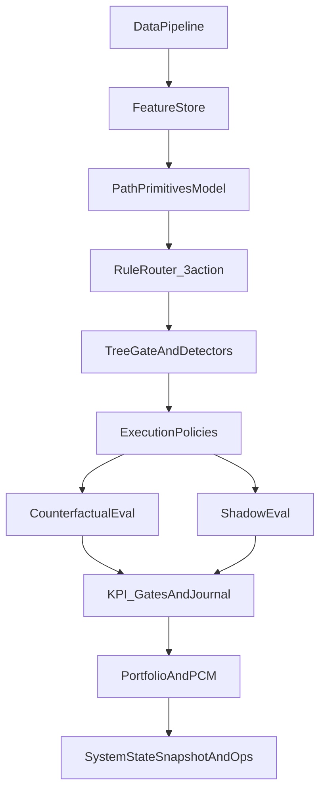

# 系统架构（统一版）

> 这份文档回答三个问题：
> 1) 系统分层与职责边界是什么？
> 2) v0/v1/v2 在哲学意义上如何划分？
> 3) 研发到上线的 pipeline 如何组织与验收？
>
> 细节（命令参数、算法说明、边界条件）仍由专题文档承载，这里只做统一对齐与索引。

## 一页速览

- **核心原则**：模型只产出证据，Sharpe 只在 Portfolio/PCM 观察，其余层只看各自 KPI。
- **v0/v1/v2**：v0 验证恐惧是否合理并可上实盘；v1 将恐惧写进系统；v2 运行后删掉不必要恐惧。
- **层级结构**：Data → FeatureStore → ModelHeads(A-layer) → Router → Gate → Execution → PCM → Ops。
- **统一路径**：TaskSpec 冻结配置 → Router plateau → Shadow/Counterfactual → KPI Gate → System Snapshot。
- **Tree→NN**：树规则用于 Gate/Bias/Risk Modifier，不是 Execution 触发器。

## 目录

1. [系统概述](#系统概述)
2. [v0/v1/v2 的哲学划分](#v0v1v2-的哲学划分)
3. [系统分层与职责边界](#系统分层与职责边界)
4. [端到端 Pipeline（统一路径）](#端到端-pipeline统一路径)
5. [版本模块清单（v0/v1/v2）](#版本模块清单v0v1v2)
6. [版本设计原则（v0/v1/v2）](#版本设计原则v0v1v2)
7. [Tree → NN 知识迁移](#tree--nn-知识迁移)
8. [核心目录与关键文件](#核心目录与关键文件)
9. [Pipeline TODO（2–4 周）](#pipeline-todo24-周)
10. [相关文档入口](#相关文档入口)

---

## 系统概述

ML Trading Bot 是一个配置驱动的多资产交易系统，核心目标是：

- **模型只产出证据**，自由度被 Router/Gate/Execution/PCM 限制与解释
- **责任可分解**：Sharpe 只在 Portfolio/PCM 层观察，其余层只看自己的 KPI
- **系统可回滚**：任何新增自由度都必须可开关、可审计、可降级

核心输出形态：

- Tree：单策略训练与规则导出（易解释、易迁移）
- NN 多头：Path Primitives → Router → Gate → Execution → Portfolio/PCM

---

## v0/v1/v2 的哲学划分

来自 `docs/architecture/最总架构的讨论gpt对战claude.md` 的定义对齐：

- **v0：验证恐惧是否合理**  
  当前可上实盘的系统，优先“能跑、能看见、能复盘”。
- **v1：把恐惧写进系统**  
  加入免疫/记仇/分情境 IC 验证等复杂模块，用更强防护提高生存性。
- **v2：删掉不必要的恐惧**  
  实跑之后证据表明多余模块可移除，回到简化的高置信系统。

补充：**RL 进入主系统只可能发生在 v4（甚至 v5）**，v1/v2/v3 仅允许影子研究。

---

## 系统分层与职责边界

```
Layer0  DataCoverage           数据完整性/对齐/漂移检测
Layer1  FeatureStoreAndTiers   特征依赖图/归一化契约/分层解锁
Layer2  ModelHeads             Path Primitives 多头（A-layer）
Layer3  Router                 NO/MEAN/TREND 可解释阈值
Layer3b Gate                   Tree 规则 / veto / allow / risk modifier
Layer4  PCM_Portfolio          资金分配与Sharpe唯一观测层
Layer5  Execution              真实执行与成本/滑点一致性
Layer6  ReportsAndOps          KPI/审计/快照/回放
Layer7  RollbackAndDegrade     降级路径（回退到更低自由度）
```

关键边界：

- **A-layer**（Path Primitives）只负责“信息是否存在”，不能背 Sharpe
- **Router** 只负责模式划分（MEAN/TREND/NO_TRADE）与阈值稳定性
- **Gate** 只做 veto/allow/bias，不直接触发 entry
- **PCM/Portfolio** 是唯一允许看 Sharpe 的层

---

## 端到端 Pipeline（统一路径）



统一路径说明：

- TaskSpec 负责冻结 Universe/时间窗/特征/标签/模型超参
- Router 阈值用 “平坦高原” 协议（多窗口/bootstraps）
- KPI gates 在各层硬门禁，避免 Sharpe 乱用
- Shadow/Counterfactual 统一生成证据链
- **RL/BC 分支**：在 `logs_3action.parquet` 基础上做影子研究（BC/Offline RL），
  仅用于对抗测试与证据生成，**不进入主系统**；主系统仅在 v4+ 才可能引入。

---

## 版本模块清单（v0/v1/v2）

| 模块 | v0 | v1 | v2 |
|---|---|---|---|
| DataCoverage / Drift | 必选 | 必选 | 必选 |
| FeatureStore / Tiers | 必选 | 必选 | 必选 |
| Path Primitives 多头 | 必选 | 必选 | 必选 |
| Router 3-action + plateau | 必选 | 必选 | 必选 |
| KPI Gate / KPI Journal | 必选 | 必选 | 必选 |
| Tree Gate / Detector | 可选 | 必选 | 可选（保留核心 veto） |
| PCM / Portfolio | 必选 | 必选 | 必选 |
| Survival Head / Regime Embedding | 可选 | 必选 | 视证据保留 |
| Adaptive Revenge / Immunity | 不启用 | 必选 | 只保留有效子集 |
| BC/RL Router（offline） | 不启用 | 影子研究 | 影子研究 |
| Execution archetype 扩展 | 可选 | 必选 | 收敛为简化集合 |
| Runtime kill-switch / rollback | 必选 | 必选 | 必选 |

### 版本侧重点示意


---

## 版本设计原则（v0/v1/v2）

**v0**
- 可上线、可记录、可归因
- 最少自由度、最少模块
- 先跑实盘/仿真，先收证据

**v1**
- 把恐惧写进系统（免疫、记仇、分情境验证）
- 强化 Gate/Detector/Regime 验证
- 容忍复杂度上升，但必须可审计
- RL/BC 仅作为影子研究，不进入主链路

**v2**
- 删除不必要模块
- 保留能被证据证明的防护
- 回归简化系统结构

---

## Tree → NN 知识迁移

来自 `docs/strategies/树模型策略结论TREE_STRATEGY_FINAL_FEATURES_CN.md` 与  
`docs/architecture/树模型策略知识迁移到多头模型.md` 的统一结论：

1) **树模型最有效特征组** 应当作为 NN 的候选 optional blocks，而不是直接硬塞。  
2) **树模型规则不是执行触发器**，而是 Gate/Bias/Risk Modifier：  
   - Gate：否决危险状态  
   - Router 边界调整：改变 TREND/MEAN 权重  
   - Execution Bias：调 size / SL / pyramid

---

## 核心目录与关键文件

- `config/feature_dependencies.yaml`：特征 DAG 与归一化契约
- `config/tasks/task_spec_*.yaml`：TaskSpec（冻结 Universe/时间窗/特征/标签）
- `scripts/build_feature_store_nnmultihead.py`：FeatureStore 构建
- `scripts/train_path_primitives_mlp.py`：A-layer 训练
- `scripts/rl_counterfactual_eval_3action.py`：系统级评估
- `src/time_series_model/diagnostics/kpi_journal.py`：KPI Journal

---

## Pipeline TODO（2–4 周）

**v0**
- 固化 FeatureStore 正确性与缺失策略（禁止月度冷启动）
- KPI Journal 全链路覆盖（A-layer/Router/Gate/Execution/PCM）
- Router 阈值必须 plateau-pass 才允许上线

**v1**
- 设计并实现免疫/记仇/分情境 IC 验证模块
- 明确 Regime Embedding 与 Survival Head 的验收标准
- Gate/Detector 形成版本化“宪法模块”

**v2**
- 基于真实运行证据裁剪无效模块
- 形成简化版稳定系统与最小维护面

---

## 相关文档入口

- README（最小可复制命令入口）：`README_CN.md`
- 总体原则与宪法：`docs/architecture/NN_MULTI_ASSET_CONSTITUTIONAL_SYSTEM_DESIGN_CN.md`
- 架构升级 V1：`docs/architecture/ARCH_UPGRADE_TASKSPEC_CONSTITUTION_V1_CN.md`
- Experiment Loop：`docs/architecture/EXPERIMENT_LOOP_ARCHITECTURE.md`
- NNMH 3-action E2E：`docs/guides/NNMULTIHEAD_3ACTION_E2E_CN.md`
- NNMH 命令总览（含 RL/BC/FSM 说明）：`docs/guides/NNMULTIHEAD_COMMANDS_CN.md`
- 为什么延迟 RL：`docs/architecture/WHY_RL_IS_DELAYED_CN.md`
- 阈值平坦高原：`docs/guides/THRESHOLD_PLATEAU_TUNING_PROTOCOL_CN.md`
- Tree 结果与迁移：`docs/strategies/树模型策略结论TREE_STRATEGY_FINAL_FEATURES_CN.md`
- Tree→NN 迁移方法：`docs/architecture/树模型策略知识迁移到多头模型.md`
- v0/v1/v2 哲学讨论：`docs/architecture/最总架构的讨论gpt对战claude.md`

