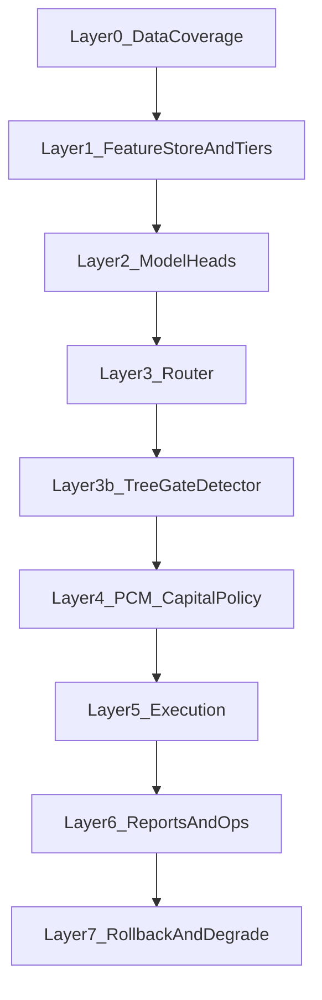

# 架构升级 V1：TaskSpec + Constitution + PCM（从研究到上线同一套代码口径）

本文件把你最近几份“架构/宪法/生存与跃迁/谁对 Sharpe 负责/树模型下游角色/订单流”文档的要点 **收敛成一套可落地规格**（YAML-first），目标是：

- **研究到上线走得通**：每一步都有明确命令、产物、验收指标
- **自由度可控**：任何新增自由度必须可关闭、可定位失败来源
- **Sharpe 不在模块里“背锅”**：只有 Portfolio/Capital Policy 层允许看 Sharpe，其余层只看各自 KPI
- **财富跃迁“合法化”**：跃迁发生在 **Portfolio/Capital Policy（PCM）层**，不是策略层/执行层

相关背景文档（你给的 7 篇）：
- `docs/architecture/自由度限制.md`
- `docs/architecture/自由度限制-归因-仓位和加仓.md`
- `docs/architecture/谁对sharp负责.md`
- `docs/architecture/极端情况暴富和生存的问题.md`
- `docs/architecture/树模型在多头模型下游的角色.md`
- `docs/architecture/多头NN和订单流.md`
- `docs/architecture/赌大人物meme的本质或者消息的本质.md`

另：特征分层与研发闭环参考：
- `docs/guides/FEATURE_COMPLEXITY_LAYERS_CN.md`
- `docs/guides/DEPLOYMENT_MVP_WORKFLOW_CN.md`
- Pool‑B 反向特征说明：`docs/guides/POOLB_INVERT_FEATURES_CN.md`

---

## 0) 最高层原则（宪法精神）

1. **系统默认目标不是“最大化收益”**，而是“在长期不死的前提下，让利润自然涌现”。  
2. **任何新增自由度必须可关闭、可度量、可定位责任**：否则一旦回撤你无法归因。  
3. **Sharpe 只允许在 Portfolio/Capital Policy 层观察**（作为验收结果），其余模块只做职责内 KPI（见 `谁对sharp负责.md`）。  
4. **NO_TRADE 是 Sharpe 稳定器**，不是失败；“不做”是合法动作。  
5. **财富跃迁发生在 PCM 层**：策略层不允许“无限加仓/无限杠杆”；跃迁必须被 earned（见 `极端情况暴富和生存的问题.md`）。  

---

## V1.1（补齐工程强制机制）：宪法与 KPI 不能被绕过

这部分是对 V1 的“封口升级”，目的只有一个：  
**让 Constitution/KPI 从文档变成 runtime gate，进 CI、进 code review。**

### 1) ConstitutionExecutor（宪法唯一执行入口）

- **代码**：`src/time_series_model/core/constitution/constitution_executor.py`
- **违规定义**：`src/time_series_model/core/constitution/violation.py`

当前 V1.1 已落地的强制点（先从 kill-switch 开始）：  
- `validate_drawdown()`：对 `max_dd` / 日周月亏损 / data_bad / hard_violation 做 hard-fail

### 2) KPI Gate（hard-fail 门禁）

- **代码**：`src/time_series_model/diagnostics/kpi_gate.py`
- **CLI（CI 可用）**：`mlbot diagnose kpi-gate --metrics-json ... --gate-yaml ...`
- **示例 gate 配置**：`config/kpi_gates/router_counterfactual_v1.yaml`

### 3) SystemStateSnapshot（归因快照）

- **代码**：`src/time_series_model/ops/state_snapshot.py`
- **落地**：`scripts/rl_counterfactual_eval_3action.py` 会输出 `system_state_snapshot.json`

### 4) Human Override 审计（禁止无痕 bypass）

暂定 V1.1 的最小约束（已落地到 counterfactual 脚本）：  
通过环境变量声明并写入快照：  
- `MLBOT_HUMAN_OVERRIDE_TAG` / `MLBOT_HUMAN_OVERRIDE_REASON`

### 5) Gate 输出必须离散化（禁止 size *= score）

- **类型**：`src/time_series_model/gating/types.py` 的 `GateDecision`

---

## 1) 系统分层（每层只做一件事）

> 这套分层是为了“责任可分解 + 报告可验收”，不是为了炫技。

各层职责与“合法 KPI”：

- **Layer 0 数据层**：只负责数据完整、对齐、漂移可观测（不看 Sharpe）。  
- **Layer 1 特征层**：只负责“算得出来 + 成本可控 + 可缓存 + 可分层解锁”。  
- **Layer 2 模型层（NN 多头 / 订单流表征）**：只负责“信息是否存在”（router-aligned 评估 + trade-slice 评估）。  
- **Layer 3 Router**：只负责把市场划分为 `mean/trend/no_trade`（或更细的状态），并输出**可用于分配资金的分布/置信度**。  
- **Layer 3b Tree Gate/Detector**：只负责 veto/throttle/permission（不直接输出方向、不直接下单）。  
- **Layer 4 PCM（Portfolio Capital Manager）**：**唯一允许看 Sharpe** 的层；负责把“可交易资金/风险预算”按状态与约束分配出去。  
- **Layer 5 Execution**：只负责“按预算执行、成本/滑点/风控一致性”。  
- **Layer 6 报告与运维**：统一产物、监控、审计链。  
- **Layer 7 回退降级**：任何异常都能降级到更低自由度（例如全 NO_TRADE）。  

---

## 1.5) Research 回测 vs Live 风控：vectorbt / counterfactual / Nautilus 各自负责什么？

你提到的关键点是对的：**Constitution 的“下单前强制验证”主要发生在 Nautilus（实盘 adapter）**，目的是把“风控”变成 runtime gate，避免实盘绕过。

但我们平时做训练/迭代，并不总是在 Nautilus 环境里。仓库里目前有三种“评估/回测口径”，分别服务不同层：

### A) vectorbt（快迭代，适合 Layer5 Execution & archetype 规则微调）

代码入口：
- `src/time_series_model/strategies/backtesting/vectorbt_backtest.py`
- `src/time_series_model/rl/execution_returns_vectorbt.py`（`returns_source='vectorbt_execution'`）

适用场景（推荐保留）：
- **Execution 层快速迭代**：SL/TP/时间止损/entry_delay/手续费滑点假设变更后的敏感性检查  
- **archetype 启发式规则/导出规则的微回测**：在单币/小窗口上快速验证“规则是否方向正确、是否会过度交易、是否明显增大 DD”
- **阈值平坦高原**：对 execution rule 阈值（以及未来 tree 导出规则的 veto 阈值）做快速网格/局部扰动检验

注意：vectorbt 的定位是 **快**，不是 “100% 复刻实盘”。它不负责：
- 下单前风控强制（slot/whitelist/override 审计）
- event-driven 的 timer 对齐、tick 断流等 live 现实问题

### B) router counterfactual / e2e（主研究链路，适合 Layer3 Router + Layer3b Gate 的系统级口径）

代码入口（主链路）：
- `mlbot nnmultihead pipeline-3action-e2e` 产生 `mode/logs/counterfactual/report.html`
- `scripts/rl_counterfactual_eval_3action.py`（这里已经接入 KPI Gate + ConstitutionExecutor 的离线检查与快照产出）

适用场景：
- **Router 阈值调参**、trade coverage、per-symbol 贡献分解
- **Gate 的 ablation**：router-only vs router+gate（这里更像“系统层行为比较”）

注意：它是“离线系统评估”，不是实盘下单；但我们把 **KPI Gate/Constitution 快照**接进来，是为了让 research 也能在 CI/实验里被门禁约束（例如 DD 过大直接 fail）。

### C) Nautilus（Live adapter，负责“下单前强制风控 + event-driven 现实约束”）

代码入口（live）：
- `src/time_series_model/live/meta_router_strategy.py`（timer 决策 + tick 订单流）
- `src/time_series_model/live/enforcement.py`（`enforce_before_order`）

适用场景（必须在 Nautilus 才能真实覆盖）：
- **下单前强制执行**：whitelist/证据/slot 等（绕过就拒单）
- **timer/tick/bar 对齐**：断流/延迟/重连/缺失策略（live feature contract）
- **审计链**：system_state_snapshot / 事件记录（便于复盘）

结论（回答你问的“哪一层还需要 vectorbt？”）：
- 需要保留：**Layer5 Execution / archetype 规则** 的快速 vectorbt 回测（快迭代的“工程工作台”）
- 不应该用 vectorbt 替代：**live 下单前宪法强制**（那必须在 Nautilus adapter）

---

## 2) TaskSpec v1（训练目标与流程）——YAML-first

### 2.1 文件位置

- `config/tasks/task_spec_v1.yaml`

### 2.2 TaskSpec 的作用

TaskSpec 不是“训练脚本参数集合”，它是 **研究到上线** 的统一合同：

- 数据窗口/Universe/Timeframe 的合同（避免“其实跑的是另一套时间/参数”）
- label/feature/model/report 的版本绑定（避免不可复盘）
- 哪些指标用于阶段验收（A 层/系统层/执行一致性层）
- 哪些自由度允许、哪些禁止（与 Constitution 对齐）

### 2.3 建议字段（v1）

（以下是 schema 设计意图，具体 YAML 见 `task_spec_v1.yaml`）

- `task_id`: 全局唯一（写入 meta/report/目录名）
- `universe`: symbols 分组（U1/U2/U3）与分组标签（HighCap/Alt/Meme）
- `windows`: train/val/holdout/oos（明确禁止污染 holdout）
- `feature_tiers`: Tier0/1/2/3 的解锁计划（required/optional_blocks）
- `model`: 基础 config、heads 定义、训练超参、warm-start/finetune 策略
- `router`: mode 定义（3-action 或更多状态）与阈值来源（tuned/固定）
- `gate`: tree gate 的训练/导出规则计划（可选）
- `pcm`: 资金分配策略（mode->budget）与跃迁条款开关
- `exec`: 执行假设（rr_execution/momentum_proxy、成本、entry_delay 等）
- `acceptance`: 每层验收门槛（见第 4 节）

---

## 3) Constitution v1（宪法层：系统不可违法约束）——YAML-first

### 3.1 文件位置

- `config/constitution/constitution_v1.yaml`

### 3.2 宪法要解决什么问题？

你已经在 `自由度限制*` 和 `极端情况暴富和生存的问题.md` 里把核心说清楚了：  
系统会“自然地”不断增加自由度（分组、择时、加仓次数、动态风险预算、策略切换），如果不把自由度关进宪法，那么回撤时你会遇到两类致命问题：

- **不可归因**：你不知道是哪一个自由度在作恶（分组？阈值？加仓？换仓？）
- **不可回退**：你无法一键回到“更低自由度、更安全”的模式

所以宪法要做的不是“让收益更高”，而是把系统变成：

- **可控**：任何自由度可关、可复盘
- **可生存**：硬风险约束永不违反（哪怕错过行情）
- **可跃迁**：满足资格时，允许在 Portfolio 层提高风险预算（而不是执行层乱加仓）

### 3.3 Constitution v1 建议结构（映射到 YAML）

（具体字段见 `config/constitution/constitution_v1.yaml`）

- **kill_switch**：日/周/月最大亏损、异常数据/执行成本上限、触发后强制 `global_pause`（只允许减仓/平仓）  
- **slots**：固定坑位数（例如 2），每个 slot 是固定风险预算，不是固定资金  
- **replacement_policy**：当保证金/坑位不足时，如何替换（替换决策必须可归因）  
- **add_position_policy（Trend-only）**：加仓只允许来自“已释放的风险预算”（浮盈保护后），Mean 永不加仓  
- **capital_escalation_clause（跃迁条款）**：只有满足资格才允许提高风险预算；退出条件更严格且无条件  
- **extreme_tail_policy（极端右尾/大人物 meme）**：允许参与但必须是宪法白名单（例如单独预算池、单独止损、单独提盈规则）  

---

## 4) 每层验收：看什么报告、什么指标算达标？

这一节把“谁对什么负责”变成可执行的验收清单。核心规则：  
**除了 PCM 层，其他层都禁止直接以 Sharpe 作为优化目标。**

### 4.1 Layer 0（数据）
- **产物**：coverage 报告（按月/按 symbol 的 bar 数、缺失月、时区对齐）  
- **硬门槛**：训练窗和 OOS 窗口每月 bar 数接近预期（例如 4H ≈ 1100/month），缺失必须显式标注并阻断训练  

### 4.2 Layer 1（特征/FeatureStore）
- **产物**：FeatureContract 检查 + FeatureStore 分层（layer 名称可追溯）  
- **硬门槛**：FeatureStore 是 wide table（包含所需输出列），不会出现“只有 OHLCV”导致训练全 invalid  
- **成本门槛**：按 Tier 解锁；Tier2/3 必须显式 opt-in（并启用 monthly parallel/fast-features）  

### 4.3 Layer 2（模型：NN 多头/订单流表征）
- **产物**：A-layer head eval（train + OOS），以及 router-aligned 指标  
- **硬门槛（推荐）**：
  - threshold-consistent 二分类（AUC/AP）：`mfe_atr`、`eff`、`dir_conf_trend` 的阈值口径与 Router 一致
  - trade-slice eval：只在 Router 会交易的子集上看 IC/漂移（避免被全样本稀释）

（实现口径参考你现有的 reporting：`src/time_series_model/models/nn/path_primitives_eval.py` / `path_primitives_reporting.py`）

### 4.4 Layer 3（Router）
- **产物**：`mode-3action` + `build-logs-3action` + `counterfactual` 报告
- **硬门槛**：mode 分布稳定、trade coverage 可控（NO_TRADE 不是失败），并能在 holdout 上复现

### 4.5 Layer 3b（Tree Gate / Detector）
- **产物**：gate shadow（pnl_with_gate vs pnl_without_gate）、误杀/漏放统计、规则导出（可审计）
- **硬门槛**：gate 只能 veto/throttle/permission，禁止“直接输出方向=开仓”（避免自由度爆炸）

### 4.6 Layer 4（PCM：Portfolio Capital Manager）
- **产物**：capital allocation 报告（mode->budget、per-symbol 风险预算、触发了哪些宪法条款）
- **唯一允许看 Sharpe 的地方**：组合层的 Sharpe/DD/相关性/尾部风险
- **硬门槛**：任何时刻不违反宪法（kill-switch/slot 风险预算/跃迁条款等）

### 4.7 Layer 5（Execution）
- **产物**：execution control 报告（成本/换手/回撤/数据异常），对应 `src/time_series_model/rl/exec_control.py`
- **硬门槛**：不出现异常 cost/turnover/DD；触发则必须能强制降级到 NO_TRADE

---

## 5) 特征与 Universe 的分层研发流程（从研究走到上线）

这部分请以两份文档为主：
- 特征/Universe 分层：`docs/guides/FEATURE_COMPLEXITY_LAYERS_CN.md`
- 上线 MVP 闭环：`docs/guides/DEPLOYMENT_MVP_WORKFLOW_CN.md`
- 命令导向最短路径：`docs/guides/RD_TO_LIVE_TIERED_WORKFLOW_V1_CN.md`

---

## 6) 实盘（Live）部分：把 `docs/live_stream` 当作“边缘系统”而不是系统核心

### 6.1 一句话定位

> **主干（研究→决策→宪法→PCM）继续自研且保持“批处理/可复盘”口径；  
> Nautilus Trader 作为 Execution Adapter（边缘系统）负责事件驱动与订单生命周期。**

这与 `docs/live_stream/nautilus_trader当作边缘系统.md` 的结论一致：  
不要 All-in Nautilus（会侵蚀 Router/Gate/PCM/Constitution 的边界），也不要完全自研 OMS（会把生命耗在不提升 Sharpe 的地方）。

### 6.2 Live 侧必须遵守的“契约与一致性”文档入口（强烈建议按顺序读）

- **入口索引**：`docs/live_stream/README.md`
- **一致性原则与契约**：`docs/live_stream/01_一致性原则与契约.md`
- **事件流与时间对齐**：`docs/live_stream/02_事件流与时间对齐.md`
- **特征计算：状态与缓存**：`docs/live_stream/03_特征计算_状态与缓存.md`
- **存储：回放与审计**：`docs/live_stream/04_存储_回放与审计.md`
- **补全/对账/异常处理**：`docs/live_stream/05_补全_对账与异常处理.md`
- **实盘稳定性运行手册**：`docs/live_stream/06_实盘稳定性运行手册.md`
- **与 NautilusTrader 对齐清单**：`docs/live_stream/07_与NautilusTrader对齐清单.md`
- **Nautilus 集成指南**：`docs/live_stream/reference/Nautilus_Trader_集成指南.md`

### 6.3 Live 的“强制注入点”：宪法与 KPI 不能只存在于报告

Live 侧的强制要求（V1.1 最小集）：

- **任何资金/仓位/执行指令落地前必须过宪法执行器**：`ConstitutionExecutor.validate_*()`  
  - 代码：`src/time_series_model/core/constitution/constitution_executor.py`
- **任何 promotion/上线动作必须过 KPI Gate（hard-fail）**：  
  - CLI：`mlbot diagnose kpi-gate --metrics-json ... --gate-yaml ...`
  - gate 配置示例：`config/kpi_gates/router_counterfactual_v1.yaml`
- **任何重大事件必须落盘 SystemStateSnapshot**（用于归因/回放）：  
  - 代码：`src/time_series_model/ops/state_snapshot.py`
  - 现阶段（V1.1）已在 `scripts/rl_counterfactual_eval_3action.py` 产出 `system_state_snapshot.json`

### 6.4 Live 与 Research 统一口径的最小规则（避免“框架一换，Sharpe 换了一套世界观”）

- **同一份 TaskSpec/Constitution 驱动两边**：Research 与 Live 只允许数据源不同（logs vs event stream），不允许逻辑分叉。
- **Router/Gate/PCM 逻辑必须是纯函数化/可回放**：事件驱动只做 adapter，不吞噬决策边界。
- **回撤归因靠 snapshot diff**：不要靠“回忆/猜测”复盘。

