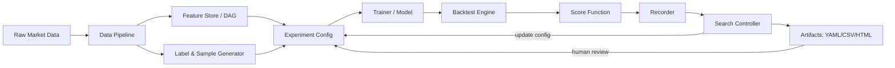

## 工业化量化研发架构文档：Experiment Loop（可复现、可扩展、可复用）

本文档把我们在 SR Reversal 语义化 + 组合搜索过程中逐步形成的方法论，整理成一套**工业化 Experiment Loop**。目标是让你在优化 **Label / Sample / Feature / Model** 时不陷入“噪声地狱”和“局部最优”，并且能复用到：
- **树模型（LightGBM）**：单策略/单任务
- **NN 多头基座（Multi-head）**：多任务共享底座 + head 对齐任务（Task），策略只在执行层绑定

---

## 1) 结论版路径图：先稳定什么 → 再动什么

> 工业化的核心顺序只有一句话：  
> **先锁死“问题定义 + 评估函数”，再稳定“Label/Sample”，再做“Feature”，最后才是“Model/Hyperparam”。**

推荐顺序：

```text
(0) 问题定义 & Score   ← 必须先锁死（可复现、可比较）
(1) Label + Sample     ← 决定“你在学什么”（任务定义）
(2) Feature Space      ← 决定“你用什么信息学”（特征选择/语义化）
(3) Model / Hyperparam ← 决定“你怎么学”（最后微调）
```

> 绝对不要同时把 Feature / Label / Sample / Model 全部一起搜——那是科研级 chaos，不是工程。

---

## 2) Experiment Loop：模块化总览（Data → Recorder → Search → YAML）

下面这个 Loop 是 buy-side（自营/受托资金）量化研发的常见形态：**把训练+回测当成不可拆分的评估函数**，外层用搜索控制器迭代配置，所有输入输出都落到 “recorder（记录器）”。

> 说明：这里的 recorder 是一个**概念角色**，不暗示它一定是一个独立的代码模块。当前仓库里 recorder 的职责实际分散在：
> - **结果工件（artifacts）**：`scripts/train_strategy_pipeline.py`、`src/time_series_model/diagnostics/feature_group_search.py`、`src/time_series_model/diagnostics/factor_ts_eval.py` 写入 `results/...`
> - **特征缓存（cache）**：tick-heavy 特征的月度缓存（例如 `cache/features/monthly/...`）
>
> 可选重构（以后空了再做）：如果你希望更“工业化”，可以抽象出一个 `Recorder`（或 `ArtifactStore`）层统一：
> - 工件命名/目录约定（Pool B / Search / Runs）
> - run_id/seed/step 元数据写入
> - HTML/CSV/JSON 的链接与索引生成



---

## 3) 在本仓库中的“模块映射”（现状）

这不是空泛架构图：你仓库里已经有了大部分组件（只是有些概念目前还“藏在策略目录里”）。

- **Data Pipeline**：
  - `data/parquet_data`（K 线 + 部分 ticks）
  - `TRAIN_START_DATE / TRAIN_END_DATE` 环境变量裁剪窗口（训练/回测一致）
- **Feature Store / DAG**：
  - `config/feature_dependencies.yaml`（特征 DAG）
  - `features.yaml` 的 `requested_features` 引用 DAG node
  - 相关研究补充（跨币种尺度对齐）：`docs/research/MARKET_CAP_NORMALIZATION_ORDERFLOW.md`
- **Label & Sample**：
  - 当前主要由各 strategy 目录的 label/weight 配置控制（SR-filter、weights 等），并在 `SR_REVERSAL_EXPERIMENT_PROTOCOL.md` 中形成了可复现的实验协议
- **Trainer / Model + Backtest**：
  - `scripts/train_strategy_pipeline.py`（训练 + 回测 + 输出 results.json/metrics）
- **Recorder（结果落盘）**：
  - `results/**`（每次 run 记录输入/输出）
  - `docs/architecture/strategies/SR_REVERSAL_EXPERIMENT_PROTOCOL.md`（结论记录，避免“口口相传”）
- **Search Controller（搜索/组合验证）**：
  - `mlbot diagnose feature-group-search`（组级 wrapper）
  - `mlbot analyze ts-feature-eval` / `mlbot analyze factor-eval`（filter）

---

## 3.1 FeatureStore / Monthly Cache / Node Cache 的版本口径（全局层 vs 节点层）

这里需要区分三件事（它们解决的问题不同，失效粒度也不同）：

### 3.1.0 三种“缓存/落盘”实体分别是什么？

- **FeatureStore（训练/评估的“数据集落盘”）**
  - **是什么**：把“原始 OHLCV/ticks → 特征 DataFrame（含订单流等）”按月落盘成可复用的数据集。
  - **结构**：`feature_store/<layer>/<symbol>/<timeframe>/YYYY-MM.parquet`（并伴随 `YYYY-MM.meta.json`）。
  - **layer 是什么**：一个“数据集 id / 数据版本”（例如 `features_83f12ecc5e`）。同一个 layer 下，不同符号/月份共享同一套特征定义与缓存版本口径。
  - **layer 如何确定**：通常由配置目录内容哈希自动生成（见 `src/feature_store/layer_naming.py` 的 `default_layer_from_config` / `resolve_layer_name`），也可以手动指定 `--layer` 强行复用/重建。

- **Monthly cache（特征节点的“中间结果缓存”）**
  - **是什么**：特征 DAG 节点（或需要 ticks 的重计算节点）在“按月窗口”上的中间结果缓存。
  - **位置**：一般在 `cache/features/monthly/...`（实现细节随节点而异）。
  - **用途**：让“同一配置、换训练窗口/换 seed/换策略搜索路径”时，不必每次从零算重特征。

- **Node cache version（单节点失效旋钮）**
  - **是什么**：写在 `config/feature_dependencies.yaml` → `compute_params.node_cache_version`，只影响某个 DAG 节点的缓存 key。
  - **用途**：当你只修改了某一个特征节点的逻辑（尤其是外部数据 join/对齐/单位语义），只失效该节点的缓存，而不全盘清理。

> **直觉总结**：FeatureStore 是“数据集落盘（大颗粒）”，Monthly cache 是“节点中间结果缓存（中颗粒）”，node_cache_version 是“单节点失效旋钮（小颗粒）”。

### 3.1.1 全局缓存版本：`FeatureComputer.cache_version`（例如 v6）

- **位置**：`src/features/loader/feature_computer.py` → `FeatureComputer.cache_version = "v6"`
- **影响范围**：
  - monthly cache key（`cache/features/monthly/...`）
  - FeatureStore 每个月分区的 `*.meta.json` 中的 `feature_cache_version`（用于审计“这个月分区是用哪个 cache_version 算出来的”）
- **什么时候 bump**：
  - 你修改了缓存 key 逻辑、索引对齐规则、或大量特征的通用计算逻辑，想“全盘清 monthly cache、确保一致性”。

> 进一步说明见：**[缓存版本控制使用说明](../features/缓存版本控制使用说明.md)**。

### 3.1.2 节点级版本：`node_cache_version`（只失效某一个 DAG 节点）

节点级版本写在 `config/feature_dependencies.yaml` 的 `compute_params`：

- `node_cache_version: v1`

它的用途是：当你只修改了某一个特征节点（尤其是外部数据 join/对齐逻辑）时，可以只 bump 这个节点版本，而不必 bump 全局 v6。

**示例**：

```yaml
market_cap_normalized_orderflow_f:
  compute_params:
    node_cache_version: v1

funding_rate_features_f:
  compute_params:
    node_cache_version: v1
```

> 缓存 key 会同时包含：全局 `cache_version` + 节点 `compute_params`（含 `node_cache_version`）。因此它不破坏统一性，只是提供更细粒度的失效旋钮。

### 3.1.3 FeatureStore layer 与 `cache_version/node_cache_version` 的关系（容易混）

- **FeatureStore layer** 决定“我们落盘了哪一份特征数据集”（目录树 + 月分区 parquet）。
- **cache_version/node_cache_version** 决定“特征节点计算的中间结果是否命中缓存、是否需要重算”。

两者的典型交互是：

- 你**只改了某节点逻辑**（例如 VPIN 对齐、market_cap join），建议：**bump `node_cache_version`** → 重跑 FeatureStore build（同 layer 或新 layer 都行）。
- 你**改了很多通用计算/缓存键**，建议：**bump `cache_version`** → 重跑 FeatureStore build。
- 你希望“把一整套配置当成一份不可变数据集版本”保存/对齐训练与评估，建议：**用 layer（自动哈希或手动命名）作为主版本口径**。

> TS FeatureStore 的结构/复用思路，与 CS Alpha101 的 monthly FeatureStore 结构是同一套口径；CS 侧更详细见：`docs/architecture/CROSS_SECTIONAL_ALPHA101_FEATURESTORE_ARCH_CN.md`（第 3 节写了统一月分区结构）。

---

## 3.2 外部数据密钥的注入方式（以 CoinGecko 为例）

对于外部数据（例如 CoinGecko market cap），我们**不在 YAML 中存密钥**，而是通过环境变量注入：

- `config/market_cap/market_cap.yaml` 中配置：
  - `api_key_env: COINGECKO_API_KEY`（这里只写“环境变量名”，不写 key 本体）

### 3.2.1 如何设置 key（推荐方式）

```bash
export COINGECKO_API_KEY='...'
mlbot data update-market-cap --config config/market_cap/market_cap.yaml --no-docker
```

或只对单条命令生效（更安全）：

```bash
COINGECKO_API_KEY='...' mlbot data update-market-cap --config config/market_cap/market_cap.yaml --no-docker
```

### 3.2.2 关于 `--docker/--no-docker`

- 对“下载/更新外部数据”这类命令，建议优先用 `--no-docker`，避免容器环境拿不到你当前 shell 的环境变量。
- 如果必须 `--docker`，确保把环境变量传进容器（实现方式取决于你的运行环境/封装脚本）。

---

## 4) “策略（Strategy）” vs “任务（Task）”：通用化 Layer A 的关键抽象

你现在感觉“Layer A（label/sample）绑定策略”，而 NN 多头不绑策略——这很正常。工业化解法是明确区分：

- **Task（任务）**：预测目标（label）+ 样本策略（weights/filters）+ 评估切分（walk-forward/seeds）
- **Strategy（执行策略）**：如何用预测结果交易（entry/exit/position/cost），以及最终回测指标如何计算

> **Layer A 应该绑定 Task，而不是绑定 Strategy。**

### 4.1 TaskSpec（建议的“第一公民”配置，后续树/NN都复用）

建议把 Layer A 固化成 `TaskSpec`（可先以文档/表格形式存在，后续再代码化到 `tasks/*.yaml`）：

```yaml
task_name: sr_reversal_rr_v1

label:
  family: sr_reversal_rr
  horizon_bars: 12
  sr_filter:
    dist_atr_mult: 1.5

sample:
  weight_strategy: result_based_rr
  params:
    loss_weight: 0.05
    high_rr_boost: 1.5

evaluation:
  split: walk_forward
  folds: 5
  seeds: [1,2,3,4,5]
  min_trades: 10

score:
  formula: Sharpe_mean - λ*Sharpe_std - μ*DD%_mean
  lambda: 1.0
  mu: 0.5
```

### 4.2 树模型（LightGBM）如何用 TaskSpec

短期你可以保持“策略目录”的工作方式，但在协议上强制：
- 每次特征迭代都**固定 TaskSpec**
- 只动 features（Layer B），避免 Layer A/B/C 同时漂移

### 4.3 NN 多头如何用 TaskSpec（不绑定策略）

NN 多头的天然结构就是 multi-task：
- shared trunk：共享特征表示
- heads：每个 head 对应 **路径原语标签**（例如 `dir/mfe/mae/ttm/(persistence)`），而不是策略名
- router/gate：把“路径原语”映射成 Router action（`mode ∈ {NO, MEAN, TREND}`），并可选做 regime conditioning

执行层（策略）不是“选 head”，而是**用一组原语输出 + 规则/Router 参数**去决定交易行为：
- Rule Router（baseline）或 BC/RL Router：输入 `pred_dir_prob/pred_mfe_atr/pred_mae_atr/pred_t_to_mfe` → 输出 `mode ∈ {NO, MEAN, TREND}`
- Execution：根据 `mode`（以及可选 market_profile）决定 RR/止损止盈/最长持仓/滑点等执行细节

这样 **Task 可复用**，而 strategy 只是一层 wrapper。

---

## 4.4 PolicyTask vs PrimitivesTask：两种任务形态长期共存（树/NN均可复用）

在本仓库里你会同时看到两种“任务”形态，它们都合理，取决于你处于研究/生产的哪个阶段：

### 4.4.1 PolicyTask（Direct policy / 直接开仓）

- **输出**：直接的交易信号/分数/概率（通常可直接喂给 backtest 的 entry）
- **目标**：最终指标（Sharpe/DD/trades）端到端驱动
- **优势**：闭环快、工程简单、适合快速验证假设（尤其树模型）
- **风险**：目标噪声大、对 regime/成本/执行语义非常敏感；当特征存在“异义性”时更容易互相抵消

### 4.4.2 PrimitivesTask（Path Primitives / 先学“路径原语”，再由执行层变成 action）

- **输出**：路径原语（例如 `dir_logit/mfe_atr/mae_atr/t_to_mfe/(persistence)`）
- **目标**：先学稳定可解释的“路径预测”，再由执行层（Execution）在强约束下把原语映射成行为（NO/MEAN/TREND）
- **优势**：复用性强（多策略共用底座）、长期演进更顺（Router/Execution 频率分离 + safety invariants + shadow A/B）
- **风险**：需要明确职责边界（Execution 不得改变 trade set）；需要条件化评估与样本加权，否则容易学成“平均世界模型”

> 对应文档：`docs/时序模型/架构：NN多头路径原语（Path Primitives）+Router解耦升级.md`

---

## 4.5 Path Primitives（Router→Execution）对 TaskSpec 的要求：Feature Contract + 条件化（soft gating）

PrimitivesTask 的 TaskSpec 与 PolicyTask 的关键差异在于：**“策略冲突（MEAN vs TREND）”不是通过把特征做成不冲突解决，而是通过 Router 输出 action（或权重）解决**。

### 4.5.1 “软门控（soft gating）”是什么？为什么它不是规则层专属？

这里的“软门控”不是指“按 action 选特征/换模型”，而是指两类**可观测条件**：

1) **regime variables（市场状态变量）**：例如 `near_sr / compression_score / trend_r2_20`
2) **feature availability（特征可用性）**：例如 ticks-heavy blocks 在线上可能缺失/被预算关闭（用 `append_block_mask` 编码）

它们既可以出现在规则层（Rule Router），也应该进入 Router/Policy 的输入与评估协议中：

- **作为输入（conditioning）**：让 Router/Policy 学条件函数 \(a = \pi(s \mid regime, availability)\)，而不是学“平均世界”的一条规则
- **作为评估切片（conditional metrics）**：强制输出 `near_sr__* / trend_high__* / compression_high__* / block_missing__*` 等切片指标，防止“全局好看但关键 slice 很烂”
- **作为样本加权依据（re-weighting）**：对关键 slice 提高权重（否则占比太小，优化会忽略它）

举例（一个可执行的 mental model）：
- 规则层：`near_sr=True` 且 `pred_mae_atr` 小 → 更偏向 `MEAN`；`trend_high=True` 且 `pred_dir_prob` 高 → 更偏向 `TREND`
- 评估层：分别报告 `near_sr` 桶与 `trend_high` 桶上的 Router-level 收益/Sharpe，以及 “ticks block 缺失 vs 不缺失” 两种口径下的稳定性
- 训练/推理一致性：使用 Feature Contract 的 optional blocks + `append_block_mask`，并在训练时用小概率 `block_dropout_p` 模拟线上“有/无”的组合（但默认 on/off 仍由 ablation 证据决定）

结论：软门控的价值来自 **条件化评估 + 条件化加权**，而不是“把几个字段喂进去就完了”。

### 4.5.2 Feature Contract（特征契约）：支持“全量训练 + 线上只传部分特征”

生产系统经常需要：
- 训练时用较大的特征宇宙（feature universe）
- 推理时按成本/延迟只提供部分特征（尤其 ticks-heavy blocks）

因此 TaskSpec 应显式定义 Feature Contract：

- **minimal required**：永远可用（能计算条件 mask 与基本归一化）
- **optional blocks**：可按条件/预算计算（ticks heavy / profile heavy）
- **missingness policy**：缺块如何编码（fill + `feature_available_mask` + block dropout）

> 重要：不要“按 action 挑特征”（推理时 action 未知且会引入自举偏差）；应“按可观测条件/成本预算挑特征”。

### 4.5.3 建议的 PrimitivesTaskSpec（规范草案）

下面是一个规范级草案（字段名可按你的实现映射），用于表达“全量训练的简单”同时避免“平均世界模型没用”：

```yaml
task_id: primitives_router_v1

outputs:
  heads:
    - {name: dir_logit, loss: bce, weight: 1.0}
    - {name: mfe_atr,   loss: huber, weight: 1.0}
    - {name: mae_atr,   loss: huber, weight: 0.7}
    - {name: t_to_mfe,  loss: huber, weight: 0.5}
    - {name: persistence, enabled: false}

conditions:
  near_sr: {type: sr_fuse_mask, params: {max_dist_atr: 3.0}}
  compression_high: {type: threshold, params: {col: compression_score, ge: 0.7}}
  trend_high: {type: threshold, params: {col: trend_r2_20, ge: 0.7}}

feature_contract:
  minimal_required_cols: [close, atr, dist_to_nearest_sr, compression_score, trend_r2_20]
  optional_blocks:
    - vpin_scene_semantic_scores_f
    - trade_cluster_scene_semantic_scores_f
    - liquidity_void_scene_semantic_scores_f
    - fp_imbalance_scene_semantic_scores_f
    - wpt_scene_semantic_scores_f
    - volume_profile_scene_semantic_scores_f
    - wick_scene_semantic_scores_f
  missingness:
    enable_feature_available_mask: true
    block_dropout: {enabled: true, drop_prob: 0.2, heavier_drop_for_tick_blocks: true}

sample_weighting:
  enabled: true
  base_weight: 1.0
  boosts: {near_sr: 2.0, compression_high: 1.5, trend_high: 1.5}
  caps: {min_weight: 0.2, max_weight: 5.0}

evaluation:
  report:
    global: true
    conditional: [near_sr, compression_high, trend_high]
```

### 4.5.4 在线推理的“二阶段特征计算”（成本 gating）

当存在高成本特征块时，推荐两阶段：

1) **Stage 0（cheap）**：只算 minimal required → 得到 near_sr/trend/compression 等条件 → Router 初步输出
2) **Stage 1（optional）**：若条件触发（例如 near_sr 或 compression_high）→ 再算 ticks-heavy blocks → Router 复算/增量更新 → Execution 决策

这能兼顾：
- 线上成本/延迟
- 训练-推理一致性（通过 mask/dropout）
- 避免“按 action 选特征”的自举偏差

---

## 5) 工业界通用范式：Filter → Wrapper（你已经在用）

### 5.1 Filter（便宜：广撒网/建候选池）

目的：从“特征宇宙（feature universe）”里筛出候选池 Pool B，而不是直接定最终特征。

推荐工具（本仓库已具备）：
- `mlbot analyze ts-feature-eval`：IC ranking / leakage / top factors
- `mlbot analyze factor-eval`：单因子时间序列评估（并支持导出 YAML，含 `invert_features` 候选）

产出：
- **Pool B（filter 有效但未验证 Sharpe）**
- 负相关但稳定的候选（可能进入 invert 推断）

### 5.1.2 Pool B（factor-eval）推荐落地流程（可复用、可归档）

> 目的：把“候选池”产出变成稳定的工程工件（Pool B），并保证后续 wrapper 能直接消费。

**推荐的最小规范（目录结构）**：

```text
results/pools/<strategy_name>/
  pool_b/
    factor_eval_report.html
    features_pool_b.yaml          # requested_features + invert_features(候选)
    factor_stats.csv              # IC/IR/coverage 等明细（由 factor-eval 产出）
```

**推荐命令模板（建议显式指定 export-yaml 路径）**：

```bash
mlbot analyze factor-eval \
  -c config/strategies/<strategy_name> \
  -s BTCUSDT -t 240T \
  --start-date 2023-01-01 --end-date 2025-10-31 \
  --remove-correlated --correlation-threshold 0.9 \
  --export-yaml results/pools/<strategy_name>/pool_b/features_pool_b.yaml \
  --output-dir results/pools/<strategy_name>/pool_b \
  --no-docker
```

**关于 `invert_features`（非常关键的语义）**：
- 在 Pool B 阶段，`invert_features` 代表 **“候选反向清单（invert candidates）”**，通常会比较全。
- 在 Pool A suggested（wrapper writeback）阶段，工具会自动裁剪为：
  - `final_invert_features = invert_candidates ∩ final_requested_features`
  - 从而避免“全量候选 invert 污染最终策略配置”。

---

## 5.1.1 YAML 工件约定（Pool B / Base Pool / Pool A Suggested）——你问的“文件默认在哪里？”

为了让流程可复用，我们把“特征相关的 YAML”按**语义**分 3 类（文件名/位置是约定，不是强制，但推荐统一）：

### A) Pool B（Filter 输出：候选池）

- **含义**：从特征宇宙里筛出的候选集合（可能很大），还没经过回测目标验证。
- **来源工具**：`mlbot analyze factor-eval`
- **默认落盘位置（当前代码默认）**：
  - `results/factor_ts_eval/{strategy_name}_{symbol}_features_suggested.yaml`
- **文件内容（典型）**：
  - `feature_pipeline.requested_features`：候选特征（很多）
  - `feature_pipeline.invert_features`：**候选反向清单（很多）**
    - 注意：在 Pool B 阶段它是“candidate list”，不是最终定型

推荐命令（显式写入一个 pool 目录，便于归档）：

```bash
mlbot analyze factor-eval \
  -c config/strategies/<strategy_name> \
  -s BTCUSDT -t 240T \
  --start-date 2023-01-01 --end-date 2025-10-31 \
  --output-dir results/pools/<strategy_name>/pool_b \
  --export-yaml results/pools/<strategy_name>/pool_b/features_pool_b.yaml \
  --no-docker
```

### B) Base Pool（Wrapper 的起点：当前主线基座）

- **含义**：wrapper 搜索的起点（必须包含“任务/标签/回测所需的最小上下文”）。
- **来源**：
  - **默认（已改进）**：`feature-group-search` 会直接读取你传入的 `--base-strategy-config` 里的 `features.yaml` 作为 base
  - **可选覆盖**：`--base-features-yaml <yaml list>` 让你显式指定 base 特征列表

因此，“base pool 默认文件”就是：
- `config/strategies/<strategy_name>/features.yaml` 的 `feature_pipeline.requested_features`

### C) Pool A Suggested（Wrapper 输出：最终建议配置）

- **含义**：在回测目标（Sharpe/DD/trades）意义上通过 wrapper 验证的**候选最优组合**（待 review）。
- **来源工具**：`mlbot diagnose feature-group-search`
- **输出位置**：
  - **实验记录**：`--output-dir results/feature_group_search/<run_name>/`
    - 产物：`feature_group_search_result.json` / `feature_group_search_candidates.csv` / `feature_group_search_report.html`
  - **建议 YAML（写回）**：`--writeback-yaml config/strategies/<strategy_name>/features_suggested.yaml`

> 重要：writeback 会自动裁剪 `invert_features`，保证最终 YAML 里只保留：  
> `invert_features = invert_candidates ∩ final_requested_features`  
> 这样不会把 Pool B 的“巨大候选 invert 清单”污染到最终 suggested 配置。

推荐命令（从“当前主线 features.yaml”出发，叠加候选组并写回 suggested）：

```bash
mlbot diagnose feature-group-search \
  -c config/strategies/<strategy_name> \
  -s BTCUSDT -t 240T \
  --start-date 2023-01-01 --end-date 2025-10-31 \
  --test-size 0.3 --seeds 1,2,3,4,5 \
  --groups-yaml config/feature_groups.yaml \
  --pool-b-yaml results/pools/<strategy_name>/pool_b/features_pool_b.yaml \
  --invert-candidates-yaml results/pools/<strategy_name>/pool_b/features_pool_b.yaml \
  --writeback-yaml config/strategies/<strategy_name>/features_suggested.yaml \
  --output-dir results/feature_group_search/<strategy_name>__search \
  --deterministic --no-docker
```

> **Conventions（默认约定）**  
> - **Pool 路径的稳定 ID = 策略目录名**：也就是 `config/strategies/<dir_name>` 的 `<dir_name>`。  
> - **策略加载（StrategyConfigLoader）同样以目录名为准**：`strategy_cfg.name` 统一等于 `<dir_name>`。  
>   - YAML 里的 `name:` 被视为“可选 declared name（展示名）”，如果和目录名不一致会给出 warning（或 strict 模式直接报错）。  
> - `factor-eval`：如果你不显式传 `--output-dir`/`--export-yaml`，默认会把 Pool B 工件写到  
>   `results/pools/<dir_name>/pool_b/features_pool_b.yaml`（并在同目录写 HTML/JSON 报告）。  
> - `feature-group-search`：如果你不显式传 `--pool-b-yaml`/`--invert-candidates-yaml`，会自动尝试读取  
>   `results/pools/<dir_name>/pool_b/features_pool_b.yaml`（不存在则忽略，仍可运行）。  
> - `feature-group-search` 的 groups 默认来源（不传 `--groups-yaml/--groups-json` 时）：
>   1) 优先 `config/feature_groups_<dir_name>_semantic.yaml`（若存在）
>   2) 再用全局 `config/feature_groups.yaml`（若存在）
>   3) 最后才退回代码内置 `_default_groups()`（写回 `groups_source=default_groups`）
>
> `--pool-b-yaml` 解决的就是你提到的矛盾：  
> 你的 `config/feature_groups.yaml` 可能只维护“语义化 blocks”（scene semantic），但 Pool B（factor-eval）会产生大量动态候选特征。  
> 该参数会把 Pool B 里未覆盖的候选特征自动补成 singleton groups（`poolb__<feature>`），从而让 wrapper 能覆盖“语义 blocks + 动态因子池”两类来源。

---

## 5.1.3 如何解读 `features_suggested.yaml` 里的 `feature_group_search` 元数据？

当你使用 `mlbot diagnose feature-group-search --writeback-yaml .../features_suggested.yaml` 时，我们会在 YAML 里额外写入一个顶层字段：

- `feature_group_search: ...`

它**不会影响训练/回测**（训练只读取 `feature_pipeline.*`），它的作用是：**让 suggested 配置可审计、可复现、可解释**。

下面逐字段解释（以 `trend_following/features_suggested.yaml` 为例）：

- **`base_strategy_dir`**：这次搜索的“基座策略目录”（起点），例如 `config/strategies/trend_following`
- **`objective`**：本次 greedy 搜索优化的目标列，例如 `Sharpe_mean`
- **`min_trades`**：硬约束（用于过滤候选），例如 `min_trades=10`
- **`seeds`**：本次评估使用的 seeds 列表（影响均值/方差），例如 `[1,2,3,4,5]` 或 `[1]`
- **`groups_source`**：候选组定义来自哪里（以及如何指定）
  - **可取值（工具写入）**：
    - `groups_yaml:auto:config/feature_groups_<dir_name>_semantic.yaml`：你没传 `--groups-yaml/--groups-json`，且存在策略家族专用 groups 文件，工具会**自动优先读取它**
    - `groups_yaml:auto:config/feature_groups.yaml`：否则若存在全局文件，工具会**读取它作为默认**
    - `default_groups`：当全局文件也不存在时，退回使用 `feature-group-search` 的**内置默认 groups**
    - `groups_yaml:<path>`：你显式传了 `--groups-yaml <path>`
    - `groups_json:<path>`：你显式传了 `--groups-json <path>`
  - **`default_groups` 定义在哪里？**
    - 定义在：`src/time_series_model/diagnostics/feature_group_search.py` 的 `_default_groups()` 函数里（代码内硬编码的一组“保守候选组”）。
    - 含义：当你**不传** `--groups-yaml/--groups-json` 且仓库里也没有 `config/feature_groups.yaml` 时，搜索空间就使用这份默认 groups。
    - 建议：工业化流程里通常**不要长期依赖** `default_groups`，而是把策略家族的候选组固定到配置文件：
      - 全局：`config/feature_groups.yaml`
      - 策略家族专用：`config/feature_groups_<strategy>_semantic.yaml`
      - 这样组定义可审计、可 review、可版本化。

### 额外说明：你提到的 3 个点（推荐做法）
- **(1) strategy semantic groups**：这些 groups 主要是“语义化后的节点”（scene semantic 等），相对 raw 统计量更不容易跨策略打架，所以更适合做“组级搜索空间”。
- **(2) factor-eval (ts eval) 输出**：建议把 Pool B 的 `requested_features` 当作“每个 feature 一个 singleton group（poolb__<feature>）”，交给 feature-group-search 做 wrapper 验证与定型（通过 `--pool-b-yaml` 或默认 pool 探测）。
- **(3) 自动选择策略家族 groups**：不显式传 `--groups-yaml` 时，工具会按策略目录名自动优先选择 `config/feature_groups_<dir_name>_semantic.yaml`（存在即用），减少命令复杂度并保证复用一致性。
  - **注意**：如果同时使用了 `--pool-b-yaml`（或自动探测到 Pool B），工具会把 Pool B 里未覆盖的候选特征补成 `poolb__<feature>` singleton groups；这部分会额外记录在 `pool_b_yaml` / `pool_b_merged_singletons` 字段中（见下）
- **`feature_blacklist`**：此次搜索显式排除的 requested_feature nodes（如果有）

- **`pool_b_yaml`**：如果合并了 Pool B（factor-eval 导出 YAML），这里记录其路径（否则为 null）
- **`pool_b_merged_singletons`**：是否把 Pool B 的候选特征自动补成 singleton groups（true/false）

- **`base_features`**：搜索起点的特征列表（默认等于 `base_strategy_dir/features.yaml` 的 `requested_features`，也可能来自 `--base-features-yaml`）
- **`selected_groups`**：最终被加入的 group 名称序列（greedy 顺序）
- **`final_features`**：最终建议使用的 requested_features（也就是 `base_features + Σ(selected_groups)`）
- **`stop_reason`**：为何停止搜索（最重要的解释字段之一）
  - `no_improvement`：所有剩余 group 都无法把 objective 提升到超过当前 best（因此停止）
  - `max_steps_reached`：达到 `--max-steps` 上限（通常建议提高 steps 或改用 beam/SFFS）
  - `no_valid_candidates`：没有可评估候选（例如全被 blacklist 掉）
- **`rejected_groups`**：停止时仍未被选择的候选组（用于解释“哪些没进最终配置”）

> 实战读法：  
> - 想知道“**为什么选了 A**”：看 `selected_groups` + `feature_group_search_candidates.csv`（每步所有候选得分）  
> - 想知道“**为什么没选 B**”：看 `stop_reason` + `rejected_groups` + candidates 表里 B 的分数  
> - 想知道“**最终我该用哪些特征训练**”：看 `feature_pipeline.requested_features`（与 `final_features` 一致）

### 5.2 Wrapper（贵：真实裁判）

目的：直接在“训练 + 回测”目标（Sharpe/DD/trades）上选择特征组合。

你现在已有的 wrapper：
- `mlbot diagnose feature-group-search`：组级 greedy forward selection（可作为第一阶段）

### 5.2.1 现在 `feature-group-search` 是不是滚动训练（walk-forward / rolling OOS）？
不是。当前 `feature-group-search` 走的是 “固定切分 + TS-CV + multi-seed”：
- **外层评估**：按时间做一次 **train/test split**（`--test-size`），在 test 段做回测并产出 Sharpe/DD/trades（wrapper 目标）。
- **内层训练**：train 段内部使用 **TimeSeriesSplit（时间序列 CV）** 训练与打分。
- **稳定性**：通过 `--seeds` 重复整个流程，输出 mean/std/min/max。

### 5.2.2 默认要不要改成滚动训练？
不建议把 rolling 作为 Layer B 的默认（太贵，会把一次评估变成“多窗口 × 多次训练/回测”，严重拖慢搜索迭代）。

推荐做法：
- **Layer B（搜索/定型）**：保持当前固定切分 + TS-CV + multi-seed（快）。
- **确认阶段（confirm）**：对最终 shortlist（例如 top 1–3 配置）再跑更严格的 rolling/walk-forward OOS，检查跨窗口稳定性与概念漂移敏感性。

### 5.2.2.1 Confirm 阶段：为什么仍需要“确认性 A/B”（即使已经做了 feature-group-search）？

`feature-group-search` 的定位是：在固定 Task/回测口径下，用 greedy 方式从“组”里选出一个看起来最优的组合。  
但它**不是最终结论本身**。Confirm 阶段仍建议做**确认性 A/B**，原因是：

- **防止“偶然收益”**：贪心搜索会做多次比较，容易在噪声里捡到一次“看起来更好”的组合。
- **防止“协变量污染”**：某个组的提升可能来自执行/阈值/样本切分等细节变化，而不是特征本身的稳定增益。
- **让结论可复盘**：A/B 报告能明确写出“比谁好、好多少、在哪些 slice 上好”，便于团队复用与回滚。

#### A/B 应该怎么做（工业化模板）

最小推荐 3 个对照（同一策略、同一时间窗、同一 seeds 集合）：

- **A0 baseline**：base features（不加任何候选组）
- **A1 suggested**：`feature-group-search` 输出的最终 `features_suggested.yaml`
- **A2 isolate（可选但强烈建议）**：只加“最后一步被选中的那一组”（或你最想验证的那一组）

并固定：
- **同一 TaskSpec（label + sample + split）**
- **同一回测/执行语义**（RR exits、阈值、成本、time-exit、trailing 等都不变）
- **同一 multi-seed 集合**（例如 1..5）

判定标准（建议写入报告）：
- **均值提升**：`Sharpe_mean` / `Return_mean` 的提升是否显著（同时看 std）
- **交易约束**：`trades_mean >= min_trades` 是否满足；以及 trades 的稳定性（不要只靠单 seed）
- **尾部/回撤**：是否是靠极少数交易堆出来（看 per-seed 分布 + equity/DD）
- **slice 证据（推荐）**：near_sr / compression_high / trend_high 等关键 slice 上是否一致受益

结论写法（建议统一格式）：
- “A1 vs A0：Sharpe_mean +X（std=Y），trades_mean +N；5/5 seeds 为正增益；关键 slice：……”
- “A2 vs A0：增益主要来自 group=XXX（或主要不是来自它）”

### 5.2.3 Execution 约束（你刚确认的最佳实践）
- **compression_breakout**：保持单仓位（不 pyramiding），启用 `use_rr_exit`；可选开启 `rr.use_trailing_stop=true`（用于突破后锁定利润）。
- **trend_following**：pyramiding + trailing 属于执行层升级（Layer C/Execution），不建议混进 Layer B 特征搜索默认流程；建议在最终 shortlist 上单独做确认与调参。
  - 工程落地（已支持为可选开关）：在 `config/strategies/trend_following/backtest.yaml` 里显式开启
    - `use_trailing_stop: true` + `trailing_atr_mult`
    - `max_holding_bars: N`（time-exit）
    - `pyramiding.enabled: true`（vectorbt accumulate）

#### 5.2.3.1 trailing 会不会提升 Sharpe？为什么不放进 Layer B 默认？
- **会影响 Sharpe**：trailing stop 改变的是“退出分布”（让盈利单更容易锁住、让回撤更小），在很多 breakout/趋势类策略里确实可能提升 Sharpe。
- **但它不等价**：加了 trailing 之后，回测结果通常**不会**与“不加 trailing”相同；甚至会改变“哪个特征组合更好”的排序（因为特征→预测→持仓路径变了）。
- **所以不放进 Layer B 默认**：Layer B 的目标是“在固定的执行/回测规则下”找稳定的特征组合。如果把 trailing/pyramiding 混进去，会把特征选择和执行调参缠在一起，搜索空间爆炸、结论难复现。
- **正确节奏**：
  - Layer B：固定执行（默认不启用 trailing/pyramiding），先把特征组合定型。
  - Confirm / Execution（Layer C+）：对 shortlist 再打开 `rr.use_trailing_stop`（或 pyramiding）做增益验证，属于执行层优化。

#### 那为什么我还在 compression_breakout 里“支持” use_trailing_stop？
我建议的是“**可选支持**”，而且默认是 `false`。原因是：
- breakout 的实盘执行里，trailing 是常见的风控/锁利机制；你最终很可能会想验证它是否提升稳健性。
- 把它作为 **可选开关**放在 backtest.yaml，便于你在 confirm 阶段用同一套特征/模型快速切换对比；
  但在 Layer B 搜索阶段，我们保持默认关闭，避免污染特征选择过程。

工业化升级方向（算法层，不一定一次上）：
- **SFFS**：允许 forward + backward（减少局部最优）
- **Beam search**：每步保留 top-K 组合，捕捉协同效应
- **Successive Halving**：先小预算筛，再大预算复核（控制算力）
- **Optuna/TPE（离散）**：把“组是否启用/候选池子集选择”当离散优化

---

## 6) 你最关心的自动化：(b) 组内裁剪 + 自动反向 + 回写 YAML + 继续迭代

结论：**方向正确**，但工业化一定要加两件事：
- **稳定性约束（stability selection）**
- **小步迭代（每轮最多删 10–20%）**

### 6.1 为什么“模型还不稳时的 SHAP/importance 不可信”

当 label/sample 未稳定或模型输出噪声大时：
- importance 会被相关性、分裂偏置、样本 slice 稀疏性严重影响
- 会出现“删掉有效特征 / 保留噪声特征”的反复震荡

因此需要“跨 folds × seeds”的稳定性证据。

### 6.2 推荐证据口径（工业级）

对每个候选特征/列（或组）在多 runs 上记录：
- **Permutation importance（对回测 score）**：主证据（更接近“真实贡献”）
- **SHAP（解释方向）**：辅助证据（更接近“模型内部解释”）
- 方向一致性、排名稳定性

### 6.3 自动裁剪/反向规则（建议默认值）

- **无效（删除）**：
  - ≥80% runs 中 importance 排名 bottom 30%，且置换后 score 几乎不变
  - 每轮最多删 10–20%
- **负面（invert）**：
  - ≥80% runs 中置换/方向证据表明“反向能提高 score”
  - 加入 `invert_features`
- **冲突（不删）**：
  - 方向 50/50 或强 regime 依赖
  - 不建议 invert；更适合交给 router/多头/场景 gate

> 决策口诀：**数学连续轴 → invert；策略假设轴 → split；不稳定 → 延后不动。**

### 6.4 回写策略（工程安全）

建议固定三层文件语义：
- `features.yaml`：主线（稳定）
- `features_suggested.yaml`：自动化产出建议（待 review）
- `features_archive/`：历史归档（可追溯）

---

## 7) Layer A 主线候选表（建议写法：按 Task，而不是按 Strategy）

你现在的 SR reversal 已经有很好的 Layer A 结果（SR-filter + weights）。建议在协议里固化成“Task 候选表”，并强制后续 feature 迭代只能基于其中某个 task。

示例（SR reversal）：

| TaskSpec | SR-filter | sample weights | 用途 |
|---|---:|---|---|
| `sr_reversal_rr_v1` | dist_atr_mult=1.5 | weighted（loss_weight=0.05, high_rr_boost=1.5） | **main** |
| `sr_reversal_rr_v0` | dist_atr_mult=1.5 | unweighted | baseline |

---

## 8) 最小落地建议（从今天就能执行）

> 不要求立刻重构成 Qlib；先把“研究系统”的边界立住。

- **先把 Layer A 固定为 1 个 main TaskSpec + 1 个 baseline TaskSpec**（写进协议）
- 每轮只做 Layer B（features），严禁同时动 Layer A/C
- features 选择用 Filter→Wrapper 两段式：
  - Filter：`ts-feature-eval` / `factor-eval` 产出 Pool B
  - Wrapper：`feature-group-search` 产出 Pool A
- 当 Pool A 稳定后再引入：
  - (b) 组内裁剪 + invert 推断（稳定性证据口径）
  - 更强搜索（SFFS/beam/halving）
- NN 多头阶段：
  - 直接复用 TaskSpec 作为 heads
  - 执行策略只决定用哪个 head


