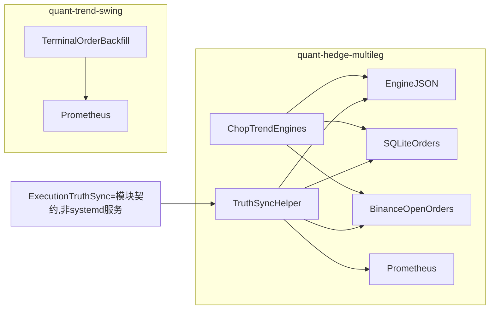

# ABC 执行层：近期修复、结构性问题与建议

> 日期：2026-06-14（末次修订 2026-06-14 Phase 1–4 代码合并）  
> 范围：A/B/C 战略分层下的 **live 执行与对账**（非 R&D Phase 1 scan）  
> 状态：**实施中** — Phase 0–4 ✅ · Phase 5 自动化 ✅ / Live 观察 ⏳ · 进度见 §7 末表  
> 相关：[segment-lifecycle.md](segment-lifecycle.md)（C multileg 段生命周期专题，P0–P4 已实现） · [ABC三层收益结构_战略框架_CN.md](../strategy/ABC三层收益结构_战略框架_CN.md) · [漂移监控_mlbot_monitor_CN.md](../strategy/漂移监控_mlbot_monitor_CN.md)

**与 segment-lifecycle 的分工**：后者讲 **ghost / slot / `_deactivate` 状态机**（代码已合并）；本文讲 **执行层总账 + 对账 metrics + TruthSync 路线图**。Live 验收项两篇交叉引用（segment §6 ↔ 本文 Phase 5）。

**B·Trend 持仓专题**（JSON / SQLite / CMS 分叉、BNB 2026-06 事故）：见 [trend_position_state_and_truth_sync_CN.md](trend_position_state_and_truth_sync_CN.md)。

---

## 1. 近期重大修复（执行相关）

### 1.1 C 层 multileg（chop_grid / trend_scalp）— 最高优先级

| 问题 | 影响 | 修复 |
| ---- | ---- | ---- |
| **Ghost segment**：TP/SL 后 `active=True` 占并发 slot | 6 symbol 卡死、无法开新段 | P0 auto-deactivate → P1–P4 `SegmentLifecycleMixin`（`643deb9c`） |
| **Orphan exchange SL** | 交易所残单 vs 本地 state 脱节 | `per_leg_stop_loss: false`（`1d8d9e1c`） |
| **chop ↔ trend 互斥** | 同 symbol 双引擎抢 slot | symbol mutex + trend SL 清理（`3bf16d9a`） |
| **Stale pending** | Binance 已 cancel，SQLite 仍 `pending` | terminal backfill 调用 `reconcile_open_orders`（`fb4e6b85`） |
| **并发门控 ghost slot** | `active` 无仓仍占 cap | `holds_real_grid_slot` / gate cooldown（2026-06-12） |

### 1.2 CMS / 对账可见性

| 问题 | 修复 commit |
| ---- | ----------- |
| hedge 共享 SL 一对多 exit 配对 | `e52fcbbd` |
| dust `market_exit` link PnL 夸大 | `3ad16941` |
| trend `_fillN` / `skipped_no_position` 回合配对 | `8731c4be` / `041a590e` |
| SQLite INT vs TEXT → HYPE markers 缺失 | `cde59b8c` |
| 条件单 vs 限价 pending 混淆 | `fb4e6b85` + `displayOrderKind` |

### 1.3 共用基础设施

| 问题 | 修复 |
| ---- | ---- |
| feature-bus 缺 multileg alias/gate | `a93148be` / `35e2a237` |
| `trend_direction` 类型不一致 | `dd918924` |
| WS queue overflow | `d7dd239f` |
| 宪法 sizing vs trend gate | `2a0ce2f5` |

### 1.4 B 层（信号/研究，执行间接）

TPC direction band 对齐、fast_scalp dual-head、ME CompressionBreakout rework 等——影响 **是否触发**，不替代 C 的 multileg 段生命周期。

### 1.5 2026-06-14 对账 follow-up（`f80f32d3`）

| 问题 | 修复 |
| ---- | ---- |
| daemon `sync_live_exchange_state` 误更新 `_last_reconciled_at`，低频 bar symbol 长期 skip 全量 reconcile | 拆出 `_last_exchange_synced_at`；全量 reconcile 仍走 `_last_reconciled_at` |
| `reconcile_open_orders` 查 algo/条件单时 `get_order` 缺 `client_order_id` fallback | `order_manager` 传入 `client_order_id=order.client_order_id` |
| `open_reconcile_updated` 传入 metrics 但被 allowlist 丢弃 | `metrics_exporter` 增加第 6 个 bucket（Phase 1 部分完成，见 §3） |

> **注意**：`f80f32d3` commit message 提及 dual_add late-fill `market_exit` 在 `on_execution_results` 的处理，**该 diff 未进同 commit**；已于 2026-06-14 单独补齐（见 §5.1）。

---

## 2. ABC 是「分账户」，为什么还要谈 ExecutionTruthSync？

### 2.1 两个不同维度

| 维度 | ABC 分层 | ExecutionTruthSync（本文用语） |
| ---- | -------- | ------------------------------ |
| **解决什么** | payoff 错配、风控预算、KPI 混账本 | **同一 runtime 内** 本地 state / DB / 交易所 三者 drift |
| **隔离单位** | 子账户 / 宪法 bucket / 策略 KPI | 单账户内的 engine JSON、SQLite、`openOrders` |
| **典型事故** | 用 B 的 holding 扛 A 的 beta | ghost segment、stale pending、orphan SL |
| **目标态** | A/B/C 物理子账户（见 A 层扩展规划） | **每个** 子账户仍需要 truth sync |

**结论**：ABC 分账户 **不能替代** truth sync。分账户后，C 账户里仍会有 engine state + orders 表 + Binance open orders；ghost/stale 仍可能发生，只是不会污染 A/B 的 PnL 归因。

### 2.2 当前 prod 与 ABC 目标态的差距

战略文档要求 A/B/C **账本隔离**；**今天** 更接近：

| 层 | 执行栈 | 账户（现状） |
| -- | ------ | ------------ |
| **C** | `multi_leg_daemon` + chop/trend live engine + hedge SQLite | **同一 hedge 账户**，chop 与 trend 共享并发 gate |
| **B** | PCM / event live / 单腿 trend | 常与 C 同所、同 bus，路径不同 |
| **A** | spot / rolling（研究+部分 live） | USDT-M；dapi 未做 |

因此近期 ghost/orphan/stale 事故都出在 **C 栈 + 共用 hedge 账户**，修复也集中在此——这与「ABC 应分账户」**不矛盾**：分账户是 **下一步**，truth sync 是 **每一步都要的内功**。

### 2.3 ExecutionTruthSync 指什么（不是合并 ABC，也不是新进程）

> **术语说明**：`ExecutionTruthSync` 是本文用的**工程概念名**，指「单账户 runtime 内的 truth sync helper / 模块契约」。**不是** systemd 第四进程，**不是**跨 A/B/C 的中央同步服务。

不是把 A/B/C 合成一个系统，而是 **在单账户、现有进程边界内**：

1. **统一 reconcile 调度**：谁、何时调用  
   - `reconcile_open_orders`（open ↔ local pending）  
   - `reconcile_recent_terminal_orders`（终态回填）  
   - multileg daemon `reconcile`（engine state ↔ exchange，60s 或 on action）  
   - ~~`MonitoringService.reconcile_open_orders`~~ 已删除（2026-06-14）；止损/保证金告警改由 CMS 账户层

2. **统一 metrics / 告警字段**：同一 issue 类型不因入口不同而丢失（见 §3）。

3. **明确三源优先级**：exchange truth 用于 replenishment guard；段 slot 以本地 inventory/pending 为主（见 [segment-lifecycle.md §4.4](segment-lifecycle.md)）。

**落地形态（Phase 4）**：共享 Python 模块（候选路径 `src/order_management/execution_truth_sync.py`），由 `quant-hedge-multileg`、`quant-trend-swing` 等**现有进程 import 调用**——不新增 daemon。

即使 chop 与 trend 永远分账户，**每个账户** 仍需要上述 1–3；ExecutionTruthSync 是 **单账户内部的工程债名称**，不是否定 ABC 分账。

---

## 3. 监控缺口（2026-06-14 同步代码）

### 3.1 `open_reconcile_updated` 与 metrics 状态

`terminal_order_backfill.py` 经 `execution_truth_sync.publish_reconciliation_metrics` 写入：

```python
publish_reconciliation_metrics(
    scope="trend",
    issue_counts={
        "stale_local_order": stale_marked,
        "api_error": api_error,
        "open_reconcile_updated": len(open_updated),
    },
    source="terminal_order_backfill",
)
```

`metrics_exporter.update_reconciliation_metrics` 使用 `RECONCILIATION_ISSUE_BUCKETS`（定义于 `execution_truth_sync.py`）：

```python
for issue in RECONCILIATION_ISSUE_BUCKETS:
    ...
```

| 项 | 状态 |
| -- | ---- |
| Prometheus gauge 写入 | ✅ |
| 单测断言 `open_reconcile_updated` | ✅ `test_metrics_reconciliation_scope.py` |
| Grafana 面板 | ✅ Trend dashboard panel id 909 |
| `RECONCILIATION_ISSUE_BUCKETS` 常量提取 | ✅ `execution_truth_sync.py` |
| `ok=` 语义（自愈不计入 unresolved） | ✅ `reconciliation_ok_from_issues` |

**语义**：`open_reconcile_updated > 0` 表示**本次 reconcile 修了多少单**，是自愈动作，**不应**单独把 `reconciliation_ok` 永久打红（见 §8.6）。

### 3.2 其他未覆盖项

| 信号 | 现状 | 告警可用？ |
| ---- | ---- | ---------- |
| `open_reconcile_updated` | gauge + 单测 + Grafana panel 909 | ⚠️ 面板观察；无 hard alert |
| `segment_*`（segment lifecycle） | `_deactivate` → `record_strategy_event` | ⚠️ Grafana Hedge panel 909 |
| multileg daemon reconcile issues | `multi_leg_reconciliation_issues_total` + orchestrator `publish_reconciliation_metrics` | ⚠️ 部分 |
| slot 占用 / ghost 检测 | `update_slot_metrics`（PCM 路径） | ⚠️ C multileg 未统一 |

### 3.3 与 `mlbot monitor` manifest 的关系

[漂移监控_mlbot_monitor_CN.md](../strategy/漂移监控_mlbot_monitor_CN.md) 中 C 执行层仍以 **`multileg monitor` 月报** 为主，未纳入：

- reconcile issue 时间序列（含 `open_reconcile_updated`）  
- ghost clear 计数  
- open reconcile 更新行数  

**待办（按 Phase）**：

1. ~~allowlist 加 `open_reconcile_updated`~~ ✅  
2. ~~`_deactivate` → `record_strategy_event(segment_*)`~~ ✅ Phase 2  
3. ~~Grafana + provisioning tests~~ ✅ Phase 3  
4. ~~`execution_truth_sync.py` helper~~ ✅ Phase 4（legacy `monitoring.py` 已删除）  
5. segment-lifecycle §6 Live 项 + 本文 Phase 5 prod 观察 → ⏳  
6. `mlbot monitor` manifest 纳入 reconcile / segment 事件 → 登记

---

## 4. 执行层结构性问题（按 ABC）

### 4.1 跨层（今天仍共用所级基础设施）

| 问题 | 说明 |
| ---- | ---- |
| 三源 drift | engine JSON ↔ SQLite ↔ exchange；分账户后每账户仍存在 |
| reconcile 多入口 | terminal backfill、daemon、orchestrator on action — 行为/频率不一致（legacy MonitoringService 已删） |
| 监控链断裂 | B Regime 有 parquet verb；C Regime 未接；C 执行无实时 reconcile 告警 |
| 宪法 bucket | ABC 应用 constitution 分 gross/net cap，而非仅 strategy slug |

### 4.2 C 层（优先）

| 优先级 | 项 |
| ------ | -- |
| P0 | Live 验证：TP fill 后 slot 在 `on_execution_report` 释放（segment-lifecycle §6） |
| P1 | 补 §3 metrics + manifest |
| P1 | `sync_live_exchange_state` chop/trend 抽共享 helper，防下一处 drift |
| P2 | timeline backtest 与 live 共用 segment lifecycle 语义 |
| P2 | PnL `math.isclose` + trade-level audit（multileg_sizing DECISION §6） |

### 4.3 B 层

- 不套用 C 的 segment lifecycle；需要 **position-level** lifecycle + **`ledger` realized-R verb**（监控文档 T5）  
- 审计 backtest tier / noise_penalty 在 live 是否生效（[backtest_vs_live_execution.md](backtest_vs_live_execution.md)）

### 4.4 A 层

- `abc_macro_regime_score` 与 C 的 2h router **特征可共用、决策链分离**  
- 执行重点是 **低 churn、慢出场**；dapi 暂缓（全栈重写）  
- 子账户隔离见 [A层多子账户扩展规划_CN.md](../strategy/A层多子账户扩展规划_CN.md)

---

## 5. Review 结论（2026-06-14）

近期重大修复集中在 **C 层 live 执行**：ghost segment、orphan 保护单、stale pending、symbol 冲突、CMS 对账可见性。代码侧 P0–P4（segment lifecycle）与 `fb4e6b85`（open reconcile 调用）、`f80f32d3`（daemon reconcile 周期 / algo 查单 / metrics bucket）已合并；**Phase 1–4 可观测性与 TruthSync helper 已于 2026-06-14 补齐**；Phase 5 Live 观察仍待 prod/paper。

| 维度 | 状态 |
| ---- | ---- |
| 段生命周期 refactor | ✅ 已合并（`643deb9c` 等） |
| stale pending reconcile | ✅ 已调用 `reconcile_open_orders` |
| daemon 全量 reconcile 周期 | ✅ `_last_exchange_synced_at` 分离（`f80f32d3`） |
| algo/条件单 open reconcile 查单 | ✅ `get_order` + `client_order_id`（`f80f32d3`） |
| `open_reconcile_updated` Prometheus | ✅ 常量 + 单测 + Grafana panel 909 |
| `segment_*` 可观测 | ✅ `_deactivate` → `strategy_event_total` + Hedge panel 909 |
| ExecutionTruthSync helper | ✅ `execution_truth_sync.py`；trend/hedge/spot 主路径已迁移 |
| ExecutionTruthSync 表述 | ✅ 本文 §2.3 / §8 已澄清（非新进程） |
| segment-lifecycle doc snippet | ✅ §1.2 / §4.3 已与实现对齐（2026-06-14） |

**第一实施目标**：C hedge runtime（`quant-hedge-multileg`）+ trend backfill（`quant-trend-swing`）的 metrics 与 issue 命名统一；**不**在本迭代新增进程。

### 5.1 代码 follow-up（非 metrics Phase 主线）

| 项 | 状态 | 说明 |
| -- | ---- | ---- |
| dual_add late-fill `market_exit` | ✅ | `on_execution_results` 处理 `market_exit` + 单测 |
| `reconcile_open_orders` open 列表 | ⚠️ 部分 | 仍用 `get_open_orders`；本地不在 open 列表时靠 `get_order` fallback（已加强）。全量 algo open snapshot 未做 |
| Phase 5 Live | ⏳ | 与 [segment-lifecycle.md §6](segment-lifecycle.md) 最后一项并行观察；自动化见 `scripts/ops/check_execution_truth_sync_acceptance.sh` |

---

## 6. 目标架构（进程内 helper，非新服务）



| 进程 | 职责 | truth sync 相关入口 |
| ---- | ---- | ------------------- |
| `quant-hedge-multileg` | C 层 chop/trend 多腿 | daemon reconcile 60s / on action；`sync_live_exchange_state` |
| `quant-trend-swing` | B 层 PCM/单腿 | `terminal_order_backfill` → `reconcile_open_orders` + 终态回填 |
| `quant-spot-accum` | A 层 spot | 独立 reconcile metrics（scope=spot） |

---

## 7. 详细实现计划

### Phase 0：文档对齐（本文件 + segment-lifecycle）✅

**目的**：避免后续 code review 误解「新进程 / 中央服务」或「实现缺 exchange guard」。

| 任务 | 文件 | 状态 |
| ---- | ---- | ---- |
| 0.1 | 本文 §2.3 | ✅ 非 systemd 服务、非跨账户同步器 |
| 0.2 | [segment-lifecycle.md](segment-lifecycle.md) §4.3 | ✅ snippet 含 `_exchange_has_open_activity` guard |
| 0.3 | [segment-lifecycle.md](segment-lifecycle.md) §1.2 | ✅ `auto-deactivate` 与 ghost 行均含 exchange guard |
| 0.4 | 本文 §7 进度表 + §11 变更记录 | ✅ 本修订起维护 |

**验收**：文档自洽；无「纯本地空即 ghost」与 §4.4 实现矛盾的表述。

---

### Phase 1：Metrics 缺口修复（`open_reconcile_updated`）✅

**背景**：`fb4e6b85` 起 backfill 传入 `open_reconcile_updated`；`f80f32d3` 已将 bucket 加入 allowlist；2026-06-14 补齐常量、单测、`ok` 语义。

| 文件 | 改动 | 状态 |
| ---- | ---- | ---- |
| `src/order_management/execution_truth_sync.py` | `RECONCILIATION_ISSUE_BUCKETS` + `reconciliation_ok_from_issues` | ✅ |
| `src/time_series_model/live/metrics_exporter.py` | 引用 `RECONCILIATION_ISSUE_BUCKETS` | ✅ |
| `src/live_data_stream/terminal_order_backfill.py` | `publish_reconciliation_metrics`；`open_reconcile_updated` 不计入 unresolved | ✅ |
| 新/扩测试 | `tests/unit/test_metrics_reconciliation_scope.py` | ✅ |

**预期 PromQL**：

```text
mlbot_reconciliation_issue_count{scope="trend", issue="open_reconcile_updated"}
```

**不做**：把 `ghost_cleared` 放进 `reconciliation_issue_count`——成功清 ghost 是**事件**，不是当前对账错误（见 Phase 2）。

**验收**：

- 单元测试：`update_reconciliation_metrics(issue_counts={"open_reconcile_updated": 3})` → gauge 为 3 ✅  
- prod scrape 后 Trend dashboard panel 909 可见该 series ⏳（需部署后目视）

**工作量**：~0.5d（已完成）

---

### Phase 2：段生命周期事件 metrics（`ghost_cleared` 等）✅

**问题**：`SegmentLifecycleMixin._deactivate` 仅 logger；prod 无法回答「是否发生过 ghost 清理 / 段是否正常收工」。

**改动**：

| 文件 | 改动 |
| ---- | ---- |
| `src/time_series_model/live/segment_lifecycle.py` | 在 `_deactivate(reason)` 内 best-effort 调用 `METRICS.record_strategy_event` |
| 事件名 | `event=f"segment_{reason}"`，如 `segment_ghost_cleared`、`segment_fully_closed`、`segment_regime_exit` |
| labels | `scope="hedge"`, `strategy=self._engine_name`, `symbol=...`, `side="na"` |
| 约束 | `try/except` 包裹；**metrics 失败不得影响** `_deactivate` / gate 通知 |

**不做**：让 `ghost_cleared` 把 `reconciliation_ok` 打红——系统自愈后告警应绿。

**验收**：

- 单元测试：mock METRICS，触发 `_deactivate("ghost_cleared")` → `record_strategy_event` 被调用一次 ✅  
- Grafana：`increase(mlbot_strategy_event_total{event="segment_ghost_cleared"}[1h])` ⏳（panel 909 已 provision）

**工作量**：~0.5d（已完成）

---

### Phase 3：Grafana / 告警接线 ✅

**原则**：复用现有 `mlbot_reconciliation_*` 与 `mlbot_strategy_event_total`；**不**为 `open_reconcile_updated` 立即加 hard alert（先面板观察阈值）。

**前置**：`quant_strategy_map_trend.json` / `quant_strategy_map_hedge.json` 已在 `deploy/monitoring/grafana-provisioning/dashboards/`；动手前先确认现有 reconciliation 区块的 panel id 与布局，再插入新 PromQL。

| 文件 | 改动 | 状态 |
| ---- | ---- | ---- |
| `deploy/monitoring/grafana-provisioning/dashboards/quant_strategy_map_trend.json` | Trend 对账区 panel 909：`open_reconcile_updated` | ✅ |
| `deploy/monitoring/grafana-provisioning/dashboards/quant_strategy_map_hedge.json` | panel 909：`segment_*` event rate | ✅ |
| `deploy/monitoring/grafana-provisioning/alerting/quant_ops.yaml` | 保持现有 manual-check alerts | ✅ |
| `tests/deploy/test_monitoring_provisioning.py` | 断言新 PromQL | ✅ |

**验收**：`pytest tests/deploy/test_monitoring_provisioning.py` 通过 ✅；CMS/Grafana 手动看一眼新 panel ⏳

**工作量**：~1d（已完成）

---

### Phase 4：进程内 Truth Sync Helper（代码模块，非新进程）✅

**前置**：Phase 1–3 稳定后再做，避免 helper 封装错误 metrics。

**候选模块**：`src/order_management/execution_truth_sync.py`（与现有 `multi_leg_reconciliation.py` / `reconcile_open_orders` 同层；若 helper 仅 metrics 发布，也可扩 `order_management/monitoring.py`，不必新建 `src/reconciliation/` 包）

| 职责 | 非职责 |
| ---- | ------ |
| issue bucket 命名常量（与 `RECONCILIATION_ISSUE_BUCKETS` 对齐） | 下单 / 撤单 |
| reconcile 周期 bookkeeping（last run ts、source tag） | 持有 strategy state |
| 统一调用 `METRICS.update_reconciliation_metrics` / 摘要 log | 跨 A/B/C 账户 |
| | 替代 `MultiLegReconciler` |

**迁移顺序**：

1. `terminal_order_backfill.py` metrics 发布 → 走 helper ✅  
2. `multi_leg_orchestrator.py` reconcile metrics → 走 helper ✅（daemon 经 orchestrator）  
3. `multi_leg_order_backfill.py` / `run_spot_accum_live.py` → 走 helper ✅  
4. ~~legacy `order_management/monitoring.py`~~ → 已删除；止损/保证金告警由 CMS 账户层承担  

**验收**：各入口 issue 名称一致 ✅；无 duplicate gauge 写入 ✅；仍只有现有 systemd 进程 ✅

**工作量**：~1–2d（主路径已完成）

---

### Phase 5：测试与 Live 验证 ⏳

**自动化**（CI / 本地）：

```bash
./scripts/ops/check_execution_truth_sync_acceptance.sh
# 或等价：
pytest tests/unit/test_segment_lifecycle.py \
       tests/unit/test_dual_add_trend_live_engine.py \
       tests/order_management/test_order_manager.py::test_reconcile_open_orders_syncs_canceled_pending
pytest tests/unit/test_metrics_reconciliation_scope.py tests/unit/test_execution_truth_sync.py
pytest tests/deploy/test_monitoring_provisioning.py
```

**代码 follow-up（§5.1）**：~~补 `dual_add_trend_live_engine.on_execution_results` 对 `market_exit` 的处理 + 单测~~ ✅

**Live / paper**（[segment-lifecycle §6](segment-lifecycle.md) + 下表）：

| 观察项 | 通过标准 |
| ------ | -------- |
| TP/SL fill 后 slot | `on_execution_report` 后 `holds_real_grid_slot()==False`，不必等下一根 bar |
| ghost 清理 | 若发生，`segment_ghost_cleared` event 有计数；并发 cap 释放 |
| stale pending | `open_reconcile_updated` 偶发 >0 可接受；持续 `stale_local_order` + `reconciliation_ok=0` 需人工 |

**工作量**：Live 观察 1–3 个交易日；自动化 ~0.5d

---

### Phase 6（中期，本文仅登记不展开）

| 项 | 说明 |
| -- | ---- |
| C Regime/Prefilter 接 parquet verb | 见 [漂移监控_mlbot_monitor_CN.md](../strategy/漂移监控_mlbot_monitor_CN.md) |
| B `ledger` realized-R verb | 执行层监控 T5 |
| `sync_live_exchange_state` 抽共享 helper | chop/trend 防 drift |
| timeline backtest 共用 segment lifecycle | 见 `c_timeline_backtest_design.md` |
| A/B/C 子账户 + constitution per-layer bucket | 战略；见 A 层扩展规划 |

---

## 8. 风险与护栏

1. **Metrics label 低基数**：禁止 order_id / client_id / 异常原文进 label。  
2. **自愈事件不当告警**：`open_reconcile_updated`、`segment_ghost_cleared` 先面板、后阈值 alert。  
3. **不新增 daemon**：本迭代禁止为 truth sync 单独起 systemd unit。  
4. **不合并 ABC 账户职责**：helper 是单 runtime  plumbing，不是策略路由。  
5. **metrics 不得阻塞交易**：`_deactivate`、reconcile、on_bar 主路径 best-effort only。  
6. **`reconciliation_ok` 语义**：仅反映**当前** unresolved issue；一次 successful reconcile 修复不应永久留红。

---

## 9. 实施顺序总览

| Phase | 内容 | 状态 | 估时 |
| ----- | ---- | ---- | ---- |
| 0 | 文档对齐（segment-lifecycle snippet + 本文术语） | ✅ | ~0.5d |
| 1 | `open_reconcile_updated` 单测 + 常量 + `ok` 语义 | ✅ | ~0.5d |
| 2 | `segment_*` → `strategy_event_total` | ✅ | ~0.5d |
| 3 | Grafana panels + provisioning tests | ✅ | ~1d |
| 4 | `execution_truth_sync.py`（进程内 helper） | ✅ 含 legacy monitoring 删除 | ~1–2d |
| 5 | 自动化 + Live（含 §5.1 dual_add） | 自动化 ✅ / Live ⏳ | ~0.5d + 1–3 交易日 |
| 6 | Regime verb / ledger / 子账户 | 登记 | 单独立项 |

```text
Phase 0–4 ✅ → Phase 5 Live ⏳
                    ↑
          segment-lifecycle §6 Live 项并行
```

---

## 10. Out of scope

- R&D Phase 1 scan / promotion 流程（见 experiments README）  
- CMS PnL 配对细节（已单独系列 commit）  
- 币本位 / dapi（ABC 文档已标记远期）  
- 新建 `quant-truth-sync` 或类似 systemd 服务  

---

## 11. 变更记录

| 日期 | 说明 |
| ---- | ---- |
| 2026-06-14 | 初版：近期修复清单、ABC vs ExecutionTruthSync 澄清、metrics 缺口分析 |
| 2026-06-14 | 增补 §5–§9：Review 结论、目标架构、Phase 0–6 详细实现计划 |
| 2026-06-14 | `f80f32d3`：daemon reconcile 周期、algo `get_order` fallback、`open_reconcile_updated` bucket |
| 2026-06-14 | 文档修订：与代码同步 §3/§5；Phase 0 ✅；segment-lifecycle snippet 对齐；新增 §5.1 follow-up、§9 进度表 |
| 2026-06-14 | Phase 1–4 代码合并：`execution_truth_sync.py`、segment metrics、Grafana panels、dual_add `market_exit`；§7/§9 进度表更新 |
