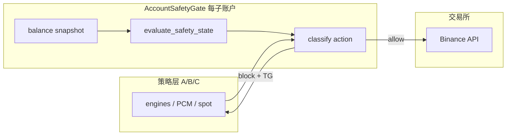
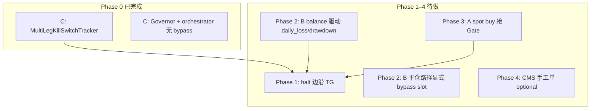

# 账户级 Safety Gate 设计（宪法 kill-switch 统一执行边界）

> **状态**：设计稿 · C 层 Phase 0 已落地（`MultiLegKillSwitchTracker`），TG / B / A 待接  
> **相关**：[constitution.yaml](../../live/highcap/config/constitution/constitution.yaml) · [20260616 事故复盘](live_stream/20260616_late_fill_infinite_loop_postmortem_CN.md) · [multi_leg_live_daemon.md](live_stream/multi_leg_live_daemon.md) · [abc_execution_layer_issues_CN.md](abc_execution_layer_issues_CN.md)

---

## 1. 背景

2026-06-16 multi-leg 事故表明：**策略 bug 可以每分钟 churn 数百次**，而宪法 Layer 0（`daily_loss_limit` / `max_dd`）在 C 层 live **当时未接线**，361 笔 `place` 几乎未被拦截。

用户诉求（产品行为，已确认合理）：

1. **发现异常 → 推 Telegram**
2. **禁止开新仓 / 增风险**
3. **允许减仓 / 撤单 / 降风险**

本文定义如何在 **A / B / C 三条实盘路径** 上统一实现，而不在「每个 Binance API」散点重复检查。

---

## 2. 设计原则

### 2.1 不在「所有仓位 API」检查

| 做法 | 问题 |
|------|------|
| 在 `BinanceAPI.place_order` / `get_positions` 等处处 if-check | 重复、易漏（follow-up / reconcile / CMS 手工单）、读操作被误伤 |

### 2.2 在「增风险执行路径」统一 Gate

**每个独立子账户**（B trend、C multi-leg、A spot）一个 **AccountSafetyGate** 实例：

- 从 **交易所 balance** 更新 equity / peak / 日周月 anchor
- 调用现有 [`evaluate_safety_state()`](../../src/time_series_model/core/constitution/safety_runtime.py)（与 B 层 `enforce_before_order` 同源）
- 对 **即将执行的写操作** 做 **动作分类**，而非对 HTTP 层拦截



### 2.3 Circuit breaker 语义（halt 三件套）

| halt 期间 | 行为 |
|-----------|------|
| 增风险 | **拒绝**（place、加仓、新 segment、新 `place_protection`） |
| 降风险 | **放行**（`market_exit`、reduce-only、`cancel`、撤 orphan） |
| 只读 | **放行**（sync positions、对账、audit、CMS 查询） |

与 Jun 16 教训一致：**只禁开、不禁平**，否则无法收尾，也无法降低 churn 后的敞口。

---

## 3. 宪法约束来源

顶层 [`kill_switch`](../../live/highcap/config/constitution/constitution.yaml) 为 **Layer 0 账户级硬停**（非 B 专用）：

| 字段 | 默认 | 含义 |
|------|------|------|
| `daily_loss_limit` | 0.06 | 当日相对 day-start equity 亏损 ≥ 6% → halt |
| `weekly_loss_limit` | 0.08 | 当周 |
| `monthly_loss_limit` | 0.12 | 当月 |
| `max_dd` | 0.20 | 相对 session peak 回撤 > 20% → halt |
| `cooldown_minutes` | 720 | halt 后冷却 |
| `daily_reset_timezone` | UTC | 日界 |

C 层另有 `multi_leg.account.max_drawdown_pct`；**有效 max_dd = min(kill_switch.max_dd, multi_leg.account.max_drawdown_pct)**（与 backtest `resolve_multileg_sim_limits` 一致）。

---

## 4. 动作分类表

### 4.1 C 层 multi-leg（`Action` dict）

| `action` | halt 时 | 说明 |
|----------|---------|------|
| `place` | block | 新开/加仓挂单 |
| `place_protection` | block | 新挂 SL/TP（防 orphan 循环） |
| `market_exit` | allow | 市价减仓 |
| `cancel` | allow | 撤挂单 |
| `cancel_protection` | allow | 撤保护单 |

**必须经 Gate 的路径**（曾出现 bypass）：

- `MultiLegPortfolioRiskGovernor.check_actions`
- `MultiLegLiveOrchestrator` follow-up（`pop_pending_actions`）
- reconcile 的 `actions_ensure_protection` / orphan `cancel`

### 4.2 B 层 PCM / trend（`TradeIntent` → `TradeExecutor`）

| 操作 | halt 时 | 接入点 |
|------|---------|--------|
| 新开仓 / 加仓 | block | 现有 `enforce_before_order()` 前 |
| SL/TP 保护单（新开） | block | `place_order` 保护腿前 |
| 平仓 / 减仓 | allow | 不经过 slot 预留 |
| 移动止损（缩风险） | allow | 单独白名单（若实现） |

**缺口**：`daily_loss` / `drawdown` 需从 **真实 balance** 计算，不能长期依赖 `features.get(..., 0)`。

### 4.3 A 层 spot（`run_spot_accum_live`）

| 操作 | halt 时 | 说明 |
|------|---------|--------|
| 新 deploy buy | block | 接 Gate + 现有日限 |
| 卖 / reduce | allow | 降 spot 敞口 |

---

## 5. AccountSafetyGate 抽象（目标形态）

C 层已实现的 [`MultiLegKillSwitchTracker`](../../src/order_management/multi_leg_kill_switch.py) 为 **C 专用 Phase 0**。后续可提炼为通用模块（命名待定，如 `src/time_series_model/live/account_safety_gate.py`）：

```python
# 目标 API（示意）
class AccountSafetyGate:
    scope: str                    # "multi_leg" | "trend_pcm" | "spot"
    config: KillSwitchConfig      # from constitution.yaml
    state_path: Path              # JSON 或 safety_state DB

    def update_from_equity(self, equity: float, *, now: datetime) -> None: ...
    def is_halted(self) -> bool: ...
    def halt_reasons(self) -> list[str]: ...

    def blocks_action(self, kind: str) -> Optional[str]: ...  # reason or None
    def on_halt_transition(self, *, entering: bool) -> None:  # → TG
```

**持久化**：halt 状态必须 **跨进程重启保留**（C：`{state_dir}/kill_switch_state.json`；B：已有 `safety_state.persist_to` SQLite）。

**更新频率**：每次 **增风险动作 batch** 前至少更新一次 equity（C 已在 Governor 内 `begin_batch` + snapshot）。

**配置字段 vs 运行时**：`MultiLegKillSwitchConfig` 会加载 `max_turnover_mean` / `max_cost_mean`，但 `update_from_equity()` 向 `evaluate_safety_state()` 传入 `None`——与 §8 一致，turnover/cost **刻意 offline**，非 bug。

---

## 6. Telegram 通知

复用 [`src/monitoring/telegram.py`](../../src/monitoring/telegram.py) 的 `send_telegram_message`，与 account-watch / Grafana 共用 bot。

### 6.1 触发时机（边沿，非每 bar）

| 事件 | 推送 |
|------|------|
| `halted: false → true` | HALT 告警 |
| `halted: true → false`（cooldown + 指标恢复） | RESUME 可选 |

### 6.2 消息模板（示例）

```
🛑 [C/multi-leg] Safety HALT
reasons: daily_loss_limit
equity: 9300 USDT  day_loss: -7.0%  drawdown: -7.0%
effect: new entries blocked; exits/cancels allowed
```

### 6.3 防刷屏

- `stamp_key=f"kill_switch:{scope}"`
- `cooldown_sec=300`（可 env 覆盖）
- 同一 reason 不重复 push，除非 **新一轮 halt**（日切换后再次触发 daily_loss 可再推）

### 6.4 与 account-watch 分工

| 组件 | 职责 |
|------|------|
| account-watch | equity 大幅波动、**新持仓出现**（运营感知） |
| Safety Gate TG | **宪法违规**、halt 状态（风控强制） |

---

## 7. 分系统现状与路线图

### 7.1 Phase 表（交付批次编号）

Phase 编号仅表示**文档交付批次**，与下方 rollout 优先级是两条线，勿混读。



| Phase | 状态 | 范围 | 交付 |
|-------|------|------|------|
| **0** | ✅ 已落地 | C multi-leg | 见 §7.2 |
| **1** | ⏳ 待做 | TG | Gate `on_halt_enter/exit` → `send_telegram_message`；**C 先接**（改动小） |
| **2** | ⏳ 待做 | B PCM/trend | `TradeExecutor` 前统一 balance 更新；修复 metrics 默认 0 |
| **3** | ⏳ 待做 | A spot | `run_spot_accum_live` 买入口 Gate |
| **4** | ⏳ 可选 | CMS + refactor | 手工单走 Gate；提炼通用 `AccountSafetyGate` 模块 |

### 7.2 Phase 0 已交付（C 层）

| 项 | 说明 |
|----|------|
| Tracker | `MultiLegKillSwitchTracker`：peak / 日周月 anchor、`evaluate_safety_state()`、JSON 持久化 |
| Governor | `blocks_action("place" \| "place_protection")`；`cancel` / `market_exit` / `cancel_protection` 早放行 |
| Orchestrator | follow-up、`reconcile` 的 `place_protection` / orphan `cancel` 均经 `_execute_via_governor`（无 bypass） |
| 启动 | `run_multi_leg_live.py`：constitution → 共享 tracker → 各 leg Governor；**testnet/mainnet** 启动时 seed equity |
| 单测 | 6 项（`pytest … -k kill_switch`）：tracker×4、governor×1、orchestrator follow-up×1 |

**Phase 0 刻意未做**：halt 边沿 TG（Phase 1）、turnover/cost runtime（§8）、B/A/CMS Gate。

**运行限制**：

- **`shadow` / 无 `account_snapshot_provider`**：`run_multi_leg_live.py` 仅在 testnet/mainnet 注册 balance provider；shadow 下 tracker **不会从交易所更新 equity**，halt 逻辑基本不生效（除非 persistence 里已是 halted，或测试手动 `update_from_equity`）。
- **双重 drawdown 检查**：kill-switch halt 与 Governor 对 `place` 的 `max_drawdown_pct` 略冗余，行为一致、无害。

### 7.3 推荐 rollout 顺序（业务优先级）

与 Phase 编号**独立**——按「下一刀改什么」排序：

| 顺序 | 项 | 理由 |
|------|-----|------|
| 1 | **Phase 1：C halt TG** | C Gate 已就绪，只差边沿通知；成本低、Jun 16 类事故可即时告警 |
| 2 | **Phase 2：B balance 驱动** | 事故当时 B 层 `daily_loss` 仍可能为 features 默认 0；C 已补，B 为最大剩余宪法缺口 |
| 3 | **Phase 3：A spot buy** | 敞口较小，排在 B 之后 |
| 4 | Phase 4 CMS / refactor | 可选 |

---

## 8. 非目标

- 不在 `BinanceAPI` 底层包装所有 REST 调用
- 不在 halt 时 block `market_exit` / `cancel`（违反 circuit breaker）
- 不在本设计内实现 turnover/cost runtime（宪法 `max_turnover_mean` 仍 offline）
- 不合并 B/C **子账户** equity（各 Gate 独立；若需「全仓」halt 需另设聚合层）

---

## 9. 验收标准

| 场景 | Phase | 预期 | 状态 |
|------|-------|------|------|
| 日亏 ≥ `daily_loss_limit` | 0 | 新 `place` rejected；`market_exit` 成功 | ✅ C |
| 峰值回撤 ≥ `max_dd` | 0 | 同上 | ✅ C |
| 进程重启 | 0 | halt 状态仍有效（读 persistence） | ✅ C |
| follow-up `place_protection` | 0 | 经 Governor，halt 时不执行 | ✅ C |
| reconcile `place_protection` | 0 | 同上（代码已接；单测可补） | ✅ 代码 / ⏳ 单测 |
| halt 触发 | 1 | TG 一条（5min 内不重复） | ⏳ |
| B 层开仓 | 2 | `enforce_before_order` 使用非零 daily_loss（balance 驱动） | ⏳ |
| A spot 新 buy | 3 | Gate block | ⏳ |

单测（Phase 0，6 项）：

```bash
pytest tests/order_management/test_multi_leg_kill_switch.py \
  tests/order_management/test_multi_leg_risk_governor.py \
  tests/order_management/test_multi_leg_orchestrator.py -k kill_switch -q
```

---

## 10. 参考实现索引

| 组件 | 路径 |
|------|------|
| C Gate | [`multi_leg_kill_switch.py`](../../src/order_management/multi_leg_kill_switch.py) |
| C Governor | [`multi_leg_risk_governor.py`](../../src/order_management/multi_leg_risk_governor.py) |
| C 启动接线 | [`scripts/run_multi_leg_live.py`](../../scripts/run_multi_leg_live.py) |
| B 宪法 enforcement | [`enforcement.py`](../../src/time_series_model/live/enforcement.py) |
| 安全状态评估 | [`safety_runtime.py`](../../src/time_series_model/core/constitution/safety_runtime.py) |
| TG 发送 | [`telegram.py`](../../src/monitoring/telegram.py) |
| C backtest 对齐 | [`backtest_multileg_timeline.py`](../../scripts/backtest_multileg_timeline.py) L451–470 |

---

## 11. 变更记录

| 日期 | 说明 |
|------|------|
| 2026-06-16 | 初稿：统一 Gate 设计；C Phase 0 已实现；B/A/TG 路线图 |
| 2026-06-16 | 修订 §7：拆分 Phase 表 vs rollout 顺序；补 Phase 0 范围、shadow 限制、验收状态列； turnover 配置说明 |
| 2026-06-16 | §12：Jun 16 回归测试矩阵 + CI `safety-regression-tests` 门禁 |

---

## 12. Jun 16 回归测试矩阵（部署前必跑）

> **事故复盘**：[20260616_late_fill_infinite_loop_postmortem_CN.md](live_stream/20260616_late_fill_infinite_loop_postmortem_CN.md)（§1–7 late-fill churn；§8 重启清库/CMS）

CI 在 **build / deploy 之前** 跑 `safety-regression-tests` job（见 `.github/workflows/deploy.yml`）。本地等价：

```bash
make test-live-safety
# 或
PYTHONPATH=src:scripts pytest tests/order_management/test_live_safety_regressions.py \
  tests/order_management/test_multi_leg_kill_switch.py \
  tests/order_management/test_multi_leg_risk_governor.py \
  tests/order_management/test_multi_leg_orchestrator.py -k kill_switch \
  tests/business_console/test_multileg_position_truth.py \
  tests/unit/test_dual_add_trend_live_engine.py -k "late_fill or ensure_protection or winding_down" \
  tests/unit/test_segment_lifecycle.py -k "late_fill or winding_down" -q
```

| 事故类 | 症状 | 回归测试（mock，无需交易所） | 文件 |
|--------|------|------------------------------|------|
| **Late-fill 无限循环** | 1h 内 300+ 开平、本金 -87% | winding_down 不挂 SL/TP；只 market_exit | `test_dual_add_trend_live_engine.py`, `test_segment_lifecycle.py` |
| **宪法未接线** | 日亏 -87% 仍 place | halt 后 block `place` / allow `market_exit` | `test_multi_leg_kill_switch.py`, `test_multi_leg_orchestrator.py -k kill_switch` |
| **重启清库** | CMS 空、交易所有仓 | `close_absent([])` no-op；sync 前不调 close_absent | `test_live_safety_regressions.py` |
| **CMS leg_id 错位** | trend_scalp 未平不显示 | `_fill{N}` 匹配 + closed 行 ghost | `test_multileg_position_truth.py`, `test_multileg_leg_pnl.py` |

**为何用 mock**：上述路径均可在内存 SQLite + `MagicMock` adapter 下验证，**无需 mainnet 密钥**；速度快、可进 CI。集成/E2E（真实 user-stream）仍属 Phase 5 观察项，不阻塞 deploy。

**不纳入本矩阵**：turnover/cost runtime（§8 非目标）、B 层 balance 驱动 daily_loss（Phase 2 待做）。
