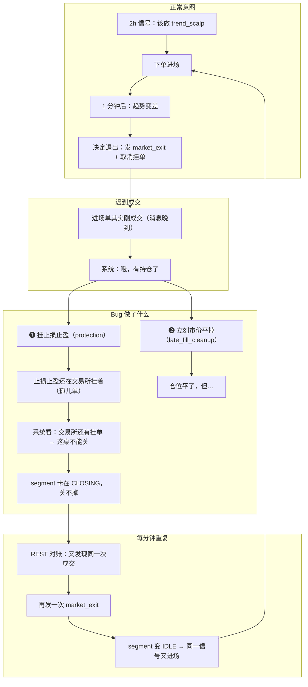
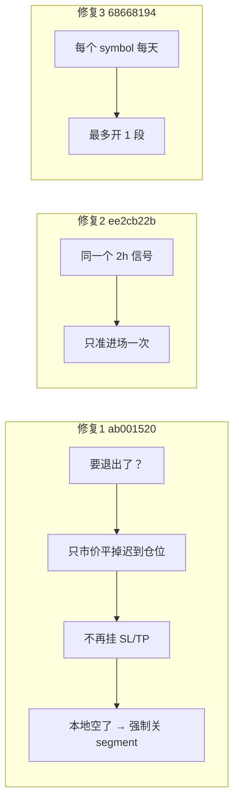
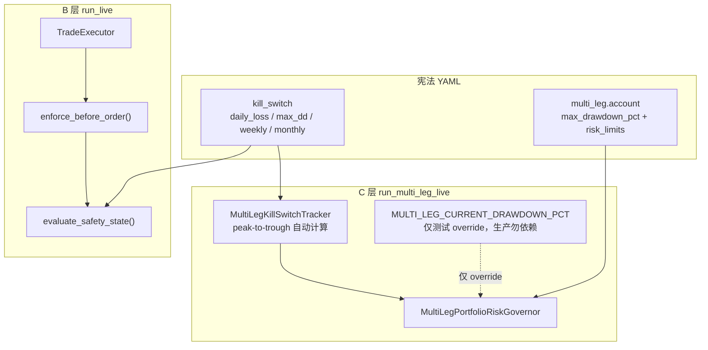

# Late-fill 无限循环事故复盘（2026-06-16）

> **范围**：C 层 multi-leg（`trend_scalp` / `chop_grid`）· 独立子账户  
> **相关**：[multi_leg_live_daemon.md](multi_leg_live_daemon.md) · [segment-lifecycle.md](../segment-lifecycle.md) · [abc_execution_layer_issues_CN.md](../abc_execution_layer_issues_CN.md)

---

## 1. 发生了什么

约 1 小时内，`trend_scalp` 在 **1 分钟 execution bar** 上产生数百次 `place` / `market_exit`（审计约 **361 place / 304 market_exit**）。本金从约 **12000 USDT** 跌至约 **1500 USDT**，主因是 **手续费 + 滑点 + 反复开平**，而非异常费率。

---

## 2. Late-fill 无限循环（通俗版）

### 2.1 用餐厅比喻

1. 你点了外卖（**进场单**）
2. 你改主意不要了，跟店员说取消（**regime_exit / 平仓**）
3. 厨房其实**已经做好**了，只是通知晚到（**late fill**）
4. **Bug 版**的处理：**既给这份外卖上保险（SL/TP），又立刻扔掉（market_exit）**
5. 保险单（SL/TP）还挂在柜台没收（**孤儿挂单**）
6. 系统看柜台还有单 → 以为「这桌还没清完」→ **不能关桌（segment 卡在 CLOSING）**
7. 每过一分钟，REST 对账又问：「那份迟到的外卖处理了吗？」→ **再扔一次**
8. 桌位被误判为空 → **又点一份新的**（同一 2h 信号 + 1min bar 无 dedup）

一小时下来：**扔了 300 多次、又点了 300 多次** → 本金被磨光。

### 2.2 流程图（Bug 版本，`bcd90ed5` 引入）



### 2.3 三个放大器

| 因素                            | 说明                                               |
| ------------------------------- | -------------------------------------------------- |
| **1min execution bar**          | `on_bar` 每分钟触发一次，不是每 2h 一次            |
| **无信号去重**（fix 前）        | 同一 `_signal_timestamp` 每分钟可 `_start_segment` |
| **无日 segment 上限**（fix 前） | 同日可无限开新 segment                             |

### 2.4 修复栈（2026-06-16）

| Commit     | 作用                                                                                                         |
| ---------- | ------------------------------------------------------------------------------------------------------------ |
| `ab001520` | winding_down 时 **只** market_exit，不挂 SL/TP；CLOSING 空态强制 deactivate；archived order 防 backfill 重放 |
| `ee2cb22b` | 同一 2h 信号只允许一次 entry/reseed（`last_entry_signal_ts`）                                                |
| `68668194` | `max_segment_starts_per_symbol_per_day: 1`（live + backtest）                                                |
| `7c718914` | `--no-orders` 观察模式                                                                                       |



**回归引入 commit**：`bcd90ed5`（2026-06-14）— late fill 无条件 queue protection + market_exit。

---

## 3. 为什么宪法没有拦住开新仓？（事故当时）

> **2026-06-16 后续修复**：C 层 live 已接入 `MultiLegKillSwitchTracker`（[`multi_leg_kill_switch.py`](../../../src/order_management/multi_leg_kill_switch.py)），设计见 [account_safety_gate_CN.md](../account_safety_gate_CN.md)。

用户直觉：本金已从 12000 跌到 1500（约 **-87%**），`constitution.yaml` 里 `daily_loss_limit: 0.06`、`max_dd: 0.20` 理应 halt。

**事故当时结论：C 层 multi-leg 实盘路径没有接入顶层 kill-switch。**

### 3.1 A / B / C 三条执行路径对比（修复前 / 现况）

| 系统              | 入口                            | 宪法 kill-switch | 事故当时                 | 现况（C 层）                               |
| ----------------- | ------------------------------- | ---------------- | ------------------------ | ------------------------------------------ |
| **A** spot        | `run_spot_accum_live.py`        | 部分             | SQLite 日限              | 不变                                       |
| **B** PCM / trend | `run_live.py` → `TradeExecutor` | **是**           | `enforce_before_order()` | 不变                                       |
| **C** multi-leg   | `run_multi_leg_live.py`         | **当时否**       | 仅杠杆/名义              | **`MultiLegKillSwitchTracker` + Governor** |

B 层在 `TradeExecutor` 下单前调用：

```python
# src/order_management/trade_executor.py
enforce_before_order(..., daily_loss=..., drawdown=...)
```

C 层 **从未调用** `enforce_before_order`。`MultiLegLiveOrchestrator` 只走 `MultiLegPortfolioRiskGovernor.check_actions()`。

### 3.2 C 层 Governor 实际检查什么

实现：`src/order_management/multi_leg_risk_governor.py`

| 检查项                                     | 对新 `place` 生效？          | 事故中是否触发                                     |
| ------------------------------------------ | ---------------------------- | -------------------------------------------------- |
| `max_gross/net_notional`（pct × equity）   | 是                           | 否 — equity 下降后 cap 同比例缩小，单笔 leg 仍 fit |
| `account_risk_limits`（杠杆 / 保证金占比） | 是                           | 否 — churn 时净敞口低，1500U 仍可容纳 1～2 leg     |
| `max_drawdown_pct`（multi_leg.account）    | **仅当 `drawdown_pct` 有值** | **否 — 见下**                                      |
| `kill_switch.daily_loss_limit`             | **未接入**                   | **否**                                             |
| `kill_switch.max_dd`                       | **未接入**                   | **否**                                             |

**`cancel` / `market_exit` / `cancel_protection` 始终放行**（设计为降风险动作）。事故中大量 churn 正是 `place` + `market_exit` 两类动作。

### 3.3 回撤 guard 为何形同虚设（事故当时，已修复）

> **现况**：`MultiLegKillSwitchTracker` 每次 governor check 自动从 exchange balance 计算 peak-to-trough 回撤，不再依赖 env var。`MULTI_LEG_CURRENT_DRAWDOWN_PCT` 仅保留为测试 override。

`run_multi_leg_live.py` 传入的 `drawdown_pct_provider` **只读环境变量**：

```python
def _drawdown_pct_from_env() -> float | None:
    raw = os.getenv("MULTI_LEG_CURRENT_DRAWDOWN_PCT", "")
    ...
```

- 未设置 `MULTI_LEG_CURRENT_DRAWDOWN_PCT` → 返回 `None`
- Governor 中 `drawdown_pct is None` → **跳过 max_drawdown 检查**

宪法 YAML 虽写了 `multi_leg.account.max_drawdown_pct: 0.20`，但 **没有代码从 peak equity 自动计算当前回撤并喂给 Governor**。除非运维/external 进程写 env，否则 **20% 回撤 halt 在 C 层 live 不生效**。

### 3.4 顶层 kill_switch 注释 vs reality（事故当时）

> **现况**：`daily_loss_limit` 已通过 `MultiLegKillSwitchConfig.from_constitution_yaml()` 加载到 C 层 live。`resolve_multileg_sim_limits()` 仍仅用于离线 replay。

`constitution.yaml` 第 26–33 行已写明：

> Currently only **max_dd** is enforced at runtime … Live usage: **`enforce_before_order()`**

该路径 **仅 B 层** 使用。C 层 `resolve_multileg_sim_limits()` 里的 `daily_loss_limit_pct` 只用于 **离线 replay / backtest**，不进 live daemon。

### 3.5 为何「本金少了 87%」仍可能 `place`

1. **没有 daily loss halt**（已修复） — 事故时 C 层无 daily loss 检查；现由 `MultiLegKillSwitchTracker` 拦截 `place` / `place_protection`  
2. **equity 同步只在启动时**（已部分修复） — `_sync_multi_leg_sizing_equity()` 在 `build_daemon` 启动跑一次；kill-switch 现在每次 governor check 自动从 exchange 拉 equity 更新锚点，但 **sizing 用的 equity 仍只在启动时同步**  
3. **单笔 leg 随 equity 缩小** — `segment_dd_target` 按百分比 sizing，小账户仍下得出 min lot  
4. **Bug 主导的是 churn，不是 oversized 单笔** — 宪法设计防的是「单笔过大 / 杠杆爆表」，不是「每分钟平开 300 次」

### 3.6 架构示意：宪法两条线

> **事故当时**：C 层 kill-switch 未接线（虚线）；**现况**：已接入（实线）。



---

## 4. 待办（建议）

| 优先级 | 项                       | 说明                                                                                                        |
| ------ | ------------------------ | ----------------------------------------------------------------------------------------------------------- |
| ~~P0~~ | ~~C 层接入 kill-switch~~ | **已完成**：`MultiLegKillSwitchTracker` + Governor + orchestrator follow-up / reconcile protection 走风控   |
| P1     | C halt TG                | Phase 1：`on_halt_enter/exit` → Telegram（见 [account_safety_gate_CN.md](../account_safety_gate_CN.md) §6） |
| ~~P0~~ | ~~去掉 env 依赖~~        | **已完成**：peak-to-trough 自动计算；`MULTI_LEG_CURRENT_DRAWDOWN_PCT` 仅测试 override                       |
| P1     | 日 cap 持久化            | `MultiLegConcurrencyGate._daily_starts` 写 SQLite，防 restart bypass                                        |
| P1     | chop_grid late fill      | 对齐 trend 的 winding_down guard（`_ingest_late_entry_fill`）                                               |
| P2     | runtime turnover cap     | 宪法 `max_turnover_mean` 目前 offline only                                                                  |

---

## 5. 验证清单（deploy 后）

1. 服务器代码 ≥ `ab001520` + `ee2cb22b` + `68668194`  
2. `multi_leg_audit.log`：`place` / `market_exit` 速率正常（无 segment 时不应 burst）  
3. 可选：`--no-orders` smoke 后再恢复下单  
4. 检查 `{state_dir}/kill_switch_state.json` 存在且有非零 `peak_equity`；audit 中出现 `kill-switch` / `RiskRejection` 日志  
5. **勿设置** `MULTI_LEG_CURRENT_DRAWDOWN_PCT` 环境变量（生产由 kill-switch 自动计算，env 仅测试 override）

---

## 6. 相关 commit

| Hash       | 说明                                            |
| ---------- | ----------------------------------------------- |
| `bcd90ed5` | 引入 late-fill 回归                             |
| `ab001520` | 断环（late fill + deactivate + archived order） |
| `ee2cb22b` | 2h 信号 dedup                                   |
| `68668194` | 日 segment cap                                  |
| `8196c03d` | monitoring TG cooldown 小修                     |

---

## 7. 生产数据库量化分析（2026-06-16 00:22 UTC 查询）

> 数据来源：`data/multi_leg_order_management.db` 中 `local_order_id LIKE '%late_fill_cleanup%'` 的全部 `closed` 订单。

### 7.1 汇总

| 指标                  | 值                             |
| --------------------- | ------------------------------ |
| **总订单数**          | **682**                        |
| **总名义价值**        | **$6,507,790**                 |
| **估计手续费 @0.04%** | **~$2,603**                    |
| **估计手续费 @0.05%** | **~$3,254**                    |
| **受影响 symbol 数**  | 5                              |
| **受影响 segment 数** | **5**（每个 symbol 恰好 1 个） |

### 7.2 按 symbol 分解

| Symbol  | 清理次数 | 总数量      | 最低卖出价 | 最高卖出价 | 均价    | 名义价值 (USDT) |
| ------- | -------- | ----------- | ---------- | ---------- | ------- | --------------- |
| BTCUSDT | 205      | 29.285 BTC  | $66,135    | $67,240    | $66,878 | $1,958,265      |
| ETHUSDT | 186      | 973.33 ETH  | $1,775     | $1,847     | $1,829  | $1,779,377      |
| SOLUSDT | 172      | 22,006 SOL  | $73.47     | $75.95     | $74.82  | $1,645,574      |
| XRPUSDT | 106      | 772,338 XRP | $1.25      | $1.29      | $1.27   | $983,693        |
| BNBUSDT | 13       | 223.64 BNB  | $626.70    | $632.25    | $629.94 | $140,880        |

### 7.3 关键观察

1. **仅 5 个 segment** 贡献了全部 682 条订单 — 每个 symbol 恰 1 个 segment
2. **价格波动极小**（BTC 仅 $1,100 = 1.6%），说明是**短时间内密集执行**，不是跨日波动
3. **commission = 0** — `late_fill_cleanup` 走的是内部标记，手续费可能记在 entry 的 `market_exit` 对手侧
4. **207 entry vs 682 cleanup = 3.3×** — 每笔 entry 平均被清理 3.3 次
5. **BNB 仅 13 次**（最少）— 该 segment 可能因新代码部署而提前终止

### 7.4 部署验证（2026-06-16 00:22 UTC）

部署 commit `8196c03d` 后：

| 验证项                                | 结果                                         |
| ------------------------------------- | -------------------------------------------- |
| 新 `late_fill_cleanup` 订单（部署后） | **0** ✅                                      |
| BTCUSDT segment `active`              | **false** ✅                                  |
| BTCUSDT segment `state`               | **"idle"** ✅                                 |
| `pending_orders` / `inventory`        | **[]** / **[]** ✅                            |
| 容器状态                              | `running`, `restarts=0`, `OOMKilled=false` ✅ |

**结论**：三重修复（断环 + 信号 dedup + 日 cap）生效，无限循环已停止，卡住的 segment 已自动清理。
