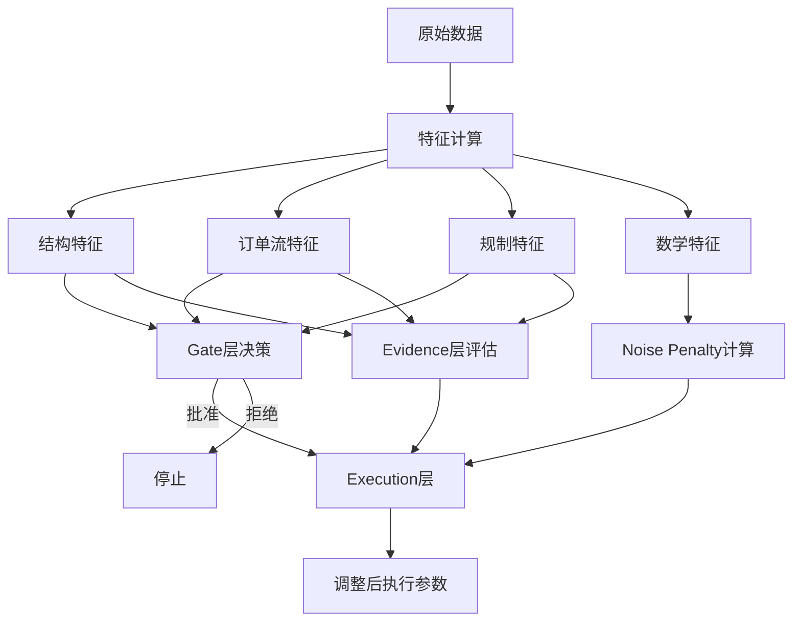

# 路径2.5：数学特征分层使用架构

## 概述

路径2.5架构定义了数学特征（Hurst/WPT/Spectrum/Hilbert）在交易系统的分层使用规范，确保这些特征仅用于执行层的风险调整，而不影响决策层，从而避免数据泄露问题。

## 分层架构规范

### 1. Gate层
- **✅ 允许使用**：结构特征、订单流特征、规制特征
- **❌ 禁止使用**：任何数学特征（Hurst/WPT/Spectrum/Hilbert）
- **目的**：避免数学特征将failure压到0，防止过拟合

### 2. Evidence层
- **✅ 允许使用**：结构特征、订单流特征、规制特征
- **❌ 禁止使用**：execution_noise_penalty或原始数学特征
- **目的**：保持纯粹的alpha质量评估，仅评估"是否值得交易"

### 3. Execution层
- **✅ 必须使用**：evidence_score（来自Evidence层）和noise_penalty（独立计算）
- **✅ 动态调整**：sl_r、tp_r、size_multiplier等参数
- **目的**：根据市场噪声调整"如何执行"，不影响"是否执行"

## 核心组件

### ExecutionNoisePenalty
- **位置**：`src/time_series_model/execution/noise_penalty.py`
- **功能**：基于数学特征计算连续的噪声惩罚因子
- **范围**：[0, 0.8]（永远不会达到1，避免完全阻断）
- **权重分配**：WPT(0.35) + Spectrum(0.30) + Hilbert(0.20) + Hurst(0.15)，体现功能分工
- **EVT处理**：采用“保险丝”机制，极端情况下额外增加惩罚

### ExecutionController
- **位置**：`src/time_series_model/execution/execution_controller.py`
- **功能**：整合evidence_score和noise_penalty，输出调整后的执行参数

### BPCEvidenceCalculator
- **位置**：`src/time_series_model/evidence/bpc_evidence_calculator.py`
- **功能**：仅基于结构/订单流特征计算证据分数

## 配置文件

### BPC特征配置
- **位置**：`config/strategies/bpc/features.yaml`
- **特点**：不包含任何数学特征，仅包含结构/订单流/规制特征

### BPC执行层配置
- **位置**：`config/execution/bpc_execution_tiers.yaml`
- **特点**：包含noise_penalty配置和执行档位定义

## 数据流示例

## 关键原则

1. **噪声惩罚仅影响"怎么做"**：调整SL/TP/Size等参数
2. **噪声惩罚不影响"做不做"**：不参与Gate/Evidence决策
3. **Evidence保持纯粹性**：仅评估alpha质量
4. **防止数据泄露**：数学特征不参与训练决策

## 实现类

- `BPCStrategyV2`：完整实现路径2.5架构的策略类
- `ExecutionNoisePenalty`：噪声惩罚计算
- `TierSelector`：档位选择器
- `BPCEvidenceCalculator`：证据分数计算

## 验证要点

1. Gate层不使用数学特征
2. Evidence层不使用数学特征
3. Execution层同时消费evidence_score和noise_penalty
4. 噪声惩罚值在[0, 0.8]区间内
5. 系统能正常处理交易决策和参数调整