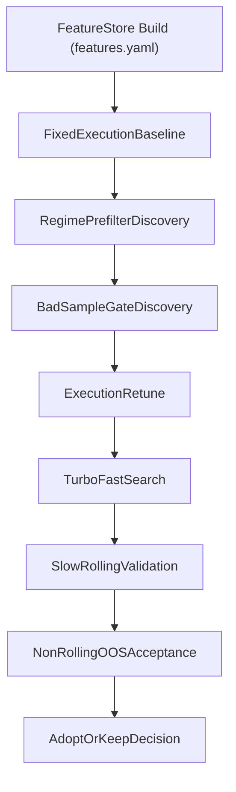

# Multi-Leg Research Pipeline Design

## Scope

This document defines a strengthened research pipeline for multi-leg strategies,
focused on:

- `chop_grid`
- `dual_add_trend`

The goal is to align feature discovery, regime rules, gating, and execution
retuning under one reproducible loop, while avoiding unnecessary complexity from
single-position pipelines.

## Why This Design

Single-position trend strategies (such as BPC) can separate:

- setup filtering (`prefilter`),
- model/direction logic,
- additional risk denial (`gate`),
- execution optimization.

Multi-leg strategies have path-dependent inventory dynamics. Segment outcomes are
highly sensitive to spacing, inventory caps, forced exits, and fees. Because of
that, feature discovery must be anchored to a fixed execution baseline first.

## Pipeline Contract

All stages must use the same feature surface:

1. `features.yaml` declares materialized feature nodes.
2. FeatureStore build materializes the features.
3. Selector/regime/gate scans consume those FeatureStore columns.
4. Multi-leg backtest/replay consumes the same FeatureStore-backed dataframe.
5. Slow/non-rolling OOS validates the final stack.

If FeatureStore is built but backtest uses an OHLCV-only dataframe, rule scans can
appear to fail (all masks false) due to missing columns rather than true feature
ineffectiveness.

## End-to-End Flow

## Layer Responsibilities

### Fixed execution baseline (first)

Purpose: provide a stable objective surface for regime and gate discovery.

- `chop_grid`: wide and conservative grid defaults (spacing, levels, risk caps).
- `dual_add_trend`: trend inventory defaults from
  `archetypes/execution.yaml` (add spacing, basket TP, exposure limits, flip).

### Regime/prefilter discovery

Purpose: define where the strategy is structurally eligible.

- `chop_grid`: chop/range eligibility and mean-reversion context.
- `dual_add_trend`: trend continuation eligibility and anti-chop constraints.

### Bad-sample gate discovery

Purpose: deny entries in states that still pass regime filters but are
execution-hostile.

- Expansion/ignition persistence traps.
- High forced-exit propensity states.
- Cost-coverage hostile states.

### Execution retune (after regime/gate)

Purpose: optimize execution knobs once regime and gate are stabilized.

- Grid spacing, levels, max inventory, stop semantics for `chop_grid`.
- Add spacing, basket TP, gross/net caps, flip behavior for `dual_add_trend`.

## Strategy-Specific Design

### `chop_grid`

- Baseline execution: fixed wide grid.
- Prefilter candidates: semantic chop, WPT compression/ignition, Hurst, Hilbert.
- Gate candidates: expansion and persistence risk, bad cost-coverage states.
- Retune only after prefilter and gate are stable.

### `dual_add_trend`

- Baseline execution: existing trend inventory semantics from
  `config/strategies/dual_add_trend/archetypes/execution.yaml`.
- Prefilter candidates: trend confidence, low chop, non-box continuation context.
- Gate candidates: trend-like but unstable/high-friction states.
- Retune after prefilter and gate freeze.

## Statistical and Model Policy

Do not copy all BPC fallback methods by default.

BPC currently includes fallback scoring methods such as:

- `distribution_ks`
- `mean_effect`
- `tail_bad_rate_ratio`
- `upside_positive_rate_ratio`

(see `config/strategies/bpc/research/research_roll.features_on.yaml`)

For multi-leg, default to:

1. Primary: direct multi-leg replay score (segment/trade/cost/drawdown objective).
2. Optional diagnostics: one or two statistical methods for explainability.

This reduces method over-selection risk and keeps optimization tied to
multi-leg objectives.

## Optional Eligibility Model (Not First Step)

Only consider modelization if rule scans show signal but single-rule performance
is insufficient.

Design principles:

- Segment-level labels bound to a fixed execution policy.
- Prefer continuous `quality_score` before hard binary labels.
- Export transparent rules or one score threshold first.
- Avoid immediate black-box live routing.

## Stage Mapping

CLI / `--profile` stems match packaged filenames under `research/` (no turbo/slow short keys):

- `calibrate_roll.default`: fast threshold/rule exploration (`rolling.mode: turbo_fixed_features` when configured).
- `research_roll.features_on`: rolling stability and heavier feature cadence (`rolling.mode: slow_realistic`).
- `validate_static.*`: full-window static OOS acceptance (`rolling.mode: non_rolling`).

Multi-leg does not require vector backtest, but replay/backtest must remain
FeatureStore-backed.

## Current Evidence Snapshot

Recent `chop_grid` non-rolling run:

- Run root:
  `results/chop_grid/validate_static.full_study/_rolling_sim/20260510_203804`
- Full-month replay completed over 27 months.
- FeatureStore-backed replay was active: monthly `metrics.json` files record
  `feature_store_dir`, `feature_store_layer`, and `feature_store_timeframe`.
- `stitched_total_r` was negative in this run, so no adoption conclusion is implied.
- No `multileg_feature_selection.json` was produced in this non-rolling run shape,
  so this run validates FS-backed execution continuity, not feature-selection winner
  selection.

## Review Result And Next Step

Decision from the reviewed non-rolling output:

- Treat this run as execution-path validation only.
- Do not infer prefilter winner features from this artifact.
- Next comparison step should run selector-producing shape (`calibrate_roll.default` or
  selector-enabled `research_roll.features_on`) and then inspect generated
  `multileg_feature_selection*.json` artifacts before adoption.

## Recommended Defaults (First Iteration)

1. Keep fixed execution baseline conservative and explicit.
2. Keep multi-leg selector config-driven (`features_prefilter.yaml` +
   `semantic_polarity.yaml` + dependency outputs).
3. Use replay score as primary optimizer objective.
4. Limit auxiliary statistical methods to diagnostics.
5. Promote only after `research_roll.features_on` + static `validate_static` consistency checks.

## Non-Goals (Current Iteration)

- Replacing BPC statistical pipeline design.
- Building eligibility-model training code now.
- Migrating multi-leg to single-position event/vector backtest shape.
- Auto-adopting based on one non-rolling run.
