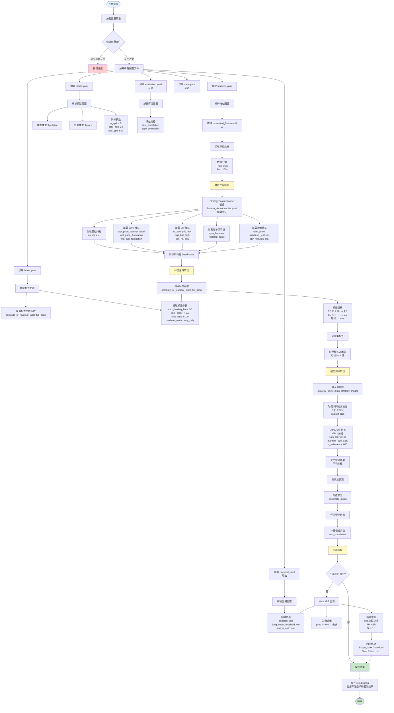

# SR Reversal Long 配置处理流程图

## 配置文件结构

```
config/strategies/sr_reversal_long/
├── features.yaml      # 必需：特征工程配置
├── labels.yaml        # 必需：标签生成配置
├── model.yaml         # 必需：模型训练配置
├── backtest.yaml      # 可选：回测配置
├── evaluation.yaml    # 可选：评估指标配置
└── meta.yaml          # 可选：元数据配置
```

## 完整处理流程



## 配置处理详细说明

### 1. 配置加载阶段 (`StrategyConfigLoader`)

**必需文件：**
- `features.yaml`: 定义特征工程管道
- `labels.yaml`: 定义标签生成逻辑
- `model.yaml`: 定义模型训练参数

**可选文件：**
- `backtest.yaml`: 定义回测参数
- `evaluation.yaml`: 定义评估指标
- `meta.yaml`: 策略元数据

### 2. 特征工程阶段 (`StrategyFeatureLoader`)

**处理流程：**
1. 读取 `features.yaml` 中的 `requested_features` 列表
2. 根据 `feature_dependencies.yaml` 解析特征依赖关系
3. 按依赖顺序加载特征：
   - 基础特征（无依赖）：`atr`, `rsi`
   - WPT 特征：`wpt_price_reconstructed`, `wpt_price_fluctuation`
   - SR 特征（依赖 WPT）：`sr_strength_max`, `sqs_hal_high`
   - 订单流特征：`vpin_features`, `footprint_basic`
   - 其他高级特征：`hurst_price`, `spectrum_features`, `dtw_features`

### 3. 标签生成阶段

**处理流程：**
1. 从 `labels.yaml` 读取标签生成函数路径
2. 动态导入函数：`compute_sr_reversal_label_full_scan`
3. 传递参数：
   - `max_holding_bars: 50`
   - `take_profit_r: 2.0`
   - `stop_loss_r: 1.0`
   - `combine_mode: long_only`
4. 应用标签过滤器（过滤 NaN）

### 4. 模型训练阶段 (`strategy_trainer.train_strategy_model`)

**处理流程：**
1. 从 `model.yaml` 读取训练参数
2. 执行时间序列交叉验证（TSCV）：
   - `n_splits: 5`
   - `tscv_gap: 24` (防止数据泄露)
3. 训练 LightGBM 模型：
   - GPU 加速
   - 超参数从 `model.yaml` 读取
4. 返回交叉验证平均指标

### 5. 评估阶段

**处理流程：**
1. 在测试集上生成预测
2. 从 `evaluation.yaml` 读取评估指标配置
3. 计算指标（如 `test_correlation`）
4. 输出评估结果

### 6. 回测阶段 (`VectorBTBacktest`)

**处理流程：**
1. 从 `backtest.yaml` 读取回测参数
2. 根据预测概率生成交易信号：
   - `pred >= 0.6` → 做多
   - `pred <= 0.45` → 平仓
3. 执行 RR 止盈止损逻辑：
   - 入场价格：`open` (下一根 K 线)
   - 止盈：`+2R` (基于 ATR)
   - 止损：`-1R` (基于 ATR)
   - 最大持仓：50 bars
4. 计算回测统计指标

### 7. 结果保存

**保存内容：**
- 策略名称
- 模型类型和任务类型
- 交叉验证平均指标
- 特征数量
- 训练/测试样本数
- 评估指标结果
- 回测统计结果

## 关键配置映射

| 配置文件 | 关键配置项 | 处理位置 |
|---------|----------|---------|
| `features.yaml` | `requested_features` | `StrategyFeatureLoader.load_features_from_requested()` |
| `labels.yaml` | `label_generator` | `import_callable()` → `compute_sr_reversal_label_full_scan()` |
| `model.yaml` | `trainer.params` | `strategy_trainer.train_strategy_model()` |
| `backtest.yaml` | `backtest.params` | `VectorBTBacktest.run()` |
| `evaluation.yaml` | `evaluation.metrics` | `evaluate_predictions()` |

## 数据流

```
原始数据 (df_raw)
    ↓
特征工程 (StrategyFeatureLoader)
    ↓
特征 DataFrame (df_train_features, df_test_features)
    ↓
标签生成 (compute_sr_reversal_label_full_scan)
    ↓
带标签的 DataFrame
    ↓
模型训练 (train_strategy_model)
    ↓
模型预测 (preds)
    ↓
评估 (evaluate_predictions)
    ↓
回测 (VectorBTBacktest)
    ↓
结果保存 (results.json)
```

