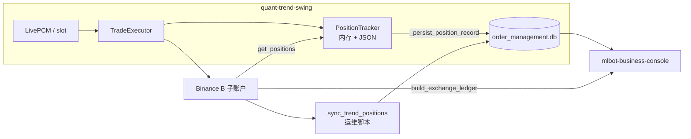
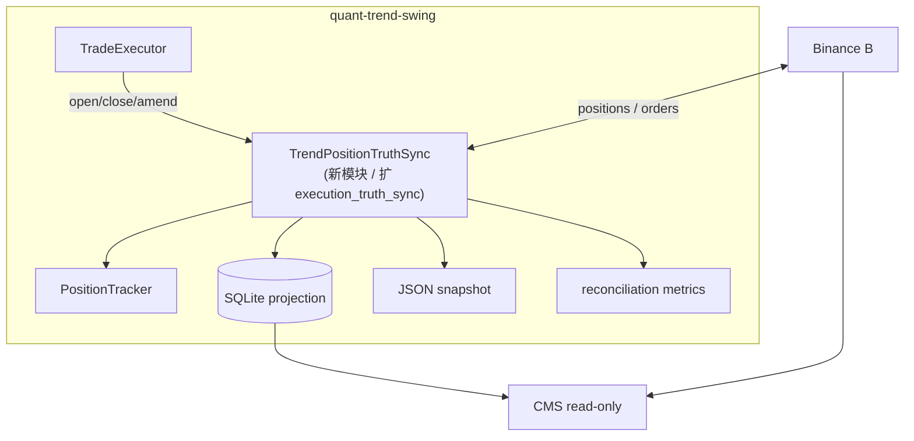
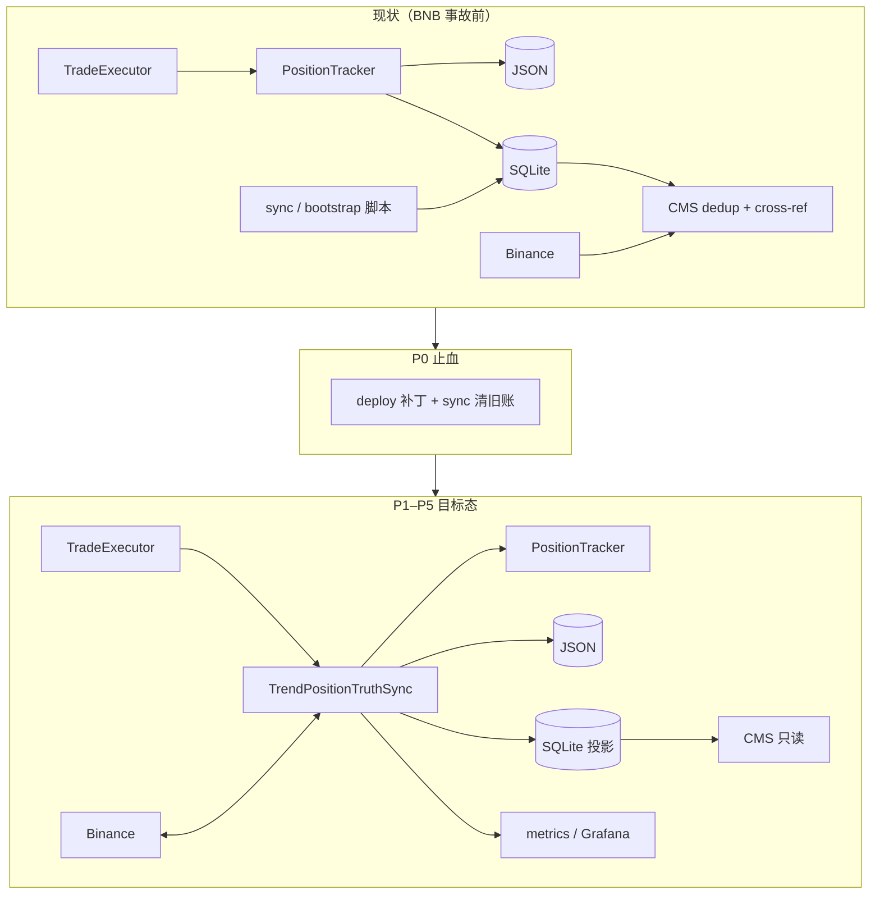
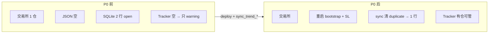
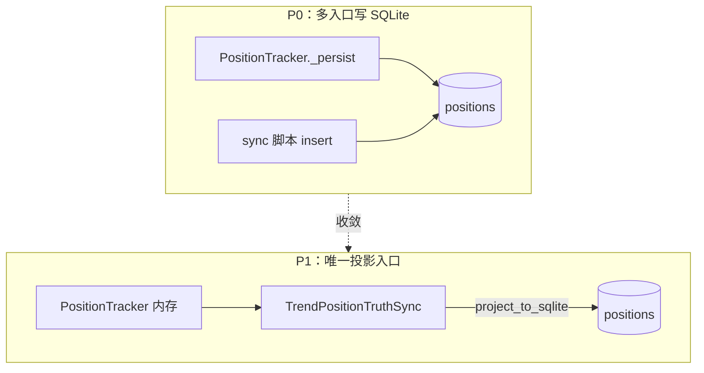
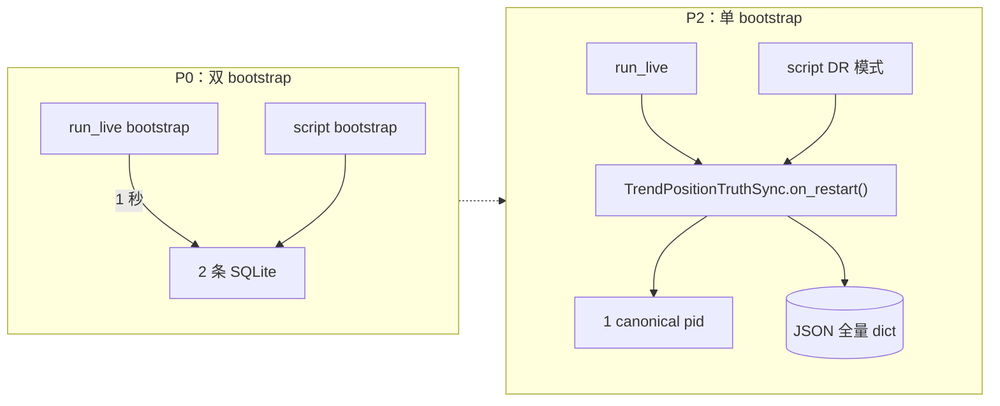
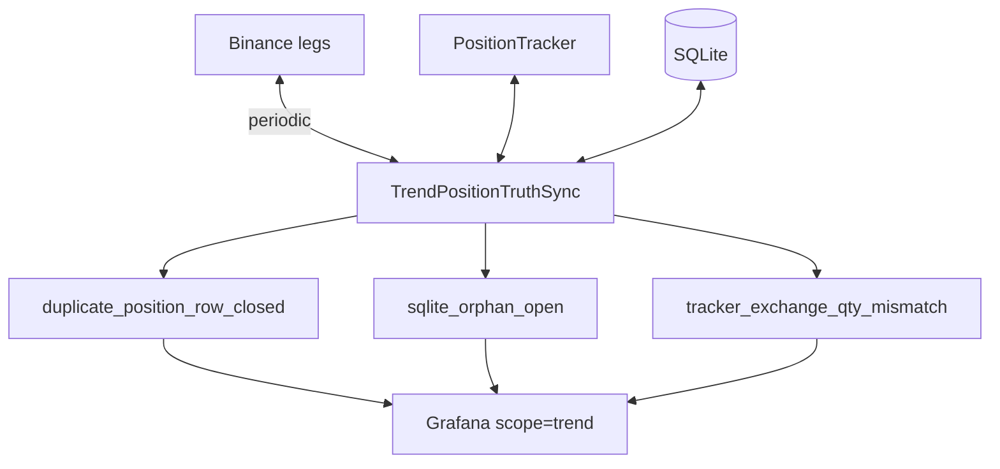
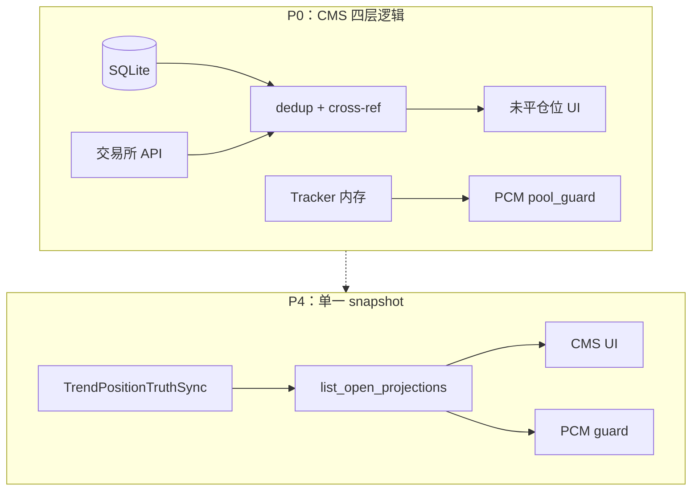
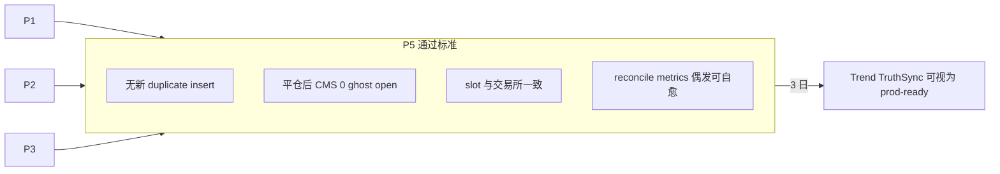
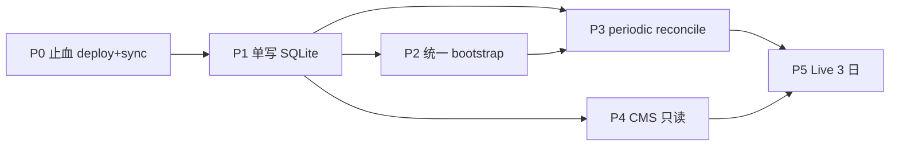

# B 层 Trend 持仓状态：现状、2026-06 事故与 TruthSync 改进设计

> 日期：2026-06-14  
> 范围：**B·Trend**（`quant-trend-swing` / TPC 等单腿 trend）的持仓状态、CMS 展示与交易所一致性  
> 状态：**补丁已合入工作区（待 deploy）** · **统一 TruthSync 设计为提案（未实现）**  
> 相关：[abc_execution_layer_issues_CN.md](abc_execution_layer_issues_CN.md)（ExecutionTruthSync 总账 · C 层为主） · [segment-lifecycle.md](segment-lifecycle.md)（C multileg 段生命周期） · [backtest_vs_live_execution.md](backtest_vs_live_execution.md)

**分工**：本文 **不** 重复 C 层 `MultiLegReconciler` / ghost segment 专题；专注 **Trend 路径上「三份状态拷贝」** 为何复杂、BNB 事故根因、以及如何把 B 层纳入与 C 层同级的 truth sync 契约。

---

## 1. 这块是什么模块？是对账吗？

**不完全是「对账模块」。** 实际是 **6 个组件叠在同一事故面上**（执行 / 账本 / 生命周期 / 展示 / 运维修账 / C 层 reconcile）：

| 模块 | 路径 | 职责 | 是否「对账」 |
| ---- | ---- | ---- | ------------ |
| **PositionTracker** | `src/order_management/position_tracker.py` | 实盘运行时：SL / trailing / 软件平仓；进程内内存 + JSON 快照 | ❌ 执行引擎 |
| **Order SQLite** | `data/order_management.db` + `Storage` | 订单与 `positions` 表；CMS、统计、回合 PnL | ⚠️ 账本镜像，非实时决策主脑 |
| **run_live 恢复** | `scripts/run_live.py` | 重启：`restore_from_disk` → 缺失则 bootstrap | ❌ 生命周期 |
| **CMS 展示** | `mlbot_console` · `open_positions_list.py` | 未平仓位表；可读库 + 拉交易所 cross-ref | ❌ 只读展示 |
| **运维 sync 脚本** | `scripts/sync_trend_positions_from_exchange.py` | 以交易所为准修 SQLite（及可选 JSON） | ✅ **狭义对账 / 修账** |
| **C 层 reconcile** | `multi_leg_daemon` · `execution_truth_sync.py` | chop/grid 订单与段状态 | ✅ 对账，**Trend 长期未对齐此体系** |

Trend 的 **正常开仓** 走 `TradeExecutor` → `PositionTracker.add()` → 同时写 JSON + SQLite。  
**对账脚本** 仅在 drift 或运维时使用，设计上 **不能** 替代 live 开仓路径（脚本 header 已写明）。

---

## 2. 数据流：为何看起来绕



**同一条持仓最多三份（+ CMS 第四层逻辑）**：

| 拷贝 | 存储 | 存什么 | 权威级别 |
| ---- | ---- | ------ | -------- |
| **交易所** | Binance API | 真实仓位、保证金 | **资金真相** |
| **JSON** | `live/.../position_tracker/{SYMBOL}.json` | `build_position_dict` 全量：trailing、HWM、breakeven | **软件出场状态真相** |
| **SQLite** | `positions` 表 | entry、qty、SL/TP 字段、status | **CMS / 统计镜像** |
| **CMS 聚合** | API 层 | 读 SQLite + 交易所校验 + dedup | **展示视图**（不应成为第四份写入源） |

正常路径三份一致；**接缝处各自演进** 时就会分叉。

---

## 3. 2026-06 BNB 事故摘要（prod 调查）

| 观察 | 结论 |
| ---- | ---- |
| CMS 显示 BNB 两条 / 保证金 ~0% | 交易所仅 **1× long 0.31**；0% 是维持保证金/权益 ≈0.015% 四舍五入 |
| SQLite 两条 open | `exchange_sync_*` 与 `bootstrap_*`，**02:21:53–54 各 insert 1 秒** |
| 无 TPC 开仓订单记录 | 仓位来自 **镜像脚本**，非 `TradeExecutor` 正常链路 |
| `BNBUSDT.json` 为空 | 重启后 `restore_from_disk()` → 0 条；原仅 warning |
| 6/12 平仓被拒 | SL `-2021`；市价 `-4136`（Hedge + `closePosition`） |
| B 账户 Hedge Mode | TPC 期望 One-way；加剧平仓与 id 混乱 |

**根因链（分层）**：

1. **执行层**：JSON 快照丢失 → PositionTracker 空 → 软件 SL/trailing 不在管  
2. **账本层**：双 bootstrap 入口 → SQLite duplicate  
3. **接缝层**：merge 写 SQLite 用 canonical id，内存仍用 `bootstrap_*` → 平完后 ghost open（**已在补丁中修 canonical pid**）  
4. **账户层**：Hedge Mode 与 TPC 平仓语义不匹配（**未在本轮补丁解决**）

---

## 4. 是设计有问题吗？为何这么复杂？

### 4.1 合理意图

- **JSON 存完整 dict**：重启需恢复 trailing / HWM，不能只有 qty。  
- **SQLite 给 CMS**：console 进程独立，查库 + 交易所校验。  
- **运维 sync**：灾难恢复与 reporting drift，不抢 live 写路径。

### 4.2 设计债（导致 BNB 类事故）

| 问题 | 后果 |
| ---- | ---- |
| **三份状态无单一 owner** | merge / 谁为准 散落在 PT、脚本、CMS |
| **两套 bootstrap**（`run_live` 内 + 独立 script） | 1 秒内 duplicate 行 |
| **Trend 对账弱于 C** | C 有 periodic reconcile + metrics；B 长期靠脚本 + 人工 |
| **CMS 第四层 dedup** | 症状治疗；源头的 duplicate 仍在 SQLite |
| **Slot 与 SQLite 脱钩** | PCM 读内存 tracker；ghost SQLite **通常不挡新开**，但 CMS/人工误判 |

> **一句话**：复杂不在 TPC 策略，而在 **执行（stateful）+ 报表（SQLite）+ 重启（JSON）+ 交易所** 四套模型 **接缝未产品化**；C 层已走 TruthSync 路线图，B 层滞后。

---

## 5. 2026-06-14 已落地补丁（工作区 · 待 deploy）

| 问题 | 修复 |
| ---- | ---- |
| JSON 空 → 只 warning | `run_live._bootstrap_missing_position_trackers()` |
| bootstrap 无 SL | 保守 1% ATR · 1.5R stop / 3R target |
| SQLite 再增 duplicate | `_persist_position_record` merge 同 symbol+side |
| pid 不一致 → 平完 ghost open | `_rekey_in_memory` + `_storage_position_id` |
| CMS 同 symbol 双行 | `open_positions_list` dedup |
| 单测 | `test_position_tracker` · `test_open_positions_list` |

**Deploy 后仍需运维一次**：`sync_trend_positions_from_exchange.py`（非 dry-run）清理 **已有** duplicate 行；rebuild `quant-trend-swing` + `mlbot-business-console`。

**Hedge -4136 最小防护已纳入 P0**；bootstrap 与 `build_position_dict`+`execution.yaml` 完全等价、Trend 纳入 periodic reconcile metrics 仍待解决。

---

## 6. 改进设计：TrendPositionTruthSync（提案）

> 目标：在 **不新增 systemd 进程** 前提下，让 B 层与 [abc_execution_layer_issues_CN.md §3–4](abc_execution_layer_issues_CN.md) 的 **ExecutionTruthSync** 契约对齐——**单账户、单写路径、交易所终态裁决**。

### 6.1 设计原则

1. **Exchange wins on conflict**（资金与 flat/non-flat）  
2. **JSON wins on software exit state**（trailing、HWM）— 仅当 exchange 确认该 symbol+side 仍有仓  
3. **SQLite is a projection** — 只由 TruthSync 写入，CMS 只读  
4. **One bootstrap implementation** — 删除「脚本一套、run_live 另一套」  
5. **Reconcile is periodic + on lifecycle** — 对齐 C：`startup` · `post-fill` · `every N min`

### 6.2 目标架构



**TrendPositionTruthSync** 对外 API（草案）：

```python
# 候选：src/order_management/trend_position_truth_sync.py
# 或扩展 execution_truth_sync.py + trend 专用 adapter

class TrendPositionTruthSync:
    def on_entry_filled(self, *, position_id, pos_dict, exchange_leg) -> None: ...
    def on_exit_filled(self, *, position_id, reason, exchange_leg) -> None: ...
    def on_restart(self, *, tracker, storage, api) -> ReconcileReport: ...
    def periodic_reconcile(self, *, tracker, storage, api) -> ReconcileReport: ...
    def project_to_sqlite(self, tracker) -> None: ...  # 唯一 SQLite 写入口
```

**禁止**：CMS、`sync_trend_positions_from_exchange.py`（除 DR 模式）、bootstrap 脚本 **直接** `storage.create_position`。

### 6.3 统一 Bootstrap（合并 run_live + script）

| 现状 | 目标 |
| ---- | ---- |
| `bootstrap_from_exchange_position` 保守 ATR | 共享 `bootstrap_position_from_exchange()`：读 TPC `execution.yaml` → `build_position_dict`；无 yaml 时 fallback 保守默认 |
| 脚本 `sync_trend_*` 独立 insert | 脚本仅调用 `TrendPositionTruthSync.on_restart(dry_run=...)` |
| 两个 pid 前缀 `exchange_sync_*` / `bootstrap_*` | **单一规则**：`{BASE}:live_{uuid}`；历史 id 仅 merge 映射 |

### 6.4 CMS 简化

- **未平仓位 API**：优先 `TruthSync.list_open_projections()`（内存 tracker ∪ SQLite 投影，**已 canonical**）  
- 交易所 cross-ref 保留为 **校验/降级**，非第二套 dedup 业务逻辑  
- KPI「未平仓位数」与 PCM `trend_pool_guard` 共用同一 snapshot 函数（`run_live` 已有 `_open_trend_positions_snapshot_from_manager`，扩展为 TruthSync 输出）

### 6.5 Reconcile 节奏（对齐 C）

| 触发 | 动作 |
| ---- | ---- |
| `run_live` startup | `on_restart`：restore JSON → 缺则 bootstrap → merge SQLite → 释放 stale constitution slot |
| 每 5–15 min | `periodic_reconcile`：exchange legs vs tracker vs SQLite；metrics |
| fill / user-stream | `on_entry_filled` / `on_exit_filled` |
| 人工 DR | `sync_trend_positions_from_exchange.py --disaster-recovery` 仅调 `on_restart(force_exchange=True)` |

**Metrics**（复用 `mlbot_reconciliation_issue_total` scope=`trend`）：

- `duplicate_position_row_closed`  
- `bootstrap_from_exchange`  
- `tracker_exchange_qty_mismatch`  
- `sqlite_orphan_open`（exchange flat，SQLite open）

### 6.6 账户与平仓策略

| 项 | 建议 |
| ---- | ---- |
| B·Trend 子账户 | **One-way**（文档 + deploy checklist 强制） |
| 平仓 | 统一 `reduceOnly` + qty + `positionSide`（Hedge 下）；禁止 `closePosition` MARKET（`-4136`） |
| 检测 | startup 读 `/fapi/v1/positionSide/dual` → Hedge 时 warning + CMS 告警 |
| 平仓代码路径 | 检测到 Hedge 模式时，MARKET 平仓用 `reduceOnly+qty`，**禁止** `closePosition=True`（`-4136` 防护；P0） |

### 6.7 分阶段实施

| Phase | 内容 | 工作量 | 依赖 |
| ----- | ---- | ------ | ---- |
| **P0** | deploy 当前补丁 + prod `sync_trend_*` 清账；Hedge 最小防护（`order_manager`：`reduceOnly+qty`，禁 MARKET+`closePosition`）；**保留** CMS dedup（删除门禁见 P4） | 0.5d 运维 + 0.5d 开发 | 无 |
| **P1** | 抽 `TrendPositionTruthSync.project_to_sqlite()`；PT 所有 `_persist_position_record` 改走 helper | 1–2d | P0 |
| **P2** | 合并 bootstrap 实现；废弃脚本内 duplicate insert | 1d | P1 |
| **P3** | 扩展 `RECONCILIATION_ISSUE_BUCKETS`（§10.2）；periodic position reconcile + Grafana（scope=trend） | 1d | P1 · [abc Phase 3](abc_execution_layer_issues_CN.md) |
| **P4** | CMS 只读 projection API；**保留** CMS dedup 直至 P1 为唯一 SQLite 写入口且 P3 连续 3 日 Live 无 `duplicate_position_row_closed > 0`，再删 dedup | 0.5d | P1 + P3 |
| **P5** | Live 观察 3 日：无 duplicate insert、无 ghost open after close | — | P1–P3 |

Phase 各阶段加强点与依赖图见 **§11**。

**明确不做（本设计）**：

- 不新增 systemd 第四进程  
- 不跨 A/B/C 中央 sync 服务  
- 不把 trailing 状态塞进 SQLite 替代 JSON（JSON 仍保 software exit state）

---

## 7. 与 ExecutionTruthSync 的关系

| 概念 | 关系 |
| ---- | ---- |
| [abc_execution_layer_issues_CN.md](abc_execution_layer_issues_CN.md) `ExecutionTruthSync` | 单账户 metrics + reconcile 命名 **母契约** |
| **TrendPositionTruthSync**（本文） | B 层 **持仓 + JSON + SQLite 投影** 的专用实现 |
| C `MultiLegReconciler` | 多腿段状态；**不合并**进 Trend sync，只共享 metrics bucket 常量 |

ABC 分账户 **不能替代** truth sync；B 层物理子账户落地后，**每个 Trend 账户仍需要** 本文 P1–P3。

**共账户约束（问题 6）**：highcap prod 上 B·Trend 与 C 通常为**不同子账户**；若部署配置为 **B·Trend 与 C·Hedge 共用同一物理子账户**，则 `periodic_reconcile` 须在对应进程内串联执行，避免重复修同一 symbol+side。

---

## 8. 验收标准（改进完成后）

| 场景 | 通过标准 |
| ---- | -------- |
| 正常 TPC 开仓 | 1 个 canonical pid；JSON + SQLite + exchange 一致 |
| 进程重启 | `on_restart` 恢复 trailing；无 duplicate SQLite |
| 软件平仓成功 | SQLite 0 open；CMS 0 行；constitution slot 释放 |
| 交易所 SL 成交 | `close_from_exchange`；同上 |
| 人工误跑旧 sync 脚本 | idempotent；metrics `duplicate_position_row_closed` 可选 >0，最终 stable |
| Hedge 账户 | `order_manager` 检测到 Hedge 模式时，平仓用 `reduceOnly+qty`；startup 告警；不静默 `-4136` |

---

## 9. 参考代码索引

| 文件 | 说明 |
| ---- | ---- |
| `src/order_management/position_tracker.py` | PositionTracker · bootstrap · canonical pid |
| `scripts/run_live.py` | `_restore_position_trackers_from_disk` · `_bootstrap_missing_position_trackers` |
| `scripts/sync_trend_positions_from_exchange.py` | 运维修账（待收敛为 DR 入口） |
| `scripts/bootstrap_position_tracker_from_exchange.py` | 完整 build_position_dict bootstrap（待合并） |
| `src/mlbot_console/services/open_positions_list.py` | CMS 未平仓位 |
| `src/order_management/execution_truth_sync.py` | 现有 metrics helper（C/trend backfill） |

---

## 10. 设计评审（2026-06-14 对照代码验证）

对照代码验证后，发现 6 个需修正/补充的问题 + 2 个需修改的设计点。同时保存了 P0–P5 递进路线图（mermaid 图已验证准确）。

### 10.1 6 个需修正/补充的问题（按紧迫程度排序）

| # | 问题 | 紧迫程度 | 建议 |
| -- | --- | --- | --- |
| **4** | Hedge `-4136` 缺最小防护 | 🔴 **最紧迫** | **P0 代码**：`order_manager` / 平仓路径检测 Hedge；MARKET 平仓用 `reduceOnly + qty`；审查仍带 `closePosition=True` 的 SL 挂单路径。startup warning **不能**替代代码防护 |
| **3** | CMS dedup 删除时序依赖缺失 | ⚠️ **P0 必守** | **P0 保留** CMS dedup（补丁已加）。**P4 才删**：当 P1 为唯一 SQLite 写入口（含 DR）且 P3 连续 3 日 Live 无 `duplicate_position_row_closed > 0` |
| **1** | 两套 bootstrap 合并低估了差异 | 中等 · **P2** | 优先 `build_position_dict`（有 `execution.yaml`）；否则 fallback 保守默认（1% ATR · 1.5R stop）。差异见下表 |
| **2** | pid 前缀 `live_{uuid}` 迁移成本被低估 | 中等 · **P2** | 新开仓用新前缀；已有行保留原 pid，不强制 rename |
| **5** | `periodic_reconcile` 与 `backfill` 节奏不一致 | 中等 · **P3** | helper 内 60s dedup window；或 periodic 只做 position cross-check（只报 metrics），订单 drift 仍交 `terminal_order_backfill` |
| **6** | B/C 共账户时 reconcile 路径重叠 | 低 | 见 §7 共账户约束（prod 通常分户；配置共户时须串联） |

#### 问题 1：`run_live` 补丁 vs 独立 bootstrap 脚本

| 维度 | `run_live` 补丁 | 独立脚本 |
| ---- | --------------- | -------- |
| 位置字典构建 | 手写 `pos = {...}` 硬编码 | `build_position_dict(intent, ...)` — 完整 execution profile |
| SL/TP 计算 | `entry * 0.01 * 1.5R` 纯算术 | `rr_constraints_from_exec_params` → 从 yaml 生成 |
| entry_time | `datetime.now()` | `_entry_time_from_trades()` — 查交易所最近成交 |
| 写入目标 | 内存 tracker + SQLite | JSON 文件（不写 SQLite） |

### 10.2 2 个需修改的设计点

1. **`sync_trend_positions_from_exchange.py` 收敛路径**（P2 设计 / P1 起文档化）：脚本含 mark price、PnL 计算、resize 等 TruthSync API 未覆盖能力。须在 P2 明确：

   | 能力 | 归属 |
   | ---- | ---- |
   | insert / merge / close duplicate rows | `TrendPositionTruthSync.on_restart()` |
   | mark price、realized PnL 回填 | DR 入口保留，或 P2 迁入 `on_restart` |
   | `--write-json` bootstrap | 调用统一 `bootstrap_position_from_exchange()` |

2. **`RECONCILIATION_ISSUE_BUCKETS` 缺 bucket**（**P3 首步**，改 `execution_truth_sync.py`）：至少补 `bootstrap_from_exchange`、`duplicate_position_row_closed`、`sqlite_orphan_open`；否则 §6.5 metrics 无法进 Grafana allowlist。bucket 扩展作为 P3 第一个 commit 完成，然后再做 periodic reconcile。

### 10.3 优先级与 Phase 映射

| Phase | 必做项 |
| ----- | ------ |
| **P0** | 问题 **4**（Hedge 代码防护）+ deploy/sync 清账；问题 **3** → **保留** CMS dedup（不写「P0 删除 dedup」） |
| **P1** | 单写 SQLite（`project_to_sqlite`） |
| **P2** | 问题 **1**、**2**；设计点 **1**（sync 脚本收敛） |
| **P3** | 问题 **5**；设计点 **2**（扩展 buckets）+ periodic reconcile |
| **P4** | 问题 **3** 删除 CMS dedup（满足门禁后） |
| **P5** | Live 验收 |

---

## 11. Phase 递进路线图（先止血 → 单写路径 → 统一恢复 → 自动对账 → 展示收口 → Live 验收）

P0–P5 是一条「先止血 → 单写路径 → 统一恢复 → 自动对账 → 展示收口 → Live 验收」的递进路线。下面用图说明各阶段**加强了什么**。

### 11.1 总览：从「三份各写各的」到「TruthSync 单入口」



### 11.2 各 Phase 加强点

#### P0 — 运维止血 + 最小代码防护（不引入 TruthSync 模块）

**加强**：现有补丁上线 + 清 prod 旧 duplicate；重启能认领、有 SL、平完不 ghost；Hedge 平仓路径最小防护；**保留** CMS dedup。


| 加强项 | 说明 |
|--------|------|
| 重启认领 | 不再「有仓只打 log」 |
| 保守 SL | 能 enforce / 挂交易所 stop |
| canonical pid | 平完 SQLite 不 ghost open |
| 清旧账 | 运维 sync，不是代码自动 retroactive |
| Hedge 防护 | MARKET 平仓不走 `closePosition`（问题 4） |
| CMS dedup | **保留**（问题 3；P4 才评估删除） |

#### P1 — 单写 SQLite（架构第一道关）

**加强**: **所有** SQLite 写入经 `TrendPositionTruthSync.project_to_sqlite()`, 消灭「PT 写一处、脚本写一处、CMS 逻辑再猜」。



| 加强项 | 说明 |
|--------|------|
| 写路径单一 | 新 duplicate 难再出现 |
| owner 明确 | SQLite = 投影，不是第二套执行状态 |

#### P2 — 统一 Bootstrap（重启/DR 一条链）

**加强**: `run_live` 与 `sync_trend_*` **共用** `on_restart()` + `build_position_dict`; pid 规则统一为 `{BASE}:live_*`.



| 加强项 | 说明 |
|--------|------|
| 1% ATR 保守默认 → 可选完整 execution.yaml | 恢复质量接近正常开仓 |
| 脚本降级为 DR | 日常不再手跑 insert |

#### P3 — 周期性对账（对齐 C 层）

**加强**: 从「出事才 sync」 → startup + 每 5–15min + fill 事件 自动 reconcile + Grafana.



| 加强项 | 说明 |
|--------|------|
| 漂移可见 | metrics 告警，不用靠 CMS 肉眼 |
| 与 C 同级节奏 | B 不再「对账弱一档」 |

#### P4 — CMS 只读投影（展示层收口）

**加强**: CMS **不再**自己做 dedup/第二套真相; 读 `list_open_projections()`, 与 PCM slot 快照同源。**删除 CMS 侧 dedup 的前置条件**：P1 成为唯一 SQLite 写入口，且 P3 连续 3 日 Live 无 `duplicate_position_row_closed > 0`（见 §6.7 P4）。



| 加强项 | 说明 |
|--------|------|
| 展示 = 执行 | 「CMS 2 行、PCM 1 仓」类分裂减少 |
| 复杂度下移 | UI 层变薄 |

#### P5 — Live 验收（证明加强有效）

**加强**: 不是新代码,而是 **3 个交易日观察** P1–P3 是否达标.



### 11.3 依赖关系



### 11.4 一张表汇总

| Phase | 一句话 | 主要加强 |
|-------|--------|----------|
| **P0** | 止血 + 最小防护 | 补丁 + sync 清账 + Hedge；**保留** CMS dedup |
| **P1** | 写 | SQLite **唯一写入口** |
| **P2** | 恢复 | **一条** bootstrap / restart / DR |
| **P3** | 查 | 扩展 metrics buckets + **自动** periodic reconcile |
| **P4** | 看 | CMS/PCM **同一 snapshot**；门禁通过后删 dedup |
| **P5** | 证 | Live 证明无 duplicate、无 ghost、slot 一致 |

> **P0 解决「现在会出事」; P1–P2 解决「为什么会 duplicate」; P3 解决「drift 何时被发现」; P4 解决「为什么 UI 这么复杂」; P5 解决「能不能放心关掉人工 sync」。**

---

## 12. 变更记录

| 日期 | 说明 |
| ---- | ---- |
| 2026-06-14 | 初版：BNB prod 调查结论 + 补丁清单 + TrendPositionTruthSync 提案 |
| 2026-06-14 | Review 6 个问题 + P0–P5 递进路线图（mermaid） |
| 2026-06-14 | 文档修订：§10.3 优先级与 P0/P4 对齐；拆嵌套表；§6.7/§7/§11 P0 表述 |
