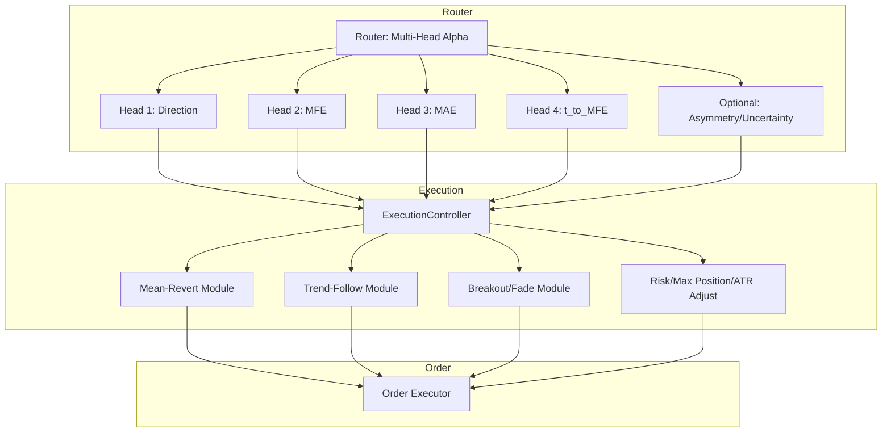

### NN 多头路径原语（Path Primitives）+ Router 解耦升级（生产级定稿）

本文档总结一次完整的“研究系统 → 生产系统”的 NN 多头升级设计：**模型输出市场未来路径的通用原语（path primitives）**，策略只在 Router 层解释与决策，从而实现**可复用、可监控、可扩展、抗 regime shift**。

---

### 1. 目标与非目标

- **目标**
  - **统一底座**：一个 MLP multi-head 学习未来路径原语，可被 SR 反转 / SR 突破 / 压缩突破 / 趋势等多个 Router 复用。
  - **策略解耦**：模型不拟合具体策略“是否赚钱”，只描述未来路径；策略逻辑（gating / 阈值 / 仓位 / 风控 / 退出）集中在 Router。
  - **可诊断**：除了 PnL 以外，能用 rolling/conditional 指标定位是 head 退化还是 Router 假设失效。
  - **可扩展**：新增策略优先“加 Router”，不需要推翻底座；必要时只增量训练 head 或做轻量校准。

- **非目标**
  - 不在模型里输出 “reversal_head / breakout_head / trend_head” 这类**策略语义 head**（会把 policy 写死，难扩展）。
  - 不直接把 “PnL / Sharpe / win_rate” 当作 head 监督目标（强策略依赖、非平稳、难泛化）。

---

### 2. 代码组织建议（不改 `time_series_model` 大目录）

仓库现状 `src/time_series_model/` 已覆盖训练/回测/实盘/诊断全链路，重命名为 `tree_time_series_model` 的性价比很低（引用与路径连锁改动大）。

推荐按 **model family** 增量扩展：

- **`src/time_series_model/models/nn/`**：放 multi-head MLP、loss、dataset、导出/加载
- **`src/time_series_model/models/tree/`**：逐步把 LightGBM/XGB trainer 归拢（可选）
- Router/策略继续沿用现有 `src/time_series_model/strategies/*` 与 `config/strategies/*`

---

### 2.1 Qlib vs 本架构：研究框架（实验平台） vs 交易决策系统（生产系统）

一句话定性：

> **Qlib 更像“量化实验室/研究平台”（Research Framework）**  
> **本架构更像“交易操作系统/决策系统”（Trading Decision System）**

这意味着：

- Qlib **可以复用你的一部分模块**（数据管理/因子实验/模型训练/IC 指标）
- 但 Qlib **不是为 Router + Execution + RL 风控 + Shadow/Fallback 这类系统形态设计的**

#### 2.1.1 本架构的核心抽象（你现在在做的事情）

```text
Market State
  ↓
Router  (action ∈ {NO_TRADE, MEAN, TREND})
  ↓
Execution Module (可插拔：SR/Breakout/Compression/Trail 等)
  ↓
Risk / Position / Exit
  ↓
PnL / Equity / Drawdown
```

关键点：

- Router：策略原语正交化（Revert/Trend/NoTrade）
- Execution：把 SR/Breakout/Compress 下沉为“怎么执行”的工程模块
- Reward：用资金曲线语言（Sharpe/DD/Tail/Turnover）
- RL：只在 Router/Allocator 层做“目标函数调参”
- Shadow/Fallback：并行验证、防学坏、可回退

#### 2.1.2 Qlib 的默认抽象（它擅长的世界）

```text
Features (factors)
  ↓
Model (Tree/NN)
  ↓
Score / Rank
  ↓
Portfolio Construction
```

它更擅长：

- 数据管理、因子计算、模型训练
- IC / rank IC 等研究指标
- 横截面（cross-sectional）选股/组合构建

它通常不直接覆盖：

- Router（“现在该不该交易/用哪种行为模式”）
- Execution（入场/出场/失败退出/滑点成本的结构化建模）
- RL reward（Sharpe/DD/Tail 等财务目标内生化）
- Shadow/Fallback（上线闸门与回退状态机）

#### 2.1.3 逐层对比（实盘工程视角）

| 维度 | 本架构 | Qlib |
| --- | --- | --- |
| 决策对象 | 行为原语/风险模式（NO/MEAN/TREND） | 单一预测模型的 score/rank |
| 核心问题 | “现在该不该交易、押哪种风险形态、押多少” | “哪些资产更好/预测能力如何” |
| Execution | 一等公民（模块化） | 多为简化/隐式假设 |
| 目标函数 | 财务目标（Sharpe/DD/Tail/Turnover） | 研究目标（IC/Rank IC 等） |
| 上线安全 | Shadow + Fallback FSM | 非默认关注点 |

#### 2.1.4 推荐态度（务实）

把 Qlib 当作：

- ✅ 实验室：数据/因子/模型/研究指标

把本架构当作：

- ✅ 生产系统：Router/Execution/Risk/RL/Shadow/Fallback 的“能上线能回退”闭环

---

### 2.2 面向数字货币（Binance/Hyperliquid）实盘的数据与标的选择建议（4H 框架）

> 目标：在你明确“主框架是 4H”且磁盘有 2TB 的前提下，把数据采集/聚合/建模/执行的分工做成可控闭环：**信号足够、不过拟合、可扩展、可回退**。

#### 2.2.1 做多少个标的合适？（从“样本密度”而不是“币圈热度”出发）

- **建议起步**：**20～50 个永续合约（USDT perp/主要币）**  
  - 目的不是“覆盖全市场”，而是保证 4H 任务在多 symbol 上能获得足够多的 regime 切换样本（趋势/震荡/噪音）。
  - 少于 ~10 个标的时，4H 上很容易出现“样本不足 → 评估方差很大 → 你会被偶然性误导”。
- **上限建议（第一阶段）**：**100～200 个**  
  - 再往上会遇到两个现实问题：  
    - **数据质量差异**（小币交易制度/跳点/爆量/上币下币）导致 label/执行口径不稳  
    - **BTC beta 过强**（很多币高度相关）导致“看起来样本多，但信息增量有限”

#### 2.2.2 “信号会不会都一样？是不是都在等 BTC 行情？”

这是币圈的常态风险：**相关性上升时，跨标的 alpha 很容易坍塌成 BTC beta**。工程上建议把它当作一等公民处理：

- **你不需要因此减少标的数量**，而是需要把“相关性坍塌”变成可诊断信号：
  - Router 层：统计 `P(action)`、JS divergence、action→reward 映射是否跨标的一致（你已经有 `mlbot rl router diagnose`）。
  - 执行层：对不同 `market_profile` 做专门化（你已经能在 build-logs 里按 profile 覆盖 RR/fee/slippage）。
- **如何选币更不容易“全跟 BTC”**（第一阶段实用策略）：
  - **按“交易制度/微结构”分组**：高流动主流（BTC/ETH/SOL） vs 中流动（L2/DeFi） vs 高跳跃（meme）  
  - 每组各取一些，保证 Router 看到的“结构分布”更丰富，而不是 50 个相关币。

#### 2.2.3 Tick 数据要聚合到 100ms / 1s / 1min 还是别的？

你主框架是 **4H**，所以核心原则是 **频率分离（Frequency Separation）**：

- **Router/NN Path Primitives 的训练与决策频率**：4H（或 1H→4H 的多尺度，但最终动作是 4H）  
- **Execution 的频率**：秒级～分钟级（用于控制滑点/冲击/挂单成交/止损止盈的实现）  
- **Order/撮合层**：更高频（你不需要把它“端到端学习”，只需要稳定的执行控制）

因此建议：

- **如果你的第一阶段目标是“把 4H 决策系统打穿”**：  
  - Tick 聚合到 **1s 或 5s** 足够（用于：成交量/冲击/短期波动 proxy、以及执行成本模型的参数化）。  
  - **不建议 100ms 起步**：成本很高、噪音更重、且对 4H Router 的边际收益通常低（更多是在做微观结构/做市问题）。
- **如果你明确要做“执行优化/挂单/滑点建模”**（第二阶段）：  
  - 才考虑 100ms 或更细，并把它限制在 Execution 模块内部（不要污染 Router/Path Primitives 的 feature contract）。
- **1min 聚合**：适合做一些稳健的微结构 proxy（成交量、VWAP 偏离、短期 realized vol），但对“精确执行路径”会偏粗。

一个很实用的折中：  
> **存 tick 原始数据（压缩），日常计算用 1s bar，做 execution 诊断/回放时再下钻到 tick。**

#### 2.2.4 先打穿数字货币，还是先开阔别的市场？

**建议先打穿数字货币**，理由是工程闭环更快：

- 数据获取、杠杆/永续机制、Funding、极端波动、跳跃过程，都更“能逼出系统工程问题”
- Router/Execution/kill-switch/chaos-test 这些能力在币圈更容易被迫补齐，补齐后迁移到别的市场更稳

什么时候值得开别的市场（第二阶段信号）：

- 你发现 Router 在币圈长期处于“同质化 regime”（比如长期只有 NO_TRADE 或只跟 BTC）  
- 或者你已经可以用 `shadow/counterfactual/fsm/exec-control` 稳定上线，想用跨市场检验 regime invariance

#### 2.2.4.1 Binance / OKX / Hyperliquid / dYdX / Synthetix：哪个平台更适合本系统？

你的系统关键约束是：**4H 方向类决策（NO/MEAN/TREND）+ 可控 Execution + 可审计评估口径**。因此平台选择的排序标准不是“谁最酷”，而是：

- **流动性与成交可预测性**（滑点/冲击更可控）
- **数据可得性与稳定性**（历史数据、tick/成交/盘口的获取难度与一致性）
- **永续合约机制**（funding、杠杆、强平与风控约束的可建模性）
- **工程复杂度/合规与账户门槛**（API/KYC/额度/风控）

对比（面向“先打穿闭环”的阶段 0/1）：

- **Binance（CEX）**
  - **适合**：最容易做“可成交、可规模化”的基准环境；深度与成交质量通常更好，便于校准 Execution 成本模型。
  - **代价**：需要处理账户/KYC/风控限制；数据接口规则可能变化，需要做稳健的数据落盘与重放。另一个常见担忧是 API 限频：对你这种 **4H 决策系统** 来说，下单频率本来很低，限频通常不构成瓶颈；需要重点工程化的是**行情/成交数据的订阅与落盘**（而不是高频下单）。

- **OKX（CEX）**
  - **适合**：作为 Binance 的互证/冗余来源（同类 CEX 机制），可用于验证“不是某一家交易所特性导致的假象”。
  - **代价**：与 Binance 类似，需要工程化处理 API 稳定性与权限/KYC 约束。

- **Hyperliquid（链上/近 CEX 体验的 perp）**
  - **适合**：你要做“可审计、可重放”的链上执行研究时很有价值；也适合做第二阶段的跨平台稳健性验证（regime invariance + 执行假设一致性）。
  - **阶段 0 不作为首选的核心原因**：你阶段 0 的目标是“先打穿 4H 决策闭环并校准执行口径”，CEX 往往更容易提供一个**成交与成本结构更稳定的基准环境**。Hyperliquid 的执行/成本结构与 CEX 差异更大（延迟、极端行情可用性、撮合与费用结构），更适合放在阶段 1 做“跨平台稳健性验证”，而不是一开始就把系统工程难度抬高。

- **dYdX（链上/订单簿 perp）**
  - **适合**：和 Hyperliquid 类似，可用于做“链上订单簿 perp”场景的对比验证。
  - **代价**：生态与微结构可能与 CEX 不同；如果你的目标是尽快打穿闭环，通常不如先从 CEX 起步省事。

- **Synthetix（合成资产/机制更偏借贷与衍生品协议）**
  - **适合**：如果你要做的是“合成资产机制/流动性池/特定协议机制”的策略研究。
  - **不太适合（阶段 0/1）**：它的交易风格与订单簿永续不同，很多问题从“执行控制”变成“协议机制风险”，会分散你在 4H 方向类系统上的主线注意力。

推荐路径（务实）：

- **阶段 0（先打穿闭环）**：优先选 **Binance 或 OKX（二选一）** 作为主战场（流动性与执行可控性最好）。  
- **阶段 1（稳健性验证）**：再把 **Hyperliquid / dYdX** 作为“跨平台压力测试与可迁移性验证”。  
- **阶段 2（扩展交易风格）**：当你要做 carry/基差/协议机制类策略时，再考虑 Synthetix 这类平台。

#### 2.2.4.2 回测用 VectorBT 还是 NautilusTrader？（研究效率 vs 执行一致性）

你的担心很真实：**“研究回测快”** 与 **“实盘一致性强”** 往往是一对 trade-off。建议按阶段拆分，而不是二选一。

- **VectorBT（向量化回测）更适合：研究/迭代/扫参**
  - 优点：速度快、易批量跑、适合做 walk-forward 与参数 sweep；与向量化特征工程天然契合。
  - 风险：如果你把执行细节（撮合/部分成交/延迟/滑点/订单生命周期）简化得过头，会出现“回测很美、实盘翻车”。

- **NautilusTrader（事件驱动/撮合一致性）更适合：上线前验证/影子/实盘同逻辑**
  - 优点：框架目标就是“回测与实盘一致”，适合做最终的执行一致性验收（尤其是订单生命周期、风控、异常处理）。
  - 风险：性能与工程复杂度更高；如果你把大量向量化特征全搬到实时流式计算，会拖垮系统或引入大量工程成本。

**务实结论（最推荐的生产路线）**：

- **阶段 0（先打穿闭环）**：继续用 **VectorBT** 做主回测/调参/对比（快）  
  - 同时把 execution 假设写死（成本/滑点/RR/最长持仓/入场延迟），并用 `exec-control` 做 invariants 检查。
- **阶段 1（上线前验收）**：引入 **NautilusTrader 作为“最终一致性裁判”**  
  - 不要求把所有特征都实时流式算：  
    - **可选方案 A（最省事）**：离线预计算 features/heads（或最小必要指标）→ 按 bar 喂给 Nautilus 的策略执行层（只做决策与下单）  
    - **可选方案 B（更一致）**：只把“少量必须实时”的执行相关指标做增量计算，其余仍离线

一句话：  
> **VectorBT = 研究与迭代发动机；NautilusTrader = 上线前执行一致性验收台。**

#### 2.2.4.3 数据源与下单 API：官方 vs 第三方（AllTicks 等）怎么选？

你现在是 **4H 决策频率**，所以首要原则是：先把“闭环跑通 + 口径固定 + 上线闸门”建立起来，再升级数据与执行基础设施。

- **行情/历史数据**
  - **阶段 0/1 推荐**：优先用 **交易所官方数据源**（Binance/OKX 的 K 线/成交/聚合数据）  
    - 4H 系统对“毫秒级盘口历史”依赖不强，官方数据通常足够支撑原语/Router 的研究与上线。
  - **什么时候需要 AllTicks 这类第三方**：  
    - 你要做更细的 execution 校准（盘口冲击/滑点分布、极端行情可用性）  
    - 或者你需要更高质量/更长历史/更稳定的 tick/订单簿数据用于一致性回放  
  - 现实经验：第三方的价值更多在 **数据完整性/统一格式/历史深度**，而不是“策略必需”。

- **下单 API**
  - **对你这种 4H 频率**：一般 **直接用官方下单 API 足够**（限频不构成瓶颈，重点是可靠性与风控）  
  - 第三方下单/聚合 API 可能带来：
    - 优点：更统一的接口、部分容灾与路由能力  
    - 风险：引入额外信任与故障域（第三方挂了你就挂）、费用与可控性下降

推荐路径（务实）：

- **阶段 0**：官方行情 + 官方下单，先跑通闭环（最少依赖）  
- **阶段 1**：如果执行校准成为瓶颈，再上第三方 tick/订单簿历史（用于校准与回放）  
- **阶段 2**：只有当你需要跨交易所路由/容灾/多账户复杂执行时，再评估第三方执行/订单路由服务

#### 2.2.5 树模型 / NN 路径原语 / CS / PCM（执行与组合）怎么配合？（一张“角色分工表”）

你可以把系统拆成两条互补链路：**结构决策链（Router）** 与 **横截面链（CS）**，最后由 **PCM/仓位组合模块** 合成最终风险暴露。

**(A) NN 路径原语（Path Primitives）链：负责“结构状态与机会”**

- 输入：4H features（含你定义的 Feature Contract）
- 输出：`dir/mfe/mae/ttm/(persistence)` 等路径原语 heads
- Router：把 heads → `mode ∈ {NO,MEAN,TREND}`
- Execution：在给定 mode 下执行（RR/止损止盈/最长持仓/滑点成本模型），并产出 `ret_mean/ret_trend` 作为一致口径的执行回报
- RL/BC：只在 Router 层学习“什么时候用哪个 mode”，并由 Shadow/Counterfactual/FSM/Exec-Control 上线

**(B) 树模型策略链：负责“具体策略/特征选择/可解释 alpha”**

- 你现有的 `config/strategies/*`（例如 `sr_reversal_rr_reg_long`）属于 **策略级配置**：  
  - 它描述的是“某个策略如何选特征、如何打分、如何回测/执行”，不是路径原语任务本身  
  - 它可以继续独立存在（你也明确要求不改动树模型工作流）
- 树模型更适合做：  
  - 具体策略的 score（例如某种 SR 反转信号）  
  - 更强的特征选择与非线性拟合（在固定的策略语义下）

**为什么不用树模型训练路径原语？**

虽然树模型（LightGBM/XGBoost/CatBoost）可以做 multi-output 回归，但用树模型训练路径原语有以下问题：

1. **架构不匹配：树模型更适合策略级预测，而不是原语级预测**
   - **树模型**：训练时已经学了“什么时候 entry/exit、什么特征组合有效”，输出的是**策略信号**（例如 `sr_reversal_long` 的 entry/exit 概率）
   - **路径原语**：需要输出**通用的路径描述**（dir/mfe/mae/ttm），不绑定具体策略，需要 Router 层解释
   - 如果用树模型训练路径原语，相当于“让树模型既学原语又学策略”，违背了“原语与策略解耦”的设计原则

2. **复用性差：树模型通常按策略训练，难以跨策略复用**
   - **树模型**：每个策略（`sr_reversal`/`sr_breakout`/`trend`）通常需要**独立的模型和特征选择**，难以共享
   - **NN 路径原语**：一个 shared trunk + multiple heads 可以**跨策略复用**，新增策略只需要加 Router，不需要重训底座
   - 如果用树模型训练路径原语，每个策略都要训练一套原语模型，失去了“统一底座”的优势

3. **输出特性不匹配：路径原语需要连续值，树模型更适合离散/规则化输出**
   - **路径原语**：`mfe_atr`/`mae_atr`/`t_to_mfe` 都是**连续值**，需要平滑的回归输出
   - **树模型**：虽然可以做回归，但输出是**分段常数**（基于特征空间的划分），对连续值的平滑性不如 NN
   - 树模型的输出更适合**策略信号**（entry/exit 阈值、离散的仓位等级），而不是**路径原语**（连续的未来路径描述）

4. **Shared representation 的优势：NN 的 shared trunk 更适合学习通用表征**

   **原理说明**：
   
   - **NN 路径原语**：shared trunk 学习**通用的市场表征**，multiple heads 学习不同的路径原语，可以共享底层特征表示
   - **树模型**：虽然可以做 multi-output，但每个输出都是**独立的树结构**，难以共享底层表征
   - 路径原语（dir/mfe/mae/ttm）之间存在**语义关联**（例如 mfe 和 mae 都依赖方向预测），NN 的 shared trunk 可以更好地捕捉这些关联

   **代码示例（NN shared trunk + multiple heads）**：
   
   ```python
   # src/time_series_model/models/nn/path_primitives_model.py
   class MultiHeadPathPrimitivesMLP(nn.Module):
       def __init__(self, cfg):
           # Shared trunk（共享表征层）
           self.backbone = nn.Sequential(
               nn.Linear(d_in, hidden),
               nn.ReLU(),
               nn.Dropout(dropout),
               nn.Linear(hidden, hidden),
               nn.ReLU(),
           )
           
           # Multiple heads（共享同一个 backbone 的输出）
           self.dir_logit = nn.Linear(hidden, 1)      # 方向预测
           self.mfe = nn.Linear(hidden, 1)            # 最大有利偏移
           self.mae = nn.Linear(hidden, 1)            # 最大不利偏移
           self.t_to_mfe = nn.Linear(hidden, 1)       # 到达 MFE 的时间
       
       def forward(self, x):
           # 所有 heads 共享同一个表征 h
           h = self.backbone(x)  # 通用市场表征
           
           return {
               "dir_logit": self.dir_logit(h),    # 基于 h 预测方向
               "mfe_atr": F.softplus(self.mfe(h)), # 基于 h 预测 MFE
               "mae_atr": F.softplus(self.mae(h)), # 基于 h 预测 MAE
               "t_to_mfe": F.softplus(self.t_to_mfe(h)), # 基于 h 预测时间
           }
   ```

   **架构对比图**：
   
   ```
   ┌─────────────────────────────────────────────────────────┐
   │ NN 路径原语（Shared Trunk + Multiple Heads）            │
   └─────────────────────────────────────────────────────────┘
   
   输入特征 (x: [batch, d_in])
         ↓
   ┌─────────────────┐
   │  Shared Trunk   │  ← 学习通用市场表征
   │  (backbone)     │     - 捕捉特征之间的非线性关系
   │  [d_in→hidden]  │     - 提取跨原语的共同模式
   └─────────────────┘
         ↓
   共享表征 (h: [batch, hidden])
         ↓
   ┌──────┬──────┬──────┬──────────┐
   │ dir  │ mfe  │ mae  │ t_to_mfe │  ← 多个 heads 共享 h
   │ head │ head │ head │   head   │     每个 head 学习不同的原语
   └──────┴──────┴──────┴──────────┘
         ↓      ↓      ↓       ↓
      dir_logit mfe  mae  t_to_mfe
   
   优势：
   - 所有 heads 共享底层表征，可以捕捉原语之间的语义关联
   - 例如：mfe 和 mae 都依赖方向预测，shared trunk 可以学习"方向→偏移"的共同模式
   - 训练时，所有 heads 的梯度都会更新 shared trunk，促进表征学习
   
   ┌─────────────────────────────────────────────────────────┐
   │ 树模型（Multi-output，但每个输出独立）                  │
   └─────────────────────────────────────────────────────────┘
   
   输入特征 (x: [batch, d_in])
         ↓
   ┌──────────┐  ┌──────────┐  ┌──────────┐  ┌──────────┐
   │ Tree for │  │ Tree for │  │ Tree for │  │ Tree for │
   │   dir    │  │   mfe    │  │   mae    │  │ t_to_mfe │
   └──────────┘  └──────────┘  └──────────┘  └──────────┘
         ↓            ↓            ↓            ↓
      dir_pred    mfe_pred    mae_pred    t_to_mfe_pred
   
   劣势：
   - 每个输出都是独立的树结构，无法共享底层表征
   - 无法捕捉原语之间的语义关联（例如 mfe 和 mae 都依赖方向）
   - 每个树都需要独立学习特征选择和非线性关系，计算和存储成本高
   ```

   **语义关联示例**：
   
   路径原语之间存在**强语义关联**，NN 的 shared trunk 可以更好地捕捉这些关联：
   
   - **dir 和 mfe/mae 的关联**：如果方向预测是"上涨"，那么 mfe（最大有利偏移）更可能出现在"向上"的方向，mae（最大不利偏移）更可能出现在"向下"的方向
   - **mfe 和 t_to_mfe 的关联**：如果 mfe 很大，通常意味着趋势很强，t_to_mfe（到达 MFE 的时间）可能更短（快速到达高点）
   - **mfe 和 mae 的关联**：如果 mfe 很大但 mae 很小，说明趋势很强且回撤很小（效率高）；如果 mfe 和 mae 都很大，说明波动大但方向性不强
   
   **训练时的梯度共享**：
   
   ```python
   # 训练时，所有 heads 的损失都会反向传播到 shared trunk
   loss = (
       loss_dir(pred_dir, true_dir) +      # dir head 的梯度
       loss_mfe(pred_mfe, true_mfe) +      # mfe head 的梯度
       loss_mae(pred_mae, true_mae) +      # mae head 的梯度
       loss_ttm(pred_ttm, true_ttm)        # t_to_mfe head 的梯度
   )
   
   # 反向传播时，所有 heads 的梯度都会更新 shared trunk
   loss.backward()  # 所有 heads 的梯度都会流回 backbone
   ```
   
   这意味着：
   - **shared trunk 会学习对所有原语都有用的通用表征**
   - **如果某个原语（例如 dir）学得好，其他原语（例如 mfe/mae）也会受益**
   - **树模型无法做到这一点**：每个树的训练是独立的，无法共享表征

5. **训练目标不同：树模型更适合策略级目标，NN 更适合原语级目标**
   - **树模型**：训练目标通常是**策略收益/Sharpe/win_rate**（策略级目标），需要策略语义特征
   - **NN 路径原语**：训练目标是**路径原语标签**（dir/mfe/mae/ttm），不绑定策略，只需要通用的市场特征
   - 如果用树模型训练路径原语，需要把“路径原语标签”当作目标，但树模型的优势（特征选择、策略级非线性拟合）就发挥不出来了

**总结**：
- **树模型**：更适合做**策略级预测**（直接输出策略信号），训练目标是策略收益，输出是策略信号
- **NN 路径原语**：更适合做**原语级预测**（输出通用路径描述），训练目标是路径原语标签，输出是路径原语，需要 Router 层解释
- **两者分工明确**：树模型做策略 alpha，NN 路径原语做结构状态与机会，最后由 Router/Execution 统一决策

**(C) CS（cross-sectional）链：负责“多标的择优与组合构建”**

- 当你同时交易 N 个标的时，CS 解决的是：  
  - “在同一个时刻，哪些标的更值得开仓/更值得分配风险预算？”  
- CS 可以吃两类输入：  
  - 树模型的策略 score（强策略语义）  
  - NN path primitives 的“机会质量指标”（例如 trendiness/efficiency 等派生量）

**(D) PCM（Position/Capital Manager）：负责“把多个信号变成一条可控的仓位路径”**

- PCM 是生产系统的关键：  
  - 它接收 Router mode（结构决策）、CS 排名/权重（横截面）、以及风险约束  
  - 输出最终的目标仓位/杠杆/分配（并对接 Execution）
- 你可以把 PCM 当作“组合控制器”：  
  - Router 决定 **是否/以什么行为模式参与市场**  
  - CS 决定 **参与哪些标的、权重怎么分**  
  - Execution 决定 **怎么成交/怎么退出**  

一句话总结协作方式：

> **NN path primitives 给“结构与机会”，树模型给“策略化 alpha”，CS 做“多标的择优”，PCM 做“风险可控的仓位路径”，Execution 做“可解释的成交与退出”，最后用 Shadow/Counterfactual/FSM/Exec-Control 保证上线安全。**

##### 2.2.5.0 三种方式的优缺点对比（规则 / 树模型策略 / NN 原语+Router+Execution）与长期推荐

你现在手里其实是 **三类“能产生交易行为”的系统**，它们的定位不同，应该明确“谁是主链路、谁是基线、谁是对照”：

**(1) 纯规则（手写 if/else）**

- 典型形态：`if cond: open/close/size else: no_trade`（比如基于 ATR、均线、SR 距离、阈值、硬过滤）
- **优点**：
  - **最可控/最可解释**：每一条行为都有明确原因，适合实盘风控审计
  - **最稳定的回退基线**：系统再复杂，也必须保留一条“永远能跑”的规则链路
  - **最小数据依赖**：少量特征、少量样本也能工作
- **缺点**：
  - **上限低**：难以捕捉非线性组合与跨特征交互
  - **规则爆炸风险**：策略/市场 profile 增加后 if/else 很容易膨胀
  - **对 regime 切换不自适应**：需要人工维护阈值与条件
- **适合的长期角色**：**永远可用的 baseline / fallback / 安全闸门**（而不是追求 alpha 的主链路）

**(2) 树模型策略（你现在的“四类策略”）**

你当前的四类策略可以理解为四个“策略族”的树模型主线（每个策略通常一套模型 + 一套特征选择 + 一套回测/执行口径）：

- **SR Reversal（均值回归）**
- **SR Breakout（突破）**
- **Compression Breakout（压缩→扩散）**
- **Trend Following（趋势）**

**优点**：
- **策略语义强**：每个模型学的是“这个策略在什么结构下更有效”，调试与归因更直接
- **特征选择能力强**：尤其适合你现在做的 `feature-group-search`/Pool B/semantic groups 工作流
- **训练/推理成本低、工程成熟**：GBDT/LightGBM 在生产里非常成熟，部署简单

**缺点**：
- **模型数量乘法增长**：`market_profile × strategy_family × long/short × 参数口径` 容易膨胀
- **不天然解决 Router 问题**：单个策略模型“只会在自己擅长的地方开仓”，但系统级依然需要回答：
  - “现在要不要交易？”（NO_TRADE）
  - “要用均值回归还是趋势？”（MEAN vs TREND）
  - “风险/执行模式怎么切？”（Execution/Risk 模板）
- **跨策略复用差**：四个策略往往四套特征与训练口径，很难共享底座

**适合的长期角色**：
- **阶段 0/1**：当 NN 原语链路还没稳定时，树模型可以作为**主链路**先上线（更快更稳）
- **阶段 2+**：更推荐作为 **alpha/特征有效性验证工具**、或作为 NN/RL 的 **强对照基线**

**(3) NN 多头市场原语 + Router + Execution（你现在的“方向类系统主线”）**

这条链路的关键是：**底座学“市场原语”，策略只在 Router 层表达**，执行只在 Execution 层负责一致性。

- **优点**：
  - **复用性最强**：一个 shared trunk + 多头原语输出，可被多个策略族复用
  - **把“是否交易/风险形态切换”提炼成 Router**：`mode ∈ {NO, MEAN, TREND}` 能承载大量策略族的共同结构
  - **Execution 不做 alpha**：通过模板化执行 + 参数化（按 `market_profile`）避免规则爆炸
  - **可进化到 BC/RL**：用 Shadow/Counterfactual/FSM 把上线变成“可证明更好才接管”
- **缺点**：
  - **前期工程更重**：要把 Feature Contract / missingness / 训练-推理一致性 / 执行口径对齐一次性打穿
  - **冷启动更难**：原语预测不稳定时，Router 可能退化为全 NO_TRADE 或单边（你已经遇到过）
  - **监控要求更高**：需要 Head health、Router drift、执行一致性三层监控

**适合的长期角色**：**最推荐的长期主链路（生产主线）**  
规则与树模型都应该保留，但更多作为 **fallback + 对照 + 审计工具**，而不是把生产复杂度绑死在“每策略一套模型”的乘法结构上。

---

###### 长期上线推荐（一句话）

> **长期主链路：NN 原语 + Router + Execution**  
> **永远保留：规则 if/else 作为 fallback/baseline**  
> **强对照/可快速上线：树模型四策略作为主线备选与验证工具**

###### 什么时候“短期先用树模型上线”更合理？

- NN 原语链路尚未满足：训练-推理一致性、稳定的 action 分布、OOS 指标与回撤约束
- 你急需先上线一条能跑、能审计、能回退的链路

此时建议：**树模型四策略做主链路 + 规则做 fallback**，同时继续把 NN 原语链路打磨到可接管（Shadow → FSM gate）。

##### 2.2.5.1 分阶段落地建议（避免“系统太多套而拖死”）

你担心“多套系统会不会太麻烦”，结论是：**第一阶段就应该只上线一套主链路**，其它都当作对比与审计工具。

- **阶段 0（最推荐起步：一套主链路 + 可回退）**
  - **主链路**：`NN path primitives → Rule Router(3-action) → Execution(统一) → Risk/仓位 → 实盘/回测`
  - **目的**：先把 **数据→特征→heads→mode→执行→风控→监控→回退** 的闭环打穿
  - **树模型角色**：先作为 **对比基线**（离线/影子/反事实评估），用于回答“NN-Router 这套值不值”

- **阶段 1（仍然只上线一套，但开始做“替换验证”）**
  - 仍只允许一个决策源控制真实资金（避免左右互搏）
  - 新方法（树模型策略 / BC / offline RL / embedding specialization）全部先走：
    - `shadow-eval`（行为稳定性）
    - `counterfactual-eval`（同一执行口径下的收益对比）
    - `fsm-decide` + `exec-control`（上线闸门与 kill-switch）

- **阶段 2（需要时再引入 PCM 融合，多套信号“共存但不打架”）**
  - 只有当你明确需要“多策略/多信号同时参与”时，才让 PCM 做组合与分配
  - PCM 的约束要写死：**单一仓位路径、单一风险预算、冲突解决规则明确（例如 mode=NO 时全禁）**

一句话：

> **先用一套（Rule Router）跑通生产系统，再用树模型/BC/RL 做可比较的对照实验；当且仅当你确定“需要多信号协同”时，才把 PCM 融合引入上线。**

##### 2.2.5.2 先上线 NN 还是树模型？（务实决策表 + 推荐路径）

你问的本质是“**先上线哪条链路能更快、更安全地形成可迭代闭环**”。这不是信仰之争，而是工程与风险管理问题。

**决策优先级（从上到下）**：

1. **上线安全闭环是否齐全**：是否具备可回退、可解释、可审计（shadow/counterfactual/fsm/exec-control 类能力）
2. **评估口径是否固定**：同一份数据、同一套执行假设下，能否稳定复现并比较（避免“各说各话”）
3. **样本覆盖是否够**：walk-forward 下是否稳定（不是单次回测曲线漂亮）
4. **迭代速度**：你能不能每周/每天稳定地产出一轮“训练→评估→上线闸门→结论”

**推荐的务实结论**：

- 如果**现在 NN 链路更完善（命令齐、报告齐、能做对照与回退）**，但策略阈值/执行参数还在调：  
  - ✅ 更推荐 **先把 NN 的“Rule Router + Execution”上线**（阶段 0）  
  - 树模型先作为对比基线（阶段 0/1），用同一套评估口径证明“是否值得替换/并存”
- 如果**树模型已经有稳定的策略与执行回测**，且你能快速做出“上线安全壳”（回退开关、风控、监控），而 NN 还没跑通：  
  - ✅ 可以先用树模型上线  
  - 但要求你把“评估口径/执行口径/上线闸门”对齐到统一标准（见下一小节），否则后续切 NN 会推翻工程

一个很明确的原则：

> **先上线“能形成稳定闭环并可回退”的那一套，而不是先上线“理论上更强”的那一套。**

##### 2.2.5.3 NN 流程更完善时：树模型要不要对齐流程？（最小对齐，不改树模型工作流）

你提到“NN 流程更完善，树模型还需要对齐流程吗”，结论是：

> **树模型不需要强行改训练/回测工作流（你也明确不希望改），但必须做最小对齐：对齐‘数据切分’、对齐‘执行口径’、对齐‘评估与上线闸门’。**

**为什么必须最小对齐**（否则会出现工程灾难）：

- 不对齐评估口径：你无法判断“树模型更强/NN 更强”到底是策略更强还是回测假设更宽松
- 不对齐执行口径：你会在实盘发现“回测 Sharpe 很好，但成交/滑点/退出完全不是一回事”
- 不对齐上线闸门：你没法做到“先影子验证→再小仓位→触发就回退”

**最小对齐清单（推荐落地方式）**：

- **对齐数据切分（Walk-forward）**  
  - 不要求树模型改算法，但要求它使用同一套 `train/test` 时间切分（按 symbol 时间序，不泄漏）
- **对齐执行口径（Execution-as-a-Service）**  
  - 不要求树模型改信号，但它的信号必须通过同一套 Execution 假设产生可比较的 step-returns  
  - 工程实现上可以有两种轻量方式：
    - 树模型策略输出 → 转成 `mode/action` → 送入同一个 Router-level simulator（共享成本/滑点/风控），得到 equity/Sharpe
    - 或者树模型输出自己的 step-returns，但必须声明并冻结成本/滑点/退出假设（并能被审计）
- **对齐上线闸门（共享一套 gate）**  
  - 不管是 NN 还是树模型，最终都要经过：  
    - `shadow-eval`（行为/稳定性）  
    - `counterfactual-eval`（同一执行口径下的收益对比）  
    - `fsm-decide`（上线/回退状态机）  
    - `exec-control`（invariants/kill-switch/chaos-test）

**工程上推荐的态度**（最省事）：

- 让 NN 这套“完善的评估/闸门工具链”成为统一标准（系统的“裁判”）
- 树模型继续按原工作流产出信号/回测，但增加一个“适配层”把它接入统一裁判

一句话：

> **树模型不必改流程，但必须能被同一套裁判衡量与约束；否则你后面会发现‘体系不兼容’，切换成本比重写还高。**

##### 2.2.5.4 两种“规则”的区别（避免讨论时混淆）

你提到的“规则”在本仓库里其实有两类，层级不同、用途也不同：

- **Rule Router（结构决策规则）**：例如 `mlbot rule mode-3action`  
  - 输入：NN 多头 heads（dir/mfe/mae/ttm…）  
  - 输出：`mode ∈ {NO_TRADE, MEAN, TREND}`  
  - 角色：**结构状态/行为模式决策的可解释 baseline**（属于 Router 层）

- **策略规则 baseline（策略语义规则）**：例如 SR reversal 的 rule baseline（用于 `sr_reversal_model_comparison` 这类对比）  
  - 输入：策略语义特征（SR/流动性/成交结构等）  
  - 输出：某个策略家族的 entry/exit/仓位路径（或它的回测/执行表现）  
  - 角色：**某个策略语义的 baseline / 可解释对照**（属于“策略/执行一体化”的策略层）

结论：  
> Rule Router 不是“替代策略规则”，它是在更上层回答“现在用哪种行为模式更合理”；策略规则是在更下层回答“SR reversal 这一类策略具体怎么做”。  

##### 2.2.5.5 我们更推荐的最终落地路线（NN → RL；规则/树模型作为裁判与探针）

你理解得对：从“生产系统的可扩展性/可监控性/可回退性”角度，本架构更推荐的终局形态是：

- **主干（Production Backbone）**：`NN path primitives → Router(mode=NO/MEAN/TREND) → Execution(统一) → Risk/仓位`  
  - 好处：结构抽象更通用，跨市场迁移更容易；head 退化与策略假设失效能被诊断；Execution 可专业化但 Router 保持共享。

- **进化层（Optimization Layer）**：在主干稳定后，再引入 **BC / Offline RL** 去优化 Router 的决策边界与权衡（Sharpe/DD/Tail/Turnover），并且必须经过 Shadow/Counterfactual/FSM/Exec-Control 上线。

- **规则/树模型（Baseline & Probe）**：继续保留且非常重要，但主要用途是：
  - **对比基线**：同一执行口径下衡量 NN/RL 的增量价值（避免“自嗨”）
  - **alpha/特征有效性验证工具**：快速验证某组特征/某个策略语义是否在某个 market_profile 有信息增量
  - **回退/备份方案**：当 NN/RL 出现未知退化时，策略规则或树模型可以作为“可解释的 fallback”（由 FSM/运营策略选择是否启用）

务实提醒：  
> 这并不意味着“树模型不能上线”。阶段 0 你完全可以 tree-first 上线；但从长期来看，**让 NN primitives + Router 成为统一决策骨架**，更符合你要的“少模型、可复用、可控执行”的系统范式。

##### 2.2.5.5.1 校准提醒：市场原语更“先进”，但不是免费午餐（生命线是口径/契约/裁判）

当你从“策略模型”升级为“路径原语底座”时，确实会减少对“某个策略怎么训练/怎么选特征”的纠结；但要避免走到另一个极端：**觉得原语足够本质，所以可以不再严肃对齐口径与流程**。

原语系统能否长期稳定，往往取决于三条“生产级生命线”（这比树模型训练技巧更重要）：

- **口径一致性（labels ↔ execution）**：entry 定义、horizon、ATR 标准化、以及与回测/实盘的执行假设一致，否则 head 学到的是“错口径未来”。
- **Feature Contract + Missingness Policy**：必须显式写清 `minimal_required/optional_blocks/missingness`，保证训练与推理分布一致，避免自举偏差（self-bootstrapping bias）。
- **固定裁判（fixed evaluation / gates）**：rolling/conditional 指标 + shadow/counterfactual/fsm/exec-control，明确“是 head 退化还是 Router 假设失效”，并可回退。

一句话：

> **先进的底座让策略逻辑更可复用，但它要求口径/契约/裁判更严格，否则先进性会被数据泄漏与口径漂移吞掉。**

##### 2.2.5.6 “四个策略树模型覆盖所有 regime”是否可行？（可行，但你等价于在做一个隐式 Router）

你提到一个很现实的方案：例如同事上线 4 个策略树模型（`sr_reversal`/trend/breakout/…），在不同 regime 下由“哪个策略更该出手”来覆盖各种情况。这个方案**在逻辑上可行**，但要清楚它的真实工程含义与代价。

**(1) `sr_reversal` 在 trend regime 下是亏还是不交易？取决于“它是不是 event-driven”**

- 如果你的 `sr_reversal` 树模型是 **事件驱动/强 gating** 的（只在 SR 附近、结构满足时才给高分）：  
  - 在 trend regime（缺少反转结构）时，它通常会 **score 很低 → 不开仓**，这是“保命”的正确形态。
- 如果它是 **全时刻预测型**（每根 bar 都输出预测收益/方向）：  
  - 很容易在 trend regime 也持续产生信号，导致 **逆势交易 → 亏损**（尤其当特征在 regime shift 下不稳时）。

结论：  
> 树模型能否“保命”，不是“树模型 vs NN”的问题，而是你有没有把它做成 **event-driven + 可审计 gating**。

**(2) 4 个策略树模型 + 选择器，本质上等价于一个 Router（只是 Router 被隐式写进了系统）**

只要你需要回答“当前该不该交易、该用哪个策略、分配多少风险”，你就在做 Router，只是实现方式有两种：

- **显式 Router（本架构推荐）**：先做 `mode ∈ {NO/MEAN/TREND}`，再让 Execution 专业化  
- **隐式 Router（四策略方案）**：让 4 个策略模型各自输出信号，然后由“选择器/分配器”决定谁上场

工程差别在于：显式 Router 的状态与动作更可监控/可 gate；隐式 Router 更容易变成“策略之间互相打架/切换成本爆炸”，需要更多额外规则来稳定它。

**(3) 维护成本为什么会变成乘法（你直觉是对的）**

当你按 market_profile 分组（HighCap/Alt/Meme…）时，四策略方案的模型数量通常近似：

\[
\text{models} \approx \text{profiles} \times \text{strategies}
\]

例如 3 个 profile × 4 个策略 = 12 套模型（还不含不同版本/feature blocks/timeframes）。

这不是“训练麻烦”这么简单，更关键的是：

- **评估与上线闸门要做 12 份**（否则无法知道哪个坏了）
- **执行口径要统一**（否则无法公平比较哪个策略该被选）
- **线上漂移诊断更难**（坏的是策略模型？还是选择器？还是执行假设？）

**(4) 什么时候四策略方案是合理的？**

- 你已经有成熟的策略库（规则/树模型都很稳），并且有清晰的选择器逻辑与强风控  
- 你愿意接受模型数量与维护成本增长（并有自动化实验与监控体系支撑）

**(5) 本架构的务实建议（不否定四策略，但更推荐渐进式）**

- 阶段 0/1：先用 **NN primitives + Rule Router(3-action)** 把“结构决策”显式化，再把树模型当 baseline/probe  
- 阶段 2：如果你确实需要多策略共存，再把“策略选择器”显式化为 PCM/Allocator，并用同一套 gate 管住切换与成本

##### 2.2.5.7 “Router 只有 3 个 action 是否包含所有策略？”（方向正确，但要明确边界）

你把“策略只是对结构的解释层（Router）”理解为：Router 只需要 `NO/MEAN/TREND` 三种动作，就能覆盖所有策略——这个方向在“**做方向类（directional）交易决策系统**”里基本成立，但需要加上两个边界条件：

- **三动作覆盖的是“行为原语/风险形态”，不是所有交易风格的全集**  
  - 对大多数**方向类**策略（SR reversal / breakout / compression breakout / trend-follow）来说，确实都能被解释为：  
    - 该不该交易（NO）  
    - 偏均值回归（MEAN）  
    - 偏趋势跟随（TREND）
- **不在三动作里表达的维度，要由 Router 的“连续控制量”或 Execution/Risk/PCM 承担**  
  - 例如：仓位大小、杠杆预算、是否降杠杆/去风险、是否允许加仓/分批、是否做 carry/funding/基差、是否做跨品种相对价值等。

因此更严谨的说法是：

> **`NO/MEAN/TREND` 是一个高性价比的“最小可用动作空间”（适合先打穿生产闭环），它覆盖了绝大多数方向类策略的结构核心；当你要表达更复杂的风险维度时，不是立刻扩大动作到几十类，而是把额外维度放到 PCM/Execution 的参数化与风控约束里，或在必要时把 action 扩展为（mode, risk_budget）这样的二维动作。**

进一步把“覆盖不了的交易风格”说清楚（便于你决策是否要扩 action space）：

- **覆盖不了的不是“某个策略名称”，而是“决策对象不同”**  
  3-action 的决策对象是“**方向类风险形态**”（做/不做、偏均值回归/偏趋势），因此天然覆盖方向类策略族；但当你的策略在优化的不是“方向风险形态”，它就不在 3-action 的表达域里。

- **典型覆盖不了的类别（需要额外维度/不同 action space）**：
  - **做市/流动性提供（Market Making）**：核心是 inventory 风险、报价宽度、挂单层级与撤单节奏；不是 MEAN/TREND 二分能描述的。
  - **价差/相对价值（Spread / Pair / StatArb）**：决策对象是多腿组合（A-B），需要表达“long A short B”的结构，而不是单标的的 MEAN/TREND。
  - **carry / funding / basis（资金费率/基差）**：收益驱动来自持仓 carry（正/负 funding、现货-永续基差），核心控制变量是持仓与对冲结构，不是简单方向模式。
  - **波动率交易（Options / Volatility）**：决策对象是 vega/gamma/theta 等风险敞口；“趋势/均值”只描述标的方向，不足以描述波动率维度。
  - **组合层风险预算/对冲（Portfolio Hedging）**：决策对象是全组合的净敞口、相关性与风险预算分配（例如对冲 beta、限制 sector/cluster 暴露），不是单标的三分类能表达的。
  - **超高频执行/微结构套利**：决策对象是订单簿状态与成交概率，属于 Order/Execution 层（频率更高、状态更细）。

- **如果你只做数字货币 4H 方向类交易：3-action 基本够用**  
  因为你的主战场是“是否参与/押哪种方向类形态”，而不是做市或多腿套利。

- **当你确实遇到“3-action 不够表达”的需求，推荐的扩展顺序（避免动作爆炸）**：
  - **优先扩连续控制量（不扩离散 action）**：在 PCM/Execution/Risk 增加 `risk_budget/leverage/position_size/hedge_ratio` 等连续控制。
  - **再扩成二维动作**：例如 `action = (mode ∈ {NO,MEAN,TREND}, risk_bucket ∈ {low,mid,high})`，仍然保持动作数量可控。
  - **最后才考虑新增离散模式**：例如加一个 `CARRY` 或 `HEDGE`，但必须配套“评估口径/执行口径/上线闸门”一起冻结，否则会带来新一轮不可比。


### 3. 总体架构（“市场建模”与“策略决策”分层）

核心分层：

```text
Market Data
  ↓
Feature Pipeline（现有）
  ↓
MLP Backbone（统一表征）
  ↓
Heads（Path Primitives：dir/mfe/mae/t_to_mfe/(persistence)）
  ↓
Routers（SR Reversal / Breakout / Compression / Trend …）
  ↓
Execution & Risk（RR/阈值/仓位/风控/退出）
```

要点：**同一个 head 输出可被多个 Router 用不同方式解释**；当某个策略失效时，可关 Router 或调 Router，而不是立刻重训底座。

---

### 4. Head 设计（最小完备集 + 可选扩展）

#### 4.1 推荐冻结的最小集合（Extended Minimal Set）

- **`dir`（方向置信度）**
  - 训练形态：`dir_logit ∈ R` + `BCEWithLogitsLoss`
  - 推理形态：`dir_score = tanh(dir_logit)`（可选）或 `p_up = sigmoid(dir_logit)`
  - 注意：**不要用 tanh + MSE 回归方向**（梯度易被极端样本主导，难校准）。

- **`mfe_atr`（未来窗口最大有利 excursion / ATR）**
- **`mae_atr`（未来窗口最大不利 excursion / ATR）**
  - 建议监督目标使用 `log1p(mfe_atr)` / `log1p(mae_atr)` 做 Huber（更稳、尾部更不敏感）

- **`t_to_mfe`（到达 MFE 的时间尺度，bars）**
  - 建议监督 `log1p(t_to_mfe)`
  - 注意：`t_to_mfe` 比 `hold_bars` 更接近“反事实原语”（更可复用）

- **`persistence`（可选，方向一致性/持续性）**
  - 作为第五个 head 的边际收益通常较高（尤其对 Breakout/Trend 的 Router）
  - label 可定义为未来窗口内“按方向涨/跌 bar 比例”

#### 4.2 不建议做 head（但可作为 Router 派生量）

- **`p_win` / `win_rate`**：策略依赖、与退出规则绑定；建议作为 Router 派生量或做成多阈值曲线再考虑。
- **`efficiency = mfe/mae`**：是派生量，且在 `mae→0` 时数值不稳；建议 Router 实时计算或用 `mfe_atr + mae_atr` 组合替代。

---

### 5. Label 构造（80H / 80 bars 的“口径一致性”是生命线）

#### 5.1 先钉死两个口径

- **horizon**
  - 80H 不是 80 bars。若 timeframe=4H，则 `horizon_bars = 80H / 4H = 20 bars`。
  - 建议代码中只出现 `horizon_bars`，并在配置里由 `horizon_hours` 和 `bar_hours` 推导。

- **entry 定义**
  - 训练 label 的基准价应与回测/实盘一致。推荐：`entry = open[t + entry_offset]`，常用 `entry_offset=1`。
  - 避免用 `close[t]` 当 entry（会造成训练口径与执行口径错位）。

#### 5.2 路径原语的“交易一致”计算方式

- 使用 **high/low** 扫描 future window，贴合 RR/执行的 intra-bar 假设。
- 使用 **ATR(t)** 做尺度归一，得到跨品种/跨策略可比的无量纲标签。
- 对存在性做 **mask**（例如没有上行 excursion 时不监督 `mfe_atr` 与 `t_to_mfe`）。

建议输出字段（示例）：

- `dir_y ∈ {0,1}`（上行占优=1，否则=0；可加入 neutral band 变 3 类）
- `mfe_atr, mae_atr ≥ 0`
- `t_to_mfe`（0..H，建议监督 `log1p`）
- `mfe_valid ∈ {0,1}`（例如 `max_up > 0`）
- 可选：`mfe_censored`（mfe 出现在窗口末端附近，提示右删失风险）

---

### 6. 训练与稳定性（防止某个 head “拖死” backbone）

#### 6.1 Loss 形态（推荐）

- `dir`: `BCEWithLogitsLoss(dir_logit, dir_y)`
- `mfe_atr`: `Huber(log1p(pred), log1p(true)) * mfe_valid`
- `t_to_mfe`: `Huber(pred, log1p(true)) * mfe_valid`
- `mae_atr`: `Huber(log1p(pred), log1p(true))`（不一定需要 mask）

#### 6.2 Loss 权重调度（实践导向）

一个可用的训练节奏：

- **前期**：更多关注 `dir`（学会基本方向感知）
- **中期**：增加 `mfe/mae`（学习路径幅度与风险）
- **后期**：提高 `t_to_mfe` / `persistence`（学习时间尺度/形态）

注意：权重调度的目标是**防止某个 head 早期 loss 太大导致 backbone 只服务它**。

---

### 7. Router 设计（策略层：gating + score + 仓位/风控/退出）

#### 7.1 Router 的统一接口（建议）

- `gating_mask(df_features) -> bool[]`（结构条件：SR 附近、压缩状态、趋势状态…）
- `score(heads, df_features) -> float[]`（把 path primitives 映射为可排序的 score）
- `position_map(score, risk_proxy) -> size[]`（把 score 映射为仓位与风险约束）

#### 7.2 四类 Router 的典型偏好（经验规则）

- **SR Reversal（均值回归）**
  - 偏好：`mae_atr` 可控、`mfe_atr` 够大、`persistence` 不要太高
  - 方向：可由规则确定（只做多/只做空），模型负责质量与仓位

- **Breakout（突破）**
  - 偏好：`t_to_mfe` 小（更快）、`persistence` 高（更一致）、`mfe_atr` 大
  - 方向：可用 `dir_score` 或规则方向；注意不要把 breakout 写成“hold 越大越好”

- **Compression Breakout（压缩→扩散）**
  - gating：压缩强度满足
  - score：`persistence`、`t_to_mfe`、`mfe_atr` 的组合；“真假突破”用风险/时间尺度过滤

- **Trend（趋势）**
  - 偏好：`persistence` 高、`mae_atr` 可控、`mfe_atr` 大；`t_to_mfe` 不必极小（慢推也可）

---

### 8. 监控与告警（生产系统三层面板 + SOP）

监控层级（强制分层）：

```text
Layer 1：Head（市场感知是否还准）
Layer 2：Router（策略解释是否还对）
Layer 3：Portfolio（资金曲线与集中度）
```

#### 8.1 Head 层（优先看误差/校准/漂移，其次看 IC）

- `dir`：AUC / SignAcc / Brier / ECE（必要时再看 IC）
- `mfe/mae/t_to_mfe`：rolling Spearman（在 Router gating 子集内）+ rolling MAE/RMSE（log1p 空间）
- 分布漂移：KS/PSI（建议对 log1p 后的连续 head 做漂移）
- **样本量下限**：在 conditional 窗口内 `n_samples >= N_min` 才允许触发告警（避免小样本乱跳）

#### 8.2 Router 层（定位“模型坏”还是“解释坏”）

判断准则：

- **Head 稳 + Router 崩**：优先调 Router / 降杠杆 / 关 Router（止血），不是立刻 retrain
- **多 Router 同时崩 + Head 同时漂**：结构性变化候选，进入 retrain SOP

#### 8.3 Retrain vs 调 Router 的 SOP（写死到流程里）

- **只调 Router（高频事件）**
  - Head 指标稳定；某 Router 的 PnL/假设验证指标偏离
  - 动作：阈值/score/仓位映射/风控，必要时关 Router

- **触发 retrain（少数但致命）**
  - 多个 head 同时退化（IC/误差/漂移同时触发）且多 Router 同时失效
  - 动作：暂停新仓（视情况）、触发 retrain pipeline、做数据口径核查

---

### 9. 什么时候从 MLP 升级到 Mamba（非拍脑袋）

触发条件（任一满足才值得考虑）：

- **路径依赖显著且稳定**：在相同静态状态下，结果强依赖最近 T 根因子轨迹（跨月稳定）。
- **低加工信号可用**：引入更低层输入（1m/订单流）带来稳定 lift。
- **残差结构可解释**：MLP head 的误差在“特定时序形态”上系统性偏差，且加轨迹特征能显著修复。

正确升级路径：

```text
MLP（静态 path primitives）
  ↓
MLP + short Mamba（8–16 bars，只影响 1–2 个 head）
  ↓
必要时再扩展

#### 9.1 `dl_sequence_features_f`（把 Mamba embedding 当“特征”）的使用建议

**结论（非常工程化）**：
- **树模型（GBDT/LightGBM）**：一般**不需要**把 `dl_sequence_features_f` 当特征。只有当它在 `factor-eval`/`feature-group-search` 中被证明能**稳定提升**（多 seed、多个时间段）时，才进入 Pool B 候选池。
- **NN 多头 MLP（Path Primitives）**：默认**不需要**。Path Primitives 的重点是“结构原语 + Feature Contract + missingness 鲁棒性”，而不是在 feature 里嵌套序列模型。

**为什么**：
- 把 `dl_sequence_features_f` 当特征 ≈ “模型套模型”，信息瓶颈、调参维度膨胀、可解释性下降。
- 序列 embedding 的尺度与分布更容易 drift；如果没有明确的归一化/契约，会导致训练不稳定、跨 symbol 可比性变差。

**归一化要求（如果你坚持要用）**：
- `dl_sequence_features_f` 内部对**输入序列**已经做了严格因果 EMA z-score（避免泄露）。
- 但对**输出 embedding**：
  - 树模型：可不做额外归一化（尺度不敏感）
  - NN：建议增加“输出尺度契约”（逐维 rolling/EMA z-score 或逐行 L2 normalize），并写入 Feature Contract（含 missingness policy）。

> 归一化细节与 contract 要求见：`docs/architecture/FEATURE_NORMALIZATION_POLICY.md`。
```

---

### 10. 实施路径（建议分三阶段）

- **Phase 1：底座可跑**
  - 固定 head 集合（dir/mfe/mae/t_to_mfe/(persistence)）
  - 固定 label 口径（entry、horizon_bars、ATR 归一、mask）

- **Phase 2：多 Router 复用**
  - 以 **3-action（NO/MEAN/TREND）** 为唯一动作空间，把“策略家族”降维成可复用的 **gating + score + 执行模板**：
    - **NO_TRADE**：定义不交易的结构 veto（噪音/高不确定性/成本不可控），并落到上线闸门（shadow/counterfactual/fsm/exec-control）
    - **MEAN**：把 SR reversal / compression fade 等“均值回归类”策略的条件表达为 gating/score（不引入策略专用 head）
    - **TREND**：把 breakout / compression breakout / trend-follow 等“趋势类”策略的条件表达为 gating/score
  - Execution/Risk 不做 alpha，只按 action 选择少量执行模板并可按 `market_profile` 参数化（避免规则爆炸）

- **Phase 3：监控与 SOP**
  - rolling head health + conditional diagnostics + router PnL
  - retrain/调 Router 的自动化触发逻辑（分级告警）

---

### 10.1 特征计算与训练/推理解耦（强烈推荐：先算特征，再训练/再 RL）

在包含 tick 特征的情况下，系统的主要瓶颈往往是 **特征计算（CPU/IO）** 而不是 GPU 训练本身。因此建议把流程拆成可缓存、可重放的两步，并且 **复用树模型已经实现的 FeatureStore（月分区）机制**，避免出现两套互不兼容的“特征落盘格式”：

- **Step A：Feature Store（批处理，推荐用 monthly 分区）**  
  - 目标：把 `features.yaml` 对应的特征（含 ticks 聚合）**离线算好并落盘**  
  - **推荐产物（与树模型一致）**：`{root}/{layer}/{symbol}/{timeframe}/{YYYY-MM}.parquet`（按月分区，易增量，ticks 月切分复用）  
  - 兼容产物（备用） ：`features_<SYMBOL>.parquet`（flat 单文件/按 symbol 文件）
  - 命令（建议）：`python scripts/build_feature_store_nnmultihead.py --output-format monthly --layer nnmultihead_v1 ...`
  - **重要：不要用 flat**  
    - tick/滚动/状态型特征在月初会依赖“上个月末的 state”（warmup），flat/一次性拼接既可能 **口径错误**，也容易在多 symbol 时 **内存爆掉**  
    - 因此 nnmultihead 的 feature store 默认也应复用树模型的 **月分区 FeatureStore**（并在每个月计算时加入 `warmup_bars`，再裁剪落盘）

- **Step B：Training / Predict / RL（轻量重复迭代）**  
  - 训练/推理直接读取 Feature Store，不再重复 tick 级计算  
  - nnmultihead train/predict 支持两种读取方式：
    - flat：`--features-path <dir-or-file>`
    - **monthly FeatureStore**：`--features-path <feature_store_root> --features-store-layer <layer>`

#### 10.1.1 FeatureStore 的版本失效策略（对齐 FeatureComputer cache_version）

- **FeatureComputer** 通过 `cache_version`（例如 v6）失效 `cache/features/*` 的计算缓存。
- **FeatureStore** 是“宽表成品库”，默认不会因为 `cache_version` 变化而自动全量重建。
- 我们在 FeatureStore 的每个月分区 `*.meta.json` 中记录了 `feature_cache_version`：
  - 当 `cache_version` 改变时，读取 FeatureStore 会将该月分区视为 **stale**，自动回退到 FeatureComputer 重新计算并覆盖写回该月分区（仅在启用 feature_store_dir/layer/symbol/timeframe 时生效）。
  - 这确保了：**一旦你 bump cache_version，旧 FeatureStore 不会悄悄被继续使用**。

补充说明：`layer` 是干什么的？（FeatureStore 宽表库的 dataset id）

- **`layer` 本质上是 FeatureStore 的“特征数据集版本 id / 切片标签”**（不是模型的一部分）
  - 例如：`heavy_v1` / `base_v1` / `nnmultihead_v1` / `nnmultihead_v2`
- **推荐用法（默认）**：用 **AUTO**（由 `config_dir` 内的 `features.yaml` 等内容派生），让 FeatureStore 与“特征配置”强绑定。  
  - 这样“同一份特征配置 + 同一份数据”会落到同一个 layer，复用最大。
- **手工版本号（可选）**：当你需要强制失效/对照实验时，显式传 `heavy_v6/base_v6` 这类名字即可（作为“统一重算开关”）。
- 什么时候需要显式改（或 bump `heavy_v6 -> heavy_v7`）：
  - 特征口径升级（如 ticks 口径/缺失策略变化）想保留旧版本对照
  - ablation（同一任务做多套特征集合对比）
  - 多市场 profile（将来可做 `nnmultihead_highcap_v1` / `nnmultihead_meme_v1` 等）
  - RL/BC 的 logs 构建仍建议复用：`preds + mode + ret_*` 的统一口径（可重复回放）

为什么这样做更合理：

- tick 特征计算一次后可复用（训练/扫参/回放不会反复烧 CPU/IO）
- 训练与 RL 迭代更快（一天预算内更容易跑更多 symbols/更多 ablation）
- Feature Contract 更易审计：Feature Store 的 schema 与 missingness 一旦固化，训练-推理一致性更强


---

### 11. NN 多头路径的多因子方案（横截面 / 资产配置 / TS+CS 融合）

本章把“多头路径原语（dir/mfe/mae/t_to_mfe/…）+ Router 解耦”的范式迁移到 **多资产横截面（Cross-Section, CS）** 与 **组合构建（Allocation）** 场景中。核心结论：

- **Head 与标签构造的范式基本可复用**：依然学习“未来路径的几何属性”，而不是直接拟合收益均值。
- **必须改变的是 Router**：从“交易条件逻辑（if/then）”迁移为“排序/配置逻辑（ranking/allocation）”。
- **在衍生品/杠杆/绝对收益目标下**：CS 不应拥有“强迫交易”的权力；TS（或结构 gating）必须保留 veto（否决权）。

#### 11.1 结构对齐（TS 单资产 → CS 多资产）

时间序列（单资产/逐资产）：

```text
x_t (features)
 → MLP
   → [dir, mfe, mae, t_to_mfe]
     → Router (SR / Trend / Breakout)
       → trade
```

横截面（多资产/同一时刻）：

```text
{x_t^asset_1, ..., x_t^asset_N}
 → shared MLP
   → [dir_i, mfe_i, mae_i, t_to_mfe_i]
 → CS Router (ranking / allocation)
 → portfolio
```

关键点：**shared MLP + heads 不变**；变化集中在 **CS Router（组合构建器）**。

#### 11.2 横截面 Router：从“是否交易”迁移为“排序/配置”

在 TS 交易中常见的 Router 是：

```text
if dir > threshold and mfe > threshold:
  trade
```

横截面 Router 的本质是：

- **score constructor**：把 head 组合成可排序的评分
- **portfolio allocator**：把评分映射为权重（约束、归一化、风险预算）

示例（Top-K 多空/或连续权重）：

- **评分函数（示意）**：
  - `edge = dir_score * clip(mfe_atr / (mae_atr + eps), 0, cap) / (1 + t_to_mfe)`
- **权重映射（示意）**：
  - `w = zscore(edge)` → `clip(w, -w_max, w_max)` → `w /= sum(abs(w))`

注意：横截面中不再强调 “tradable_mask”（是否交易）的二元概念；更常见做法是 **所有资产都参与打分，但权重可能接近 0**。若必须过滤（停牌/流动性/合规），它属于 **规则层数据过滤**，不是模型 head。

#### 11.3 `t_to_mfe` 在 CS 中的含义变化：资金周转效率惩罚项

- TS：`t_to_mfe` 更像“结构兑现的时间尺度”
- CS：`t_to_mfe` 更像“资本占用效率”（同一笔钱能否更快滚动到下一轮）

因此在 CS 评分里常作为惩罚项：`score /= (1 + t_to_mfe)`（或用 `exp(-k * t_to_mfe)`）。

#### 11.4 为什么 path primitives 比 “直接预测收益”更抗 regime shift

Tree-only CS 常直接拟合 `E[r | x]`（收益均值/条件期望），在 regime 切换时容易失效。

path primitives 更像“慢变量”（相对更稳定）：

- 上下 excursion（MFE/MAE）
- 风险不对称
- 时间尺度

这些属性仍会漂移，但通常比“收益均值”更慢、更可监控、更容易被 Router 调参吸收。

#### 11.5 不适用边界

超高频横截面（分钟级、资产数极多）里：

- `t_to_mfe` 与 excursion 的统计不稳定（路径尚未展开）
- 更适合 microstructure/订单流类建模

#### 11.6 TS vs CS vs 融合：三种系统不是一回事

为了避免误用，把三类系统写清楚：

- **TS-driven 多资产交易系统**：每个资产独立出入场（适合杠杆/绝对收益/结构策略）。
- **CS-driven 资产配置系统**：同一时刻排序与调仓（更像 smart beta / 指数增强，通常低杠杆、低频）。
- **TS + CS 融合系统（进阶形态）**：TS 决定“敢不敢打/怎么打”，CS 决定“钱给谁/给多少”。

#### 11.7 控制权原则（强烈建议写进系统规范）

在杠杆/交易型系统中，推荐的控制权分层：

- **TS 拥有 veto（否决权）**：CS 不应强迫某资产交易。
- **CS 负责 allocation**：在 TS（或结构 gating）允许的资产集合内分配风险预算与权重。

推荐融合结构（稳健起点）：

```text
TS Gate (per-asset)
  → tradable_set
CS Allocate (within tradable_set)
  → portfolio weights
```

#### 11.8 PCM（Position & Capital Management）层：CS 只是其中一种实现

严格地说，你需要的是 **资本分配原理（PCM）**，CS ranking 只是其中一种 allocator。基于 path primitives，常见且更“物理”的 PCM 有：

- **Risk Budgeting（风险预算）**：分配的是风险而非名义仓位
  - 例：`position_i ∝ risk_budget_i / ATR_i`，其中 `risk_budget_i` 由 `mfe/mae/t_to_mfe` 组合得到
- **Kelly-like / Expected Utility（带约束）**
  - 例：`w_i ∝ μ_i / σ_i^2`，其中 `μ_i` 可由 `dir*mfe` proxy，`σ_i` 由 `mae` proxy，再做 clip 与风控约束
- **Conviction-weighted（工程最常用的连续仓位）**
  - 例：`conviction = sigmoid(a*dir + b*log(mfe/mae) - c*t_to_mfe)`，`position = base * conviction`

实践建议：先实现一个 **PCM 最小版本**（risk budgeting 或 conviction-weighted），在其上再选择是否需要 CS ranking。

#### 11.9 面板数据与横截面 IC（简要落地口径）

横截面训练/评估数据建议使用 panel 结构：

```text
date | asset | features... | dir_y | mfe_atr | mae_atr | t_to_mfe | (persistence)
```

横截面 IC（更稳，因为每期样本多）：

- 对每个 date 在资产维度计算 Spearman
- 再对 IC 序列做 rolling 平滑

并强调：**Conditional IC（在 CS Router 的约束/过滤条件下）比全样本 IC 更接近实盘使用方式。**

---

### 12. RL 在本架构中的正确位置（RL-ready Router / Allocator）

本章给出强化学习（RL）在当前系统里的**唯一合理位置**与落地路径，避免“端到端 RL”常见的结构性失败。

#### 12.1 定位结论（写死到系统规范）

当前主架构为：

- **TS Signal Engine（多头 NN + path primitives）**：负责市场路径建模（dir/mfe/mae/t_to_mfe/…）
- **PCM（Position & Capital Management）**：负责风险预算与仓位映射（可含 CS allocator）
- **Router（规则 / 树模型）**：负责策略解释与决策（gating/score/启停/权重）

在该架构下：

> **RL 不做价格预测，不碰特征工程，不直接决定 entry/exit。**  
> **RL 的学习对象应当是 Router/Allocator 层的“决策管理”。**

也就是：

```text
[ TS Signal Engine ]  ← 冻结（或低频更新）
[ PCM ]              ← 冻结（或规则化）
[ Router / Allocator ] ← RL 学（最小动作空间）
```

#### 12.2 为什么不是 end-to-end RL（工程视角）

端到端 RL（从价格到动作）在实盘里常失败的核心原因是：

- **状态空间过大**：raw price/tick + 高噪声 + 非平稳
- **动作空间过大**：直接决定方向/仓位/加减仓/止损止盈
- **奖励稀疏且不稳定**：PnL 延迟、强路径依赖、探索成本高

而本系统已经把市场信息压缩为 **path primitives**（低维稳定坐标系），因此 RL 的正确用法是：在小动作空间上做**决策管理**。

#### 12.3 RL 的 state / action / reward（最小可行、可解释）

**State（建议）**：来自 Router 与 head 的聚合状态（低维、可解释）

- path primitives：`dir_score, mfe_atr, mae_atr, t_to_mfe, (persistence)`
- Router 级状态：各 Router 近期胜率/回撤/触发率/IC 健康度（rolling 指标）
- 市场级状态：波动 regime、相关性上升/下降、资金占用（可选）

**Action（建议）**：只允许“策略管理动作”，避免直接下单

- 开关类：启用/禁用某 **mode**（NO/MEAN/TREND 中的 MEAN 与 TREND；NO 相当于全禁）
- 倍数类：对 **mode** 的 `capital_multiplier`（例如 `mult_mean`, `mult_trend` ∈ [0.0, 1.5]），而不是对“SR/Breakout/Compression”等策略名分别调参
- 风险预算：上调/下调 `risk_budget` 或 `max_position_cap`
- 保护动作：进入“暂停交易/降频/降杠杆”模式（非常重要）

**Reward（建议）**：用 financial objective 的 proxy，带风险惩罚与稳定约束

- 核心：`portfolio_return`（或 per-step log return）
- 风险惩罚：`- λ * drawdown_increment`、`- μ * volatility`
- 交易成本：`- cost * turnover`
- 稳定性：对频繁开关/频繁调参加入惩罚项（避免抖动）

备注：reward 的目标是“可控地提高长期 risk-adjusted performance”，而不是短期 PnL 最大化。

#### 12.4 落地路线（强烈建议：先规则/树 Router，再 RL）

建议的渐进式路线：

- **Phase A：规则 Router**（先跑通系统，积累日志与监控）
- **Phase B：树/线性 Router（可选）**（学习 score/阈值映射，仍可解释）
- **Phase C：RL Router/Allocator**（只学策略管理动作）

RL 上线前必须具备：

- 可回放的事件/特征/预测日志（offline RL 或仿真训练）
- 清晰的 action 边界（不允许直接碰 entry/exit）
- 完整的监控与告警（避免 RL 在漂移期放大风险）

#### 12.5 什么时候不该上 RL（比什么时候该上更重要）

以下情况先不要上 RL：

- head/label 口径尚不稳定（基础的 path primitives 都在漂移）
- Router 还没固化成可评估的接口（没有明确 action 空间）
- 回测与实盘差距大、成本/滑点模型不可信
- 数据量不足以覆盖多 regime（RL 会“学到当期 regime 的幻觉”）

#### 12.6 一句话原则（可贴墙上）

> **RL = 管理决策，不是预测价格。**  
> **把 RL 放在 Router/Allocator，才有机会稳定 work。**

#### 12.7 Router 设计成“RL-ready，但先不用 RL”（生产级建议）

本节强调一个工程事实：

> 你现在最该做的是把 Router 做成 **RL-ready 的决策管理器（Policy over modes）**（NO/MEAN/TREND），  
> 但在规则/树 Router 稳定跑起来之前，**不要急着上 RL**。

其核心是：**冻结接口（state/action/reward 的边界）**，先用规则/树实现同接口，积累可回放日志。

##### 12.7.0 BC vs Offline RL：区别与关系（先把概念讲清楚）

- **BC（Behavior Cloning，行为克隆）**：监督学习/模仿学习  
  - 数据形式：`(s_t, a_t)`（来自规则/人工/旧系统）  
  - 目标：让策略 \(\pi_\theta(s)\) 复现专家动作 \(a\)，通常就是分类/回归  
  - 特点：**稳定、样本效率高、上线可控**；但上限受“专家策略”限制（会继承专家偏差）

- **Offline RL（离线强化学习）**：在固定数据集上优化长期 reward  
  - 数据形式：`(s_t, a_t, r_t, s_{t+1})`（trajectory）  
  - 目标：最大化长期目标（Sharpe/DD/Tail/Turnover 等），在同一执行口径下学习“更好的决策边界”  
  - 特点：**有机会超越规则**，但更容易不稳定/学坏，因此必须配套 shadow/counterfactual/fsm/exec-control

两者关系（本系统最推荐的组合）：

> **先 BC 得到一个“安全基线 policy”，再用 Offline RL 在 BC 附近做保守微调**（例如 IQL/TD3+BC）。  
> 这样 RL 不是从 0 探索，而是在“不会乱飞”的邻域里优化目标函数。

##### 12.7.1 Router State 设计（建议 15–25 维，不要更高）

State 的设计原则：

- **state = 已压缩的市场 + 系统状态**
- 不要把高维特征直接塞进 Router（否则 RL/树都会变成“噪声放大器”）

补充：Router state 与 NN 模型输入不是一回事（层级不同）：

- **NN 多头的输入**：高维 features（可上百维），用于预测 path primitives heads（学“市场结构”）
- **Router/BC/RL 的 state**：低维“决策摘要”（15–25 维），用于决定 `NO/MEAN/TREND` 与风险预算（学“如何管理决策”）

允许并且推荐的“重复”是：把 **heads（dir/mfe/mae/ttm）** 放进 Router state；但不建议把 NN 的全部高维原始特征直接复用到 Router state。

推荐分块：

- **A. 市场状态（来自 TS 多头模型输出）**
  - `dir_score ∈ [-1, +1]`
  - `mfe_atr ∈ R+`
  - `mae_atr ∈ R+`
  - `t_to_mfe ∈ R+`
  - （可选）`persistence ∈ [0,1]`

- **B. 模式适配度（Mode Fitness，RL 成败关键）**
  - `mean_fitness`：近期 MEAN 模式在该 symbol/profile 下的稳定性 proxy（hit-rate / payoff / risk-adjusted）
  - `trend_fitness`：近期 TREND 模式的稳定性 proxy
  - `no_trade_risk`（或 `noise_level`）：近期“交易不划算/成本不可控/噪音过大”的 proxy（越高越应该 NO_TRADE）
  - 形态建议：EMA/rolling window 统计 + clip/normalize
  - 注意：fitness **不是即时 PnL**，而是“近期稳定性指标”（用于避免抖动与过拟合）

- **C. 风险与系统状态**
  - `rolling_vol`（realized vol）
  - `dd_ratio`（当前回撤 / 最大容忍回撤）
  - `trade_density`（最近 N bars 交易频率/换手）
  - `leverage_util`（已用风险预算）

- **D. Regime summary（可选，低维）**
  - `trendiness`（ADX / Hurst proxy）
  - `range_ratio`（inside-bar / compression density）

一个示例 state（~12–15 维）：

```text
state = [
  dir, mfe, mae, t_to_mfe,
  mean_fitness, trend_fitness, no_trade_risk,
  rolling_vol, dd_ratio, trade_density, leverage_util,
  trendiness, range_ratio
]
```

##### 12.7.2 Router Action 设计（必须极简）

工程红线：

> 动作空间一旦过大，RL 必死；规则/树也会难以稳定。

推荐动作集（三选一，按稳健程度排序；与 3-action Router 对齐）：

- **方案 A（最推荐）二维动作：`(mode, risk_budget)`**
  - `mode ∈ {NO_TRADE, MEAN, TREND}`
  - `risk_budget ∈ {low, mid, high}`（或连续 `risk_multiplier ∈ [0.5, 1.5]`）
  - 好处：动作仍然很小，但能表达“同一 mode 下的去风险/加风险”

- **方案 B（更保守）只输出 mode（离散三分类）**
  - `action = mode ∈ {NO_TRADE, MEAN, TREND}`
  - 适用于阶段 0/1：先把“什么时候 NO/MEAN/TREND”学稳

- **方案 C（最稳）只控风险倍数（连续），不改 mode**
  - `risk_multiplier ∈ [0.5, 1.5]`
  - mode 仍由规则/树 Router 给出；RL 只做“保命式风险管理”

重要红线（写死到系统规范）：

- RL **不允许**改：entry/exit、止损、标签、特征
- RL **只允许**改：Router/Allocator 的启停、权重、风险预算

##### 12.7.3 Reward 设计（不要直接用 ΔPnL）

不要用：

```text
reward = ΔPnL
```

推荐 reward = “财务目标 + 风控约束 + 稳定性约束”，示例：

- **基础收益项（风险调整）**
  - `r_base = log(1 + Δequity)` 或 `ΔPnL / rolling_vol`
- **回撤惩罚（必须）**
  - `penalty_dd = -λ * max(0, dd_ratio - dd_limit)^2`
- **稳定性/成本惩罚（重要）**
  - `penalty_turnover = -γ * turnover`（或交易次数/换手）
  - `penalty_cost = -c * cost`
- **多样性/防塌缩约束（可选）**
  - `penalty_collapse = -η * collapse_metric(P(mode) 或 mode_entropy)`（避免长期塌缩成单一 mode）

总 reward：

```text
reward = r_base - penalty_dd - penalty_turnover - penalty_cost - penalty_collapse
```

实践建议：让 PnL 项的权重 ≤ 50%，其余用于“保命与稳定”。

##### 12.7.4 什么时候 RL 不该学（比“该学”更重要）

- 规则/树 Router 还跑不稳（RL 只会放大噪声）
- 决策步样本不足（例如 4H * 3 年单 symbol 只有 ~6500 steps；RL/BC 需要的是 **transitions 总量**与 **regime 覆盖**，见 12.8）
- state/action/reward 未冻结（会学到“当期 regime 的幻觉”）

“该学”的最小前提：

- 规则 Router 至少稳定跑 6–12 个月（或 walk-forward OOS 稳定）
- 已有 replay buffer（可回放的 trajectory 日志）
- action 空间足够小且可解释

##### 12.7.5 防止 RL 过拟合 regime 的工程技巧（可落地清单）

- **Offline RL + Walk-Forward**：不要在线学；按季度/半年 retrain，严格 OOS 评估
- **Regime masking**：训练时随机 mask 某些 state 维度，强迫 policy 不依赖单一信号
- **Conservative policy**：限制 action 变化率（Δaction penalty）、输出加 L2 penalty
- **Ensemble policy**：多个 policy 平均/投票，比单一 policy 稳
- **永久保留 rule fallback**：RL 是增强不是替代，随时可回退

##### 12.7.6 最优落地路线（你现在就该做的）

- Step 1：用规则/树 Router 实现并冻结 state/action 接口（RL-ready）
- Step 2：把 Router trajectory 按统一 schema 记录（offline replay）
- Step 3：离线评估 counterfactual reward（先验证 reward 合理）
- Step 4：上 offline RL（CQL/IQL/TD3+BC），小幅替换 rule weights

---

#### 12.8 样本量：到底需要多少 symbol 才“够步数”（工程下限）

有效样本量的关键不是 bar 数，而是：

```text
effective_steps = (#symbols) × (#decision_points_per_symbol)
```

以 **4H** 为例，3 年每个 symbol 约：

```text
steps_per_symbol ≈ 3 × 365 × 6 ≈ 6500
```

经验下限（能活的量级，不是理想值）：

- **BC（行为克隆）**：通常 **5e4–2e5 transitions** 量级就能稳定（前提：label 质量可以、类别不极度失衡）
- **Offline RL（IQL/CQL/TD3+BC 这类）**：通常希望 **2e5–1e6+ transitions**，并且更依赖 action 覆盖与多 regime 覆盖（比“单次回测曲线好看”更重要）
- Online RL：通常需要 ≥ 1e6 steps，且对线上环境/探索代价敏感（不建议在该系统形态上做）

反推 symbol 数（4H、3 年）：

- 仅做 BC：`5e4 / 6500 ≈ 8` 个 symbol（可用起步）
- Offline RL（更稳）：`2e5 / 6500 ≈ 31` 个 symbol（更建议 20–50 起步，分组覆盖 HighCap/Alt/Meme）

重要认知：

> RL Router 不需要 asset-specific alpha；它学的是“在什么 state 下更该用哪种策略组合”。  
> 因此 symbol 越多通常越利于泛化（前提是 state/action 固定、日志口径一致）。

但也要注意“多 symbol ≠ 线性有效样本”：

- 高相关阶段（全跟 BTC）会让有效样本打折（信息增量有限）
- 需要确保 **NO/MEAN/TREND 的 action 覆盖**都足够，否则离线 RL 会学成“永远某一个 mode”
- 最好按 `market_profile` 分组取样，提升 regime 多样性，而不是堆很多同质化币

---

#### 12.9 Rule Router → RL Router 的接口（先用规则跑，未来可替换）

把 Router 抽象成统一接口：输入 state，输出 action（**mode + 风险预算/倍数**），从而与 3-action（NO/MEAN/TREND）对齐。

```python
class Router:
    def act(self, state: dict) -> dict:
        raise NotImplementedError
```

Rule Router（当前使用）：

```python
class RuleRouter(Router):
    def act(self, state):
        # state example: dir/mfe/mae/t_to_mfe + fitness + risk state ...
        dir_ = state["dir"]
        mfe = state["mfe"]
        mae = state["mae"]
        ttm = state["t_to_mfe"]

        eff = mfe / max(mae, 1e-6)
        mean_ok = (dir_ < -0.4) and (eff > 1.2) and (ttm < 20)
        trend_ok = (dir_ > 0.4) and (eff > 1.1) and (ttm >= 12)

        if trend_ok:
            return {"mode": "TREND", "risk_multiplier": 1.0}
        if mean_ok:
            return {"mode": "MEAN", "risk_multiplier": 0.8}
        return {"mode": "NO_TRADE", "risk_multiplier": 0.0}
```

RL Router（未来替换，TS/PCM/Execution 不改）：

```python
class RLRouter(Router):
    def __init__(self, policy):
        self.policy = policy

    def act(self, state):
        obs = self._state_to_tensor(state)
        action = self.policy(obs)
        return self._decode(action)
```

---

#### 12.10 Replay Buffer Schema（离线 RL 成败关键）

推荐 schema（建议照抄，字段尽量齐全，避免后期补日志导致不可复现）：

```python
transition = {
  "state": {
    "dir": float, "mfe": float, "mae": float, "t_to_mfe": float,
    "mean_fitness": float, "trend_fitness": float, "no_trade_risk": float,
    "rolling_vol": float, "dd_ratio": float, "trade_density": float, "leverage_util": float,
  },
  "action": {"mode": str, "risk_multiplier": float},
  "reward": float,
  "next_state": dict,
  "done": bool,
  "symbol": str,
  "timestamp": str,
}
```

三个容易漏但非常关键的字段：

- **symbol**：训练时可 randomize/mask，防止学资产 idiosyncrasy
- **timestamp**：walk-forward 切分、避免未来污染
- **done**：可定义为风控 reset/回撤触发等（让 RL 学会“别把账户打死”）

Replay 构建流程：

```text
Rule Router 回测/实盘（行为策略） → 记录 (s,a,r,s') → 合并多 symbol → Offline RL (+BC)
```

---

#### 12.11 RL vs Rule Router 的 A/B 评估流程（必须 Shadow + Walk-Forward）

上线策略：**永远不要直接替换上线**，必须 shadow + A/B。

流程建议：

- Step 1：walk-forward 切分（示例）
  - Train: 2019–2022
  - Test: 2023
- Step 2：冻结 TS + PCM（只换 Router）
  - Router_A = Rule
  - Router_B = RL
- Step 3：对比指标（不只看 PnL）
  - Annual Return / Max DD / Sharpe(or Sortino)
  - Trade Count / Turnover / Cost
  - Strategy usage entropy（是否塌缩到单一策略）
- Step 4：拒绝条件（任一触发直接否决 RL）
  - `DD_RL > DD_Rule × 1.1`
  - `Turnover_RL > Turnover_Rule × 1.5`
  - 策略塌缩（长期只用一个 Router）

成熟团队的真实约束：

> RL 只能降低调参成本、放大规则优势；不能引入新的风险形态。  
> 永久保留 rule fallback，随时可回退。

---

#### 12.12 BC（Behavior Cloning）+ Offline RL：在 TS + Router 架构中的工程落地

本节说明如何把 **BC（行为克隆）+ Offline RL** 放进当前 **TS + Router** 架构里，并给出可直接落地的工程建议。

##### 12.12.0（先讲目的）为什么仓库里会有一组看起来“很多”的 RL/BC 命令？

这不是为了“马上上 RL”，而是为了把 Router 层做成一个**可比较、可回退、可上线门控**的决策系统：把“训练方法”当作可插拔实现（Rule / BC / Offline RL / Tree policy…），但**评估口径与上线安全闭环保持一致**。

你会看到命令分成 5 类角色（同一个闭环的不同环节）：

- **Rule baseline（可解释锚点）**：先用规则 Router 给出一个稳定 baseline（也是 BC 的监督标签来源），系统永远有可回退选项。
- **Logs 标准化（统一接口）**：把数据固定成 `(state, action, counterfactual_returns)` 的 logs schema（多 symbol 合并后可复用），让不同训练方法吃同一份输入。
- **Shadow eval（不影响实盘的行为评估）**：新 policy 先在影子环境里跑，主要验证“行为稳定性/是否学歪”，避免直接上真执行造成不可逆损失。
- **Counterfactual eval（公平的反事实 A/B）**：在**同一条市场路径**、同一套 `ret_mean/ret_trend`（同成本/约束）下，对比 Rule policy vs 新 policy 的收益/风险指标（Sharpe/DD/Turnover…），避免“换了执行假设/换了数据窗口”的伪提升。
- **FSM gate（上线/回退的可审计闸门）**：把“是否允许从 RULE→CANDIDATE→ACTIVE 或回退”的决策固化成状态机规则与产物（决策可落盘、可复盘、可自动化）。

因此，这组命令的工程目的就是：**支持多种训练手段的公平比较 + 安全上线**，而不是让系统被某一种范式绑死。

##### 12.12.1 BC 是什么（一句话）

**Behavior Cloning（BC）= 用监督学习模仿一个已有的好策略**。

在本系统里，“专家（expert）”通常是：

- Rule Router（规则路由）
- Tree Router（树模型路由）
- 人工策略（人工决策记录）

BC 学的是 `(state → action)` 的分类/回归，不是 RL。

##### 12.12.2 为什么 BC 非常适合当前阶段

你当前常见约束（举例）：

- 4H bar
- 3 年数据：每个 symbol 约 `~6500` decision steps
- TS 信号引擎已经较强（path primitives + Router）
- Router action 通常是**低频、离散、可解释**的管理决策

这正是 BC 的甜点区：sample 少、reward 噪声大、探索不可控的问题，BC 可以直接绕过。

##### 12.12.3 BC 在本系统中的准确定位（重要）

BC **不是学交易 alpha**，而是学 **Router 的决策管理逻辑**：

> BC = 学“什么时候启用哪个策略/用多大风险预算/是否进入防守模式”。

##### 12.12.4 Action 设计：离散 action 更适合 BC（示例）

如果 Router 采用离散 action，BC 可直接做 multi-class classification。例如：

```text
action ∈ {
  0: NO_TRADE
  1: MEAN
  2: TREND
  3: DEFENSIVE   # 保护动作：强制降风险/暂停一段时间（可选）
}
```

也可采用更“连续”的 action（如 `risk_multiplier` 或 `risk_budget`），但 BC 在离散 action 上更稳定、解释性更好。若需要同时表达 mode 与风险，可把 `(mode, risk_bucket)` 做成小规模离散组合（例如 3×3=9 类），仍然远小于“策略路由器”式的大动作空间。

##### 12.12.5 State 设计：BC/RL 共用同一 state（为平滑升级做准备）

Router state 是 meta 决策层，不建议直接包含 raw price/K 线。示例（概念）：

```text
state = {
  vol_regime, trend_strength, dispersion,
  ts_confidence_fast, ts_confidence_slow,
  ts_recent_pnl, drawdown, leverage_used,
  hour_of_day, days_since_trend_change
}
```

实践要点：

- state 尽量低维（15–25 维）
- state/action/reward 在进入 BC/RL 前应尽量冻结，避免“学到当期 regime 的幻觉”

##### 12.12.6 BC 数据怎么来：Rule Router 的历史决策（行为策略）

BC 的数据来源通常是 Rule Router 回测/实盘的日志：

```text
BC samples = (s_t, a_t, w_t?)
```

- `s_t`：state
- `a_t`：rule router 的 action
- `w_t`（可选）：规则置信度或样本权重（例如“强规则”权重大，“弱规则”权重小）

样本量估算（4H、3 年）：

- `6500 steps/symbol × 10 symbols ≈ 65000`（足够做 BC）

##### 12.12.7 BC 训练细节（不踩坑版）

- **只在 Rule 有明确决策时训练**
  - 避免把“模糊/无交易”强行学成主导类
- **加 entropy regularization（或 label smoothing）**
  - 防止 policy collapse（只输出某一个 action）
- **严格 hold-out：按 time + symbol**
  - 否则会被假泛化欺骗（训练集学到某币“性格”）

loss 示例：

```text
L = CE(policy(s), a) * w
```

##### 12.12.8 BC → Offline RL：为什么更少 steps 也可能 work

关键原因：

> Offline RL 不是从 0 学，而是在 BC policy 附近做保守微调。

推荐组合（概念）：

- BC pretrain：稳定起点
- CQL/IQL/TD3+BC：防止 Q 过估
- KL(policy, BC) 或行为约束：不允许策略“乱飞”

经验量级：

- BC：3e4–5e4 steps
- BC→RL 微调：1e4–2e4 steps
- 纯 RL：不建议在此系统形态下做

##### 12.12.9 什么时候不该用 RL（复述为工程门槛）

以下情况下优先停在 BC 或 rule/tree Router：

- Router 决策频率过高（<1H）且 reward 极噪
- TS 信号引擎尚不稳定（head/labels 频繁改动）
- state/action 尚未冻结
- replay buffer 不足且缺乏可靠的成本/滑点模型

##### 12.12.10 推荐落地路线（可执行）

```text
Rule Router（行为策略） → 记录 replay → BC policy（监督学习） → Offline RL（保守微调） → Shadow/A-B → 小流量上线
```

##### 12.12.11 去神话：RL 的核心价值不是“免调参”，而是“把逻辑设计迁移为目标/约束设计”

常见误解：

> “上了 RL，Router 就自动聪明了，不用再管了。”

这是最容易导致翻车的认知。实盘工程视角下更准确的说法是：

> **RL 的核心好处不是「不用调参数」，而是：你不再需要手工写复杂 if-else 决策逻辑，但你仍然必须设计 state/action/reward 与风险约束。**

RL 主要帮你省掉的是：

- if-else 结构设计（条件组合爆炸）
- 阈值组合方式（不同 regime 下互相打架）
- 改一条规则导致全系统 response 非局部变化（频率/仓位/回撤路径一起变）

RL 并不会帮你省掉的（仍必须工程化/可回测/可监控）：

- state 选什么（维度、尺度、稳定性）
- action 定义（离散/连续，是否允许变化率）
- reward 怎么算（财务语言 + 约束项）
- 风控约束（drawdown/cost/turnover/熔断/回退）
- 是否允许探索（多数情况下仅 offline + 保守微调）

##### 12.12.12 更工程化的一句话：RL 在优化“最终财务目标”，规则/树在优化“中间代理目标”

严格来说，Rule/Tree 与 RL 的关键差异不在“调不调参”，而在于你在优化哪一层目标：

> **RL 是直接对「财务目标函数」做优化；规则/树模型通常是在对「中间代理目标」做优化。**

用表格钉死差异：

| 维度 | Rule / Tree Router | RL Router |
| --- | --- | --- |
| 优化对象 | 中间信号（置信度、阈值、排序） | 最终财务结果（收益/回撤/成本/稳定性） |
| 调参对象 | 条件/阈值/分支 | reward 结构与约束权衡 |
| 决策依据 | 局部最优/经验 | 多步长期回报 |
| 反馈信号 | 单步或短期 | 延迟、多步 |
| 回撤感知 | 只能硬编码 | 可自然进入 reward（如 drawdown 惩罚） |
| 路径依赖 | 弱（补丁式） | 强（通过 reward + state 记忆体现） |

重要澄清（防误区）：

- **RL ≠ 不需要中间模型**。在本系统里，TS 多头路径原语模型必须存在；RL 只应做 TS 之上的 meta 决策（Router/Allocator），否则 RL 直接面对市场噪音基本必死。
- **RL 不是“零参数”**：它只是把参数空间从“阈值/分支”迁移到“财务偏好权衡”（你愿意用多少回撤换多少收益、用多少成本换稳定性）。

##### 12.12.13 机构级 Router Reward 模板：把 Rule 的“隐含动机”显式写成财务语言

Rule Router 的本质动机通常是：长期收益、回撤控制、尾部风险、稳定性、成本控制、路径质量（mfe/mae/ttm）。RL 的正确做法不是“替代这些目标”，而是把它们显式写入 reward。

推荐的 reward 结构（概念）：

```text
reward_t =
  + w_pnl   * pnl_t
  - w_dd    * drawdown_penalty_t
  - w_tail  * tail_risk_t
  - w_turn  * turnover_t
  - w_switch* switch_cost_t
  + w_cons  * signal_consistency_t
```

各项含义与落地建议：

- `pnl_t`：建议做风险调整（例如除以 rolling vol），避免 RL 只学“加杠杆更爽”
- `drawdown_penalty_t`：只惩罚回撤恶化（例如 `max(0, dd_ratio - limit)^2`），把“生存约束”直接写入目标
- `tail_risk_t`：可用 `position * predicted_mae` 或 `position * (mae/(mfe+eps))` 把尾部风险“租金化”
- `switch_cost_t`：对 `action_t != action_{t-1}` 计成本，决定 RL 是否抽风（没有这项通常会乱切）
- `turnover_t/cost_t`：鼓励低摩擦、低换手（必须与回测成本模型一致）
- `signal_consistency_t`：鼓励决策在结构未走完时不要左右横跳（可用 `dir_t * dir_{t-1}` 等简化项）

备注：本仓库已有 `src/time_series_model/rl/reward.py` 的工程实现，可对齐上述结构（含 drawdown/cost/turnover/动作变化率/策略塌缩等可选项）。

##### 12.12.14 Reward 权重（λ）不是“调参”，而是“风险偏好声明”：推荐初始化区间

不同资金规模/风险容忍度对应不同权重区间。下表给的是 **“第一次上线（或 shadow A/B）”** 的可用初始化建议（请配合 walk-forward 做微调）：

先澄清一个容易误读的点：这里的 \( \lambda \) 不是“承受力”，而是 **reward 里惩罚项的权重**。  
**\(\lambda\) 越大 ⇒ 系统越保守（更怕回撤/尾部/频繁切换/换手成本） ⇒ 需要更强的结构信号才会出手。**  
所以表格里“大资金/对外资金 \(\lambda\) 更高”不是“更弱”，而是因为：

- 对外资金/大规模通常有更强的 **回撤约束、流动性约束、合规/风控约束**（不能靠“赌波动”活）
- 大规模更容易受 **冲击成本/滑点/换手**惩罚（同样的策略，小资金可做，大资金会被摩擦吃掉）

| 场景（单策略账户规模） | λ_dd | λ_tail | λ_switch | λ_turnover |
| --- | --- | --- | --- | --- |
| 小资金/试运行（≤ 50 万等值） | 0.3–0.6 | 0.2–0.4 | 0.05–0.1 | 0.02–0.05 |
| 中等规模（50万–500万） | 0.8–1.2 | 0.6–1.0 | 0.15–0.3 | 0.05–0.1 |
| 大资金/对外资金（≥ 500万） | 1.5–3.0 | 1.0–2.0 | 0.3–0.6 | 0.1–0.3 |

实操建议（首次上线更稳）：

- `λ_dd/λ_tail` 取区间中值
- `λ_switch` 取偏高（先稳住行为，再谈收益）
- `λ_turnover` 不要过高（否则 RL 容易学成“不交易”）

##### 12.12.15 Observation（state）控制：Router 只看“慢变量 + 结构变量”，避免 state explosion

经验原则：

- 在你这种 4H、样本步数有限的系统里，**obs_dim 推荐控制在 ~10–14**；超过 20 往往显著增加过拟合与不稳定风险
- Router 是 meta 决策层：尽量不直接喂 raw price/K 线（保持“信息压缩 + 可解释”）

推荐保留（信息密度最高）：

```text
dir, mfe, mae, t_to_mfe,
position/gross_exposure,
drawdown(or dd_ratio), rolling_vol,
prev_action, action_hold_time
```

可删/可合并（初期高冗余/高风险）：

- `equity_norm`（与 drawdown 强共线，Router 更需要“离死亡多近”而不是“赚了多少钱”）
- `mfe_std/mae_std`（样本少时容易导致“逃避交易”；可在 policy 稳定后再加）
- 过细的执行/保证金字段（Router 不该管 execution 级细节）

##### 12.12.16 RL vs Rule 的 A/B 与上线判断：优先看“回撤形态与稳定性”，不是只看 PnL

在 `12.11` 已给出 shadow + walk-forward 的流程与拒绝条件，这里补充“更贴近 PM 的上线判断口径”：

- RL 必须不引入新的风险形态：**回撤更深/尾部更厚/换手更高**任一触发都应否决或回退
- RL 的真实价值常在“节奏管理”：降低抽风切换、缩短 DD duration、改善 `PnL/DD`，而不是把胜率提高 10%

一个可落地的上线（或继续迭代）条件示例：

```text
DD ↓ ≥ 15%
PnL/DD ↑ ≥ 20%
Switch 次数 ↓ ≥ 30%
Tail loss 不变或下降
```

##### 12.12.17 Router 专用监控面板（最小可用清单）

目标：一眼判断 RL 是否学歪、是否需要回退到 Rule Router。

- 行为健康度：
  - action usage（各 action 使用比例）
  - switch / month（切换频率）
  - avg hold time（每个 action 平均持续时间）
- 风险形态：
  - max DD、DD duration、DD recovery
  - worst 5 trades / 95% quantile loss（尾部）
- Head → Action 因果一致性：
  - 例如 Trend action 下应满足：`E[dir]` 更强、`E[mae]` 更低、`E[t_to_mfe]` 更长（否则 reward/obs/约束可能写错）
- 账户状态条件化行为：
  - `P(action | drawdown bucket)`（DD 高应更保守，DD 低可更激进）
- Rule vs RL 差异解释：
  - action differs 的占比、这些差异步的 PnL 与 DD 贡献（帮助判断 RL 改的地方“事后是否也认可”）

##### 12.12.18 「RL 学坏了」的自动回退机制（回 Rule）：RL 永远不是“主权”，而是“可撤销的代理”

核心原则：

> **RL 只能在“表现被证明更好”时才被允许接管。**  
> **回退逻辑本身不能由 RL 决定**（否则 RL 会在要被关前疯狂 `NO_TRADE` 来“保命”）。

###### 12.12.18.1 三层防线（强烈建议全部做）

**Layer 1：Hard Safety Gate（硬门）**  
任一触发 → 立即回退到 Rule（并进入冷却期）。

- 回撤恶化（示例）：
  - `max_dd_RL > max_dd_Rule × 1.2`
- Tail 风险放大（示例）：
  - `worst_5_trades_RL < worst_5_trades_Rule × 0.8`
- 行为退化/抖动（示例）：
  - `switch_rate_RL > 2 × switch_rate_Rule`

**Layer 2：Behavior Consistency Gate（软门）**  
要求 RL 尊重 head → action 的经济一致性（不是收益指标，是“是否还像个策略”）。

例如 Trend 行为检查（示意）：

```text
E[dir | Trend]_RL < E[dir | Trend]_Rule - δ
OR
E[mae | Trend]_RL > E[mae | Trend]_Rule + δ
```

**Layer 3：Performance Drift Gate（慢变量门）**  
滚动窗口（如 3 个月）上，若：

```text
(PnL/DD)_RL < (PnL/DD)_Rule - margin
```

- `margin` 常取 `10%–15%`
- 用于防止 RL 在新 regime 中“慢慢变差”

###### 12.12.18.2 回退执行策略：Stateful Fallback FSM（生产推荐）

不建议“一触发就永久关 RL”或依赖人肉干预。推荐用状态机（FSM）实现可审计、可复位的回退机制：

```text
STATE = {RULE, RL_CANDIDATE, RL_ACTIVE, RL_SUSPENDED}
```

逻辑（示意）：

```text
if STATE == RL_ACTIVE:
  if hard_gate_triggered:
    STATE = RL_SUSPENDED

elif STATE == RL_SUSPENDED:
  use Rule
  if cooldown_passed and metrics_ok:
    STATE = RL_CANDIDATE

elif STATE == RL_CANDIDATE:
  shadow-run RL (no execution)
  if outperform Rule consistently:
    STATE = RL_ACTIVE
```

工程要点：

- `RL_CANDIDATE` 必须是 shadow（不真实执行），避免一次误判造成资金曲线“断裂”
- `cooldown` 建议按时间（如 2–4 周）+ 事件（如回撤恢复/波动回落）组合
- 回退与恢复事件必须写入日志（用于审计与复盘）

##### 12.12.19 Router 是否真的需要「多 action」：action 过细是 RL 失败最常见原因之一

重要认知：

> **action space 的目的不是“表达更多策略”，而是“最小化错误决策的维度”。**  
> 在样本步数有限（4H、几年）且执行器相近的系统里：**action 越少通常越稳**。

###### 12.12.19.1 是否该合并 action：三个硬标准（可执行）

**标准 1：Head 分布是否可分？**  
检验 `P(head | action)` 的可分性（例如 `dir/mae/t_to_mfe/mfe/mae`）：

- 若 `P(head | SR)` 与 `P(head | Breakout)` 高度重叠 → 不值得分 action

**标准 2：action 是否真的改变执行？**  
问一个残酷但很实用的问题：

> SR / Breakout 最后是不是同一套 PCM + 下单逻辑？

如果是：Router 分 action 往往只是引入噪声与不稳定（应下沉到 execution 层）。

**标准 3：RL 是否“偷偷合并”？**  
典型现象：

- RL 很少选 SR  
- 但选 Trend 时 head 特征却像 SR（例如 `mae/mfe`、`t_to_mfe` 分布更接近 SR）

这通常说明 action 切分不正交，RL 会以隐式方式合并（并带来监控困难）。

###### 12.12.19.2 推荐的简化 action 设计（实战路线）

**方案 1（最稳）：2-action（节奏与风险优先）**

```text
action ∈ {0: NO_TRADE, 1: TRADE}
```

- Router 只决定“参与 or 不参与”（节奏管理）
- 具体“怎么 trade（SR/Trend/Breakout）”由 head 连续值 + execution 模块决定

**方案 2（折中、机构常见）：3-action（结构正交）**

```text
action ∈ {0: NO_TRADE, 1: MEAN_REVERT, 2: TREND_FOLLOW}
```

- SR + Compression 可归入 `MEAN_REVERT`
- Breakout + Trend 可归入 `TREND_FOLLOW`
- 这是按“风险形态/市场结构”切分，而不是按“交易技巧/策略名”

###### 12.12.19.3 什么时候一定需要更多 action？

只有在 action 对应 **完全不同的执行器/风控/仓位模型** 时，才值得扩大 action space，例如：

- Trend：金字塔加仓 / trailing
- SR：一次性反转、快速止盈、严格失败退出

否则建议遵循路线：

```text
先用 2-action 上线 → 稳定 ≥ 6 个月 → 再考虑 3-action（MEAN/TREND） → 避免把 SR/Breakout 单独给 RL
```

##### 12.12.20 为什么要“删除策略原语”（SR/Compress/Trend 等）而保留“行为原语”（NO_TRADE/MEAN/TREND）

结论（非常明确）：

> **当 Router 的 action 已升级为正交的金融行为原语（NO_TRADE / MEAN / TREND）时，旧的策略集合（SR/Compress/Trend 的细分）就应该被“遗忘”，而不是继续被模仿或逐条映射到 reward。**

这是一次本质性升级：

```text
旧：SR_revert / SR_breakout / compression / trend / no_trade
新：MEAN / TREND / NO_TRADE
```

###### 12.12.20.1 为什么“逐条映射旧规则到 reward”反而是退化（中级陷阱）

错误做法（不推荐）：

```text
reward += if SR_reversal_success then +1
reward += if compression_breakout_win then +1
```

其本质是让 RL 学“如何更好地执行旧策略”，而不是学“当前市场下什么行为更值钱”。常见后果：

- 把历史偏见固化（把策略名当真理）
- 把 regime shift 当噪音（越变越像旧世界）
- 限制探索空间（永远困在策略集合里）

###### 12.12.20.2 正确抽象：从“形态/策略名” → “行为/风险下注”

你现在要的不是：

```text
是不是 SR？
是不是 compression？
是不是 breakout？
```

而是：

```text
在这种市场状态下，
押“回归风险”（MEAN）还是“扩散风险”（TREND）？
押多少？
还是 NO_TRADE？
```

这是一种更接近“金融决策语言”的抽象：**从 if-else 走向风险下注（risk bet）**。

###### 12.12.20.3 MEAN vs TREND 的本质差异：收益分布形态（正交空间）

`MEAN` 与 `TREND` 之所以适合做 action，是因为它们在收益分布与风险形态上更接近正交：

| 维度 | MEAN | TREND |
| --- | --- | --- |
| 收益分布 | 高胜率、左尾（尾部风险更突出） | 低胜率、右尾（大赢驱动） |
| 风险形态 | 局部可控（但要防趋势期） | 尾部不封顶（但要防震荡期） |
| 持仓时间 | 更短 | 更长 |

因此：Router 的 action 不应该是策略名，而应该是 **风险形态/市场结构**。

###### 12.12.20.4 Router 的 reward 应该锚定什么？

当 action 是行为原语时，reward 不需要知道“是不是 SR”，只需要回答四个问题（财务目标 + 风险偏好）：

- 单位风险收益：risk-adjusted return（如 Sharpe-like）
- 回撤是否可接受：drawdown penalty
- 尾部暴露是否在可控范围：CVaR / tail loss
- 行为是否一致克制：turnover / action stability（防过度抖动与抽风）

只要 reward 回答这四点，Router 会自然学会：

- 什么时候 MEAN 值钱
- 什么时候 TREND 值钱
- 什么时候 NO_TRADE 最好

###### 12.12.20.5 旧 SR/Compress/Breakout 规则的正确位置：Execution 层（工程实现细节）

旧规则并不是消失，而是下沉到执行层：

- `MEAN` execution：可以复用你原来的 SR entry/exit（或更稳的均值回归执行器）
- `TREND` execution：可以复用 compression / breakout / trailing stop 等

它们回答的是：

> **怎么执行这个行为**（execution detail）

而不是：

> **为什么要选择这个行为**（routing decision）

##### 12.12.21 上线 SOP（生产级）：Shadow → Candidate → Active → Fallback（可回退）

目标：让 RL 作为“可撤销代理”上线，而不是把系统主权交给 RL。

**角色分工（必须明确）**：

- **Rule Router**：永远可用、永远可回退（baseline）
- **BC/RL Router**：只在“被证明更好”且符合安全约束时接管
- **回退逻辑**：必须由系统/风控决定，不能由 RL 决定

**推荐状态机（FSM）**：

```text
STATE = {RULE, RL_CANDIDATE, RL_ACTIVE, RL_SUSPENDED}
```

执行要点：

- `RL_CANDIDATE`：只 shadow，不真实执行（并行评估）
- `RL_ACTIVE`：允许真实执行
- `RL_SUSPENDED`：强制回到 Rule（冷却期），冷却结束才可回到 Candidate

**门槛/回退规则（对齐 12.12.18）**：

- Hard gates：回撤恶化 / 尾部更厚 / 过度抖动 → 立即 `SUSPENDED`
- Drift gate：滚动 `PnL/DD` 明显变差 → `SUSPENDED` 或保持 `CANDIDATE`
- Promotion：Candidate 期需连续 N 个评估窗口通过（例如 10 天/10 个窗口）才允许 `ACTIVE`

工程落地建议：

- 强制输出并保存 `shadow_report.html` 与 `counterfactual report.html`
- 每次状态变更必须落日志（state/reason/触发门槛值），便于审计
- 永久保留 rule fallback，且回退应“快速、无人工干预、可复位”

##### 12.12.22 “押多少”（risk bet）由谁负责：Router vs PCM vs Execution 的边界

当 action 已是行为原语（NO_TRADE/MEAN/TREND），“押多少”不应由执行细节决定，而应拆成三层：

- **Router**：决定 *是否参与*（NO_TRADE/MEAN/TREND）以及可选的 *风险模式*（更保守/更激进）
- **PCM（Position & Capital Management）**：把 Router 的 mode 映射为风险预算与仓位上限（exposure cap、风控缩放、DD 防守）
- **Execution**：在给定预算内执行 entry/exit/stop/scale（工程细节），不改变风险偏好本身

这样做的好处：

- action 与 reward 更稳定（不被策略名/执行细节污染）
- 便于做 counterfactual（同一预算下对比不同 mode）
- 风控与回退更简单（可以只收缩 PCM，而不改执行器）

---

### 13. 跨市场复用 Router：是否需要“每个标的一套模型”？（工程决策层）

#### 13.1 结论先行（非常关键）

> **用“市场原语（NO/MEAN/TREND）做 Router”以后：**
>
> - ✅ **不需要**像旧范式那样「每个标的/每类资产」训练一套 Router（不再按 BTC/ETH/SOL 一套套拆）
> - ❌ 但也不是“一个 Router 吃所有市场”
>
> **正确答案是：一个共享 Router（shared backbone）+ 少量（2–4）结构化 specialization（按交易制度/波动结构拆）**

典型拆分维度（按“结构/制度”，不是按“币名”）：

- **HighCap**：BTC/ETH 等主流（相对低噪音、更“趋势可持续”）
- **Alt**：中小币（噪音更强、跳跃更频繁）
- **Meme**：超高波动、jump process 更明显
- **Equity**：A 股/美股（制度与波动结构不同）

> **Router 少模型 ≠ Execution 少模型**  
> Router 尽量共享；Execution/参数/风险预算允许按市场类型微调（这是正确的“差异承载层”）。

#### 13.2 为什么旧世界“必须多模型”，而新世界可以“少 Router”

- **旧范式**：模型在学“市场本身”（features → direction/return）  
  不同市场 = 不同分布 ⇒ 不同模型不可避免。
- **新范式**：Router 在学“如何做决定”（market state → action ∈ {NO, MEAN, TREND}）  
  Router 不关心 BTC/ETH/Meme 的名字，只关心“现在更像哪种结构”。

这三种原语是结构不变量（regime invariance）：

- **NO_TRADE**：噪音/震荡/缩量横盘
- **MEAN**：假突破/回踩/拉高回落
- **TREND**：单边/持续推进/主升浪

#### 13.3 是否要拆 Router？——统计诊断方法（不要凭感觉）

目标不是“看起来不一样”，而是回答：

> **不同 market / asset，在 Router 决策层是否“统计同分布”？**

建议同时看三类证据（A/B/C 必须一起看）：

##### 13.3.1 A：Action 分布一致性（结构一致性）

对每个 market group 统计：

- **P(NO), P(MEAN), P(TREND)**（平均 policy）
- **Jensen–Shannon divergence（JS）**：衡量 action 分布差异

经验阈值（可作为 SOP）：

- **JS < 0.02**：可共享 Router
- **0.02–0.08**：建议加 regime embedding
- **> 0.08**：需要拆 Router（或至少做 specialization head）

##### 13.3.2 B：Action → Reward 映射一致性（金融一致性）

关键不是绝对收益，而是“排序是否一致”：

- 在同一 action 下（NO/MEAN/TREND），不同 market 的 reward 分布是否同向
- 如果出现“排序反转”（例如 BTC: TREND 最好；Meme: MEAN 最好），说明共享 Router 的因果结构不一致 ⇒ **应拆 Router 或将差异下沉到 Execution/PCM**

##### 13.3.3 C：Policy Stability（时间稳定性/漂移）

滚动窗口（例如 1–3 个月）监控：

- action 概率曲线（rolling mean）
- policy entropy（是否坍塌/是否过度抖动）
- 关键门槛：漂移是否集中发生在某一 market group（提示结构 mismatch）

##### 13.3.4 最终拆分决策表（建议写进系统规范）

| 证据 | 结论 |
| --- | --- |
| A/B/C 全部一致 | 一个 Router |
| A 一致，B 不一致 | 差异更可能在 Execution/PCM（不要急着拆 Router） |
| A 不一致，B 一致 | 优先加 regime embedding（结构差异，但因果一致） |
| A/B 都不一致 | 拆 Router（做 2–4 个 specialization） |

#### 13.4 Embedding 怎么加？什么时候加？（按阶段，不要一开始就加）

默认顺序强烈建议：

> Shared Router → 统计诊断 → regime embedding → 最后才拆 Router

三种 embedding（推荐第 2/3 种）：

- **Level 0（不推荐）**：one-hot asset embedding  
  容易学到“币名”，过拟合标的。
- **Level 1（推荐）**：Regime embedding（离散 bucket）  
  用 volatility/liquidity/jump/trendiness 等统计量离散化成 regime_id，再 embedding。
- **Level 2（进阶）**：Soft regime embedding（小 MLP encoder）  
  直接用低维统计量 → MLP → embedding，强调“结构”而非“币名”。

embedding 是否“值得”的验收标准（务实三条）：

- action entropy 是否下降（决策更确定）
- reward variance 是否下降（更稳）
- 拆 Router 的需求是否消失（JS 降、排序一致）

不满足就删掉（embedding 必须可开关、可回滚）。

#### 13.5 一个 Router + 多 Execution：正确的分工（生产级）

核心结论：

> **Router 决定行为（NO/MEAN/TREND）**  
> **Execution 在不同 market_profile 下，把该行为变成可控下注（参数/止损拓扑/入场方式/退出几何）**

推荐工程化结构（概念目录）：

```text
router/
  model.py               # shared router / policy
  diagnostics.py         # JS / reward / drift 报告
  regime_encoder.py      # embedding（可选）
execution/
  base.py                # interface
  mean/                  # MEAN 执行器（可按 market_type 分参数）
  trend/                 # TREND 执行器
pcm/
  allocator.py           # risk budget / exposure cap
monitor/
  router_dashboard.py
  execution_dashboard.py
  shadow_ab.py
```

Router → Execution 接口（关键：Router 不知道 SR/Breakout/Compress）：

- Router 输出：`mode ∈ {NO, MEAN, TREND}` + 可选风险模式（保守/标准）
- Execution 根据 market_profile（流动性/波动/jump）选择实现细节与参数

##### 13.5.1 特征治理（Feature Governance / Feature Gating）：解决跨策略特征矛盾（反转 vs 突破）

补充（工程实现与命令）：`docs/architecture/NNMULTIHEAD_FEATURE_CONTRACT_BLOCK_GATING.md`（optional blocks、`append_block_mask`、`block_dropout_p`、以及训练/推理口径一致的实现与验证方式）。

背景（统一底座最容易踩的坑）：

- 我们希望 `nnmultihead` 学到 **通用路径原语**（`dir/mfe/mae/t_to_mfe`），让上层 Router/Execution 复用。  
  但现实是：**并非所有特征都天然“跨策略通用”**，尤其是 orderflow/微观结构类特征，经常在不同场景呈现“反向信息”。
- 你已有直接证据：在 `SR_REVERSAL_EXPERIMENT_PROTOCOL.md` 的分组消融里，`TradeCluster` 对 “SR 附近反转” **显著负面**（Sharpe 约 `1.84 → 0.82`），而 `CVD` 更接近中性。  
  这类特征如果无条件喂给统一底座，容易造成 **表示污染**：模型为了适配“趋势延续/突破”信息，牺牲“反转/压缩”场景的可用性。

先把“你困惑的三个问题”一次性写清楚（否则后续会反复打架）：

**Q1：配置 gating 到底是在训练时不输入一些特征吗？**

- **可以，但“推荐做法”是：训练时把争议特征当作 *optional blocks*，并在训练里做 *block dropout*（整组随机缺失）**，让模型对“这组特征开/关”都鲁棒。  
- 推理/生产时再由配置决定某些组默认启用/禁用（例如先默认关 `TradeCluster/VPIN`）。

**Q2：是不是要训练多个 nnmultihead 模型？**

- **不按策略名训练多套**（这是明确禁止的旧范式）。  
- 允许的“多模型”只应来自两类原因：
  - **特征口径真的不同**（例如加入/移除某个 feature block，或 FeatureStore layer 变化），这属于“特征版本”；
  - **少量 market_profile/regime specialization（2–4 个）**（例如 highcap/alt/meme），这属于“市场结构差异”，不是“策略差异”。

**Q3：是不是要训练不同的 head？head 和策略标签怎么管理？**

- `nnmultihead` 的 head 是**路径原语标签**（`dir/mfe/mae/t_to_mfe/...`），它们与 `sr_reversal`/`sr_breakout` 这类策略标签**不是一回事**。  
- 特征治理讨论的是“输入怎么组织”，**不会改变 head 的定义**；策略差异应主要体现在 Router/Execution 的映射与阈值，而不是改 head。

---

核心结论（工程上要写死）：

- **通用底座 ≠ 全量特征默认通用**：争议特征必须可控（可开关/可隔离），否则会“表示污染”。
- **默认只训练 1 套共享底座**（多 symbol pooled），不要按策略拆；需要版本化时，优先做“特征版本”或“少量 market_profile 版本”。

推荐的“特征治理”落地结构（给 nnmultihead 训练用，最清晰）：

- **Feature Contract** 定义输入块（blocks）
  - **A. core（默认 on）**：kline/波动/趋势强度/压缩/SR 距离等（结构稳健）
  - **B. confirm（默认 on，但切片监控）**：例如部分 CVD 类（更偏确认/过滤）
  - **C. controversial（默认 off 起步）**：TradeCluster/VPIN 等（先做 add-back 再准入）
  - **D. execution_only（永不进 nnmultihead）**：滑点/成交率/清算距离/funding/latency（属于执行壳）

训练路径原语多头时的推荐默认策略（务实版，避免“全特征 vs 选特征”自相矛盾）：

- **Phase 0（起步）**：只用 `core + confirm` 训练共享底座，先把 head 学稳。
- **Phase 1（准入）**：对 `controversial` 做分组 add-back（你现有 protocol），只有在关键 slice 上明确正贡献才加入下一版本。
- **Phase 2（鲁棒性）**：如果需要让同一底座同时适配“争议组开/关”，在训练中对这些 blocks 做小概率 block-dropout（整组置为缺失），并用 Feature Contract 的 missingness policy 确保训练-推理一致。

注意：所谓“配置 gating”，指的是**生产/实验配置决定哪些 optional blocks 提供给模型**（以及缺失时如何填充/置空），而不是“让模型根据自己的 action 决定输入特征”（后者会产生自举偏差，严格禁止）。

监控与验收（必须具备，否则 Feature Gating 形同虚设）：

- **分组 add-back + 条件切片评估**：除整体指标外，必须输出 `near_sr`、`high_trendiness`、`compression_bucket`、`with_orderflow_signal` 等 slice 的 head-level 指标与 Router-level 指标。  
  - 你现在已有 `near_sr` 方向的 conditional 评估基础；后续只需要扩展更多 bucket。
- **“争议组”准入规则**（建议写死成 SOP）：  
  - 若某组在关键 slice 的收益/稳定性显著为负（例如 TradeCluster 在反转任务），则该组 **默认 off**；只允许在被证明正面的场景/执行模块中启用。

（可选）关于“并行多配置推理 + 置信度选择”的说明：

- 这是可行的高级工程手段，但容易引入 **配置爆炸 + 线上复杂度**。  
  如果要做，必须遵守：
  - 配置数量 **≤ 2–4**（按 market_profile，不按策略名）
  - 决策逻辑必须可审计（记录选中的 config_id / gating_reason）
  - 低置信度时允许回退 `NO_TRADE`（安全壳优先）
  - 优先级：**regime embedding（13.4）优先于“多配置委员会”**

###### 13.5.1.1（重要补充）特征分组的“来源”必须是工程过程（可验证），不是随意拍脑袋

在方案 A（先用**核心配置**训练共享底座 → 再加 gating fine-tune 动态 mask 争议特征）里，特征分组的来源必须满足：

- 可复现（同一数据/时间窗/seed 能得到一致结论）
- 可解释（能回答“为什么这个组默认 on/off”）
- 可演进（有新证据时可升级分组，但升级必须走 protocol）

目标是：让底座先学到稳健的通用路径原语表示（`dir/mfe/mae/t_to_mfe`），再让 gating 学“何时用/不用”争议组（如 `TradeCluster`），从而避免污染。

###### 13.5.1.2 推荐的分组来源方式（优先顺序）

把分组当作“研究 SOP”，而不是一次性设计：

1) **主要方法：领域分组 + 分组消融（ablation）验证（最符合你现有实验协议）**  
   - 先基于已有证据/语义做粗分组（这是量化研究标准起点，不是随意人为）：  
     - 核心通用组（默认 on）：kline 基础/波动/趋势强度/压缩/SR 距离等  
     - 辅助确认组（默认 on，但必须切片监控）：例如部分 `CVD` 类  
     - 争议组（默认 off，必须消融准入）：`TradeCluster/VPIN` 等  
     - Execution 专用（不进底座）：摩擦/安全（slippage、liq_distance、funding…）
   - 然后用你现有的 `SR_REVERSAL_EXPERIMENT_PROTOCOL.md` 那种方式做 **分组 add-back**：  
     - baseline：只核心组训练底座  
     - add-back：逐组加入（+CVD / +TradeCluster / +VPIN / +full orderflow…）  
     - 评估必须同时看：整体指标 + 条件切片（如 `near_sr` 反转桶 vs `high_trendiness` 突破桶）

2) **强烈建议：把 IC/ICIR 系列指标纳入分组消融的“准入证据”**  
   你最终关心的是“可交易价值/稳定性”，而不只是训练 loss：  
   - IC：rank correlation（常用 Spearman Rank IC）  
   - ICIR：\( \mathrm{mean(IC)} / \mathrm{std(IC)} \)（可以理解成 IC 的 Sharpe）  
   用途：在 ablation 的同时，给每个“特征组/关键特征”提供一套可比较的稳定性证据。  
   - 一个实用的工程口径：  
     - **ICIR 高且稳定**（并且在关键 slice 上一致）：更适合进入核心组  
     - **IC/ICIR 场景依赖**：保持为争议组，让 gating/Router 在场景里决定是否启用  
     - **ICIR 低且在关键 slice 负面**：默认 off（甚至从候选集移除）

3) **不推荐把“只看路径原语 head 的训练表现”作为唯一准入**  
   路径原语是几何描述目标，不等价于最终可交易价值：  
   - “加组后路径 loss 降/acc 升” ≠ “策略/Router 收益更稳”  
   所以建议把它作为辅助信号：与 IC/ICIR、以及 Router/Execution 的稳定性指标一起看。

4) **不推荐把“随机 mask 特征”当作分组来源（但可作为正则）**  
   随机 mask 在 CV/NLP 常用于正则/augmentation，但在金融时间序列里：  
   - 样本少、噪声大 ⇒ 随机关掉关键特征，很可能学不到“何时该关”  
   建议定位：  
   - 可作为 fine-tune 阶段的轻正则（例如小比例随机 drop），  
   - 但不要用它决定“哪些组默认 on/off、哪些是争议组”。

###### 13.5.1.3 最小可落地流程（强约束版）

- Step 1：用已有证据做 3–4 组（组数必须少）  
- Step 2：跑分组 ablation（baseline + add-back）  
- Step 3：在整体 + slice 上同时验收（含 IC/ICIR 证据）后，冻结分组定义到配置版本  
- Step 4：底座用核心组先训稳；再加 gating fine-tune，让 gating 学“何时启用争议组”  
- Step 5：上线监控 gating 激活分布（例如：`TradeCluster gate` 在反转桶必须长期偏低；在突破桶允许升高）

###### 13.5.1.4（关键补充）语义化（Semantic Mapping）优先：把“异义 raw 统计量”变成“跨场景含义统一”的变量

你在 `SR_REVERSAL_EXPERIMENT_PROTOCOL.md` 里已经撞到一个非常典型、而且工程上极其重要的现象：

- 大量 orderflow/微观结构特征在 **raw 状态**下会“中性甚至有毒”（尤其在统一底座训练里更明显）。

一个核心原因是：**raw 统计量往往是“异义的（polysemous）”**——同一个数值在不同 market_profile/场景下含义相反。  
当样本不足、噪声过大或场景混合时，NN/树模型通常无法可靠地自行“解耦异义”，最终表现为：

- 在 A 场景学到“这个信号是正面”
- 在 B 场景学到“这个信号是负面”
- 合在一个共享底座里 → 梯度互相抵消 → 表示被污染（收益与稳定性下降）

**TradeCluster 为什么 raw 会“毒”？**（典型例子）  
raw `TradeCluster_*` 只是一个强度/聚类数字：

- 突破/延续场景：放量聚类可能代表“动量/趋势延续”
- 反转场景：放量聚类也可能代表“最后一喷/抛压涌现/衰竭”

因此 **raw 并不自带参照系**，很容易在不同任务里语义冲突。

语义化（Semantic Mapping）做了什么？  
本质是做一次“坐标系转换/参照系注入”：把一个会随场景改含义的 raw 数值，映射成一个**跨场景更一致**的语义变量（例如“衰竭/吸收/背离/压缩”）。

实用模板（建议把 raw orderflow 先映射成这些语义再进入底座/Router）：

- **Exhaustion（衰竭）**：量很大，但价格位移很小（effort without progress）  
  - 例：`exhaustion = volume / (abs(price_change) + eps)`（可进一步条件化 `near_sr`）
- **Absorption（吸收）**：主动成交很强，但价格不再沿原方向推进（被动流动性“吃掉”冲击）  
  - 例：`absorption = abs(delta_volume) / (abs(price_change) + eps)` 或结合深度/挂单消耗速率
- **Divergence（背离）**：价格创新高/新低但 orderflow 不跟随（或反向）  
  - 例：`cvd_div = new_high(price) & not new_high(cvd)`
- **Compression/Release（压缩/释放）**：波动率/价差/成交强度在关键结构位发生“收敛→释放”  
  - 例：`vol_compress = short_vol / long_vol` 并在 `near_sr` 桶中监控

对特征治理的直接含义（必须写死成优先级）：

- **语义化优先于 gating**：  
  先把异义 raw 信号映射成“含义一致”的语义特征，再考虑要不要做特征组 on/off。  
  否则 gating 只是把“异义变量”换个方式喂进系统，污染风险仍在。
- **把“语义版本”当作候选，而不是把 raw 当作候选**：  
  例如 `TradeCluster_raw` 可能应默认 off；而 `TradeCluster_exhaustion_semantic` 才有资格进入“争议组准入”流程。

（可选）组合语义的实验方向（适合写进 protocol 做下一轮验证）：

- 如果你观察到“Liquidity Void（无阻力路径）”在反转里更关键，那么可以测试“加乘语义”：  
  - `exhaustion_at_liquidity_void = exhaustion * liquidity_void_score`  
  用同样的分组 ablation + 条件切片去验收：它是否在 `near_sr` 且 `liquidity_void` 桶里显著更稳。

###### 13.5.1.5（必须补齐）Feature Contract + Missingness Policy：保证训练-推理一致，避免“自举偏差”

在统一底座/Router/Execution 解耦的范式下，**特征“缺失（missingness）”不是实现细节，而是任务定义的一部分**。如果不把它写进契约（contract），你会得到最危险的结果：**回测/离线训练很好，线上真实推理时分布悄悄变了**。

**什么是 missingness？**

- 不是只有 NaN：还包括“整块特征不可用”（例如 ticks-heavy block 因数据缺失/成本/延迟无法计算）。
- 也包括“执行层依赖字段缺失”导致的行为变化（你已有实例：`sr_fuse.on_missing: skip` 本质就是一条 missingness policy）。

**Feature Contract 必须显式声明三件事：**

- **minimal_required（永远可得）**：用于条件判断/对齐/归一化的最小字段集合（例如 `close/atr/dist_to_nearest_sr/trend_r2_20/compression_score`）。  
  没有它们，Router 的 conditional slices、Execution 的安全壳、以及线上二阶段特征触发都无法稳定复现。
- **optional_blocks（可选且可能整块缺）**：高成本或不稳定数据源的特征块（ticks/orderflow/profile/语义块等），允许按“成本/可观测条件”触发计算。
- **missingness policy（缺失时怎么做）**：缺字段/缺块时的处理规则，必须在训练与线上保持一致。常见可选项：  
  - `drop/skip`：缺失则丢样本/跳过该 bar（会改变交易频率/样本分布）  
  - `impute`：补值（必须配合 mask，否则模型会把补值当真信号）  
  - `mask`：提供 `feature_available_mask`（告诉模型“这个块缺了”）  
  - `block_dropout(train)`：训练期随机丢块，逼模型学习“缺块也能工作”，对齐线上按预算不算某些块的现实

**为什么禁止“按 action 选特征”？（自举偏差）**

action 是模型输出（或 Router 的决定）。如果你先用 cheap features 得到 action，再决定是否计算 expensive features，然后再用它们更新决策，就形成了“决策 → 特征可用性”的反馈回路。训练数据分布通常不包含这条回路 ⇒ 线上会出现系统性偏差。

**这和“树模型里按策略选择有效特征”一样吗？（不一样）**

- 树模型里常见的做法是：**一个策略 = 一套固定特征集合**（例如 `sr_reversal_rr_reg_long` 的 `features.yaml`）。  
  这里的 “strategy” 在一次回测/线上运行中是常量，所以特征集合也是常量：  
  \(\text{strategy} \rightarrow \text{features}\) 是**静态映射**，不会被模型输出反过来影响。
- 我们禁止的是：**让模型输出（action/mode）决定“下一步能看到哪些特征”**。  
  这会形成 \(\text{features} \rightarrow \text{action} \rightarrow \text{features}\) 的**动态闭环**，导致训练-推理分布不一致（自举偏差）。

**一个具体例子（错误做法：按 action 触发特征）**

假设你线上为了省成本做二阶段特征：

```text
Stage0: 只算 cheap features -> Router 输出 action0
if action0 == NO_TRADE:
    不算 ticks-heavy blocks（省钱）
else:
    计算 ticks-heavy blocks -> Router 再输出 action1（最终下单）
```

看似合理，但它隐含了一个“选择性观测”问题：

- 当 Router 初判为 `NO_TRADE` 时，你永远看不到 ticks-heavy 信息；但这些信息在某些样本里可能恰恰会把 `NO_TRADE` 改成 `MEAN/TREND`。  
- 于是你线上实际执行的是一个**被 action0 裁剪过信息**的策略（信息集不同），而离线训练/回测通常假设“所有样本都能拿到完整特征”或“缺失是随机的”。  
- 结果是：线上 action 分布、触发交易的样本集合、以及后续收益统计都会系统性偏移（这就是自举偏差/反馈回路）。

**正确做法（按可观测条件/成本预算触发，而非按 action）**

- 用 **可观测且与模型输出无关**的条件来触发 Stage1，例如：
  - 数据可用性：是否有 ticks 文件/延迟预算是否足够
  - 市场状态：`near_sr`、`compression_high`、`trend_high`（这些是 Stage0 的条件变量，不是 Router 决策）
  - 频率预算：每 N 根 bar 允许算一次 ticks-heavy blocks
- 并且把“缺块”显式编码进输入（`feature_available_mask`），训练期用 `block_dropout` 对齐线上“有时不算/算不到”的现实。

**正确的二阶段特征计算（按成本/可观测条件，而非 action）**

- Stage 0（cheap）：只算 minimal_required → 得到 `near_sr/trendiness/compression` 等条件变量
- Stage 1（optional）：当“可观测条件 + 成本预算”满足时再计算 optional_blocks，并通过 missingness policy + mask/dropout 保证训练-推理一致

#### 13.6 Execution 控制论：为什么“经验调参”不是老式规则算法（防打架）

必须澄清一个认知误区：

- **策略规则**：控制市场（IF price/feature → trade）
- **Execution 控制**：控制系统自身（IF execution error → adjust params）

ExecutionController 的职责是校准（calibration），不是优化（optimization）：

- 输入只允许是“条件于已成交”的执行误差量（mfe_realized/pred, mae_realized/pred, slippage/expected, hold vs t_to_mfe）
- 禁止直接用行情结构指标（MACD/RSI/趋势强度）去同时影响 trade set 与 execution 参数（否则双闭环打架）

频率分离原则（贴墙上）：

- **Router：低频（天/周）**——决定是否交易、偏向哪种行为
- **Execution：中频（小时/日）**——只做止盈/止损/仓位/执行形态的慢速校准
- **Order/Venue：高频（秒/分）**——处理滑点/拆单/撮合细节

建议写死的 invariant（宪法级约束）：

- Execution **不得改变 trade set**（不改 entry_time/方向/交易频率）
- 参数更新必须慢于 alpha 半衰期（窗口样本不足时不更新）
- 参数必须有硬边界/回弹力/一键冻结（kill-switch lite）

#### 13.6.1 Execution 的核心目标：安全与可控的暴露/仓位路径（不是 alpha 生成）

当我们把 Router action 抽象为 **NO/MEAN/TREND** 后，Execution 的角色必须更“工程化”：

> **Execution 的核心目标是：保证暴露/仓位路径安全且可控，而不是生成 alpha。**

这意味着：

- alpha（是否交易/选哪种行为）应由 Router 决定
- Execution 只负责把“目标暴露/订单”变成“在真实摩擦下仍可生存的执行路径”

（尤其是永续/杠杆场景）Execution 层需要优先满足 safety/invariant：

- `max_exposure_change`（单步最大暴露变化）
- `max_slippage` / `max_turnover`
- `margin_ratio` 下限、`liq_distance` 下限（清算安全）
- `funding` 风险处理（持仓成本约束）

#### 13.6.2 规则 Execution vs 树模型（或轻量 RL）辅助：工程取舍

**为什么规则类 Execution 很稳**（适合“绝对优先安全”，尤其永续）：

- 约束可以精确定义与强制执行（invariant check / kill-switch）
- 可解释、可审计、可做 stress/chaos test

代价是：

- 参数多、手工维护成本高
- 复杂策略组合下灵活性有限

**树模型 Execution 的好处**（强调“自动化调节”，不是“替代规则安全壳”）：

- 能学习多变量交互（如 `slippage × funding × exposure_error`）
- 能在固定安全壳下做条件化调节（例如 fade/breakout 权重、执行 aggressiveness）

代价是：

- 更容易受 regime shift 影响
- 解释性弱 ⇒ 必须套强约束（invariant check + hard bounds）

工程实践建议（可作为上线策略）：

| 场景 | 推荐方式 | 理由 |
| --- | --- | --- |
| 绝对优先安全 | **规则类 Execution** | 规则可保证暴露、保证金和清算安全 |
| 市场复杂 / 高维交互 | **树模型 / 轻量 RL（辅助）** | 学交互，但必须套 invariant check |
| 初期上线 / 永续 | **规则类 Execution** | 直接让模型控永续 Execution 太容易炸 |
| 中期优化 / 大资金 | **规则 + 树混合** | 模型只调参数/权重，规则控制 safety |

一个常见落地方式（模型只“微调”，不直接改变仓位策略）：

```text
fade_strategy_weight = tree_model(obs)  # 只调节 fade 权重/执行 aggressiveness
execute_order(rule_fade, weight=fade_strategy_weight)  # 规则执行 + safety invariants
```

（注：你当前阶段建议先保持规则 Execution 为 baseline，等树模型回测对比稳定后，再考虑引入“树模型辅助调参”。）

#### 13.7 Shadow A/B + Chaos Test：让系统“活三年”的工程方法

建议永久保留：

- **Shadow execution**：同一 Router 决策下，A 实盘执行、B/C 影子执行并行记录（不影响实盘）
- **Chaos tests**：主动注入滑点/延迟/流动性塌陷/信号翻转，验证系统不会自激振荡

> 拆 Router 往往是失败信号，不是成功信号。  
> 成功系统更常见的形态是：Router 复用，差异下沉到 Execution/PCM，并通过 shadow/回退机制持续验证。

#### 13.7.1（可选）职责与信号流示意图：Router → Execution → Order

下面是一张“职责边界图”（强调 **Router 不做执行细节，Execution 不做 alpha**）：



（注：该图用于表达“信号流与职责边界”，具体特征粒度/时间频率可按你的交易系统实际情况调整。）

#### 13.8 附录：Router 拆分诊断伪代码（可直接落地）

本附录给出一套“无玄学”的诊断伪代码，用于决定：

- 是否一个 Router 足够（共享）
- 是否需要加 embedding
- 是否必须拆 Router（做 2–4 个 specialization）

输入假设（最小集合）：

- `df`：包含 columns
  - `group`：market group / asset group（如 HighCap/Alt/Meme/Equity，或你自己的 bucket）
  - `timestamp`
  - `action`：0/1/2（NO/MEAN/TREND）
  - `reward`：Router 层的 step reward（建议用 counterfactual/风险调整 reward；不要直接用裸 PnL）
  - `logit_0, logit_1, logit_2`：Router logits（或你也可直接给 `p0,p1,p2`）

> 说明：如果没有 logits，也可以用 `action` 的频率作为近似（但信息更少）。

---

##### 13.8.1 Action 分布一致性（JS divergence）

```python
import numpy as np

def softmax(x, axis=-1):
    x = np.asarray(x, dtype=float)
    x = x - np.max(x, axis=axis, keepdims=True)
    e = np.exp(x)
    return e / (np.sum(e, axis=axis, keepdims=True) + 1e-12)

def action_prob_from_logits(logits_3):
    # logits_3: [T,3]
    p = softmax(logits_3, axis=-1)
    return p.mean(axis=0)  # [3]

def js_divergence(p, q):
    # Jensen–Shannon divergence (squared) without scipy
    p = np.asarray(p, dtype=float); q = np.asarray(q, dtype=float)
    p = p / (p.sum() + 1e-12); q = q / (q.sum() + 1e-12)
    m = 0.5 * (p + q)
    def kl(a, b):
        a = np.clip(a, 1e-12, 1.0); b = np.clip(b, 1e-12, 1.0)
        return float(np.sum(a * np.log(a / b)))
    return 0.5 * kl(p, m) + 0.5 * kl(q, m)

def diagnose_action_distribution(df, base_group=None):
    groups = sorted(df["group"].unique().tolist())
    base = base_group or groups[0]
    base_logits = df[df["group"] == base][["logit_0","logit_1","logit_2"]].values
    base_p = action_prob_from_logits(base_logits)

    rows = []
    for g in groups:
        logits = df[df["group"] == g][["logit_0","logit_1","logit_2"]].values
        p = action_prob_from_logits(logits)
        rows.append({
            "group": g,
            "p_no": float(p[0]),
            "p_mean": float(p[1]),
            "p_trend": float(p[2]),
            "js_vs_base": float(js_divergence(base_p, p)),
        })
    return rows
```

推荐阈值（经验，但可作为 SOP）：

- `js < 0.02`：可共享 Router
- `0.02–0.08`：加 regime embedding（优先）
- `> 0.08`：拆 Router 或做 specialization head

---

##### 13.8.2 Action → Reward 映射一致性（排序是否一致）

核心不是 reward 的绝对值，而是：在每个 group 内，**哪一个 action 更赚钱** 的排序是否一致。

```python
import numpy as np

N_ACTIONS = 3  # 0:NO,1:MEAN,2:TREND

def reward_by_action(actions, rewards, min_n=50):
    actions = np.asarray(actions, dtype=int)
    rewards = np.asarray(rewards, dtype=float)
    out = {}
    for a in range(N_ACTIONS):
        m = actions == a
        out[a] = float(np.nanmean(rewards[m])) if int(m.sum()) >= int(min_n) else np.nan
    return out

def action_rank(reward_map):
    # reward_map: {0:...,1:...,2:...}
    items = [(a, v) for a, v in reward_map.items() if v is not None and np.isfinite(v)]
    items = sorted(items, key=lambda x: x[1], reverse=True)
    return [a for a, _ in items]  # best -> worst

def diagnose_reward_consistency(df):
    rows = []
    for g, sub in df.groupby("group", sort=False):
        rm = reward_by_action(sub["action"].values, sub["reward"].values)
        rows.append({
            "group": g,
            "reward_no": rm.get(0),
            "reward_mean": rm.get(1),
            "reward_trend": rm.get(2),
            "rank_best_to_worst": action_rank(rm),
        })
    return rows
```

解释：

- 如果不同 group 的 `rank_best_to_worst` 经常“反转”，说明共享 Router 的因果结构不一致  
  ⇒ 更可能需要 **拆 Router** 或把差异下沉到 **Execution/PCM（不同市场同一 action 的下注函数不同）**。

---

##### 13.8.3 Rolling stability（漂移/坍塌/抖动）

建议对每个 group 计算 rolling window 的：

- 平均 action 概率（或 action 频率）
- policy entropy（是否坍塌成单一 action）
- switch rate（是否抖动）

```python
import numpy as np
import pandas as pd

def entropy_from_probs(p):
    p = np.asarray(p, dtype=float)
    p = p / (p.sum() + 1e-12)
    p = np.clip(p, 1e-12, 1.0)
    return float(-np.sum(p * np.log(p)))

def rolling_policy_stats(df, window=200):
    # df columns: group,timestamp,action
    df = df.sort_values(["group","timestamp"]).copy()
    out_rows = []
    for g, sub in df.groupby("group", sort=False):
        a = sub["action"].astype(int)
        # rolling counts
        c0 = (a == 0).astype(int).rolling(window, min_periods=max(10, window//5)).mean()
        c1 = (a == 1).astype(int).rolling(window, min_periods=max(10, window//5)).mean()
        c2 = (a == 2).astype(int).rolling(window, min_periods=max(10, window//5)).mean()
        # entropy
        ent = []
        for i in range(len(sub)):
            p = np.array([c0.iloc[i], c1.iloc[i], c2.iloc[i]], dtype=float)
            if np.any(~np.isfinite(p)) or p.sum() <= 0:
                ent.append(np.nan)
            else:
                ent.append(entropy_from_probs(p))
        ent = pd.Series(ent, index=sub.index)

        # switch rate (simple)
        switches = (a != a.shift(1)).astype(int)
        sw = switches.rolling(window, min_periods=max(10, window//5)).mean()

        out_rows.append(pd.DataFrame({
            "group": g,
            "timestamp": sub["timestamp"].values,
            "p_no": c0.values,
            "p_mean": c1.values,
            "p_trend": c2.values,
            "entropy": ent.values,
            "switch_rate": sw.values,
        }, index=sub.index))
    return pd.concat(out_rows, axis=0)
```

解读要点（经验规则）：

- `entropy → 0` 且 `p_no → 1`：策略变怂/坍塌（可能是 reward 不对或市场环境恶化）
- `switch_rate` 异常升高：抖动（可能是 Router/Execution 指标打架或噪声过大）
- 某个 group 漂移显著，而其他 group 稳定：提示结构 mismatch（优先 embedding/拆分）

---

##### 13.8.4 自动结论生成（决策表模板）

把 A/B/C 结果合并成一张表，输出一个建议结论：

```python
def decide_router_arch(js_value, rank_consistent):
    # js_value: float (e.g. vs base)
    # rank_consistent: bool (reward ranking consistent across groups)
    if js_value < 0.02 and rank_consistent:
        return "ONE_ROUTER_OK"
    if js_value < 0.08:
        return "ADD_REGIME_EMBEDDING"
    return "SPLIT_ROUTER"
```

落地建议：每次 walk-forward / 每周定期跑一次诊断，输出：

- `router_diagnostics.csv`（可审计）
- `router_diagnostics.html`（可读）
- 把结论写入 SOP（是否允许新增 specialization / 是否强制回退共享 Router）

#### 13.9（可选）为什么不用“五阶段”做 Router 的 action（样本密度 vs 边界模糊）

你可以把“五阶段”（Compression / Accumulation / Expansion / Exhaustion / Vacuum）理解为**宏观叙事**，它在“人类解释”上非常直观，但在工程训练/上线层面有两个硬伤：

- **边界模糊且阶段重叠**：同一段行情可以同时符合多个阶段描述，难以做稳定的监督标签
- **样本空间稀疏**：Vacuum/Exhaustion 等阶段样本天然少，导致训练数据分散、泛化更差

相比之下，Router action 选择 **NO/MEAN/TREND** 的优势是“更可学、更可控、更可迁移”：

- **决策对象是动作而非叙事阶段**：输出直接可执行（策略/执行层消费更简单）
- **样本密度更高**：几乎每根 bar 都能输出动作标签（或 soft action 概率）
- **可容错**：动作的定义允许“边界灰区”（用概率/熵/门控处理），不需要强行硬切阶段
- **跨资产迁移性更强**：行为原语更接近结构不变量（regime invariance）

工程化对比（建议写死在系统规范中）：

| 特性 | 五阶段 | Router Action（NO/MEAN/TREND） |
| --- | --- | --- |
| 决策对象 | 概念性市场阶段 | 可执行动作 |
| 样本利用率 | 低（阶段稀疏） | 高（每根 bar 都可标注/输出） |
| 边界问题 | 明显（重叠/模糊） | 动作连续 + 可容错 |
| 可迁移性 | 差（叙事强依赖市场细节） | 高（结构不变量） |
| 工程落地 | 难（标签难、解释难、迭代慢） | 易（输出清晰、监控清晰） |

结论：

> **五阶段可以作为“解释层/可视化层”的叙事标签**，但 Router 层更建议坚持 **NO/MEAN/TREND**。  
> 当你需要表达“五阶段”的直觉时，把它转化为 Router 的派生监控（例如：trendiness、compression density、jump score），而不是把它变成 action space。


