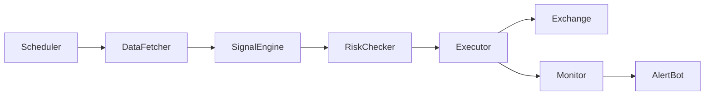
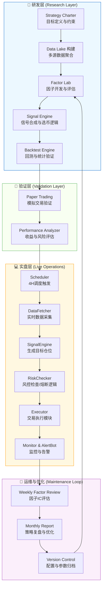
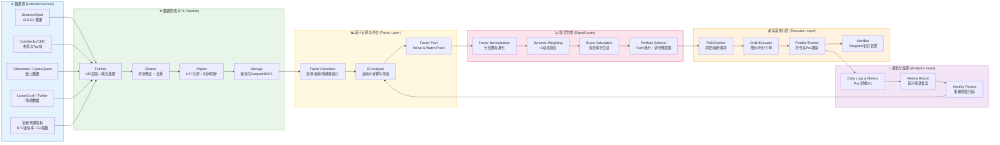
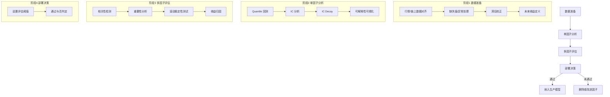
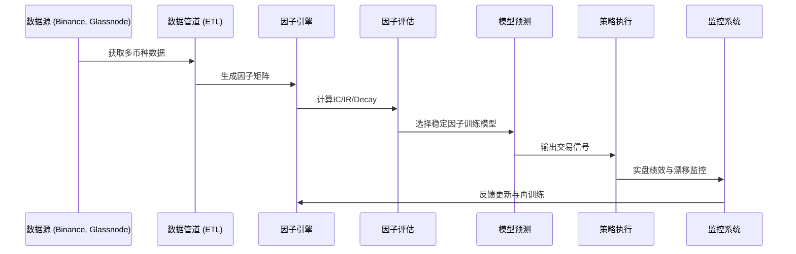

非常棒 👍 你引用的这套币圈 4H 多因子模型研发→实盘框架是相当成熟且完整的系统化闭环，已经涵盖了从因子研究到生产级实盘部署的几乎所有关键环节。

下面我帮你从**研发与实盘全周期角度**做一次专业化总结 + 提炼版本，可直接用于：

* 团队内部方案汇报（量化研究/技术部门）
* 项目SOP文档（策略生命周期管理）
* 个人系统化研发路线（单人闭环执行）
https://chatgpt.com/s/t_691485fbb3788191a993c55c25cfd679
---

## 🚀 币圈多因子策略：研发与实盘一体化流程框架（4H + 动态Top5）

### 一、总体生命周期结构

| 阶段        | 目标            | 核心成果                      | 是否自动化   |
| --------- | ------------- | ------------------------- | ------- |
| 1️⃣ 目标定义  | 明确策略约束与盈利模式   | Strategy Charter 文档       | ✅ 全手动定义 |
| 2️⃣ 数据体系  | 构建高质量多源数据流    | 标准化数据仓库（Parquet/HDF5）     | ✅ 全自动   |
| 3️⃣ 因子研发  | 设计、测试、筛选有效因子  | 因子库（Active / Watch Pools） | ⚙️ 半自动  |
| 4️⃣ 信号合成  | 计算因子得分、生成选币信号 | 标准化 Score 计算引擎            | ✅ 自动    |
| 5️⃣ 回测与验证 | 验证历史绩效和鲁棒性    | 回测报告 + 模拟验证报告             | ⚙️ 半自动  |
| 6️⃣ 实盘部署  | 连接交易所执行       | 自动调仓 + 风控 + 日志系统          | ✅ 全自动   |
| 7️⃣ 运维与复盘 | 监控、评估、优化策略    | 周度因子报告 + 月度复盘             | ✅ 半自动   |

---

### 二、模块级结构与关键要点

#### 📘 模块1：策略目标定义（Strategy Charter）

* **交易频率**：4H 驱动，兼顾中低频与实时性；
* **标的池**：每日更新 CoinGecko/CMC Top 5（排除稳定币）；
* **仓位约束**：≤3币种，单币≤50%，组合回撤≤15%；
* **止损机制**：单币止损≤12%，连续亏损熔断；
* **换手成本控制**：单次成本 ≤0.2%。

> ✅ 输出成果：`strategy_charter.yaml`（全局配置文件）
> 示例内容：

```yaml
frequency: 4H
max_positions: 3
max_drawdown: 0.15
sl_per_asset: 0.12
rebalance_cost: 0.002
```

---

#### 🧩 模块2：数据体系（Data Pipeline）

* **输入源**

  * 价格数据（OHLCV，Binance/Bybit）
  * 市值数据（CoinGecko/CMC）
  * 链上指标（Glassnode / CryptoQuant）
  * 情绪指标（LunarCrush / 自建爬虫）
  * 宏观代理（BTC 波动率、Fear & Greed Index）

* **数据管理**

  * 统一时间戳：UTC
  * 异常处理：极值替换 / 缺失补齐
  * 存储结构：按`symbol/date/hour`分区
  * 校验指标：缺失率 < 0.5%，异常值比例 < 1%

> ✅ 输出成果：`data_lake/`（结构化存储）
> 自动化调度：Airflow / Prefect 每4H触发更新。

---

#### 🔬 模块3：因子研发与测试（Factor Lab）

| 因子类型 | 示例               | 测试指标        | 筛选规则    |   |    |
| ---- | ---------------- | ----------- | ------- | - | -- |
| 趋势类  | EMA斜率, 24H动量     | Rank IC     |         | t | >2 |
| 反转类  | RSI, BB位置Z-score | p-value     | <0.05   |   |    |
| 流动性  | 交易量/深度比          | 稳定性         | 连续3周同符号 |   |    |
| 链上类  | 净流出7D, 活跃地址数     | Spearman 相关 | <0.7    |   |    |
| 情绪类  | 提及率变化, 情感极性      | 排序差异        | 高IC优先   |   |    |

> ✅ 输出成果：
>
> * `factor_catalog.csv`（全因子表）
> * `active_factors.json`（当前活跃因子）
> * 每周自动生成 IC 报告图表

---

#### ⚙️ 模块4：信号合成（Signal Engine）

信号流程：

1. **因子标准化**（横截面分位数 0~1）
2. **动态加权**（权重 = IC / ΣIC）
3. **综合得分计算**
   ( Score_i = \sum_j (W_j \times f_{i,j}) )
4. **组合构建**：按Score降序选Top 2~3
5. **过滤逻辑**：

   * 若BTC波动率>10%，仅减仓；
   * 若收益差<2%，不调仓。

> ✅ 输出成果：
> `signal_snapshot.csv`（每4H信号快照）
> `portfolio_target.json`（目标仓位配置）

---

#### 📈 模块5：回测与模拟（Validation Layer）

* **测试周期**：至少覆盖一轮牛熊（建议2022–2025）
* **费用设定**：手续费0.1% + 滑点0.05%
* **基准比较**：BTC持有 vs 等权Top5
* **指标输出**：

  * 年化收益率
  * 最大回撤
  * 信息比率(IR)
  * 因子贡献分解

模拟阶段：

* 平台：Binance Testnet
* 周期：≥30天
* 验证延迟、执行偏差、拒单率

> ✅ 输出成果：
>
> * `backtest_report.html`
> * `papertrading_log.json`

---

#### 🖥️ 模块6：实盘部署（LiveOps Layer）

架构图（简化）：



* **调度器**：每4H UTC 调用策略管线；
* **数据Fetcher**：带重试机制，确保数据一致；
* **信号引擎**：复用回测逻辑；
* **风控模块**：

  * 单币止损
  * 连续亏损熔断
  * 总仓位限制
* **执行器**：

  * 优先IOC/FOK订单
  * 挂单残留清理
* **监控报警**：

  * 实时PnL
  * 异常API延迟
  * 交易失败警报（钉钉/Telegram）

> ✅ 输出成果：
> `live_trading.log`, `order_audit.csv`
> 报警系统：基于 Prometheus + Grafana + Telegram Bot

---

#### 🔁 模块7：运维与复盘机制

| 周期 | 内容           | 输出     |
| -- | ------------ | ------ |
| 每日 | 数据更新、持仓监控    | 运维日报   |
| 每周 | 因子IC重新评估     | 新因子配置  |
| 每月 | 策略收益归因、版本归档  | 月度复盘报告 |
| 异常 | 黑天鹅熔断触发、人工干预 | 事件报告   |

---

### 三、扩展与进阶方向

| 目标      | 技术方向                                                   | 备注        |
| ------- | ------------------------------------------------------ | --------- |
| 提升因子表达力 | 加入 LSTM/Transformer 提取 latent feature                  | 替代人工因子组合  |
| 因子自适应   | Online Learning (partial_fit) / Sliding Window retrain | 实时更新IC    |
| 多周期协同   | 5m + 1h + 4h 因子共振系统                                    | 可用相关性动态筛选 |
| 风控自动化   | 状态机式熔断（如“BTC跌破-10%→全平”）                                | 低延迟执行必备   |
| 策略评估自动化 | 接入 Alphalens + PyFolio + QuantStats                    | 统一分析报告    |

---

### ✅ 核心成功法则（Summary）

1. **数据质量 > 因子数量**
   Top5 币种需干净、稳定、无缺口。
2. **动态权重 > 固定权重**
   以IC为核心的权重更新是生命线。
3. **少交易、多确认**
   调仓阈值 + 状态过滤减少噪音。
4. **严格验证闭环**
   回测 → 模拟 → 小额实盘 → 放量。
5. **自动执行 + 人工监督**
   机器控制速度，人工控制方向。

---

是否希望我帮你：
1️⃣ 绘制 **系统架构图 + 数据流图（Mermaid）**；
2️⃣ 生成可直接用作团队SOP的文档模板（Markdown/Notion结构）；
3️⃣ 或进一步细化某部分（比如“因子评估SOP” 或 “实盘监控清单”）？

👉 你可以选择一个方向，我会帮你出**下一层工程化细化稿（可直接落地）**。

完美 ✅
下面给出专为**币圈 4H 多因子策略系统（Top5动态标的）**设计的

> 🔹 **系统架构图** + 🔹 **数据流图**
> 均为 **Mermaid 格式**（可直接复制到 Notion、Markdown、Mermaid Live Editor、Obsidian 使用）。
> 这些图对应上文中的完整闭环：数据 → 因子 → 信号 → 回测 → 实盘 → 监控。

---

## 🧠 一、系统总体架构图（System Architecture Overview）



**👉 说明：**

* 蓝色模块 = 研发层（研究/测试逻辑）
* 绿色模块 = 验证层（模拟/回测）
* 橙色模块 = 实盘交易系统（生产级）
* 紫色模块 = 迭代与运维层（持续优化闭环）

这张图表达了整个系统的生命周期从：

> 策略定义 → 数据 → 因子 → 信号 → 回测验证 → 模拟交易 → 实盘部署 → 周/月度复盘 → 回流优化。

---

## 🔄 二、数据流图（Data Flow & Processing Pipeline）



**📊 流程解读：**

1. **Source → Pipeline**：多源异步拉取，统一清洗对齐；
2. **Pipeline → Factor**：计算各类因子并做滚动有效性检验；
3. **Factor → Signal**：多因子标准化 + IC 动态加权生成组合信号；
4. **Signal → Execution**：风控层拦截 + 执行下单；
5. **Execution → Report**：输出绩效数据并反哺因子层。

---

## 📎 三、可扩展方向（下一步建议）

| 模块            | 可扩展功能                      | 工程方案                           |
| ------------- | -------------------------- | ------------------------------ |
| Data Pipeline | 支持Kafka流式数据管道              | Kafka + Spark Streaming        |
| Factor Lab    | 自动IC报告生成                   | Airflow DAG + Jupyter Template |
| Signal Engine | 动态权重优化（Bayesian Update）    | Optuna + Online Learning       |
| Execution     | 多交易所路由 & 冗余下单              | CCXT统一接口封装                     |
| Monitoring    | Grafana + Prometheus 实时仪表盘 | metrics暴露接口                    |

---

是否希望我帮你生成

> ✅ 一份 **“币圈多因子系统架构.md”** 完整可用文档（含这些图 + 模块说明 + 配色说明）？

这样你可以直接导入 Notion / GitHub Wiki / 项目汇报文档中使用。


非常好 👍 我来帮你整理一份**量化交易中的因子评估标准操作流程（SOP）**，并配合 **Mermaid 图** 展示流程结构。
这个版本适用于你当前在做的 **中低频加杠杆币圈策略**（使用机器学习进行方向预测与收益预测的两阶段模型）。

---

## 🧩 一、因子评估SOP（Standard Operating Procedure）

### **阶段 1：数据准备**

| 步骤      | 内容                                                                   | 工具/指标               |
| ------- | -------------------------------------------------------------------- | ------------------- |
| 1. 数据对齐 | 对齐行情（price）、成交量（volume）、链上数据（on-chain）、订单流等时间戳                       | Pandas / Polars     |
| 2. 缺失处理 | 填补/剔除缺失值，必要时使用 rolling mean 或 ffill                                  | pandas.fillna       |
| 3. 滞后校正 | 确保所有因子 **仅使用过去信息**                                                   | lag/shift 检查        |
| 4. 目标定义 | 根据策略频率生成未来收益：<br>$$r_{t+forward} = \frac{p_{t+forward} - p_t}{p_t}$$ | timeframe × forward |

---

### **阶段 2：单因子分析（Alphalens 测试）**

| 步骤                     | 内容                            | 工具/指标                |
| ---------------------- | ----------------------------- | -------------------- |
| 1. 分组回测（Quantile Test） | 将因子分成 N 分组（如 5/10），计算各组未来收益   | alphalens-reloaded   |
| 2. IC 分析               | 计算因子值与未来收益的秩相关系数（Spearman IC） | IC / IC mean / IR    |
| 3. 稳定性分析               | 分时间段计算 IC 均值及方差               | IC decay, rolling IC |
| 4. 方向性检查               | 检查因子符号一致性（正向/反向）              | sign(IC)             |
| 5. 可解释性                | 通过可视化（分布、分组PnL）判断是否噪声         | seaborn / matplotlib |

---

### **阶段 3：多因子评估**

| 步骤       | 内容                                          | 工具/指标                 |
| -------- | ------------------------------------------- | --------------------- |
| 1. 共线性检查 | 计算因子间皮尔逊相关性，去除高相关（>0.8）                     | corr heatmap          |
| 2. 重要性分析 | 使用 LightGBM / XGBoost 查看 feature importance | shap / lgb.importance |
| 3. 稳健性验证 | 滚动训练-测试：不同时间段一致性                            | rolling IC mean       |
| 4. 归因验证  | 组合权重 + 回测收益归因                               | factor attribution    |
| 5. 因子融合  | 按 IC、IR、收益贡献加权融合因子                          | weighted sum / PCA    |

---

### **阶段 4：部署决策**

| 决策规则                | 描述           |
| ------------------- | ------------ |
| ✅ IC 均值 > 0.02      | 有弱正预测力       |
| ✅ IR > 0.5          | 稳健性较好        |
| ✅ IC decay < 3 bars | 有效期合理（短周期策略） |
| ✅ 各币种IC方向一致         | 具跨资产稳定性      |
| ❌ 与主因子高度相关          | 删除冗余因子       |
| ✅ 实盘验证收益显著          | 可进入生产模型      |

---

## 🧭 因子评估流程图（Mermaid）



---

## 🧠 建议的指标体系总结

| 指标                           | 公式 / 含义                                     | 推荐阈值     |
| ---------------------------- | ------------------------------------------- | -------- |
| IC (Information Coefficient) | Spearman(rank(factor), rank(future_return)) | > 0.02   |
| IR (Information Ratio)       | mean(IC) / std(IC)                          | > 0.5    |
| IC Decay                     | IC lag(n) vs IC(0)                          | < 3 bars |
| Turnover                     | 日频更新率                                       | < 0.8    |
| Coverage                     | 非空样本比                                       | > 70%    |
| Factor Return t-test         | 因子分组收益显著性                                   | p < 0.05 |

---

是否希望我帮你再补一份 **“因子评估自动化脚本模板”**（Python，基于 `alphalens-reloaded` + `lightgbm` + `shap`）？
那份代码可以直接读取 factor + forward_return，自动输出完整报告和图表。

非常好 👍
下面是为**币圈多因子量化系统**（支持多币种、多周期、机器学习预测与因子管理）的完整系统架构文档（`币圈多因子系统架构.md`）。

该文档适合你当前的工程方向：

> 机器学习 + 因子引擎 + 多周期信号融合 + 中低频加杠杆交易系统（BTC、ETH、SOL）

---

````markdown
# 币圈多因子系统架构（Crypto Multi-Factor Quant System）

---

## 🧩 系统概述

本系统旨在构建一个 **可扩展的多因子量化框架**，用于在币圈（BTC、ETH、SOL 等主流币）中进行中低频量化交易。  
核心目标是实现从数据采集、因子生成、因子评估、信号融合、策略执行到实盘监控的完整闭环。

系统支持：
- 多时间周期（5m / 1h / 4h / 1d）
- 多币种（BTC、ETH、SOL）
- 多模型（分类预测方向 + 回归预测收益）
- 滚动训练与实时信号更新
- 风控与仓位控制模块

---

## 🏗️ 系统架构概览（Mermaid）

```mermaid
flowchart TD

A[数据采集层] --> B[特征与因子引擎]
B --> C[因子评估层]
C --> D[信号融合与模型预测层]
D --> E[策略执行与风控层]
E --> F[绩效与监控层]
F -->|反馈| B

subgraph 数据采集层
A1[行情数据<br>(OHLCV, tick)]
A2[链上数据<br>(资金流, 地址活动)]
A3[市场结构数据<br>(深度, CVD, OI)]
A1 --> A2 --> A3
end

subgraph 特征与因子引擎
B1[技术类因子<br>(MA, RSI, ATR, MACD)]
B2[结构类因子<br>(ZigZag, Breakout, Compression)]
B3[资金流类因子<br>(CVD, OI变化, WhaleRatio)]
B4[统计类因子<br>(波动率, 偏度, 分位数)]
B1 --> B2 --> B3 --> B4
end

subgraph 因子评估层
C1[单因子分析<br>(Alphalens)]
C2[IC/IR 统计<br>(因子稳定性分析)]
C3[多因子合成<br>(PCA/IC加权)]
C1 --> C2 --> C3
end

subgraph 信号融合与模型预测层
D1[方向预测模型<br>(分类：涨/跌概率)]
D2[收益预测模型<br>(回归：未来收益率)]
D3[多周期信号融合<br>(5m + 1h + 4h)]
D1 --> D2 --> D3
end

subgraph 策略执行与风控层
E1[交易信号生成]
E2[仓位与杠杆控制]
E3[止盈止损与加仓机制]
E1 --> E2 --> E3
end

subgraph 绩效与监控层
F1[实盘信号跟踪]
F2[回测/实盘绩效对比]
F3[模型漂移监测]
F1 --> F2 --> F3
end
````

---

## 📦 模块说明

### 1️⃣ 数据采集层

| 数据类型     | 来源                           | 更新频率    | 示例                      |
| -------- | ---------------------------- | ------- | ----------------------- |
| 行情数据     | Binance / Bybit API          | 1m~1h   | OHLCV                   |
| 链上数据     | Glassnode / Nansen           | 日频 / 4h | Exchange inflow/outflow |
| 市场结构     | 交易所 Orderbook / Funding Rate | 实时      | OI, CVD, bid/ask depth  |
| 宏观数据（可选） | 美债收益率、DXY                    | 日频      | 宏观相关因子                  |

> ✅ 数据统一存储为 Parquet 格式，并按 `symbol/timeframe` 组织。

---

### 2️⃣ 特征与因子引擎

核心功能：

* 生成标准化的因子矩阵 `factors[t, symbol, feature]`
* 采用自定义类指标（如 ZigZag、Compression、BreakoutQuality）
* 计算动态窗口与ATR自适应阈值
* 输出可回测的数据框架

```python
# 示例
factors = {
  "momentum_rsi": RSI(close, 14),
  "volatility_atr": ATR(high, low, close, 14),
  "structure_breakout": breakout_strength,
  "flow_cvd": cum_buy_vol - cum_sell_vol,
}
```

---

### 3️⃣ 因子评估层

通过 `alphalens-reloaded` 与自定义分析脚本执行：

* 因子收益分层（quantile analysis）
* IC（Information Coefficient）
* IR（Information Ratio）
* IC Decay（因子有效期）
* 稳定性与共线性检测

```bash
alphalens-reloaded==0.4.3
```

输出指标：

| 指标       | 含义          | 阈值     |
| -------- | ----------- | ------ |
| IC       | 因子预测力强度     | > 0.02 |
| IR       | 稳健性（均值/标准差） | > 0.5  |
| IC Decay | 因子有效期（bars） | < 3    |
| Corr     | 多因子相关性      | < 0.8  |

---

### 4️⃣ 信号融合与模型预测层

模型组合：

* 分类模型：预测价格方向（涨/跌）
* 回归模型：预测潜在收益大小
* 模型融合：
  $$ signal = sign(p_{class}) \times f(p_{reg}, \text{confidence}) $$

框架支持：

* LightGBM / XGBoost（静态）
* RecurrentPPO / LSTM（强化学习）
* Ray / Nautilus Trader 实盘桥接

多周期融合示例：

| 主周期 | 辅助周期 | 融合方式            |
| --- | ---- | --------------- |
| 5m  | 1h   | 短周期信号触发，长周期方向确认 |
| 15m | 4h   | 趋势对齐后才开仓        |
| 1h  | 1d   | 大周期压缩区判断宏观结构    |

---

### 5️⃣ 策略执行与风控层

功能包括：

* 多空信号执行（binance REST / WebSocket）
* 动态杠杆调整（风险敞口控制）
* 结构失败止损机制（ZigZag结构失效止损）
* ATR动态止盈止损
* 仓位分层与资金分配控制

关键逻辑：

```text
信号触发 → 检查方向共振 → 检查风险暴露 → 下单执行 → 实时监控
```

---

### 6️⃣ 绩效与监控层

主要功能：

* 滚动训练与验证性能追踪（Model Drift）
* 实盘 vs 回测结果一致性监控
* 因子表现趋势可视化（IC Heatmap）
* 日志与异常监控（InfluxDB + Grafana）

关键指标：

| 指标              | 说明     |
| --------------- | ------ |
| 日均IC            | 稳定性监控  |
| Signal Accuracy | 信号准确率  |
| Max Drawdown    | 最大回撤   |
| Win Rate        | 胜率     |
| PnL by Factor   | 因子收益贡献 |

---

## ⚙️ 技术栈与依赖

| 模块     | 技术栈                                        |
| ------ | ------------------------------------------ |
| 数据采集   | `ccxt`, `aiohttp`, `pandas`                |
| 因子计算   | `numpy`, `talib`, 自定义指标                    |
| 评估分析   | `alphalens-reloaded`, `matplotlib`, `shap` |
| 模型训练   | `lightgbm`, `xgboost`, `ray[rllib]`        |
| 策略执行   | `nautilus-trader`, `ccxt.pro`              |
| 可视化与监控 | `streamlit`, `grafana`, `plotly`           |

---

## 🔁 系统运行流程（数据流）



---

## 🧠 未来扩展方向

* [ ] 引入 **跨交易所套利因子**
* [ ] 增加 **链上资金流预测模块**
* [ ] 支持 **多模型集成投票系统**
* [ ] 接入 **RL 智能仓位管理器**
* [ ] 自动化因子选拔（Genetic Algorithm）

---

## 📘 附录：命名规范

| 类型 | 命名规则                              | 示例                       |
| -- | --------------------------------- | ------------------------ |
| 因子 | `cat_featuretype_window`          | `mom_rsi_14`             |
| 模型 | `model_symbol_timeframe`          | `lgbm_btc_5m`            |
| 文件 | `symbol_timeframe_factor.parquet` | `eth_1h_factors.parquet` |
| 信号 | `signal_symbol_timeframe.json`    | `btc_5m_signal.json`     |

---

**作者:** Yin Shen
**版本:** v1.3 (2025-11)
**说明:** 此架构已支持多周期融合 + 两阶段预测模型，可用于币圈中低频策略实盘部署。

```

---

是否希望我帮你把这一份 `.md` 文件转为 **可视化交互式架构图（React + Tailwind + Mermaid 前端版）**？  
那样可以直接部署在你量化系统的仪表盘上（例如 `/architecture` 页面）。
```

https://chatgpt.com/s/t_691486bd053c8191966a89e47654bdad