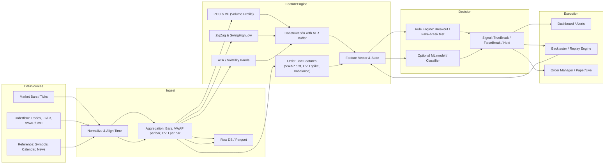

我现在想结合poc，zigzag，swinghighlow标注的支撑阻力位置，去判断突破还是假突破，可以在支撑阻力附近加atr作为等待区，如果突破以后，没有再跌穿这个区域，就是真突破，反之则是假突破，我这个idea如何，帮我画出架构图，订单流数据我后面有，可以帮忙在架构里面流出空位，比如可以使用vwap数据和cvd等数据，给出你的建议

好主意 — 你的思路清晰且务实：把**POC（Volume Profile）/ZigZag/SwingHighLow** 用来画长期/中期/短期支撑阻力，再用 **ATR** 扩展成“等待区（buffer）”，把突破是否能回测穿过等待区作为 **真突破/假突破** 的判定条件。把后续接入的\*\*订单流数据（VWAP、CVD、买卖盘不平衡、成交量簇、订单簿深度）\*\*当作增强特征，可以显著提高判别准确率（尤其在短周期/高频场景）。

> 价格找到关键位置，时间维度和量维度做为真假突破的判断

下面我把这个 idea 体系化成：

1. 一个**架构图（文本 + Mermaid）**；
2. 模块说明与数据流（每个模块做什么、输入输出）；
3. 判定逻辑（伪代码 + 参数建议）；
4. 可落地的工程/回测建议与评估指标；
5. 关于订单流特征（VWAP/CVD 等）放在哪里、怎么用的建议。

---

# 1) 架构图（Mermaid — 可直接渲染 / 亦可阅读文本版）



---

# 2) 模块说明（详细 — 输入 / 输出 / 关键点）

## 数据层（DataSources & Ingest）

* **Market Bars / Ticks**：OHLCV（最好是 ticks + aggregated bars）；`granularity` 支持 1s/1m/5m/15m/1h 等。
* **Orderflow**：逐笔成交（price, qty, side, taker/buyer flag），L2 快照/增量，VWAP（以时间或成交量窗口），CVD（signed volume 累计）。
* **存储**：Raw（parquet）、聚合后时序 DB（Influx/ClickHouse/Timescale）。

职责：时间对齐（ticks -> bars），保证 VWAP/CVD 等特征与同一 bar 对齐。

---

## FeatureEngine

* **POC / Volume Profile**：

  * 输入：N-bar 窗口内的 tick/volume distribution。
  * 输出：每窗口的 POC（price level with max volume）、Value Area High/Low (VAH/VOL)。
  * 用途：作为较稳的阻力/支撑主线，比单纯高低价更抗噪。

* **ZigZag & SwingHighLow**：

  * 输入：价格序列；参数：swing\_period、min\_move（pips）。
  * 输出：确认的 swing high / low 列表（含 index/time, price）。
  * 连接策略：`PickUp`（高低交替） 或 `All`（全部相连）。

* **ATR / Volatility Buffer**：

  * 输入：bars，参数：ATR\_period。
  * 输出：ATR 值 → S/R buffer\_width = k \* ATR（k 推荐 0.5\~2）。
  * 用途：在 S/R 周边做等待区（“灰区”），判断穿透是否稳固。

* **Construct S/R with ATR Buffer**：

  * 输入：POC/VAH/VOL + Swing points。
  * 输出：一组 S/R segment：`{type, price, start_index, end_index(current), buffer_top, buffer_bottom}`。
  * 逻辑：每个 swing/POC 生成一条横向线并用 ATR 扩展为等待区。

* **Orderflow Features (VWAP/CVD/Imbalance)**：

  * VWAP drift：当前 bar VWAP 与 N-bar 内 VWAP 的偏离。
  * CVD spike：短期 signed volume 累计是否显著（z-score）。
  * Imbalance：买/卖成交量占比、L2 深度不对称。
  * Quote aggressor ratio：市价单占比。
  * 输出：数值特征（标准化）/ 事件（spike, heavy buy pressure）。

* **Feature Vector**：

  * Example: `{price_rel_to_SR, pct_into_buffer, ATR, VWAP_drift, CVD_z, imbalance, time_of_day, vol_recent}`

---

## Decision (规则 + 可选 ML)

* **Rule-based "Fake vs True Breakout"**（核心思路）：

  1. 检测价格穿越 S/R buffer 上边界（或下边界）。
  2. 在 `T_confirm` 时间窗（比如 1~~3 bars on bar-chart 或 30s~~2min for ticks）内，检查是否 *回穿* buffer\_bottom（对空的情况相反）。
  3. 若没有回穿并且 orderflow 支持（VWAP drift 同向、CVD 正向累积大于阈值、imbalance 支持），判定为 **True Breakout**。
  4. 若价格在短期内回穿 buffer（或 orderflow 反向强烈），判定为 **Fake Breakout**。
* **概率/ML增强**：

  * 使用 Gradient Boosting / LightGBM / XGBoost / small NN 训练一个二分类器（True/False breakout），特征即上面 Feature Vector。
  * Label：回测中以 `T_hold`（如 30m）内是否维持方向并收益超过阈值来打标签。

---

# 3) 具体判定伪代码（Rule Engine）

```python
# parameters
buffer_k = 1.0           # buffer = k * ATR
confirm_bars = 3         # 确认窗口
min_vwap_drift = 0.2     # 单位: pip 或 price ratio
min_cvd_z = 1.5          # z-score
min_move_after_break = 1.0 * ATR

# 当 price 突破上阻力 SR 线（price > sr_price + buffer）
if current_price > sr_price + buffer:
    t0 = now
    broken = True
    # collect OF features for next confirm_bars
    of_support = check_orderflow_support(window=confirm_bars)
    # wait confirm window (simulated in backtest) or monitor in live
    if not price_falls_below(sr_price + buffer) during confirm_bars:
        if of_support and (price_move_since_break >= min_move_after_break):
            signal = TRUE_BREAKOUT
        elif of_support and (price_move_since_break < min_move_after_break):
            # weaker true, maybe wait for more confirmation
            signal = HOLD
        else:
            signal = FALSE_BREAKOUT
    else:
        signal = FALSE_BREAKOUT
```

**orderflow-support 函数示意**：

* VWAP\_drift > min\_vwap\_drift（方向同向）
* CVD\_z > min\_cvd\_z（累积多头买单）
* Aggressor buy ratio > 0.6 或者 L2 买深度/卖深度 ratio > 1.2

---

# 4) 参数建议（初始可调）

* Swing period: 4–12（越大越过滤短噪声）
* ATR period: 14（标准）
* buffer\_k: 0.5 — 2.0（短周期用小一点，长周期稳健用大一点）
* confirm\_bars: 2 — 5（基于你的 bar 时间尺度）
* min\_move\_after\_break: 0.5 — 2 \* ATR
* VWAP/CVD z-threshold: z>1.5 为信号，z>2 为强信号

---

# 5) 回测与评估（非常重要）

* 回测需包含：逐笔回放（tick）或至少 1s 精度，才能逼真模拟 orderflow 影响。
* 指标：

  * **Precision / Recall** 对于 TrueBreak 分类（避免高假阳性）。
  * **Profit per trade**, **Max drawdown**, **Win rate**, **Expectancy**。
  * **Time-to-confirm distribution**（判断策略延迟/持久性）。
* 验证方法：

  * Walk-forward CV（时间序列交叉验证）。
  * Monte-Carlo 价格扰动测试（鲁棒性）。
  * Feature importance（若用 ML）观察 VWAP/CVD 对预测的影响。

---

# 6) Dashboard / Monitoring（实时）

* 显示当前 S/R、buffer、最近 swing、POC、VWAP、CVD 曲线。
* 告警：出现「突破但 OF 不支持」「突破并被 confirm」两类告警。
* Log：每次突破都记录 `price at break`, `distance above SR`, `orderflow features`, `confirm outcome`。

---

# 7) 工程实现建议（技术栈）

* 数据：ClickHouse / Parquet + S3 做历史存档；Redis 做短期缓存（低延迟）。
* 实时流：Kafka 或直接 WebSocket + in-memory aggregator（适合低延迟）。
* Feature service：Python（pandas/numpy）或 Rust/Go（低延迟）实现 feature 聚合。
* 模型：LightGBM（快、便于部署），或 PyTorch（若做序列模型）。
* Backtest/Replay：自建 tick-replayer（可重复）或使用 Backtrader/Zipline，但要确保 tick 支持 orderflow。
* Deployment：Docker + k8s；低延迟策略用 colocated host（靠近交易所）。

---

# 8) 具体如何把 VWAP/CVD 融入判定（建议）

* **VWAP drift**：如果突破方向的 VWAP 持续高于历史 VWAP（正向偏离），说明有价差推动力。用这个判断方向一致性。
* **CVD spike**：突破瞬间若伴随大正向 CVD（买单占优），更可能是真突破。
* **Imbalance + Quote Pressure**：若买盘大量挂单（L2 深度），然后被吃掉（aggressor成交），说明主动买入，支持真突破。
* **时间加权**：用短期（1-3 bars）和中期（10-20 bars）VWAP/CVD 双尺度对比，短期更敏感，中期做确认。

---

# 9) 快速落地路线（MVP）

1. 用现有 tick/交易数据实现：POC（30m window），Swing(Period=6)，ATR(14)。
2. 实现 S/R buffer 并在回测器里做简单规则判定（confirm\_bars=3，buffer\_k=1）。
3. 接入订单流：先实现 VWAP per bar + signed volume (CVD)。
4. 训练或手工调参（rule）并评估 precision/recall。
5. 迭代引入 ML（若规则不够），做 feature importance 分析。

---

# 10) 额外建议 / 风险点

* **时延（latency）**：若用 tick 级别 orderflow，网络/处理延迟会影响执行。
* **过拟合**：使用历史订单流训练模型需注意样本外表现（market regime）。
* **小样本偏差**：极端事件（闪崩/新闻）对模型影响大，建议有“新闻/事件”过滤开关。

---

如果你愿意，我可以继续帮你做下面任一项（任选其一或多个）：

1. 把上面的 Mermaid 图转成 PNG（如果你需要可视化图）并且生成一份架构 PPT。
2. 给出一个完整的 **回测伪代码 / 单元实现**（包含如何在 tick-replay 中计算 VWAP/CVD，并测试真/假突破的标签化逻辑）。
3. 给出用 LightGBM 训练的 **特征清单 + 模型训练脚本**（Python），含数据生成和标签规则。
4. 把判定规则写成 cTrader 指标/策略（基于你现在的 SwingHighLow/POC 指标 + ATR），做一个 demo 策略（paper trading）。

你先选一项或者告诉我你现在最想先做哪一步，我就把对应的实现给你。


## z-score
对的，你抓到重点了 👌。

### 🔹 z-score 本质

* **不是专门为 cum\_delta 设计的**，而是一个**通用的标准化算法**。
* 用途就是：把某个指标转化为“相对于近期均值的偏离程度”。
* 它的好处是消除量纲差异 & 适应不同市场环境。

公式：

$$
z_t = \frac{x_t - \mu}{\sigma}
$$

* $x_t$：当前指标值
* $\mu, \sigma$：滚动窗口的均值和标准差

这样你得到的不是“绝对值大不大”，而是“比近期正常状态强多少倍”。

---

### 🔹 应用在 Bollinger Band 压缩

你提到的：

$$
\text{压缩度} = \frac{\text{布林带宽度}}{\text{ATR}}
$$

问题：

* 这个压缩度在不同市场/周期下，数值区间不一样。
* 比如 BTC 日线可能压缩到 0.8 就算极窄，但在 1min 级别里，0.8 可能非常宽。
* 如果用固定阈值（比如 `< 1.0`）来判定压缩 → 很容易失效。

用 **z-score 标准化后**：

$$
z_t = \frac{\text{压缩度}_t - \mu}{\sigma}
$$

* $z_t < -2$：说明布林带宽度比近期均值低很多（极度压缩）。
* $z_t > +2$：说明波动比近期均值高很多（极度扩张）。

这样就能在不同品种、不同周期下，统一使用“标准差倍数”做比较。

---

### 🔹 通用结论

* **任何带有“强度/比例/宽度”的指标**（cum\_delta、布林宽度、波动率、成交量…）
  👉 如果你需要“判断它是不是异常大/小”，用 z-score 标准化都会比固定阈值更稳健。
* **什么时候不用 z-score？**

  * 当你非常清楚某个指标在该市场的稳定分布范围（例如杠杆率永远在 0–0.2 之间），固定阈值更直观。
  * 当你做跨市场/跨周期比较，或者市场状态经常切换 → z-score 更合适。

---

✅ 简单一句话：
**固定阈值是“绝对判断”，z-score 是“相对判断”。**
在跨周期、跨品种、跨状态下，z-score 更通用、更稳健。

---

### 1. `cond_vwap = closes[idx] > vwap` 还是用z-score
https://chatgpt.com/s/t_68ba4731ef7c8191acd343fde2a81116
https://chatgpt.com/s/t_68ba475178c881918beb3e622e5ddb34
这是最常见、最直观的用法，相当于判断价格在 VWAP 上方还是下方：

* 上方 → 看多
* 下方 → 看空

📌 特点：

* 简单直观，容易解释。
* 缺点是容易受到市场噪声干扰（价格略微穿越 VWAP 可能是假信号）。
* 在震荡行情里容易来回假突破。

---

### 2. Z-score 方式：`z_vwap = (close - vwap) / std(close - vwap)`

用 **标准差归一化 VWAP 偏离度**，相当于衡量价格相对 VWAP 的“统计显著性”。

* `z_vwap > +1` → 价格显著高于 VWAP（多头动能强）。
* `z_vwap < -1` → 价格显著低于 VWAP（空头动能强）。
* `-1 < z_vwap < +1` → 噪声区间，不交易。

📌 特点：

* 更稳健，可以过滤掉“小幅度的穿越”。
* 在波动率高低不同的市场中自适应，不会因为 ATR 大小变化而导致阈值失效。
* 类似于布林带思想：VWAP 本身作为“均线”，z-score 则提供动态带宽。

---

### 对比

| 方法             | 优点             | 缺点          | 适合场景          |
| -------------- | -------------- | ----------- | ------------- |
| `close > vwap` | 简单直观，趋势行情灵敏    | 假突破多，震荡不稳   | 大趋势行情、顺势交易    |
| z-score        | 噪声过滤，自适应波动率，稳健 | 可能错过最早的突破信号 | 高频、震荡过滤、稳健型策略 |

---

✅ 建议：

* 如果你做的是 **趋势跟随**，可以直接用 `close > vwap`。
* 如果你更在意 **突破过滤/稳定性**，建议用 **VWAP 偏离的 z-score**。
* 甚至可以结合：

  ```python
  cond_vwap = (close > vwap) and (z_vwap > 1)
  ```

这样既要求在 VWAP 上方，又要求偏离足够显著，减少假信号。

---

## 强化学习中，指标是否都应该z-score减少噪音呢

https://chatgpt.com/s/t_68ba471a01e081919bd973c43d5598f6

这个问题问得很到位 👍。在 强化学习 (RL) for trading 里，是否应该对指标统一做 z-score 归一化，其实要分情况。

1. 为什么很多人会对指标做 z-score？

减少量纲影响
RSI ∈ [0,100]，ATR 可能是 50，价格可能是 20000，直接输入会导致不同维度不均衡。z-score 归一化后，所有指标大致在 
[
−
3
,
3
]
[−3,3] 区间，更利于神经网络收敛。

去除趋势性偏移
ATR 在牛市可能平均是 200，熊市平均可能是 50。如果不做归一化，模型可能学不到相对变化。z-score 会自动以滑动均值为基准，关注波动异常，而不是绝对大小。

降低噪声，突出异常
绝大多数交易信号并不是“值的大小”，而是“是否显著偏离常态”，这本质就是 z-score 的意义。

2. 什么时候不一定要用 z-score？

本身有自然归一化范围的指标

RSI: 已经在 
[
0
,
100
]
[0,100]，再做 z-score 可能没太大必要。

MACD: 一般会配合信号线，模型可直接学到交叉关系。

价格类特征 (open/high/low/close)

如果你是多资产训练（BTC、ETH、SOL），不同币价差异极大 → 建议归一化（z-score 或 log-return）。

如果只训练单一资产，模型可以自己学价格的相对变化，不一定需要归一化。

强化学习 reward

reward 通常是基于收益/回报率（已是无量纲的 %），z-score 反而会扭曲奖励信号，不建议处理。

3. 实践经验（稳健做法）

👉 在 RL 特征工程中，通常有这几种层级：

价格类特征（OHLC、returns） → 用 对数收益率 或 z-score。

波动率类指标（ATR、HV、IV） → 用 z-score，避免牛熊市量级不同。

趋势类指标（RSI, MACD, Stoch） → 直接用，或做 MinMax 归一化（保持[0,1]）。

成交量/订单流类特征（cum_delta, vwap 偏离） → 强烈建议 z-score，否则交易量级差异会掩盖信号。

✅ 总结：
在 RL 中，不是 所有指标 都必须做 z-score。

量纲变化大的指标（ATR, Volume, cum_delta, VWAP 偏离） → 建议 z-score。

有自然边界的指标（RSI, Stoch） → 不需要。

reward → 不要动。


## 位置过滤，时序过滤，波动过滤
你现在的 judge_breakout 函数逻辑已经比较全面了（taker ratio、sweep、VWAP、CVD），但这种因子组合一般只是“单一瞬时信号”，所以胜率不会太高。要提高胜率，通常要加上 结构确认 + 时序确认 + 环境过滤
多因子打分升级

目前 score = sum([cond_taker, sweep, cond_vwap, cond_cumdelta]) 是硬阈值逻辑。

可以改成 加权打分 或 逻辑回归/LightGBM 等机器学习判别模型。

例如：taker_ratio 占 40%，CVD 占 30%，VWAP 占 20%，sweep 占 10%。

https://chatgpt.com/s/t_68bb6b4a93988191ae94d1f0ca8042aa