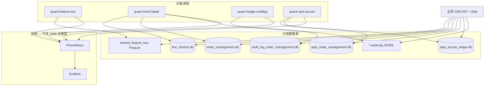

# 业务控制台（CMS）设计 — 与 Grafana 监控栈分工

> **定位**：只读、偏业务的运维/复盘后台，展示 SQLite / Parquet / 审计日志中的**行级事实**与**决策上下文**；不承担进程健康、时序告警、漏斗 rate 曲线（仍由 Grafana + Prometheus 负责）。
>
> **前置阅读**（仓库已有）：
> - [MONITORING_VS_BUSINESS_CONSOLE_CN.md](./MONITORING_VS_BUSINESS_CONSOLE_CN.md) — 监控栈 vs 小后台职责、内存粗估、P0–P3 演进
> - [LIVE_CADENCE_AND_STORAGE_CN.md](./LIVE_CADENCE_AND_STORAGE_CN.md) — 三进程节拍、库路径、表语义
> - [STRATEGY_MAP_METRICS_CN.md](./STRATEGY_MAP_METRICS_CN.md) — Strategy Map 指标与 PromQL（**不进 CMS**）
> - `README_CN.md` 实盘节 — sqlite-web 端口 8871–8873、SSH 转发

---

## 1. 为什么要单独做 CMS

| 维度 | Grafana + Prometheus | 现有 sqlite-web (8871–8873) | **业务 CMS（本设计）** |
|------|---------------------|----------------------------|------------------------|
| 目标用户 | SRE / 值班看存活与异常 | 开发临时查表 | 策略/运维复盘业务状态 |
| 数据形态 | 时序样本、聚合 rate | 裸 SQL 表浏览 | 按账户层（A/B/C）、symbol、时间轴组织 |
| K 线 / 特征 | 仅少量 gauge 快照 | 无 | **全 universe 互动 K 线** + 实盘交易地图标记 |
| 单次决策下钻 | 无 | 无 | 漏斗 JSON、prefilter 原因、deploy 窗口 |
| 鉴权与导航 | Grafana 登录 | **无登录** | 内网 + Token / SSO（一期至少 Basic Auth） |
| 写操作 | 无 | 无 | **一期只读**；写（撤单、halt）二期再议 |

**结论**：CMS 是 sqlite-web 的**产品化替代** + Parquet/日志的**统一入口**，不是 Grafana 的替代品。

---

## 2. 系统边界（与 live 架构对齐）



**账户层（宪法 `constitution.yaml`）与页面对应**：

| 层 | 进程 | 策略示例 | CMS 一级导航 |
|----|------|----------|--------------|
| **B — Trend** | `quant-trend-fattail` | `tpc`（`enabled_archetypes`） | Trend 决策 / 订单 / 持仓 |
| **C — Multi-leg** | `quant-hedge-multileg` | `chop_grid`, `trend_scalp` | 多腿 runs / 订单 / 对账 |
| **A — Spot** | `quant-spot-accum` | `spot_accum_simple` | Spot 吸筹 / pending / 账本 |

---

## 3. 数据源清单（CMS 应读什么）

### 3.1 SQLite（生产典型路径，容器内为 `/app/...`）

| 库文件 | 宿主路径示例 | 主要表 | 业务含义 |
|--------|--------------|--------|----------|
| `live_monitor.db` | `live/highcap/data/db/live_monitor.db` | `stats_15min` | 每轮 `_handle_features` flush 的漏斗、持仓 JSON、`by_strategy` |
| `order_management.db` | `/opt/quant-engine/data/order_management.db` | `orders`, `positions`, `position_operations`, `slots_state`, `safety_state`, `add_position_state`, `stop_loss_trailing` | Trend 账户执行态、宪法 slot、kill-switch |
| `multi_leg_order_management.db` | `/opt/quant-engine/data/multi_leg_order_management.db` | `multi_leg_runs`, `multi_leg_orders`, `multi_leg_positions`, `multi_leg_execution_reports`, `multi_leg_reconciliation_snapshots` | 多腿 run、leg 库存、对账漂移 |
| `spot_order_management.db` | `live/highcap/data/spot_order_management.db` | `spot_orders` | Spot 限价/成交单 |
| `spot_accum_ledger.db` | `live/highcap/data/spot_accum_ledger.db` | `state_kv`, `daily_counters` | 母仓 JSON、`buy_entries` / `deploy_usdt` 日计数 |

DDL 权威：`src/order_management/database/schema_trend.sql`、`schema_multi_leg.sql`；Spot 订单表见 `spot_order_manager.py`。

### 3.2 Parquet / JSON 快照（Feature Bus）

| 路径模式 | 内容 | CMS 用途 |
|----------|------|----------|
| `live/shared_feature_bus/bars_1min/<SYMBOL>.parquet` | 1min OHLCV | K 线、执行 bar 对齐 |
| `live/shared_feature_bus/features/<TF>/<SYMBOL>.parquet` | 特征列（含 `weekly_ema_200_position` 等） | 与 eligibility 日志对照 |
| `live/shared_feature_bus/latest/features/<TF>/<SYMBOL>.json` | 最新快照 | 首页「当前特征」卡片 |
| `live/highcap/data/macro/spot_weekly_ema200/<SYMBOL>.parquet` | 周线 EMA seed | Spot prefilter 溯源 |

### 3.3 审计日志（文本）

| 文件 | 进程 | CMS 用途 |
|------|------|----------|
| `live/highcap/data/logs/trend_live_audit.log` | trend | 结构化审计（若 JSONL） |
| `live/highcap/data/logs/feature_bus_audit.log` | feature-bus | 发布后特征审计 |
| 容器 stdout | 各进程 | **不进 CMS 一期**；检索用 Loki/ssh（P3） |

Spot  eligibility 已在 `decision_chain_debug` 打日志；CMS 可解析最近 N 行或从 DB 反推。

---

## 4. 信息架构（页面模块）

### 4.1 全局

- **首页 / 运行概览**：三进程「最后活动时间」（读 `latest/*.json` mtime、DB `MAX(updated_at)`）、宪法 `safety_state`、各层今日 deploy/订单计数；**外链** Grafana Home、Prometheus Targets（不内嵌 PromQL）。
- **配置只读**：展示当前 `constitution.yaml` 摘要（`enabled_archetypes`、`deploy_schedule`、`spot.accumulation`），来源 `MLBOT_CONSTITUTION_YAML` 挂载路径。

### 4.2 实盘互动交易地图（Trade Map Live）— 核心能力

> **对标**：研究侧静态 HTML `trading_map_continuous.html` / `generate_trading_map_html()`（`scripts/event_backtest/reporting/trading_map.py`，Bokeh 导出）；CMS 版为 **可缩放、可切换周期、随实盘更新的互动图**，数据源为 Feature Bus + 三账户 SQLite，而非 `results/` 回测目录。

#### 4.2.1 产品目标

| 能力 | 说明 |
|------|------|
| **全 symbol** | `universe.yaml` 内所有 symbol（当前 highcap：BTC/ETH/BNB/SOL/XRP 等）同一页切换或 Tab |
| **默认 2h K 线** | 与 Spot `120T`、bus 别名 `2h` 一致，作为打开页面时的默认周期 |
| **周期切换** | 用户可在 **2h / 15min / 1min / 日线** 间切换（见下表数据源） |
| **交易地图** | 在 K 线上叠加**成功开仓/平仓**（及可选 pending），多空有向箭头，平仓有区分图标 |
| **按账户层筛选** | Trend / Multi-leg / Spot 可勾选显示（默认可叠层或分色） |
| **实时更新** | 新 bar、新成交后标记自动追加/刷新，无需整页重载（SSE 或 WebSocket + 图表 `setData` / `setMarkers`） |
| **订单列表（同页）** | Trade Map 右侧 **表格**展示当前 symbol、当前图层（Trend/Spot/Multi-leg）下的 `orders` / `spot_orders` / `multi_leg_orders`；点击行打开标记详情，与 K 线标记 `marker_id` 对齐 |

> **说明**：§4.3 / §4.5 中的「订单列表」在 **P1 MVP 仅实现了 Trade Map 主图**；列表视图在 **P2+** 以 Trade Map **同页侧栏** 交付（`/api/orders/list`），完整分页/筛选的独立 Trend/Spot 页仍可按 §4.3 分期扩展。

**与滚动回测地图的差异**：

| 维度 | 回测 `trading_map_*.html` | CMS Trade Map Live |
|------|---------------------------|-------------------|
| 数据 | 回测 `bars_1min` + `ClosedTrade` | 实盘 bus Parquet + `orders` / `spot_orders` / `multi_leg_*` |
| 交互 | Bokeh 静态 HTML、Tab 切换策略 | Lightweight Charts：缩放、十字线、周期切换 |
| 更新 | 生成后不变 | 5–15s 增量拉取 |
| 标记语义 | 已定义（见 4.2.3） | **复用同一套视觉规范** |

#### 4.2.2 K 线周期与数据路径（P1 已实现）

**P1 规范（业务控制台 MVP）**：主 K 线 **一律** 从 `live/shared_feature_bus/bars_1min/<SYMBOL>.parquet` 读取，在 CMS 内重采样为 UI 周期；`features/<tf>` **不** 作为主 OHLC 源（行内可能缺 `open/high/low`）。`features/<tf>` 与 `latest/features/*` 仅用于叠加层、最新特征卡片、新鲜度对账。

| UI 周期 | 内部 key | P1 主数据源 | 备注 |
|---------|----------|-------------|------|
| **2h**（默认） | `2h` / `120T` | `bars_1min` → `2h` | — |
| **15min** | `15min` | `bars_1min` → `15min` | — |
| **1min** | `1min` | `bars_1min`（直通） | — |
| **日线** | `1d` | `bars_1min` → `1D` | P2 可叠加 macro 周线 seed 参考线，不作主 K 线 |

实现：`deploy/business-console/backend/app/services/ohlcv_reader.py`；API：`GET /api/bus/ohlcv`、`GET /api/trade-map/bundle`（`source: bars_1min`）。

**OHLC 列约定**：Parquet 行须映射为 `{ time, open, high, low, close, volume? }`（UTC 秒或毫秒，与 Lightweight Charts 一致）。若 feature 表仅有 `close`，则 `open/high/low` 用 `close` 填充并打 `meta.degraded_ohlc=true`（前端灰字提示）。

**附图特征列**（不占主周期，见 §4.2.5 多选副图）：

- `GET /api/bus/features/columns` 列出 `features/<tf>` 数值列；bundle 传 `feature_columns=col1,col2`
- 默认推荐 `weekly_ema_200_position`（Spot prefilter，`y=0` 参考线）
- 其余策略列（如 `ema_1200`）仅在对应 TF Parquet 有列时出现

#### 4.2.3 交易标记视觉规范（对齐回测地图）

与 `scripts/event_backtest/reporting/trading_map.py` 保持一致，便于研究→实盘对照：

| 事件 | 形状 / 图标 | 颜色规则 |
|------|-------------|----------|
| **开多** | 上三角 △ (`triangle`) | 填充：多绿 `#2e7d32`；描边：按策略 archetype（如 tpc 蓝 `#3274D9`） |
| **开空** | 下三角 ▽ (`inverted_triangle`) | 填充：空红 `#c62828`；描边：策略色 |
| **加仓多** | ◇ (`diamond`) | 同上 |
| **加仓空** | ◈ (`diamond_cross`) | 同上 |
| **平仓** | 方形或 X（Lightweight Charts `square` / 自定义 PNG） | **盈绿** `#26a69a` / **亏红** `#ef5350` |
| **持仓连线** | 开→平折线（可选） | 盈亏着色，与回测一致 |

**Spot**：仅 LONG；入场用 △，卖出/减仓用平仓图标（`profit_take_ladder` 部分成交可多次 exit 标记）。

**未成交挂单**：虚线框或空心三角（`pending`），点击展示 `client_order_id`、限价、deploy 窗口状态。

#### 4.2.4 标记数据来源（实盘成交为准）

| scope | 表 / 事件 | 映射为 TradeMarker |
|-------|-----------|-------------------|
| **trend** | `orders`（`status=filled`）+ `positions`（`entry_time`/`exit_time`）+ `position_operations` | entry/exit/add；`strategy_id` → archetype 描边色 |
| **spot** | `spot_orders`（filled）+ `state_kv.positions` 成本线 | buy→开多；sell→平仓 |
| **hedge** | `multi_leg_orders` + `multi_leg_execution_reports` | 按 `purpose` / `side` 区分 entry vs exit |

**时间对齐**：标记 `time` 取 **成交时间**（`filled_at` / `execution_reports.event_time`），若缺失则用订单 `created_at` 并对齐到当前 K 线周期的 bar open（避免标记落在两根 K 线之间难以辨认）。

**不推荐**仅用 Prometheus `mlbot_strategy_event_price` 作地图主数据源：该 Gauge 仅为「最后一次事件价」快照，无法还原完整开平对与加仓序列；可作为 **实时预览** 补充，与 DB 成交对账。

**可选窄表（P2 推荐）**：各进程在成交回调写 `trade_map_events(symbol, ts, scope, strategy, event, side, price, qty, order_id)`，CMS 查询更快、与日志解耦。

#### 4.2.5 前端交互（多页面 + 模块化）

顶栏 **应用菜单** 切换页面（`console-shell.js`）；Symbol / 账户层勾选跨页同步（`localStorage`）。

| 路由 | 页面 | 内容 |
|------|------|------|
| `/trade-map` | **交易地图** | K 线、账户层标记、附图、Spot 资格侧栏、标记详情 |
| `/orders` | **订单** | 全屏订单表、状态筛选、订单/标记详情；可链到地图 `?marker_id=` |
| `/` | 重定向 | → `/trade-map` |

**交易地图** `/trade-map`：

```
  ├─ [数据] Symbol + 周期
  ├─ [账户层 A/B/C] → 主图 markers
  ├─ [附图] 成交量 + 特征列多选
  ├─ [侧栏] Spot 资格（可选）
  └─ 标记详情（点击主图）
```

**订单** `/orders`：

```
  ├─ Symbol + 状态筛选 + 账户层 scope
  ├─ 全页表格 GET /api/orders/list
  └─ 右侧详情；有 marker_id 时附地图深链
```

| 模块 | 页面 | 数据源 |
|------|------|--------|
| 账户层标记 | 交易地图·主图 | 三库成交 |
| 成交量 / 特征列 | 交易地图·附图 | bus Parquet |
| Spot 资格 | 交易地图·侧栏 | `/api/spot/eligibility` |
| 订单列表 | **订单页** | `/api/orders/list` |

布局：`mlbot_trade_map_layout_v1`（附图）；`mlbot_console_symbol` / `mlbot_console_scopes`（跨页）。

**实时刷新**：

1. **K 线**：轮询 `GET /api/trade-map/bundle?full_range=true`（默认加载 **Parquet 文件内全部 1m bar**，上限 `MLBOT_CONSOLE_MAX_OHLCV_DAYS` 默认 180 天，超出则保留最近 N 天）；显式 `from`/`to` 可缩窄。前端可拖动/缩放查看历史；新鲜度对账 `latest/bars_1min/<SYMBOL>.json`。
2. **标记**：当前实现为 bundle **全量** markers（每 10s 与 K 线同 poll）；`GET /api/trade-map/markers?since=` 增量 API 已就绪，前端 `since` 轮询为 **P3**（降带宽）。
3. **首屏**：`GET /api/trade-map/bundle?symbol=ETHUSDT&timeframe=2h&full_range=true&feature_columns=...` 一次返回 ohlcv + markers + overlays + meta。

**研究地图入口（只读）**：P3 可在同页增加「历史回测」Tab，iframe 或链接到 `results/.../trading_map_continuous.html`（`mlbot rolling-dashboard`），与实盘地图并列，不混数据源。

#### 4.2.6 参考实现

| 仓库路径 | 用途 |
|----------|------|
| `scripts/event_backtest/reporting/trading_map.py` | 标记形状、颜色、漏斗副图、组合权益（实盘可只做 K 线+标记子集） |
| `scripts/multi_leg_trading_map.py` | 多腿连续地图拼接逻辑 |
| `src/live_data_stream/feature_bus.py` | `FeatureBusReader` 列时间戳、latest 路径 |
| `src/time_series_model/live/metrics_exporter.py` | `record_strategy_event` 字段约定（辅助，非主源） |

---

### 4.3 Trend（B 层）

| 页面 | 数据 | 核心能力 |
|------|------|----------|
| 漏斗时间线 | `stats_15min` | 按 symbol 查 `direction_assigned` → `orders_placed`，展开 `by_strategy` JSON |
| 订单列表 | `orders` | 分页、状态筛选、链到 `positions` |
| 持仓与 slot | `positions`, `slots_state` | 当前仓、PCM slot 占用 |
| 止损轨迹 | `stop_loss_trailing` | 单笔仓位 SL 上移历史 |
| 决策下钻（P2） | `stats_15min` + bus Parquet 同行 timestamp | 展示 gate 拒因、特征快照 |

### 4.4 Multi-leg（C 层）

| 页面 | 数据 | 核心能力 |
|------|------|----------|
| Run 列表 | `multi_leg_runs` | 当前/历史 run_id、策略、symbol |
| 订单 / 成交 | `multi_leg_orders`, `multi_leg_execution_reports` | 按 leg、purpose 过滤 |
| 对账 | `multi_leg_reconciliation_snapshots` | 最近 drift、issue 类型 |
| Leg 持仓 | `multi_leg_positions` | engine 本地库存（≠ 交易所 positions） |

### 4.5 Spot（A 层）

| 页面 | 数据 | 核心能力 |
|------|------|----------|
| 今日吸筹状态 | `daily_counters`, `state_kv` | `buy_entries`、`deploy_usdt`、pending 占用 |
| 订单 | `spot_orders` | pending / filled、限价与窗口 |
| Eligibility 解释（P2） | 日志或 API 聚合 | 展示 `weekly_ema_200_position`、`deploy_schedule`、`day_limit` blockers（与 `collect_spot_new_buy_report` 字段一致） |
| K 线 + 交易地图 | 见 **§4.2** | 与全站 Trade Map 同一组件，Spot 层筛选 |

### 4.6 研究 / 管线（可选 P3）

- 只读 `results/` 下 rolling 产物索引（复用 `mlbot rolling-dashboard` 思路），**不**替代研究 CLI。

---

## 5. 技术架构建议

### 5.1 组件

```
deploy/business-console/
  docker-compose.business-console.yml   # 可选，与 monitoring 并列
  backend/                            # FastAPI 推荐（与仓库 Python 3.12 一致）
    app/
      main.py
      routers/
        trade_map.py | trend.py | multileg.py | spot.py | bus.py | health.py
      services/                       # 只读 DAO，禁止写 SQL
        ohlcv_reader.py               # Parquet / 重采样
        trade_markers.py              # 三库成交 → TradeMarker DTO
      config.py                       # 路径来自 env，与 deploy.yml 对齐
  frontend/                           # 轻量 SPA：Vue3 或 React + ECharts / Lightweight Charts
```

- **后端**：FastAPI + `sqlite3`（只读 URI `file:path?mode=ro`）+ `pyarrow`/`pandas` 读 Parquet；单进程即可，无需 Celery。
- **前端**：静态资源由 FastAPI `StaticFiles` 或 nginx 反代；**Trade Map 主图**用 [TradingView Lightweight Charts](https://github.com/tradingview/lightweight-charts)（`candlestick` + `createSeriesMarkers` / 自定义 primitive）；表格用 AG Grid 或简单 table。
- **部署**：挂载与 quant 容器相同的宿主目录（只读）：
  - `/opt/quant-engine/live/shared_feature_bus`
  - `/opt/quant-engine/live/highcap/data`
  - `/opt/quant-engine/data`
- **端口**：建议 `8800`（与 8871–8873、3000、9091 错开）；仅 `127.0.0.1` 或内网反代 + HTTPS。

### 5.2 API 约定（REST，只读）

| 方法 | 路径 | 说明 |
|------|------|------|
| GET | `/api/health` | CMS 自身 + 各 DB 文件是否可读 |
| GET | `/api/overview` | 首页卡片数据 |
| GET | `/api/trend/stats` | `stats_15min` 分页 `?symbol=&from=&to=` |
| GET | `/api/trend/orders` | `orders` 分页 |
| GET | `/api/trend/positions` | 活跃持仓 + slots |
| GET | `/api/multileg/runs` | 当前 run |
| GET | `/api/multileg/orders` | 多腿订单 |
| GET | `/api/multileg/reconciliation` | 最近快照 |
| GET | `/api/spot/eligibility` | 最近一轮各 symbol blockers（可调 live 进程缓存或解析日志） |
| GET | `/api/spot/orders` | `spot_orders` |
| GET | `/api/spot/ledger` | `daily_counters` + positions KV |
| GET | `/api/bus/ohlcv` | `?symbol=&timeframe=&from=&to=` → Parquet（§4.2.2） |
| GET | `/api/bus/features/latest` | 读 `latest/features/...json` |
| GET | `/api/bus/features/columns` | `?symbol=&timeframe=` → Parquet 可附图数值列清单 + `defaults` |
| GET | `/api/trade-map/symbols` | universe 列表 + 各 symbol 最新 bar 时间 |
| GET | `/api/trade-map/bundle` | `?symbol=&timeframe=2h&from=&to=&scopes=&feature_columns=col1,col2` → OHLCV + markers + 多列 `overlays` |
| GET | `/api/trade-map/markers` | `?symbol=&from=&to=&since=&scopes=` 仅成交标记（增量轮询） |
| GET | `/api/orders/list` | `?symbol=&scopes=trend,spot,multi_leg&status=&limit=` **Trade Map 侧栏订单表**（已实现） |
| GET | `/api/trade-map/ohlcv` | 与 `/api/bus/ohlcv` 同实现，别名便于前端 |
| GET | `/api/trade-map/stream` | **SSE**：`bar_update` / `marker_update`（可选 P2） |
| GET | `/api/constitution/summary` | 解析 YAML 摘要（非完整编辑） |

**TradeMarker JSON 示例**（前后端契约）：

```json
{
  "id": "trend:orders:abc123",
  "time": 1716192000,
  "symbol": "ETHUSDT",
  "scope": "trend",
  "strategy": "tpc",
  "event": "entry",
  "side": "long",
  "price": 2130.44,
  "qty": 0.01,
  "pnl_usdt": null,
  "is_add": false,
  "status": "filled"
}
```

响应统一：`{ "ok": true, "data": ..., "meta": { "source_mtime", "row_count", "timeframe", "degraded_ohlc" } }`。

### 5.3 与 Prometheus 的衔接（只读链接，不抓 TSDB）

- 首页展示 Grafana 深链：`/d/quant-home`、`/d/quant-strategy-map-trend` 等。
- 可选 BFF：`GET /api/metrics/link?job=quant-trend-fattail` 返回当前 Prom 查询 URL（不代理 Prom 数据）。

---

## 6. 分期实施（在 MONITORING 文档 P0–P3 上细化）

| 阶段 | 交付 | 验收 |
|------|------|------|
| **P0** | 部署骨架 + `/api/health` + 首页（DB 可达性、constitution 摘要） | SSH 隧道可开；三库 file exists |
| **P1** | **Trade Map Live MVP**：全 symbol、默认 **2h** K 线、周期切换（2h/15m/1m/1d）、Trend+Spot **filled** 标记、10s 轮询刷新 | ETH/SOL 上能看到最近开多△与 bus 最新 bar 对齐 |
| **P2** | Multi-leg 标记、pending 空心标、点击标记订单抽屉、**Trade Map 同页订单列表**（`/api/orders/list`）、增量 `since`、可选 `weekly_ema` 副图 | 三账户层同图或分色可切换；列表与 K 线标记可互跳；新成交 30s 内上图 |
| **P3** | SSE 推送、漏斗副图、链到回测 `trading_map_continuous.html`、审计检索 | 替代 sqlite-web 日常查单 |

**不建议一期做**：下单/撤单、改 constitution、Prometheus 自研、在 CMS 内复刻 Bokeh 全量回测权益曲线（可链出静态 HTML）。

---

## 7. 安全与运维

- **只读挂载**所有数据目录；SQLite `mode=ro`；Parquet 不写。
- **鉴权**：内网 VPN + 反代 Basic Auth / OIDC；禁止公网裸奔（与 sqlite-web 相同纪律）。
- **审计**：CMS 访问日志（谁查了哪张表）；无写接口则无需交易二次确认。
- **性能**：Parquet 默认 `full_range` 读文件全跨度，上限 `MLBOT_CONSOLE_MAX_OHLCV_DAYS`（默认 **180** 天）；显式 `from/to` 可缩窄。大表分页默认 50 行。
- **多环境**：`MLBOT_CONSOLE_DATA_ROOT=/opt/quant-engine` 统一前缀，本地开发指向仓库 `live/`。

---

## 8. 非目标（明确不做）

- 替代 Grafana / Alertmanager 的进程监控与告警。
- 替代 `quant-feature-bus` / 消费者的计算与下单。
- 在线编辑 `constitution.yaml` 或策略 YAML（仍走 git + `deploy_config_to_live.py`）。
- 在 CMS 内 1:1 复刻 Bokeh 回测地图的全部 Tab/权益曲线（实盘地图专注 K 线+成交；回测链出即可）。

---

## 9. 与现有 sqlite-web 的迁移

| 现端口 | 表 | CMS 替代页面 |
|--------|-----|--------------|
| 8871 | `stats_15min` | Trend → 漏斗时间线 |
| 8872 | `orders`, `positions`, … | Trend → 订单/持仓 |
| 8873 | `multi_leg_*` | Multi-leg 模块 |
| — | 无 K 线 | **§4.2 Trade Map Live** 统一替代 |

迁移完成后可从 `docker-compose.monitoring.yml` **可选**下线 sqlite-web 三个容器以省内存（约 3× 小容器）；Grafana 保留。

---

## 10. 开放问题（实施前确认）

1. **Spot eligibility 实时性**：轮询日志 tail vs 在 `run_spot_accum_live` 写窄表 `spot_eligibility_snapshots`（推荐后者，便于 CMS 查询）。
2. **是否共库**：Trend `stats_15min` 与 `order_management` 物理分离已固定；CMS 仅聚合展示，不合并库。
3. **前端技术栈**：团队更熟 Vue 还是 React；Trade Map 建议 React/Vue + Lightweight Charts（勿用 ECharts K 线做主图，标记与缩放体验较弱）。
4. **部署形态**：独立 `quant-business-console` systemd 服务 vs 与 monitoring compose 同文件不同 profile。
5. **日线数据源**：是否由 bus 正式落 `features/1d`，或 CMS 侧统一从 `bars_1min` 重采样（推荐先重采样，避免 publisher 改动的依赖）。
6. **trade_map_events 窄表**：是否在 P1 就落库，还是 P1 仅 SQL 拼 `orders`/`spot_orders`（P1 可后者，P2 再加窄表降延迟）。

---

## 11. 修订记录

| 日期 | 说明 |
|------|------|
| 2026-05-20 | 初版：定位、数据源、IA、API 草案、分期、与 Grafana/sqlite-web 分工 |
| 2026-05-20 | 增补 §4.2 全 symbol 互动 K 线 + 实盘交易地图（周期切换、标记规范、实时刷新、API） |
| 2026-05-20 | Trade Map：full_range OHLCV、模块化附图/侧栏、`/api/bus/features/columns`、`/api/orders/list` |
