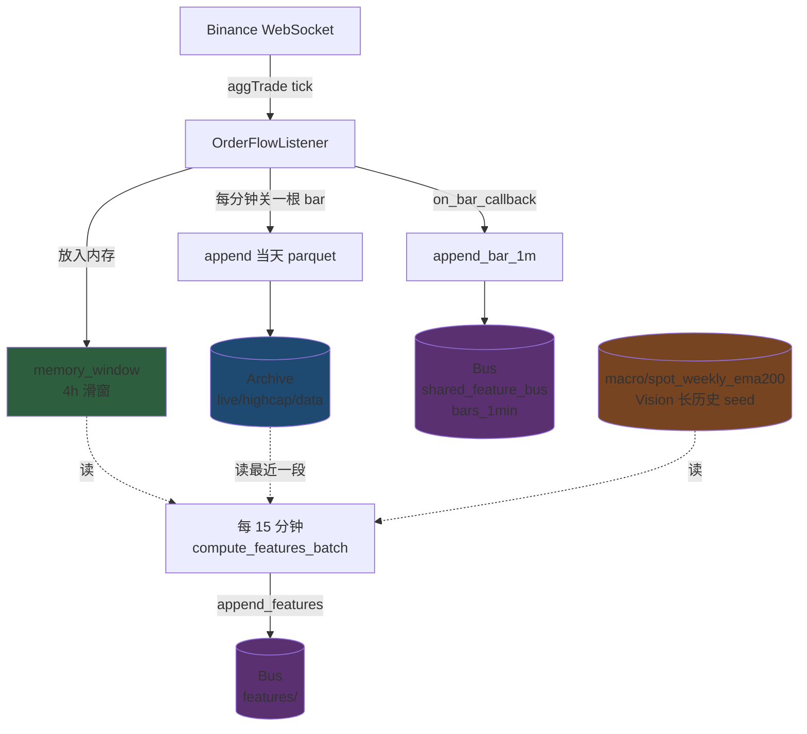
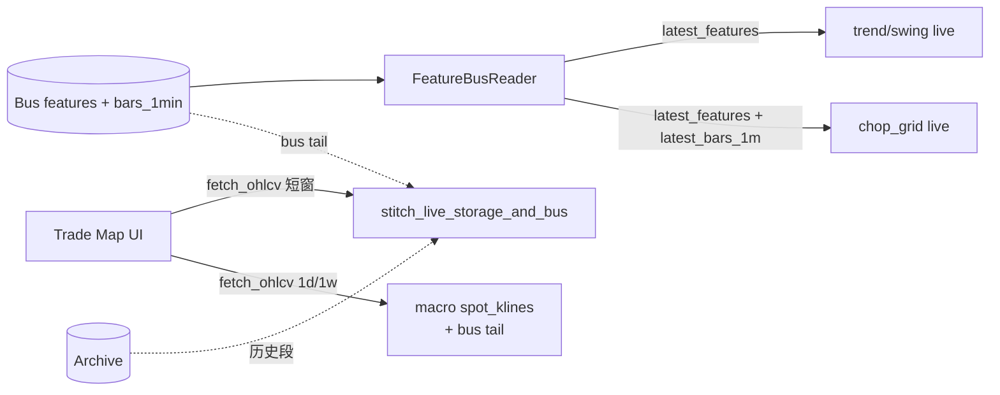

# 实盘三层数据管线（Archive / Memory / Bus）

本文澄清 `quant-feature-bus` 容器内部的数据流向，以及下游策略和 Trade Map 各自从哪一层读数据。配套节拍说明见 [`LIVE_CADENCE_AND_STORAGE_CN.md`](LIVE_CADENCE_AND_STORAGE_CN.md)。

## TL;DR

- **Archive、Memory、Bus 是三个独立的存储层**，由 `quant-feature-bus` 在 tick 进入时**并行**写入；不是一个层流向另一个层。
- **特征计算只读 archive + memory，不读 bus**。Bus 是 publisher 的输出，给下游策略和 Trade Map 用。
- **Warmup 不创造 archive 也不写 bus**：它只在容器启动时从 archive 读一段，恢复 memory 的滑窗状态。
- **Trade Map 长历史靠 archive + macro daily 拼接**，bus 不必长。

## 三层数据

| 层 | 路径 | 内容 | 容量 / 保留 | 写入方式 |
|----|------|------|------------|----------|
| **Archive** | `live/highcap/data/bars/<SYMBOL>/<YYYY-MM-DD>.parquet` 等 | 按天分片的 1m bars / ticks / features | 长期保留（数月-数年） | WS tick → `OrderFlowListener` 跨分钟时 append 当天 parquet |
| **Memory** | 进程内存 `MemoryWindow` | 最近 4h 的 1m bars 和 tick buffer | 4h 滚动（`memory_window_hours`） | WS tick → `OrderFlowListener.add` |
| **Bus** | `live/shared_feature_bus/bars_1min/<SYMBOL>.parquet` 与 `features/<TF>/<SYMBOL>.parquet` | 滚动 1m bars + 已算好的特征 | 由 `max_rows`/`warmup_days` 控制，**不是天数也不是事件队列** | WS bar 关闭 → `on_bar_callback` → `append_bar_1m`；compute 完成 → `append_features` |

另一个独立数据：**`live/highcap/data/macro/spot_klines/`** 与 **`spot_weekly_ema200/`**，由 Vision spot daily 转出来，专供 publisher 启动时计算 weekly EMA200 种子，以及 Trade Map 长窗口（1d/1w）。

## 数据流（Publisher 内部）



关键点：

- **Archive 和 Bus 独立写入**：tick 进来时一并触发两边 append，bus 不是"压缩存档"，archive 不是"由 bus 滚出来"。
- **特征计算只用 archive + memory**：见 `OrderFlowListener._compute_15min_features` → `_merge_bars(bars_disk, bars_buffer)` → `compute_features_batch`。
- **Bus 是输出端**：features 通过 `FeatureBusDecisionSink` 写入 `bus/features/<TF>/`；1m bars 通过 `on_bar_callback` 写入 `bus/bars_1min/`。

## Warmup 真正做了什么

`MultiSymbolManager.warmup_all(days=180)` → `OrderFlowListener.warmup` → `_restore_state`：

```
特征计算已改为磁盘批量模式 (compute_features_batch)，
不再需要通过回放 bars/ticks 重建流式状态。
```

含义：

1. 从 `storage_manager` 读最近 N 天数据（**只读 archive，不写 bus**）。
2. 把最近一批 1m bars 放入 `memory_window`，让滑窗"非空"。
3. 恢复 `last_feature_compute_time` 等时间戳，避免启动后立即重复计算。

> **不会**把 N 天数据 dump 到 bus parquet。Bus 仍然是从启动时点 0 开始累积 1m bars。

## 下游消费者从哪里读



| 消费者 | 读 archive | 读 memory | 读 bus | 读 macro daily |
|--------|------------|-----------|--------|----------------|
| Publisher 内部 `compute_features_batch` | ✅ 主历史 | ✅ 最近 4h | ❌ | ✅ weekly EMA200 seed |
| trend/swing live (`run_live.py`) | ❌ | ❌ | ✅ features + bars | ❌ |
| chop_grid live (`run_multi_leg_live.py`) | ❌ | ❌ | ✅ features + bars | ❌ |
| Trade Map UI 短窗 (15min, 2h) | ✅ stitch | ❌ | ✅ stitch | ❌ |
| Trade Map UI 长窗 (1d, 1w) | ❌ | ❌ | ✅ tail | ✅ 主历史 |

策略消费 bus 时通常只取**最新一行**或 `bars_lookback=240`（≈ 4 小时），与 bus 总长度无关。

## Bus 容量的真实含义

`scripts/run_market_feature_publisher.py` 启动时：

```python
max_rows = effective_max_rows_for_warmup(args.max_rows, args.warmup_days)
```

```python
def effective_max_rows_for_warmup(max_rows: int, warmup_days: int) -> int:
    """Parquet rolling cap must cover warmup window or console only sees ~2d of 1m bars."""
    cap = int(max_rows)
    days = int(warmup_days)
    if days <= 0:
        return cap
    return max(cap, days * 24 * 60)
```

线上 systemd 是 `--max-rows 3000 --warmup-days 180` → 上限 **259200 行（180 天）**。

但 **bus 实际行数 = 容器持续运行的分钟数**：

- 容器刚启动 → bus = 0 行
- 运行 1 天 → bus ≈ 1440 行
- 运行 5 天 → bus ≈ 7200 行
- 运行 ≥ 180 天 → bus 触顶 259200 后开始 tail

注释里"warmup window"的来历是历史的：在 Trade Map 加 stitching 之前，console 只读 bus，所以 bus 必须能装下完整可视窗口。**stitching 实现后，这个上限可以缩到 1 周（10080 行）就够策略 lookback 用**，UI 长历史靠 archive / macro 拼接。

### 性能对比（粗估）

| `max_rows` | 时间跨度 | parquet 大小 | `pd.read_parquet` 全量读 |
|-----------|----------|--------------|----------------------------|
| 5,000 | ~3.5 天 | ~200 KB | ~10 ms |
| 10,080 | ~7 天 | ~400 KB | ~20 ms |
| 259,200 | ~180 天 | ~10 MB+ | ~500 ms+ |

下游每分钟 poll，每个 symbol 都全量读，所以缩短 bus 对内存和延迟都有收益。

## 一次性 Backfill 的 non-shrinking 语义

`scripts/sync_feature_bus_bars_from_archive.py` 调用 `merge_bars_1m(..., preserve_history=True)`：

- **不**应用 `tail(max_rows)`，所以脚本默认 `max_rows=5000` 不会把 prod 已有的 ~7000 行 bus 砍短。
- 在线 publisher 走默认 `preserve_history=False`，仍然按 `max_rows` 滚动。

`auto_gap_fill` 把补出来的 bar 同步进 bus 时也走 `preserve_history=True`，原因相同。

## 配置建议

| 项 | 当前 prod | 建议 | 理由 |
|----|----------|------|------|
| `--warmup-days` | 180 | 7 | warmup 不再被特征计算依赖（已改磁盘批量模式）；策略 lookback 通常几小时 |
| `--max-rows` | 3000 | 10080 | 1 周 1m bars，覆盖最大策略 lookback 还有余量 |
| `MLBOT_AUTO_GAP_FILL_MIN_GAP_MINUTES` | 60 | 视需求 | <60min 小洞 archive 自身就有，影响 Trade Map 显示但不影响特征 |

调整后 bus parquet 从 10 MB 量级降到几百 KB，每分钟全量读耗时也相应降下来。

## 排查路径

1. **Trade Map 看到 K 线断开** → 先看 archive 是否完整（`/app/live/highcap/data/bars/<SYM>/<date>.parquet`）；如果 archive 完整、bus 有洞，跑 `sync_feature_bus_bars_from_archive.py`。
2. **策略读不到最新 bar** → 检查 publisher `_make_bar_write_callback` 是否 throw、`bus/bars_1min/<SYM>.parquet` 的 mtime 是否在更新。
3. **特征计算失败** → 看 publisher 日志 `compute_features_batch`；这条路径不依赖 bus，问题多在 archive / memory 端。
4. **weekly EMA200 异常** → 检查 `live/highcap/data/macro/spot_weekly_ema200/` seed 是否存在。
