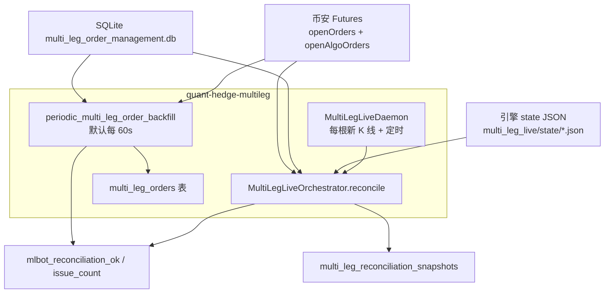
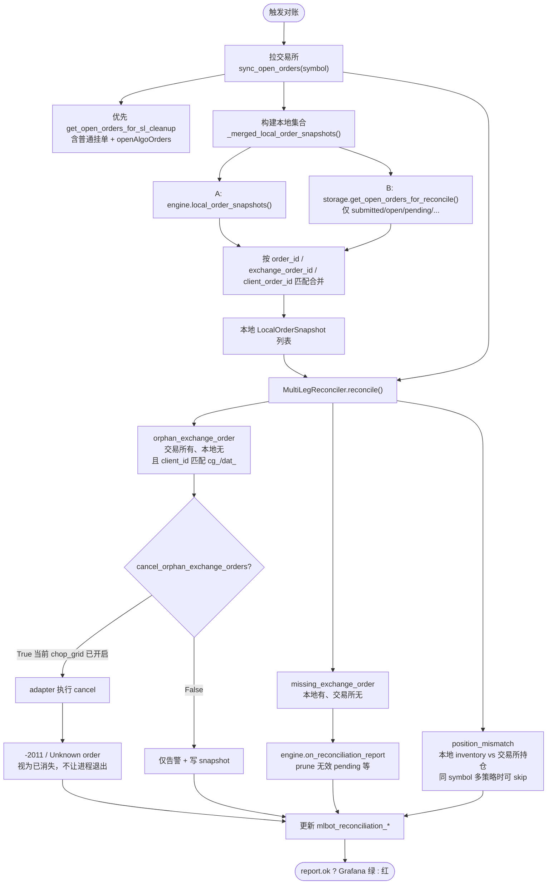
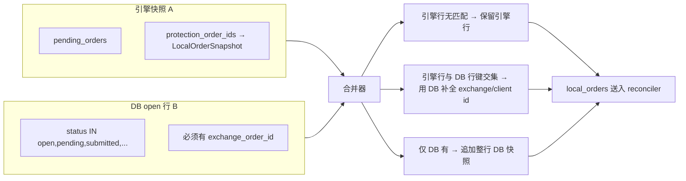
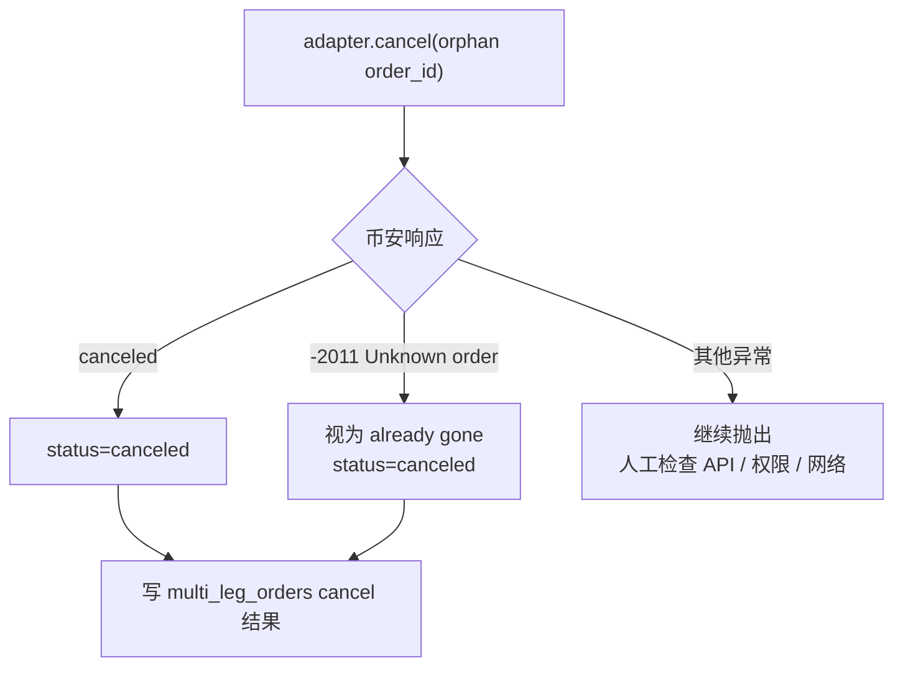
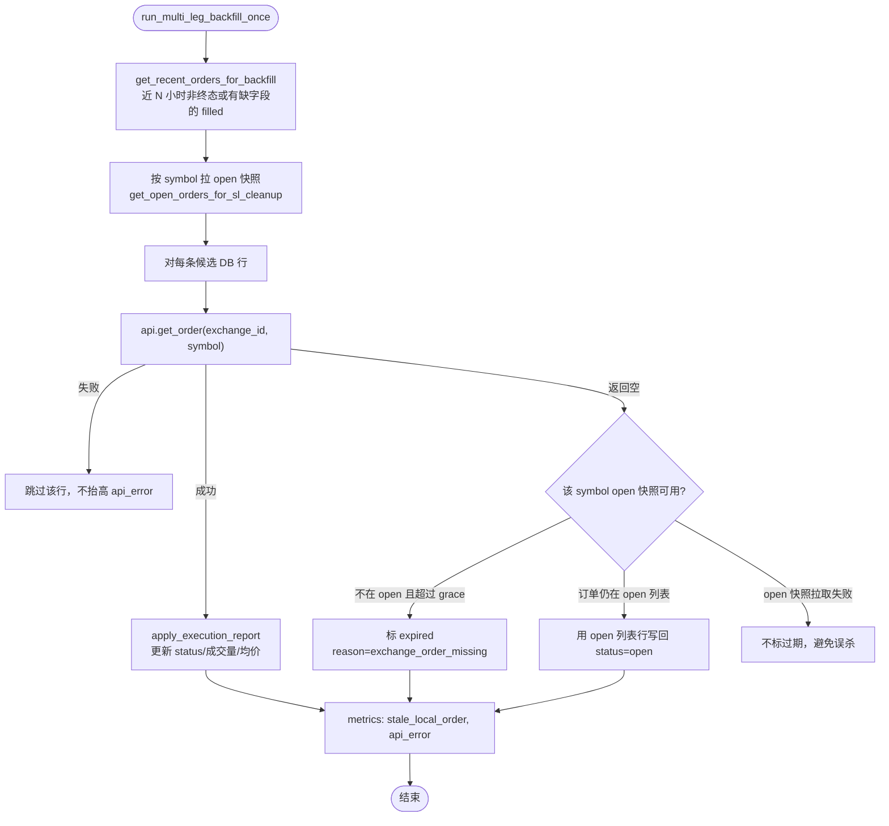
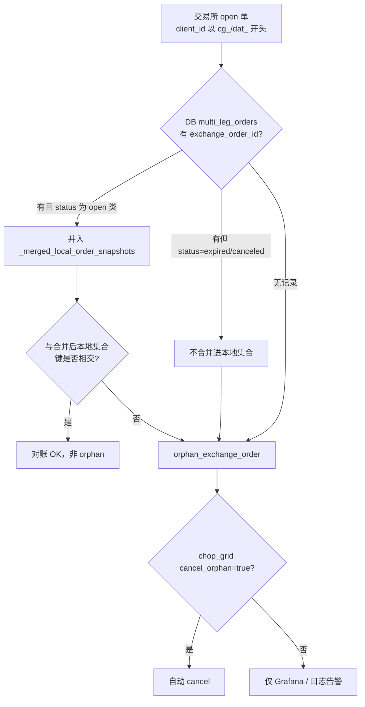

# Hedge 多腿对账机制说明

本文说明 `quant-hedge-multileg` 如何把 **引擎内存状态**、**SQLite 订单库** 与 **币安交易所挂单/持仓** 对齐，以及 2026-05-22 生产 `chop_grid / BNBUSDT` 误报问题的根因与修复。

相关代码：

| 模块 | 路径 |
|------|------|
| 守护进程循环 | `src/order_management/multi_leg_daemon.py` |
| 编排与对账入口 | `src/order_management/multi_leg_orchestrator.py` |
| 对账算法 | `src/order_management/multi_leg_reconciliation.py` |
| REST 补全 | `src/order_management/multi_leg_order_backfill.py` |
| 订单持久化 | `src/order_management/multi_leg_storage.py` |
| 交易所拉单 | `src/order_management/grid_execution_adapter.py` → `binance_api.get_open_orders_for_sl_cleanup` |
| 策略配置 | `scripts/run_multi_leg_live.py` |
| Grafana 告警 | `deploy/monitoring/prometheus-rules/reconciliation_alerts.yml` |

---

## 1. 对账在系统里的位置

Hedge 账户（`quant-hedge-multileg`）与 Trend 账户分离。对账只关心 **本进程策略前缀** 的订单：

| 策略 | client_id 前缀 | 示例 |
|------|----------------|------|
| `chop_grid` | `cg_` | `cg_5b030aa6a6ac` |
| `trend_scalp` / `dual_add_trend` | `dat_` | `dat_xxxxxxxxxxxx` |

两条并行链路都会更新 Prometheus 指标 `mlbot_reconciliation_*`（`scope="hedge"`）：



---

## 2. 三类数据源（修复前误报的根源）

对账比较的是 **本地集合** vs **交易所集合**，不是单独看某一侧。

| 来源 | 内容 | 典型路径 | 重启后是否保留 |
|------|------|----------|----------------|
| **A. 引擎 JSON** | `pending_orders`、保护单 id、`inventory` | `/app/data/multi_leg_live/state/chop_grid_BNBUSDT.json` | 有文件则保留，但常与 DB 不同步 |
| **B. SQLite** | `multi_leg_orders` 全量下单记录 | `/app/data/multi_leg_order_management.db` | 持久化，是对账的权威补充 |
| **C. 交易所** | 当前账户下所有 open 限价/条件单 | REST `openOrders` + `openAlgoOrders` | 实时真相 |

**修复前的问题**：`reconcile()` 只读 **A**，不读 **B**。  
进程重启、state 被 prune、或保护单未写入 `protection_order_ids` 时，**B 里仍有 open 行**，对账会认为交易所有单、本地没有 → **orphan_exchange_order**。

**修复后**：`MultiLegLiveOrchestrator._merged_local_order_snapshots()` 合并 **A ∪ B（仅 status 仍为 open 的行）**，并按 `local_order_id` / `exchange_order_id` / `client_order_id` 做键匹配与补全。

---

## 3. 生产案例（2026-05-22 chop_grid BNBUSDT）

日志与 DB 快照一致：

```
multi-leg reconcile not ok: strategy=chop_grid symbol=BNBUSDT
  orphan_exchange_orders=2  missing=0  position_mismatch=0
```

| 交易所 order_id | client_id | 交易所 | DB `multi_leg_orders` | 引擎 JSON | 结论 |
|-----------------|-----------|--------|----------------------|-----------|------|
| `90489849398` | `cg_16738f8fae98` | limit buy open | **open**（`..._S1_tp`） | `pending_orders=[]`，`protection_order_ids=[]` | **误报 orphan**：DB 有，对账未合并 |
| `90414533226` | `cg_5b030aa6a6ac` | limit buy open | **expired**（`..._L2`，5/20 标过期） | 不在 pending | **真 orphan**：本地已放弃，交易所仍挂着 |

修复后预期：

- `90489849398` → 合并 DB open 行后 **不再报 orphan**
- `90414533226` → 仍为 orphan；`chop_grid` 已开启 `cancel_orphan_exchange_orders=True`，应由对账 **自动撤单**

---

## 4. 主对账流程（每策略 × 每 symbol）

触发时机（`MultiLegLiveDaemon`）：

1. 本 symbol 有新收盘 K 线且本策略要处理该 bar；或  
2. 距上次对账已超过 `reconcile_interval_seconds`（默认 60s）。



### 4.1 本地集合合并规则（核心修复）



**故意不做的事**：把 DB 里已是 `expired/canceled/filled` 的行重新当作 open 合并进来。  
否则会把引擎已放弃的网格单（如 `90414533226`）「洗白」，掩盖真实残留挂单。

### 4.2 交易所侧匹配键

对每一笔交易所 open 单，在 scope 内（`client_id` 以 `cg_` 或 `dat_` 开头）检查：

```
exchange_keys = { order_id, client_order_id }
local_keys    = { exchange_order_id, client_order_id, order_id(local) }
```

- 若 `exchange_keys ∩ local_keys = ∅` → **orphan**
- 若某本地行的 `local_keys` 与所有交易所单都不相交 → **missing**

### 4.3 Cancel 的幂等性（启动崩溃修复）

对账发现 orphan 后会发起 cancel。实际生产里可能出现竞态：open 快照里还能看到某个 `order_id`，但执行撤单时币安已经返回 `-2011 Unknown order sent.`。这代表订单在撤单前已经成交/撤销/过期或交易所快照短暂滞后，**不应让 `run_multi_leg_live.py` 退出**。

当前处理：



注意：`mlbot_reconciliation_ok` 和 `issue_count` 是按本轮 reconcile report 写入的，cancel 发生在 report 生成之后。因此本轮日志可能仍显示 `orphan_exchange_order=1`；若撤单成功或订单已消失，通常要等下一轮 reconcile 才会归零变绿。

---

## 5. REST Backfill 流程（并行，修 DB 状态）

与「对账」不同：backfill **不撤单**，只根据 REST 更新 `multi_leg_orders` 行状态，并单独打 `strategy=all, symbol=ALL` 指标。

默认：`MLBOT_MULTI_LEG_ORDER_BACKFILL_INTERVAL_SECONDS=60`（未设置环境变量时默认开启）。



要点：

| 行为 | 说明 |
|------|------|
| `get_open_orders_for_sl_cleanup` | 与对账同一套 open 列表，含 algo 条件单 |
| `api_error` | 仅当 **整 symbol** 拉 open 失败时计数，单笔 `get_order` 失败不再把全局标红 |
| `exchange_order_missing` | 仅当 REST 查不到单 **且** open 快照里也没有 **且** 超过 `MLBOT_MULTI_LEG_STALE_OPEN_GRACE_SECONDS`（默认 6h）才标 `expired` |
| DB 已 `expired` 但交易所仍 open | backfill **不会**改回 open；留给主对账标 orphan 并（对 chop_grid）自动 cancel |

---

## 6. 问题分类与处理策略

| 类型 | 含义 | 典型原因 | 自动处理 |
|------|------|----------|----------|
| **missing_exchange_order** | 本地认为有挂单，交易所没有 | 已成交/已撤但本地未更新；仅 local_id 无 exchange_id | 引擎 `on_reconciliation_report` prune；backfill 标 expired |
| **orphan_exchange_order** | 交易所有 `cg_`/`dat_` 单，本地集合没有 | ① DB open 未合并（已修）② DB expired 但交易所仍 open ③ 手工单 | `cancel_orphan_exchange_orders=True` 时自动 cancel |
| **position_mismatch** | 同 symbol 本地 inventory 与交易所持仓数量不一致 | 多策略共 symbol 时单引擎对不上全账户 | `skip_position_reconciliation=True`（配置） |
| **stale_local_order** | backfill 把本地 open 标 expired | 交易所确实无此 id | 仅更新 DB，不直接撤交易所 |
| **api_error** | 某 symbol 拉 open 快照失败 | 限频、网络 | 指标告警；不将空快照当作「交易所无单」 |

### 6.1 决策树：交易所上一笔 cg_ 单如何处理



---

## 7. Grafana 与告警

Dashboard：`Hedge · 订单对账`（`quant_strategy_map_hedge`）

| 指标 | 标签 | 含义 |
|------|------|------|
| `mlbot_reconciliation_ok` | `scope=hedge`, `strategy`, `symbol` | `1`=该标签组合最近一次对账通过，`0`=有问题 |
| `mlbot_reconciliation_issue_count` | `issue` = missing / orphan / position_mismatch / stale_local_order / api_error | 当前问题计数 |
| `mlbot_multi_leg_reconciliation_issues_total` | `strategy` | 累计失败次数（计数器） |

告警（`reconciliation_alerts.yml`）：

```promql
min(mlbot_reconciliation_ok{scope="hedge"}) == 0
or sum(mlbot_reconciliation_issue_count{scope="hedge"}) > 0
```

持续 3 分钟触发 **需人工检查**。  
注意：`strategy=all,symbol=ALL` 的 backfill 与 `chop_grid/BNBUSDT` 的 reconcile 是 **不同标签**，Grafana 上会同时出现多条 series。

---

## 8. 运维排查清单

### 8.1 看最近对账快照

```bash
docker exec quant-hedge-multileg python3 -c "
import sqlite3, json
c = sqlite3.connect('/app/data/multi_leg_order_management.db')
for row in c.execute('''
  SELECT created_at, strategy, symbol, ok, raw_json
  FROM multi_leg_reconciliation_snapshots
  ORDER BY created_at DESC LIMIT 5
'''):
    print(row[0], row[1], row[2], 'ok=', row[3])
    raw = json.loads(row[4] or '{}')
    for o in raw.get('orphan_exchange_orders', [])[:5]:
        print('  orphan', o.get('order_id'), o.get('client_order_id'), o.get('type'))
"
```

### 8.2 看 DB open 行 vs 引擎 state

```bash
# DB 仍 open 的 chop_grid BNBUSDT
docker exec quant-hedge-multileg python3 -c "
import sqlite3
c = sqlite3.connect('/app/data/multi_leg_order_management.db')
for r in c.execute('''
  SELECT local_order_id, status, exchange_order_id, client_order_id
  FROM multi_leg_orders
  WHERE strategy='chop_grid' AND symbol='BNBUSDT'
    AND lower(status) IN ('open','pending','submitted','partially_filled','new')
'''):
    print(r)
"

cat /opt/quant-engine/data/multi_leg_live/state/chop_grid_BNBUSDT.json | python3 -m json.tool
```

### 8.3 日志

```bash
journalctl -u quant-hedge-multileg --since "2 hours ago" | rg "reconcile not ok|orphan_exchange|reconcile cancels"
```

容器使用 `--rm` 且 systemd 会自动重启，启动失败时容器名可能在 `docker logs` 前已经消失。优先看 systemd 或持久化审计日志：

```bash
sudo journalctl -u quant-hedge-multileg -n 120 --no-pager
sudo tail -f /opt/quant-engine/data/multi_leg_live/state/logs/multi_leg_audit.log
sudo docker logs "$(sudo docker ps -q --filter name=quant-hedge-multileg)" --tail 100
```

### 8.4 人工处理原则

| 情况 | 建议 |
|------|------|
| 误报（DB open 未合并） | 部署含 `_merged_local_order_snapshots` 的版本，等待下一 reconcile 周期 |
| 真 orphan（DB expired，交易所仍 open） | 确认无仓位依赖后：可等自动 cancel，或币安手动撤 `90414533226` 这类单 |
| 保护单丢失（engine 无 protection_order_ids） | 部署后由 `actions_ensure_protection` 补挂；勿把 expired 行强行改回 open |
| 仅 api_error | 查币安 API / 限频；修复后仅 symbol 级拉单失败才报 |

---

## 9. 配置摘要

| 项 | 默认 / 说明 |
|----|-----------|
| `reconcile_interval_seconds` | 60（`run_multi_leg_live`） |
| `MLBOT_MULTI_LEG_ORDER_BACKFILL_INTERVAL_SECONDS` | 60；`0`/`off` 关闭 |
| `MLBOT_MULTI_LEG_STALE_OPEN_GRACE_SECONDS` | 21600（6h），backfill 标 expired 前等待时间 |
| `MLBOT_MULTI_LEG_RECONCILE_WARN_COOLDOWN_SECONDS` | 300，重复 reconcile 告警日志节流 |
| `cancel_orphan_exchange_orders` | **True**（chop_grid 与 trend_scalp 均已开启，修复后） |
| `client_id_prefixes` | `cg_` / `dat_` |
| `skip_position_reconciliation` | 同一 symbol 多策略时开启 |

---

## 10. 修复项与代码对应（审查结论）

| # | 问题 | 修复 | 文件 |
|---|------|------|------|
| 1 | 对账只看 engine JSON，重启后误报 orphan | `_merged_local_order_snapshots()` 合并 DB open 行 | `multi_leg_orchestrator.py`, `multi_leg_storage.py` |
| 2 | 引擎只有 local_id、DB 有 exchange_id 仍不匹配 | 键交集时用 DB 补全 `exchange_order_id` / `client_order_id` | `multi_leg_orchestrator.py` |
| 3 | open 列表不含 algo TP/SL | `sync_open_orders` → `get_open_orders_for_sl_cleanup` | `grid_execution_adapter.py` |
| 4 | chop_grid 不自动撤真 orphan | `cancel_orphan_exchange_orders=True` | `run_multi_leg_live.py` |
| 5 | backfill 单笔失败拉高 api_error | 仅 symbol 级 open 拉取失败计 `api_error` | `multi_leg_order_backfill.py` |
| 6 | 不应把 DB expired 洗回 open | `get_open_orders_for_reconcile` 仅 open 类 status；不纳入 expired | `multi_leg_storage.py` |
| 7 | 恢复 open 时清理旧 error_message | `apply_execution_report` 非终态时清空 `canceled_at` / `error_message` | `multi_leg_storage.py` |
| 8 | orphan cancel 遇到 `-2011 Unknown order` 会导致进程启动后崩溃 | 将该错误视为订单已消失，返回 `canceled`，其他异常仍抛出 | `grid_execution_adapter.py` |

测试：`tests/order_management/test_multi_leg_orchestrator.py`、`test_multi_leg_order_backfill.py`、`test_multi_leg_storage.py` 等（合并修复相关用例）。

---

## 11. 部署后验收

1. 重启或热更新 `quant-hedge-multileg` 后等待 ≥1 个 reconcile 周期（约 60s）。  
2. Grafana `Hedge · 对账状态` 由红变绿，或 `orphan_exchange_order` 仅剩真残留（应随后被 cancel 掉）。  
3. `chop_grid_BNBUSDT` 快照中 `90489849398` 不应再出现在 `orphan_exchange_orders`。  
4. 若 `90414533226` 仍在交易所，日志应出现 `multi-leg reconcile cancels` 随后 orphan 计数归零。

---

## 12. 与 Trend 对账的差异（避免混淆）

| 维度 | Trend (`scope=trend`) | Hedge (`scope=hedge`) |
|------|----------------------|------------------------|
| 进程 | `quant-trend-swing` | `quant-hedge-multileg` |
| 本地状态 | `order_management.db` + `positions` | engine JSON + `multi_leg_orders` |
| 订单模型 | 单仓位 PCM | 多挂单 + 多腿 inventory |
| 前缀过滤 | 按 account / order_type | 按 `cg_` / `dat_` client_id |
| 自动修复 | terminal backfill 等 | reconcile 合并 DB + orphan cancel |

两者 Grafana 面板相似，但 **DB 路径、合并逻辑、自动撤单策略均不同**，不可直接套用 Trend 的排查步骤。
