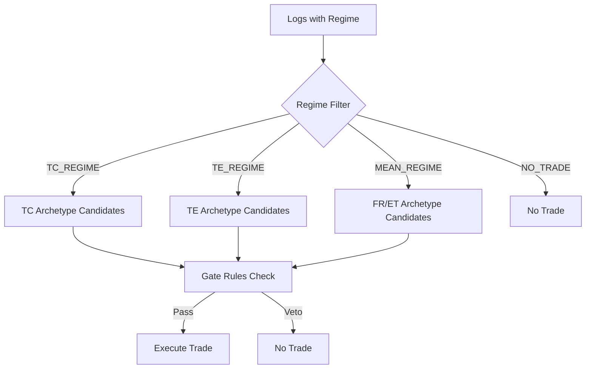
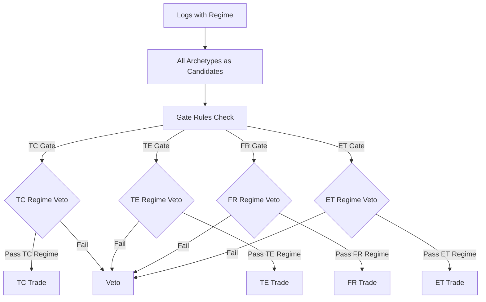

# Optional Blocks和Regime架构优化分析报告

**实验日期**: 2026-01-22  
**实验目的**: 分析三个问题：1) optional_blocks_enabled的去留；2) ET数据缺失原因；3) 将regime放到gate veto列表的架构优化

---

## 问题1: optional_blocks_enabled的去留分析

### 当前使用情况

通过分析所有TaskSpec文件，发现：

| TaskSpec文件 | optional_blocks_enabled | 说明 |
|-------------|------------------------|------|
| `task_spec_highcap6_2024_202510.yaml` | `['vpin_block']` | 用户显式指定 |
| 其他TaskSpec文件 | `[]` | 空或未设置 |

### 自动推导覆盖情况

对`task_spec_highcap6_2024_202510.yaml`的分析结果：

- **自动推导的blocks**: `['volume_profile_block', 'vpin_block']`
- **用户显式指定的blocks**: `['vpin_block']`
- **最终启用的blocks**: `['volume_profile_block', 'vpin_block']`
- **自动推导额外检测到**: `['volume_profile_block']` ✅

**结论**: 自动推导完全覆盖用户需求，甚至检测到了用户未指定的`volume_profile_block`。

### 评估和建议

**不建议完全去掉`optional_blocks_enabled`**，原因：

1. **自动推导只覆盖gate/regime需求**：
   - 自动推导只检测gate rules和evidence rules需要的blocks
   - 如果用户想要额外的blocks用于模型训练（但不被gate/regime使用），需要显式指定

2. **向后兼容**：
   - 现有TaskSpec可能依赖显式配置
   - 完全去掉会破坏现有工作流

3. **建议方案**：
   - **保留`optional_blocks_enabled`**，但明确语义：
     - **自动推导**: gate/regime需要的blocks（必须计算）
     - **用户显式指定**: 模型训练需要的额外blocks（可选）

### `optional_blocks`的两个作用

1. **定义额外特征**：tier0~1没有的特征，需要额外计算并输入模型
2. **定义mask范围**：即使特征已在tier0~2中，也可以标记为optional以便训练时mask（提高鲁棒性）

---

## 问题2: ET数据缺失分析

### 当前状态

从实验结果看：
- **MEAN_REGIME总样本数**: 27
- **ET候选数**: 0
- **FR候选数**: 27

### 可能原因

1. **MEAN_REGIME样本数太少**：
   - 只有27个样本，FR已经占用了全部
   - ET没有剩余样本

2. **Gate Rules太严格**：
   - ET的gate rules有10个`deny_if`规则
   - 需要满足6个`allow_if`中的至少1个（`allow_mode: any`）
   - `default_action: deny`意味着默认拒绝

3. **Evidence Rules太严格**：
   - ET需要`has_orderflow`（vpin quantile > 0.55）
   - 需要`has_volume_profile`（any_key_contains）
   - 需要`has_momentum_decay`和`has_vol_climax`

4. **FR优先级更高**：
   - 当前逻辑：regime → 选择archetype候选 → gate检查
   - 如果MEAN_REGIME中FR优先级更高，ET可能被跳过

### 优化建议

1. **放宽MEAN_REGIME分类条件**：
   - 当前MEAN_REGIME样本数太少（27个）
   - 建议进一步放宽MEAN_REGIME分类条件，增加样本数

2. **放宽ET的gate rules**：
   - 降低`allow_if`阈值
   - 增加`allow_if`选项
   - 考虑放宽`deny_if`规则

3. **放宽ET的evidence rules**：
   - 降低`has_orderflow` quantile（当前0.55）
   - 检查`has_volume_profile`相关特征是否可用

4. **检查ET在gate决策中的优先级**：
   - 确保ET和FR有平等的竞争机会
   - 考虑使用score-based选择而不是优先级

---

## 问题3: 将regime放到gate veto列表的架构优化

### 当前架构



**问题**：
- Regime是全局的，每个regime只能有固定的archetypes
- 无法为每个archetype定义自己的regime要求
- Regime和gate是分离的，无法统一管理

### 建议架构（将regime作为gate veto）



### 优势

1. **每个archetype有自己的regime要求**：
   - TC可以要求`regime == TC_REGIME`（取反：`regime != TC_REGIME` → veto）
   - FR可以要求`regime == MEAN_REGIME`（取反：`regime != MEAN_REGIME` → veto）
   - 更灵活，可以定义复杂的regime组合

2. **统一管理**：
   - Regime和gate rules在同一个地方（`execution_archetypes.yaml`）
   - 更容易理解和维护

3. **更符合regime定义**：
   - Regime是"市场状态"，archetype是"执行策略"
   - 每个策略应该定义自己适合的市场状态
   - 取反逻辑：不符合regime要求 → veto（更直观）

4. **更容易找到平稳参数**：
   - 可以单独优化每个archetype的regime要求
   - 可以定义regime的宽松/严格程度
   - 后续优化evidence时，regime和evidence可以独立调参

### 实施建议

1. **在gate rules中添加regime veto规则**：
   ```yaml
   gate_rules:
     rules:
       - name: tc_regime_mismatch
         kind: value_ne  # value not equal
         key: regime
         value: TC_REGIME
         on_missing: false
       # ... 其他gate rules
     deny_if: [tc_regime_mismatch, ...]
   ```

2. **移除regime filter逻辑**：
   - 从`apply_tree_gate_3action.py`中移除regime过滤（~30行代码）
   - 所有archetypes都作为候选
   - 让gate rules统一处理regime检查

3. **更新live config**：
   - `meta_router_live_config.yaml`中的`enabled_archetypes`可以保留
   - 但主要用于优先级排序，而不是过滤

### 迁移成本评估

**代码修改**：
- `scripts/apply_tree_gate_3action.py`: 移除regime filter逻辑（~30行）
- `config/nnmultihead/execution_archetypes.yaml`: 为每个archetype添加regime veto规则
- `config/nnmultihead/live/meta_router_live_config.yaml`: 更新enabled_archetypes语义（可选）

**测试需求**：
- 验证所有archetype的regime veto规则正确工作
- 验证gate决策逻辑与之前一致
- 验证KPI报告正确性

**风险级别**: Medium

**向后兼容**: 需要保持向后兼容（通过`--disable-regime-filter` flag）

---

## 结论

1. **optional_blocks_enabled**: 
   - ✅ 保留，但明确语义
   - 自动推导覆盖gate/regime需求
   - 用户显式指定用于模型训练需求

2. **ET数据缺失**:
   - ⚠️ MEAN_REGIME样本数太少
   - ⚠️ Gate rules和evidence rules太严格
   - 💡 建议放宽MEAN_REGIME条件和ET规则

3. **Regime架构优化**:
   - ✅ 建议将regime作为gate veto
   - ✅ 优势明显，迁移成本可控
   - 💡 建议分阶段实施

---

**最后更新**: 2026-01-22  
**状态**: ✅ 分析完成
