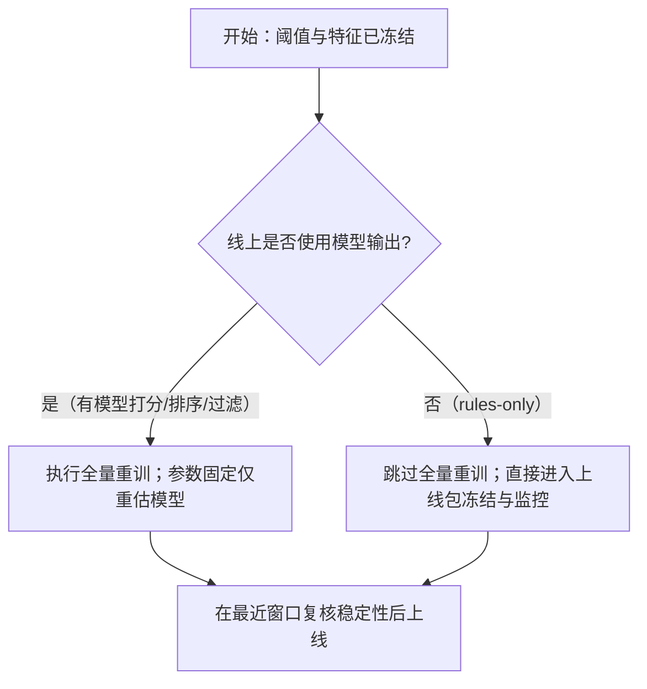

# 研究模式与上线流程

> **过时口径（2026-06）**：文中 **Mode Drift-Only** / `auto_research_pipeline --compare-only` 仍未做成独立轻量管线。  
> **当前漂移监控**请用 [`漂移监控_mlbot_monitor_CN.md`](../../../strategy/漂移监控_mlbot_monitor_CN.md) 的 **`mlbot monitor`**（本地与远程同命令，不改 yaml）。

本文用于固化当前管线的三种运行模式，并明确一个关键点：  
当实盘是 **rules-only（只使用 YAML 规则）** 时，阈值与特征冻结后，通常 **不需要全量重训**。

---

## 1) 核心结论（先看这个）

- 你当前前提：FER 实盘只执行规则，不依赖模型实时输出。
- 在这个前提下，`prefilter/gate/entry_filter` 阈值与特征一旦冻结，实盘行为已确定。
- 因此“全量重训”不会改变线上决策逻辑，最多只会改变离线分析里的模型参数。
- 结论：**rules-only 线上可以跳过“全量重训”步骤**，重点放在阈值重调与滚动稳定性验证。

一句话：  
**调阈值是做决策；重训是重新估计模型参数。若线上不用模型，重训收益很小。**

---

## 2) 三种模式定义

## Drift Mode（漂移监控）

目标：
- 监控近期表现和分布漂移，判断是否需要进入调优或重建。

输入：
- 当前生产配置（冻结规则）。
- 最新窗口数据（例如按月滚动）。

输出：
- 漂移等级、性能趋势、告警信息。
- 不改生产规则，仅给出“继续观察 / 进入 Retune / 进入 Generate”建议。

是否改配置：
- **否**（只监控，不落地改动）。

---

## Threshold Retune Mode（阈值重调）

目标：
- 固定语义结构（尤其 `locked: true` 规则），只调阈值以适配当前窗口。

输入：
- 生产 `prefilter.yaml`（含 locked 规则）。
- `locked_threshold_tuning` 网格与评分配置（如 `min_trades_target`、`trade_penalty`）。

输出：
- 各参数组合对比结果（`summary.csv/summary.json`）。
- 每个窗口最优阈值候选与聚合统计（median sharpe、positive ratio、median trades）。

是否改配置：
- **可选**：通常先 `--no-adopt` 做研究；通过门槛后再 adopt 到生产。

---

## Generate Mode（重建模式）

目标：
- 重建规则结构（特征集、规则集合、候选门控），用于大幅升级或语义重构。

输入：
- 完整研究配置（特征、门控、fallback、扫描策略）。

输出：
- 新的实验版 `prefilter/gate/entry_filter` 规则集。
- 经过对比后决定是否 adopt。

是否改配置：
- **是**（属于结构级改动，需严格回测与滚动验证）。

---

## 3) 是否需要“全量重训”：判定树

---

## 4) 两个直观例子

## 示例 A：rules-only（你当前场景）

- 线上只读取：
  - `archetypes/prefilter.yaml`
  - `archetypes/gate.yaml`
  - `archetypes/entry_filters.yaml`
- 这些规则文件冻结后，线上每一笔是否开仓由固定阈值决定。
- 即使你再跑一次“全量重训”，只要规则文件没变，线上行为不会变。

结论：
- 不必为上线额外做全量重训；
- 该做的是滚动验证 + 阈值重调 + 漂移监控。

---

## 示例 B：线上仍使用模型

- 假设线上有一个模型分数 `score` 用于二次过滤（例如 `score > 0.62`）。
- 阈值 `0.62` 不变，但模型参数会随训练数据变化。
- 这时“全量重训”可让模型参数估计更稳（样本更多），可能改变线上 `score` 分布与决策边界附近样本命运。

结论：
- 若线上有模型参与，建议保留“全量重训”步骤。

---

## 5) 你们当前推荐流程（rules-only）

1. **Drift Mode**：持续监控，不改生产配置。  
2. **Threshold Retune Mode**：仅调 locked 阈值（支持自动调优 + 缓存）。  
3. **对比实验**：在同一评估标准下比较 `4H` 与 `60T`。  
4. **上线冻结**：确定最终规则后，冻结 YAML + 记录版本与窗口。  
5. **上线后监控**：若漂移升高，再回到 Retune；结构性失效再进 Generate。

---

## 6) 常见误解澄清

- “validation_months=0 就是不调阈值”  
  - 不是。表示不再切分 Val/Test，直接用 holdout 做阈值决策。

- “全量重训一定要做”  
  - 不是。是否需要取决于线上是否使用模型输出。

- “锁定规则就不需要滚动验证”  
  - 不是。锁定语义只防止结构漂移，不代表阈值在新 regime 一定仍最优。

---

## 7) 术语对照

- **调阈值（Retune）**：在固定语义下做参数决策。
- **重建（Generate）**：重做特征/规则结构。
- **全量重训（Refit）**：固定规则后重新估计模型参数（仅模型型线上有明显价值）。
- **冻结上线包**：固定配置版本，确保可复现与可审计。

---

## 8) 精简模式（最终口径）

为减少歧义，采用 3+1 结构：
- **Mode A（一次性）**：Locked 语义有效性验证（baseline vs locked）。
- **Mode Build（常规主模式）**：日常研究与产规（合并原 B/C）。
- **Mode Drift-Only**：纯监控，不改规则。
- **Release Calibration（Build 的上线子流程）**：固定结构后，用最近 3 个月做阈值校准并冻结上线包。

---

## 9) Mode Build（合并 B/C）规则

`Build` 内部通过 `prefilter_policy` 区分，不再单列 B/C：
- `prefilter_policy=locked_retune`（默认推荐）：保留 locked 语义，只调阈值。
- `prefilter_policy=regenerate`（漂移大时）：允许 prefilter 结构重建。

共同点（两种 policy 都成立）：
- gate / entry_filter 都可继续优化（当前流程就是这样）。
- 建议研究阶段统一 `--no-adopt`。

---

## 10) 命令级映射表（简版）

| 模式 | 目标 | 命令模板 | 主要输出 |
|---|---|---|---|
| Mode A（一次性验证） | 证明 locked 语义是否优于 baseline | `for d in ...; do mlbot pipeline run --strategy fer-short --end-date "$d" --no-adopt; done` + `python scripts/tune_locked_prefilter_thresholds.py --strategy fer-short --end-dates ...` | `report.json`、`results/locked_tuning/.../summary.csv` |
| Mode Build（主模式） | 产出/更新 prefilter+gate+entry_filter | `mlbot pipeline run --strategy fer-short --end-date 2026-03-01 --no-adopt` | 实验快照、`report.json`、候选 YAML |
| Mode Drift-Only（监控） | 仅判断是否 shift | `python scripts/auto_research_pipeline.py --strategy fer-short --compare-only --end-date 2026-03-01` | 漂移报告与升级建议 |

---

## 11) 现状与缺口（用于后续开发 mode 参数）

- **已具备**：Build 全流程、locked 阈值自动调优、漂移分析能力。
- **缺口**：尚无显式 `--mode` / `prefilter_policy` 参数，当前靠配置意图与命令组合实现。

---

## 12) 待办清单（按实现优先级）

### P0（先做）

- [ ] 显式模式参数：在管线增加 `--mode`（`validate_locked` / `build` / `drift_only`）。
- [ ] 显式 prefilter 策略参数：增加 `--prefilter-policy`（`locked_retune` / `regenerate`），避免靠“删配置”隐式切换。
- [ ] Drift-Only 独立流程：只跑评估与漂移报告，不触发规则生成、不触发 adopt。
- [ ] Drift 判定门槛固化：定义可配置阈值（如 `nonzero_trade_ratio`、`median_sharpe`、`drift_level`）和升级条件（进入 `regenerate`）。

### P1（很重要）

- [ ] Locked 平坦高原验证：在 `locked_threshold_tuning` 结果中增加 plateau 评分/筛选，不只取单点最优。
- [ ] baseline vs locked 自动对比编排：一条命令完成双分支多窗口运行与统一汇总结论。
- [ ] Build 产物审计：在 `report.json` 固化 `mode`、`prefilter_policy`、关键阈值来源（手动/自动/缓存）。

### P2（增强）

- [ ] Release Calibration 子流程命令化：固定结构后执行“最近3个月阈值校准 + 冻结上线包”。
- [ ] 模式运行模板落地到 `A快速启动命令.md`（每种模式 1 条可直接复制命令）。

### 现状说明（你关心的几个点）

- 现在 `--no-adopt` 只是不采纳，不等于 Drift-Only；它仍会跑完整研究链。
- 删除 locked 规则后，prefilter 通常会更接近“重生成”路径（不再受 locked 语义约束）。
- locked 阈值自动调优已是默认能力（满足配置/规则条件时触发），但尚未内置平坦高原判定。
