# SL Trailing 逻辑与交易所同步

> 最后更新：2026-06-12
> 相关代码：`src/order_management/position_tracker.py`、`src/time_series_model/live/position_logic.py`

---

## 1. 整体链路

```mermaid
graph TD
    A[每 bar enforce_all] --> B[enforce_position]
    B -->|profit_r >= activation_r| C[首次激活 trailing]
    C -->|trailing_activation_bar=true| D[本 bar 不触发 SL]
    B -->|已激活| E[更新 HWM/LWM]
    E -->|long: trail_sl = HWM - trail_r×atr| F[仅向有利方向收紧]
    E -->|short: trail_sl = LWM + trail_r×atr| F
    F -->|stop_loss_price 变了| G[_maybe_sync_exchange_sl]
    G -->|取 mark price| H{mark 已破 stop?}
    H -->|是| I[market close 直接平]
    H -->|否| J[place STOP_MARKET]
    J -->|-4130| K[cancel closePosition 条件单 → retry]
    J -->|-4509| L[reconcile 本地幽灵仓]
    J -->|成功| M[存 _exchange_sl_order_id]
    B -->|SL hit| N[close via MARKET<br/>close_position=false]
```



---

## 2. 各环节详解

### 2.1 激活条件

```python
# position_logic.py §4 Activation trailing
profit_r = (check_price - entry_price) / pos_atr   # long
profit_r = (entry_price - check_price) / pos_atr   # short
if profit_r >= activation_r:  # TPC: 3.5R
    pos["trailing_activated"] = True
    pos["trailing_activation_bar"] = True  # 本 bar 不触发 SL
```

### 2.2 收紧方向（tighten-only）

- **long**：`trail_sl = HWM - trail_r × trail_base_atr`，仅当 `trail_sl > old_sl` 时更新
- **short**：`trail_sl = LWM + trail_r × trail_base_atr`，仅当 `trail_sl < old_sl` 时更新

保证 SL 只向有利方向移动，不会放宽。

### 2.3 交易所同步（`_maybe_sync_exchange_sl`）

| 步骤 | 操作 | 错误码 | 处理 |
|------|------|--------|------|
| 1 | 取 mark price | — | 从 ticker 或 positions 接口 |
| 2 | 检查 -2021 | `mark ≤ stop`（long）/ `mark ≥ stop`（short） | 直接 market close，不挂 STOP |
| 3 | Cancel 旧 SL | — | 首次挂单跳过 |
| 4 | Cancel closePosition 条件单 | — | 清坑位 |
| 5 | Place STOP_MARKET | -4130 | Cancel all closePosition STOP/TP → retry ×1 |
| 6 | — | -4509 | reconcile：交易所 flat → 清本地幽灵仓 |
| 7 | 成功 | — | 记录 `_exchange_sl_order_id` + `_exchange_sl_price` |

### 2.4 SL 归属（每 symbol+side 一个 owner）

多笔同向持仓共享一张 `closePosition=true` 的 STOP_MARKET 单，由 `_exchange_sl_owner_pid` 选出一个 owner。加仓子仓（`_is_add_position` + `_inherit_parent_stop`）不重复挂 SL。

### 2.5 重启恢复

```
restore_from_disk()
  → 读 JSON 快照 → 恢复 positions
  → _persist_position_record() → 回写 SQLite
  → ensure_exchange_stop_losses() → 补挂交易所 SL
```

### 2.6 MARKET 平仓

- `close_position=False`（修复 -4136：Binance 禁止 MARKET + closePosition）
- `reduce_only=True`

---

## 3. 错误码速查

| 错误 | 含义 | 处理 |
|------|------|------|
| -2021 | STOP 价格已破 mark | 直接 market close |
| -4130 | 已有 closePosition 条件单占坑 | cancel 后 retry |
| -4136 | MARKET 不能带 closePosition | 已修：默认不下 closePosition |
| -4509 | 交易所无持仓（GTE 需要 open position） | reconcile 清本地幽灵仓 |

---

## 4. TPC 默认参数

| 参数 | 值 | 说明 |
|------|-----|------|
| `activation_r` | 3.5 | trailing 激活所需 R |
| `trail_r` | 6.0 | trailing ATR 倍数 |
| `trail_expand_primary_atr` | true | 用主 TF ATR 做底 |
| `breakeven.enabled` | true | 启用保本 |
| `breakeven.trigger_r` | 6.0 | 保本触发 R |
| `breakeven.lock_level_r` | 2.0 | 锁仓 R 水平 |
| `structural_exit` | ema1200 | 结构退出信号源 |
| `allow_trailing` | bull=false, bear/neutral=true | regime-adaptive（E22） |
