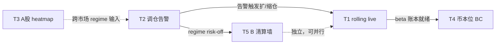

# 产品路线图 TODO — 优先级（2026-06-12）

> **状态**：路线图 / backlog（非承诺排期）  
> **相关**：[牛市Beta账本调仓与币本位取舍_CN.md](牛市Beta账本调仓与币本位取舍_CN.md) · [ABC三层收益结构_战略框架_CN.md](ABC三层收益结构_战略框架_CN.md) · [rolling_trend README](../../config/strategies/rolling_trend/README.md)

---

## 1. 五项 backlog

| ID | 项目 | 一句话 |
|----|------|--------|
| **T1** | Trend rolling 系统 | 组合级杠杆滚仓 live（TPC 信号源，独立 U 本位账户） |
| **T2** | 调仓告警 | A/B/C/rolling 各账户 NAV 占比 vs regime 目标带偏差 → CMS/TG 告警 |
| **T3** | A股 heatmap + 大周期高性价比系统 | 跨市场板块热度可视化 + 慢周期低摩擦资产配置（β 扩展） |
| **T4** | BTC 币本位 B/C 系统 | 币本位（`dapi`）下的 BTC beta / 或 B/C 迁移 |
| **T5** | B 系统：大级别订单墙触发清算 | 订单墙 / 清算簇触发的 swing 入场或风控（FER 语义扩展） |

---

## 2. 推荐优先级（总览）

```
P0  T2 调仓告警          ← 先有能力「知道何时该动」
P1  T1 Trend rolling     ← beta 主引擎，配置已有
P2  T5 B 订单墙清算      ← 强化已在跑的 B，改动可控
P3  T3 A股 + 大周期      ← 新市场 + 新假设，研究先行
P4  T4 BTC 币本位 B/C    ← 工程最大；战略上后置
```

| 优先级 | ID | 理由（压缩） |
|--------|-----|----------------|
| **P0** | T2 | 成本低、立刻服务牛熊调仓战略；无告警则 rolling/A 扩仓靠体感 |
| **P1** | T1 | 与「牛市跑长期持仓 beta」直接对齐；`rolling_trend_simulate.py` + yaml 已存在，差 live 接线 |
| **P2** | T5 | B（TPC）已在生产；清算/订单墙是 **alpha 增强**，不碰账户架构 |
| **P3** | T3 | `market_heat` 仅 crypto；A股是 **P3 跨市场**（见投资架构文档）；高性价比=慢周期，宜研究验证后再 live |
| **P4** | T4 | `dapi` 全栈缺失；多币 B/C 分抵押运维难；**现货 A + U 本位 rolling 先跑通**再评估 |

---

## 3. 依赖关系



- **T2 不阻塞 T1 开发**，但 **应先于或同步上线** T1 live：否则 rolling 账户何时加仓无纪律。
- **T4 依赖** T1 + A 现货 beta 路径跑通后的 **真实需求验证**；无验证不要做 `dapi`。
- **T3 与 T2 可弱耦合**：A股热度未来可作为 macro regime 一维，非 MVP 必需。
- **T5 与 T1/T4 无硬依赖**，可与 T1 并行研发。

---

## 4. 分项说明与验收草案

### T1 — Trend rolling 系统 【P1】

**现状**：`config/strategies/rolling_trend/`、`scripts/rolling_trend_simulate.py`；独立 U 本位账户；**无 live runner**。

**目标**：
- [ ] Live runner（独立 API / 宪法 `rolling` 段或新 constitution 文件）
- [ ] TPC 信号订阅（`signal_source: tpc`）与组合杠杆维护（`initial_leverage` / `roll_trigger` / `take_profit`）
- [ ] CMS 卡片：rolling 账户净值、杠杆、回撤
- [ ] Phase 1 回测 / replay 与 simulate 对齐后再小资金 live

**工作量**：中（2–4 周量级，含测试与 VPS 部署）  
**风险**：高杠杆爆仓语义；需与宪法 `max_gross_leverage` 分层

---

### T2 — 调仓告警 【P0】

**现状**：`exchange_balances.py` 已分 `trend` / `multi_leg` / `spot`；`regime_watchdog_baseline.json`、TPC `allowed_regimes` 有 bull 语义；**无跨账户 NAV 占比告警**。

**目标**：
- [ ] 定义目标带（见 [牛市Beta账本调仓](牛市Beta账本调仓与币本位取舍_CN.md) §5.2，可配置 yaml）
- [ ] 定时任务：拉各账户 equity → 算占比 → 对比 `abc_macro_regime_score` 或 TPC bull_share
- [ ] 告警：`WATCH`（偏离目标带）/ `REBALANCE_SUGGEST`（超阈值）→ CMS + 可选 TG
- [ ] **只告警不自动划转**（MVP）；人工或脚本划转

**工作量**：小（约 1 周）  
**风险**：低；注意勿与宪法 kill-switch 混淆

---

### T3 — A股 heatmap + 大周期高性价比系统 【P3】

**现状**：`src/market_heat/` = **crypto 周线热度**；跨市场架构文档将 **A股标为 P3**；无 A股数据源接入。

**目标（分两阶段）**：

*Phase A — 研究与可视化*
- [ ] A股板块/行业 heatmap（数据源选型：tushare / akshare / 付费 API）
- [ ] 与 crypto `market_heat` **同语义**（HOT/WARM/COLD）或独立 dashboard
- [ ] 「大周期高性价比」：慢变量筛选（月线趋势 + 低估值代理 + 低换手）→ **观察清单**，非自动下单

*Phase B — 与 ABC 接线（可选，后置）*
- [ ] macro regime 一维输入 T2 调仓告警
- [ ] 小仓位 ETF/个股 pilot（合规与券商 API 单列评估）

**工作量**：大（A股数据 + 合规 + 新回测脚手架）  
**风险**：T+1、涨跌停、做空受限；与 crypto 24/7 运维模型不同

---

### T4 — BTC 币本位 B/C 系统 【P4】

**现状**：全栈 U 本位（`fapi`）；[币本位取舍 doc](牛市Beta账本调仓与币本位取舍_CN.md) 结论：**不推荐 B/C 整体迁移**。

**目标（若仍要做，收窄范围）**：
- [ ] **仅 BTC** 币本位子账户（`dapi`），语义 = beta 容器，**不是** B/C 全量迁移
- [ ] `binance_api` 抽象：`MarketKind.USDT_M | COIN_M`
- [ ] PnL / 宪法 / CMS 币本位或统一折算 USDT 显示
- [ ] **前置条件**：T1 rolling + A 现货 + T2 调仓已运行 ≥1 个 regime 周期

**工作量**：很大（4–8 周+）  
**风险**：熊市抵押贬值；与 B/C 多币策略运维冲突

---

### T5 — B 系统：大级别订单墙触发清算 【P2】

**现状**：FER 策略语义（失败衰竭 / 清算）；特征候选 `liquidation_cluster_score`、`oi_change_zscore`（见 A2 设计稿）；**未接入 TPC live PCM**。

**目标**：
- [ ] Phase 1：`mlbot research scan` 验证订单墙 / 清算簇 → forward RR / label lift（canonical segment）
- [ ] Phase 2：新 archetype 或 TPC **gate 扩展**（非默认 promote）
- [ ] Phase 3：与现有 trailing SL / 宪法 slot 共存；event_backtest + trading map 语义检查

**工作量**：中（研究 2 周 + 接入 2 周，视 scan 结果）  
**风险**：过拟合短期清算噪声；勿与 C  scalp 混账本

---

## 5. 建议执行顺序（季度视角）

| 阶段 | 时间盒（示意） | 交付 |
|------|----------------|------|
| **Q0** | 立即 | T2 调仓告警 MVP + 文档化目标带 yaml |
| **Q1** | 接下来 | T1 rolling simulate→live pilot；T5 Phase 1 scan |
| **Q2** | rolling 稳定后 | T5 promote 或弃；T3 Phase A heatmap 原型 |
| **Q3+** | 有跨市场需求时 | T3 Phase B；**仅当** beta 路径不足再立项 T4 |

---

## 6. 显式不做 / 延后

| 项 | 原因 |
|----|------|
| T4 作为 B/C **全量**币本位迁移 | 战略错层 + 工程量大；见币本位取舍 doc |
| T3 与 T1 **同优先级**抢资源 | A股合规与数据未验证，不应挡 crypto beta live |
| T5 未 scan 直接 live | 违反 experiments R&D workflow Phase 1 |
| 调仓 **自动划转**（MVP） | 先告警 + 人工确认，避免误操作与 API 权限风险 |

---

## 7. 配置锚点（落地时改这些）

| TODO | 主要路径 |
|------|----------|
| T1 | `config/strategies/rolling_trend/`、`scripts/rolling_trend_simulate.py` |
| T2 | `config/monitoring/` 新 `rebalance_targets.yaml`；`src/mlbot_console/services/exchange_balances.py` |
| T3 | 新建 `src/market_heat_cn/` 或扩展 `market_heat`；`docs/market_heat/` |
| T4 | `src/order_management/binance_api.py`（`dapi`） |
| T5 | `config/strategies/fer/` 或 `tpc/archetypes/`；`config/experiments/` 新 scan 目录 |

---

*维护：新增 TODO 时更新 §1 表格与 §2 优先级，并注明依赖变更。*
