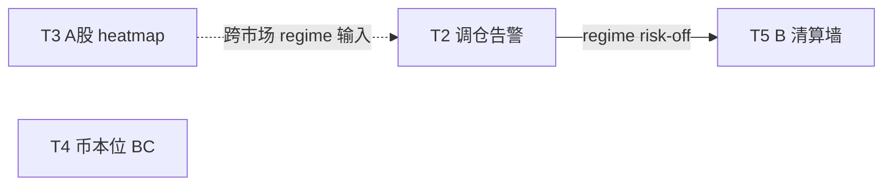

# 产品路线图 TODO — 优先级（2026-06-14 修订）

> **状态**：路线图 / backlog（非承诺排期）  
> **相关**：[牛市Beta账本调仓与币本位取舍_CN.md](牛市Beta账本调仓与币本位取舍_CN.md) · [ABC三层收益结构_战略框架_CN.md](ABC三层收益结构_战略框架_CN.md) · [rolling_trend README](../../config/strategies/rolling_trend/README.md)

**2026-06-14 战略调整**：**主攻 T5**（订单墙 / 清算 scan）；**放弃** T1 `rolling_trend` live、A 层 `profit_satellite` live（探针代码保留作归档，不立项 P1/P2）。

---

## 1. 五项 backlog

| ID | 项目 | 一句话 |
|----|------|--------|
| **T1** | Trend rolling 系统 | ~~组合级杠杆滚仓 live~~ **【已放弃 live】**；`simulate` 保留 |
| **T2** | 调仓告警 | A/B/C/rolling 各账户 NAV 占比 vs regime 目标带偏差 → CMS/TG 告警 |
| **T3** | A股 heatmap + 大周期高性价比系统 | 跨市场板块热度可视化 + 慢周期低摩擦资产配置（β 扩展） |
| **T4** | BTC 币本位 B/C 系统 | 币本位（`dapi`）下的 BTC beta / 或 B/C 迁移 |
| **T5** | B 系统：大级别订单墙触发清算 | **【当前主攻】** 订单墙 / 清算簇 → Phase 1 `mlbot research scan` |

---

## 2. 推荐优先级（总览）

```
P0  T2 调仓告警          ← ✅ 已交付；VPS deploy 验收
P1  T5 B 订单墙清算      ← 【当前主攻】Phase 1 scan
P2  T3 A股 + 大周期      ← 新市场 + 新假设，研究先行
P3  T4 BTC 币本位 B/C    ← 工程最大；战略上后置
—   T1 rolling live      ← 【已放弃】
—   profit_satellite      ← 【已放弃】见 A 层 doc §3.1.1
```

| 优先级 | ID | 理由（压缩） |
|--------|-----|----------------|
| **P0** | T2 | 成本低、立刻服务牛熊调仓战略；**MVP 已合入，待 VPS 验收** |
| **P1** | T5 | B（TPC）已在生产；清算/订单墙是 **alpha 增强**，不碰账户架构；资源从 T1/卫星收回 |
| **P2** | T3 | `market_heat` 仅 crypto；A股是跨市场扩展；宜研究验证后再 live |
| **P3** | T4 | `dapi` 全栈缺失；**A 现货 + B/C** 已覆盖 beta/alpha，无 rolling 前置 |
| **—** | T1 | **放弃 live**；杠杆滚仓运维与收益增量不确定；`rolling_trend_simulate.py` 仅保留 |
| **—** | profit_satellite | **放弃 live**（含 P1 利润池/regime/半自动）；探针归档，不消耗研发 |

---

## 3. 依赖关系



- **T2 已完成 MVP**；rolling scope 在 rebalance yaml 可长期占位「未配置」。
- **T4 前置**改为：A 现货 + B/C + T2 已运行 ≥1 个 regime 周期（**不再依赖 T1**）。
- **T3 与 T5 无硬依赖**；T5 Phase 1 可立即启动。

---

## 4. 分项说明与验收草案

### T1 — Trend rolling 系统 【已放弃 live】

**现状**：`config/strategies/rolling_trend/`、`scripts/rolling_trend_simulate.py`；**无 live runner，且不再立项**。

**放弃理由**（2026-06-14）：
- 杠杆滚仓运维与爆仓语义成本高，对当前组合 **增量不确定**
- A 层 beta 由 **现货 `spot_accum_simple`** 承担；alpha 资源转 **T5**
- `simulate` 与配置 **保留**，仅供历史对照，不 deploy

~~**目标**~~（归档，不执行）：
- ~~Live runner、独立 API、宪法 `rolling` 段、CMS 卡片~~

---

### T2 — 调仓告警 【P0】

**设计稿**：[CMS调仓告警与Regime看板设计_CN.md](CMS调仓告警与Regime看板设计_CN.md)（三层 regime 并列展示 + `rebalance_policy` 合成告警）

**现状**：`exchange_balances.py` 已分 `trend` / `multi_leg` / `spot`；`regime_watchdog_baseline.json`、TPC `allowed_regimes` 有 bull 语义；**无跨账户 NAV 占比告警**；`/regime` 页仅静态配置表。

**目标**：
- [x] **T2a** `GET /api/regime/cockpit`：A 周线成本区 / B bull-bear-neutral / C chop·动量 三层 live 卡片
- [x] **T2b** `config/monitoring/rebalance_targets.yaml` + composite risk-on + NAV 占比告警
- [x] **T2c** CMS `/regime` 升级为看板（告警条 + 占比条 + 三层卡片 + 保留 Ops 底表）
- [x] **T2d** 定时持久化 + 可选 TG；`rebalance_4h` timer；**只告警不自动划转**

**工作量**：小（约 1 周）  
**风险**：低；注意勿与宪法 kill-switch 混淆

---

### T3 — A股 heatmap + 大周期高性价比系统 【P3】

**现状**：`src/market_heat/` = **crypto 周线热度**；跨市场架构文档将 **A股标为 P3**；无 A股数据源接入。

**目标（分两阶段）**：

*Phase A — 研究与可视化*
- [ ] A股板块/行业 heatmap（数据源选型：tushare / akshare / 付费 API）
- [ ] 与 crypto `market_heat` **同语义**（HOT/WARM/COLD）或独立 dashboard
- [ ] 「大周期高性价比」：慢变量筛选（月线趋势 + 低估值代理 + 低换手）→ **观察清单**，非自动下单

*Phase B — 与 ABC 接线（可选，后置）*
- [ ] macro regime 一维输入 T2 调仓告警
- [ ] 小仓位 ETF/个股 pilot（合规与券商 API 单列评估）

**工作量**：大（A股数据 + 合规 + 新回测脚手架）  
**风险**：T+1、涨跌停、做空受限；与 crypto 24/7 运维模型不同

---

### T4 — BTC 币本位 B/C 系统 【P4】

**现状**：全栈 U 本位（`fapi`）；[币本位取舍 doc](牛市Beta账本调仓与币本位取舍_CN.md) 结论：**不推荐 B/C 整体迁移**。

**目标（若仍要做，收窄范围）**：
- [ ] **仅 BTC** 币本位子账户（`dapi`），语义 = beta 容器，**不是** B/C 全量迁移
- [ ] `binance_api` 抽象：`MarketKind.USDT_M | COIN_M`
- [ ] PnL / 宪法 / CMS 币本位或统一折算 USDT 显示
- [ ] **前置条件**：A 现货 + B/C + T2 调仓已运行 ≥1 个 regime 周期

**工作量**：很大（4–8 周+）  
**风险**：熊市抵押贬值；与 B/C 多币策略运维冲突

---

### T5 — B 系统：大级别订单墙触发清算 【P1 · 当前主攻】

**现状**：FER 策略语义（失败衰竭 / 清算）；特征候选 `liquidation_cluster_score`、`oi_change_zscore`（见 [A2 设计稿](A2_spot_fattail_设计稿_CN.md)）；**未接入 TPC live PCM**。

**目标**：
- [ ] **Phase 1（立即）**：`mlbot research scan` — `condition-set` / `feature-plateau` / `ic` 验证订单墙、清算簇、OI 突变 → forward RR / label lift（**canonical segment only**）
- [ ] **Phase 1b**：`config/experiments/20260614_t5_liquidation_wall_scan/`（`rd_loop_*.yaml` + `DECISION.md` 骨架）
- [ ] Phase 2：scan 过关后 — 新 archetype 或 TPC **gate 扩展**（非默认 promote）
- [ ] Phase 3：event_backtest variant-grid + `run_trading_maps.sh` 语义检查；与 trailing SL / 宪法 slot 共存

**Phase 1 起手命令（示意，待 parquet 路径确认）**：

```bash
# 示例：OI z-score 条件集（对齐 A2 设计稿）
mlbot research scan condition-set \
  --features-parquet results/<tpc>/features_labeled.parquet \
  --label <forward_rr_label> \
  --condition "oi_z: oi_change_zscore>=2.0" \
  --output config/experiments/20260614_t5_liquidation_wall_scan/quick_scan/oi_z.md
```

**工作量**：中（研究 2 周 + 接入 2 周，视 scan 结果）  
**风险**：过拟合短期清算噪声；勿与 C scalp 混账本；**禁止 scan 前 grid / live**

---

## 5. 建议执行顺序（季度视角）

| 阶段 | 时间盒（示意） | 交付 |
|------|----------------|------|
| **Q0** | 立即 | T2 VPS 验收；Trend TruthSync deploy |
| **Q1** | **当前** | **T5 Phase 1 scan** + 实验目录 `DECISION.md` |
| **Q2** | scan 过关后 | T5 promote 或弃；T3 Phase A heatmap 原型 |
| **Q3+** | 有跨市场需求时 | T3 Phase B；**仅当** beta 不足再立项 T4 |

---

## 6. 显式不做 / 延后

| 项 | 原因 |
|----|------|
| **T1 `rolling_trend` live** | 2026-06-14 战略放弃；运维/杠杆风险 > 预期 beta 增量 |
| **A 层 `profit_satellite` live**（含 P1 利润池/regime/半自动） | 同上；探针代码归档，不立项 |
| T4 作为 B/C **全量**币本位迁移 | 战略错层 + 工程量大；见币本位取舍 doc |
| T5 未 scan 直接 live | 违反 experiments R&D workflow Phase 1 |
| 调仓 **自动划转**（MVP） | 先告警 + 人工确认，避免误操作与 API 权限风险 |

---

## 7. 配置锚点（落地时改这些）

| TODO | 主要路径 |
|------|----------|
| T1（归档） | `config/strategies/rolling_trend/`、`scripts/rolling_trend_simulate.py` |
| T2 | `config/monitoring/rebalance_targets.yaml`；`src/mlbot_console/services/regime_live.py` |
| T3 | 新建 `src/market_heat_cn/` 或扩展 `market_heat`；`docs/market_heat/` |
| T4 | `src/order_management/binance_api.py`（`dapi`） |
| **T5** | `config/experiments/20260614_t5_liquidation_wall_scan/`；`config/strategies/fer/` 或 `tpc/archetypes/`；特征见 A2 设计稿 |

---

*维护：新增 TODO 时更新 §1 表格与 §2 优先级，并注明依赖变更。*
