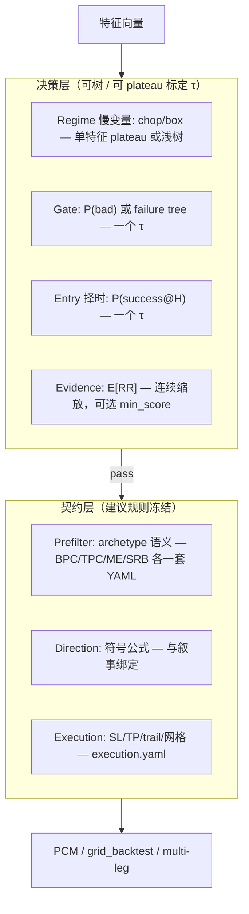
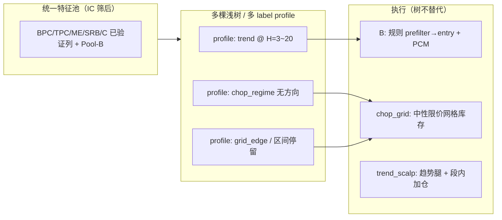
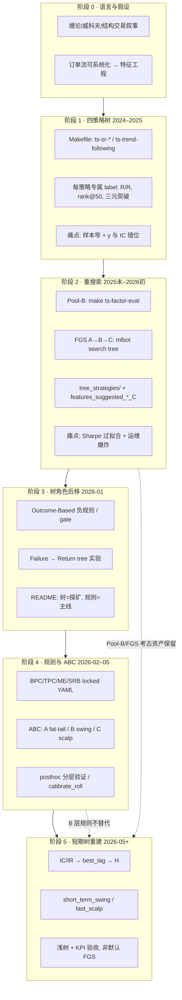

# 树模型方法论演进与短期树重建指南

> 本文档对照 **历史 Makefile / CLI 工作流**（Pool-B、feature-group-search、四策略树训练），说明哪些做法应保留、哪些应废弃，并固化 **2026-05 之后** 的短期树（`short_term_swing` / `fast_scalp`）重建路径。  
> 与 [ABC 三层收益结构](ABC三层收益结构_战略框架_CN.md)、[B 系统运维心智](B系统运维心智梳理.md)、[OUTCOME_BASED_TREE_LABELING](../architecture/OUTCOME_BASED_TREE_LABELING.md) 一致。

---

## 如何使用本文档

| 你想… | 读哪一节 |
|--------|----------|
| **5 分钟知道结论** | [§1.1 结论先行](#11-结论先行你现在的判断对不对) |
| **定架构：树放哪、能不能替规则** | [§1.2](#12-推荐架构树决策层--规则执行层) · [§1.3](#13-用树替代分层规则栈是省事又先进吗) · [§1.4](#14-为什么用树也很麻烦运维清单) · [§1.5 B/C 与落地顺序](#15-bc-系统模型能更优吗与推荐落地顺序) |
| **模型落地优先级时间线** | [§1.5.6 时间线](#156-推荐落地顺序对你提议的裁定) · [§2.3 Phase 1–3 检查清单](#23-落地检查清单含-15-分阶段顺序) |
| **动手建 short_term_swing / fast_scalp** | [§2 当前方法论与工作流](#二当前方法论与工作流) |
| **chop / 合并树 / C 系统** | [§3.1](#31-chop_grid--trend_scalp--合并树边界) |
| **和 Qlib / 横截面对比** | [§3.2](#32-与-microsoft-qlib-对比是否重复造轮子) · [§3.3](#33-横截面是否用-qlib-更好) |
| **理解历史为什么拧巴** | [§4 背景与历史](#四背景心路与历史)（可选读） |

**结构（v9）**：

```text
一、结论与裁定     ← 定架构、运维成本、B/C 与落地顺序（§1.5）
二、当前方法论     ← IC→H→浅树→命令→分阶段检查清单
三、专项应用       ← chop / Qlib / 横截面
四、背景与历史     ← 心路、进化、Makefile 考古
附录               ← 审查备忘、索引
```

**模型落地优先级时间线（§1.5.6 / §2.3）**：

```text
Phase 1（并行）  1a trend_scalp 段内择时（C 槽 shadow）  ∥  1b BPC Gate（failure 树，叠加 shadow）
Phase 2          2  chop_grid（无方向 y，仍 grid_backtest）
Phase 3          3a B Gate → TPC/ME/SRB   →   3b B Entry（相关<0.7；Gate 稳定后）
勿做             端到端替 B prefilter/direction；FGS 日常当上线路径
```

**一句话**：规则定「哪一仗、怎么打」；树定「这一根 bar 出不出手」——树是规则栈上的 **小帽子**，不是新树干（§1.2–§1.5）。

---

## 一、结论与裁定

## 1.1 结论先行（你现在的判断对不对？）

| 你的说法 | 判断 |
|----------|------|
| 以前「大特征排序 + feature group search（FGS）很慢」是在 **错误问题** 上烧钱 | **大体对**：当 FGS 的 y 是 50 bar 策略标签、样本被 SR/突破 prefilter 收窄、优化目标是 `Sharpe_mean` 时，搜索的是「回测窗内最好看的组合」，不是「与 IC 衰减一致的短周期 alpha」。 |
| 应用 **IC/IR + best_lag** 选出在 **3 bar**（或 **20 bar**）衰减的特征，再训浅树 | **对**：Makefile 里 `ts-factor-eval` 已支持 `--ic-decay-lags 1,3,5,10,20` 与 `--filter-by-best-lag`；**标签 horizon 应对齐 best_lag**，这是比 FGS 更根本的对齐。 |
| 目标定为 **1:1.5 盈亏比、胜率 50%+** 即可开训 | **半对**：这是 **交易层验收 KPI**，不宜直接当作回归 y；应用 **barrier / forward_rr @ H** 作训练标签，再在 top 分位上 **验收** 胜率与 realized RR。 |
| 不必再定义结构、订单流 archetype，让树自己选 | **对（特征侧）**；**错（标签/执行侧）**：仍须固定 `horizon`、风险单位（ATR）、成本假设，否则 y 不可复现。 |

**一句话**：Pool-B 的 **IC/IR 筛选** 应保留；FGS 的 **Sharpe 组合搜索** 对「上线用短周期树」不再必要；训练改为 **「IC 定特征 + horizon 定标签 + 浅树 + 交易 KPI 验收」**。

---

## 1.2 推荐架构：树决策层 + 规则执行层

> **你要解决的问题**：能否用统计学 + 模型概率，把现在 **每层、每特征都要扫平坦高原** 的规则研发，收成 **「一个分数 + 一个高原阈值」**？  
> **结论（先读）**：**有可能，也有必要——但只针对「决策层」的子集，不能替代整条 archetype 叙事与执行引擎。**

### 1.2.1 一句话结论

| 问题 | 答案 |
|------|------|
| **是否有可能？** | **是**。仓库里已有：`predict_proba` 入场门槛、`tree_gate`、regime 的 `scan_chop_plateau`、`optimize_*_plateau`、宪法里的 `evidence_position_scale`。 |
| **是否有必要？** | **对 Gate / Entry / 短周期择时 有必要**；对 **Prefilter（archetype 语义）/ Direction / Execution** 仍宜规则为主。 |
| **能否简化研发？** | **能**：把「多特征 × 多层」收成 **1 个连续分数 + 1 维 plateau 标定**；不能消灭 **执行参数 plateau**（TP/trail/网格间距）。 |
| **能否四策略合并一棵大树？** | **不宜作生产入场替代**；可作 **统一特征池 + 每策略或每 profile 一个 score 头**（见 §3.1.5）。 |

**推荐架构（与代码现状对齐）**：

```text
特征 X  →  浅树/LightGBM  →  score ∈ [0,1]（如 P(success) 或 E[RR@H]）
                ↓
         仅标定 1 个阈值 τ（平坦高原扫描，holdout）
                ↓
规则执行层（冻结）：direction 公式 + execution.yaml + PCM/多腿引擎
```

---

### 1.2.2 为什么「一个分数 + 一个高原」比「每层每特征扫 plateau」更顺

**现状（规则栈）**（`6种对称策略的启发式规则.md` §11.3、`generic_live_strategy.decide`）：

```text
Prefilter → Direction → Gate → Entry Filter → Evidence → Execution
```

每层可能有多条 `feature + operator + value`，研发时常：

- `optimize_gate_unified.py` / `optimize_entry_filter_plateau.py` 在 **高维阈值空间** 找 plateau；
- `regime.yaml` 里每个慢变量也要 **Tier-0 plateau**（`scan_chop_plateau`）；
- 文档 [`PLATEAU_OPTIMIZATION_METHODOLOGY.md`](../architecture/guides/PLATEAU_OPTIMIZATION_METHODOLOGY.md) 已指出：**d>6 时高原体积指数级变小**，应 **分层冻结 + 2~3 维子空间** 才稳。

**树模型决策层**把「多条件 AND/OR」压成 **一个有序统计量**：

| 维度 | 多层规则 + 每层 plateau | 树 score + 单层 plateau |
|------|-------------------------|-------------------------|
| 调参自由度 | O(层数 × 规则数 × 特征) | O(1) 主阈值 τ（+ 可选 top_quantile） |
| 统计学接口 | 每特征扫 lift/高原 | Spearman、分位单调、ROC、Youden's J |
| 可解释 | 强（YAML 可读） | 中（可 `export_tree_rules` / SHAP） |
| 与执行分离 | 已分离 | **保持分离** — 执行仍用 `execution.yaml` |

你要的「平坦高原」概念 **仍然需要**，但应用在 **τ 这一维** 上，而不是 20 个特征阈值各扫一遍。仓库已有先例：

- **Regime**：`src/time_series_model/regime/threshold_calibrator.py` → `scan_chop_plateau()` 返回 `PlateauRange(start, end, mid)`，写回 `regime.yaml` 的 `last_calibration.plateaus`。
- **训练回测**：`scripts/train_strategy_pipeline.py` 用 `preds >= entry_threshold`（默认 0.6）生成入场；`tree_strategies/*/backtest.yaml` 里也是 `long_entry_threshold` 一类 **单阈值**。
- **Gate 治理**：`gate.yaml` 的 `governance.min_gate_score`（Youden's J 体系）已是 **标量门槛** 思路。

---

### 1.2.3 代码与文档证据：决策层 ML + 执行层规则 **已经存在**

| 能力 | 仓库位置 | 说明 |
|------|----------|------|
| 概率入场 | `scripts/train_strategy_pipeline.py`（`entry_threshold`、`predict_proba`） | 模型输出 **success 概率**，非逐特征 if/else |
| 浅树 Gate 训练 | `src/time_series_model/gating/tree_gate.py`（`train_tree_gate`） | y=allow/veto → 可导出规则或直接用概率 |
| Gate 规则应用 | `src/time_series_model/live/tree_gate.py`、`scripts/apply_tree_gate_3action.py` | 实盘/日志上叠 gate |
| Regime 单特征高原 | `scripts/regime_threshold_calibrate.py` + `scan_chop_plateau` | **一个** chop 阈值的高原区间 |
| Gate/Entry plateau 优化 | `scripts/optimize_gate_unified.py`、`optimize_entry_filter_plateau.py` | 规则层的统计 plateau（可逐步 **收敛为 score 标定**） |
| Evidence 连续缩放 | `config/constitution/constitution.yaml`（`evidence_min_score`、`evidence_position_scale`） | **不做硬过滤**，用分数缩放仓位 |
| 分层研发方法论 | `docs/experiments/z实验_005_统一研究/archive/统一建模方法论_meta_algorithm.md` | Prefilter/Gate/Evidence/Entry **分模块**；Gate 已有 `gate_score` 标量 |
| 运维共识 | `B系统运维心智梳理.md` | 入场定稿；**Gate/entry 统计做一次**；regime 慢变量季度再看 |
| 生产口径 | `README_CN.md` §9.2 | 树适合 **探矿 / gate**；规则适合 **分层 adopt** |
| Return 与 tail 分工 | `FAILURE_TO_RETURN_PIPELINE.md`、`return_tree训练报告解读.md` | **分数排序 ≠ 尾部风险** — 决策层也要分 head |

**重要**：`BPC gate.yaml` 注释已写 — `semantic_chop` 上限 **迁到 regime 层**，由 `regime_threshold_calibrate` 做 plateau，而不是在 gate 里再扫一遍。这正是 **「慢变量 → 单维高原；快变量 → 模型 score」** 的分工方向。

---

### 1.2.4 推荐分层：哪些用树决策，哪些保留规则



| 层 | 树/分数 | 规则 YAML | 理由 |
|----|---------|-----------|------|
| **Prefilter** | 可选辅助（chop/box 分数） | **主** | 定义「是不是 BPC 这一仗」；四策略不宜一棵模型混替 |
| **Direction** | 一般不替 | **主** | 与结构叙事绑定；FER 已强调勿全样本 CVD 兜底 |
| **Gate** | **推荐** | 规则导出或并存 | 尾部风险；`failure_first` 语义就是 **failure probability 区域** |
| **Entry Filter** | **推荐** | OR 规则可收成 **τ** | posthoc 显示单层边际弱时，用 score 更顺 |
| **Evidence** | **推荐** | 阈值可选 | 宪法已支持 **position_scale**；避免硬二元 filter |
| **Execution** | 否 | **主** | TP/trail/网格间距 — `FAILURE_TO_RETURN` Phase 4 仍在 execution 子空间 plateau |

**chop_grid / trend_scalp**：决策层仍是 **regime 分数 + 开不开网格/段**；执行层必须是 **多腿引擎**（§3.1），不能 `mlbot train` 一条 TradeIntent 了事。

---

### 1.2.5 研发流程对比（你要的「更顺」是否成立）

**旧流程（规则中心）**：

```text
特征工程 → 每层 SHAP/optimize_*_plateau → 写 gate/entry/regime YAML
→ 每层 adopt → 实盘/debug 不知道是哪个 feature 阈值漂移
```

**新流程（决策树 + 单高原）**：

```text
IC@H 冻结特征池 → 训浅树（或 LightGBM）→ OOS 上出 score 列
→ 只扫 score 的 τ（scan_chop_plateau / _identify_plateau 同一套统计）
→ plateau.mid 写入 backtest.yaml 的 entry_threshold 或 gate min_score
→ execution.yaml 不动；prefilter/direction 仅季度审查
```

| 步骤 | 命令/模块（已有） |
|------|-------------------|
| 训练 score | `mlbot train final` / `pipeline run` → `predictions.parquet` |
| 标定 τ | `scripts/regime_threshold_calibrate.py`（慢变量）；`backtest_execution_layer._identify_plateau`（sym_r 等）；或 holdout 上分位扫描 |
| 写回配置 | `backtest.yaml` 的 `entry_threshold`；`gate.yaml` 的 `min_gate_score` |
| 导出可读规则（可选） | `scripts/export_tree_rules_imodels*.py`、`train_tree_gate` |

**能省什么**：Gate/Entry 上 **10+ 个特征阈值** 的反复 plateau。  
**不能省什么**：Execution 网格、BPC 三阶段 prefilter 语义、多策略 PCM 槽位、chop 网格 spacing。

---

### 1.2.6 与「四策略特征合并一棵树」的关系

§3.1.5 结论不变，本节补一句：

- **合并特征池 + 各策略独立 score 头**（或各策略一个 `entry_threshold`）= **决策层简化**，与 §1.2 一致。  
- **合并成一棵树上生产、删掉 BPC/TPC/ME/SRB prefilter** = **否** — 损失可审计性与 archetype 分工。

折中落地（与 `B系统运维心智` 一致）：

```text
BPC/TPC/ME/SRB: prefilter + direction 规则 LOCKED
共享: 用同一套特征列训 gate_model / entry_model（或一棵 ranker）
标定: 每策略一个 τ_BPC, τ_TPC（plateau 各扫一次，仍是一维）
执行: 各策略 execution.yaml 不改
```

---

### 1.2.7 风险与边界（写进文档以免过度承诺）

1. **分数不是万能**：return 树压不下 RR extreme（§4、`return_tree训练报告解读`）→ Gate（tail）与 Entry（return）宜 **两个 head 或两个 τ**，不要一个分数包打天下。  
2. **Prefilter 不能省**：posthoc 报告 prefilter 全 pass 0% 有时是 **特征缺失**，不是「不需要 prefilter」；树决策层不能掩盖 **数据契约** 问题。  
3. **可解释性**：实盘排障仍需 `gate_reasons` / 导出规则；纯黑盒 score 需 shadow 期。  
4. **plateau 仍要做**：只是从「20 维」降到 **1~2 维**（τ + 可选 top_quantile）；[`PLATEAU_OPTIMIZATION_METHODOLOGY`](../architecture/guides/PLATEAU_OPTIMIZATION_METHODOLOGY.md) 的 Stage 0/1 **冻结结构** 仍然适用。  
5. **证据层文档**：[`evidence单调性验证（最终放弃）.md`](../experiments/z实验_005_统一研究/archive/evidence单调性验证（最终放弃）.md) 建议 evidence 用 **position scaling** 而非硬阈值 — 与 §1.2.4 Evidence 行一致。

---

### 1.2.8 最终裁定（是否值得做）

| 裁定 | 内容 |
|------|------|
| **值得做** | 在 **Gate + Entry（+ 可选 Evidence 缩放）** 用 **浅树概率 + 单阈值 plateau** 替代「每层多特征反复扫 plateau」；与短期树 §2（IC@H）共用特征池。 |
| **值得保留规则** | **Prefilter、Direction、Execution**；chop/trend_scalp 的 **多腿执行**；宪法 failure 硬约束。 |
| **不值得做** | 用一棵大树删掉四策略 YAML；指望树同时解决 tail + return + archetype 语义。 |
| **下一步工程** | ① 固定 BPC 的 `features_labeled` + 训 `entry_score`；② holdout 上对 score 跑 `scan_chop_plateau` 等价物得 `τ`；③ shadow 对比现有 gate+entry OR 规则；④ 通过后再 `--promote` 一条 `min_entry_score` 写回 archetypes。 |

> **对你原始设想的对齐**：「模型训练输出概率，我只要平坦高原这一个概念」——**在决策层成立**；执行层仍是 **间距 / SL / TP** 的 plateau，二者不要混为一个 τ。

---

## 1.3 「用树替代分层规则栈」是省事又先进吗？

> 本节正面回答一个 **常见错觉**：既然 §1.2 已经允许树进入决策层、且 ML 看起来「自动化、先进」，那为什么不干脆 **把 Prefilter / Direction / Gate / Entry / Execution 都换成一棵端到端的树**？  
> **结论一句话**：**不会更省事，也不更先进。它是把「可观测、可冻结、可审计」的复杂度，换成「不可观测、会自漂移、需要持续保活」的复杂度**。在你这个仓库（多策略 PCM、订单流、多腿执行、宪法 failure），**净额是亏的**。

### 1.3.1 一张表先读完

| 直觉 | 真相 |
|------|------|
| 「一棵树替掉所有 YAML，省 20 个阈值」 | **不省** — 你把「调阈值」换成了「养模型」：数据/标签/再训/漂移/影子/回滚/审计，工作量净增 |
| 「ML > 规则 = 更先进」 | **范畴错误** — 交易里「先进」= **抗漂移、可解释、低尾部**；不 = 用 LightGBM |
| 「树能学到非线性，规则不能」 | 在 **决策层小子集** 上对（§1.2 已采纳）；在 **archetype 语义 + 多腿执行** 上无效，因为那是 **因果与执行约束**，不是统计联合分布 |
| 「黑盒比白盒强」 | 在你这种 **多策略共用一个账户** 的设置里，**白盒可加总、黑盒不可加总** — PCM 没法对一个 score 解释「这笔钱算哪条策略」 |

**新口号（取代「树替代规则」）**：

> **规则定「这是哪一仗」与「怎么打」；树定「这一根 bar 出不出手 / 多重」。  
> 树是规则栈上挂的小帽子，不是新的树干。**

---

### 1.3.2 「省事」错觉的成本账：换的是什么、加的是什么

把分层规则栈 **整体** 替成树（哪怕是「一棵 + 单 τ」），你 **省掉** 的事其实有限，**新增** 的负担反而系统性：

| 维度 | 规则栈现状（已冻结/半冻结） | 「整树替代」之后 |
|------|----------------------------|------------------|
| 阈值数量 | 每层多个，但 **每层只 adopt 一次**（`B系统运维心智`） | 单 τ — **看起来省**，实际只 **省最后一段** |
| 数据契约 | `features_labeled` schema 一变就报红 | 模型对缺列/分布偏移 **静默退化** |
| 标签 | YAML 里写死 horizon/sl_r/tp_r | 多套 label profile、leakage 检查、walk-forward 拼接 |
| 再训节奏 | regime Tier-0 季度复检 | **必须有再训管线**：节奏、触发器、版本号、影子期 |
| 漂移检测 | 单特征 IC 报警 → 直接定位 | 模型 AUC/Brier/Spearman 缓慢退化，**爆掉才知道** |
| 上线门禁 | adopt 增量、可逐层灰度 | 模型整版替换；要 shadow + canary + 回滚 |
| 排障 | `gate_reasons` / `failure` 字段直接讲故事 | 需要 SHAP/规则导出做 **二次解释**，仍非因果 |
| 多策略 PCM | 每策略一条 archetype，钱算得清 | 一棵共享树 = **一笔进场说不清是哪条策略的预算** |
| 监管 / 自我审计 | 「为什么进场？」5 秒可答 | 「树说 0.78」 — 不是答 |

**净结论**：你省下的是 **每年几次 plateau 扫描**；你 **新增** 的是 **一条永远要养的模型生命线**。这笔账只有在 **「模型每月真带来不可替代的边际 alpha」** 时才划算。**Gate/Entry 上成立**（§1.2 已划界），**Prefilter/Direction/Execution 上不成立**。

---

### 1.3.3 「先进」是范畴错误：交易里的先进不是 ML，是 **抗漂移 + 可加总 + 低尾部**

| 通俗叙事的「先进」 | 你真正需要的「先进」 |
|--------------------|----------------------|
| 用 LightGBM / Transformer | OOS 抗 regime shift |
| 端到端学习 | 与现金流/PCM 可加总解释 |
| 多任务大模型 | 尾部风险硬约束（宪法 failure） |
| 极少手写规则 | 实盘 24×7 不爆、可热修 |
| AutoML 自动找最优 | 研发 → adopt → 监控 **可追溯到 commit** |

**反例**（这套仓库里已经写在文档里的）：

- `return_tree训练报告解读.md`：return 树 **压不下 RR extreme** — 模型的「先进」≠ 控尾。  
- `FAILURE_TO_RETURN_PIPELINE.md`：必须 **先 failure gate 再 return rank**；端到端一棵树办不到。  
- `B系统运维心智梳理.md`：**入场定稿** 才能让人睡得着 — 这与「持续微调的模型」直接冲突。  
- `posthoc_layer_effectiveness/`：每层都有 **单独可证伪的统计** — 一棵大树丢掉这种可证伪性。  
- README §9.2：树适合 **探矿 / gate**，规则适合 **分层 adopt** — 这是 **生产口径**，不是过渡话术。

**先进 ≠ 用 ML**；先进 = **「下个 regime 来时，你的系统不需要你重写」**。规则栈靠 archetype 语义 + plateau 实现这一点；树替代会把这一性质丢掉。

---

### 1.3.4 模型漂移 vs 阈值漂移：**不对称的检测难度**

这是「省事」错觉里最容易被忽略的一点。

| 漂移类型 | 现象 | 检测 | 修复 |
|----------|------|------|------|
| **阈值漂移**（规则） | 某个 `gate_cvd_min` 在新月份 IC 翻负 | 单特征 `factor-eval` / posthoc 立刻发现 | 调一行 YAML，**adopt 留痕** |
| **模型漂移**（树替代） | 整体 P(success\|X) 校准曲线缓慢偏 | 只有 **集成监控**（Brier / 校准 / 分位单调）能看见 | 再训 — 但 **再训本身可能引入新偏** |

```
规则世界：bug 是"指针越界"，IDE 立刻红线。
模型世界：bug 是"内存缓慢泄漏"，跑了一周内存 OOM 才发现。
```

**在 Gate/Entry 一个 score、单 τ** 的小子集里这是可控的（监控面窄）；在 **整条决策栈** 上替代会把这种缓慢退化引入到 prefilter 与 direction，**很难写回归测试**。

---

### 1.3.5 多策略 PCM：白盒可加总，黑盒不可加总

这是 **你这个仓库特有** 的硬约束，外面 Qlib / 学术论文都没强调：

- `constitution.yaml` 把 BPC/TPC/ME/SRB/chop_grid 放进 **同一个账户、同一笔本金、不同槽位**；  
- 每个 archetype 的钱、风险预算、PnL 归属 **必须分得清**（否则 portfolio governance 失败）；  
- 规则栈天然满足 — 每笔 trade 携带 strategy_id、prefilter_reasons、gate_reasons；  
- 一棵共享树输出一个 score → **进场归属于「混合模型」**，PCM 无法回答 "这次该扣 BPC 的预算还是 TPC 的"。

**纠正方式**（也是 §1.2 的折中）：

```text
共享：特征池（IC 筛过）
不共享：每个 archetype 一个 score 头（或一个 τ），仍由 prefilter 决定走哪条
```

这才是 **可加总** 的 ML 嵌入；删掉 prefilter / direction 用一棵树替代，PCM 直接散架。

---

### 1.3.6 执行层的「不可学」性：grid / multi-leg / TP / trail 不是分类任务

| 执行问题 | 为什么不适合「学」 |
|----------|--------------------|
| chop_grid 上下挂限价 + 每层 inventory | 是 **库存控制 + 做市目标**，不是 P(y\|X) |
| trend_scalp 段内加仓 / `reseed_on_flip` | 状态机；模型 score 没有「段」概念 |
| BPC trail 与 partial_tp | 路径依赖；样本里 **同一 X 不同 path 不同 y** |
| 宪法 failure 硬约束 | **不可违反**，不是概率压低 |

§3.1.3、§1.2.4「执行层=规则」这一行 **不是过渡安排，是范畴边界**。这一段的「先进」做法是 **写好状态机 + plateau 标定 SL/TP/spacing 子空间**（`PLATEAU_OPTIMIZATION_METHODOLOGY.md`），不是「也让树学一下」。

---

### 1.3.7 那「省事 + 先进」在哪里 **确实成立**？

为了不被读成「树都别用」，把 **正面适用范围** 也明示一次（与 §1.2 一致，但更具体）：

| 场景 | 树替代是否「省事 + 先进」 | 形态 |
|------|-------------------------|------|
| Gate（veto / failure 区） | ✅ | 浅树 → P(bad) → 单 τ；可导出规则与 OR 阈值并存 |
| Entry 择时（短 H） | ✅ | LightGBM score → top 分位 → 单 τ；shadow 对比 |
| Evidence 仓位缩放 | ✅ | E[RR] 连续缩放（宪法已支持） |
| Regime 慢变量（chop/box） | ✅ | 单特征或浅树 + `scan_chop_plateau` |
| 横截面 ranker（若 §3.3 升格） | ✅ | 一棵 panel 模型 + 组合层单分位 τ |
| **Prefilter（archetype 语义）** | ❌ | 规则；树 **只能辅助**，不能替 |
| **Direction（符号公式）** | ❌ | 规则；与叙事绑定 |
| **Execution（SL/TP/trail/grid spacing）** | ❌ | 状态机 + 子空间 plateau |
| **多策略账本归属** | ❌ | 规则 strategy_id；不可让一棵树合并归属 |

**总结**：「树替代规则」**在小子集上是 alpha 来源**，**在全栈上是负债来源**。  
当前文档已正确划界（§1.2.4 那张表）；本 §1.3 只是把「省事 + 先进」这个常见误判正面打掉，避免下个周期又被诱惑回去重走 FGS A→B→C 的老路，只不过名字换成「端到端树」。

---

### 1.3.8 如果还想再「激进一点」：唯一安全的越界方向

唯一可考虑的 **越界**（仍非「替代」）是：

```text
现状：每个 archetype 各有 gate.yaml + entry.yaml + execution.yaml
越界：把 gate + entry 合成「一个 archetype 一个 score model + 一个 τ」
保留：prefilter.yaml、direction、execution.yaml 全不动；strategy_id 不变
```

这是 §1.2.6 折中的极限版本，工程上 **可灰度**：

1. BPC 先做 `entry_score` + holdout τ；shadow 一个月；  
2. 通过后才扩 TPC/ME/SRB；  
3. **永远不要** 把 prefilter / direction / execution 也合进去。

越过这条线，**你就在用「先进感」换「可运维性」** — 这是这份文档（特别是 §4.1.6 教训 4、§1.2.7）最反对的事。

---

### 1.3.9 一句话留给未来的自己

> **想用一棵树替掉分层规则栈，是 2026 年版本的「FGS Stage C Sharpe 最优组合」幻觉**：  
> 同样的过度承诺、同样的不可证伪、同样的运维爆炸，只不过包装更现代。  
> 真正的省事是 **把规则定稿 + 让树只活在它擅长的那一格里**（Gate / Entry / score / 横截面 ranker）。  
> 这不叫保守，这叫 **可持续地把账户做活到下一个 regime**。

---

## 1.4 为什么「用树」也很麻烦？（运维清单）

> 承接 §1.3：你以为从「20 个特征阈值」收成「1 个 τ」就省事——**错**。  
> 你省的是 **YAML 里几行数字**；你买的是 **一整条模型生命线**。下面逐项说明「麻烦」在哪、和规则栈对比为什么 **净额常为负**。

### 1.4.1 错觉从哪来

```
规则栈：Prefilter → Gate → Entry → Execution
        每层 3~5 个阈值 → 研发时要扫 plateau

树方案：X → score → 一个 τ → 执行
        看起来只有 1 个旋钮
```

**漏算的部分**：树前面的 **X 怎么来、y 怎么定、模型怎么养、坏了怎么发现**——这些在规则世界里要么不存在，要么已经由别的层冻结了。τ 只是最后一道工序。

### 1.4.2 七类「树专属」运维负担

| # | 负担 | 规则栈怎么做 | 用树之后你要多做啥 | 为什么麻烦 |
|---|------|-------------|-------------------|------------|
| 1 | **数据契约** | `features_labeled` 缺列 → pipeline 直接失败 | 训练时对齐 schema；实盘 Feature Bus 少一列 → **模型静默用 0 或 NaN 填**，分数偏了不一定报错 | 规则「硬失败」；模型「软腐烂」 |
| 2 | **标签与 H** | `labels.yaml` 写死 horizon / sl_r / tp_r | 须保证 **IC@H、label@H、验收 KPI@H** 一致；换 H = 重训 + 重验收 | 改一行 YAML vs 重跑整条 train pipeline |
| 3 | **再训管线** | 规则 **adopt 一次、季度复检**（`B系统运维心智`） | 定节奏：何时重训？触发器是 IC 跌还是 PnL 跌？**版本号** `model_v202605` 谁维护？ | 规则没有「版本」概念；模型必须有 |
| 4 | **漂移检测** | 单特征 `factor-eval` → **立刻知道哪列坏了** | 看 **Brier、校准曲线、分位单调、OOS Spearman**；往往是 **缓慢变差**，一周后才从 PnL 反推 | 见 §1.3.4：阈值漂移像指针越界；模型漂移像内存泄漏 |
| 5 | **影子期 / 回滚** | 改 gate 一条规则 → shadow 几天 → `--promote` | **整模型替换**：新旧 score 分布不同，τ 可能也要重标；回滚 = 换回旧 `.pkl` + 旧 τ | 灰度粒度从「一行 YAML」变成「一套 artifact」 |
| 6 | **排障与审计** | `gate_reasons` / `failure` / `prefilter_reasons` 可读 | 实盘问「为何 0.78 进场？」→ 要 **SHAP / 规则导出 / 日志对分**；仍难还原因果 | PCM 多策略还要答「算哪条策略的钱」 |
| 7 | **双 head 分工** | failure 硬规则 + return 分开 | `return_tree` 已证明 **压不下 RR extreme** → Gate（tail）与 Entry（return）**不能共用一个 score** | 你以为 1 个 τ，实际往往要 **τ_gate + τ_entry** |

**小结**：表里的 1–7 不是「可选高级功能」，是 **模型上线最小集合**。没有它们，树在生产里等于裸奔。

### 1.4.3 和规则「扫 plateau」比，到底谁更费时间？

| 活动 | 规则栈（已冻结后） | 树（Gate/Entry 小子集） |
|------|-------------------|-------------------------|
| 日常 | 几乎无；regime 季度 `scan_chop_plateau` | 监控校准 / 分位单调；异常时调查 |
| 换月/换 regime | 单特征 IC 复查；改 1–3 行 YAML | 可能触发 **重训 + 重标 τ + 影子 2–4 周** |
| 研发新因子 | posthoc 看该层 lift；写回 gate | 重跑 Pool-B → 可能重训 → holdout 全套 KPI |
| 一次上线 | adopt 留痕 | 模型文件 + τ + shadow 报告 + 回滚预案 |

**你真正省下的**：Gate/Entry 上 **10+ 维阈值空间** 的初次 plateau 扫描（可能每年 1–2 次）。  
**你真正多出的**：上表 **每一行的持续成本**。  
→ 只有模型带来的 **边际 alpha 稳定大于运维成本** 时才划算；这就是为什么 §1.2 把树 **关在 Gate/Entry 格子里**，而不是替代整栈。

### 1.4.4 在本仓库里，哪些树用法「麻烦可接受」

| 用法 | 麻烦是否值得 | 原因 |
|------|-------------|------|
| Gate / failure 浅树 | ✅ | 监控面窄；可导出 if/else 与规则并存；tail 与 return 分离 |
| Entry score @ 短 H | ✅（需 shadow） | 单 τ；与 B 规则低相关才有增量 |
| FGS 日常重训四策略树 | ❌ | 训练+搜索+多重检验，麻烦最大、收益最不确定 |
| 端到端替代 prefilter/direction | ❌ | 麻烦拉满 + PCM 不可加总（§1.3.5） |

### 1.4.5 一句话

> **树不是「自动化的规则」，而是「多雇一个需要体检、打疫苗、立遗嘱的员工」。**  
> 规则栈贵在一次写清；树栈贵在 **一直养着**。省阈值 ≠ 省运维。

---

## 1.5 B/C 系统：模型能更优吗？与推荐落地顺序

> 承接 §1.3–§1.4：**除非证明边际 alpha，否则上模型净额为负。** 本节回答：在 [ABC 三层](ABC三层收益结构_战略框架_CN.md) 下，B/C 谁更适合模型、是否「越高频越好」、以及 **若上模型，应先做哪条线**。

### 1.5.1 前提（与 §1.1 一致）

| 命题 | 裁定 |
|------|------|
| 上模型默认更优？ | **否** — 须 OOS、成本后、与规则 **低相关** 的增量 alpha |
| B/C 整栈换树？ | **否** — 规则定 archetype + 执行；树只做决策层子集（§1.2） |
| 越高频越好？ | **半对** — 优势来自 **IC@H 对齐 + 样本量 + 成本后 edge**，不是 bar 越多越好 |

---

### 1.5.2 B 系统：模型理论上能更优吗？

**B 的主 alpha 是结构性 swing**（小时～数日 continuation），不是替 A 扛肥尾（[B 系统运维心智](B系统运维心智梳理.md)：入场 **locked**，树不做持续改入场）。

| 规则已强的部分 | 模型可能多一块 alpha 的（须证明） |
|----------------|----------------------------------|
| Prefilter：这是不是 BPC/TPC 这一仗 | **Gate**：坏区 / 尾部 veto（Outcome-Based 宽样本） |
| Direction：多空与叙事 | **Entry**：这一根 bar 是否值得进（H≈3–20 @ 120T） |
| Execution：SL/TP/trail | Evidence：仓位缩放（宪法已有接口） |

**理论上模型难更优的**：50 bar rank + SR mask 替代 B 入场；一棵 return 树同时排序+控 tail（`return_tree训练报告解读.md`）。

**结论**：B 是 **规则系统 + 可选决策层**；模型更优只发生在 **Gate / Entry 择时**，且与规则信号相关 >0.7 时视为 **duplicate，无增量**。

---

### 1.5.3 C 系统：模型理论上能更优吗？

C 与 B **不是同一类 y**（详见 §3.1）：

| C 子系统 | 模型适合学什么 | 执行 |
|----------|----------------|------|
| **trend_scalp** | 段内延续、**fast_scalp 式短 H**（有趋势条件） | 段逻辑仍规则；树只做 **段内择时** |
| **chop_grid** | chop 持续、**adverse_break veto**（无方向） | 仍进 `grid_backtest`；树不替网格状态机 |

**理论上 C 更「像模型主场」之处**：周转快、同 regime 下 bar 多 → 短 H 标签统计量更大；薄 edge 下多 veto 5% 坏 bar 更敏感。  
**但**：chop 不能用 B 的 `forward_rr_long`；`grid_edge@H` 标签成本高（§3.1.3）。

---

### 1.5.4 「更高频才有优势」？—— 对齐 H，不是追求 tick

```text
边际价值 ∝  P(可预测|X)@H × 样本/年 × (1 - 成本/edge)
              ≠ 每分钟 K 线数量
```

| 因素 | H 较短（如 3 bar @ 120T） | H 较长 / B 主持有数日 |
|------|---------------------------|------------------------|
| 特征 IC | 订单流、微观结构常在此峰 | 慢变量、结构语义多在规则里 |
| 样本 | 同年 bar 多，浅树更稳 | mask 窄则过拟合（旧四策略树） |
| 成本 | 换手高，费滑点吃 edge | 换手低，规则运维轻 |
| 文档档位 | `fast_scalp` → 偏 **C / 段内** | `short_term_swing` H≈20 → 研究槽，不抢 B 结构入场 |

**不是越高频越好**；在 120T 上 H=3（约 6h）已比 B 主叙事更短。再上到 tick/1m 需另建延迟、费率、做市假设，**不是当前 B/C 栈的自然延伸**。

---

### 1.5.5 按「边际 alpha / 运维成本」的理论优先级

| 优先级 | 对象 | 形态 | 说明 |
|--------|------|------|------|
| 1 | **B Gate** | failure / Outcome-Based 浅树 → 单 τ | 宽样本、控尾；与 return 树正交 |
| 2 | **C trend_scalp** | `fast_scalp` profile，段内 score | 方向性 y，练通 IC→H→树→shadow |
| 3 | **C chop_grid** | chop_persistence / adverse_break veto | 无方向 y；grid 执行不变 |
| 4 | **B Entry** | entry_score @ H=3–20 | **须** gate 稳定且与规则低相关 |
| 5 | 独立槽 | `short_term_swing` | 不与 B 入场 duplicate |
| — | **A** | 不用短周期树抢仓 | §3.1.6 |
| ✗ | 替 B prefilter/direction | 端到端大树 | PCM 不可加总（§1.3.5） |

---

### 1.5.6 推荐落地顺序（对你提议的裁定）

**你的顺序**：① trend_scalp → ② chop_grid → ③ B 的 gate 和 entry  

**裁定**：**大方向对**（先 C 练管线、后动 B 主仓），但要 **两处修正**：

| # | 你的步骤 | 裁定 | 修正 |
|---|----------|------|------|
| 1 | trend_scalp | ✅ **建议第一步** | 用 `fast_scalp` / H≈3 接 **段内择时**；shadow 在 C 槽，**爆炸半径小**；顺带练通 §2.2 全流程 |
| 1b | （未写） | ✅ **建议与 ① 并行** | **B Gate（failure）** — 宽样本、不碰 entry 叙事；若主 PnL 在 B，**控尾 ROI 可能高于 C** |
| 2 | chop_grid | ⚠️ **可做第二步，但难于 trend_scalp** | 无方向 y + `grid_edge` 贵；换手敏感（`cross_section`/C 文档）；**勿早于** trend_scalp 跑通 shadow |
| 3 | B gate + entry | ⚠️ **顺序要拆** | **Gate 先于 Entry**；Entry 须证明与规则 decorrelation；**不宜**在 C 两线未 shadow 前直接上 B entry |

**推荐时间线（写入 §2.3 检查清单）**：

```text
Phase 1（并行）
  ├─ 1a. trend_scalp 段内：IC@H=3 → 浅树 → τ → shadow（C 槽）
  └─ 1b. BPC Gate：Outcome-Based failure 树 → τ → shadow（不替代 gate.yaml，先叠加）

Phase 2
  └─ 2. chop_grid：chop_persistence / adverse_break veto → 仍 grid_backtest

Phase 3
  ├─ 3a. B Gate 推广到 TPC/ME/SRB（若 1b 有效）
  └─ 3b. B Entry_score（仅当与规则相关 <0.7 且 1b/1a 已稳）

勿做：端到端替 B prefilter/direction；FGS 日常循环当上线路径
```

**一句话**：

> **先 trend_scalp 练「模型生命线」，B Gate 可同期做控尾；chop 第二；B Entry 最后且要 decorrelation 证明。**  
> 不是「C 做完再做 B」，而是 **「C 择时 + B 控尾」并行，B 择时（Entry）最后。**

---

### 1.5.7 保存用对照表

| 问题 | 答案 |
|------|------|
| B/C 上模型理论上更优吗？ | **镶边可更优**（Gate/Entry/段内择时/chop veto），**换芯不更优** |
| 更高频才有优势吗？ | **H 与 IC 对齐时更有统计基础**；非频率越高越好 |
| 应先 trend_scalp 吗？ | **是**（练管线 + 低风险 shadow） |
| 再 chop_grid？ | **是，但次于 trend_scalp；难于无方向 y** |
| 最后 B gate+entry？ | **Gate 可与 Phase 1 并行；Entry 一定在 Gate 之后** |

---

## 二、当前方法论与工作流

## 2.1 原则与产品档位

### 2.1.1 原则

1. **先定持有周期 H**（由 IC 衰减峰值定，如 3 或 20 @ 120T/240T）。  
2. **只在「best_lag ≈ H」的特征子集上训树**（可叠加 IR、mean(IC) 等阈值，见 [`特征长期稳定还是需要调整`](../archive/特征：特征长期稳定还是需要调整.md)；**IR>0.5 为示例，须按标的/周期重标定**）。  
3. **全样本或宽样本**（仅流动性/跳变/成本过滤），**不要** SR/BPC prefilter mask。  
4. **浅树**（`max_depth` 3–4，`min_data_in_leaf` ≥ 500）用于排序或禁区，不追深树拟合。  
5. **1:1.5 RR、胜率 50%+** 放在 **验收层**，不强行当作回归 target。

### 2.1.2 两个产品档位（与你说的 3 bar / 20 bar 对应）

| 档位 | 建议目录名 | 特征 IC | 标签 horizon H | 持有/执行语义 |
|------|------------|---------|----------------|---------------|
| 快速 | `fast_scalp` | best_lag ∈ {1,2,3} | H=3（或 5） | C 层 / 高频周转，紧止损 |
| 短期 swing | `short_term_swing` | best_lag ≈ 20（或 12–24 平台） | H=20 | 数根～十几根 K，不抢 B 的 120T 结构入场 |

**可以**：两个独立 `labels.yaml` + 两套 `features.yaml`，或同一特征池、不同 `meta.horizon_profile`。

### 2.1.3 标签怎么定（才能对接 1:1.5 RR、50% 胜率）

不要直接 `y = 是否达到 1.5R` 且 `胜率=0.5` 作回归。

**推荐顺序**：

1. **训练标签**（二选一或并行实验）  
   - **Barrier**：H 内先触 +1.5R 还是先触 -1R（三分类或二元「先触 TP」）。  
   - **回归**：`forward_rr @ H`（ATR 归一化），与 `bpc/labels_return_tree.yaml` 同族，但 **horizon=3 或 20**，且 **无 `filter_good_only` 的 archetype mask**。

2. **推理**：对 score 取 top q% 发信号。

3. **验收 KPI**（必须通过才可谈上线）  
   - 胜率 ≥ 50%  
   - 平均盈利 / 平均亏损 ≥ 1.5（或 realized RR 中位数 ≥ 1.5）  
   - 分位单调：Q5 的 realized RR > Q1  
   - OOS / 多标的 / 与 B 规则信号 **低相关**（避免学 duplicate）

这与 `return_tree训练报告解读.md` 一致：**return 排序 ≠ 尾部风险**；若还要控 RR extreme，继续用宪法 failure + gate，不要指望 return 树一并解决。

### 2.1.4 你对「直接训到 1:1.5 + 50%」的修正表述

> **对的部分**：业务上就要 **短周期、盈亏比约 1.5、胜率过半**。  
> **需修正**：实现上是 **「IC 选特征 + barrier/forward_rr 标签训树 → 分位筛选 → 回测是否满足 1.5 & 50%」**，而不是一句话跳过标签设计。

---

## 2.2 推荐工作流（与旧命令对照）

> **CLI 口径**：研究/训练主线是 [`README_CN.md`](../README_CN.md) 的 **`mlbot pipeline run`**；下列 `train final` / `holdout-eval` 与树训练脚本等价，**不存在** `mlbot train --strategy <slug>` 这一顶层子命令。  
> **前置**：`config/strategies/short_term_swing/` 尚未建仓时，Step 0 可先用 `bpc` 或自建最小 `features.yaml` + `labels.yaml` 跑 IC。

### 2.2.1 Step 0：IC 衰减扫描（替代「盲跑 FGS」）

```bash
# Makefile 已有；策略目录须已存在（或先用 bpc 做 IC 探针）
make ts-factor-eval \
  TS_FACTOR_STRATEGY=config/strategies/bpc \
  TS_FACTOR_TIMEFRAME=120T \
  TS_FACTOR_IC_DECAY_LAGS=1,3,5,8,12,20,24 \
  TS_FACTOR_FILTER_BY_BEST_LAG=1 \
  TS_FACTOR_REMOVE_CORRELATED=1
```

或：

```bash
mlbot analyze factor-eval --no-docker \
  --strategy-config config/strategies/bpc \
  --symbol BTCUSDT --timeframe 120T \
  --start-date 2024-01-01 --end-date 2025-12-31 \
  --ic-decay-lags 1,3,5,8,12,20 \
  --remove-correlated --filter-by-best-lag \
  --export-yaml results/pools/short_term_swing/pool_b/ic_h20/features_pool_b.yaml
```

**产出**：`features_pool_b.yaml`（节点列表）+ IC 衰减报告；**不再默认跑 A/B/C FGS**。

**fast_scalp / pooled holdout 剪枝（树主路径，2026-05 起）**：

```bash
PARQ=results/train_final/fast_scalp/<run_id>/features_labeled.parquet

mlbot research ic-prune --no-docker \
  --strategy fast_scalp \
  --features-parquet "$PARQ" \
  --out-dir results/rd_loop/fast_scalp_ic_plateau/ic_prune_h5 \
  --holdout-start 2025-10-01 --holdout-end 2026-04-01 \
  --horizons 1,2,3,4,5 --max-lag 5 --min-ic 0.02 \
  --top-n-nodes 35 --always-include atr_f \
  --write-features-yaml config/strategies/tree_strategies/fast_scalp/features.yaml
```

- target 固定为 parquet 的 **`forward_rr`**（与训练 label 一致）
- **负 IC 因子可直接进树**，无需 `invert_features`（纯树下 invert 是 no-op）
- 可选 `--emit-monotone-constraints` 产出单调约束 review 文件
- 或 `rd_loop tree_steps: ic-prune` 编排（见 `config/experiments/20260529_fast_scalp/`）

**单币 HTML 探针**仍用上方 `make ts-factor-eval` / `factor-eval`（不等于 holdout ic-prune）。

### 2.2.2 Step 1：冻结特征池（人工 + 阈值）

- 从 Pool-B 取 **best_lag ∈ [H±2]** 且 **IR > 0.5** 的列/节点，目标 **30–50 个**（避免 500 列进树）。  
- 可合并你 **规则阶段已验证** 的特征（posthoc / gate 实验），不必再 semantic group search。

### 2.2.3 Step 2：训练浅树（替代 `ts-trend-following` 式长周期训练）

```bash
# 方式 A：单次训练 + 可选 holdout（需先有 config/strategies/short_term_swing/）
mlbot train final --no-docker \
  --config config/strategies/short_term_swing \
  --symbol BTCUSDT --timeframe 120T \
  --start-date 2024-01-01 --end-date 2025-12-31

# 方式 B：与 BPC 研究管线一致（推荐长期维护）
# mlbot pipeline run --config config/strategies/short_term_swing/research/calibrate_roll.default.yaml
```

`labels.yaml` 示例要点：

```yaml
# horizon 与 IC 峰值一致；无 sr_breakout signal_mask
label_generator:
  params:
    horizon: 20          # fast_scalp 则 3
    sl_r: 1.0
    tp_r: 1.5            # barrier 标签时使用
```

### 2.2.4 Step 3：验收（替代 FGS Stage C 的 Sharpe 崇拜）

```bash
mlbot diagnose holdout-eval --strategy short_term_swing ...
# 自定义脚本：top 20% score 上的胜率、avg win/loss、realized RR
```

**门禁**：holdout 胜率、RR 达标 + Spearman(pred, y) ≥ 0.15 + 分位单调（对齐 `labels_return_tree.yaml` 的 KPI 思想）。

### 2.2.5 Step 4（可选）：导出 3–5 条 gate 规则

```bash
python3 scripts/export_tree_rules_imodels_best4.py ...
# 写入 archetype gate，而非整树裸奔上线
```

### 2.2.6 明确 **不再默认** 跑的命令

```bash
# 仅考古 / 特例对比时再用
mlbot search tree --strategies trend_following --tag legacy ...
mlbot diagnose poolb-semantic-search ...  # 全流程 A→B→C 数小时级
```

---

## 2.3 落地检查清单（含 §1.5 分阶段顺序）

> 架构裁定见 **§1**；**推荐落地顺序见 §1.5.6**（trend_scalp ∥ B Gate → chop → B Entry）。

### Phase 1（并行）

- [ ] **1a trend_scalp / fast_scalp**：`make ts-factor-eval` @ 120T，`--target-lag 3`；段内 `forward_rr@H` 或 barrier；浅树 + holdout τ；**C 槽 shadow**
- [ ] **1b B Gate**：BPC Outcome-Based failure 树（`OUTCOME_BASED_TREE_LABELING`）；单 τ；shadow **叠加** 现有 gate，不删 YAML
- [ ] 建 `config/strategies/short_term_swing/`（及/或 `fast_scalp/`）若作研究沙箱：`features.yaml`、`labels.yaml`、`model.yaml`

### Phase 2

- [ ] **chop_grid**：无方向 label（`chop_persistence` / `adverse_break`）；树 → 开网格/veto；仍 `grid_backtest`
- [ ] 特征 union pool（可选）：IC@H 筛；**分 profile 训树**，不合并替换 B 入场 YAML

### Phase 3

- [ ] **B Gate** 推广 TPC/ME/SRB（仅当 1b 有效）
- [ ] **B Entry_score**：holdout τ；与 B 规则信号算相关，**>0.7 则停**；shadow 后再 promote
- [ ] 验收表：胜率、RR、Spearman、分位单调、OOS（top 分位 + 成本后）

### 通用 / 考古

- [ ] 仅当需要新 semantic 组时，`mlbot search tree` **离线考古**
- [ ] 勿默认 FGS A→B→C 或端到端替 B prefilter/direction

---

---

## 三、专项应用

## 3.1 chop_grid / trend_scalp / 合并树边界

> 2026-05 补充：统一回答「规则是否都能换成树、只是换 label」——**一半对、一半要分层**。

### 3.1.1 总判断（先读这张表）

| 你的想法 | 对不对 | 说明 |
|----------|--------|------|
| 树 **可以** 覆盖 chop_grid 类问题 | **对，但不是同一套「方向性入场」树** | chop 要 **无方向 / 区间型** 标签 + **多腿网格执行** 仍保留 |
| 把 TPC/BPC/ME/SRB **特征全塞进一棵树**、合成一个策略 | **研究上可以，生产上不建议替代四条规则入场** | 会丢可审计性、特征符号相反、PCM 与 adopt 难复盘 |
| B 四策略用树「更简单」 | **仅当目标改成短周期 score**，且接受 **黑盒排序**；不等于比 locked YAML 更简单运维 |
| trend_scalp = **短 IC 特征 + 趋势向标签** | **对** | 与 `fast_scalp` / `short_term_swing` 同族，H 更短、要剔 chop |
| 不同策略 = **同一特征池 + 不同 label** | **对（推荐架构）** | 不是「一棵万能树」，而是 **多 profile、各训各的 y** |

**推荐口号**：

> **执行引擎按 playbook 分（PCM 单仓 / 多腿网格）；树只统一「特征池 + 预测层」，用 label profile 区分 chop、trend、短 swing。**

---

### 3.1.2 三类策略 × 树能做什么（不能做什么）



| 类型 | 代表 | 树适合学的 y | 树 **不能** 替代的部分 |
|------|------|--------------|------------------------|
| **方向性单仓** | TPC、BPC、ME、SRB | `forward_rr@H`、`barrier(±1.5R)`、先触 TP/SL | prefilter 结构语义、direction 公式、execution 止损/加仓 |
| **趋势段多腿** | `trend_scalp` | 段内延续分数、H 内 trend drift；**低 chop** 条件在特征或 mask | `grid_backtest`/`dual_add` 库存、段退出、`reseed_on_flip` |
| **中性震荡** | `chop_grid` | **无 long/short**：区间停留、网格期望 edge、chop 持续 | 上下挂限价、每层 inventory、`force_exit_on_regime_loss` |

`chop_grid` 的 `meta.yaml` 已写明：**故意隔离于单仓位 TradeIntent 管线**——所以不是「给 chop 换一个 labels.yaml 就能走 `mlbot train`」，而是 **树 → regime/间距门控 → 仍进 `grid_backtest`**。

---

### 3.1.3 chop_grid：怎么做树？标签必须「无方向」

**语义**（`C系统.md`）：不预测涨跌；在 `semantic_chop` 高、价格在箱体中部时挂 **中性网格**，靠来回吃间距。

**错误做法**：

- 用 BPC 同款 `forward_rr_long` / 方向分类 → 与网格 **双向库存** 矛盾；
- 用 SR/BPC prefilter mask 训树 → 样本又窄回老路。

**正确做法（树只做「开不开网格 / 参数档位」）**：

| 标签候选 | 含义 | 备注 |
|----------|------|------|
| `chop_persistence@H` | 未来 H 根内 `semantic_chop` 仍高于退出阈值 | 回归或分类；对齐 regime 开关 |
| `range_stay@H` | H 内 high-low / ATR 低于某分位（仍在区间） | 无方向 |
| `grid_edge@H` | 在「若此刻挂中性网格」假设下，H 内 **maker 间距回合** 的期望 PnL（需仿真或简化路径） | 最接近业务，实现成本高 |
| `adverse_break@H` | H 内单边突破超过 k×ATR（网格不利） | 作 **veto** 树，与 Outcome-Based 负规则同族 |

**特征**：chop、box 中部、`bb_width`、成交量 regime；**不必** SR 突破叙事。IC 筛选用 **与 chop 标签同 H** 的 lag（往往比 trend 更短或更偏波动）。

**上线形态**：

```text
树分数高 → 允许开网格 / 收紧 spacing
树分数低或 adverse_break → 关网格 + force_exit（仍走 execution.yaml）
```

生产 **`chop_grid/archetypes/prefilter.yaml` 可保留为契约**；树输出 **替代或辅助** `entry_chop_min` 的硬阈值（需 shadow 对比）。

---

### 3.1.4 trend_scalp / fast_scalp：短 IC + 趋势向标签

你的理解与 §2.1.2 一致：

| 档位 | 特征（IC） | 标签 | 与现网 `trend_scalp` 关系 |
|------|------------|------|---------------------------|
| `fast_scalp` | best_lag ∈ {1,2,3} | `forward_rr@3` 或 barrier；**入场要求 trend_sign 一致** | 可给 trend_scalp 段内 **择时**；不替代段逻辑 |
| `short_term_swing` | best_lag ≈ 12–24 | `forward_rr@20` | 介于 B 与 C 之间的研究槽 |
| 现网 `trend_scalp` | `trend_confidence` + 低 chop（规则） | 段级 regime（非逐 bar ML） | 树可先只做 **entry 段质量** 打分 |

**要点**：trend 向标签 = **有条件的方向**（例如 `y = sign(trend)*return@H` 或只在 `trend_confidence>0.7` 子集上训）；不是 chop 的无方向标签。

---

### 3.1.5 「一棵大树 + 全部 B 特征」：何时成立、何时不成立

**成立（研究 / 辅助层）**：

- **宽样本**（不先 SR/BPC mask）；
- **统一短 H**（如 20 bar @ 120T）；
- **特征池** = 四策略验证过的列并集（posthoc + Pool-B）；
- 树输出 **score**，作 PCM 的 **额外 gate 或仓位缩放**，而非替换四条 prefilter。

**不成立（生产替代 B 规则入场）**：

| 原因 | 说明 |
|------|------|
| 可审计 | 上线要能回答「这次是 BPC 还是 TPC 逻辑」；合并树说不清 |
| 符号相反 | 同一 `cvd_long` 在 reversal vs trend 语义相反（旧 FGS 文档已证实） |
| 运维 | `B系统运维心智`：入场定稿；树持续改 entry = 回到漂移噩梦 |
| 样本 | 合并后仍若带各自 mask，等于四棵树硬塞进一个壳 |

**折中（推荐）**：

```text
特征：一个 union pool（IC@H 筛过）
模型：
  - tree_trend_H20   → 服务 B 层 entry_filter / 加分（不删 BPC/TPC/ME/SRB YAML）
  - tree_chop_H10    → 服务 chop_grid regime
  - tree_fast_H3    → 服务 trend_scalp 段内或 fast_scalp 实验槽
规则：仍定义「打哪种仗」；树定义「这一根 bar 值不值得出手 / 开不开网格」
```

这不是「一棵树更简单」，而是 **「特征池统一、预测头按 label profile 拆开」**——比四遍 FGS 省搜索成本，又比一棵万能树可维护。

---

### 3.1.6 与 ABC 账本的关系（避免再混）

| 层 | 树的角色 | 是否用「合并一棵」 |
|----|----------|-------------------|
| **A** spot fattail | 不用短周期树抢持仓 | 否 |
| **B** TPC/BPC/ME/SRB | **规则入场已定**；树 = gate / entry 加分 / 短 H score | **否**（不合并替换 prefilter） |
| **C.chop_grid** | **无方向 label** → 开网格 / spacing / veto | 独立 `tree_chop_*`，不跟 trend 混训 |
| **C.trend_scalp** | 短 IC + **趋势条件** label → 段内择时 | 可接 `fast_scalp` profile |
| **新 short_term_swing** | 宽样本 H≈20；不套 SR 名 | 独立 profile |

---

### 3.1.7 label profile 速查（实现时怎么改 `labels.yaml`）

| profile | `direction_aware` | 典型 `horizon` | `target_column` 语义 | 样本 mask |
|---------|-------------------|----------------|----------------------|-----------|
| `trend_short` | true（long/short 分列或 sign） | 3–20 | `forward_rr` / barrier | 可选 `trend_confidence` 下限，**不用** BPC/SR 结构 mask |
| `chop_grid` | **false** | 5–15 | `chop_persistence` / `range_stay` / `grid_edge` | 可选 `semantic_chop` 下限，**不要** 要求突破/回踩 |
| `b_gate_only` | true | 50（仅挖禁区） | Outcome `forward_rr` 全样本 | **无** archetype mask（见 OUTCOME_BASED 文档） |

**改标签 = 改 `label_generator` + `horizon` + 是否 `direction_aware` + 是否 `filter_good_only` / `signal_mask`**；不是改策略文件夹名。

---

## 3.2 与 Microsoft Qlib 对比：是否重复造轮子？

> 对照你提供的 Qlib 说明（订单流、研究管线、滚动管线）与仓库既有文档：[`docs/archive/leagcy/qlib_comparison.md`](../archive/leagcy/qlib_comparison.md)、[`docs/archive/对比qlib.md`](../archive/对比qlib.md)。

### 3.2.1 一句话裁定

| 问题 | 答案 |
|------|------|
| **是不是重复造轮子？** | **整体不是。** 你在造的是 **「币圈高频 + 订单流 + 分层规则实盘 + 可选树决策层」** 的一体机；Qlib 是 **「A 股/日频因子 + 模型预测 + 组合回测」** 的学术乐高。重叠的是 **研究/滚动/IC 这一类通用能力**，但载体与上线形态不同。 |
| **该不该换 Qlib？** | **不建议整体迁移。** 订单流、VPIN 跨月状态、`GenericLiveStrategy` 分层、PCM/chop_grid 多腿 — Qlib **原生不覆盖或需大量胶水**。 |
| **该不该借鉴 Qlib？** | **可以局部借鉴**：滚动任务编排、简单因子的 Expression DSL、横截面归一化（若做多标的 CS 因子）— 见旧文档 Phase 4「可选借鉴」。 |

**口号**：

> **Qlib 解决「因子 → 模型 → 组合回测」；本仓库解决「特征 → 分层决策 → 执行/PCM → 实盘」。**  
> 重叠的 pipeline/rolling 是 **同类的研究基础设施**，不是重复实现 Alpha158。

---

### 3.2.2 对照表：你问的两点 + 本仓库现状

#### A. 订单流特征

| 维度 | Qlib（你整理的） | 本仓库 `ml_trading_bot` |
|------|------------------|-------------------------|
| 内置数据集 | Alpha158/360，**无开箱即用订单流** | **无**「一个下载命令」的订单流包，但有 **自研实现** |
| 高频/Tick | 支持 `.bin` 导入 + Expression 加工盘口 | Parquet tick/aggTrades + `utils_order_flow_features.py`（VPIN/CVD/OFI 等）、`utils_footprint.py`、trade_cluster |
| 状态跨 bar/跨月 | 需自建 | **已实现** VPIN bucket、trade_cluster 跨月 state（`qlib_comparison.md` §3.3） |
| 与决策栈耦合 | 弱（多在 DataHandler 侧） | **强**：订单流进 Gate/Entry 规则与树特征池（§2.3 种对称策略、semantic scene） |

**结论**：在订单流上 **不是重复造 Qlib 的轮子** — Qlib **没这颗轮子**；你是 **必须自研** 的部分，也是相对 Qlib 的 **核心差异资产**。

#### B. 研究管线 & 滚动管线

| 维度 | Qlib | 本仓库 |
|------|------|--------|
| 研究管线 | `qrun workflow_config.yaml` 一条 YAML 串起 数据→训练→预测→回测 | **`mlbot pipeline run`** + `scripts/auto_research_pipeline.py`（`README_CN.md` 主线） |
| 阶段声明 | Workflow 组件松耦合 | `research/*.yaml`：`validate_static` / **`calibrate_roll`** / `rolling_sim` 等 |
| 滚动训练 | Rolling / Online Manager，窗口滑动重训 | **`rolling_sim`**：按月滚动、结构快照、阈值调优、月间仓位续跑（`slow_realistic` / `turbo`） |
| 滚动回测 | 多期 prediction 拼接后回测 | Event/vector 回测 + `backtest_execution_layer` plateau 验收 |
| 概念漂移 | DoubleEnsemble 等 | 规则 **regime plateau**（`regime_threshold_calibrate`）+ 可选 **树 score 重训**（§1.2） |

**结论**：**功能形态与 Qlib 同类**（声明式 YAML + 滚动），属于 **问题域里不可避免的重复**，但实现 **绑在本仓库的 archetype/Gate/实盘总线上**，不是 fork Qlib。

```text
Qlib:     DataHandler → Dataset → Model → Signal → Portfolio Backtest
本仓库:   FeatureStore → features_labeled → [规则层|树 score] → Execution/PCM → Live/Bus
```

---

### 3.2.3 能力矩阵（哪里重叠、哪里独有）

| 能力 | Qlib | 本仓库 | 判定 |
|------|------|--------|------|
| 日频 Alpha 因子库 | ✅ 强 | ⚪ 非重点 | 不重复造 Alpha158 |
| IC/IR、因子评估 | ✅ | ✅ `mlbot analyze factor-eval` | 重叠但轻量、绑策略 YAML |
| LightGBM 训练 | ✅ | ✅ `train_strategy_pipeline` / pipeline | 重叠，标准工具 |
| Feature Store | DatasetCache | ✅ Parquet `FeatureStore` | 重叠，格式不同 |
| **订单流 / Tick 特征** | ❌ | ✅ | **独有** |
| **Prefilter→Gate→Entry→Execution 分层** | ❌ | ✅ `GenericLiveStrategy` | **独有** |
| **平坦高原 threshold 研发** | ⚪ 通用调参 | ✅ `scan_chop_plateau`、`optimize_*_plateau` | **独有方法论** |
| **树作 Gate/Entry 决策分** | ⚪ 模型即信号 | ✅ §1.2 | **独有分工** |
| **PCM 多策略槽位 / 宪法** | ❌ | ✅ `constitution.yaml` | **独有** |
| **chop_grid / trend_scalp 多腿** | ❌ | ✅ `grid_backtest` / multi-leg | **独有** |
| **实盘 Feature Bus + 增量特征** | ⚪ 需胶水 | ✅ `run_live` + `IncrementalFeatureComputer` | **独有** |
| 横截面 CS 因子排名 | ✅ CSRankNorm 等 | ⚪ 弱 | 可向 Qlib **借鉴**，非重复 |
| Expression 因子 DSL | ✅ | YAML DAG + Python | 可向 Qlib **借鉴** 简单列 |

---

### 3.2.4 「重复造轮子」felt 来自哪里？如何减负

| 体感 | 原因 | 建议 |
|------|------|------|
| 和 Qlib 一样搞 YAML pipeline | 量化研究 **本来就要** 可复现管线 | **保留** `pipeline run`；不要叠第二套 FGS（§4） |
| 和 Qlib 一样搞 rolling | 金融时序 **必须** 防漂移 | **保留** `rolling_sim` / regime Tier-0；树用 **score+单 τ** 减维（§1.2） |
| 特征/因子太多 | 订单流 + 结构 + scene **比 Alpha158 复杂** | IC@H 冻结池；Qlib 的简洁 DSL **只用于简单列** |
| 规则层 + 模型层两套 | Qlib **没有** archetype 层 | **规则管执行与叙事；树只管 score**（§1.2），不要两套 plateau 体系 |

**减负原则（避免真·重复造轮子）**：

1. **不引入 Qlib 作为第二数据/训练栈** — 一套 FeatureStore + 一条 `pipeline run`。  
2. **通用 ML（IC、train、holdout）向 Qlib 看齐到「够用」即可** — 不复刻 Online Manager 全功能。  
3. **差异化能力继续自研** — 订单流、分层决策、plateau 标定、实盘 Bus。  
4. **树/规则边界清晰** — 避免「Qlib 式 end-to-end 模型信号」与「YAML 规则栈」同时优化同一层（§11、§4.1.6 教训 5）。

---

### 3.2.5 与本文档主线的关系

| 本文档主题 | 和 Qlib 的关系 |
|------------|----------------|
| §4.4 放弃默认 FGS | Qlib 也不替你搜 500 列 Sharpe 最优组合；应用 **IC + 简单模型** |
| §2.1 IC@H 短周期树 | 等同 Qlib 的 label horizon 对齐思想，但 label 是 **forward_rr@H** 非 Alpha |
| §1.2 决策层 score + 单 plateau | Qlib 常用 **模型输出 + 组合优化**；你用 **τ 标定** 接执行层， **比 Qlib 更贴实盘分层** |
| §3.1 chop_grid | Qlib **无** 中性网格执行语义 |

---

### 3.2.6 最终建议（战略）

```text
┌─────────────────────────────────────────────────────────────┐
│  不要换框架：币圈订单流 + 分层实盘 + 多腿 已是独立产品形态      │
├─────────────────────────────────────────────────────────────┤
│  可借鉴 Qlib：滚动任务编排、CS 归一化、简单因子 Expression     │
│  继续自研：Gate/Entry/Regime plateau、Feature Bus、PCM        │
│  树的角色：决策层 score（§1.2），不是 Qlib 式「模型=全部信号」   │
└─────────────────────────────────────────────────────────────┘
```

**对你问题的直接回答**：

- **订单流**：Qlib 原生没有；你 **没有在重复造 Qlib**，而是在造 Qlib **不做的那一半**。  
- **研究/滚动管线**：和 Qlib **同类能力**，但是 **焊在本仓库实盘栈上的管线** — 算「受 Qlib 启发的自研轮子」，不是无意义重复。  
- **若仍嫌重**：收束到 **一条 pipeline + IC 特征池 + 规则执行 + 可选树 score 单 τ**（§1.2），删掉 FGS 日常循环 — 这与「用 Qlib 不如用自己 pipeline」的 archive 结论一致。

---

## 3.3 横截面是否用 Qlib 更好？

> 专项结论，补充 §12。对照仓库 **`src/cross_section/`**（exp01–exp07）、[`cross_section/README.md`](../../src/cross_section/README.md)、归档 [`CROSS_SECTIONAL_ALPHA101_FEATURESTORE_ARCH_CN.md`](../archive/leagcy/CROSS_SECTIONAL_ALPHA101_FEATURESTORE_ARCH_CN.md)。

### 3.3.1 一句话裁定

| 问题 | 答案 |
|------|------|
| **做横截面，Qlib 会不会更好？** | **在研究子线（多币同刻排名、市场中性 L/S、因子面板 IC）上，Qlib 的 CS 工具链更成熟；在你当前「主线仍是单币时序 + 分层规则/树」的前提下，不值得为横截面整体迁 Qlib。** |
| **要不要上 Qlib？** | **仅当横截面升格为与 A/B/C 并列的独立资金账户、且 universe ≥ 20 币、周/日再平衡时**，才值得引入 Qlib **或** 把 Qlib 的 CS 处理器嫁接到现有 `cross_section` 模块。 |
| **现在该怎么做？** | **主线继续自研**；横截面维持 **`src/cross_section` 实验线**（已有 IC、regime 权重、walk-forward）；缺 CSRankNorm 等可 **单点借鉴 Qlib Processor**，不必二选一。 |

---

### 3.3.2 先分清：你仓库里其实有两条「范式」

```text
范式 A — 时序 / 单币（生产主线）
  FeatureStore → BPC/TPC/ME/SRB 规则 或 树 score@H
  → PCM 按 symbol 槽位 → run_live
  典型：5–10 个高相关币，各跑各的 archetype

范式 B — 横截面 / 多币同刻（研究支线 src/cross_section/）
  57/20 币 panel → 因子排名 → 多空中性组合
  exp03 IC、exp05 regime_weights、exp07 paper trading
  CLI cross-section 命令组已删（2026-02），代码仍在
```

**Qlib 的舒适区接近范式 B**（instrument 维度 + CSRankNorm + 组合回测）。  
**你的舒适区与已投入工程在范式 A**（订单流 tick、Gate 分层、chop_grid、宪法 PCM）。

---

### 3.3.3 Qlib 在横截面上的优势（你贴的 + 仓库对照）

| Qlib 能力 | 横截面场景 | 本仓库现状 |
|-----------|------------|------------|
| 多标的 `instrument` 维 | 同一 bar 上 20–100 币一起算 | `exp02` panel、`build_panels`；非 FeatureStore per-symbol DAG |
| **CSRankNorm / CSZFillna** 等 | 因子横截面去量纲 | ⚪ 弱；`registry.py` 有 market-cap 类注释，无系统 CS norm |
| Alpha158/360 因子面板 | 快速 baseline | 自研 mom/reversal/funding/low_vol（`exp02` FactorSpec） |
| IC/IR 面板评估 | 因子选股 | ✅ `exp03_ic_and_grid`、`exp05_regime_ic` |
| 滚动训练 + 预测拼接 | WF OOS | ✅ `exp05/run_walk_forward_oos.py` |
| 组合回测 / 多空权重 | 市场中性 book | ✅ `exp02`/`exp04` backtester；换手成本已在 README 强调 |

**结论**：横截面 **研究能力你已有雏形**；Qlib 强在 **标准化 CS 预处理 + 更大生态**，不是「你没有横截面所以必须用 Qlib」。

---

### 3.3.4 什么时候「用 Qlib 更好」— 什么时候「不用」

#### 更适合 Qlib（或 qlib 式 CS 栈）的条件

- 产品形态是 **rank → top K 多 / bottom K 空**，周频或日频 **再平衡**，而不是 per-symbol 独立 PCM 槽。  
- Universe **稳定 ≥ 20 流动性币**，同一 timestamp 上要有完整截面（Qlib 的 rank 需要足够截面宽度；archive 也指出 **3 个币不够做 CS**）。  
- 因子以 **价量派生 + 横截面 rank** 为主，订单流特征权重低。  
- 团队愿意维护 **`.bin` 数据管道** 或 Qlib DataHandler 第二数据源。

#### 不适合迁 Qlib、继续自研更好的条件（**你当前大部分**）

- 主 PnL 仍来自 **B 层时序规则 / 短期树**（§5、§1.2），与 CS book **资金分开**即可。  
- 强依赖 **VPIN/CVD/逐笔** — Qlib 无原生订单流，迁了也要接回你现有 tick 管道。  
- 需要 **Prefilter→Gate→Execution** 可审计分层 — Qlib 不提供这套，还得胶水。  
- `cross_section` README 已记录：**换手吞噬 alpha**、**mom_only 牛市特例** — 这些是 **crypto CS 特有问题**，Qlib 默认回测未必替你建模 funding/费率/滑点。  
- 生产实盘栈是 **Feature Bus + GenericLiveStrategy**，不是 Qlib 的 signal→portfolio 路径。

---

### 3.3.5 推荐路线（不推翻 §3.2）

```text
┌────────────────────────────────────────────────────────────┐
│ 账户 A（主线，继续自研）                                      │
│   单币时序 + 规则执行 + 可选树 score@H                        │
│   不用 Qlib                                                  │
├────────────────────────────────────────────────────────────┤
│ 账户 B（横截面支线，可选加深）                                │
│   方案 B1（默认）：延续 src/cross_section + Parquet panel     │
│     · 补 CS rank 工具函数（可参考 Qlib CSRankNorm 公式）      │
│     · 恢复/封装 mlbot cross-section 子命令（可选）              │
│   方案 B2（仅当 B1 瓶颈）：独立 Qlib workflow 只做 CS 研究    │
│     · 数据 dump_bin ← 现有 parquet                            │
│     · 产出 rank/score 再 import 回组合回测                    │
│   不要：整条生产栈迁 Qlib                                     │
└────────────────────────────────────────────────────────────┘
```

与 §3.2.6 一致：**Qlib 是 CS 研究的加速器，不是你现在这棵树的根。**

---

### 3.3.6 和「树模型决策层」的关系（§1.2）

| 场景 | 建议 |
|------|------|
| **单币 BPC/TPC** | 树 score + 单 τ plateau（§1.2）— **不用 Qlib** |
| **横截面多因子** | 传统做法：**因子 IC 加权 / regime 旋转**（exp05 已验证 static IC combo 最稳）— 与 Qlib 的 **LightGBM 全市场一个模型** 并列可选 |
| **树 + 横截面** | 可在 panel 上训 **一个 CS 模型**（Qlib 或 LightGBM），输出每币 score → **仍只需 1 个组合层 plateau**（top/bottom 分位）；这比「每个因子每个 regime 扫阈值」顺，且 **不强制 Qlib** |

横截面上「只要一个 plateau」的逻辑 **同样成立**：模型给出 **cross-sectional score 向量**，组合层只对 **分位阈值 / 持仓数 K** 做高原扫描 — 与 §1.2 的 τ 思想一致，只是维度从「时间」变成「截面」。

---

### 3.3.7 最终裁定表

| 你的目标 | 是否用 Qlib 更好 |
|----------|----------------|
| 继续做好 BPC/TPC/ME/SRB + 树 gate | **否** |
| 开发 20 币市场中性、周频调仓 **独立策略** | **是，可考虑**（或自研 panel + 借鉴 CSRankNorm） |
| 仅把横截面当 **组合分散收益源**（README：与单币低相关） | **否，优先完善 `src/cross_section`** |
| Alpha101 式 CS rank 因子库 | **Qlib/qlib 生态省事**；你已有 [`alpha101_cs`](../../src/cross_sectional/) 架构文档，**补 multi-asset 节点即可** |

**保存用的一句话**：

> **横截面研究用 Qlib 可能更省事，但只有你把它当成「第二条产品」时才值得；主线单币时序 + 订单流 + 分层实盘，继续自研比迁 Qlib 更划算。默认路径：强化 `src/cross_section`，按需抄袭 Qlib 的 CS 预处理，不整体换框架。**

---

---

## 四、背景：心路与历史

## 4.1 心路历程：从「结构叙事 + 大树」到「IC 对齐的短周期树」

本节记录 **认知如何一步步变**，不是事后合理化。技术命令与配置见后文；这里回答「当时为什么这么干、后来为什么拧巴、现在想通了什么」。

### 4.1.1 起点：缠论 / 威科夫 / 结构交易的语言先入为主

早期学习路径是 **图形与结构叙事**（缠论笔段中枢、威科夫累积派发、Elliott 浪型等），而不是从 **\(P(y\mid X)\) 与 IC 衰减** 出发。仓库里 [`为什么Elliott_Wave是赌博而订单流是因果`](../archive/architecture/为什么Elliott_Wave是赌博而订单流是因果.md) 已把分界说清：

- 结构理论的条件 **难客观验证、难写成稳定代码**；
- 订单流 / 成交量 / 波动率类指标 **可回测、可系统化**。

但当时很自然地把二者 **混成一套**：「我先用结构定义战场（SR、突破、压缩），再用 ML 找确认」——等于默认 **树模型应该延续同一套剧本**，而不是在宽样本上问「未来 H 根 K 线对我有利吗」。

### 4.1.2 第一阶段：四策略树 = 四种「市场剧本」的机器学习版

在 Makefile 里固化了四条训练线（`ts-sr-reversal`、`ts-sr-breakout`、`ts-compression-breakout`、`ts-trend-following`），每条对应一种 **你已定义好的结构故事**：

| 剧本 | 隐含前提 | 树要学的「答案」 |
|------|----------|------------------|
| SR 反转 | 价格已在 SR 语义区 | R/R 好不好 |
| SR 突破 | 已在突破语境 | 真突破还是假突破 |
| 压缩突破 | 已在压缩区 | 方向 + 质量 |
| 趋势跟随 | 已在趋势叙事 | 相对 rank 强不强 |

**心理预期**：「规则和树说同一种语言，树只是帮我调阈值、找订单流确认。」  
**实际摩擦**：

1. **数据划分已被规则做完**（例如 SR 周围、突破前后）→ 训练样本稀少，叶节点不稳。  
2. **标签 horizon 很长**（常见 50 bar、rank 200）→ 与大量特征的 **3–20 bar IC 峰值** 错位。  
3. **同一特征在不同剧本里符号相反**（[`标签设计如何区分策略与树模型的regime_shift问题`](../architecture/strategies/标签设计如何区分策略与树模型的regime_shift问题.md)）→ 以为是一个「全局好特征」，换策略就失效。

此时已有「别扭感」，但解法仍是 **再加特征、再加搜索**，而不是质疑「该不该按剧本分四套模型」。

### 4.1.3 第二阶段：用「更重的基础设施」掩盖对齐问题

当单策略训练不够靓时，自然走向 **工业化搜索**（与 Makefile 并行的 CLI 工作流）：

```
make ts-factor-eval  →  Pool-B（IC/ICIR）
        ↓
mlbot search tree / poolb-semantic-search
        ↓
FGS A → B → C（CV_mean → Sharpe_mean）
        ↓
features_suggested_*_C.yaml → train → 回测 Sharpe
```

**当时相信的事**：

- 「只要 Pool-B + 语义组 + Beam/SFFS 搜到 Sharpe 最高的组合，就说明这套剧本 + 模型成立。」  
- 「慢没关系，搜索是科学；规则策略能 Sharpe≈2 的实验分支说明树也有戏。」（见 `README_CN.md` §9.2）

**逐渐暴露的矛盾**（事后归纳）：

| 现象 | 真正原因（现在才写清） |
|------|------------------------|
| FGS 跑几天，OOS 仍跳 | 优化目标是窗内 Sharpe，不是 IC@H；多重检验 |
| 换月份要重搜 | 特征组在拟合「窗口噪声」而非稳定 lag 结构 |
| 树规则导出后不敢上线 | 要的是可审计 YAML；整树分数无法对齐分层 adopt |
| Return tree 压不下 RR extreme | return 与 tail risk 正交（`return_tree训练报告解读.md`） |
| 维护四层都在漂移 | 用持续 SHAP/重训管理本可 **locked** 的规则（`B系统运维心智梳理.md`） |

**关键转折（认知，约 2026 初）**：树 **不是「第四种入场 archetype」**，而是两类工具之一：

- **拆信仰**：全样本 Outcome-Based → 负规则 / gate（`OUTCOME_BASED_TREE_LABELING.md`）；  
- **探矿**：FGS/SHAP 告诉你 **哪些列值得进池**，再 **写回规则**，而不是红盒上链。

### 4.1.4 第三阶段：统计规则主线跑通，ABC 账本分清 payoff

并行推进的是 **BPC / TPC / ME / SRB** 的分层规则（prefilter → gate → direction → entry → execution）与 **ABC 三层**（A=fattail 在车上，B=swing 不抢 fat-tail，C=短周期 harvest）。

心路变化：

1. **「确保在车上」归 A，不是 B」** — 不再用 120T swing 抓整条牛的凸性（`B系统简化和目标调整.md`）。  
2. **入场可以定稿** — 结构语义锁在 YAML；统计/posthoc 证明哪些 gate/entry 真有用（如 `posthoc_layer_effectiveness`）。  
3. **fat-tail 与 20 bar 平均收益标签不能绑在同一棵树里** — payoff 不同，y 必须分层设计。

做完规则层之后，反而 **第一次看清树在学什么**：不是「BPC 像不像」，而是 **特征与未来 H 根 bar 的收益条件分布**；H 应由 **IC 衰减峰值** 定，而不是由「故事需要拿多久」定。

### 4.1.5 第四阶段（当前）：短期树不是「废弃 ML」，是「换题」

当前结论（与对话 2026-05 一致）：

- **不再** 用 FGS 在四套 archetype 上找「窗内最优 Sharpe 组合」作为默认路径。  
- **要** 用 IC/IR + best_lag 冻结特征 → horizon 对齐的标签 → 浅树 → **交易 KPI**（~1:1.5 RR、胜率 50%+）验收。  
- **不必** 在策略名里写 SR/订单流/结构；**必须** 在 label 里写清 H、风险单位、成本。  
- 产品名：`short_term_swing`（H≈20）、`fast_scalp`（H≈3）— **按持有周期命名，不按缠论章节命名**。

一句话心路：

> 以前：先定结构剧本 → 划样本 → 用大树在长标签上搜特征组合。  
> 现在：先定 H（IC）→ 宽样本 → 小树预测短周期 payoff → 用规则层管结构与 fat-tail。

### 4.1.6 教训清单（给未来的自己）

1. **不要把「可叙述的结构」直接当训练 mask** — 叙述留给规则层；ML 层要宽样本或 Outcome-Based。  
2. **不要拿 Sharpe 当特征搜索的唯一上帝** — IC@H / IR / OOS 单调性在前，Sharpe 在后。  
3. **不要指望一棵 return 树同时解决排序与尾部** — 宪法 failure + gate 与 return 树分工。  
4. **FGS 的价值是考古与进池，不是日常重训** — 进池后冻结，除非 IC 告警。  
5. **树与规则不是二选一** — 规则管「打哪种仗」；短周期树管「这一根 bar 值不值得出手」。

---

## 4.2 进化路线总图（六阶段 + 三条并行线）

### 4.2.1 一张总览（因果链）



### 4.2.2 六阶段对照表（做什么 · 用什么命令 · 留下什么 · 放弃什么）

| 阶段 | 时间（约） | 你在解决什么问题 | 代表性命令 / 产物 | 保留资产 | 明确放弃 |
|------|------------|------------------|-------------------|----------|----------|
| **0 叙事语言** | 入行～2024 | 「市场有没有可重复结构」 | 手工规则、缠论式划分 | 结构 → **prefilter 语义**；订单流 → **特征** | 让树识别「笔/中枢/浪」 |
| **1 四策略树** | 2024–2025 | 用 ML 增强 SR/突破/趋势剧本 | `make ts-sr-reversal` 等；`config/strategies/*/labels.yaml` | 特征节点、标签生成器、回测管线 | 四棵树上生产；50 bar 标签作短周期目标 |
| **2 Pool-B + FGS** | 2025-10～2026-01 | 「哪组特征让该策略 Sharpe 最高」 | `mlbot diagnose poolb-semantic-search`；`mlbot search tree`；`scripts/run_poolb_semantic_search.py` | `ts-factor-eval`；Pool-B YAML；`tree_best/`；`树模型策略结论*.md` | 默认 A→B→C 重跑；`Sharpe_mean` 作唯一选型依据 |
| **3 树 ≠ 入场** | 2026-01～02 | 树如何服务 gate，而非替代规则 | `OUTCOME_BASED_TREE_LABELING`；`labels_return_tree.yaml`；`export_tree_rules_*` | 浅树 + 负规则；Return 排序实验 | BPC mask 上训「审计树」当入场；return 树压 tail |
| **4 规则主线 + ABC** | 2026-02～05 | 可审计、可 adopt、账本分清 | `mlbot pipeline run` + `archetypes/*.yaml`；`posthoc_layer_effectiveness` | locked 规则；regime 慢变量；C=chop/scalp | B 层抓 fat-tail；持续 SHAP 改入场 |
| **5 短期树** | 2026-05～ | IC 对齐的短 H 预测 + KPI | `make ts-factor-eval` + `best_lag`；`short_term_swing/`（待建） | IC 衰减；宽样本；barrier/forward_rr@H | 结构名策略 + FGS 日常循环 |

### 4.2.3 三条并行线（避免误以为「树被废了」）

| 并行线 | 演化 | 当前状态 |
|--------|------|----------|
| **A. 特征与因子** | 500+ 列 → Pool-B IC → FGS 选组 → 规则层采纳 | Pool-B + IC 衰减 **仍是第一步**；FGS **降为考古** |
| **B. 策略与执行** | 四策略树 → BPC/TPC/ME/SRB **规则**（旧文档另有 ME/BPC/FBF 等六语义形态，实盘 Router 已收敛为四条） | **生产主线**；树不替代 prefilter/entry |
| **C. 机器学习形态** | 深树端到端 → RuleFit gate → Return 排序 → **短 H 浅树** | 上线形态：gate / 加分 / 独立短周期槽位 |

三线在阶段 5 **汇合**：规则定「能不能打这类仗」，短周期树定「这一根 bar 打不打」，A 定「要不要长期在车上」。

### 4.2.4 转折点时间轴（文档 ↔ 代码锚点）

```
2024-2025    Makefile 四策略训练成熟
             └─ docs/architecture/strategies/标签设计*regime_shift*

2025-Q4      feature-group-search pipeline 固化
             └─ docs/archive/guides/tree/FEATURE_GROUP_SEARCH_PRESETS_CN.md
             └─ scripts/run_poolb_semantic_search.py

2026-01-08   tree_model_finalize → 四策略 Stage C 快照
             └─ config/strategies/tree_strategies/strategies_exported/tree_best/
             └─ docs/architecture/strategies/树模型策略结论TREE_STRATEGY_FINAL_FEATURES_CN.md

2026-01-29   Outcome-Based 标签 / BPC 可证伪假设
             └─ docs/architecture/OUTCOME_BASED_TREE_LABELING.md

2026-02      Failure → Return pipeline；return_tree 解读
             └─ docs/architecture/FAILURE_TO_RETURN_PIPELINE.md
             └─ docs/experiments/z实验_001_bpc/return_tree训练报告解读.md

2026-03+     README §9.2：树退居分支，规则 + adopt 主线
             └─ B系统运维心智：入场定稿，树不做持续优化

2026-04~05   ABC 框架验证；posthoc gate/entry 效力
             └─ docs/strategy/ABC框架验证实验报告_CN.md
             └─ results/posthoc_layer_effectiveness/

2026-05-21   本文：短期树方法论 + Makefile/FGS 复盘
             └─ 下一步：config/strategies/short_term_swing/
```

### 4.2.5 阶段 5 与旧 Makefile 的「一一替换」

| 旧习惯（阶段 2） | 新习惯（阶段 5） |
|------------------|------------------|
| `mlbot search tree` 全流程数小时 | `make ts-factor-eval` + 人工冻结 30–50 特征 |
| 按 `sr_breakout` 等分四套 FGS | 按 `fast_scalp` / `short_term_swing` 分两档 **H** |
| Stage C 的 `Sharpe_mean` 选型 | holdout 上胜率、RR、Spearman、分位单调 |
| `features_suggested_*_C.yaml` 直接训练 | `features.yaml` 来自 IC@H + 规则阶段已验证列 |
| `make ts-trend-following`（rank@50） | `mlbot train final -c config/strategies/short_term_swing`（forward_rr@20） |
| 树输出当入场 | 树输出当 **排序 / gate 候选**；入场仍 B 层或独立 sim |

---

## 4.3 历史工作流（Makefile + CLI）

### 4.3.1 Makefile 里与树/因子直接相关的目标

| Make 目标 | 底层命令 | 作用 |
|-----------|----------|------|
| `ts-factor-eval` | `mlbot analyze factor-eval` | **Pool-B 原料**：IC/ICIR、分位数胜率、`--ic-decay-lags`（默认 `1,3,5,10,20`）、可选去相关 / best-lag 过滤 |
| `ts-feature-eval` | `feature_type_evaluator` | 按 `FEATURE_EVAL_HORIZON`（默认 24）做特征类型 IC 排名 |
| `ts-timeframe-forward-report` | 多周期 × 多 forward bar 相关分析 | 探索 timeframe 与 forward bar 关系（`TF_ANALYSIS_FORWARD_BARS=3,6,12,24`） |
| `ts-sr-reversal` / `ts-sr-breakout` / `ts-compression-breakout` / `ts-trend-following` | `scripts/train_strategy_pipeline.py` | **四策略端到端训练**（见下表路径；Makefile 默认 `sr_reversal_long` 等目录 **可能已不存在**，应以 `tree_strategies/` 为准） |
| `ts-strategy-feature-compare` | ablation | 多份 `features*.yaml` 对比 |
| `backtest-*` | `mlbot backtest strategy` | 策略回测快捷方式 |
| `norm-contract` | 归一化契约 | 写 `docs/architecture/树模型策略report/` |

**注意**：Makefile **没有** `make poolb-search` 一类目标；慢搜索走 **CLI**（见下）。

### 4.3.2 CLI 一键树搜索（比 Makefile 更「重」）

```bash
# 等价：python3 scripts/run_poolb_semantic_search.py
mlbot diagnose poolb-semantic-search ...   # 老入口，仍可用
mlbot search tree ...                        # 新统一入口，内部调同一脚本
```

**固定三阶段**（`docs/archive/guides/tree/FEATURE_GROUP_SEARCH_PRESETS_CN.md`）：

```
factor-eval (Pool-B)
    → FGS preset A (CV_mean, 少 seeds, fast mode)
    → FGS preset B (CV_mean, 更多 seeds)
    → FGS preset C (Sharpe_mean, 全 seeds, 写回 features_suggested_*_C.yaml)
```

| 阶段 | objective | 典型 seeds | 在搜什么 |
|------|-----------|------------|----------|
| A | `CV_mean` | 1,2 | 语义组 + Pool-B singleton 的快速筛 |
| B | `CV_mean` | 1,2,3 | 收敛 shortlist |
| C | `Sharpe_mean` | 1–5 | 「最终」特征组合，写回 YAML |

**搜索算法**（`--search-algo pipeline`）：Successive Halving → Beam → SFFS，在 **合并后的 candidate groups**（semantic + `poolb__*`）上优化。

**其它历史工具**：

- `scripts/tree_model_finalize.py`：把各策略 Stage C 结果汇总为 `树模型策略结论TREE_STRATEGY_FINAL_FEATURES_CN.md`，并 export `tree_best/` lite 配置。
- `scripts/export_tree_rules_imodels*.py`：RuleFit 导出 if/else（`树策略导出的可泛化规则.md`）。
- `mlbot train` / `holdout-eval` / `train final`：在选定 `features_suggested_*.yaml` 上训最终模型。

### 4.3.3 四棵「策略树」与标签（`config/strategies/tree_strategies/`）

| 策略目录 | 标签类型 | 典型 horizon | Makefile 训练目标 | 配置路径（当前仓库） |
|----------|----------|--------------|-------------------|----------------------|
| `sr_reversal_rr_reg_long` | R/R 回归 | 路径型 ~50 bar | `ts-sr-reversal` | `tree_strategies/sr_reversal_rr_reg_long/`（Makefile 仍写 `config/strategies/sr_reversal_long`，**常需改 SR_REVERSAL_CONFIG**） |
| `sr_breakout` | 突破质量 ±1/0 | `max_holding_bars: 50` | `ts-sr-breakout` | `tree_strategies/sr_breakout/` |
| `compression_breakout` | 三元突破 | 压缩区内 | `ts-compression-breakout` | `tree_strategies/compression_breakout/` |
| `trend_following` | 滚动百分位 rank | `horizon: 50`, `rank_window: 200` | `ts-trend-following` | `tree_strategies/trend_following/` |

同一根 K 线、同一套特征，**不同 label → 不同树**（见 [标签设计与 regime_shift](../architecture/strategies/标签设计如何区分策略与树模型的regime_shift问题.md)）。这是「用树模仿四种规则叙事」的根源。

### 4.3.4 当时为什么觉得「慢且别扭」

1. **样本窄**：训练绑在 SR/突破/趋势等 **策略 mask** 上，有效 bar 少，叶节点不稳。  
2. **y 与特征时间尺度错位**：特征 IC 在 3 bar 仍有效，标签却是 50 bar R/R 或 rank → 树在学「短期 X 预测长期 y」。  
3. **FGS 优化 Sharpe/CV**：在 **多重检验** 下挑最优组合，OOS 脆弱（`README_CN.md` §9.2 已写明生产顾虑）。  
4. **与 B 层分工冲突**：`B系统运维心智梳理.md` 已选 **规则定稿 + 树只做 gate**，却又对四策略各跑一套 FGS+C，维护面爆炸。

---

## 4.4 旧做法拆解：错在哪、对在哪

### 4.4.1 不应再作为「短周期树」主线的方式

| 做法 | 问题 |
|------|------|
| **FGS A→B→C 以 `Sharpe_mean` 选特征组** | 优化的是「该窗回测最好看的组合」，不是「与 forward horizon 一致的 IC」；成本高、易过拟合。 |
| **按 sr_breakout / trend_following 等分四套搜索** | 重复劳动；把 **结构叙事** 写进策略名与 label，回到「缠论式先定剧本再让树填空」。 |
| **50 bar 平均收益 / rank 作唯一 y** | 与 fat-tail、与 B 层 swing 混账；与 3 bar IC 衰减特征拼在一起训，信号被抹平。 |
| **把 `features_suggested_*_C.yaml` 当上线配置** | 缺少 holdout/rolling/多标的门禁；README 已改为 archetype 规则主线。 |

### 4.4.2 仍应保留的「旧资产」

| 做法 | 保留理由 |
|------|----------|
| **`make ts-factor-eval` / Pool-B** | IC、ICIR、**lag 衰减曲线**、去相关 — 正是新方法论的第一步。 |
| **`--filter-by-best-lag` / `--target-lag`** | 与「3 bar 模型 / 20 bar 模型」分流一致。 |
| **浅树 + 规则导出** | 用于 **gate / veto**（`OUTCOME_BASED_TREE_LABELING`），不是替代 B 入场。 |
| **FGS 作一次性考古** | 已知哪些 semantic 组值得进池（`树模型策略结论TREE_STRATEGY_FINAL_FEATURES_CN.md`），不必重跑全 pipeline。 |
| **Makefile 四策略 `ts-*` 训练** | 可作 **历史复现**；新策略勿再复制该模式。 |

**因此**：不是「IC 对、FGS 全错」，而是 **FGS 解决的「组合 Sharpe」问题，在你今天要的「短 horizon 排序模型」里优先级过高且目标错位**。

---

---

## 附录

## 附录 A · 文档审查备忘

| 类别 | 状态 | 说明 |
|------|------|------|
| 方法论主线 | ✅ | IC→H→浅树→KPI；FGS 降级；B 规则不替代 — 与 README §9.2、B 系统运维一致 |
| §1.2 决策+执行分层 | ✅ | 与 `train_strategy_pipeline`、`tree_gate`、`scan_chop_plateau`、constitution evidence_scale 一致 |
| §3.2 vs Qlib | ✅ | 订单流/分层实盘为独有；pipeline/rolling 为同类基础设施，非 Alpha158 重复实现 |
| §3.3 横截面 | ✅ | CS 支线已有 exp01–07；Qlib 仅当 CS 升格独立账户时值得；主线仍自研 |
| §1.3–§1.4 树替代规则 + 运维负担 | ✅ | 正面拆「省事 + 先进」；§1.4 七类树专属运维清单 — 与 §1.2.4 划界一致 |
| §1.5 B/C 与落地顺序 | ✅ | trend_scalp 先练管线；B Gate 可并行；chop 次之；B Entry 最后且 gate 先于 entry |
| §3.1 chop / 合并树 | ✅ | 无方向 label、执行引擎不可替 — 与 `C系统.md`、`chop_grid/meta.yaml` 一致 |
| §2.3 训练命令 | ⚠️ 已修 | 原文 `mlbot train --strategy` 不存在；已改为 `train final` / `pipeline run` |
| Makefile 路径 | ⚠️ 已注 | `sr_reversal_long` 等默认目录可能缺失；树在 `tree_strategies/` |
| §3.1.2 示意图 | ⚠️ 已修 | `chop_regime` 应接 `chop_grid`，原先误连 `trend_scalp` |
| 待建配置 | ⏳ | `short_term_swing` / `fast_scalp` 目录尚无；Step 0–2 需先 scaffold 或用 `bpc` 探针 |
| `filter-by-best-lag` | ℹ️ | 未指定 `--target-lag` 时可能从 label 的 `max_holding_bars` 推断 — 短 H 模型宜显式 `--target-lag 3` 或 `20` |
| 胜率 50% / RR 1.5 | ℹ️ | 作验收 KPI 合理；全市场无条件可能过严，宜在 **top 分位 + 成本后** 验收 |
| 文档长度 | ℹ️ | §4.1–§4.2 与 §3–§2.3 有少量重复（心路 vs 技术）；可接受， служ不同读者 |

---

## 附录 B · 参考命令与文档索引

| 类型 | 路径 |
|------|------|
| Makefile 因子评估 | `Makefile` → `ts-factor-eval`（`TS_FACTOR_IC_DECAY_LAGS`） |
| FGS 预设 | `docs/archive/guides/tree/FEATURE_GROUP_SEARCH_PRESETS_CN.md` |
| Playbook | `docs/architecture/strategies/FEATURE_SEARCH_PLAYBOOK.md` |
| 一键脚本 | `scripts/run_poolb_semantic_search.py`、`mlbot search tree` |
| 树策略配置考古 | `config/strategies/tree_strategies/` |
| 生产口径 | `README_CN.md` §9.2 |
| 标签哲学 | `docs/architecture/OUTCOME_BASED_TREE_LABELING.md` |
| Return 树结论 | `docs/experiments/z实验_001_bpc/return_tree训练报告解读.md` |
| C 系统 / chop_grid | `docs/strategy/C系统.md`、`config/strategies/chop_grid/README.md` |
| trend_scalp | `config/strategies/trend_scalp/`、`EXPERIMENT_FLIP_RESEED.md` |
| 决策层 score + plateau | `train_strategy_pipeline.py`、`threshold_calibrator.py`、`PLATEAU_OPTIMIZATION_METHODOLOGY.md` |
| 统一建模分层 | `docs/experiments/z实验_005_统一研究/archive/统一建模方法论_meta_algorithm.md` |
| tree_gate | `src/time_series_model/gating/tree_gate.py`、`live/tree_gate.py` |
| Qlib 对比（归档） | [`docs/archive/leagcy/qlib_comparison.md`](../archive/leagcy/qlib_comparison.md)、[`docs/archive/对比qlib.md`](../archive/对比qlib.md) |
| 横截面研究线 | [`src/cross_section/README.md`](../../src/cross_section/README.md) |

---

*文档版本：2026-05-22 v9 · §1.5 B/C 边际 alpha 与落地顺序（trend_scalp → chop → B entry；B Gate 可 Phase 1 并行）。*
