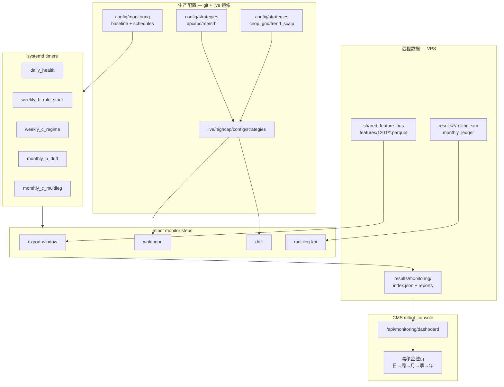
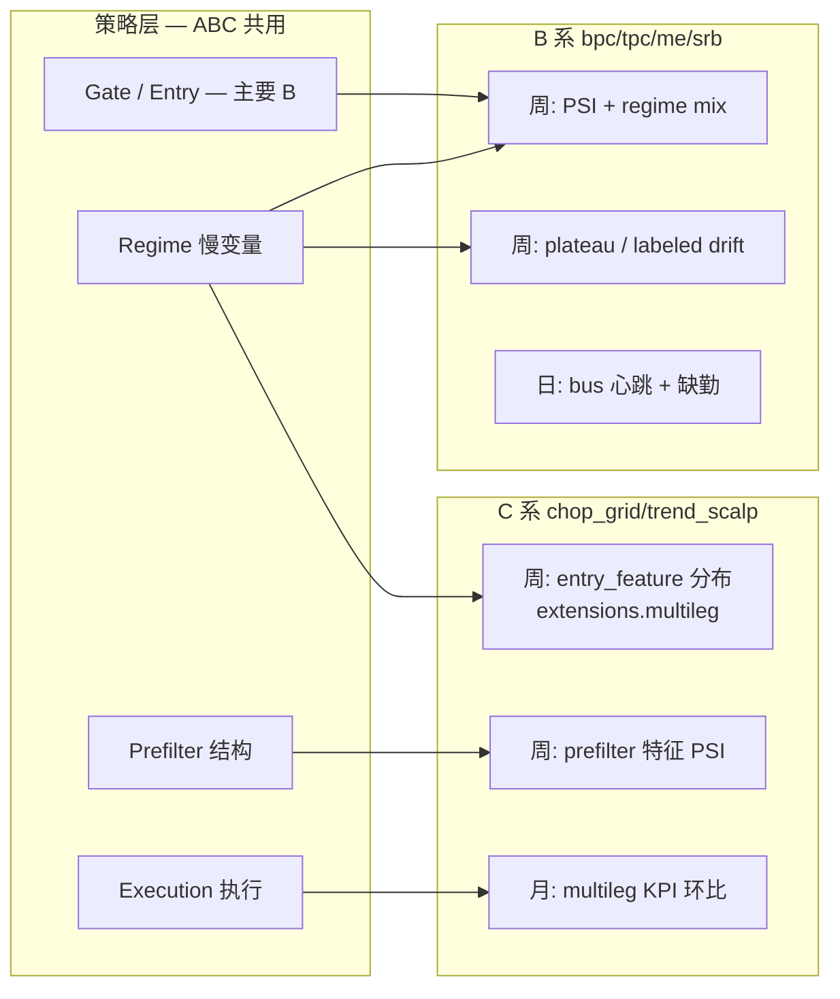
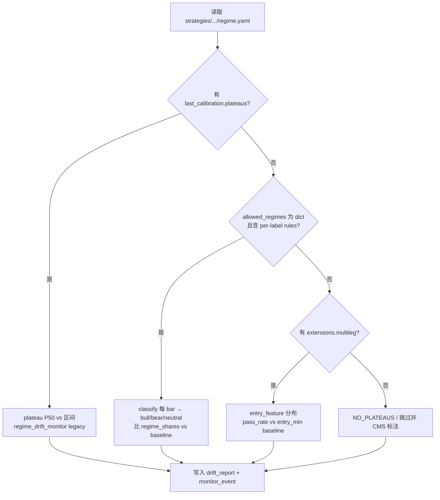
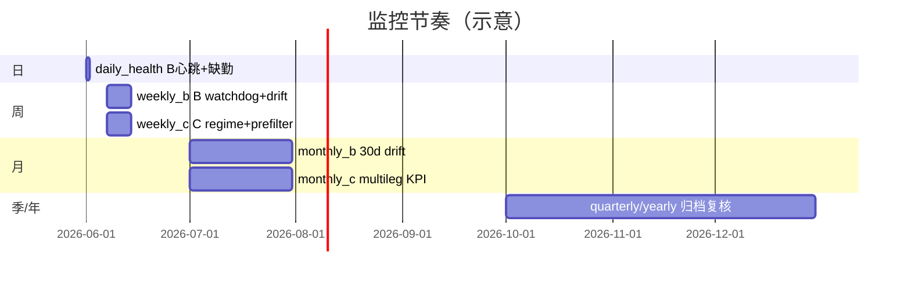
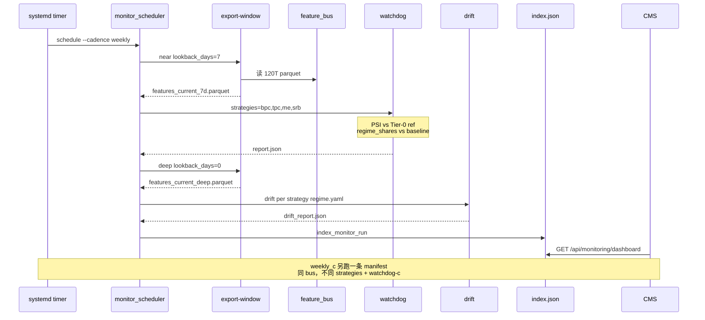
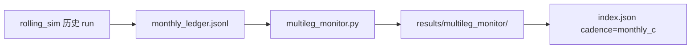
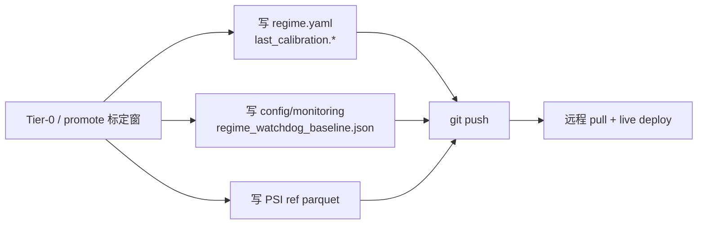

# 漂移监控：B / C 系统统一设计

> **状态**：设计稿（2026-06-11）  
> **读者**：实盘运维、策略 promote、CMS 使用方  
> **上位文档**：[漂移监控_mlbot_monitor_CN.md](漂移监控_mlbot_monitor_CN.md)（命令与远程分工）· [配置与监控_manifest迁移计划_CN.md](配置与监控_manifest迁移计划_CN.md)（manifest 迁移）  
> **代码锚点**：`config/monitoring/*.yaml` · `src/monitoring/` · `scripts/regime_*.py` · `scripts/multileg_monitor.py` · CMS `/monitoring`

---

## 1. 要解决的问题

| 现状 | 目标 |
|------|------|
| 日/周 cron 只跑 **B 四策略**（bpc/tpc/me/srb） | **B + C** 均有明确 cadence 与 CMS 卡片 |
| TPC regime 已换 **labeled `allowed_regimes`**（ADX+EMA），监控仍部分按旧 plateau/硬编码 EMA | **读 regime.yaml 本身**，schema 变则检测逻辑跟着变 |
| C（chop_grid/trend_scalp）只有 **`multileg monitor` 月报**，未接 feature bus 链 | C **Regime/Prefilter** 走 bus verb；**执行层** 保留 multileg 月报 |
| CMS 只见 `_factor_health`，看不出 regime 语义 | 卡片 + 表展示 **PSI / regime mix / multileg KPI** 分项 |

**原则（与迁移计划一致）**：一套 `mlbot monitor schedule`，**B/C 差异写在 manifest `steps`**，不维护第二套哲学。

---

## 2. 系统总览



**主路径**：远程 timer → manifest → bus（+ rolling 产物）→ report → `index.json` → CMS。  
**处置路径**：人看 CMS/TG → 本地 `rd_loop` / variant-grid → promote → 更新 baseline → git push → 远程 pull。

---

## 3. B 系与 C 系：同一模型、不同 manifest



| 维度 | B 系 | C 系 |
|------|------|------|
| **策略 slug** | `bpc`, `tpc`, `me`, `srb` | `chop_grid`, `trend_scalp` |
| **regime.yaml 形态** | 旧：`rules` + plateaus；新 TPC：`allowed_regimes{rules}` | `extensions.multileg`（`entry_feature`, `entry_min`, …） |
| **特征来源** | highcap feature bus（与 trend 同源） | 同 bus（需 publisher 输出 `bpc_semantic_chop` / `trend_confidence`） |
| **周监控** | watchdog(near 7d) + drift(deep bus) | watchdog-C（entry 通过率 + PSI）+ drift-C（prefilter 列，可选） |
| **月监控** | `monthly_drift`（30d plateau） | **`multileg monitor`**（rolling 月 KPI） |
| **执行层** | 未来 `ledger` / realized-R（T5） | **已有** multileg 月报 |

---

## 4. Regime 检测：三种 schema 统一适配

监控不再假设「全是 `last_calibration.plateaus`」。`src/monitoring/regime_health.py` 按 **regime.yaml 实际形态** 分支（已实现 / 计划）：



| Schema | 示例策略 | 检测什么 | baseline 写哪 |
|--------|----------|----------|---------------|
| **plateau** | bpc（旧） | 特征 P50 是否在 plateau 带内 | `regime.yaml` `last_calibration.plateaus` |
| **labeled** | tpc（E22 ADX+EMA） | 分类后 bull/bear/neutral **占比** | `regime_watchdog_baseline.json` → `regime_shares`，或 `last_calibration.regime_shares` |
| **multileg** | chop_grid, trend_scalp | `entry_feature >= entry_min` **通过率**；`exit_below` 滞后不在此检（引擎职责） | `last_calibration.multileg_baseline` 或 monitoring JSON |

**regime 改了能否检测到？**

- **B labeled（TPC）**：改 `allowed_regimes` 规则 → 下周 classify 结果变 → **regime_shares 漂移**（需 baseline）。✅ 已接线（`9eb4a88e`）。
- **B plateau（bpc/me/srb）**：改 plateau 或 rules → plateau drift / PSI。✅ 原有逻辑。
- **C multileg**：改 `entry_min` / `entry_feature` → **pass_rate 变**；🔲 本文 Phase 2 实现 `evaluate_multileg_regime_health`。

---

## 5. Cadence × Manifest 矩阵（目标态）

卡片顺序（CMS）：**日 → 周 → 月 → 季 → 年**。



| Cadence | manifest（计划路径） | strategies | 窗 | steps |
|---------|---------------------|------------|-----|-------|
| **daily** | `daily_health.yaml`（已有） | bpc,tpc,me,srb | near 1d | export-window → watchdog |
| **weekly** | `weekly_rule_stack.yaml`（已有） | bpc,tpc,me,srb | near 7d + deep 0d | export×2 → watchdog → drift |
| **weekly_c** | `weekly_c_regime.yaml`（**新增**） | chop_grid,trend_scalp | near 7d | export-window → watchdog-c → drift-c（可选） |
| **monthly** | `monthly_drift.yaml`（已有） | bpc,tpc,me,srb | 30d | export → drift |
| **monthly_c** | `monthly_multileg_c.yaml`（**新增**） | chop_grid,trend_scalp | rolling 月 | multileg-kpi |
| **quarterly/yearly** | 已有 | B 全系 | 长窗 | watchdog + drift 归档 |

**staleness_hours**（`schedules.yaml`）：weekly_c / monthly_c 与对应 B cadence 同级上限（周 192h、月 840h）。

---

## 6. 单次周更数据流（B + C 并列）



---

## 7. C 系月更：multileg 执行层



| 信号 | 含义 |
|------|------|
| `trend_regime_shift` | trend 腿 flip 频率月环比 |
| `chop_regime_shift` | chop entry 语义漂移 |
| `trade_shift` / `forced_shift` | 成交量、forced 率 |
| `threshold_shift` | 总 R 低于地板 |

与 B 的 **特征 parquet 链正交**：CMS **同页**展示，cadence 分卡（`月更·C`）。

---

## 8. Baseline 与 promote 后维护



**B 系 minimum（按策略）**

```yaml
# regime_watchdog_baseline.json 片段
"tpc": {
  "regime_shares": { "bull": 0.05, "bear": 0.45, "neutral": 0.50 },
  "source": "results/monitoring/tier0/..."
}
```

**C 系 minimum（计划）**

```yaml
# regime.yaml 或 monitoring JSON
last_calibration:
  multileg_baseline:
    chop_grid:
      entry_pass_rate: 0.38    # P(entry_feature >= entry_min)
      median_entry_feature: 0.55
    trend_scalp:
      entry_pass_rate: 0.22
```

Promote **E22 TPC ADX regime** 后：在标定窗上跑 `mlbot monitor catalog` 选 parquet → 算 `regime_shares` → 写入 baseline（**不要**沿用仅 `bull_share` 的旧 Tier-0）。

---

## 9. CMS 展示模型

| 卡片字段 | B 周更 | C 周更 | C 月更 |
|----------|--------|--------|--------|
| watchdog | PSI + regime_shares ALERT | entry_pass_rate ALERT | — |
| drift | plateau / labeled OK | prefilter PSI（可选） | multileg KPI WATCH |
| 详情表 | `因子健康 (PSI/IC)` | `chop_grid` / `trend_scalp` | `trend_regime_shift` 等 |

索引：`results/monitoring/index.json` + `rd_registry.sqlite` `monitor_event`（含 `detail_json`）。

---

## 10. 实施阶段

| 阶段 | 内容 | 状态 |
|------|------|------|
| **P0** | bus export + daily/weekly B + CMS 卡片 + Telegram | ✅ 已上线 |
| **P0.5** | labeled regime_shares（TPC ADX） | ✅ `regime_health.py` |
| **P1 B** | 补全 bpc/me/srb `regime_shares` baseline；live 同步 regime.yaml | 🔲 运维 |
| **P1 C manifest** | 新增 `weekly_c_regime.yaml`、`monthly_multileg_c.yaml`、`schedules.yaml` 条目 | ✅ |
| **P2 C verb** | `watchdog-c`：`extensions.multileg` pass_rate；`multileg-kpi` step 纳入 scheduler | ✅ |
| **P2 统一** | `strategies_source: constitution` + `strategy_support.yaml`（B 仅 `tpc` drift-ready） | ✅ |
| **P2 部署** | VPS timer 启用 `weekly_c` / `monthly_c`；补 C `multileg_baseline` | 🔲 运维 |
| **P3** | PSI 列从 gate/regime 自动推导；ledger realized-R（B 执行层） | 远期 |

---

## 11. 计划新增 manifest 示意

### `config/monitoring/weekly_c_regime.yaml`

```yaml
monitor_id: weekly_c_regime
output_dir: results/monitoring/weekly_c_regime/{run_ts}
strategies: [chop_grid, trend_scalp]
strategies_root: live/highcap/config/strategies   # 远程：与实盘一致

windows:
  near:
    source: feature_bus_export
    lookback_days: 7
    timeframe: 120T
    parquet: results/monitoring/window/{run_ts}/features_c_7d.parquet

watchdog_defaults:
  regime_share_tol: 0.10

steps:
  - export-window: { window: near }
  - watchdog-c:      # Phase 2：multileg entry pass_rate + PSI on entry_feature
      window: near
  - drift-c:         # 可选：prefilter 列 plateau
      window: near
      layer: prefilter
```

### `config/monitoring/monthly_multileg_c.yaml`

```yaml
monitor_id: monthly_multileg_c
output_dir: results/monitoring/monthly_multileg_c/{run_ts}
strategies: [chop_grid, trend_scalp]

steps:
  - multileg-kpi:
      rolling_root: results/trend_scalp/validate_static.full_study/_rolling_sim
      strategies: [chop_grid, trend_scalp]
```

### `schedules.yaml` 增补

```yaml
  weekly_c:
    manifest: config/monitoring/weekly_c_regime.yaml
    description: C regime/prefilter on 7d bus
  monthly_c:
    manifest: config/monitoring/monthly_multileg_c.yaml
    description: C execution layer multileg month-over-month
```

---

## 12. 与现有文档分工

| 文档 | 职责 |
|------|------|
| [漂移监控_mlbot_monitor_CN.md](漂移监控_mlbot_monitor_CN.md) | CLI、远程 cron、数据分层 §7、缺口表 |
| [配置与监控_manifest迁移计划_CN.md](配置与监控_manifest迁移计划_CN.md) | manifest 迁移 P0–P3、废弃 research_roll |
| **本文** | **B+C 统一拓扑、regime schema 适配、cadence 矩阵、CMS 模型、实施路线图** |
| [config/monitoring/README.md](../../config/monitoring/README.md) | 操作手册：catalog、Tier-0、systemd |

---

## 13. 验收清单（B+C 全接线后）

- [ ] `schedules.yaml` 含 daily / weekly / weekly_c / monthly / monthly_c / quarterly / yearly
- [ ] VPS timer 全 enable；`index.json` 无 MISSED（除故意停用的 cadence）
- [ ] TPC 改 `allowed_regimes` 后，周更 drift/watchdog 显示 **regime_shares** 而非仅 EMA 硬阈值
- [ ] chop_grid 改 `entry_min` 后，周更 C 卡 **entry_pass_rate** 可 ALERT（需 baseline）
- [ ] 月更 C 卡显示 multileg **WATCH/RETUNE** 与详情表
- [ ] live `regime.yaml` 与 git promote 同步；baseline 与标定窗同源

---

*文档版本：2026-06-11 · 对应代码：`regime_health` labeled 分支已落地；C verb 为 Phase 2。*
