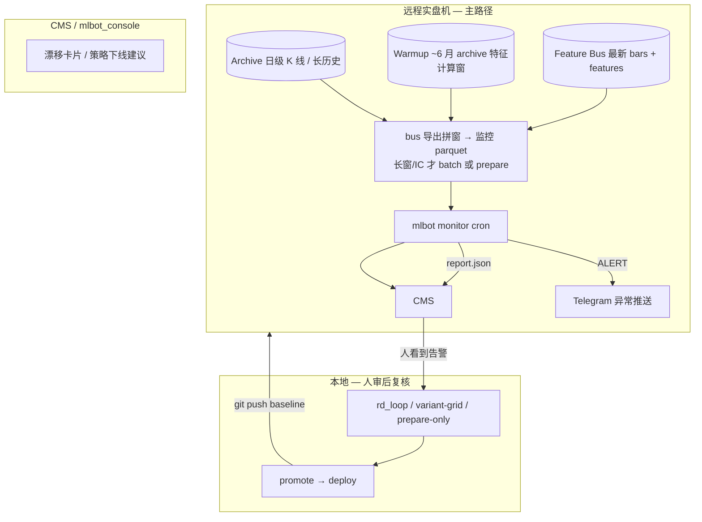
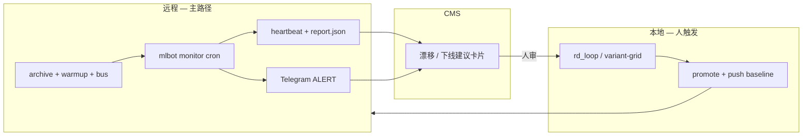
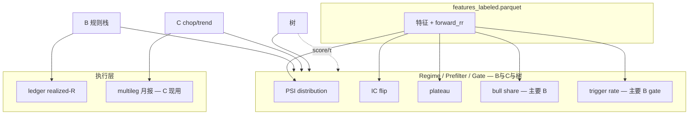
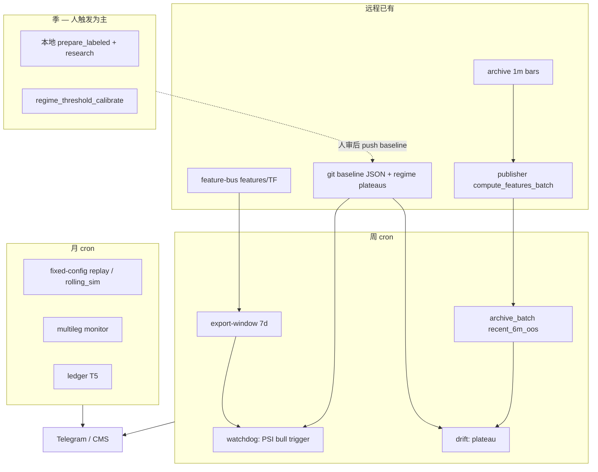
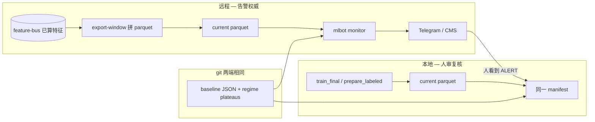
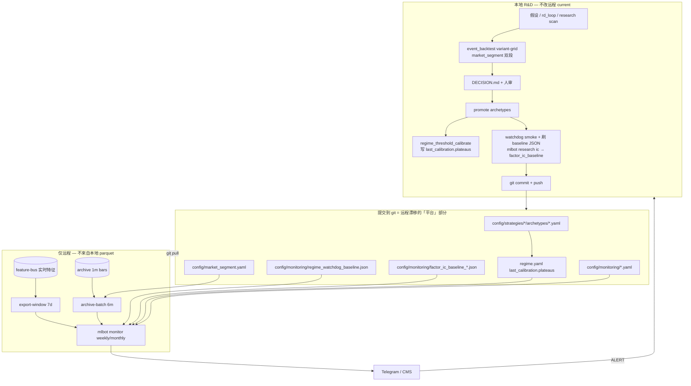

# 漂移监控：`mlbot monitor` 与远程 / 本地分工

> **权威入口**（③ 监控层）。与 [`ABC统一研究框架_CN.md`](ABC统一研究框架_CN.md) §6、[`方法论_R_and_D流程_CN.md`](方法论_R_and_D流程_CN.md) §2.6、[`WORKFLOW_整体架构与管线改进计划_CN.md`](WORKFLOW_整体架构与管线改进计划_CN.md) §6 一致；**命令以本文为准**。
>
> **运行主路径**：**远程实盘机自动 cron**（systemd timer）；本地可复跑同一命令做复核，**不是**日常监控主入口。
>
> **不负责**：改 `archetypes/*.yaml`、自动 promote、在线 Regime 分类器（见 [`NP问题.md`](../experiments/z实验_005_统一研究/archive/NP问题.md) §不足 1，远期）。

---

## 0. 目标架构（远程优先 · CMS · Telegram）



| 环节 | 谁做 | 做什么 |
|------|------|--------|
| **检测** | 远程 cron | `mlbot monitor`（watchdog + drift）；数据来自 archive + warmup + 最新 bus |
| **通知** | 远程 | **Telegram** 推送 ALERT / 策略需下线类异常（见 §6.4） |
| **展示** | CMS | 读 `results/monitoring/**/report.json` + heartbeat；卡片标红，链到决策模板 |
| **处置** | **本地** | 人审后在本地跑 `mlbot research` / `rd_loop` / `event_backtest` 验证；**不**在远程自动改 yaml |

本地与远程用**同一套 repo + 同一套 `mlbot monitor` 命令**；差异在 **`window.source`（数据从哪来）** 与 cron 是否常驻（见 §7.4）。

---

## 1. 设计是否合理

**合理**，前提是分清四件事：

| 角色 | 做什么 | 用什么 |
|------|--------|--------|
| **远程 cron（主）** | 自动跑 drift；TG 告警；结果进 CMS | **bus 已算特征 → 导出拼窗**（默认不重算）；见 §7.1 |
| **本地 R&D（辅）** | 人看到 CMS/TG 后在本地验证、训练、promote | `mlbot research` / `rd_loop` / `event_backtest` |
| **日历分段** | promote 决策窗的**唯一日期源** | [`config/market_segment.yaml`](../../config/market_segment.yaml) |
| **基线维护** | promote 后更新 **平台基线**，push git（远程 pull） | §10；`config/monitoring/*` + `regime.yaml` plateaus |

远程不必重跑完整 `rd_loop`；**发现漂移 ≠ 自动修复**，只告警 → CMS → 人 → 本地验证。

**不合理 / 勿混用**：

- 把 `mlbot pipeline run` + `research_roll` 当月度「监控」（会 optimize，违反 doctrine）。
- 用 `auto_research_pipeline --compare-only` 当 Drift-Only（仍会走完整研究链，见归档 `[研究模式与上线流程.md](../experiments/z实验_005_统一研究/archive/研究模式与上线流程.md)` 未实现项）。
- 期望 `mlbot monitor` 自动按 `market_segment` 切 parquet（**v1 未做**；见 §5 统一命令族、`prepare` verb；数据见 §7）。

---

## 1.1 审查结论与已知缺口（2026-06-02）

机制**框架合理**（watchdog / drift / weekly / exit-code 驱动），但**默认配置下基本不会告警**——在接入近端窗口数据源前，不宜视为「上线即生效」。详见 `[配置与监控_manifest迁移计划_CN.md](配置与监控_manifest迁移计划_CN.md)` §P0.5、监控缺口 TODO T1–T11（**C2 已于 2026-06-02 P0.5 修复**）。


| ID     | 严重度    | 缺口                                                                                                                                                                                                                                                                                                                                   | 影响                                                               |
| ------ | ------ | ------------------------------------------------------------------------------------------------------------------------------------------------------------------------------------------------------------------------------------------------------------------------------------------------------------------------------------ | ---------------------------------------------------------------- |
| **C1** | ~~致命~~ **已接线** | P0.5 已禁 train_final fallback；里程碑 2 落地 `export-window` + `archive-batch` + [`weekly_rule_stack.yaml`](../../config/monitoring/weekly_rule_stack.yaml) | 远程须 bus/archive 数据就绪；无 bus 行 → export **exit 3** |
| **C2** | ~~高~~ **已修** | ~~`regime_drift_monitor.py` 返回 2~~ → 已统一为 **1**（2026-06-02 P0.5） | 下游可统一 `exit=1` 为 ALERT |
| **C3** | 中      | baseline 仅覆盖 **TPC**；`--strategies bpc,tpc,me,srb` 时 bpc/me/srb 的 bull_share、trigger、IC **静默跳过**                                                                                                                                                                                                                                     | 多策略周跑名义上全跑，实际只盯 TPC                                              |
| **C4** | 中 | **CMS 漂移卡片未做**；TG 已接 systemd `OnFailure`（[`mlbot-monitor-notify@`](../../etc/systemd/mlbot-monitor-notify@.service) + heartbeat 摘要） | 业务级 CMS 卡片仍待做 |
| **C5** | 低/远期   | 无 realized-R vs expected-R（实盘成交 vs 回测预期）漂移                                                                                                                                                                                                                                                                                           | v1 已知缺口，见 NP 问题归档                                                |
| **C6** | ~~高~~ **已修** | manifest / `run_weekly.sh`（`MLBOT_MONITOR_AUTO_WINDOW=1`）产 `features_current_7d` + `features_current_6m`；`watchdog`/`drift` 分窗 | 依赖 T1 数据源在远程可用 |
| **C7** | ~~中~~ **已修** | PSI/IC/plateau 收敛到 [`stat_kernels/drift.py`](../../src/research/stat_kernels/drift.py)；watchdog/drift 已引用 | `distribution`/`score` verb 仍属 T8 后续 |


**已验证 OK**（审查时）：bpc / tpc / me / srb 的 `archetypes/regime.yaml` 均有 `last_calibration.plateaus`；TPC bull-only gate 规则仍在 canonical `[gate.yaml](../../config/strategies/tpc/archetypes/gate.yaml)`。

**阻断项**：远程 cron 须保证 **bus 有 7d 行** 且 **archive/prepare 可出 6m 窗**；未设 parquet 且未开 `MLBOT_MONITOR_AUTO_WINDOW` → **exit 3**。

### 1.2 代码审查证据（2026-06-02）

| 审查项 | 证据 | 结论 |
|--------|------|------|
| CLI 对称性 | [`main.py`](../../src/cli/main.py) `monitor`: export-window / archive-batch / run / weekly | `score`/`distribution` 仍待 T8 |
| 内核 **C7** | [`stat_kernels/drift.py`](../../src/research/stat_kernels/drift.py) + watchdog/drift 引用 | 已共享 rank_ic（scipy） |
| 远程产数 **C1** | [`export_feature_bus_window.py`](../../scripts/monitoring/export_feature_bus_window.py)；[`archive_batch_window.py`](../../scripts/monitoring/archive_batch_window.py) | 须远程 bus/archive 数据 |
| 双窗 **C6** | [`weekly_rule_stack.yaml`](../../config/monitoring/weekly_rule_stack.yaml)；`DRIFT_PARQUET` 默认 6m batch | 已分窗 |
| exit code **C2** | `regime_drift_monitor.py` 曾 L209 `return 2` | **P0.5 已改为 1** |
| 运维 **C4** | [`mlbot-monitor-notify@.service`](../../etc/systemd/mlbot-monitor-notify@.service) + [`monitor_telegram_notify.sh`](../../scripts/monitoring/monitor_telegram_notify.sh) | CMS 卡片仍待做 |
| ABC+树 | watchdog 默认 `bpc,tpc,me,srb`；无 tree slug | 树需 `score` verb + baseline（T8） |

---

## 2. 工作流（远程检测 → CMS/TG → 本地验证）



1. **远程（自动）**：timer 触发 `mlbot monitor`；用 §7 数据分层拼出**近端 current 窗** parquet；ALERT → **Telegram** + 写 `results/monitoring/**`。
2. **CMS（展示）**：索引最新 `report.json` / `heartbeat.json`；标红 ALERT、缺勤、策略级「建议复核/暂停新开」；链到 `_new_decision_doc.py` 模板与推荐 `rd_loop` 命令（实现见 [`RD控制台_研发监控管理对账_设计_CN.md`](../architecture/RD控制台_研发监控管理对账_设计_CN.md) §7，**待做**）。
3. **本地（人审后）**：看到 CMS/TG 后在本地复跑 monitor（可选）、开 `config/experiments` 实验、`event_backtest --variant-grid` 验因果；promote 后更新 baseline 并 push。
4. **响应节奏**：监控**不自动**改 yaml、不自动下线；人确认后再走 experiments → promote → deploy。legacy README 图 4 的 L2 `research_roll` 改为 **drift → 本地 experiments**（不必 research_roll）。

---

## 3. `mlbot monitor` 命令

与 `mlbot research` 并列：**只读检测**。


| 退出码 | 含义      | 来源                                         |
| --- | ------- | ------------------------------------------ |
| `0` | 正常      | watchdog / drift                           |
| `1` | ALERT   | `regime_watchdog.py`、`regime_drift_monitor.py` |
| `3` | 输入/配置错误 | 缺 parquet / 未设 `WATCHDOG_PARQUET`（周跑）等 |


**下游约定**：`mlbot monitor weekly` / `run_weekly.sh` 将任一非零折叠为 ALERT；接 Telegram/Grafana 时建议 **exit ≠ 0** 即告警，勿只监听 exit 1。

```bash
mlbot monitor --help
mlbot monitor segments                    # 列出 market_segment.yaml
mlbot monitor watchdog --window-parquet …   # → scripts/regime_watchdog.py
mlbot monitor drift --window-parquet …      # → scripts/regime_drift_monitor.py
mlbot monitor contract …                  # → scripts/pre_deploy_contract_checks.py
mlbot monitor weekly                      # watchdog + drift + heartbeat（见 §6）
mlbot multileg monitor                    # C 执行层月报（待并入 monitor multileg；Regime/Prefilter 应走本组 parquet verb）
```

### 3.1 `watchdog` — Regime / Gate / 因子健康


| 检测项                | 说明                                         | 典型阈值                   |
| ------------------ | ------------------------------------------ | ---------------------- |
| `ema_1200` 分布      | bull / bear / neutral 占比                   | bull_share 偏离基线 > 10pp |
| Bull-only gate 触发率 | variant H 类规则                              | 相对基线 > 50%             |
| PSI                | 特征分布 vs 基线 parquet                         | PSI > 0.25             |
| IC sign-flip       | 当前窗 rank IC vs `factor_ic_baseline_*.json` | 同特征符号反转且 |IC| > 0.02   |


```bash
mlbot monitor watchdog \
  --strategies tpc,bpc,me,srb \
  --window-parquet results/<run>/features_labeled.parquet \
  --baseline-json config/monitoring/regime_watchdog_baseline.json \
  --output results/monitoring/watchdog/$(date -u +%Y%m%d)
```

产物：`report.json`、`summary.txt`；目录默认 `results/regime_watchdog/<ts>/`（脚本 `--out-dir`）。

### 3.2 `drift` — Regime plateau 漂移

读取各策略 `archetypes/regime.yaml` 的 `last_calibration.plateaus`，比较当前窗分位是否落在 plateau 外。

```bash
mlbot monitor drift \
  --strategies bpc,tpc,me,srb \
  --window-parquet results/<run>/features_labeled.parquet \
  --emit-rd-loop-suggestions
```

ALERT 时可生成 `results/drift_suggestions/<ts>/rd_loop_*_snippet.yaml` 供人审后跑 `rd_loop`。

### 3.3 `contract` — 上线前契约（人触发）

```bash
mlbot monitor contract --strategy tpc \
  --run-root results/<strat>/pre_deploy_replay/<date>
```

`BLOCKED` → 禁止 deploy（`deploy_config_to_live.py` 强制校验仍为 **待办**，见 WORKFLOW 附录 A #7）。

### 3.4 `segments` — 日历分段

```bash
mlbot monitor segments
mlbot monitor segments --config config/market_segment.yaml
```

输出与 `[scripts/event_backtest/market_segment.py](../../scripts/event_backtest/market_segment.py)` 一致，供 `event_backtest --variant-grid` 与监控窗对齐。

### 3.5 `weekly` — 周 bundle（推荐远程 cron）

```bash
export WATCHDOG_PARQUET=/path/to/features_current_7d.parquet   # 必填
export DRIFT_PARQUET=/path/to/features_current_6m.parquet      # 可选；默认同 WATCHDOG
mlbot monitor weekly
# 或: mlbot monitor weekly --window-parquet ... --drift-parquet ...
```

等价 `scripts/monitoring/run_weekly.sh`：依次 **watchdog + drift**，写 `results/monitoring/weekly_watchdog/<ts>/heartbeat.json`；**任一 ALERT → 非零退出码**。

---

## 4. 检测算法原理（现行实现）

监控按 **层** 选 verb，与 ABC 分层一致（见 [`ABC统一研究框架_CN.md`](ABC统一研究框架_CN.md)）。**算法**（PSI / IC / plateau）对任意特征列通用；**现况**是 B 已接 `features_labeled.parquet`，C 的 regime/prefilter 尚未接入同一 prepare 链，执行层另用 rolling 月报（§4.3）。

### 4.1 `regime_watchdog` — 四类检测

| 算法 | 在问什么 | 怎么做 | 默认阈值 |
|------|----------|--------|----------|
| **PSI** | 特征**整段分布**是否相对参考窗变了 | 用参考分布分位数切 10 桶，算两分布占比差的对数加权和：\(\sum (p_{cur}-p_{ref})\ln\frac{p_{cur}+\epsilon}{p_{ref}+\epsilon}\) | PSI > 0.25 |
| **IC sign-flip** | 特征对 label 的**排序预测方向**是否反了 | 当前窗 Spearman(特征, `forward_rr`) vs baseline JSON 的 `rank_ic`；`baseline×current < 0` 且 \|IC\| > 0.02 | 符号翻转 |
| **Bull share** | 强多头/空头占比是否相对标定变很多 | `ema_1200_position≥0.10` 为 bull；当前 `bull_share` vs baseline | \|Δ\| > 10pp |
| **Trigger rate** | bull-only gate 在 bull 段**实际命中率**是否相对标定漂移 | 从 `gate.yaml` 抽 variant H 类规则，算 `mean(特征在 deny 带 ∧ bull)`，相对 baseline 变化 | \|rel\| > 50% |

**PSI 直觉**：不看均值差多少，而看分布形状是否换簇（低波→高波）。**IC 直觉**：不是 IC 小跌，而是**正负对调**，旧规则语义可能整体失效。

实现：[`scripts/regime_watchdog.py`](../../scripts/regime_watchdog.py)。

### 4.2 `regime_drift_monitor` — Plateau 漂移

| 算法 | 在问什么 | 怎么做 |
|------|----------|--------|
| **Plateau P50** | regime 标定时的「平坦高原」是否还盖住当前市场 | 读 `regime.yaml` → `last_calibration.plateaus`；当前窗特征 **P50** 是否在 `[plateau.start, plateau.end]`；否则 DRIFT |

与 PSI 区别：PSI 看**全分布**；plateau 看**一个分位点**是否仍在标定区间。

实现：[`scripts/regime_drift_monitor.py`](../../scripts/regime_drift_monitor.py)。

### 4.3 `multileg_monitor` — C **执行层**健康（现实现 · 月报环比）

C 与 B 一样分 **Regime → Prefilter → 执行**；层数少（无 B 式 gate/entry 规则栈），执行是多腿 grid/dual_add。**目标态**：Regime/Prefilter 走 §4.1–4.2 同一套 `distribution` / `plateau` / `ic`（`--layer regime|prefilter`，`features_labeled.parquet` + `last_calibration.plateaus`）；本节是**今天已落地**的执行层代理——读 `rolling_sim` 月度 ledger，**近期月 vs 基线月**比较，例如：

| 信号 | 原理 |
|------|------|
| `trend_regime_shift` | 月内 trend flip 次数变化 > 15% |
| `chop_regime_shift` | entry_chop / median_chop 变化 > 15% |
| `forced_shift` / `trade_shift` | forced 率升、成交量相对基线 < 60% |
| `threshold_shift` | 总 R 低于地板 |
| `risk_stop_shift` / `seg_win_shift` | 止损率、段胜率恶化 |

输出：`OK` / `WATCH` / `RETUNE_THRESHOLDS` / `FEATURE_REVIEW` / `OFFLINE` 等。实现：[`scripts/multileg_monitor.py`](../../scripts/multileg_monitor.py)。

### 4.4 对 B / C / 树 是否都「有效」

| 策略族 | 默认 weekly 包 | 目标 manifest（按层） | 现况 |
|--------|----------------|----------------------|------|
| **B**（bpc/tpc/me/srb） | ✅ `watchdog` + `drift` | Regime+Prefilter+Gate：`distribution`/`plateau`/`gate-health`/`ic`；执行：`ledger`（T5） | 主接线；TPC baseline 最全（C3） |
| **C**（chop_grid/trend_scalp） | ❌ 未进默认 `--strategies` | **同 verb 族**：Regime+Prefilter → `plateau`/`distribution`/`ic`；执行 → `ledger` 或 **`multileg`**（月报 KPI） | Regime/Prefilter **未接** parquet 链；执行层用 `multileg monitor`（实现债，非架构例外） |
| **树**（fast_scalp/short_term_swing） | ❌ 未接线 | `distribution`/`ic`/`score`（τ）；可选 `plateau` | 数学上同 B；无 bull-only `gate-health` |

**各层覆盖（B，特征 parquet 齐全时）**：

| 层 | 主要靠什么 |
|----|------------|
| Regime | plateau P50 + EMA bull/bear |
| Prefilter / Direction | PSI、IC（特征在 parquet） |
| Gate | PSI、IC、bull_share、trigger_rate |
| Entry | PSI、IC（无 hit_rate↔trade R 联动） |
| Execution | **不靠** watchdog；需 ledger / realized-R（T5） |



### 4.5 监控节奏 × 层 × 算法 × 数据窗（方案 Review）

与 [`为何不做滚动调阈值_与研究节奏_CN.md`](为何不做滚动调阈值_与研究节奏_CN.md) §0、[`方法论_R_and_D流程_CN.md`](方法论_R_and_D流程_CN.md) §3 维护节奏表一致：**周/月/季/年对应不同层、不同算法、不同 current 窗；不是同一 parquet 跑全套。**

#### 4.5.1 总表（目标分工）

| 节奏 | 主要问什么 | 策略层 | 算法（现有/计划） | current 窗（语义） | 远程产数方式 |
|------|------------|--------|-------------------|-------------------|--------------|
| **周** | 实盘分布是否**突然**变了？ | **Gate**（+ 快变量 prefilter） | PSI、bull_share、trigger_rate | 近 **7–14d**（≈ bus 深度） | **`feature_bus_export`**（不重算） |
| **周** | Regime plateau 是否仍盖住市场？ | **Regime** | plateau P50 vs `last_calibration` | bus 滚动深度内 **120T** 样本（≈数月） | **`feature_bus_export`**（`lookback-days 0` 或足够长） |
| **月** | 锁死 config 下 PnL/触发是否恶化？ | **Execution**（全链路） | 固定 config `event_backtest` / `rolling_sim` 月 KPI | 最近 **1–3 月** | **replay 产物**（`monthly_ledger`、trades），非特征 parquet |
| **月** | C 段级语义是否漂？ | **Regime/Prefilter（C）** + 执行 | multileg 月报环比（chop/trend/forced） | **6 月** rolling 月均值 | `rolling_sim` + `multileg monitor` |
| **月**（可选） | 因子方向是否衰减？ | Prefilter / Gate | IC sign-flip、PSI 趋势 | **30–90d** | `archive_batch` + **`prepare_labeled`**（要 `forward_rr`） |
| **季** | 是否该 **reopen R&D** / 重标定 regime？ | **Regime** + 慢 prefilter | plateau 全量复核 → 人触发 `regime_threshold_calibrate` | `recent_6m_oos` + 双段 segment | 远程 **archive_batch**；重标定仍在 **本地 experiments** |
| **季**（C） | chop/trend 路由阈值是否仍对？ | C prefilter 语义 | `mlbot research scan` + 多腿回测 | 季度窗 | **本地**为主；远程仅月报告警驱动 |
| **年** | archetype / 方向公式 / A1 周期 | Direction、A1 | 结构复盘、长段 replay | `bear_2022` / `bull_2023_2024` 等 | **本地** `event_backtest`；远程不参与自动改 yaml |

**要点**：

- **周 ≠ 只跑一个窗**：gate-health 用 **短窗 bus**；regime plateau 用 **长窗 batch**——现 `monitor weekly` 对二者喂**同一份** parquet 是 **设计缺口（C6）**，应拆 manifest 或双 `window` 输出。
- **月 ≠ optimize**：`run_monthly.sh` 若仍调 `calibrate_roll` 且 `optimize: true` 则违反 doctrine；月任务应是 **固定 config replay**（见迁移计划 P2）。
- **季/年 ≠ cron 改 yaml**：季是 **drift 累计 → 人审**；年是 **架构级** 复盘。

#### 4.5.2 算法与数据窗是否匹配

| 算法 | 需要什么列 | reference 从哪来 | current 窗多长才合理 | 仅 bus 导出够吗？ |
|------|------------|------------------|----------------------|------------------|
| **PSI** | 特征列 | baseline JSON 里 `source_parquet`（标定 holdout，**≠ current**） | 短窗可看「近端突变」；与 6m 标定对比需 **同 TF 足够 bar 数** | ✅ 短窗够；长窗对比要 **archive_batch** |
| **IC sign-flip** | 特征 + **`forward_rr`**（或 label） | `factor_ic_baseline_*.json` | 通常 **≥30d**，与 IC 扫描一致 | ❌ bus **无 label** → **`prepare_labeled`** 或月/季本地 |
| **Plateau P50** | regime 特征 + `regime.yaml` plateaus | plateaus 在 yaml（标定时的高原） | **regime 慢变量**：应对齐 promote 用的 **`recent_6m_oos`**，不是 7d | ❌ 仅 7d bus **不够** → **archive_batch**（你提到的 6m 场景） |
| **Bull share / trigger** | `ema_1200_position`、gate 特征 | `regime_watchdog_baseline.json` | **7–30d** 可操作漂移 | ✅ bus 导出通常够 |
| **Multileg 月报** | 成交 KPI、段 CSV | rolling 历史前半 vs 后半 | **月** | ❌ 不吃特征 parquet |
| **Ledger / realized-R** | 实盘成交 | 回测预期 R | **月** | ❌ order DB / 日志（T5） |

**Review 结论**：

1. **方案方向对**：远程默认 **不重算**（bus export）+ 缺长窗/label 时 **`archive_batch` / `prepare_labeled`** 分层，与「实时已在算特征」一致。
2. **必须补一层 `archive_batch`**：凡对齐 `market_segment.recent_6m_oos` 的 **regime plateau**（以及可选的长窗 PSI），不能指望 bus 滚动 7d。
3. **`prepare_labeled` 不是每周必跑**：仅在 manifest 含 **IC**、或要与本地 `train_final` 同构时使用；可与季审合并。
4. **现实现最大错位**：曾 fallback 全历史 train_final（C1，P0.5 已禁）；**产数**仍待 T1；周跑已支持 `WATCHDOG_PARQUET`/`DRIFT_PARQUET` 分路径（C6 接线，里程碑 2 自动产窗）。

#### 4.5.3 远程产数（按节奏）



| 步骤 | 命令（目标态） | 输入 | 输出 |
|------|----------------|------|------|
| 短窗特征 | `monitor export-window --lookback-days 7` | `bus/features/<TF>/*.parquet` | `features_current_7d.parquet` |
| 长窗特征 | `monitor archive-batch --segment recent_6m_oos` | `archive/bars` + 策略 `features.yaml`（**复用 publisher 算子**） | `features_current_6m.parquet`（**无** `forward_rr` 除非再跑 label 步） |
| 带 label | `monitor prepare-labeled` 或 `train final --prepare-only` | archive 或本地 bars + segment | `features_labeled.parquet` |
| 周检测 | `watchdog --window-parquet …7d` + `drift --window-parquet …6m` | 上两文件 + git baseline | `report.json` |
| 月检测 | `monitor run --config monthly_*.yaml` | replay 目录 | 月 KPI / multileg 报告 |

**`archive_batch` vs `prepare_labeled`**：

| | archive_batch | prepare_labeled |
|--|---------------|-----------------|
| 算什么 | 与实盘一致的 **特征列** | 特征 + **label**（`forward_rr` 等） |
| 算力 | 中（按 segment 天数 × symbols） | 高（全 label 管线） |
| 用于 | 周 **regime plateau**、长窗 PSI | **IC**、entry 层、与本地 R&D 对拍 |
| 远程频率 | **周或月**（仅长窗 manifest） | **季**或 ALERT 后本地，不建议周 cron |

---

## 5. 统一监控命令族设计（目标态 · 是否合理）

**结论：合理，且应与 `mlbot research` 同构**——研究族回答「有没有效、阈值多少」；监控族回答「相对标定是否还健康、要不要人审」，**只告警、不改 yaml**。

### 5.1 与 `mlbot research` 的对称

| 维度 | `mlbot research`（① 假设 / ② 部分验证） | `mlbot monitor`（③ 运维） |
|------|------------------------------------------|---------------------------|
| 问什么 | 效应、plateau 是否存在、IC 衰减 | 分布/IC/plateau/成交是否**漂出标定** |
| 改 yaml？ | 否（promote 才改） | **永不** |
| 主跑哪里 | 本地实验为主 | **远程 cron 为主** |
| 配置 | `config/experiments/*.yaml` | `config/monitoring/*.yaml`（计划） |
| 数据 | `features_labeled`（实验窗） | **current**：优先 **bus 导出**；长窗/IC 才 archive batch 或 prepare + git baseline |

### 5.2 目标 verb 清单（ABC + 树 + C）

```
mlbot monitor <verb> [options]

verbs（目标态，粗体=已有薄壳）:
  export-window  从 **feature-bus** 拼短窗 parquet（周 gate-health，不重算）
  archive-batch  从 **archive** 按 segment 跑 publisher 同引擎特征（周 regime / 6m plateau）
  prepare-labeled  特征 + label（IC、与 train_final 同构；季审或本地为主）
  distribution  PSI + 可选分位摘要（通用，任意 --strategy）
  ic           IC vs baseline + sign-flip（需 --target，树用 forward_rr / label）
  plateau      当前窗分位 vs last_calibration.plateaus（regime/prefilter/gate 层）
  gate-health  bull_share + bull-only trigger_rate（规则栈 gate）
  score        树 score 分布 PSI + τ 偏离（树通道）
  ledger       realized-R / 拒因 vs 预期（执行层，读 live 账本）
  multileg     C **执行层**月报健康（并入本组；与 Regime/Prefilter 的 parquet verb 并列，非替代）
  contract     上线前契约（已有）
  run          读 config/monitoring/*.yaml 跑整条 job
  weekly       远程默认 bundle（演进为 run + 默认 manifest）
```

**统一参数**（对齐 research）：

```
--strategy <slug>              bpc | tpc | me | srb | fast_scalp_* | chop_grid | ...
--layer {regime|prefilter|gate|entry|direction|score}
--features-parquet PATH      current 窗；prepare 产出
--baseline-dir PATH          config/monitoring/<slug>/ 或 per-job yaml
--target forward_rr|label|...
--segment recent_6m_oos        对齐 market_segment.yaml
--window-source feature_bus_export|archive_batch|prepare_labeled|parquet_path
--output / --out-dir
```

### 5.3 策略族 → verb 映射

| 族 | 必跑 verb | 可选 |
|----|-----------|------|
| **B 规则栈** | `export-window` → `distribution` → `plateau` → `gate-health`；`ic` 需 `prepare` 或本地 | `ledger` |
| **树** | `export-window` → `distribution` → `score`；`ic` 可选 prepare | `plateau` 若有 regime.yaml |
| **C**（chop_grid/trend_scalp） | `export-window` → `plateau` + `distribution`（regime/prefilter） | `multileg` / `ledger`；**无** `gate-health` |
| **A**（spot 等） | `ledger` + infra Grafana；规则 drift 按产品需求加 | 通常不跑 gate-health |

### 5.4 实现路线（建议）

| 阶段 | 内容 | 说明 |
|------|------|------|
| **现况** | `watchdog` ≈ distribution + gate-health + ic；`drift` ≈ plateau | 脚本名历史遗留 |
| **P0** | `monitor run` + **`export-window`（bus 拼窗）** + 去 train_final fallback | 见迁移计划 P0/P0.5 |
| **P1** | 内核收到 `src/monitor/`（或 `src/research/stat_kernels/drift.py`）：PSI、IC、plateau 单函数 | 与 research 共用分位数/IC 实现 |
| **P2** | `monitor score`（树）、`monitor ledger`（T5）；`multileg` 并入 `monitor` 组 | 消灭 `mlbot multileg monitor` 第二入口 |
| **P3** | per-strategy `config/monitoring/<slug>.yaml`；CMS/TG 读统一 `report.json` schema | 远程日更 cron |

**原则**：

- 新告警逻辑**先进内核 + verb**，不要再加 `regime_watchdog2.py`。
- B/C/树差异放在 **manifest 的 steps 列表**，不是三套脚本。
- 远程 `monitor run` = 默认 **`export-window`（bus）** + 各 verb；含 `ic` 时再 `prepare` 或本地复核。

详见 [`配置与监控_manifest迁移计划_CN.md`](配置与监控_manifest迁移计划_CN.md) §P0、§6.1（T1–T7）。

### 5.5 C 系统与 B 共用监控模型（结论存档）

| 命题 | 结论 |
|------|------|
| C 是否「架构上另一套监控」？ | **否**。与 B 同为 **Regime → Prefilter → 执行**；层数少（无 gate/entry 规则栈），执行是多腿。 |
| 统一 `mlbot monitor` 是否合理？ | **是**。manifest 里 **steps 更短**（无 `gate-health`），不是第二套哲学。 |
| `multileg monitor` 是什么？ | **执行层**健康检查（月报 KPI），与 Regime/Prefilter 的 parquet verb **并列**，不替代 plateau/PSI/IC。 |
| 为何今天像「两套入口」？ | **实现债**：C 的 regime/prefilter 未接 `prepare`→parquet 链；`multileg_monitor.py` 从 rolling 段 CSV 代理 regime 语义。 |
| 目标 manifest（C） | `prepare` → `plateau`/`distribution`/`ic`（`--layer regime\|prefilter`）→ `multileg` 或 `ledger`（执行） |

与 [`ABC统一研究框架_CN.md`](ABC统一研究框架_CN.md) Phase 1（B/C 共用 `scan feature-plateau`、`ic`）一致；监控只是 Phase 4 的只读镜像。

---

## 6. 功能点清单（实现状态）


| 功能                         | 命令 / 脚本                                    | 本地  | 远程 cron  | 状态                                             |
| -------------------------- | ------------------------------------------ | --- | -------- | ---------------------------------------------- |
| Gate / EMA / 触发率           | `monitor watchdog`                         | ✅   | ✅        | 已落地                                            |
| PSI / IC drift             | `monitor watchdog`                         | ✅   | ✅        | 已落地                                            |
| Regime plateau 漂移          | `monitor drift`                            | ✅   | ✅        | 已落地                                            |
| Drift → rd_loop 建议         | `monitor drift --emit-rd-loop-suggestions` | ✅   | 可选       | 已落地                                            |
| 周 bundle + 心跳              | `monitor weekly`                           | ✅   | ✅        | 已落地（`etc/systemd/mlbot-weekly-watchdog.timer`） |
| 月 replay 趋势                | `scripts/monitoring/run_monthly.sh`        | ✅   | ✅        | 已落地（非 `mlbot monitor` 子命令）                     |
| 上线 contract                | `monitor contract`                         | ✅   | deploy 前 | 已落地                                            |
| 多腿 rolling 漂移              | `mlbot multileg monitor`                   | ✅   | ✅        | 已落地（C 系统）                                      |
| **近端窗口（bus 导出）**          | feature-bus 拼窗（不重算）                    | —   | —        | **未做（C1）**；勿 train_final 全历史当 current              |
| **本地/远程 parquet 分工**     | 本地已有 `train_final` 等                     | 远程需 **prepare** 产窗 | 见 **§7.4**；禁止把本地 parquet 当远程 cron 输入 |
| 按 segment 自动切 parquet      | —                                          | —   | —        | **未做**（§7）                                     |
| 统一 monitor verb 族（§5）   | `export-window` / run / score / ledger     | —   | —        | **设计态**；现仅 watchdog/drift/weekly           |
| Prometheus / `quant_rd` 看板 | RD 控制台 P3                                  | —   | 可选       | 设计稿，未做                                         |
| CMS 漂移卡片 + 缺勤 | mlbot_console / RD 控制台 | — | 远程读 report | **待做**（目标：远程 ALERT 主展示面） |
| Telegram monitor ALERT | `quant_telegram_notify.sh` / Grafana | — | 远程 | **待做**（P0.5 T4；infra 告警已有） |
| deploy 强制 7 天 contract     | WORKFLOW A#7                               | —   | —        | 未做                                             |
| 实时 TREND/RANGE/CRISIS 分类   | NP §不足 1                                   | —   | —        | 不在 monitor v1                                  |
| OOD / 流形偏离                 | NP §不足 2                                   | —   | —        | 不在 monitor v1                                  |
| Strategy sharpe 自动告警       | rolling_dashboard                          | 看板有 | alert 无  | 半实现                                            |


---

## 7. 远程数据分层与监控窗（解决 C1）

远程实盘机已有三类数据（见 [`FEATURE_BUS_DATA_PIPELINE_CN.md`](../deployment/FEATURE_BUS_DATA_PIPELINE_CN.md)）。**Publisher 已在跑 `compute_features_batch`（读 archive ~150d + memory）并写入 bus**——监控默认应 **消费 bus 产物**，而不是再跑一遍 `train final --prepare-only`。

| 层 | 路径 / 含义 | 与监控的关系 |
|----|-------------|--------------|
| **Feature Bus** | `live/shared_feature_bus/features/<TF>/<SYMBOL>.parquet` | **默认 current 窗**：导出/拼接 → `watchdog`/`drift`（PSI、plateau、bull_share、trigger） |
| **Archive 1m bars** | `live/highcap/data/bars/...` | Publisher **已用**其算 bus；仅当监控窗 **长于 bus 滚动深度**（~7d，`--max-rows`）时才 **archive batch** 重算特征 |
| **本地 train_final** | `results/train_final/.../features_labeled.parquet` | **不**作为远程 cron 输入；含 **label**（`forward_rr`），供本地 R&D / IC 复核 |

### 7.0 为何不必默认 `monitor prepare`？

| 问题 | 说明 |
|------|------|
| Bus 里有没有特征？ | **有**。与实盘策略同路径：`compute_features_batch` → `append_features`。 |
| 那文档为何写 prepare？ | 历史表述混了两件事：**(1) 拼成 watchdog 可读的单 parquet**；(2) **带 label 的 train_final**。远程周监控主要是 (1)，不是 (2)。 |
| 何时才要重算？ | ① 监控窗 > bus 深度（要对齐 `recent_6m_oos` 全段）；② manifest 开了 **IC sign-flip**（需 `forward_rr` 等 label）；③ 与本地 train_final **列级对拍**。 |
| Bus 算 `ema_1200` 够不够？ | **够**（对 bus 内每一行）：算子时已 merge archive 长窗，不是「只用 bus 里 7 根 bar 心算」。缺的是 **bus 文件里只有近 ~7 天行**，不是算子短窗。 |

### 7.1 推荐拼窗方式（远程 cron）

**周跑默认（两路 current，均来自 bus，解决 C6）**：

1. **reference**：git `config/monitoring/*_baseline.json` + `regime.yaml` plateaus；PSI 的 reference 来自 baseline 内 `source_parquet`（标定窗），**≠** 任一 current。
2. **current 短窗**（gate / PSI 突变）：`export-window --lookback-days 7` → `features_current_7d.parquet`
3. **current 长窗**（regime plateau）：`export-window --lookback-days 0`（bus 滚动快照全量）→ `features_current_long.parquet`。**不**在 monitor 时 `prepare-only`；publisher 已持续 append 120T 特征。
4. **monitor**：`mlbot monitor run --config config/monitoring/weekly_rule_stack.yaml` 或设 `WATCHDOG_PARQUET` / `DRIFT_PARQUET` 后 `mlbot monitor weekly`。

**可选路径（仅 manifest 声明时）**：

| `window.source` | 何时用 |
|-----------------|--------|
| `feature_bus_export` | **周/日 drift 默认**；distribution / plateau / gate-health |
| `archive_batch` | 窗长 > bus；复用 publisher 同套 `compute_features_batch`，**仍不必**走 train_final pipeline |
| `prepare_labeled` | 要跑 **IC** 或必须与本地 `features_labeled` 同构 |
| `parquet_path` | 本地人审、一次性对拍 |

**本地复核**：同一 manifest，改 `window.source` 为 `prepare_labeled` 或 `parquet_path`（§7.4）；对拍 **ALERT 项**，不要求 PSI 数值与远程一致。

### 7.4 本地已有特征 parquet、远程没有 — 怎么办？

**现象**：本地 R&D 常有 `results/train_final/<slug>/.../features_labeled.parquet`（或实验目录下的窗）；远程实盘机**没有**这份文件，但有 **archive 日 K + feature-bus +（可选）warmup 长窗**。

**原则（三条）**：

| 角色 | 谁生成 | 放哪 | 用途 |
|------|--------|------|------|
| **reference / baseline** | promote 或标定时（多在**本地**算一次） | **git**：`config/monitoring/*_baseline.json` + `archetypes/regime.yaml` plateaus | 两端相同；PSI/IC **对照表** |
| **current（近端窗）** | 远程 **`export-window`（bus 拼窗）**，不重算 | `results/monitoring/window/<ts>/features_current.parquet` | **ALERT 权威**（实盘特征分布） |
| **local replay** | 人审后本地 `prepare_labeled` 或已有 parquet | 本地 `results/...` | 验因果 / **IC**；不替代远程告警 |



**应该做的**

1. **远程（T1）**：cron = `export-window` → `WATCHDOG_PARQUET` → `monitor weekly`；`window.source: feature_bus_export`。**不要**每周 `train final --prepare-only` 重算特征。
2. **本地**：现有 `features_labeled` 继续用于 research；复核时改 `window.source: prepare_labeled` 或 `parquet_path`（近端 OOS 窗，非全历史 train_final）。
3. **promote 后**：本地 `watchdog --baseline-refresh` → commit baseline JSON；远程用 bus 导出窗 + 同一 baseline 做 PSI/plateau。
4. **IC 项**：周 cron 可 **跳过**（bus 无 `forward_rr`），或 manifest 单独 step + `archive_batch`/`prepare_labeled`；多数人审后在本地跑 IC。

**禁止做的**

| 反模式 | 原因 |
|--------|------|
| `rsync` 本地 `train_final` parquet 到远程当 **cron 的 current 窗** | 非实盘数据、易过期、常是全历史 → 与 baseline 同源时 **永不 ALERT**（C1） |
| 远程 cron 指向开发者本机路径 | 路径不存在或不可复现 |
| 要求本地与远程 **PSI 数值完全一致** | K 线源、截断时刻、bus 滚动边界不同；应对齐 **segment 定义 + ALERT 项** |
| 用本地 parquet 代替远程 **日常** 监控 | 违背远程优先；实盘漂移只能由实盘侧数据回答 |

**过渡期（仅调试，非生产 cron）**

- `parquet_path`：仅调试；生产 cron 用 `feature_bus_export`。

```bash
# 远程默认（T1）
mlbot monitor export-window --timeframe 120T --lookback-days 7 \
  --output results/monitoring/window/$(date -u +%Y%m%d)/features_current.parquet

# 仅当 manifest 含 ic 步骤时（本地更常见）
mlbot train final --prepare-only -c config/strategies/tpc ...
```

**结论**：远程 **不必**为监控重算特征；**必须**把 bus 导出成 watchdog 可读的单文件，且 current ≠ baseline 窗。本地 `features_labeled` 用于 R&D 与含 IC 的复核。

### 7.2 反模式

- **禁止** `run_weekly.sh` 隐式 fallback 到 `results/train_final/**`（与 baseline 同源 → 永不 ALERT）；**禁止**用本地 rsync 的 parquet 顶替远程 prepare（§7.4）。
- **禁止** 把「bus 只有 ~7 天行」当成「算 ema_1200 时只用了 7 天」——算子在 publisher 已 merge archive；但若要对齐 **6 个月 segment 全段分布**，不能仅靠 bus 导出，需 `archive_batch` 或接受「近 7 日漂移」语义。
- 远程 cron **必须**显式 `WATCHDOG_PARQUET` 或 manifest `window.source: feature_bus_export`（不是隐式 train_final）。

### 7.3 这些数据够不够监控「各层」漂移？

**够监控「特征 / 慢变量 / 规则触发率」层；不够单独覆盖「成交 PnL / 全链路 execution」层。**

| 层 | 远程 archive + warmup + bus 是否够 | 现有 / 计划检测 | 说明 |
|----|-----------------------------------|-----------------|------|
| **Regime** | ✅ bus 导出够（近端） | `monitor drift`（plateau）、watchdog EMA 分布 | 全段 6m OOS 需 `archive_batch`；plateau 在 `regime.yaml` |
| **Prefilter** | ✅ 够（特征分布） | PSI、plateau（若写入 calibration） | 形态规则数值漂移；不自动验因果 |
| **Direction** | ⚠️ 部分 | 相关特征 PSI / IC | 公式 locked；主要看输入特征是否漂 |
| **Gate** | ✅ 够 | bull_share、trigger_rate、PSI、IC sign-flip | TPC bull-only 已接 baseline |
| **Entry filter** | ⚠️ 部分 | 特征 PSI；**缺** hit_rate vs trade R 联动 | 需 label 列或事后 event 统计（T5） |
| **Execution** | ❌ 不够 | 需 **live ledger / 成交 R** | bus 无成交；靠 Grafana 对账 + 远期 realized-R（C5/T5） |
| **C 执行层** | ⚠️ 第二 CLI 入口 | `mlbot multileg monitor` + rolling 月报 | Regime/Prefilter 待接 parquet verb；目标并入 `monitor run` manifest |

**结论**：你描述的「日级 K 线 + 约半年 warmup + 最新 bus」**足够支撑 regime / gate / 大部分 prefilter 的漂移监控**（也是当前 `watchdog` + `drift` 的设计目标）。若要判断「策略该下线」，还需叠加 **实盘 R / 拒因 / 成交**（CMS + Grafana + T5），不能仅靠特征 parquet。

promote 或 regime 标定变更后：在**标定/reference 窗**上重跑 watchdog，写回 `regime_watchdog_baseline.json` 再 push。

---

## 8. 远程部署要点（主路径）

### 8.1 环境

- `git pull`、venv、`pip install -r requirements.txt`；`mlbot monitor` 与本地同命令。
- 数据根：`live/shared_feature_bus`、`live/highcap/data`（与 quant-feature-bus 挂载一致）。
- **必须**通过 §7 **bus 导出**（或声明的长窗 batch）拼 current parquet；**禁止** train_final fallback。

### 8.2 systemd（远程 cron）

| 单元 | 作用 |
|------|------|
| `etc/systemd/mlbot-weekly-watchdog.service` | `run_weekly.sh` → `mlbot monitor weekly` |
| `etc/systemd/mlbot-weekly-watchdog.timer` | 默认周日 08:00 UTC；可改为**日更** |

```bash
sudo cp etc/systemd/mlbot-weekly-watchdog.* /etc/systemd/system/
sudo systemctl enable --now mlbot-weekly-watchdog.timer
```

Service 中建议：

```ini
Environment=WATCHDOG_PARQUET=/opt/quant-engine/.../results/monitoring/window/latest/features_labeled.parquet
# 可选：OnFailure=notify-telegram@%n.service
```

`export-window` 应排在 monitor 之前（同一 service 串联，**待 T1**）；仅含 IC 的 job 再链 `prepare_labeled`。

### 8.3 CMS 与 Grafana 分工

| 平面 | 职责 | 漂移相关 |
|------|------|----------|
| **Grafana + Prometheus** | 进程 UP、磁盘、WS、对账、**infra Telegram** | 已有；见 [`MONITORING_VS_BUSINESS_CONSOLE_CN.md`](../deployment/MONITORING_VS_BUSINESS_CONSOLE_CN.md) |
| **CMS / mlbot_console** | 业务可读：漂移 report 卡片、策略「建议复核」、链本地验证命令 | **目标主展示面**（RD 控制台 P2/P3，待做） |
| **Grafana quant_strategy_map** | 拒因、信号漏斗 | 辅助判断 gate/entry 异常 |

远程 ALERT 路径（目标态）：`mlbot monitor` → `report.json` → **Telegram（策略漂移）** + **CMS 卡片** → 人 → **本地** experiments。

### 8.4 Telegram 推送（异常）

| 类型 | 来源 | 状态 |
|------|------|------|
| Target down、磁盘、对账 | Grafana Alerting → Telegram | ✅ 已有 |
| **Regime / gate / plateau drift** | `mlbot monitor` exit ≠ 0 → `quant_telegram_notify.sh` 或 systemd `OnFailure` | **待做**（T4） |
| CMS 缺勤（cron 未跑） | heartbeat 超时 | **待做** |

推送内容建议：策略 slug、ALERT 类型（PSI / bull_share / plateau DRIFT）、`report.json` 路径、推荐本地命令（`rd_loop` snippet 若已生成）。

---

## 9. 基线与决策文档维护


| 文件                                                         | 何时更新                                               |
| ---------------------------------------------------------- | -------------------------------------------------- |
| `config/monitoring/regime_watchdog_baseline.json`          | promote 后或 regime 标定变更；记录 bull_share、trigger_rates |
| `config/monitoring/factor_ic_baseline_*.json`              | 新 IC 扫描 / 换 label 列后                               |
| `archetypes/regime.yaml` → `last_calibration.plateaus`     | `regime_threshold_calibrate` 或人审 plateau 后         |
| `docs/decisions/*.md` / `config/experiments/*/DECISION.md` | 每次 promote 结论；ALERT 时开新实验卡片                        |


ALERT **不等于**自动改阈值；走 `[方法论_R_and_D流程_CN.md](方法论_R_and_D流程_CN.md)` §2.1–2.5。

---

## 10. 本地 R&D → 远程漂移：交付物与「平台基线」

> **TL;DR**：promote 后把 **yaml + plateaus + `config/monitoring/*` baseline** push 到 git（平台 reference）；远程用 **bus/archive 自产 current**，**不上传** `train_final`。不是每个 research 特征都要基线，只要**监控契约集**。因果 promote 见 [`LAYER_PROMOTION_CRITERIA.md`](../../config/experiments/LAYER_PROMOTION_CRITERIA.md) §1–3；监控 bundle 见该文件 **§4** 与下文 §10.6。

### 10.1 「平台基线」指什么？

此处 **平台** = **全 repo 共享、远程 cron 只读 git 的标定/reference 契约**（不是「每个 `features.yaml` 列都要一条 baseline」）。

| 概念 | 含义 |
|------|------|
| **平台基线（reference）** | promote / 标定时刻在**标定窗**上冻结的统计：bull_share、trigger_rate、IC 符号、PSI 参考分布、regime **plateau 区间** |
| **current（近端）** | **仅远程**用 bus 导出 / archive-batch 生成，**不**从本地 rsync |
| **监控契约特征集** | 参与 drift 的列 = **生产规则用到的列** + manifest 显式 `psi_features` + `regime.yaml` 里 `last_calibration.plateaus` 列出的列 — **不是** features.yaml 全量 |

**不需要**为本地 research 扫过的每一个候选特征都建平台基线；未 promote、未进生产 yaml 的特征 **不进**远程 drift。

### 10.2 端到端流程图



### 10.3 本地研究结束后：什么要提交到远程？

| 交付物 | 进 git？ | 远程 drift 怎么用 | 本地 parquet 要上传吗？ |
|--------|----------|-------------------|-------------------------|
| `config/strategies/<slug>/archetypes/*.yaml`（含 **locked** 规则） | ✅ promote 后 | 规则语义；gate trigger 解析 `gate.yaml` | ❌ |
| `regime.yaml` → **`last_calibration.plateaus`** | ✅ 标定后 | `drift` plateau P50 对照 | ❌ |
| `config/monitoring/regime_watchdog_baseline.json` | ✅ promote 后刷新 | bull_share、trigger_rate；可含 `factor_ic_baseline_ref` | ❌（JSON 内 `source` 仅 **PSI reference 路径元数据**，远程**不读**该 parquet 当 current） |
| `config/monitoring/factor_ic_baseline_<slug>.json` | ✅ 换 gate/IC 监控集时 | IC sign-flip 逐特征对照 | ❌ |
| `config/market_segment.yaml` | ✅ 分段变更时 | `archive-batch --segment recent_6m_oos` | ❌ |
| `config/monitoring/weekly_*.yaml` 等 manifest | ✅ | cron `monitor run` | ❌ |
| `docs/decisions/*.md`、`config/experiments/*/DECISION.md` | ✅ 审计 | 人读；CMS 可链 | ❌ |
| `results/train_final/**/features_labeled.parquet` | ❌ 默认 | **禁止**当远程 current（C1） | ❌ |
| `live/highcap/...` 生产配置 | ✅ deploy | 与 strategies 同步 | ❌ |

**远程自备数据**（与 git 无关）：archive K 线、feature-bus、成交/rolling 月报（执行层）。

### 10.4 各层 drift 依赖的「平台」字段（契约集）

| 层 | 算法 | 平台基线来自哪里 | 是否「每特征一条」 |
|----|------|------------------|-------------------|
| **Regime** | plateau P50 | `regime.yaml` **plateaus 列表**（标定写入） | **仅 plateaus 里列出的 regime 特征** |
| **Gate** | bull_share、trigger_rate | `regime_watchdog_baseline.json` **per strategy** | **per 策略** 聚合指标，非全特征 |
| **Gate/Prefilter** | PSI | baseline JSON 的 `source` + manifest **`psi_features`**（默认 3 列） | **显式清单**，非 features.yaml 全量 |
| **Gate/Prefilter** | IC sign-flip | `factor_ic_baseline_*.json` **rows[]** | **仅 JSON 里登记的特征**（现 TPC 较全，他策略缺 C3） |
| **Entry** | （计划）hit_rate / R | 未实现 T5 | — |
| **Execution** | 月 replay / ledger | 无特征平台基线 | KPI 级 |
| **C** | multileg 月报 | rolling 历史月均值 | 段级 KPI，非逐特征 |

### 10.5 现研发流程能保证吗？

| 要求 | 流程里有没有 | 现状 |
|------|--------------|------|
| promote 前双段 variant-grid | ✅ [`LAYER_PROMOTION_CRITERIA.md`](../../config/experiments/LAYER_PROMOTION_CRITERIA.md) | 因果门槛有；**不自动**写 monitoring |
| promote 后刷 `regime_watchdog_baseline` | ⚠️ 方法论 §2.5 **文档有** | **人工**；无 pre-commit / deploy 硬校验 |
| `last_calibration.plateaus` 与标定窗一致 | ⚠️ 需跑 `regime_threshold_calibrate` | 未 promote 的策略可能 **plateaus 空** → drift 弱覆盖 |
| 每策略 `factor_ic_baseline_*.json` | ⚠️ 仅 TPC 有完整文件 | **C3**：bpc/me/srb IC 监控实质跳过 |
| PSI 覆盖所有生产 gate 特征 | ❌ 默认 `--psi-features` 仅 3 列 | 新 gate 特征需 **manifest 扩展** |
| 远程 current ≠ reference | ❌ C1 | T1 双窗 export + archive-batch 未落地 |
| promote 禁止带本地绝对路径进 baseline | ❌ | `factor_ic_baseline` 含 `/home/yin/...` 路径，远程应改为 **标定窗说明 + 可选相对 path**（T11） |

**结论**：

- **不是**「本地每个特征都要有平台基线」；是 **「每个已 promote 的策略，要有一套监控契约」**（plateau 列表 + watchdog JSON + 可选 IC JSON + psi 清单）。
- **现流程不能保证自动完备**：因果 promote 与 drift 基线 **脱节**，靠人记 §2.5 三步；需 **Promote 监控 bundle checklist**（下节）+ 将来 deploy/monitor contract 硬校验（迁移计划 T11）。

### 10.6 Promote 后监控 bundle（建议固化为 checklist）

每次 **B/C 规则栈 promote** 到 `config/strategies` 后，本地在同一 **标定窗**（建议 `recent_6m_oos` 或 promote DECISION 写明）完成并 **git push**：

1. **写 plateau**：`regime_threshold_calibrate`（或人审等价）→ `archetypes/regime.yaml` `last_calibration.plateaus`。
2. **刷 watchdog 基线**：在标定窗 parquet 上统计 → 更新 `config/monitoring/regime_watchdog_baseline.json` 对应 `<slug>`（bull_share、trigger_rates）；**不要**把该 parquet 当远程周跑 current。
3. **刷 IC 基线（若 gate 依赖 IC 监控）**：`mlbot research ic` → `config/monitoring/factor_ic_baseline_<slug>_<date>.json`；在 watchdog baseline 里写 `factor_ic_baseline_ref`。
4. **声明 PSI 契约**：在 `config/monitoring/weekly_<slug>.yaml`（或策略 manifest）列出 `psi_features`（生产 gate/prefilter **在用列**）。
5. **决策与复现**：`DECISION.md` + 复现命令；`git push` → 远程 `git pull` + deploy live。
6. **远程不接收**：`results/train_final` 整包；远程周跑只依赖 §7 export + archive-batch。

ALERT 后新一轮 R&D **不重复** 1–4，除非 promote 了新阈值/新 gate 特征。

---

## 11. 规划中的 manifest 配置（未实现）

周/月 job 将迁到 `**config/monitoring/*.yaml`**，由 `mlbot monitor run --config` 执行（与 `config/experiments` 同构）。详见 `**[配置与监控_manifest迁移计划_CN.md](配置与监控_manifest迁移计划_CN.md)**`（P0–P4）。

---

## 12. 相关文档（已对齐 / 过时口径）


| 文档                                                                                 | 关系                                        |
| ---------------------------------------------------------------------------------- | ----------------------------------------- |
| `[ABC统一研究框架_CN.md](ABC统一研究框架_CN.md)` §6                                            | 监控节奏与反模式；周任务改为 `mlbot monitor weekly`     |
| `[方法论_R_and_D流程_CN.md](方法论_R_and_D流程_CN.md)` §2.6                                  | 阶段 [7] 命令已指向本文                            |
| `[R&D工具矩阵_CN.md](R&D工具矩阵_CN.md)` 阶段 C                                              | ③ 工具表                                     |
| `[WORKFLOW_整体架构与管线改进计划_CN.md](WORKFLOW_整体架构与管线改进计划_CN.md)` §6                      | 四层漂移指标；sharpe alert 仍为半实现                 |
| `[RD控制台_研发监控管理对账_设计_CN.md](../architecture/RD控制台_研发监控管理对账_设计_CN.md)`               | 聚合展示 / Grafana（P3，非阻塞 monitor v1）         |
| `[滚动验证与regime_shift.md](../experiments/z实验_005_统一研究/archive/滚动验证与regime_shift.md)` | 研究侧 SHAP / WF decay，**非**周 cron           |
| `[研究模式与上线流程.md](../experiments/z实验_005_统一研究/archive/研究模式与上线流程.md)`                 | Drift-Only **未实现**；用本文 `mlbot monitor` 代替 |
| `[配置与监控_manifest迁移计划_CN.md](配置与监控_manifest迁移计划_CN.md)`                             | manifest 迁移 + 监控缺口 TODO T1–T11            |
| [`config/experiments/LAYER_PROMOTION_CRITERIA.md`](../../config/experiments/LAYER_PROMOTION_CRITERIA.md) §4 | promote 因果门槛 + **§4 监控 bundle**（英文 canonical） |


---

## 13. 变更记录


| 日期         | 变更                                                                              |
| ---------- | ------------------------------------------------------------------------------- |
| 2026-06-02 | 初版：统一 `mlbot monitor` 入口；修正周脚本含 drift + ALERT exit code；与 ABC/方法论/WORKFLOW 交叉引用 |
| 2026-06-02 | 链到 `[配置与监控_manifest迁移计划_CN.md](配置与监控_manifest迁移计划_CN.md)`（monitor manifest P0）  |
| 2026-06-02 | 审查结论 §1.1（C1–C5）；§5 近端窗口数据源；exit code 表（drift=2）；功能点表增「近端窗口」行 |
| 2026-06-02 | **远程优先** §0；archive+warmup+bus 数据分层 §7；各层覆盖度 §7.3；CMS+TG 目标流 §2/§8 |
| 2026-06-02 | §4 检测算法原理；§5 统一 monitor 命令族（ABC+树+C） |
| 2026-06-02 | §5.5 C 与 B 共用分层结论；§7.4 本地 parquet vs 远程 prepare 分工 |
| 2026-06-02 | §7.0–7.1 修正：远程默认 **bus export-window**，非每周 prepare；IC/长窗才 batch/prepare |
| 2026-06-02 | §4.5 节奏×层×算法 Review；C6 周跑双窗；`archive-batch` vs `prepare-labeled` |
| 2026-06-02 | §10 本地→远程交付物、平台基线定义、流程图、promote 监控 bundle；T11 |
| 2026-06-02 | 同步写入 `LAYER_PROMOTION_CRITERIA.md` §4、`config/experiments/README.md` |
| 2026-06-02 | §1.2 代码审查证据；C7；C2 P0.5 修复；周跑 `DRIFT_PARQUET` |
| 2026-06-01 | 里程碑 2：`export-window`/`archive-batch`/`monitor run`；`weekly_rule_stack.yaml`；`stat_kernels/drift.py`；systemd OnFailure+TG |


