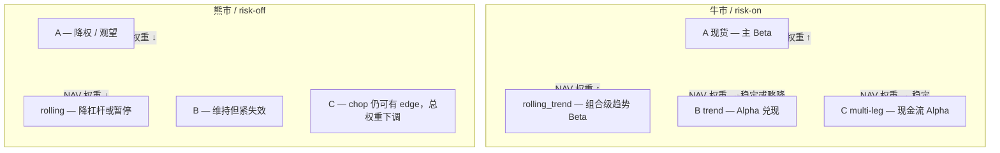

# 牛市 Beta 账本调仓与币本位取舍

> **状态**：战略备忘（2026-06-12）  
> **上位文档**：[ABC三层收益结构_战略框架_CN.md](ABC三层收益结构_战略框架_CN.md) · [产品路线图_TODO优先级_CN.md](产品路线图_TODO优先级_CN.md) · [rolling_trend README](../../config/strategies/rolling_trend/README.md)  
> **代码现状**：B/C 实盘均为 **U 本位**（`fapi`）；**无币本位（`dapi`）实现**

---

## 1. 核心结论（一句话）

**稳健控风险，靠「账本间调仓」比「把 B/C 改成币本位」更现实：**  
牛市逐步提高 **A（现货）+ rolling_trend** 占总 NAV 比重，让 **B/C 保持 alpha 引擎角色**；熊市反向收缩 beta 账本。  
币本位在牛市有「持币复利」语义，在熊市同样不利；且全栈改造量大，**不应作为 B/C 的首选路径**。

---

## 2. 你的判断对不对？

**对，且与现有 ABC 分层一致。**

| 判断 | 说明 |
|------|------|
| 牛市应让 A + rolling_trend **相对变大** | 这是 **regime 驱动的资金再分配**，不是改策略公式；beta 敞口应集中在慢变量、长持仓账本 |
| B/C 在牛市 **不必、也不应** 扛主 beta | B 吃 swing alpha，C 吃短周期 alpha；用它们追整条牛 = payoff 错配（见 ABC §1.1、案例 1） |
| 熊市应 **收缩** A / rolling，保留 B/C 合理规模 | A 试错会连亏、长持仓回撤大；U 本位 B/C 结算为稳定币，在熊市 **不会** 额外承受「抵押币贬值」 |
| 币本位 ≈ 「全员持币」 | 多头：保证金与盈亏以币计，牛市抵押品升值 → **beta 复利**；空头熊市赚币但逆趋势风险大 |
| 币本位改动大 | 当前 `binance_api`、宪法、sizing、CMS、SL/reconcile 全按 USDT-M 写；多币种 B/C 还要 **分币抵押池**，运维复杂 |

**补充 nuance（避免过度简化）：**

- **调仓是过程，不是开关**：用 A 层 `abc_macro_regime_score`（或等价慢 regime 信号）做 **阶梯式** 权重调整，避免单 bar 翻转。
- **rolling_trend 仍是 U 本位设计**（见 `config/strategies/rolling_trend/README.md`）；在「持币复利」上 **弱于** 现货或币本位 BTC 永续，但 **工程路径更短**。
- **U 本位做多已有价格 beta**（赚 USDT）；缺的是 **抵押品随币价升值** 那一项——这正是现货 A 或币本位要补的缺口。

---

## 3. 牛熊下的账本角色（推荐分工）



| 账本 | 牛市 | 熊市 | 结算 / 保证金 |
|------|------|------|----------------|
| **A·Spot** | **主跑**：慢过滤 + 慢出场，抓右尾 | 降权；不新开或极低频试错 | 现货持币 |
| **rolling_trend** | **主跑**：组合杠杆滚仓（TPC 信号源） | 降杠杆 / 暂停新风险 | 独立 U 本位账户（现状） |
| **B·Trend** | 继续跑 TPC 等，**兑现 alpha**，不刻意拿满整条牛 | 维持策略；靠 regime gate 自然降频 | U 本位 |
| **C·Multi-leg** | 辅助现金流；扩张期降频或切路由 | chop 段仍可贡献；总 cap 下调 | U 本位 |

---

## 4. 币本位：有利、不利与为何不优先改 B/C

### 4.1 牛市（long）

- **有利**：保证金为 BTC/ETH 等；浮盈增加抵押品数量 → **币本位复利**（相对 U 本位「赚 USDT、抵押仍是 USDT」）。
- **语义**：更接近「全员持币」的 beta 暴露。

### 4.2 熊市（long）

- **不利**：币价下跌 → **抵押品贬值 + 多头亏损**，双重打击；与「稳健控风险」目标相反。
- 因此币本位 beta **必须** 配合同级或更强的 **regime 降权 / 出场**，不能裸扛。

### 4.3 为何不优先给 B/C 上币本位

1. **战略**：B/C 是 alpha 引擎，不是 beta 容器（见 ABC 文档）。
2. **工程**：`dapi`、符号体系（`BTCUSD_PERP`）、PnL 单位、宪法 `equity_usdt`、SL/reconcile 均需重做。
3. **运营**：B/C 多标的并行；币本位 **按标的分抵押**（BTC 仓用 BTC、ETH 仓用 ETH），无法像 USDT 池统一调度。
4. **更优替代**：beta 缺口用 **A 现货** 或 **单币币本位子账户** 填补；B/C 继续 U 本位。

若未来要做币本位，建议顺序：**A 单币试点（BTC）→ rolling 是否迁移 → 最后才评估 B/C**。

---

## 5. 调仓：实操框架（非自动交易承诺）

### 5.1 原则

1. **物理隔离**：A / rolling / B / C 已是独立 API 或逻辑账户；调仓 = **跨账户划转 + 各账户 `equity` 锚点更新**，不是改一个全局杠杆旋钮。
2. **慢变量驱动**：与 A 层 `abc_macro_regime_score` 或 TPC `allowed_regimes` bull 占比 **同向**，避免与策略内 gate 打架。
3. **上限约束**：即使牛市，B/C 单账户仍受宪法 `max_gross_leverage`、`per_strategy_limits` 约束；调仓 **不替代** 单仓风控。

### 5.2 示意性 NAV 目标带（需按实盘校准）

| Regime | A + rolling 合计 | B | C |
|--------|------------------|---|---|
| 强 risk-on（牛） | **50%–70%** | 20%–35% | 10%–20% |
| 中性 / 转换 | 30%–45% | 35%–45% | 15%–25% |
| risk-off（熊） | **10%–25%** | 40%–55% | 15%–30% |

以上为 **战略比例**，非代码默认值；落地时需结合：相关性、已实现利润归属、税务/划转成本、最小下单量。

### 5.3 调仓动作清单（人工或半自动）

1. 读 regime：CMS / `regime_watchdog` / A score ≥ 阈值？
2. 算各账户当前 NAV 占比 vs 目标带偏差。
3. 若 beta 账本偏低：**现货买入 / U 本位 rolling 加仓**（或从 B/C 利润划转）。
4. 若 risk-off：**减 A / 降 rolling 杠杆**；B/C 不强行加满，靠自然平仓 + cap。
5. 更新 `constitution` / `multi_leg.account` 离线锚点（仅文档与监控参考；live 以交易所 sync 为准）。
6. 复盘分列 KPI：A 看尾部参与度，B 看 swing 夏普，C 看 turnover——**禁止用单一总 PnL 评判调仓对错**。

---

## 6. 与代码库的关系

| 能力 | 现状 | 调仓路径 | 币本位路径 |
|------|------|----------|------------|
| A·Spot | 研究/配置存在，live 未与 B 同轨 | 现货子账户 + 手工/脚本划转 | 现货本身即持币 |
| rolling_trend | 配置 + 实验；独立 U 本位 | 扩账户权益、调 `rolling.*` 杠杆 | 需 `dapi` 新栈 |
| B·Trend | **生产**：`tpc` + `run_live.py` | 保持；仅 **NAV 占比** 下调 | 不推荐 |
| C·Multi-leg | **生产**：`run_multi_leg_live.py` | 保持；熊市降 `equity_usdt` cap | 不推荐 |

**相关代码锚点：**

- 账户标签：`src/mlbot_console/services/exchange_balances.py`（`trend` / `multi_leg` / `spot`）
- 宪法分账：`live/highcap/config/constitution/constitution.yaml`（`resource_allocation` + `multi_leg`）
- rolling 设计：`config/strategies/rolling_trend/README.md`

---

## 7. 决策树（备忘）

```
想在牛市同时吃 beta + alpha？
├─ 优先：提高 A + rolling 的 NAV 占比（调仓）     ← 推荐，改动小
├─ 次选：A 现货持币                               ← 已具「持币」语义
├─ 可选：单币币本位子账户（仅 BTC beta）          ← 改动中～大，后置
└─ 不推荐：B/C 整体迁币本位                       ← 战略 + 工程双亏
```

---

*文档版本：2026-06-12，与「B/C 币本位可行性」对话整理。*
