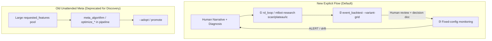

# 研究工具重构计划（ADR）

> **目的**：把研究侧工具改造成「Linux 工具风格」的可组合内核 —— 每个工具回答一个正交问题（有效？衰减？方向？切分？稳定？），不锁层、不锁策略；并在此之上重建监控 / 实验管理 / 上线流程。
>
> **状态**：ACCEPTED — 2026-05-27 review 通过；落地分 Phase 0 - Phase 8。
> **范围**：B 系统（BPC/TPC/ME/SRB）+ 树通道（fast_scalp / short_term_swing），含 feature_store 统一 build、`mlbot research` CLI、死代码清理。
> **关联文档**：
>
> - `[ABC统一研究框架_CN.md](ABC统一研究框架_CN.md)`（顶层框架）
> - `[R&D工具矩阵_CN.md](R&D工具矩阵_CN.md)`（当前工具能力对比）
> - `[方法论_R_and_D流程_CN.md](方法论_R_and_D流程_CN.md)`（执行手册）
> - `[WORKFLOW_整体架构与管线改进计划_CN.md](WORKFLOW_整体架构与管线改进计划_CN.md)`（架构）

---

## 1. 背景与动机

### 1.1 问题陈述

历史上的工具分两条线长出来：

```
pipeline 线（auto_research_pipeline 11860 行 + bundle yaml）
   ├─ research_roll.features_on.yaml  ← ROUTINE_R&D_DEPRECATED
   ├─ validate_static.*.yaml          ← ROUTINE_R&D_DEPRECATED
   └─ 内含 SHAP / KS / mean_effect / plateau / robustness 全串
                                      ↓ 完整 bundle 跑一次 ≥30min
                                      ↓ 无法归因到「哪个变化生效」

R&D 线（quick_layer_scan + rd_loop + optimize_* + ...）
   ├─ quick_layer_scan.py             ← 668 行，4 模式，label/IC 代理
   ├─ optimize_gate_unified.py        ← 2707 行，lift + plateau + robustness
   ├─ optimize_entry_filter_plateau   ← 2150 行，snotio + plateau
   ├─ analyze_archetype_*             ← 4304 行，meta + LGBM + KS / mean_effect
   ├─ posthoc_layer_effectiveness     ← 677 行，规则 effect / z
   ├─ rd_loop.py                      ← 248 行，编排 scan + variant-grid
   └─ ...（共 30+ 个脚本）
```

**5 大痛点**：

1. **算法散落，相互不知**：plateau 检测在 4 处分别实现（`optimize_gate_unified.find_stable_lift_plateau` / `optimize_entry_filter_plateau._find_plateau` / `backtest_execution_layer._identify_plateau` / `optimize_event_execution._identify_plateau`），口径不一致。
2. **层与工具耦合**：树（LightGBM）逻辑写死在 prefilter `analyze_archetype_feature_stratification.py` 里，gate / entry 不能直接复用同一套统计 + SHAP；同理 snotio 写死在 entry。
3. **断链与僵尸**：`optimize_gate_plateau.py` 仓库不存在，仍被 3 个脚本 + 2 个 CLI 子命令引用；`optimize_entry_filter_snotio` 不在任何 pipeline 出现。
4. **重复算 features**：core-4（bpc/tpc/me/srb）特征列重叠 93%+，但每个策略各自落 `feature_store/<layer>/`，跨策略不共享 → ~70% 节点级冗余。
5. **入口分裂**：用户面对 `python scripts/quick_layer_scan.py` / `python scripts/optimize_`* / `mlbot pipeline run` / `mlbot multileg research` / `mlbot diagnose *-plateau` 五套入口，不知道该用哪个。

### 1.2 目标（一句话）

**让"问 feature 一个统计问题"变成跨层、跨策略、可组合的单一命令路径**：

```bash
mlbot research <verb> --strategy <s> --layer <l> --target <t> [--subset ...]
```

`<verb>` 决定问什么（scan / ic / plateau / segment / compare / robustness / calibrate / fit / promote），其余参数决定在哪问、对谁问。**工具内部不识别 `<layer>` 字面量**，layer 只是「subset mask + writeback yaml」的解析快捷方式。

---

## 2. 调研结论（驱动设计的关键事实）

### 2.1 feature_store / 特征构建（详见 §6.1）


| 事实                                                                                                              | 含义                                   |
| --------------------------------------------------------------------------------------------------------------- | ------------------------------------ |
| `mlbot train final --prepare-only` 通过 `train_strategy_pipeline.py` → `StrategyFeatureLoader` → read-first cache | cache 已存在                            |
| AUTO layer = `features_{slug}_{TF}_{hash10}`（hash 包含 features.yaml / meta.yaml / feature_dependencies.yaml）     | **layer 名按策略隔离**                     |
| bpc vs tpc 输出列重叠 93%，bpc vs me 重叠 97.7%，core-4 union 列 ≈ 单策略列的 1.1×                                             | **技术上可一次 build 多策略读**                |
| `features_labeled.parquet` 必须分策略（label generator / horizon / direction 不同）                                      | **labels 仍分策略，features 可合并**         |
| `feature_store/<layer>/<symbol>/<timeframe>/<YYYY-MM>.parquet` 已是分区列式 + `merge_existing` 支持增量补列                 | **基础设施足够**                           |
| fast_scalp / short_term_swing 当前 `features.yaml` **无 `requested_features` 段**                                   | `--prepare-only` 对这两个 slug 出空特征集，需先补 |


### 2.2 CLI 命名空间（详见 §6.2）


| 事实                                                                                                                         | 含义                                                             |
| -------------------------------------------------------------------------------------------------------------------------- | -------------------------------------------------------------- |
| 顶层 3 commands + 20 groups；**无 `research` 顶层 group**                                                                        | 路径可用                                                           |
| `mlbot train final`（7381）已经是树通道标准训练入口                                                                                      | **不再起 `research train`**，避免歧义                                  |
| `multileg research`（3847）已存在，是多腿编排                                                                                         | research 一词双轨，需 docstring 划清                                   |
| `pipeline adopt`（3440）= 实验目录采纳，与「写 yaml」语义不同                                                                               | 新 `research promote` 不冲突                                       |
| `analyze factor-eval`（7804，含 `--ic-decay-lags`）已能算 IC 衰减                                                                   | **不再起 `research decay`**，而是把 factor-eval 改造成 `research ic` 的内核 |
| `diagnose *-plateau`（8372+，多个）/ `optimize gate-plateau*`（10240+）/ `rule optimize-gate-plateau`（3174）三处 plateau 入口          | 合并到 `research plateau`                                         |
| `serve-results` (`hidden=True` + DEPRECATED, 753)；`rule physics-regime` (DEPRECATED, 2515)；3 个 `rl *-3action` (DEPRECATED) | 一并清理                                                           |


### 2.3 老脚本重叠盘点（详见 §6.3）

**纳入内核抽取的 7 个模块**（优先级排序）：


| 优先级 | 现脚本                                                                     | 抽取的内核能力                                                         |
| --- | ----------------------------------------------------------------------- | --------------------------------------------------------------- |
| 1   | `scripts/plateau_stability.py`（151 行）                                   | `PlateauRange / decide_plateau_update`（已是纯函数，零侵入）               |
| 2   | `scripts/meta_algorithm_unified.py` + `scripts/stat_method_registry.py` | KS / mean_effect / welch / SHAP∩Gain / fold robustness          |
| 3   | `scripts/backtest_execution_layer.py` 子集                                | `simulate_rr_execution` + `_identify_plateau`（共享 R-multiple 内核） |
| 4   | `scripts/optimize_gate_unified.py` 子集                                   | lift plateau + `compute_robustness_score`                       |
| 5   | `scripts/optimize_entry_filter_plateau.py` 子集                           | `_find_plateau` + snotio KPI                                    |
| 6   | `scripts/locked_prefilter_parquet_tune.py`                              | 坐标 plateau + bad_rate lift                                      |
| 7   | `scripts/quick_layer_scan.py` 子集                                        | feature-plateau / condition-set / ic-decay 统计                   |


**已是 src 模块、不重复抽**：`src/time_series_model/regime/threshold_calibrator.py`（regime plateau）。

**编排层暂不下沉**：`rd_loop.py` / `_new_decision_doc.py` / `event_backtest/`* / `regime_watchdog.py` / `auto_research_pipeline.py`。

**死代码 / 待清理**：


| 路径                                                                                        | 状态                       | 处理                                                             |
| ----------------------------------------------------------------------------------------- | ------------------------ | -------------------------------------------------------------- |
| `scripts/optimize_gate_plateau.py`                                                        | **仓库不存在**                | 移除 3 个脚本 + 2 个 CLI 子命令对它的 import；功能由 `optimize_gate_unified` 接 |
| `scripts/archive/srb_reverse_shadow_report.py`                                                    | 自标 DEPRECATED            | 留 90 天后删                                                       |
| `scripts/_factor_ic_baseline_oneshot.py`                                                  | 自标 throwaway             | 合并进 `research ic` 后删                                           |
| `scripts/optimize_entry_filter_snotio.py`                                                 | 不在任何 pipeline            | 标 DEPRECATED 待删                                                |
| `mlbot serve-results`                                                                     | hidden + DEPRECATED      | 留                                                              |
| `mlbot rule physics-regime`                                                               | DEPRECATED               | 留                                                              |
| `mlbot rl {build-execution-logs,shadow-eval-3action,run-e2e-3action}`                     | DEPRECATED → nnmultihead | 留                                                              |
| `mlbot diagnose {extinction-replay-3action,survival-head-train,ood-to-archetype-weights}` | DEPRECATED Research only | 留                                                              |


---

## 3. 设计原则（4 个正交概念）

```
┌─────────────────────────────────────────────────────────────┐
│  Subject   : 测什么？                                        │
│    · Feature(col)                  单列                     │
│    · RuleExpr("a>=0.5 AND b<0.3")  DSL 表达式               │
│    · ModelScore(path | col)        训出的 score             │
│    · FeaturePool([...])            来自 features.yaml       │
│                                                             │
│  Target    : 目标是什么？                                    │
│    · LabelTarget("success_no_rr_extreme")                  │
│    · ForwardRRTarget(horizon=1|3|5|...)                    │
│    · SnotioTarget(exec_cfg)                                │
│    · RMultipleTarget(grid)                                 │
│                                                             │
│  Subset    : 在哪个子样本？                                  │
│    · BaseSubset()                                           │
│    · CalendarWindow(start, end)                            │
│    · LayerMask(strategy, after_layer="prefilter")          │
│    · FilterExpr("chop<=0.4 AND ema_1200_position>=0.1")    │
│    · 链式 .and_() / .or_() / .invert()                     │
│                                                             │
│  Question  : 问什么角度？（对应 verb）                       │
│    · useful?     → scan        Q1                          │
│    · decay?      → ic          Q2                          │
│    · direction?  → plateau     Q3                          │
│    · segments?   → segment     Q4                          │
│    · stable?     → robustness  Q1+Q4 跨时间                │
│    · alts?       → compare     横向                         │
│    · best τ?     → calibrate   ②b 数值精标                  │
│    · best combo? → fit         LightGBM, 不锁层             │
└─────────────────────────────────────────────────────────────┘
```

**核心约束**：

- 工具内部**不出现** `if layer == "prefilter"` 这种字面量分支；layer 只在「subset mask 解析 + writeback yaml 路径」两处使用。
- LightGBM 是 **Subject 的一种**（`ModelScore`），可被 plateau / segment / compare 等同等对待。这就解了「树和 prefilter 绑死」的旧问题。

---

## 4. CLI 设计（mlbot research）

### 4.1 子命令清单

```
mlbot research <verb> [global options] [verb-specific options]

verbs:
  scan        单/组 subject 对 target 在 subset 上的效应（Q1）
  ic          IC + decay（Q2）（取代 analyze factor-eval 的 --ic-decay-lags）
  plateau     连续阈值 plateau + 中点 + width（Q3）
  segment     按 bucket 切看条件效应（Q4，含 --bucket-by ema/calendar/quantile）
  compare     横向比若干 condition / subject
  robustness  跨时间 / 参数 / 样本的稳定性评分
  calibrate   yaml-defined rule 的阈值精调（产 draft yaml，不动 live）
  fit         任意层的 LightGBM 训练 + SHAP audit（解耦 prefilter 锁）
  promote     人审后写 yaml（独立 verb，强制 review step）
```

**关键命名决策**（与现有 CLI 对照）：


| 新 verb             | 旧路径                                                                                           | 决策                                                                                                                                  |
| ------------------ | --------------------------------------------------------------------------------------------- | ----------------------------------------------------------------------------------------------------------------------------------- |
| `research ic`      | `analyze factor-eval --ic-decay-lags`                                                         | factor-eval 仍保留；docstring 加「内核已迁至 `research ic`」                                                                                    |
| `research plateau` | `diagnose *-plateau` / `optimize gate-plateau`* / `rule optimize-gate-plateau`                | 全部改为薄壳 → `research plateau`；最终 6 个月后删                                                                                               |
| `research fit`     | `train final`（树）/ `analyze_archetype_feature_stratification --meta-algorithm`（prefilter LGBM） | `fit` ≠ `train final`：`fit` 是"研究态、可不写 live model_artifact，可指定任意 layer + target"；`train final` 是"出 model_artifact 准备 promote 到 live" |
| `research promote` | `pipeline adopt`（实验目录采纳）                                                                      | 不同语义；新 `promote` = 把 calibrate / fit 产出的 yaml draft 合并进 archetypes/                                                                 |
| `research compare` | `pipeline diff`（实验目录 diff）/ `analyze strategy-feature-compare`（特征 ablation）                   | 新 `compare` = subject 横向（与现有两个语义不同）                                                                                                 |


**与 `multileg research` 的边界**（写在 group docstring）：

```
mlbot research <verb>   ← 单层 / 单 subject 统计内核（B 系统 + 树通道 R&D）
mlbot multileg research ← 多腿策略 orchestrate（grid / chop_grid / dual_add_trend）
mlbot pipeline run      ← 全 bundle 自动化（ROUTINE_R&D_DEPRECATED 路径，不推新实验）
mlbot train final       ← 产出 ModelArtifact 准备 promote 到 live 的标准训练
```

### 4.2 通用参数

```
--strategy <slug>            自动定位 features_labeled / archetypes / writeback path
--layer {regime|prefilter|gate|entry|direction}
                             解析为 subset mask + writeback yaml；工具内部不识别此值
--features-parquet PATH      显式 features_labeled.parquet；否则取最近一次 run
--target {label_col|forward_rr|snotio|r_multiple|<custom>}
--subset EXPR                "after_layer:prefilter,calendar:2024-01-01,2025-01-01,<DSL>"
--output PATH                输出（按 verb 选 .md / .json / .html / yaml-draft）
--out-dir DIR                自动生成路径（推荐）
--cutoff-date YYYY-MM-DD     IS only，避免 OOS lookahead
```

### 4.3 组合示例（Linux pipe 风格）

```bash
# 例 1: BPC gate 候选 — 一个策略 4 层等价命令
for layer in regime prefilter gate entry; do
  mlbot research scan --strategy bpc --layer $layer \
      --target success_no_rr_extreme --feature-pool auto \
      --out-dir results/bpc/${layer}/
done

# 例 2: 给 BPC gate 训一棵小树（之前必须改 analyze_archetype_*）
mlbot research fit --strategy bpc --layer gate \
    --target success_no_rr_extreme \
    --feature-pool config/strategies/bpc/features_gate.yaml \
    --output config/strategies/bpc/gate_draft.yaml \
    --writeback-mode draft

# 例 3: 完整链 — 找有效 → IC → plateau → calibrate → promote
mlbot research scan ... --output results/bpc/gate/scan.json
mlbot research ic   ... --output results/bpc/gate/ic.json
mlbot research plateau --feature pulse_z --operator ">=" --grid 0.3,0.4,...,0.9 \
    --output results/bpc/gate/plateau.json
mlbot research calibrate --from-plateau results/bpc/gate/plateau.json \
    --output config/strategies/bpc/gate_draft.yaml
# 此时人审 + decision doc
mlbot research promote --from config/strategies/bpc/gate_draft.yaml \
    --to config/strategies/bpc/archetypes/gate.yaml
```

---

## 5. 代码组织（最终形态）

```
src/research/                           ← 纯库，零 CLI，可单测
├─ __init__.py
├─ subjects/
│   ├─ feature.py                       Feature(col)
│   ├─ rule_expr.py                     RuleExpr("a>=0.5 AND b<0.3")
│   ├─ model_score.py                   ModelScore(model_path | col)
│   └─ feature_pool.py                  FeaturePool from features.yaml
│
├─ targets/
│   ├─ label.py                         LabelTarget("success_no_rr_extreme")
│   ├─ forward_rr.py                    ForwardRRTarget(horizon)
│   ├─ snotio.py                        SnotioTarget(exec_cfg)
│   └─ r_multiple.py                    RMultipleTarget(grid)
│
├─ subsets/
│   ├─ base.py                          BaseSubset, CalendarWindow
│   ├─ filter_expr.py                   FilterExpr DSL → mask
│   ├─ layer.py                         LayerMask(strategy, after_layer)
│   └─ combinators.py                   .and_() / .or_() / .invert()
│
├─ stat_kernels/
│   ├─ z_test.py                        two_proportion_z
│   ├─ lift.py                          pass_good / pass_bad - 1
│   ├─ plateau.py                       consecutive + stable + width + midpoint
│   │                                   ← 4 个旧实现的单一真相源
│   ├─ robustness.py                    param / temporal / sample
│   ├─ ic.py                            rank_ic + ic_decay (修 horizon shift bug)
│   ├─ snotio_calc.py                   mean R per trade
│   └─ stratify.py                      KS / mean_effect / welch / SHAP∩Gain
│                                       ← 从 meta_algorithm_unified 抽
│
├─ execution_kernel/
│   └─ rr_simulate.py                   simulate_rr_execution
│                                       ← 从 backtest_execution_layer 抽
│
├─ expr.py                              DSL 解析（迁自 quick_layer_scan）
├─ labels.py                            derive_is_good_from_forward_rr
├─ layer_registry.py                    (strategy, layer) → (mask_fn, writeback_fn)
└─ tree_trainer.py                      统一 LightGBM 封装（不绑定 prefilter）

scripts/research/                       ← 薄壳，每个 verb 一个文件 (~150 行)
├─ __init__.py
├─ _common.py                           参数解析 + (strategy, layer) 自动装配
├─ scan.py
├─ ic.py
├─ plateau.py
├─ segment.py
├─ compare.py
├─ robustness.py
├─ calibrate.py
├─ fit.py
└─ promote.py

src/cli/main.py                         ← mlbot research namespace
└─ @cli.group("research")
    ├─ scan       → scripts.research.scan
    ├─ ic         → scripts.research.ic
    ├─ plateau    → scripts.research.plateau
    ├─ segment    → scripts.research.segment
    ├─ compare    → scripts.research.compare
    ├─ robustness → scripts.research.robustness
    ├─ calibrate  → scripts.research.calibrate
    ├─ fit        → scripts.research.fit
    └─ promote    → scripts.research.promote

scripts/                                ← 旧入口，过渡期保留 + DEPRECATED warning
├─ quick_layer_scan.py             → 内部转发到 research.scan/ic/plateau
├─ optimize_gate_unified.py        → 内部转发到 research.plateau + calibrate
├─ optimize_entry_filter_plateau.py → 同上
├─ analyze_archetype_feature_stratification.py
│                                  → 内部转发到 research.fit + segment
└─ rd_loop.py                       继续是编排层（调 research subcommand）
```

---

## 6. 完整调研附录（驱动决策的事实）

### 6.1 feature_store 统一 build 调研

**现状**：

- 每个策略走 AUTO layer：`feature_store/features_<slug>_<TF>_<hash10>/<symbol>/<TF>/<YYYY-MM>.parquet`
- core-4（bpc/tpc/me/srb）列重叠：
  - bpc vs tpc 输出列 Jaccard 93.0%
  - bpc vs me 97.7%
  - tpc vs srb 96.2%
- core-4 union 列数 ≈ 455；4 策略各自 build 总列数 ≈ 1684 → **~73% 列冗余**
- fast_scalp vs core-4 列 Jaccard ~1.6% → 独立小集
- `features_labeled.parquet` 仍按策略分（label generator 不同）

**可行性**：

- 列名共用 namespace（`ema_1200_position` 等），技术上一份 cache 多策略读没问题
- 已有基础设施：`merge_existing=True` 支持宽表增量、`mlbot feature-store build -c <union>` 已存在
- 树通道（fast_scalp / short_term_swing）当前 `features.yaml` 缺 `requested_features` 段，需先补

**建议（写进 Phase 0）**：

1. 定义 `config/strategies/_shared/features_tree_core.yaml`（union of core-4 requested_features）
2. AUTO layer 改名规则：core-4 默认 `features_tree_core_<TF>_<hash>`，独立小集（fast/swing）保留 per-slug
3. `mlbot feature-store build -c config/strategies/_shared/features_tree_core.yaml` → 一次性 build
4. 各策略 `mlbot train final --prepare-only --feature-store-layer features_tree_core_<TF>_<hash>` 只做 label pass，省 ~70% 重算时间

### 6.2 CLI 现状关键点

- 顶层 3 commands（`server`/`rolling-dashboard`/`serve-results`，最后一个 hidden+DEPRECATED）
- 顶层 20 groups（含 `train`/`pipeline`/`analyze`/`diagnose`/`optimize`/`rl`/`nnmultihead`/`multileg`/`features`/`feature-store`/`rule`/`search`/`experiment`/`gate`/`backtest`/`visualize`/`test`/`dev`/`docker`/`data`）
- 无 `research` 顶层 group
- 无独立 `monitor` group（仅 `multileg monitor`）
- 实验管理主入口是 `pipeline list/adopt/diff/delete/event-backtest/...`，不是 `experiment`

**重叠 / 冲突点**（已在 §4.1 处理）：

- 8 处 plateau 入口（`diagnose *-plateau` ×3、`optimize gate-plateau`* ×2、`rule optimize-gate-plateau`、`optimize ml-plateau-charts`、`nnmultihead` 相关）→ 合并到 `research plateau`
- `research fit` vs `train final` 边界明确
- `research promote` vs `pipeline adopt` 语义独立

### 6.3 老脚本 7 模块抽取顺序

见 §2.3 表格。Phase 顺序按"依赖图"决定：

- expr / z_test / ic / labels（无依赖）→ 先
- plateau / lift / robustness（依赖 expr）→ 中
- snotio / simulate_rr / stratify（依赖 plateau）→ 中后
- tree_trainer（依赖全部）→ 后

---

## 7. 分 Phase 落地计划

> **原则**：每个 Phase 独立可交付 + 不破坏现有工具 + 单 PR 可 review。


| Phase  | 内容                                                                                                                                                  | 工作量   | 风险  | 关键交付                                                      |
| ------ | --------------------------------------------------------------------------------------------------------------------------------------------------- | ----- | --- | --------------------------------------------------------- |
| **P0** | feature_store 统一 build（core-4 union layer + CLI flag + 文档）                                                                                          | 2 天   | 低   | 一次 build，4 策略 prepare-only 都走同 layer，省 ~70% 重算            |
| **P1** | `src/research/expr.py` + `labels.py` + `stat_kernels/{z_test, ic}.py` + 单测                                                                          | 1 天   | 零   | quick_layer_scan 改 import，optimize_* 不动                   |
| **P2** | `subjects/` + `targets/` + `subsets/` + `layer_registry.py` + 单测                                                                                    | 1.5 天 | 低   | notebook 能 `Feature("x").measure_on(...).rank_ic()`       |
| **P3** | `stat_kernels/{plateau, robustness, lift, snotio_calc, stratify}.py` + `execution_kernel/rr_simulate.py`（从 optimize_* / backtest_execution_layer 抽） | 2 天   | 中   | optimize_* 改成调内核，行数缩 60%                                  |
| **P4** | `scripts/research/{scan, ic, plateau, segment}.py` + `mlbot research <verb>` CLI 5 个子命令                                                             | 2 天   | 低   | `mlbot research scan` 与 `quick_layer_scan` 对拍一致           |
| **P5** | `tree_trainer.py` + `scripts/research/fit.py` + `mlbot research fit --layer ...` 解耦树和层                                                              | 1.5 天 | 中   | 第一次能 `research fit --layer gate`（之前必须改 analyze_archetype） |
| **P6** | `calibrate.py` + `promote.py` + `compare.py` + `robustness.py` 子命令                                                                                  | 2 天   | 低   | ②b 数值精标全走新入口                                              |
| **P7** | 旧脚本变薄壳（转发到新 verb） + DEPRECATED warning + 死代码清理 + 文档更新                                                                                               | 1 天   | 低   | 单一文档链路；3 处 plateau 入口归一                                   |
| **P8** | 监控对接：systemd timer 调 `mlbot research scan` → result.json + heartbeat → CMS（含 dashboard 新 tab）                                                       | 1.5 天 | 低   | 监控闭环完成                                                    |


**总计 ~13.5 天**（按你的节奏分 2-3 周）。

**关键里程碑（每周末交付）**：

- 第 1 周末：P0 + P1 + P2 done — 「feature 统一 build + 内核第一波」
- 第 2 周末：P3 + P4 done — 「内核厚度补齐 + research scan/ic/plateau/segment 跑起来」
- 第 3 周末：P5 + P6 done — 「树解耦 + 数值精标全走新入口」
- 之后：P7 + P8（清理 + 监控对接）

---

## 8. 关键决策（ADR-style）

每条都有「考虑的替代 / 选择 / 理由」三段：

### D-001：抽象用 dataclass class，不用 function-only

- 替代：纯函数 `scan(df, feature, target, subset_mask)`
- 选择：dataclass + 链式方法 `Feature("x").with_target(LabelTarget("y")).measure_on(...)`
- 理由：CLI 友好；future 加 cache / lazy eval 容易；可读性高于嵌套 kwargs

### D-002：layer 参数解析为 (subset, writeback)，工具内部不识别 layer

- 替代：每个 verb 内有 `if layer in ("prefilter", "gate")` 分支
- 选择：`layer_registry.py` 在外部解析 `--layer gate` → `LayerMask + gate.yaml writer`
- 理由：**真正解耦**；新增 layer 不改 verb；树和 prefilter 锁死的旧问题正源于这里

### D-003：树 = Subject 的一种（ModelScore），不是独立工具

- 替代：保留 `mlbot analyze-archetype --meta-algorithm` 这种特殊命令
- 选择：`mlbot research fit` 产出 model → `ModelScore(...)` 与 `Feature(...)` 平级
- 理由：`research plateau --subject model.score` 可直接复用所有 verb；树不再绑定层

### D-004：feature_store core-4 union build，labels 仍分策略

- 替代：每策略分别 build（现状）/ labels 也合并
- 选择：union features layer + per-strategy labels pass
- 理由：列重叠 93%+ 但 label horizon / direction 各异；分两步是最小变更最大收益

### D-005：旧脚本 6 个月内保留 + DEPRECATED warning，不立即删

- 替代：立即删除 / 永久保留
- 选择：6 个月窗口，调用时 stderr 印迁移指引
- 理由：cron / 手工命令 / 文档引用太多；强制断会出事故；6 个月后再硬删

### D-006：`research fit` 与 `train final` 共存，docstring 划清

- 替代：合并 / 仅留一个
- 选择：`research fit` = R&D 探索态（可不写 model_artifact）；`train final` = 产出 ModelArtifact 准备 promote live
- 理由：探索期可能训 20 棵树，没必要每棵都生产化；live promote 路径要严格

### D-007：promote 必须独立 verb，不能内嵌在 calibrate / fit

- 替代：`calibrate --auto-promote`
- 选择：calibrate 只出 draft yaml；`promote` 是显式人审 step
- 理由：doctrine 已多次申明「no auto-promote」，工具层强制这条

### D-008：单测覆盖率门槛

- 选择：`src/research/stat_kernels/`* ≥ 90%；`subjects/targets/subsets/*` ≥ 80%；`scripts/research/*` ≥ 50%
- 理由：内核是 alpha 计算的基础；scripts 是薄壳，不必死磕

---

## 9. 弃用 / 清理清单（明确写出，避免漂移）

### 9.1 立即清理（Phase 7）


| 路径                                        | 动作                   | 替代                                             |
| ----------------------------------------- | -------------------- | ---------------------------------------------- |
| `scripts/optimize_gate_plateau.py`（缺失）    | 移除所有引用（3 脚本 + 2 CLI） | `optimize_gate_unified` / 新 `research plateau` |
| `scripts/_factor_ic_baseline_oneshot.py`  | 删除                   | `research ic`                                  |
| `scripts/archive/srb_reverse_shadow_report.py`    | 已归档                 | —                                              |
| `scripts/optimize_entry_filter_snotio.py` | 标 DEPRECATED；6 个月后删  | `research plateau --target snotio`             |


### 9.2 标 DEPRECATED + 转发（Phase 7）


| 路径                                                    | 头部 print warning + 内部转发到                                                      |
| ----------------------------------------------------- | ----------------------------------------------------------------------------- |
| `scripts/quick_layer_scan.py`                         | `mlbot research scan/ic/plateau`                                              |
| `scripts/optimize_gate_unified.py`                    | `mlbot research plateau --layer gate` + `research calibrate`                  |
| `scripts/optimize_entry_filter_plateau.py`            | `mlbot research plateau --layer entry --target snotio` + `research calibrate` |
| `scripts/analyze_archetype_feature_stratification.py` | `mlbot research fit --layer prefilter` + `research segment`                   |
| `scripts/locked_prefilter_parquet_tune.py`            | `mlbot research plateau --layer prefilter` + `research calibrate`             |


### 9.3 CLI 命令清理（Phase 7）


| 命令                                                                                        | 动作                                                   |
| ----------------------------------------------------------------------------------------- | ---------------------------------------------------- |
| `mlbot serve-results`                                                                     | 保持 hidden+DEPRECATED；不变                              |
| `mlbot rule physics-regime`                                                               | 保持 DEPRECATED；不变                                     |
| `mlbot rl {build-execution-logs,shadow-eval-3action,run-e2e-3action}`                     | 保持 DEPRECATED；不变                                     |
| `mlbot diagnose {extinction-replay-3action,survival-head-train,ood-to-archetype-weights}` | 保持 DEPRECATED；不变                                     |
| `mlbot diagnose *-plateau` (3 个)                                                          | 加 DEPRECATED → `mlbot research plateau`              |
| `mlbot optimize gate-plateau*` (2 个)                                                      | 加 DEPRECATED → `mlbot research plateau --layer gate` |
| `mlbot rule optimize-gate-plateau`                                                        | 加 DEPRECATED → 同上                                    |
| `mlbot analyze factor-eval --ic-decay-lags`                                               | docstring 加 "内核已迁至 `research ic`，本入口保留"；不删           |


### 9.4 bundle yaml 状态（沿用 `[R&D工具矩阵_CN.md](R&D工具矩阵_CN.md)` §2）


| YAML                             | 状态                                                                                 |
| -------------------------------- | ---------------------------------------------------------------------------------- |
| `research_roll.features_on.yaml` | ROUTINE_R&D_DEPRECATED（已标）                                                         |
| `validate_static.*.yaml`         | ROUTINE_R&D_DEPRECATED（已标）                                                         |
| `calibrate_roll.default.yaml`    | 月度 drift 监控，保留                                                                     |
| `pre_deploy_replay.yaml`         | 上线 contract，保留；`plateau_stability` 段当前 deferred，Phase 8 用 `research robustness` 接上 |


### 9.5 Phase 落地状态（`feat/research-tools-refactor`，2026-05-27）

| Phase | 状态 | 说明 |
| ----- | ---- | ---- |
| P0 feature_store union | ✅ | `config/strategies/_shared/` + `features_tree_core_120T_*`；core-4 prepare-only 共用 layer |
| P1 最小内核 | ✅ | `src/research/expr|labels|stat_kernels/{z_test,ic}`；ic-decay horizon bug 已修 |
| P2 抽象层 | ✅ | `subjects/targets/subsets/layer_registry`（dataclass 骨架） |
| P3 厚内核 | ✅ | gate lift/robustness/plateau/stratify/rr_simulate + `snotio_calc.py`；entry 脚本已接 kernel |
| P4 research CLI (scan/ic/plateau/segment) | ✅ | TPC smoke 通过；Click passthrough 已修；scan 对拍单测 |
| P5 research fit | ✅ | LightGBM + `feature_importance.json`（gain + optional SHAP audit） |
| P6 calibrate/promote/compare/robustness | 部分 | `plateau.json`→`calibrate`（标量+结构化 gate draft）+ compare + robustness + **promote locked-merge** 已通；parity harness 见 `tests/research/test_gate_lift_parity.py` |
| P7 清理 | ✅ | legacy DEPRECATED；断链 import 已修；`srb_reverse_shadow_report` → `scripts/archive/` |
| P8 监控 | ✅ | `scripts/monitoring/*` + systemd timer；dashboard tab 未做 |

**Review 收尾（2026-05-27，同分支）**：

| 项 | 状态 | 说明 |
| -- | ---- | ---- |
| pair-scan CLI | ✅ | `mlbot research scan pair-scan` + rd_loop 透传 |
| snotio entry_rr | ✅ | `plateau --kpi snotio --snotio-mode entry_rr` + `entry_rr_scan` kernel |
| ModelScore subject | ✅ | `--subject 'model.score:…'` + `model_manifest.json` |
| pre_deploy gate robustness | ✅ | 默认仅 `gate.yaml`；`plateau_stability.robustness_layers` 可扩 |
| B1 entry_rr 方向列 | ✅ | `{strategy}_breakout_direction` 优先 |
| B2 robustness 缺 label | ✅ | `ValueError` + exit 3（非 KeyError） |
| B4 contract 特征 parquet | ✅ | 仅用当前 `run_root`，不回退 `train_final_*` |
| entry 脚本 shim | ✅ | `optimize_entry_filter_plateau.py` DEPRECATED → research plateau |
| rd_loop `--subject` | ✅ | snotio-plateau / feature-plateau 透传 scan yaml |
| CLI e2e 单测 | ✅ | `tests/research/test_cli_plateau_e2e.py` |

**Entry plateau batch（2026-05-27）**：

| 项 | 状态 | 说明 |
| -- | ---- | ---- |
| `entry_plateau_scan` 共享模块 | ✅ | auto-loop entry_filters → snotio entry_rr |
| rd_loop `entry-plateau` | ✅ | 见 `rd_loop_srb_entry_plateau.yaml` |
| legacy 扫描 thin delegate | ✅ | `optimize_entry_filter_plateau.py` → 共享模块 |
| compare `snotio_mode` | ✅ | proxy vs entry_rr mismatch 标注 |
| logs_gated integration smoke | ✅ | `test_entry_plateau_smoke.py`（本地 parquet / skip） |
| tree `requested_features` 骨架 | ✅ | fast_scalp / short_term_swing（IC 冻结仍待 factor-eval） |
| plateau baseline 回填工具 | ✅ | `backfill_plateau_baseline.py` + dry-run 默认 |

**仍 Open**：

- P8 dashboard tab（defer 至新 research 命令验证完成后）
- production yaml `last_calibration.plateaus` 需人审 `--write` 回填后 pre_deploy drift 才生效
- deprecated 脚本 6 个月硬删未到期
- rd_loop `gate-plateau` / `locked-prefilter-tune` — **已落地**（见 `config/experiments/tpc/rd_loop_tpc_gate_plateau.yaml`）

**2026-05-29 Phase 0 能力审计补充**（执行 `new_research_command_family_optimization_plan` 首步）：
- 新增审计文档：`docs/strategy/_research_capability_audit_2026-05-29.md`
- 确认 `calibrate.py` 仅产单行标量、`promote.py` 为裸 copy2（无 locked 合并）、`plateau --kpi lift` 尚未接线、`research fit --layer gate` 在仅有白名单的 `features_gate.yaml` 上会失败。
- 已校正 P6 状态行；后续 Gate 闭环工作量按「rd_loop + plateau lift（Todo 2）」+「calibrate/promote 升级 + parity harness（Todo 3）」拆分执行。
- 详见 `.cursor/plans/new_research_command_family_optimization_plan_(balanced_b+tree)_bebf47e1.plan.md`（含 (B)(C)(D) docs 子节 + 硬验收指标：ME/TPC 各完成一次 Gate refine 零调用旧 `optimize_gate_unified`）。

**Open Questions 拍板（已落地）**：

- Q1 union yaml → `config/strategies/_shared/features.yaml`（目录 `-c config/strategies/_shared`）
- Q2 fit 输出 → `results/research/fit/<strategy>/<layer>/<run_id>/`
- Q3 监控 → 先 timer + heartbeat
- Q4 DEPRECATED → stderr 一行（无 sleep）
- Q5 ic-decay bug → P1 已修 + 单测

---

## 14. 运营化阶段 (Phase 9+) — 新命令族默认 R&D 路径

> **Phase 0 能力审计**（2026-05-29）：[`_research_capability_audit_2026-05-29.md`](_research_capability_audit_2026-05-29.md)  
> **执行计划**：`.cursor/plans/new_research_command_family_optimization_plan_(balanced_b+tree)_bebf47e1.plan.md`

### 14.1 新 vs 旧流程（默认口径）



| 阶段 | 新默认 | 旧路径（仅 legacy / 对拍） |
|------|--------|---------------------------|
| ① 假设 | `mlbot research` + `rd_loop` 显式 condition | `meta_algorithm` / 大池 unattended |
| ② 因果 | `event_backtest --variant-grid`（1–2 yaml diff） | pipeline stage 内 optimize |
| ③ 监控 | `calibrate_roll` / `watchdog` / `pre_deploy`（固定配置） | 滚动 re-optimize |

**ME/TPC 示例**：
- Entry：`config/experiments/me/rd_loop_me_entry_filter.yaml`
- Gate：`config/experiments/tpc/rd_loop_tpc_gate_plateau.yaml`
- Tree：`config/experiments/fast_scalp/rd_loop_fast_scalp_ic_plateau.yaml`

### 14.2 (B) features_*.yaml 角色重定义

| 文件 | 保留用途 | 可瘦身 |
|------|----------|--------|
| `features_gate.yaml` `allowed_gate_deny_features` | Gate 语义白名单 / deny 守卫 | — |
| `features_direction.yaml` `candidates:` | Direction 验证候选 | — |
| `features.yaml` / `features_prefilter.yaml` `requested_features` | 树 IC@H / `research fit` 训练池 | 可删「大池 unattended meta」列 |
| locked 规则列名 | 契约 / 监控 baseline | — |

> `research fit --layer gate` 在仅有白名单的 `features_gate.yaml` 上会失败 —— ** intentional **；Gate 层用 lift plateau，不是 fit 大池。

### 14.3 (C) 阈值来源约定

| 来源 | 角色 | 能否直接 promote？ |
|------|------|-------------------|
| rd_loop condition-set 分位（q50/q90） | **探测假设** | 否 |
| `research plateau`（label/snotio/**lift**）平坦高原 | **生产 τ / 区间证据** | 经 `calibrate` draft + 人审 |
| `optimize_gate_unified.py` | legacy 对拍 | 否（deprecated） |

### 14.4 (D) semantic_polarity.yaml

- **保留**：语义方向声明，供 Gate 白名单 / direction 检查 / semantic guard 消费。
- **不再**：unattended meta 大池发现的燃料。

### 14.5 Phase 9–12 落地项

| Phase | 内容 | 状态 |
|-------|------|------|
| 9 | `plateau --kpi lift` + `rd_loop gate-plateau` / `locked-prefilter-tune` | 已落地 |
| 9b | `calibrate` 结构化 draft + `promote` locked-merge + parity harness | 已落地 |
| 10 | drift → `rd_loop` snippet（`regime_drift_monitor --emit-rd-loop-suggestions`） | 已落地 |
| 11 | pre_deploy `cross_regime_evidence` + 多层 plateau_stability | 已落地 |
| 12 | e2e 测试 + migration cookbook | 见 `docs/strategy/迁移_旧meta到新rd_loop_CN.md` |

---

## 10. 与现有 doctrine 的一致性


| doctrine                          | 本计划如何遵守                                                                                                   |
| --------------------------------- | --------------------------------------------------------------------------------------------------------- |
| 「发现 / 验证 / 监控」三阶段分离               | `research scan/ic/plateau/segment` = 发现；`event_backtest --variant-grid` 不动 = 验证；`research promote` 之后才进 ③ |
| 「no auto-promote」                 | `promote` 是独立 verb，强制 review；`calibrate` 只出 draft yaml                                                    |
| 「SHAP audit-only」                 | `research fit` 默认产 model + SHAP audit；不自动改 features.yaml                                                  |
| 「双段 walk-forward」                 | `research robustness` 跨时间 fold；最终决策仍走 variant-grid recent+bull                                            |
| 「pipeline yaml 仅留 contract / 月监控」 | `research` 全部 verb 不动 pipeline yaml；bundle 仍由 `mlbot pipeline run` 走                                      |
| 「层独立，工具不绑层」                       | D-002 + D-003，layer 只在外部解析                                                                                |


---

## 11. Open Questions（review 时讨论）

### Q1：feature_store core-4 union 的 yaml 放哪？

- 候选 A：`config/strategies/_shared/features_tree_core.yaml`
- 候选 B：`config/feature_store/tree_core.yaml`
- 候选 C：`config/feature_dependencies_shared.yaml`
- **倾向 A**：与 strategies 同源，未来加 `_shared/labels_*.yaml` 也方便

### Q2：`research fit` 的 model artifact 输出位置？

- 候选 A：`results/research/fit/<strategy>/<layer>/<run_id>/model.pkl`
- 候选 B：复用 `results/train_final/...` 布局
- **倾向 A**：「研究态」与「production 态」分目录，避免误 promote

### Q3：systemd timer + heartbeat 与 dashboard 谁先？

- 候选 A：先 timer + git-commit heartbeat，dashboard 后跟
- 候选 B：直接做 dashboard 三个 tab，cron 后跟
- **倾向 A**：监控是消费侧，没数据 dashboard 也是空的

### Q4：旧脚本的 DEPRECATED warning 用什么形式？

- 候选 A：`stderr` 印一行红字 + sleep 1s
- 候选 B：`logging.warning`
- 候选 C：`DeprecationWarning`（python warnings 系统）
- **倾向 A**：最强信号，不会被静默

### Q5：是否在本计划同期解决 `quick_layer_scan ic-decay` 的 horizon shift bug？

- `bpc_layer_validation_20260527.md` 记录此 bug：`_resolve_target_col` fallback 到同一列（L283-289），horizon 未实际 shift
- **倾向**：P1 抽 `stat_kernels/ic.py` 时一并修，加单测保证

---

## 12. 启动步骤（review 通过后）

1. 本文档 status DRAFT → ACCEPTED
2. 起 Phase 0 工单：`config/strategies/_shared/features_tree_core.yaml` 设计 + smoke
3. 起 Phase 1 工单：`src/research/expr.py` + 单测
4. 每个 Phase 一个独立 PR，PR description 引用本文 Phase 编号 + Decision 编号
5. 6 个 Phase 后回头 review 本文档，根据实战修正 D-XXX 决策
6. 6 个月后做 §9 的硬删

---

## 13. 风险与回滚


| 风险                                | 概率  | 影响           | 缓解                                                                                        |
| --------------------------------- | --- | ------------ | ----------------------------------------------------------------------------------------- |
| 抽内核时引入回归                          | 中   | 高（影响 R&D 结论） | 对拍：新 `research scan` 与旧 `quick_layer_scan` 在同一 parquet 上必须输出一致；P3 抽 plateau 时对 4 个旧实现各自对拍 |
| feature_store union layer hash 冲突 | 低   | 中（要重算一次）     | layer 命名加版本号 `_v1`；冲突时降级到 per-strategy AUTO                                               |
| 死代码引用没找全，删后 break cron            | 低   | 高            | 6 个月 DEPRECATED 窗口 + grep 全仓库引用                                                           |
| 用户继续用旧入口                          | 高   | 低            | DEPRECATED warning + 文档 + 半年后硬删                                                           |
| Phase 5（树解耦）发现 LightGBM 训练有隐含层依赖  | 中   | 中            | 提前在 P5 之前做 spike：在 notebook 里手工跑 LGBM on gate layer，确认无 layer-specific feature 依赖         |


回滚策略：每个 Phase 是独立 PR，可单独 revert；P0（feature_store）即使回滚也只是回到 per-strategy build，不影响数据正确性。