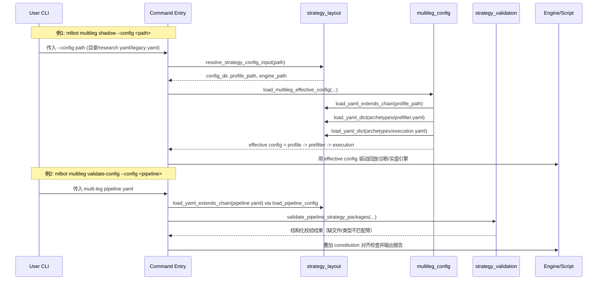

# 多腿上线日常操作手册（Chop Grid / Dual Add）

适用范围：`chop_grid`、`dual_add_trend` 多腿专用管线（`mlbot multileg` + `run_multi_leg_live.py`）。

配置约定：多腿运行时入口统一使用 `config/strategies/<strategy>/research/calibrate_roll.default.yaml`
（`research_roll.features_on` / `validate_static.full_study` 等通过 `extends` 继承），并叠加 `archetypes/prefilter.yaml` +
`archetypes/execution.yaml` 形成 effective config。

“模拟未来”口径：采用无前视 `rolling_sim`（过去窗口校准，下一窗口测试），不额外引入
预测式 forward simulator。

## 0. 配置解析时序（输入路径 → effective config）

下面这张图对应日常最常见入口：`research` / `validate-config` / `shadow|live`。



## 1. 每日巡检（10-15 分钟）

1) 检查最新多腿 rolling 结果是否完整

```bash
mlbot multileg replay \
  --config config/pipelines/multileg_orchestrate_2h.yaml \
  --all \
  --months "$(date -u +%Y-%m)"
```

2) 生成门禁结论

```bash
mlbot multileg gate \
  --config config/pipelines/multileg_orchestrate_2h.yaml \
  --run-dir results/multi_leg/rolling-sim/_rolling_sim/<run_id>
```

3) 生成健康监控报告（漂移与风险）

```bash
mlbot multileg monitor \
  --config config/pipelines/multileg_orchestrate_2h.yaml \
  --run-id <run_id> \
  --lookback-months 6
```

4) 判定动作

- `READY_SHADOW`：允许保持 shadow/testnet；
- `RETUNE_THRESHOLDS`：优先重跑 profile calibration；
- `FEATURE_REVIEW`：先检查上游特征版本/定义变更；
- `OFFLINE`：立即暂停多腿新单并进入故障流程。

## 2. 每周重评估（建议固定窗口）

```bash
mlbot multileg replay \
  --config config/pipelines/multileg_orchestrate_2h.yaml \
  --all \
  --months 2024-01:2026-03
```

然后执行：

```bash
mlbot multileg gate \
  --config config/pipelines/multileg_orchestrate_2h.yaml \
  --run-dir results/multi_leg/rolling-sim/_rolling_sim/<run_id>

mlbot multileg monitor \
  --config config/pipelines/multileg_orchestrate_2h.yaml \
  --run-id <run_id> \
  --lookback-months 12
```

## 3. 上线前检查清单

- `mlbot multileg validate-config` 通过；
- `gate` 非 `OFFLINE`，且建议目标至少 `READY_SHADOW`；
- `monitor` 不为 `FEATURE_REVIEW` / `OFFLINE`；
- `multi_leg_pcm_<month>.json` 无同 symbol 跨策略 overlap 冲突；
- 宪法 `multi_leg.risk_limits` 与账户预算一致；
- 确认 `MULTI_LEG_*` 独立密钥已配置（不与经典账户混用）。

## 4. 影子 / 测试网运行

影子快速验证：

```bash
mlbot multileg shadow --bar-source feature-store --once
```

持续影子：

```bash
mlbot multileg shadow --bar-source feature-store --poll-seconds 60
```

测试网：

```bash
mlbot multileg live --mode testnet --bar-source feature-store
```

> 仅在明确知情下使用共享账户：`--allow-shared-account`。

## 5. 故障处置（推荐顺序）

1) 触发 `OFFLINE` 或 drawdown 超阈值：停止多腿进程；  
2) 运行 `multileg monitor` 确认是风险/阈值/特征哪类问题；  
3) 若是阈值漂移：重跑 `multileg replay` + `multileg gate`；  
4) 若是特征漂移：先做 feature/regime 审查，再恢复研究；  
5) 恢复前至少完成一次 `shadow --once` 和门禁检查。

## 6. 变更记录建议

每次多腿参数更新建议记录：

- `run_id`
- 使用配置（`multileg_orchestrate_2h.yaml` + strategy `research/calibrate_roll.default.yaml` / `research_roll.features_on.yaml` / `validate_static.*.yaml` 版本）
- gate 决策
- monitor 决策
- 是否进入 shadow / testnet / offline
- 责任人与时间
