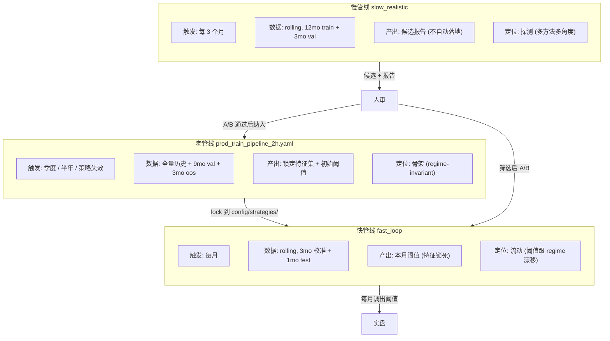
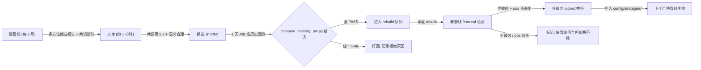

# 03 — 三管线分工与闭环

## 一张图：分工



## 三管线定位表

| 维度 | 老管线 | 快管线 | 慢管线 |
|---|---|---|---|
| 配置文件 | [`prod_train_pipeline_2h.yaml`](../../config/prod_train_pipeline_2h.yaml) | fast_loop 内嵌 | [`prod_train_pipeline_2h_slow_*.yaml`](../../config/) |
| 触发频率 | 季度 / 半年 | 每月 | 每 3 月 |
| Train 窗口 | 全量历史 | 3mo 校准 | 12mo |
| Val 窗口 | **9mo** | 1mo test | 3mo |
| 自由度 | 低（单次大样本） | 极低（锁特征调阈值） | **高**（选特征 × 阈值 × 方法） |
| 输出落地 | ✅ 自动 | ✅ 自动 | ❌ **不自动**，只出报告 |
| 对 regime shift 的响应 | ❌ 要等 rebuild | ✅ 月度调阈值 | ⚠️ 发现候选 → 人审 |
| 和实盘一致性 | ✅ causal | ✅ causal | ✅ causal |

## 和历史成功流程的连续性

你提到的 BPC 早期好配置 `20260413_144115` 用的就是：
- 锁死特征集（人工筛选）
- fast 模式只调阈值
- 不让 slow 模式自动换特征

本次方案**本质上就是把那个流程正式化**：
- 老管线 = "定期重新筛选特征集"（以前是手动，现在有管线支持）
- 快管线 = "月度调阈值"（一直在用）
- 慢管线 = "监控/候选发现器"（以前没有，Wave 1+2+3 之后有了）

**不是倒退，是把隐式流程变成显式流程**。

## 闭环：从候选到落地



每一步的价值：

| 步骤 | 挡什么 | 成本 |
|---|---|---|
| 人审 | 共识度 1/4 的 overfit 假阳性、业务语义不合理的机器选择 | 1 小时 / 每季度 |
| 快管线 A/B | "报告好看但实战废"、主力 symbol 不均衡 | 1 天 / 每候选 |
| 老管线 rebuild | 长周期稳定性、大样本下是否仍被选 | 季度/半年 1 次 |

## 快管线 A/B 验收规则（本次核心修正）

### 执行 vs 评估口径
- **执行时间**：~1 天（机器上一次跑完全历史 rolling）
- **评估周期**：**全历史 2024-01 至今**（~28 个月），NOT "等 1~2 个月新数据"

**为什么不是 "等新数据"**：快管线本身就是 rolling 回测工具，能直接回放全历史。不需要等实盘。

### A/B 定义
```
Branch A (baseline):  当前 locked 特征集
Branch B (candidate): Branch A + 一个新候选特征
```

两边用相同 fast_loop 配置、相同 execution 参数、相同 data window，只差在特征集。

### 执行命令
```bash
# Branch A
python scripts/auto_research_pipeline.py --strategy bpc \
    --stage fast_month --start 2024-01 --end 2026-04 \
    --config config/prod_train_pipeline_2h.yaml

# Branch B (加候选特征后再跑一次)
python scripts/auto_research_pipeline.py --strategy bpc \
    --stage fast_month --start 2024-01 --end 2026-04 \
    --config config/prod_train_pipeline_2h.yaml
```

### 对比
```bash
python scripts/compare_monthly_pnl.py \
    --strategy bpc \
    --baseline-runs <A 的 28 个 timestamps> \
    --new-runs <B 的 28 个 timestamps> \
    --output results/wave3/../candidates/bpc_<feature>_ab.md
```

### 验收阈值（硬规则）

| 维度 | 阈值 | 说明 |
|---|---|---|
| **全窗口 total_r** | delta ≥ −10R | 不能整体恶化 |
| **trend_favorable bucket** (2024-04~06, 2024-11~12) | delta per bucket ≥ −20R | 趋势月必须守住 |
| **death_months bucket** (2025-01, 2025-11~12) | n_trades 持平或改善 | 死月至少不更死 |
| **small_sample months** | 忽略（样本不足） | 仅诊断 |
| **主力 symbol (BTC/ETH) 单独** | 各自 delta ≥ −15R | 防单 symbol 拉平均 |

全通过 → PASS，候选进入 rebuild 队列。
任一 FAIL → REJECT，候选打回并记录原因。

### 两种例外（需要额外 paper trade 验证 1 月）

1. **候选特征依赖实时数据源**（orderbook imbalance、VPIN 等）
   - 回测用聚合 snapshot，实盘可能有延迟/缺口
   - 需要 paper trade 1 月验证信号一致性

2. **候选特征全历史触发 < 50 次**
   - 样本不足以裁决
   - 标记 "观察 3~6 个月"，暂不落地

## 老管线的 "定期 rebuild" 节奏

### 常规触发（季度/半年）
- 每季度跑 1 次，看 locked 特征在新增 3 个月数据上是否仍被选
- 如果某个 locked 特征连续 2 季度不被选 → 考虑退役

### 紧急触发（策略明显失效）
失效信号（任一）：
- 连续 3 个月 PnL < −50R
- 连续 3 个月 n_trades < baseline 的 30%
- 关键月（trend_favorable 月）退化 > 100R

此时：
1. 立即暂停该策略（实盘）
2. 跑老管线 rebuild，看骨架是否要重建
3. 如果骨架稳定 → 问题在 execution/阈值层，走快管线
4. 如果骨架崩盘（半数以上 locked 特征不再被选）→ 策略真失效，考虑退役或大改

## 慢管线的"不自动落地"是什么意思

### 现状（问题）
```
慢管线跑完 → 直接写 config/strategies/bpc/gate_draft.yaml
           → 下次 fast_month 就用新规则
           → Wave 3 类事故
```

### 改造后（目标）
```
慢管线跑完 → 写 results/candidates/bpc_<timestamp>/
              ├── gate_candidates.yaml
              ├── prefilter_candidates.yaml
              ├── candidate_report.md  ← per-method + 共识矩阵
              └── raw_scores/
           ← 不动 config/strategies/bpc/gate_draft.yaml
```

具体改造方案见 [04_slow_mode_redesign_candidate_discovery.md](04_slow_mode_redesign_candidate_discovery.md)。

## 总结

三管线不是竞争关系，是 **责任分层**：
- **老管线管骨架**：什么特征能进
- **快管线管流动**：当前市场下阈值设多少
- **慢管线管监控**：有没有新候选值得看 / 现有特征还在不在 work

这个分工一旦落实，Wave 3 这类"让 meta-algo 自动救策略"的幻想就不会再出现 —— 因为 **决策权永远在人手里**，机器只负责提供信息。
