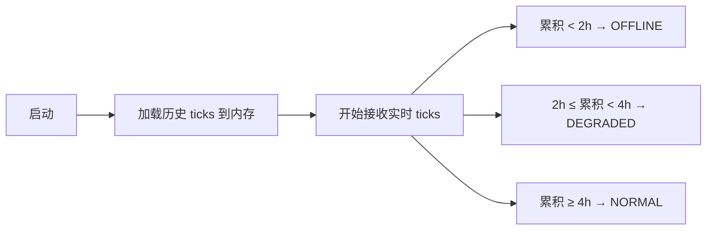
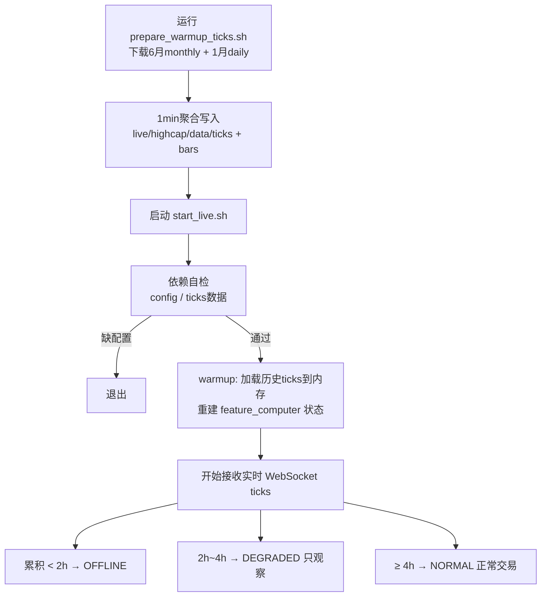
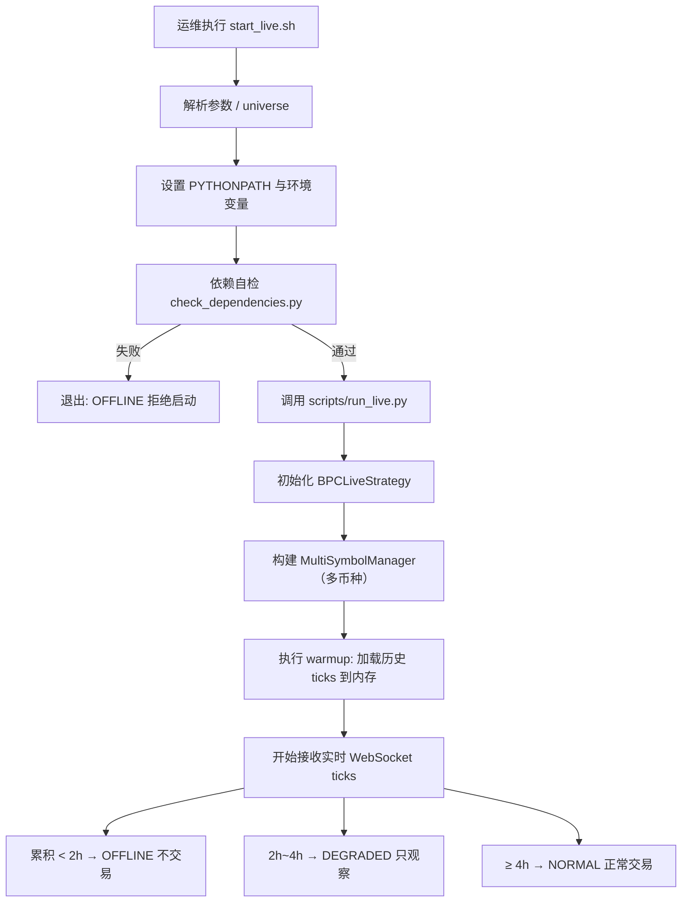
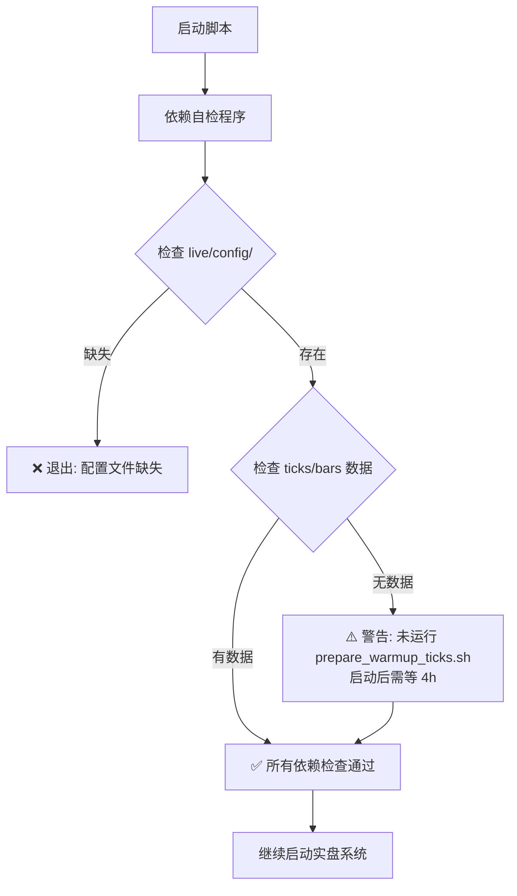
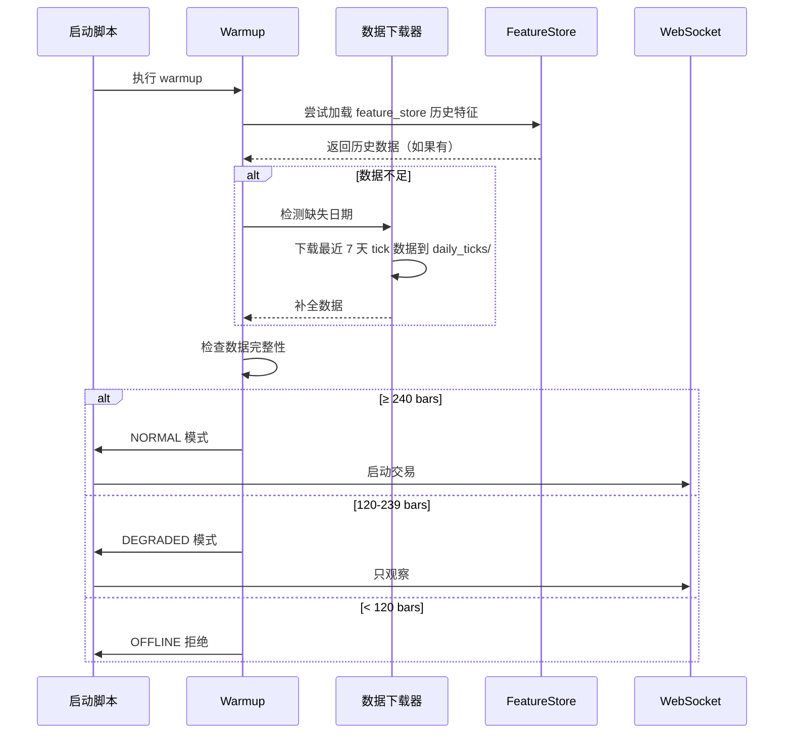

# 实验目的

1. gate，evidence里面有大量数学特征，再次去掉，让数学特征专门去做 noise penalty，把实验报告直接保存到 [z实验_002_bpc实盘](z实验_002_bpc实盘)，方便以后复盘
2. 实盘的启动模块偶尔失败，导致一直启动不了
3. 实盘采用策略B（务实版）：预先 copy 6个月历史 ticks，启动后忽略 gap，等待 4h 进入 NORMAL 模式，不依赖 Feature Store
4. 可以在本地机器长期运行测试
5. 检测初步的监控模板
6. 启动流程加入质量闸门：warmup数据不足时进入DEGRADED模式而非直接交易，防止基于错误特征做决策

# 实验步骤

## 阶段一：特征清理与验证（目标1）

> 优先级：高 | 可与阶段二并行

1. 审计当前实盘配置中 gate.yaml / evidence.yaml 是否残留数学特征（hurst/wpt/spectrum/hilbert）
2. 若有残留，移除并确认 noise_penalty.py 作为唯一消费者
3. 用回测跑一次对比：移除前 vs 移除后的 gate pass_rate、lift、evidence_score 分布
4. 保存对比报告到 z实验_002_bpc实盘/

## 阶段二：启动与补数据稳定性修复（目标2+3）

> 优先级：最高 | "启动不了"是生产事故，必须先修

### 系统运行模式定义（策略B 务实版）

系统支持三种运行模式，根据实时数据累积量自动切换：

| 模式 | 触发条件 | 行为 |
|------|----------|------|
| **NORMAL** | 启动后累积 ≥4h 实时数据（≥240条1min bar） | ✅ 正常交易 |
| **DEGRADED** | 启动后累积 2h~4h 实时数据 | ⚠️ 只观察不交易，接收 ticks 并计算特征 |
| **OFFLINE** | 启动后 <2h 实时数据 | ❌ 不交易，等待数据累积 |

**策略B 核心思路**：
- 预先 copy 6个月历史 ticks → warmup 时加载到内存重建特征状态
- 启动后可能有 gap（历史最后一天 ~ 当前时间），**忽略 gap**
- 等待实时 ticks 累积 4h 后自动进入 NORMAL 开始交易
- **不依赖 Feature Store，不等待补齐 gap**

**模式切换流程**：




### 数据源（策略B）

**Warmup 数据来源**：
- ✅ **月度aggTrades**：`https://data.binance.vision/data/futures/um/monthly/aggTrades/`（离线预下载 6 个月）
- ✅ **每日aggTrades**：`https://data.binance.vision/data/futures/um/daily/aggTrades/`（离线预下载最近 1 个月）
- ✅ **币安WebSocket**：`wss://fstream.binance.com/ws/{symbol}@aggTrade`（实时 tick 流，启动后累积）

**不再依赖**：
- ~~Feature Store~~（live 不需要，所有特征基于 ticks/bars 实时重算）
- ~~GapFiller 在线补数据~~（启动后忽略 gap，靠 4h 等待进入 NORMAL）

### 启动流程（策略B 务实版）



**关键设计决策**：
- Gap（历史最后一天 ~ 启动时间）不补齐，14h gap 对特征影响 <2%
- 等待 4h 实时数据累积即可进入 NORMAL，无需等到次日补全
- 详细分析见 `实盘数据存储与特征计算设计.md` 问题7

## 阶段三：本地长期运行验证（目标4）

> 优先级：中 | 依赖阶段二完成

9. 用历史tick数据做7天模拟实盘回放，观察：
   - 内存占用趋势（是否泄漏）
   - 补数据触发频率与成功率
   - 特征计算延迟 p95
10. 模拟断连场景：随机kill websocket → 观察自动恢复 + 补数据
11. 记录所有异常事件到日志文件，跑完后生成稳定性报告

## 阶段四：监控模板搭建（目标5+6）

> 优先级：中 | 可与阶段三并行

12. 整合现有 Prometheus metrics + live_dashboard，定义5个核心看板指标：
    - Tradeability Score（市场噪声红绿灯）
    - 数据连续性（缺口次数 / 补全耗时）
    - 特征质量（NaN / inf 比例）
    - 执行失效率（MAE / ATR rolling 20）
    - 风险暴露（current_risk / allowed_risk）
13. 写一个轻量级健康检查脚本，定时输出上述指标到日志/文件
14. 设置告警阈值，异常时输出明确告警信息

## 阶段五：综合验收

15. 完整启动一次实盘流程（本地模拟），端到端走通：补数据 → 质量闸门 → 启动 → 监控输出
16. 记录所有量化指标，输出最终实验报告到 z实验_002_bpc实盘/

# 关键文件索引

| 文件 | 用途 |
|------|------|
| config/strategies/bpc/archetypes/execution.yaml | execution层配置，noise_penalty引用 |
| src/time_series_model/execution/noise_penalty.py | 数学特征唯一消费者 |
| src/live_data_stream/multi_symbol_manager.py | warmup_all，当前异常只打warning不重试 |
| scripts/run_live.py | 实盘启动入口，warmup失败后仍调start_all |
| src/live_data_stream/websocket_client.py | WebSocket重连机制 |
| src/order_management/metrics.py | Prometheus指标定义 |
| src/time_series_model/diagnostics/live_dashboard.py | 看板payload |

# 实验记录

## 实盘目录结构（独立部署）

为实现实盘与研发环境完全隔离，所有实盘依赖统一置于`live/`目录：

```
live/                                    # 实盘专用根目录
├── config/                              # 实盘配置（手动同步）
│   ├── constitution/                    # 宪法规则
│   └── strategies/bpc/                  # BPC策略配置
│
├── data/                                # 实盘数据
│   ├── ticks/                           # 1min聚合tick（买卖分离）
│   │   └── BTCUSDT/
│   │       └── 2026-02-*.parquet        # [timestamp, price, volume, side]
│   ├── bars/                            # 1min OHLCV bars
│   │   └── BTCUSDT/
│   │       └── 2026-02-*.parquet        # [timestamp, OHLCV, buy_volume, sell_volume]
│   ├── features_15min/                  # 15分钟特征（实盘产出）
│   ├── features_4h/                     # 4小时特征（实盘产出）
│   └── order_management.db              # 订单状态数据库
│
└── scripts/                             # 实盘脚本
    ├── check_dependencies.py            # 依赖自检程序
    ├── prepare_warmup_ticks.sh          # 准备warmup数据（替代旧的build_feature_store.sh）
    ├── prepare_warmup_ticks.py          # 准备warmup数据 Python实现
    └── start_live.sh                    # 启动脚本（带自检）
```

> 注：不再需要 `feature_store/` 目录，所有特征基于底层 ticks/bars 实时重算。

### 部署流程

**1. 准备 warmup 数据（启动前执行，替代旧的 build_feature_store.sh）**：
```bash
cd /home/yin/trading/ml_trading_bot

# 下载最近6个月 monthly + 最近1个月 daily aggTrades
# 转换为 1min 聚合 ticks/bars 写入 live/highcap/data/
bash live/scripts/prepare_warmup_ticks.sh highcap 6

# 或指定币种
python live/scripts/prepare_warmup_ticks.py --universe highcap --months 6 --symbols BTCUSDT,ETHUSDT
```

- **作用**：为 `highcap` universe 中的全部币种下载并转换最近 6 个月的 1min 聚合 ticks 和 bars。
- **注意**：首次运行需下载约 10-30 分钟；后续重新运行会跳过已下载的文件。
- **产出目录**：`live/highcap/data/ticks/` 和 `live/highcap/data/bars/`

**2. 启动实盘系统**：
```bash
# 默认6个highcap token
./live/scripts/start_live.sh

# 或指定币种
./live/scripts/start_live.sh "BTCUSDT,ETHUSDT,BNBUSDT"
```

**默认Highcap Token列表**：
- BTCUSDT
- ETHUSDT
- BNBUSDT
- SOLUSDT
- XRPUSDT
- ADAUSDT

启动流程自动执行：
- ✅ 依赖自检（config / ticks 数据）
- ✅ 环境变量配置
- ✅ Warmup：加载历史 ticks 到内存重建特征状态
- ✅ 等待 4h 实时数据累积后自动进入 NORMAL
- ✅ 启动质量闸门（OFFLINE拒绝启动）

### 实盘启动流程图




### 依赖检查规则

**强制退出（❌）**：
- 配置文件缺失（constitution、gate.yaml等）

**警告继续（⚠️）**：
- ticks/bars 数据目录为空（启动后靠实时 WebSocket 累积）
- 未运行 prepare_warmup_ticks.sh（warmup 时无历史数据，需等 4h）

## Universe 抽象设计（多币种分组）

为后续支持不同风格/风险档位的多币种组合，引入 **universe** 抽象，将币种分组管理：

- **highcap**：高流动性主流合约（当前默认：BTC/ETH/BNB/SOL/XRP/ADA）
- **alt**：次级资产（预留）
- **meme**：高波动/投机资产（预留）

推荐的实盘目录结构演进为：

```text
live/
├── highcap/                          # highcap universe
│   ├── universe.yaml                 # 币种列表 + 选择理由
│   ├── config/                       # highcap 专用配置（constitution, bpc 等）
│   └── data/                         # highcap 实盘数据
│       ├── ticks/                    # 1min聚合tick（海量历史 + 实时产出）
│       ├── bars/                     # 1min OHLCV bars
│       ├── features_15min/           # 实盘产出的15min特征
│       └── features_4h/              # 实盘产出的4h特征
│
├── alt/                              # alt universe（预留，同上结构）
├── meme/                             # meme universe（预留，同上结构）
└── scripts/                          # 通用脚本（支持不同universe）
    ├── start_live.sh
    ├── prepare_warmup_ticks.sh       # 准备warmup数据（替代旧的build_feature_store.sh）
    ├── prepare_warmup_ticks.py
    └── check_dependencies.py
```

**设计要点**：
- **universe.yaml**：作为币种白名单与选择理由的唯一真相来源；
- **配置隔离**：不同 universe 拥有独立的 `config/`、`data/`，避免高频实验互相污染；
- **不再需要 feature_store/**：所有特征基于 ticks/bars 实时重算；
- **脚本接口**：
  - `bash live/scripts/prepare_warmup_ticks.sh highcap 6` → 下载并转换 6 个月历史 ticks；
  - `bash live/scripts/start_live.sh highcap` → 启动实盘；
- **扩展空间**：后续为 alt / meme 衍生不同 constitution（风险参数）、BPC特征剪裁策略等，只需在对应 universe 目录下维护配置与数据。

> 备注：当前代码实现仍以 `live/` 根目录为主，本节为 **已确认的架构设计约定**，后续演进按此规范逐步落地 highcap/alt/meme 三个 universe。

## 阶段完成状态

### ✅ 阶段二：启动与补数据稳定性（已完成）

**已实现**：
- [x] SystemMode模式管理（NORMAL/DEGRADED/OFFLINE）
- [x] Warmup重试机制（指数退避3次）
- [x] 启动质量闸门（≥120 bars最低阈值）
- [x] 每日数据下载器（BinanceDailyDownloader）
- [x] 实盘独立目录结构（live/）
- [x] 依赖自检程序（check_dependencies.py）
- [x] 单元测试（test_system_mode.py，10/10通过）
- [x] 集成测试（test_live_startup_integration.py，6/7通过）

**测试验证**：
```bash
# 本地测试（2026-02-11）
✅ BPC策略加载成功（13 gate + 9 evidence + 2 filters）
✅ Warmup重试机制工作正常
✅ OFFLINE模式正确拒绝启动（0 bars < 120 bars）
✅ 质量闸门准确拦截数据不足场景
```

（执行过程中逐步填写）

## 附录：图示补充

### 依赖自检程序设计图



### Warmup 与数据补全时序图



### 数据流与实盘架构对比

```mermaid
graph TB
    subgraph "当前研发流程（回测）"
        A1["月度 ZIP 下载"] --> A2["data/agg_data/"]
        A2 --> A3["convert to parquet"]
        A3 --> A4["parquet_data/BTCUSDT_2024-01.parquet"]
        A4 --> A5["feature-store build"]
        A5 --> A6["feature_store/bpc_xxx/BTCUSDT/240T/"]
    end

    subgraph "实盘流程（策略B）"
        B0["离线准备: prepare_warmup_ticks.sh"] --> B1["6个月 monthly + 1个月 daily"]
        B1 --> B2["1min聚合 → live/data/ticks + bars"]
        B2 --> B3["启动: warmup 加载历史 ticks"]
        B3 --> B4["实时 WebSocket 累积 4h"]
        B4 --> B5["NORMAL: 正常交易"]
        B5 --> B6["实时特征计算（基于 ticks/bars）"]
        B6 --> B7["live/data/features_15min + features_4h"]
    end
```


