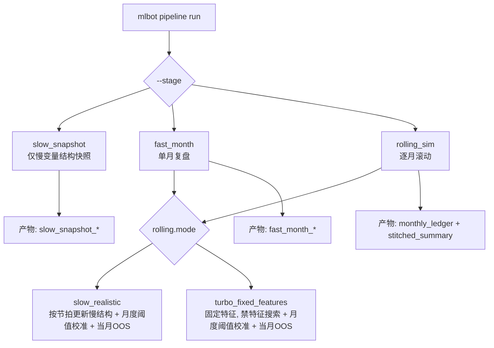

# 实施文档 01：2024 牛市 5x 趋势骑乘（精简版）

## 1. 目标

- 在 2024 牛市窗口验证 `bpc-long-120T`、`me-long-120T` 是否能稳定接近 `5x` 杠杆。
- 验证“先保本再加仓”的风险约束仍成立。
- 验证收益主要来自趋势段，而不是短噪音。

## 2. 两种实验模式（只看这个）

### 模式 A：`slow_realistic`（主实验）

- 每季度：用过去 12 个月更新慢变量结构（特征/结构层）。
- 每月：用过去 3 个月调阈值（prefilter/gate/entry_filter/execution）。
- 当月：只做 OOS 回测并拼接。

### 模式 B：`turbo_fixed_features`（快实验）

- 不做特征搜索（固定特征）。
- 每月只做过去 3 个月阈值校准 + 当月回测。

### 2.1 和另外两套用法怎么区分（命令不是三种并列）

这里容易混成「三种命令」，实际是 **两层叠加**：

1. **经典分段（老管线）**：`--stage full` / `prefilter` / `gate` / `entry_filter` / `execution_opt` / `event_backtest` / `pcm_joint` / `pcm_slot_grid` —— 在**一个**全局数据窗口上跑通或调试某一层（见 `A快速启动命令.md` 相应小节）。
2. **滚动阶段（慢/快变量时间轴）**：`--stage slow_snapshot` / `fast_month` / `rolling_sim` —— 按季/按月推进，做长期 OOS 与拼接（同上文档中的滚动块）。
3. **本节的模式 A / B**：属于 YAML **`rolling.mode`**，仍使用第 2 类的命令（例如 `rolling_sim`）；差别是**是否季更结构、是否做特征搜索**，不是再发明一套 CLI。

**相同点**：同一入口、同一配置家族、底层子步骤一致。  
**不同点**：① 按「层」切；② 按「时间」切；③ 在②之上选 **realism vs turbo**。  
更完整的表格式对照见 **`rolling_long_horizon_pipeline.md` → §2.1**。



## 3. 开跑前检查

- `config/constitution/constitution.yaml`
  - `allow_add_position: true`
  - `max_add_times` 不要太小（建议 >= 3）
- `config/strategies/*/archetypes/execution.yaml`
  - `add_position.max_total_leverage: 5.0`
  - `lock_profit_breakeven_trigger_r` 不要过高
- 配置策略方向建议 long 侧：
  - `strategy_scope.direction: long`

**仓库内 `config/prod_train_pipeline_2h_{strict,turbo}_2024bull.yaml` 已预置**：`direction: long`、`dates.end_date: "2024-12-31"`（锁定 2024 牛市滚动终点；命令行 `--end-date` 仍可覆盖）。管线在未传 `--end-date` 时会读取配置里的 `dates.end_date`。

## 4. 命令模板

### 4.1 `slow_realistic`（推荐）

先准备配置（建议复制一份）：

```bash
cp config/prod_train_pipeline_2h.yaml config/prod_train_pipeline_2h_strict_2024bull.yaml
```

在 `config/prod_train_pipeline_2h_strict_2024bull.yaml` 里确认：

```yaml
rolling:
  mode: slow_realistic
  windows:
    calibration_months: 3
    structure_lookback_months: 12
  slow_realistic:
    cadence_months: 3
    triggered_retrain_enabled: true
```

先单月探针，再跑整段：

```bash
mlbot pipeline run --all \
  --config config/prod_train_pipeline_2h_strict_2024bull.yaml \
  --stage fast_month --month 2024-03

mlbot pipeline run --all \
  --config config/prod_train_pipeline_2h_strict_2024bull.yaml \
  --stage rolling_sim
```

### 4.2 `turbo_fixed_features`（快速）

```bash
cp config/prod_train_pipeline_2h.yaml config/prod_train_pipeline_2h_turbo_2024bull.yaml
```

在 `config/prod_train_pipeline_2h_turbo_2024bull.yaml` 里确认：

```yaml
rolling:
  mode: turbo_fixed_features
  windows:
    calibration_months: 3
  turbo_fixed_features:
    fixed_strategies_root: config/strategies
    disable_feature_search: true
```

如果要跑“只调阈值、不重搜 prefilter、不调 execution 网格”的极速版本，可直接用：

- `config/prod_train_pipeline_2h_turbo_2024bull_thresholds_only.yaml`

```bash
mlbot pipeline run --all \
  --config config/prod_train_pipeline_2h_turbo_2024bull.yaml \
  --stage fast_month --month 2024-03

mlbot pipeline run --all \
  --config config/prod_train_pipeline_2h_turbo_2024bull.yaml \
  --stage rolling_sim
```

## 5. `run_id` 怎么看 / 怎么用

- 每次 `fast_month` / `rolling_sim` 都会生成并打印 `run_id`（时间戳）。
- 主要结果目录：
  - `results/120T/prod_train_history/_rolling_sim/<run_id>/monthly_ledger.jsonl`
  - `results/120T/prod_train_history/_rolling_sim/<run_id>/stitched_summary.json`
- `slow_realistic` 下不需要手工传季度 `run_id`，系统会自动按季度更新并衔接。

## 6. 复盘命令

```bash
mlbot pipeline report-side-state --run-id <rolling_run_id> --config <your_config.yaml>
mlbot pipeline debug-quality --run-id <rolling_run_id> --month 2024-06 --config <your_config.yaml>
mlbot pipeline debug-quality --run-id <rolling_run_id> --month 2024-10 --config <your_config.yaml>
```

## 7. 验收标准（牛市 5x）

- 至少一个主策略 `max_observed_leverage >= 4.5`，目标 `>= 5.0`。
- 加仓交易数 `add_trades > 0`，且趋势月贡献明显。
- `near_stop_rate` 不显著恶化，回撤可接受。

## 8. 失败排查顺序

1. `allow_add_position` 是否开启。  
2. `max_total_leverage` 是否为 `5.0`。  
3. `lock_profit_breakeven_trigger_r` 是否过高。  
4. `max_add_times` 是否太小。  
5. 方向范围是否误配（long/short）。
